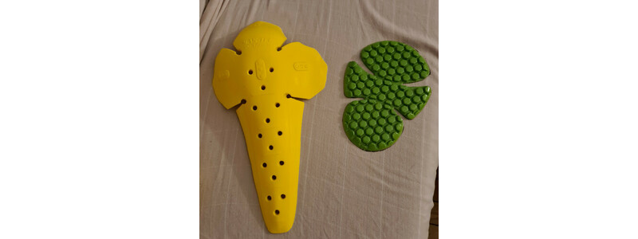

Je décris dans cet article 3 méthodes permettant de combler les zones vides d'une image lorsqu'on l'agrandit, une technique basique, et 2 s'appuyant sur l'image initiale, pour un remplissage plus naturel.
A la fin de l'article, je donne un script shell permettant de générer les 3 versions pour une image donnée.

<!--more-->

## Méthode 1 : Remplir des zones vides par un fond uni


```sh
convert IMAGESOURCE -resize XxY -background white -gravity center -extent XxY IMAGECIBLE
```

_NB :_ Remplacer XxY par les dimensions souhaitées et "_white_" par la couleur souhaitée.

Exemple :




## Méthode 2 : Remplir les zones vides en surimposant l'image sur sa version floue et déformée

Inspiration : 

> _Fred/fmw42_ dans cette page de forum : [ImageMagick - Keep Aspect Ratio on Resize and Fill with Blur Background](https://legacy.imagemagick.org/discourse-server/viewtopic.php?t=28035).

```sh
convert IMAGESOURCE \( -clone 0 -blur 0x9 -resize XxY\! \) \( -clone 0 -resize XxY \) -delete 0 -gravity center -compose over -composite  IMAGECIBLE
```

_NB :_ Remplacer XxY par les dimensions souhaitées.


Exemple :


## Méthode 3 : Remplissage des zones vides par extrapolation

Inspiration : 

> _Fred/fmw42_ dans cette page de forum : [ImageMagick - turn image with borders into full bleed image](https://legacy.imagemagick.org/discourse-server/viewtopic.php?t=26928).

Le code est un peu long, je ne le met pas ici, il se trouve dans le script _shell_ plus bas.

Exemple :


Le résultat est assez bluffant, si les dimensions ne sont pas trop éloignées de l'original, il faut parfois regarder de près les zones extrapolées pour réaliser qu'elles sont artificielles (ici en 300x300) :


En revanche les grands aplats de blanc ne lui conviennent pas :


## Script shell

Ce script shell prend tous les fichiers du sous-répertoire _"a_traiter/"_ et produit les résultats selon les 3 modes dans le répertoire _"res/"_ .

- Mode 1 : Voronoi ;
- Mode 2 : Extension ;
- Mode 3 : Aplat de blanc.

Mise en place :

```sh
mkdir gen_thumb_sparse_voronoi
cd gen_thumb_sparse_voronoi
mkdir a_traiter res
touch gen_thumb_sparse_voronoi.sh
```

Editer le fichier _"gen_thumb_sparse_voronoi.sh"_ et y mettre :


```sh
#!/bin/bash

for fic in a_traiter/*
do
	echo ${fic}
	ficsource=$(basename ${fic})
	xcible=800
	ycible=300
	size=${xcible}x${ycible}
	convert ${fic} -resize ${size} res/tmp.png 

	xoff=`convert res/tmp.png -format "%w" info:`
	yoff=`convert res/tmp.png -format "%h" info:`
	yoff=$(((${ycible}-${yoff})/2))
	xoff=$(((${xcible}-${xoff})/2))
	vcoords="${size}-${xoff}-${yoff}"
	echo ${vcoords}
	convert res/tmp.png -transparent white +repage \( -clone 0 -alpha off -sparse-color Voronoi \
	"9,9 rgb(255,8,8)  969,9 rgb(255,255,8)  969,669 rgb(255,255,248)  9,669 rgb(255,248,248)" \) \
	+swap -compose over -composite \
	-define distort:viewport=${size}-${xoff}-${yoff} +distort SRT 0 +repage res/${ficsource}.mode1.jpg
	rm -f res/tmp.png
	
	convert ${fic} -resize ${xcible}x${ycible} -background white -gravity center -extent ${xcible}x${ycible} res/${ficsource}.mode2.jpg
	
	convert ${fic} \( -clone 0 -blur 0x9 -resize ${xcible}x${ycible}\! \) \( -clone 0 -resize ${xcible}x${ycible} \) -delete 0 -gravity center -compose over -composite res/${ficsource}.mode3.jpg
done
```

Il n'y a plus qu'à mettre une image dans le répertoire _"a_traiter/"_ et lancer le script :

```sh
cd gen_thumb_sparse_voronoi/
./gen_thumb_sparse_voronoi.sh
```

Le résultat sera produit dans _"res/"_.

> Note : Pour modifier les dimensions cible, il suffit de changer les xcible=800 et ycible=300.


