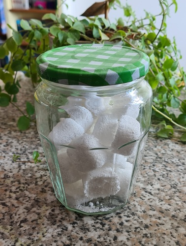
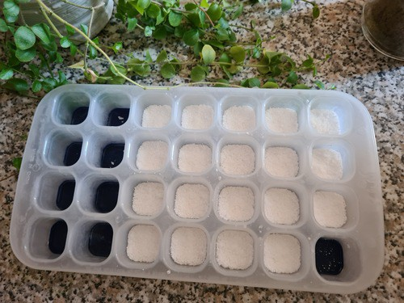

Depuis peu je fabrique moi-même mes galets de lave-vaisselle.

Les proportions viennent de l'article [lilycraftblog - Tablettes pour le lave-vaisselle fait maison, éco et naturel!](https://lilycraftblog.com/faire-des-tablettes-lave-vaisselle-maison/), ce mélange fonctionne très bien, les verres sont bien transparents et la vaisselle est bien propre.

**Ingrédients pour environ 20 tablettes :**

- 60 g d’acide citrique
- 40 g de cristaux de soude en poudre
- 30 g de percarbonate de sodium
- 30 g de bicarbonate de soude

**Fabrication :**

1. Je mets tout dans un saladier, je mélange au fouet.
2. J'utilise un spray pour asperger de l'eau dessus : Un ou deux pshits et je remue tout de suite au fouet pour arrêter la réaction. Je recommence une ou deux fois jusqu'à ce que le mélange devienne grumeleux et paraisse légèrement humide au toucher.
3. Je remplis un bac à glaçons en tassant bien (une cuillère pour verser et le bout du doigt pour tasser - attention c'est un peu corrosif, certains utilisent un ustensile style bouchon en liège pour tasser)
4. Je laisse reposer une nuit avant de démouler.

