Lorsque la norme EN 17092 est entrée en vigueur en 2019/2020, les journaux moto prédisaient que les blousons/pantalons au niveau AAA seraient plutôt dédiés à un usage piste.
2 ans plus tard force est de constater que les modèles se multiplient et ne sont pas spécifiquement typés circuit.

J'ai identifié une quarantaine de modèles, hommes comme femmes, les premiers prix sont autour de 250 euros (210-220 en promotion).

<!--more-->

J’ai mis le lien Motoblouz/Dafy/autre et une idée des prix lorsque c’était possible _(note : Je peux toucher quelques centimes si vous passez par un de mes liens pour acheter sur le site Motoblouz)_.

> _Edit du 01/10/2022 : Ajout des liens Vinted et Leboncoin._  
> _Edit du 12/10/2022 : Ajout des marques Rokker et PMJ._  
> _Edit du 16/10/2022 : Ajout des marques Goldtop et BMW._  
> _Edit du 23/10/2022 : Ajout de la marque Halvarssons._  
> _Edit du 03/11/2022 : Ajout des marques John Doe et Knox._  
> _Edit du 07/11/2022 : Ajout des marques Resurgence Gear et Spidi et complément sur la protection des matériaux (cuir VS tissus techniques), l'ancienne norme EN 13595 et les évaluations Motocap._  
> 

# Explications sur la norme EN 17092:20xx

La norme européenne EN 17092 impose d'afficher sur les étiquettes des blousons et pantalons moto une mesure précise sur leur niveau de protection, matérialisée par une étiquette comme celle-ci :

Une explication sur le site "Demonerosso" de Dainese ici : [comment fonctionnent les certifications des vestes et pantalons moto](https://demonerosso.dainese.com/fr/comment-fonctionnent-les-certifications-des-vestes-et-pantalons-de-moto)
(paradoxalement, Dainese ne publie pas le niveau de protection de ses blousons et pantalons...).

Une autre sur le site de VQuattro ici :[NORMES CE DES BLOUSONS MOTO](https://vquattro.com/conseils/normes-ce/normes-ce-pantalons-blousons-moto/)

Il faut essentiellement retenir que le corps est divisé en 3 zones, qui doivent résister à des tests d'abrasion, de déchirure et d'éclatement des coutures différents en fonction de leur exposition.

L'abrasion n'est pas le seul critère mais elle donne une bonne idée des différences entres niveaux A, AA, et AAA :  
L'échantillon de tissu est soumis à une chute simulée à une vitesse donnée, avec frottement jusqu'à immobilisation, il ne doit pas comporter de trou de plus de 5 mm pour être certifié.  
Les vitesses de chute par niveau :

- AAA :
    - Zone 1 : Chute à 120 km/h
    - Zone 2 : Chute à 75 km/h
    - Zone 3 : Chute à 45 km/h
- AA :
    - Zone 1 : Chute à 70 km/h
    - Zone 2 : Chute à 45 km/h
    - Zone 3 : Chute à 25 km/h
- A :
    - Zone 1 : Chute à 45 km/h
    - Zone 2 : Chute à 25 km/h
    - Zone 3 : Non testée

(_A garder en tête :_ Le revêtement sur lequel les tests sont effectués est en ciment, c'est beaucoup moins abrasif que le bitume de nos routes)

Les 2 autres niveaux, B et C, sont sans grand intérêt : Le B est un A sans coques, et le C propose une protection vraiment très faible.

> Notes du 07/11/2022 :  
> 1) Cuir VS fibres de la NASA ?  
> La norme EN 17092 permet de s'assurer que le vêtement dépasse un seuil de résistance donné pour des types d'agressions précis. Rien ne permet de savoir si ce vêtement le dépasse tout juste ou très largement.  
> A niveau de certification égal, les différents comparatifs semblent toujours mettre le cuir en premier, suivi des tissus techniques multi-couches et enfin des tissus techniques mono-couche.  
> Quelques sources :  
> Discussions argumentées tournant autour des pantalons multi ou mono-couche [ici (advrider)](https://www.advrider.com/f/threads/single-layer-vs-double-layer-jeans-test-video.1550527/), [ici (advrider)](https://www.advrider.com/f/threads/single-layer-jeans-a-few-models-compared.1551669/), [ici (Hood Jeans)](https://www.hoodjeans.co.uk/single-layer-motorcycle-jeans/).  
> On y trouve une très intéressante interview vidéo de Chris Hurren, un des chercheurs derrière le site australien [Motocap](https://www.motocap.com.au/) qui effectue des tests indépendants selon des critères assez proches de l'ancienne norme EN 13595.

> 2) Quid de l'ancienne norme EN 13595 de 2002, ou la variante française de 2012 ?  
> Plusieurs commentateurs indiquent que ces 2 anciennes normes étaient plus exigeantes dès leur niveau 1, que l'EN 17092 niveau AAA. En contrepartie elles n'étaient ni obligatoires, ni (apparemment) appliquées à la lettre.
> Difficile de dire si on y a gagné ou perdu (sûrement un peu des deux), en attendant nos avons à présent l'EN 17092, autant essayer d'en tirer le maximum !

> 3) Existe-t-il d'autres types d'évaluation ?  
> L'organisme australien [Motocap](https://www.motocap.com.au/) (composé d'associations, universitaires, acteurs publics et privés) réalise ses propres tests de vêtements selon des principes différents :
> Leurs tests d'abrasion sont par exemple plus exigeants en raison des revêtements australiens et néo-zélandais qui sont plus abrasifs que l'asphalt ("chip-seal"). Ils réalisent un test de "breathability" (évacuation de l'humidité) qui a tout son sens pour les chaleurs australiennes, et sera utile à ceux qui vivent sous les tropiques ou cherchent un blouson pour les étés caniculaires.
> Malheureusement peu de blousons de cette liste y sont testés pour le moment :  
> Je n'ai trouvé que le SABRE CE de RST [ici](https://www.motocap.com.au/product/sabre-ce) (pensez à ouvrir le pdf "test report>technical report" pour le bilan détaillé).  

# Note sur les fabricants et la transparence

Les fabricants sont moyennement transparents sur leurs sites en ce qui concerne la certification obtenue par leurs blousons, mais l'info est tout de même plus souvent présente que pour les bottes et les gants. 

Ceux chez qui j'ai trouvé ces infos :

- Avec des modèles AAA :
    - [ALPINESTARS](https://www.alpinestars.com/) : La certification est souvent (pas toujours) indiquée dans le texte de la page ;
    - [BERING](https://bering.fr/) : La certification est souvent indiquée dans le texte de la page ;
    - [BMW](https://www.bmw-motorrad.fr) : La certification est absente du site officile, elle est parfois disponible sur le site du distributeur [bmw.europe-moto.com](https://bmw.europe-moto.com) ;
    - [ROKKER](https://www.therokkercompany.com/) : La certification est souvent indiquée dans le texte de la page ;
    - [RST](https://www.rst-moto.com/fr/)) : La certification est souvent indiquée dans le texte de la page ;
    - [FURYGAN](https://www.furygan.com/) : Le PDF "fiche technique" contient souvent le niveau de certification ;
    - [GOLDTOP](https://goldtop.co.uk) : La certification est souvent indiquée dans le texte de la page ;
    - [HALVARSSONS](https://halvarssonsmc.com/) : La certification est **toujours** indiquée dans le texte de la page ;
    - [IXON](https://www.ixon.com/fra-fr/) : La certification est souvent présente sous forme d'image ;
    - [IXS](https://ixs.com/) : La certification est souvent indiquée dans le texte de la page ;
    - [JOHN DOE](https://www.ridejohndoe.com) : La certification est **toujours** indiquée dans le texte de la page ;
    - [KLIM](https://www.klim.com/) : La certification est souvent indiquée dans le texte de la page ;
    - [KNOX](https://www.planet-knox.com) : La certification est souvent indiquée dans le texte de la page ;
    - [MERLIN](https://www.merlinbikegear.com/) : La certification est souvent indiquée dans le texte de la page ;
    - [PMJ](https://www.pmj.it/) : La certification est **toujours** indiquée dans le texte de la page ;
    - [RESURGENCE GEAR](https://resurgencegear.net/) : La certification est **toujours** indiquée dans le texte de la page ;
    - [REV'IT](https://www.revitsport.com/fr/) : La certification est **toujours** indiquée dans le texte de la page ;
    - [RST](https://www.rst-moto.com/fr/) : La certification est souvent indiquée dans le texte de la page ;
    - [SEGURA](https://segura-moto.fr/) : La certification est souvent indiquée dans le texte de la page ;
    - [SPIDI](https://www.spidi.com/) : La certification est souvent indiquée dans le texte de la page ;
- Sans modèles AAA (mais plusieurs modèles AA) :
     - [BOGOTTO (FC-Moto)](https://www.fc-moto.de/Marken/B/Bogotto/) : La certification est souvent indiquée dans le texte de la page ;
     - [COURSE (XLMoto)](https://www.xlmoto.com/) : La certification est souvent indiquée dans le texte de la page ;
    - [DXR (Motoblouz)](https://www.motoblouz.com) : La certification est souvent indiquée dans le texte de la page, sinon elle se trouve dans le PDF "certificat de conformité" ;
    - [HIGHWAY 1, FASTWAY, REKURV, VANUCCI, DETLEV LOUIS, PROBIKER (Louis moto)](https://www.louis-moto.fr) : La certification est souvent indiquée dans le texte de la page ;
    - [HELSTONS](https://www.helstons.net/) : La certification est parfois indiquée dans le texte de la page ;
    - [HEVIK](https://www.hevik.co.uk) : La certification est parfois indiquée dans le texte de la page ;
    - [O'NEAL](https://www.oneal.eu/) : La certification est **toujours** indiquée dans le texte de la page ;
    - [RUSTY STITCHES](https://www.rustystitches.com/) : La certification est **toujours** indiquée dans le texte de la page ;
    - [SEVENTY DEGREES](https://seventy-70.com/en/) : La certification est souvent indiquée dans le texte de la page.

La liste des autres fabricants que j'ai parcourus mais dont les sites ne publient pas les niveaux de certification de leurs blousons se trouve en annexe en fin de document.  
Si l'un d'entre eux évolue ou si vous en connaissez d'autres, n'hésitez pas à me prévenir en commentaire, et je les ajouterai à la prochaine version de ce document.

# Inventaire des blousons EN 17092:20xx - AAA

## ALPINESTARS :

 | Modèle | Photos |
|---|---|
|            **[ALPINESTARS - FUSION](https://www.alpinestars.com/products/fusion-leather-jacket)**             EN-17092-20xx-AAA    **BLOUSON ETE**             Prix en ligne au moment de la rédaction :  - [Rechercher sur Motoblouz](https://pkw.motoblouz.com/?P4122157BDFF171&redir=https%3A%2F%2Fwww.motoblouz.com%2Frecherche%2FALPINESTARS%2520FUSION.html)   - [712,45 €](https://www.dafy-moto.com/recherche?string=ALPINESTARS%20FUSION) (Dafy)     Pour les rechercher en occasion :              |  |
|            **[ALPINESTARS - MISSILE IGNITION V2](https://www.alpinestars.com/products/missile-v2-ignition-leather-jacket)**             EN-17092-20xx-AAA             Prix en ligne au moment de la rédaction :  - [569,90 €](https://pkw.motoblouz.com/?P4122157BDFF171&redir=https%3A%2F%2Fwww.motoblouz.com%2Frecherche%2FALPINESTARS%2520MISSILE%2520IGNITION%2520V2.html) (Motoblouz)   - [569,95 €](https://www.dafy-moto.com/recherche?string=ALPINESTARS%20MISSILE%20IGNITION%20V2) (Dafy)     Pour les rechercher en occasion :              |  |
|            **[ALPINESTARS - MISSILE V2](https://www.alpinestars.com/products/missile-v2-leather-jacket)**             EN-17092-20xx-AAA             Prix en ligne au moment de la rédaction :  - [522,40 €](https://pkw.motoblouz.com/?P4122157BDFF171&redir=https%3A%2F%2Fwww.motoblouz.com%2Frecherche%2FALPINESTARS%2520MISSILE%2520V2.html) (Motoblouz)   - [522,45 €](https://www.dafy-moto.com/recherche?string=ALPINESTARS%20MISSILE%20V2) (Dafy)     Pour les rechercher en occasion :              |  |
|            **[ALPINESTARS - MISSILE V2 AIRFLOW](https://www.alpinestars.com/products/missile-v2-airflow-leather-jacket)**             EN-17092-20xx-AAA             Prix en ligne au moment de la rédaction :  - [522,40 €](https://pkw.motoblouz.com/?P4122157BDFF171&redir=https%3A%2F%2Fwww.motoblouz.com%2Frecherche%2FALPINESTARS%2520MISSILE%2520V2%2520AIRFLOW.html) (Motoblouz)   - [522,45 €](https://www.dafy-moto.com/recherche?string=ALPINESTARS%20MISSILE%20V2%20AIRFLOW) (Dafy)     Pour les rechercher en occasion :              |  |
|            **[ALPINESTARS - STELLA KIRA](https://www.alpinestars.com/products/stella-kira-leather-jacket)**             EN-17092-20xx-AAA             Prix en ligne au moment de la rédaction :  - [455,90 €](https://pkw.motoblouz.com/?P4122157BDFF171&redir=https%3A%2F%2Fwww.motoblouz.com%2Frecherche%2FALPINESTARS%2520STELLA%2520KIRA.html) (Motoblouz)   - [455,95 €](https://www.dafy-moto.com/recherche?string=ALPINESTARS%20STELLA%20KIRA) (Dafy)     Pour les rechercher en occasion :              |  |
|            **[ALPINESTARS - STELLA KIRA V2](https://www.alpinestars.com/products/stella-kira-v2-leather-jacket)**             EN-17092-2016-AAA             Prix en ligne au moment de la rédaction :  - [455,90 €](https://pkw.motoblouz.com/?P4122157BDFF171&redir=https%3A%2F%2Fwww.motoblouz.com%2Frecherche%2FALPINESTARS%2520STELLA%2520KIRA%2520V2.html) (Motoblouz)   - [455,95 €](https://www.dafy-moto.com/recherche?string=ALPINESTARS%20STELLA%20KIRA%20V2) (Dafy)     Pour les rechercher en occasion :              |  |
|            **[ALPINESTARS - STELLA MISSILE V2](https://www.alpinestars.com/products/stella-missile-v2-leather-jacket)**             EN-17092-20xx-AAA             Prix en ligne au moment de la rédaction :  - [531,90 €](https://pkw.motoblouz.com/?P4122157BDFF171&redir=https%3A%2F%2Fwww.motoblouz.com%2Frecherche%2FALPINESTARS%2520STELLA%2520MISSILE%2520V2.html) (Motoblouz)   - [531,95 €](https://www.dafy-moto.com/recherche?string=ALPINESTARS%20STELLA%20MISSILE%20V2) (Dafy)     Pour les rechercher en occasion :              |  |

## BERING :

 | Modèle | Photos |
|---|---|
|            **[BERING - ATOMIC](https://bering.fr/homme/blouson/atomic.html?___store=)**             EN-17092-20xx-AAA             Prix en ligne au moment de la rédaction :  - [379,90 €](https://pkw.motoblouz.com/?P4122157BDFF171&redir=https%3A%2F%2Fwww.motoblouz.com%2Frecherche%2FBERING%2520ATOMIC.html) (Motoblouz)   - [379,99 €](https://www.dafy-moto.com/recherche?string=BERING%20ATOMIC) (Dafy)     Pour les rechercher en occasion :              |  |
|            **[BERING - FIGHT-R](https://bering.fr/homme/blouson/fight-r.html?___store=)**             EN-17092-20xx-AAA             Prix en ligne au moment de la rédaction :  - [Rechercher sur Motoblouz](https://pkw.motoblouz.com/?P4122157BDFF171&redir=https%3A%2F%2Fwww.motoblouz.com%2Frecherche%2FBERING%2520FIGHT-R.html)   - [Rechercher sur Dafy](https://www.dafy-moto.com/recherche?string=BERING%20FIGHT-R)    Pour les rechercher en occasion :              |  |
|            **[BERING - HOBART](https://bering.fr/homme/blouson/hobart.html?___store=)**             EN-17092-20xx-AAA             Prix en ligne au moment de la rédaction :  - [446,40 €](https://pkw.motoblouz.com/?P4122157BDFF171&redir=https%3A%2F%2Fwww.motoblouz.com%2Frecherche%2FBERING%2520HOBART.html) (Motoblouz)   - [446,49 €](https://www.dafy-moto.com/recherche?string=BERING%20HOBART) (Dafy)     Pour les rechercher en occasion :              |  |

## BMW :

 | Modèle | Photos |
|---|---|
|            **[BMW - DOWNFORCE 2022](https://bmw.europe-moto.com/gb/motorcycle-jackets-bmw-motorrad/20382-23894-bmw-motorcycle-jacket-downforce-men.html#/358-size-60)**             EN-17092-20xx-AAA             Prix en ligne au moment de la rédaction :  - bmw.europe-moto.com : [607,05 €](https://bmw.europe-moto.com/gb/motorcycle-jackets-bmw-motorrad/20382-23894-bmw-motorcycle-jacket-downforce-men.html#/358-size-60)  - [Rechercher sur Motoblouz](https://pkw.motoblouz.com/?P4122157BDFF171&redir=https%3A%2F%2Fwww.motoblouz.com%2Frecherche%2FBMW%2520DOWNFORCE%25202022.html)   - [Rechercher sur Dafy](https://www.dafy-moto.com/recherche?string=BMW%20DOWNFORCE%202022)    Pour les rechercher en occasion :              | 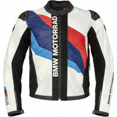 |

## FURYGAN :

 | Modèle | Photos |
|---|---|
|            **[FURYGAN - ALBA](https://www.furygan.com/Produits.aspx?l=alba&prod=369552017&cat=19380)**             EN-17092-2020 AAA             Prix en ligne au moment de la rédaction :  - [408,40 €](https://pkw.motoblouz.com/?P4122157BDFF171&redir=https%3A%2F%2Fwww.motoblouz.com%2Frecherche%2FFURYGAN%2520ALBA.html) (Motoblouz)   - [408,40 €](https://www.dafy-moto.com/recherche?string=FURYGAN%20ALBA) (Dafy)     Pour les rechercher en occasion :              |  |
|            **[FURYGAN - GHOST](https://www.furygan.com/Produits.aspx?l=ghost&prod=195512890&cat=19380)**             EN-17092-2020 AAA             Prix en ligne au moment de la rédaction :  - [474,90 €](https://pkw.motoblouz.com/?P4122157BDFF171&redir=https%3A%2F%2Fwww.motoblouz.com%2Frecherche%2FFURYGAN%2520GHOST.html) (Motoblouz)   - [474,90 €](https://www.dafy-moto.com/recherche?string=FURYGAN%20GHOST) (Dafy)     Pour les rechercher en occasion :              |  |
|            **[FURYGAN - LIVIA](https://www.furygan.com/Produits.aspx?l=livia&prod=369552018&cat=19380)**             EN-17092-2020 AAA             Prix en ligne au moment de la rédaction :  - [408,40 €](https://pkw.motoblouz.com/?P4122157BDFF171&redir=https%3A%2F%2Fwww.motoblouz.com%2Frecherche%2FFURYGAN%2520LIVIA.html) (Motoblouz)   - [408,40 €](https://www.dafy-moto.com/recherche?string=FURYGAN%20LIVIA) (Dafy)     Pour les rechercher en occasion :              |  |
|            **[FURYGAN - NITROS](https://www.furygan.com/Produits.aspx?l=nitros&prod=264274666&cat=19380)**             EN-17092-2020 AAA             Prix en ligne au moment de la rédaction :  - [398,90 €](https://pkw.motoblouz.com/?P4122157BDFF171&redir=https%3A%2F%2Fwww.motoblouz.com%2Frecherche%2FFURYGAN%2520NITROS.html) (Motoblouz)   - [398,90 €](https://www.dafy-moto.com/recherche?string=FURYGAN%20NITROS) (Dafy)     Pour les rechercher en occasion :              |  |
|            **[FURYGAN - PRO ONE](https://www.furygan.com/Produits.aspx?l=pro-one&prod=412497136&cat=19380)**             EN-17092-2020 AAA             Prix en ligne au moment de la rédaction :  - [408,40 €](https://pkw.motoblouz.com/?P4122157BDFF171&redir=https%3A%2F%2Fwww.motoblouz.com%2Frecherche%2FFURYGAN%2520PRO%2520ONE.html) (Motoblouz)   - [408,40 €](https://www.dafy-moto.com/recherche?string=FURYGAN%20PRO%20ONE) (Dafy)     Pour les rechercher en occasion :              |  |
|            **[FURYGAN - RAPTOR EVO 2](https://www.furygan.com/Produits.aspx?l=raptor-evo-2&prod=264274667&cat=19380)**             EN-17092-2020 AAA             Prix en ligne au moment de la rédaction :  - [474,90 €](https://pkw.motoblouz.com/?P4122157BDFF171&redir=https%3A%2F%2Fwww.motoblouz.com%2Frecherche%2FFURYGAN%2520RAPTOR%2520EVO%25202.html) (Motoblouz)   - [474,90 €](https://www.dafy-moto.com/recherche?string=FURYGAN%20RAPTOR%20EVO%202) (Dafy)     Pour les rechercher en occasion :              |  |
|            **[FURYGAN - SHERMAN EVO](https://www.furygan.com/Produits.aspx?l=sherman-evo&prod=369552015&cat=19380)**             EN-17092-2020 AAA             Prix en ligne au moment de la rédaction :  - [446,40 €](https://pkw.motoblouz.com/?P4122157BDFF171&redir=https%3A%2F%2Fwww.motoblouz.com%2Frecherche%2FFURYGAN%2520SHERMAN%2520EVO.html) (Motoblouz)   - [446,40 €](https://www.dafy-moto.com/recherche?string=FURYGAN%20SHERMAN%20EVO) (Dafy)     Pour les rechercher en occasion :              |  |

## GOLDTOP :

 | Modèle | Photos |
|---|---|
|            **[GOLDTOP - THE 1958](https://goldtop.co.uk/collections/jackets/products/the-1958-jacket?variant=37942673342635)**             EN-17092-2020-AAA             Prix en ligne au moment de la rédaction :  - Goldtop : [341,00 €](https://goldtop.co.uk/collections/jackets/products/the-1958-jacket?variant=37942673342635)  - [Rechercher sur Motoblouz](https://pkw.motoblouz.com/?P4122157BDFF171&redir=https%3A%2F%2Fwww.motoblouz.com%2Frecherche%2FGOLDTOP%2520THE%25201958.html)   - [Rechercher sur Dafy](https://www.dafy-moto.com/recherche?string=GOLDTOP%20THE%201958)    Pour les rechercher en occasion :              | 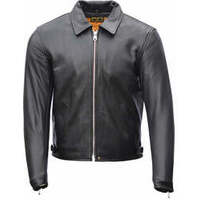 |
|            **[GOLDTOP - THE 1959](https://goldtop.co.uk/collections/jackets/products/the-1959-jacket?variant=37942674358443)**             EN-17092-2020-AAA             Prix en ligne au moment de la rédaction :  - Goldtop : [341,00 €](https://goldtop.co.uk/collections/jackets/products/the-1959-jacket?variant=37942674358443)  - [Rechercher sur Motoblouz](https://pkw.motoblouz.com/?P4122157BDFF171&redir=https%3A%2F%2Fwww.motoblouz.com%2Frecherche%2FGOLDTOP%2520THE%25201959.html)   - [Rechercher sur Dafy](https://www.dafy-moto.com/recherche?string=GOLDTOP%20THE%201959)    Pour les rechercher en occasion :              | 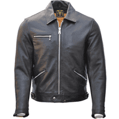 |
|            **[GOLDTOP - THE 617](https://goldtop.co.uk/collections/jackets/products/the-617-jacket?variant=40127501598891)**             EN-17092-2020-AAA             Prix en ligne au moment de la rédaction :  - Goldtop : [341,00 €](https://goldtop.co.uk/collections/jackets/products/the-617-jacket?variant=40127501598891)  - [Rechercher sur Motoblouz](https://pkw.motoblouz.com/?P4122157BDFF171&redir=https%3A%2F%2Fwww.motoblouz.com%2Frecherche%2FGOLDTOP%2520THE%2520617.html)   - [Rechercher sur Dafy](https://www.dafy-moto.com/recherche?string=GOLDTOP%20THE%20617)    Pour les rechercher en occasion :              | 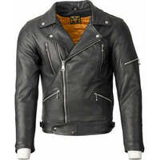 |
|            **[GOLDTOP - THE 619 REBEL](https://goldtop.co.uk/collections/jackets/products/the-619-rebel-jacket?variant=37942603382955)**             EN-17092-2020-AAA             Prix en ligne au moment de la rédaction :  - Goldtop : [371,00 €](https://goldtop.co.uk/collections/jackets/products/the-619-rebel-jacket?variant=37942603382955)  - [Rechercher sur Motoblouz](https://pkw.motoblouz.com/?P4122157BDFF171&redir=https%3A%2F%2Fwww.motoblouz.com%2Frecherche%2FGOLDTOP%2520THE%2520619%2520REBEL.html)   - [Rechercher sur Dafy](https://www.dafy-moto.com/recherche?string=GOLDTOP%20THE%20619%20REBEL)    Pour les rechercher en occasion :              | 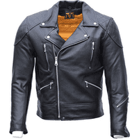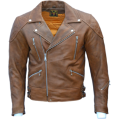 |
|            **[GOLDTOP - THE 68 CAFE RACER](https://goldtop.co.uk/collections/jackets/products/the-68-cafe-racer-jacket?variant=37942677962923)**             EN-17092-2020-AAA             Prix en ligne au moment de la rédaction :  - Goldtop : [371,00 €](https://goldtop.co.uk/collections/jackets/products/the-68-cafe-racer-jacket?variant=37942677962923)  - [Rechercher sur Motoblouz](https://pkw.motoblouz.com/?P4122157BDFF171&redir=https%3A%2F%2Fwww.motoblouz.com%2Frecherche%2FGOLDTOP%2520THE%252068%2520CAFE%2520RACER.html)   - [Rechercher sur Dafy](https://www.dafy-moto.com/recherche?string=GOLDTOP%20THE%2068%20CAFE%20RACER)    Pour les rechercher en occasion :              | 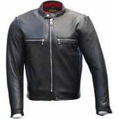 |
|            **[GOLDTOP - THE 72 EASY RIDER](https://goldtop.co.uk/collections/jackets/products/the-72-easy-rider-jacket?variant=37942696280235)**             EN-17092-2020-AAA             Prix en ligne au moment de la rédaction :  - Goldtop : [371,00 €](https://goldtop.co.uk/collections/jackets/products/the-72-easy-rider-jacket?variant=37942696280235)  - [Rechercher sur Motoblouz](https://pkw.motoblouz.com/?P4122157BDFF171&redir=https%3A%2F%2Fwww.motoblouz.com%2Frecherche%2FGOLDTOP%2520THE%252072%2520EASY%2520RIDER.html)   - [Rechercher sur Dafy](https://www.dafy-moto.com/recherche?string=GOLDTOP%20THE%2072%20EASY%20RIDER)    Pour les rechercher en occasion :              | 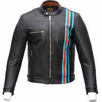 |
|            **[GOLDTOP - THE 74 SCUFTUF](https://goldtop.co.uk/collections/jackets/products/the-74-scuftuf-jacket?variant=37942683926699)**             EN-17092-2020-AAA             Prix en ligne au moment de la rédaction :  - Goldtop : [371,00 €](https://goldtop.co.uk/collections/jackets/products/the-74-scuftuf-jacket?variant=37942683926699)  - [Rechercher sur Motoblouz](https://pkw.motoblouz.com/?P4122157BDFF171&redir=https%3A%2F%2Fwww.motoblouz.com%2Frecherche%2FGOLDTOP%2520THE%252074%2520SCUFTUF.html)   - [Rechercher sur Dafy](https://www.dafy-moto.com/recherche?string=GOLDTOP%20THE%2074%20SCUFTUF)    Pour les rechercher en occasion :              | 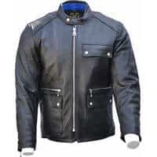 |
|            **[GOLDTOP - THE 76 CAFE RACER](https://goldtop.co.uk/collections/jackets/products/the-76-cafe-racer-jacket?variant=37942586409131)**             EN-17092-2020-AAA             Prix en ligne au moment de la rédaction :  - Goldtop : [371,00 €](https://goldtop.co.uk/collections/jackets/products/the-76-cafe-racer-jacket?variant=37942586409131)  - [Rechercher sur Motoblouz](https://pkw.motoblouz.com/?P4122157BDFF171&redir=https%3A%2F%2Fwww.motoblouz.com%2Frecherche%2FGOLDTOP%2520THE%252076%2520CAFE%2520RACER.html)   - [Rechercher sur Dafy](https://www.dafy-moto.com/recherche?string=GOLDTOP%20THE%2076%20CAFE%20RACER)    Pour les rechercher en occasion :              | 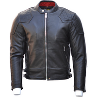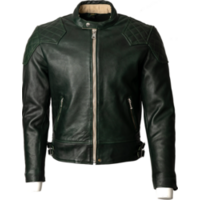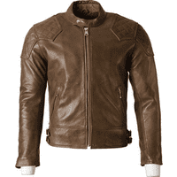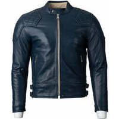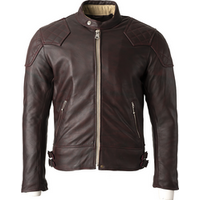 |
|            **[GOLDTOP - THE BOBBER](https://goldtop.co.uk/collections/jackets/products/the-bobber-jacket?variant=37939790250155)**             EN-17092-2020-AAA             Prix en ligne au moment de la rédaction :  - Goldtop : [371,00 €](https://goldtop.co.uk/collections/jackets/products/the-bobber-jacket?variant=37939790250155)  - [Rechercher sur Motoblouz](https://pkw.motoblouz.com/?P4122157BDFF171&redir=https%3A%2F%2Fwww.motoblouz.com%2Frecherche%2FGOLDTOP%2520THE%2520BOBBER.html)   - [Rechercher sur Dafy](https://www.dafy-moto.com/recherche?string=GOLDTOP%20THE%20BOBBER)    Pour les rechercher en occasion :              | 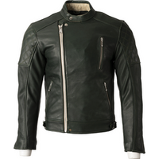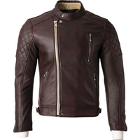 |
|            **[GOLDTOP - THE LANCER](https://goldtop.co.uk/collections/jackets/products/the-lancer-jacket?variant=37942591979691)**             EN-17092-2020-AAA             Prix en ligne au moment de la rédaction :  - Goldtop : [371,00 €](https://goldtop.co.uk/collections/jackets/products/the-lancer-jacket?variant=37942591979691)  - [Rechercher sur Motoblouz](https://pkw.motoblouz.com/?P4122157BDFF171&redir=https%3A%2F%2Fwww.motoblouz.com%2Frecherche%2FGOLDTOP%2520THE%2520LANCER.html)   - [Rechercher sur Dafy](https://www.dafy-moto.com/recherche?string=GOLDTOP%20THE%20LANCER)    Pour les rechercher en occasion :              |  |
|            **[GOLDTOP - THE PATROL](https://goldtop.co.uk/collections/jackets/products/the-patrol?variant=37995077992619)**             EN-17092-2020-AAA             Prix en ligne au moment de la rédaction :  - Goldtop : [390,00 €](https://goldtop.co.uk/collections/jackets/products/the-patrol?variant=37995077992619)  - [Rechercher sur Motoblouz](https://pkw.motoblouz.com/?P4122157BDFF171&redir=https%3A%2F%2Fwww.motoblouz.com%2Frecherche%2FGOLDTOP%2520THE%2520PATROL.html)   - [Rechercher sur Dafy](https://www.dafy-moto.com/recherche?string=GOLDTOP%20THE%20PATROL)    Pour les rechercher en occasion :              | 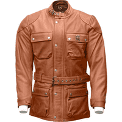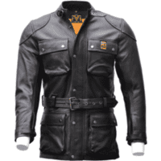 |

## HALVARSSONS :

 | Modèle | Photos |
|---|---|
|            **[HALVARSSONS - RACKEN](https://halvarssonsmc.com/product/racken/)**             EN-17092-20xx-AAA             Prix en ligne au moment de la rédaction :  - Halvarssons : [749.00 €](https://halvarssonsmc.com/product/racken/)  - FC-Moto : [699,00 €](https://www.fc-moto.de/en/Halvarssons-Racken-Waterproof-Motorcycle-Leather-Jacket)  - [Rechercher sur Motoblouz](https://pkw.motoblouz.com/?P4122157BDFF171&redir=https%3A%2F%2Fwww.motoblouz.com%2Frecherche%2FHALVARSSONS%2520RACKEN.html)   - [Rechercher sur Dafy](https://www.dafy-moto.com/recherche?string=HALVARSSONS%20RACKEN)    Pour les rechercher en occasion :              | 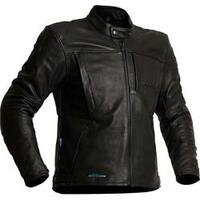 |
|            **[HALVARSSONS - VITSAND](https://halvarssonsmc.com/product/vitsand/)**             EN-17092-20xx-AAA             Prix en ligne au moment de la rédaction :  - Halvarssons : [749.00 €](https://halvarssonsmc.com/product/vitsand/)  - FC-Moto : [699,00 €](https://www.fc-moto.de/en/Halvarssons-Vitsand-Waterproof-Ladies-Motorcycle-Leather-Jacket)  - [Rechercher sur Motoblouz](https://pkw.motoblouz.com/?P4122157BDFF171&redir=https%3A%2F%2Fwww.motoblouz.com%2Frecherche%2FHALVARSSONS%2520VITSAND.html)   - [Rechercher sur Dafy](https://www.dafy-moto.com/recherche?string=HALVARSSONS%20VITSAND)    Pour les rechercher en occasion :              | 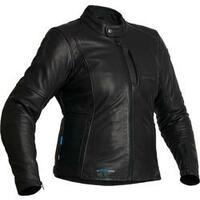 |

## IXON :

 | Modèle | Photos |
|---|---|
|            **[IXON - CEROS](https://www.ixon.com/fra-fr/ceros)**             EN-17092-2020 AAA  **BLOUSON ETE**              Prix en ligne au moment de la rédaction :  - [379,90 €](https://pkw.motoblouz.com/?P4122157BDFF171&redir=https%3A%2F%2Fwww.motoblouz.com%2Frecherche%2FIXON%2520CEROS.html) (Motoblouz)   - [379,99 €](https://www.dafy-moto.com/recherche?string=IXON%20CEROS) (Dafy)     Pour les rechercher en occasion :              |  |
|            **[IXON - JACKAL](https://www.ixon.com/fra-fr/jackal-jkt)**             EN-17092-2020 AAA             Prix en ligne au moment de la rédaction :  - [306,77 €](https://pkw.motoblouz.com/?P4122157BDFF171&redir=https%3A%2F%2Fwww.motoblouz.com%2Frecherche%2FIXON%2520JACKAL.html) (Motoblouz)   - [360,99 €](https://www.dafy-moto.com/recherche?string=IXON%20JACKAL) (Dafy)     Pour les rechercher en occasion :              |  |
|            **[IXON - VENDETTA EVO](https://www.ixon.com/fra-fr/vendetta-jkt-evo)**             EN-17092-2020 AAA             Prix en ligne au moment de la rédaction :  - [423,50 €](https://pkw.motoblouz.com/?P4122157BDFF171&redir=https%3A%2F%2Fwww.motoblouz.com%2Frecherche%2FIXON%2520VENDETTA%2520JKT%2520EVO.html) (Motoblouz)   - [503,49 €](https://www.dafy-moto.com/recherche?string=IXON%20VENDETTA%20JKT%20EVO) (Dafy)     Pour les rechercher en occasion :              |  |

## IXS :

 | Modèle | Photos |
|---|---|
|            **[IXS - CLASSIC LD ANDY](https://ixs.com/en/moto/motorcycle-garment/jackets/leather-jackets/2258/classic-ld-jacket-andy-black)**             EN-17092-2020-AAA            Prix en ligne au moment de la rédaction :  - [404,90 €](https://pkw.motoblouz.com/?P4122157BDFF171&redir=https%3A%2F%2Fwww.motoblouz.com%2Frecherche%2FIXS%2520CLASSIC%2520LD%2520ANDY.html) (Motoblouz)   - [Rechercher sur Dafy](https://www.dafy-moto.com/recherche?string=IXS%20CLASSIC%20LD%20ANDY)    Pour les rechercher en occasion :              |  |
|            **[IXS - CLASSIC LD STRIPE](https://ixs.com/en/moto/motorcycle-garment/jackets/leather-jackets/2257/classic-ld-jacket-stripe-black)**             EN-17092-2020-AAA            Prix en ligne au moment de la rédaction :  - [314,90 €](https://pkw.motoblouz.com/?P4122157BDFF171&redir=https%3A%2F%2Fwww.motoblouz.com%2Frecherche%2FIXS%2520CLASSIC%2520LD%2520STRIPE.html) (Motoblouz)   - [Rechercher sur Dafy](https://www.dafy-moto.com/recherche?string=IXS%20CLASSIC%20LD%20STRIPE)    Pour les rechercher en occasion :              | 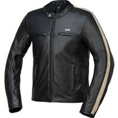 |
|            **[IXS - CLASSIC LD WOMEN S STRIPE](https://ixs.com/en/moto/motorcycle-garment/jackets/leather-jackets/2681/classic-ld-women-s-jacket-stripe-black)**             EN-17092-2020-AAA            Prix en ligne au moment de la rédaction :  - [314,90 €](https://pkw.motoblouz.com/?P4122157BDFF171&redir=https%3A%2F%2Fwww.motoblouz.com%2Frecherche%2FIXS%2520CLASSIC%2520LD%2520WOMEN%2520S%2520STRIPE.html) (Motoblouz)   - [Rechercher sur Dafy](https://www.dafy-moto.com/recherche?string=IXS%20CLASSIC%20LD%20WOMEN%20S%20STRIPE)    Pour les rechercher en occasion :              | 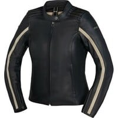 |
|            **[IXS - SPORTS LD RS 600 2.0](https://ixs.com/en/moto/motorcycle-garment/jackets/leather-jackets/2682/sports-ld-jacket-rs-600-2.0-black)**             EN-17092-2020-AAA            Prix en ligne au moment de la rédaction :  - [449,90 €](https://pkw.motoblouz.com/?P4122157BDFF171&redir=https%3A%2F%2Fwww.motoblouz.com%2Frecherche%2FIXS%2520SPORTS%2520LD%2520RS%2520600%25202%25200.html) (Motoblouz)   - [Rechercher sur Dafy](https://www.dafy-moto.com/recherche?string=IXS%20SPORTS%20LD%20RS%20600%202%200)    Pour les rechercher en occasion :              | 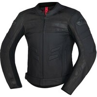 |
|            **[IXS - SPORTS LD WOMEN S RS 600 1.0](https://ixs.com/en/moto/motorcycle-garment/jackets/leather-jackets/2256/sports-ld-women-s-jacket-rs-600-1.0-black-grey-white)**             EN-17092-2020-AAA            Prix en ligne au moment de la rédaction :  - [Rechercher sur Motoblouz](https://pkw.motoblouz.com/?P4122157BDFF171&redir=https%3A%2F%2Fwww.motoblouz.com%2Frecherche%2FIXS%2520SPORTS%2520LD%2520WOMEN%2520S%2520RS%2520600%25201%25200.html)   - [Rechercher sur Dafy](https://www.dafy-moto.com/recherche?string=IXS%20SPORTS%20LD%20WOMEN%20S%20RS%20600%201%200)    Pour les rechercher en occasion :              | 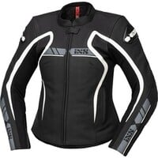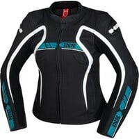 |

## JOHN DOE :

 | Modèle | Photos |
|---|---|
|            **[JOHN-DOE - EXPLORER](https://www.ridejohndoe.com/en/j3004-explorer-jacket-xtm-camel.html)**             EN-17092-20xx-AAA             Prix en ligne au moment de la rédaction :  - John Doe : [379,00 €](https://www.ridejohndoe.com/en/j3004-explorer-jacket-xtm-camel.html)  - [349,80 €](https://pkw.motoblouz.com/?P4122157BDFF171&redir=https%3A%2F%2Fwww.motoblouz.com%2Frecherche%2FJOHN%2520DOE%2520EXPLORER.html) (Motoblouz)   - [Rechercher sur Dafy](https://www.dafy-moto.com/recherche?string=JOHN%20DOE%20EXPLORER)    Pour les rechercher en occasion :              | 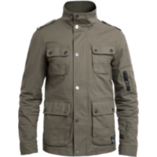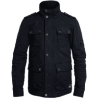 |
|            **[JOHN-DOE - HOODIE WOMEN V2](https://www.ridejohndoe.com/en/jhk8002-xtm-hoodie-women-v2.html)**             EN-17092-20xx-AAA             Prix en ligne au moment de la rédaction :  - John Doe : [249,00 €](https://www.ridejohndoe.com/en/jhk8002-xtm-hoodie-women-v2.html)  - [Rechercher sur Motoblouz](https://pkw.motoblouz.com/?P4122157BDFF171&redir=https%3A%2F%2Fwww.motoblouz.com%2Frecherche%2FJOHN%2520DOE%2520HOODIE%2520WOMEN%2520V2.html)   - [Rechercher sur Dafy](https://www.dafy-moto.com/recherche?string=JOHN%20DOE%20HOODIE%20WOMEN%20V2)    Pour les rechercher en occasion :              | 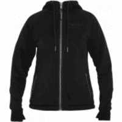 |
|            **[JOHN-DOE - MAVERICK](https://www.ridejohndoe.com/en/j5001-maverick-xtmr-monolayer-jacket.html)**             EN-17092-20xx-AAA             Prix en ligne au moment de la rédaction :  - John Doe : [299,00 €](https://www.ridejohndoe.com/en/j5001-maverick-xtmr-monolayer-jacket.html)  - [Rechercher sur Motoblouz](https://pkw.motoblouz.com/?P4122157BDFF171&redir=https%3A%2F%2Fwww.motoblouz.com%2Frecherche%2FJOHN%2520DOE%2520MAVERICK.html)   - [Rechercher sur Dafy](https://www.dafy-moto.com/recherche?string=JOHN%20DOE%20MAVERICK)    Pour les rechercher en occasion :              | 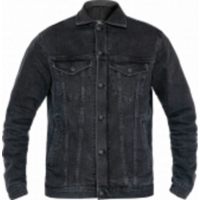 |
|            **[JOHN-DOE - MOTOSHIRT](https://www.ridejohndoe.com/en/jdl5014-motoshirt-new-camouflage-3711.html)**             EN-17092-20xx-AAA             Prix en ligne au moment de la rédaction : - John Doe : [259,00 €](https://www.ridejohndoe.com/en/jdl5014-motoshirt-new-camouflage-3711.html)  - [220,10 €](https://pkw.motoblouz.com/?P4122157BDFF171&redir=https%3A%2F%2Fwww.motoblouz.com%2Frecherche%2FJOHN%2520DOE%2520MOTOSHIRT.html) (Motoblouz)   - [Rechercher sur Dafy](https://www.dafy-moto.com/recherche?string=JOHN%20DOE%20MOTOSHIRT)    Pour les rechercher en occasion :              | 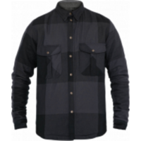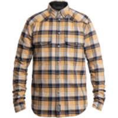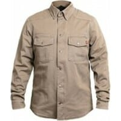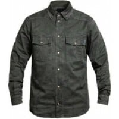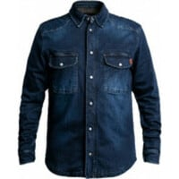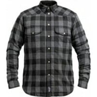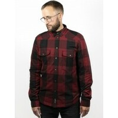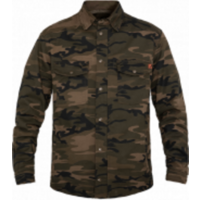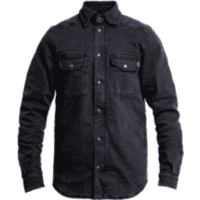 |
|            **[JOHN-DOE - WOMEN EXPLORER](https://www.ridejohndoe.com/en/j6001-women-explorer-black.html)**             EN-17092-20xx-AAA             Prix en ligne au moment de la rédaction : - John Doe : [379.00 €](https://www.ridejohndoe.com/en/j6001-women-explorer-black.html)  - [Rechercher sur Motoblouz](https://pkw.motoblouz.com/?P4122157BDFF171&redir=https%3A%2F%2Fwww.motoblouz.com%2Frecherche%2FJOHN%2520DOE%2520WOMEN%2520EXPLORER.html)   - [Rechercher sur Dafy](https://www.dafy-moto.com/recherche?string=JOHN%20DOE%20WOMEN%20EXPLORER)    Pour les rechercher en occasion :              | 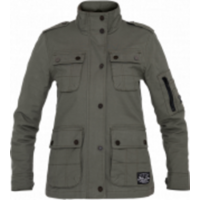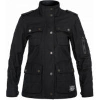 |

## KLIM :

 | Modèle | Photos |
|---|---|
|            **[KLIM - BADLANDS PRO A3](https://www.klim.com/Badlands-Pro-A3-Jacket-4101-000)**             EN-17092-20xx-AAA            Prix en ligne au moment de la rédaction :  - [1 640,00 €](https://pkw.motoblouz.com/?P4122157BDFF171&redir=https%3A%2F%2Fwww.motoblouz.com%2Frecherche%2FKLIM%2520BADLANDS%2520PRO%2520A3.html) (Motoblouz)   - [1 640,00 €](https://www.dafy-moto.com/recherche?string=KLIM%20BADLANDS%20PRO%20A3) (Dafy)     Pour les rechercher en occasion :              |  |

## KNOX :

 | Modèle | Photos |
|---|---|
|            **[KNOX - HONISTER](https://www.planet-knox.com/product/mens-honister-jacket/)**             EN-17092-2020-AAA             Prix en ligne au moment de la rédaction :  - iCasque : [459,99 €](https://www.icasque.com/search/knox%20honister)  - [Rechercher sur Motoblouz](https://pkw.motoblouz.com/?P4122157BDFF171&redir=https%3A%2F%2Fwww.motoblouz.com%2Frecherche%2FKNOX%2520HONISTER.html)   - [Rechercher sur Dafy](https://www.dafy-moto.com/recherche?string=KNOX%20HONISTER)    Pour les rechercher en occasion :              |  |
|            **[KNOX - WOMEN HONISTER](https://www.planet-knox.com/product/womens-honister-jacket/)**             EN-17092-2014-AAA             Prix en ligne au moment de la rédaction :  - iCasque : [459,99 €](https://www.icasque.com/search/knox%20honister)  - [Rechercher sur Motoblouz](https://pkw.motoblouz.com/?P4122157BDFF171&redir=https%3A%2F%2Fwww.motoblouz.com%2Frecherche%2FKNOX%2520WOMEN%2520HONISTER.html)   - [Rechercher sur Dafy](https://www.dafy-moto.com/recherche?string=KNOX%20WOMEN%20HONISTER)    Pour les rechercher en occasion :              | 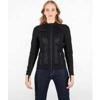 |

## MERLIN :

 | Modèle | Photos |
|---|---|
|            **[MERLIN - GABLE WATERPROOF](https://www.merlinbikegear.com/product/gable-waterproof-jacket/)**             EN-17092-20xx-AAA             Prix en ligne au moment de la rédaction :            FC-Moto : [549,00 €](https://www.fc-moto.de/fr/Merlin-Gable-Veste-en-cuir-de-moto)             - [Rechercher sur Motoblouz](https://pkw.motoblouz.com/?P4122157BDFF171&redir=https%3A%2F%2Fwww.motoblouz.com%2Frecherche%2FMERLIN%2520GABLE%2520WATERPROOF.html)   - [Rechercher sur Dafy](https://www.dafy-moto.com/recherche?string=MERLIN%20GABLE%20WATERPROOF)    Pour les rechercher en occasion :   |  |

## PMJ :

 | Modèle | Photos |
|---|---|
|            **[PMJ - LUCY](https://www.pmj.it/en/prodotti/lucy/)**             EN-17092-20xx-AAA             Prix en ligne au moment de la rédaction :  - [Rechercher sur Motoblouz](https://pkw.motoblouz.com/?P4122157BDFF171&redir=https%3A%2F%2Fwww.motoblouz.com%2Frecherche%2FPMJ%2520LUCY.html)   - [259,00 €](https://www.dafy-moto.com/recherche?string=PMJ%20LUCY) (Dafy)     Pour les rechercher en occasion :              | 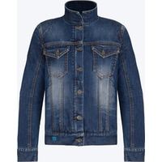 |
|            **[PMJ - MIAMI](https://www.pmj.it/en/prodotti/miami/)**             EN-17092-20xx-AAA             Prix en ligne au moment de la rédaction :  - [Rechercher sur Motoblouz](https://pkw.motoblouz.com/?P4122157BDFF171&redir=https%3A%2F%2Fwww.motoblouz.com%2Frecherche%2FPMJ%2520MIAMI.html)   - [239,00 €](https://www.dafy-moto.com/recherche?string=PMJ%20MIAMI) (Dafy)     Pour les rechercher en occasion :              | 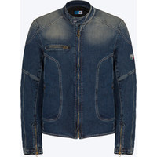 |
|            **[PMJ - WEST](https://www.pmj.it/en/prodotti/west/)**             EN-17092-20xx-AAA             Prix en ligne au moment de la rédaction :  - [Rechercher sur Motoblouz](https://pkw.motoblouz.com/?P4122157BDFF171&redir=https%3A%2F%2Fwww.motoblouz.com%2Frecherche%2FPMJ%2520WEST.html)   - [259,00 €](https://www.dafy-moto.com/recherche?string=PMJ%20WEST) (Dafy)     Pour les rechercher en occasion :              | 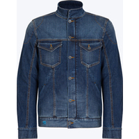 |

## RESURGENCE-GEAR :

 | Modèle | Photos |
|---|---|
|            **[RESURGENCE-GEAR - N1 DECK PEKEV](https://resurgencegear.net/collections/mens-jackets/products/resurgence-gear-r-2020-n1-deck-pekev-motorcycle-jacket-sand)**             EN-17092-20xx-AAA             Prix en ligne au moment de la rédaction :  - Resurgence Gear : [345,00 £](https://resurgencegear.net/collections/mens-jackets/products/resurgence-gear-r-2020-n1-deck-pekev-motorcycle-jacket-sand)  - [Rechercher sur Motoblouz](https://pkw.motoblouz.com/?P4122157BDFF171&redir=https%3A%2F%2Fwww.motoblouz.com%2Frecherche%2FRESURGENCE%2520GEAR%2520N1%2520DECK%2520PEKEV.html)   - [Rechercher sur Dafy](https://www.dafy-moto.com/recherche?string=RESURGENCE%20GEAR%20N1%20DECK%20PEKEV)    Pour les rechercher en occasion :              | 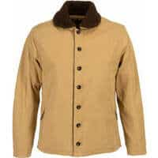 |
|            **[RESURGENCE-GEAR - PEKEV TRUCKER CE](https://resurgencegear.net/collections/mens-jackets/products/resurgence-gear-pekev-trucker-ce-denim-jacket)**             EN-17092-20xx-AAA             Prix en ligne au moment de la rédaction :  - Resurgence Gear : [249,00 £](https://resurgencegear.net/collections/mens-jackets/products/resurgence-gear-pekev-trucker-ce-denim-jacket)  - [Rechercher sur Motoblouz](https://pkw.motoblouz.com/?P4122157BDFF171&redir=https%3A%2F%2Fwww.motoblouz.com%2Frecherche%2FRESURGENCE%2520GEAR%2520PEKEV%2520TRUCKER%2520CE.html)   - [Rechercher sur Dafy](https://www.dafy-moto.com/recherche?string=RESURGENCE%20GEAR%20PEKEV%20TRUCKER%20CE)    Pour les rechercher en occasion :              |  |
|            **[RESURGENCE-GEAR - RIDING SHIRT PEKEV RIDING SHIRT](https://resurgencegear.net/collections/riding-shirts/products/resurgence-gear-r-2020-riding-shirt-pekev-motorcycle-riding-shirt-grey-check)**             EN-17092-20xx-AAA             Prix en ligne au moment de la rédaction :  - Resurgence Gear : [245,00 £](https://resurgencegear.net/collections/riding-shirts/products/resurgence-gear-r-2020-riding-shirt-pekev-motorcycle-riding-shirt-grey-check)  - [Rechercher sur Motoblouz](https://pkw.motoblouz.com/?P4122157BDFF171&redir=https%3A%2F%2Fwww.motoblouz.com%2Frecherche%2FRESURGENCE%2520GEAR%2520RIDING%2520SHIRT%2520PEKEV%2520RIDING%2520SHIRT.html)   - [Rechercher sur Dafy](https://www.dafy-moto.com/recherche?string=RESURGENCE%20GEAR%20RIDING%20SHIRT%20PEKEV%20RIDING%20SHIRT)    Pour les rechercher en occasion :              | 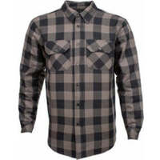 |
|            **[RESURGENCE-GEAR - SHERPA PEKEV](https://resurgencegear.net/collections/mens-jackets/products/resurgence-gear-r-2020-sherpa-pekev-motorcycle-jacket-raw)**             EN-17092-20xx-AAA             Prix en ligne au moment de la rédaction :  - Resurgence Gear : [315,00 £](https://resurgencegear.net/collections/mens-jackets/products/resurgence-gear-r-2020-sherpa-pekev-motorcycle-jacket-raw)  - [Rechercher sur Motoblouz](https://pkw.motoblouz.com/?P4122157BDFF171&redir=https%3A%2F%2Fwww.motoblouz.com%2Frecherche%2FRESURGENCE%2520GEAR%2520SHERPA%2520PEKEV.html)   - [Rechercher sur Dafy](https://www.dafy-moto.com/recherche?string=RESURGENCE%20GEAR%20SHERPA%20PEKEV)    Pour les rechercher en occasion :              |  |
|            **[RESURGENCE-GEAR - ULTRA CE RIDING SHIRT](https://resurgencegear.net/collections/riding-shirts/products/resurgence-gear-mens-ultra-ce-riding-shirt-green)**             EN-17092-20xx-AAA             Prix en ligne au moment de la rédaction :  - Resurgence Gear : [299,00 £](https://resurgencegear.net/collections/riding-shirts/products/resurgence-gear-mens-ultra-ce-riding-shirt-green)  - [Rechercher sur Motoblouz](https://pkw.motoblouz.com/?P4122157BDFF171&redir=https%3A%2F%2Fwww.motoblouz.com%2Frecherche%2FRESURGENCE%2520GEAR%2520ULTRA%2520CE%2520RIDING%2520SHIRT.html)   - [Rechercher sur Dafy](https://www.dafy-moto.com/recherche?string=RESURGENCE%20GEAR%20ULTRA%20CE%20RIDING%20SHIRT)    Pour les rechercher en occasion :              |  |

## REVIT :

 | Modèle | Photos |
|---|---|
|            **[REVIT - APEX](https://www.revitsport.com/en/motorcycle-jacket-apex-black-neon-red)**             EN-17092-2020-AAA            Prix en ligne au moment de la rédaction :  - [559,99 €](https://pkw.motoblouz.com/?P4122157BDFF171&redir=https%3A%2F%2Fwww.motoblouz.com%2Frecherche%2FREVIT%2520APEX.html) (Motoblouz)   - [559,99 €](https://www.dafy-moto.com/recherche?string=REVIT%20APEX) (Dafy)     Pour les rechercher en occasion :              |  |
|            **[REVIT - QUANTUM 2 PRO AIR](https://www.revitsport.com/en/motorcycle-jacket-quantum-2-pro-air-white-blue)**             EN-17092-2020-AAA            Prix en ligne au moment de la rédaction :  - [649,99 €](https://pkw.motoblouz.com/?P4122157BDFF171&redir=https%3A%2F%2Fwww.motoblouz.com%2Frecherche%2FREVIT%2520QUANTUM%25202%2520PRO%2520AIR.html) (Motoblouz)   - [649,99 €](https://www.dafy-moto.com/recherche?string=REVIT%20QUANTUM%202%20PRO%20AIR) (Dafy)     Pour les rechercher en occasion :              |  |

## ROKKER :

 | Modèle | Photos |
|---|---|
|            **[ROKKER - BONNY](https://www.therokkercompany.com/collections/all-jackets/products/bonny-leather-jacket)**             EN-17092-20xx-AAA             Prix en ligne au moment de la rédaction :  - FC-Moto : [1399,00 €](https://www.fc-moto.de/epages/fcm.sf/fr_FR/?ObjectID=2587584&ViewAction=FacetedSearchProducts&SearchString=rokker+bonny)  - [Rechercher sur Motoblouz](https://pkw.motoblouz.com/?P4122157BDFF171&redir=https%3A%2F%2Fwww.motoblouz.com%2Frecherche%2FROKKER%2520BONNY.html)   - [Rechercher sur Dafy](https://www.dafy-moto.com/recherche?string=ROKKER%20BONNY)    Pour les rechercher en occasion :              | 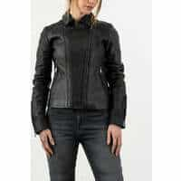 |
|            **[ROKKER - COMMANDER](https://www.therokkercompany.com/collections/all-jackets/products/commander-leather-jacket)**             EN-17092-20xx-AAA             Prix en ligne au moment de la rédaction :  - FC-Moto : [1399,00 €](https://www.fc-moto.de/epages/fcm.sf/fr_FR/?ObjectID=2587584&ViewAction=FacetedSearchProducts&SearchString=rokker+commander)  - [Rechercher sur Motoblouz](https://pkw.motoblouz.com/?P4122157BDFF171&redir=https%3A%2F%2Fwww.motoblouz.com%2Frecherche%2FROKKER%2520COMMANDER.html)   - [Rechercher sur Dafy](https://www.dafy-moto.com/recherche?string=ROKKER%20COMMANDER)    Pour les rechercher en occasion :              | 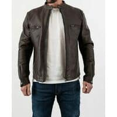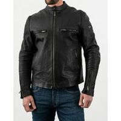 |
|            **[ROKKER - GINGER](https://www.therokkercompany.com/collections/all-jackets/products/ginger-leather-jacket)**             EN-17092-20xx-AAA             Prix en ligne au moment de la rédaction :  - FC-Moto : [1299,00 €](https://www.fc-moto.de/epages/fcm.sf/fr_FR/?ObjectID=2587584&ViewAction=FacetedSearchProducts&SearchString=rokker+ginger)  - [Rechercher sur Motoblouz](https://pkw.motoblouz.com/?P4122157BDFF171&redir=https%3A%2F%2Fwww.motoblouz.com%2Frecherche%2FROKKER%2520GINGER.html)   - [Rechercher sur Dafy](https://www.dafy-moto.com/recherche?string=ROKKER%20GINGER)    Pour les rechercher en occasion :              |  |
|            **[ROKKER - GOODWOOD](https://www.therokkercompany.com/collections/all-jackets/products/goodwood-leather-jacket-brown)**             EN-17092-20xx-AAA             Prix en ligne au moment de la rédaction :  - FC-Moto : [1499,00 €](https://www.fc-moto.de/epages/fcm.sf/fr_FR/?ObjectID=2587584&ViewAction=FacetedSearchProducts&SearchString=rokker+goodwood)  - [Rechercher sur Motoblouz](https://pkw.motoblouz.com/?P4122157BDFF171&redir=https%3A%2F%2Fwww.motoblouz.com%2Frecherche%2FROKKER%2520GOODWOOD.html)   - [Rechercher sur Dafy](https://www.dafy-moto.com/recherche?string=ROKKER%20GOODWOOD)    Pour les rechercher en occasion :              |  |

## RST :

 | Modèle | Photos |
|---|---|
|            **[RST - CUIR SABRE AIRBAG CE](https://www.rst-moto.com/FR/vetements-cuir/blousons-cuir-homme/sabre-airbag-leather-jacket.html)**             EN-17092-20xx-AAA             Prix en ligne au moment de la rédaction :  - [549,95 €](https://pkw.motoblouz.com/?P4122157BDFF171&redir=https%3A%2F%2Fwww.motoblouz.com%2Frecherche%2FRST%2520CUIR%2520SABRE%2520AIRBAG%2520CE.html) (Motoblouz)   - [Rechercher sur Dafy](https://www.dafy-moto.com/recherche?string=RST%20CUIR%20SABRE%20AIRBAG%20CE)    Pour les rechercher en occasion :              |  |
|            **[RST - CUIR SABRE CE](https://www.rst-moto.com/FR/vetements-cuir/blousons-cuir-homme/sabre-leather-jacket.html)**             EN-17092-20xx-AAA             Prix en ligne au moment de la rédaction :  - [369,95 €](https://pkw.motoblouz.com/?P4122157BDFF171&redir=https%3A%2F%2Fwww.motoblouz.com%2Frecherche%2FRST%2520CUIR%2520SABRE%2520CE.html) (Motoblouz)   - [Rechercher sur Dafy](https://www.dafy-moto.com/recherche?string=RST%20CUIR%20SABRE%20CE)    Pour les rechercher en occasion :              |  |
|            **[RST - S1 CE LADIES](https://www.rst-moto.com/FR/vetements-cuir/blousons-cuir-femme/s1-ce-ladies-leather-jacket.html)**             EN-17092-20xx-AAA             Prix en ligne au moment de la rédaction :  - [329,95 €](https://pkw.motoblouz.com/?P4122157BDFF171&redir=https%3A%2F%2Fwww.motoblouz.com%2Frecherche%2FRST%2520S1%2520CE%2520LADIES.html) (Motoblouz)   - [Rechercher sur Dafy](https://www.dafy-moto.com/recherche?string=RST%20S1%20CE%20LADIES)    Pour les rechercher en occasion :              |  |
|            **[RST - S1 CE MENS](https://www.rst-moto.com/FR/vetements-cuir/blousons-cuir-homme/s1-ce-mens-leather-jacket.html)**             EN-17092-20xx-AAA             Prix en ligne au moment de la rédaction :  - [329,95 €](https://pkw.motoblouz.com/?P4122157BDFF171&redir=https%3A%2F%2Fwww.motoblouz.com%2Frecherche%2FRST%2520S1%2520CE%2520MENS.html) (Motoblouz)   - [Rechercher sur Dafy](https://www.dafy-moto.com/recherche?string=RST%20S1%20CE%20MENS)    Pour les rechercher en occasion :              |  |
|            **[RST - TEXTILE SABRE AIRBAG CE](https://www.rst-moto.com/FR/vetements-textile/blousons-textile-homme/sabre-airbag-textile-jacket.html)**             EN-17092-20xx-AAA             Prix en ligne au moment de la rédaction :  - [479,95 €](https://pkw.motoblouz.com/?P4122157BDFF171&redir=https%3A%2F%2Fwww.motoblouz.com%2Frecherche%2FRST%2520TEXTILE%2520SABRE%2520AIRBAG%2520CE.html) (Motoblouz)   - [Rechercher sur Dafy](https://www.dafy-moto.com/recherche?string=RST%20TEXTILE%20SABRE%20AIRBAG%20CE)    Pour les rechercher en occasion :              |  |
|            **[RST - TRACTECH EVO 4](https://www.rst-moto.com/FR/vetements-cuir/blousons-cuir-homme/tractech-evo-4-leather-jacket.html)**             EN-17092-20xx-AAA             Prix en ligne au moment de la rédaction :  - [399,95 €](https://pkw.motoblouz.com/?P4122157BDFF171&redir=https%3A%2F%2Fwww.motoblouz.com%2Frecherche%2FRST%2520TRACTECH%2520EVO%25204.html) (Motoblouz)   - [Rechercher sur Dafy](https://www.dafy-moto.com/recherche?string=RST%20TRACTECH%20EVO%204)    Pour les rechercher en occasion :              |  |

## SEGURA :

 | Modèle | Photos |
|---|---|
|            **[SEGURA - COBRA](https://segura-moto.fr/homme/blouson/cobra.html)**             EN-17092-20xx-AAA             Prix en ligne au moment de la rédaction :  - [455,90 €](https://pkw.motoblouz.com/?P4122157BDFF171&redir=https%3A%2F%2Fwww.motoblouz.com%2Frecherche%2FSEGURA%2520COBRA.html) (Motoblouz)   - [455,99 €](https://www.dafy-moto.com/recherche?string=SEGURA%20COBRA) (Dafy)     Pour les rechercher en occasion :              |  |
|            **[SEGURA - DORIAN](https://segura-moto.fr/homme/blouson/dorian.html)**             EN-17092-20xx-AAA             Prix en ligne au moment de la rédaction :  - [436,90 €](https://pkw.motoblouz.com/?P4122157BDFF171&redir=https%3A%2F%2Fwww.motoblouz.com%2Frecherche%2FSEGURA%2520DORIAN.html) (Motoblouz)   - [436,99 €](https://www.dafy-moto.com/recherche?string=SEGURA%20DORIAN) (Dafy)     Pour les rechercher en occasion :              |  |
|            **[SEGURA - FUNKY](https://segura-moto.fr/homme/blouson/funky.html)**             EN-17092-20xx-AAA             Prix en ligne au moment de la rédaction :  - [427,40 €](https://pkw.motoblouz.com/?P4122157BDFF171&redir=https%3A%2F%2Fwww.motoblouz.com%2Frecherche%2FSEGURA%2520FUNKY.html) (Motoblouz)   - [427,49 €](https://www.dafy-moto.com/recherche?string=SEGURA%20FUNKY) (Dafy)     Pour les rechercher en occasion :              |  |
|            **[SEGURA - FUNKY SPEED](https://segura-moto.fr/homme/blouson/funky-speed.html)**             EN-17092-20xx-AAA             Prix en ligne au moment de la rédaction :  - [427,40 €](https://pkw.motoblouz.com/?P4122157BDFF171&redir=https%3A%2F%2Fwww.motoblouz.com%2Frecherche%2FSEGURA%2520FUNKY%2520SPEED.html) (Motoblouz)   - [427,49 €](https://www.dafy-moto.com/recherche?string=SEGURA%20FUNKY%20SPEED) (Dafy)     Pour les rechercher en occasion :              |  |
|            **[SEGURA - LADY DOLLY](https://segura-moto.fr/femme/blouson/lady-dolly.html)**             EN-17092-20xx-AAA             Prix en ligne au moment de la rédaction :  - [436,90 €](https://pkw.motoblouz.com/?P4122157BDFF171&redir=https%3A%2F%2Fwww.motoblouz.com%2Frecherche%2FSEGURA%2520LADY%2520DOLLY.html) (Motoblouz)   - [436,99 €](https://www.dafy-moto.com/recherche?string=SEGURA%20LADY%20DOLLY) (Dafy)     Pour les rechercher en occasion :              |  |
|            **[SEGURA - LADY DORIAN](https://segura-moto.fr/femme/blouson/lady-dorian.html)**             EN-17092-20xx-AAA             Prix en ligne au moment de la rédaction :  - [427,40 €](https://pkw.motoblouz.com/?P4122157BDFF171&redir=https%3A%2F%2Fwww.motoblouz.com%2Frecherche%2FSEGURA%2520LADY%2520DORIAN.html) (Motoblouz)   - [427,49 €](https://www.dafy-moto.com/recherche?string=SEGURA%20LADY%20DORIAN) (Dafy)     Pour les rechercher en occasion :              |  |
|            **[SEGURA - LADY FUNKY](https://segura-moto.fr/femme/blouson/lady-funky.html)**             EN-17092-20xx-AAA             Prix en ligne au moment de la rédaction :  - [408,40 €](https://pkw.motoblouz.com/?P4122157BDFF171&redir=https%3A%2F%2Fwww.motoblouz.com%2Frecherche%2FSEGURA%2520LADY%2520FUNKY.html) (Motoblouz)   - [408,49 €](https://www.dafy-moto.com/recherche?string=SEGURA%20LADY%20FUNKY) (Dafy)     Pour les rechercher en occasion :              |  |
|            **[SEGURA - LADY FUNKY SPEED](https://segura-moto.fr/femme/blouson/lady-funky-speed.html)**             EN-17092-20xx-AAA            Prix en ligne au moment de la rédaction :  - [417,90 €](https://pkw.motoblouz.com/?P4122157BDFF171&redir=https%3A%2F%2Fwww.motoblouz.com%2Frecherche%2FSEGURA%2520LADY%2520FUNKY%2520SPEED.html) (Motoblouz)   - [417,99 €](https://www.dafy-moto.com/recherche?string=SEGURA%20LADY%20FUNKY%20SPEED) (Dafy)     Pour les rechercher en occasion :              |  |
|            **[SEGURA - LADY LAXEY](https://segura-moto.fr/femme/blouson/lady-laxey.html)**             EN-17092-20xx-AAA             Prix en ligne au moment de la rédaction :  - [398,90 €](https://pkw.motoblouz.com/?P4122157BDFF171&redir=https%3A%2F%2Fwww.motoblouz.com%2Frecherche%2FSEGURA%2520LADY%2520LAXEY.html) (Motoblouz)   - [398,99 €](https://www.dafy-moto.com/recherche?string=SEGURA%20LADY%20LAXEY) (Dafy)     Pour les rechercher en occasion :              |  |
|            **[SEGURA - LADY SUBOTAI](https://segura-moto.fr/femme/blouson/lady-subotai.html)**             EN-17092-20xx-AAA             Prix en ligne au moment de la rédaction :  - [Rechercher sur Motoblouz](https://pkw.motoblouz.com/?P4122157BDFF171&redir=https%3A%2F%2Fwww.motoblouz.com%2Frecherche%2FSEGURA%2520LADY%2520SUBOTAI.html)   - [Rechercher sur Dafy](https://www.dafy-moto.com/recherche?string=SEGURA%20LADY%20SUBOTAI)    Pour les rechercher en occasion :              |  |
|            **[SEGURA - LAXEY](https://segura-moto.fr/homme/blouson/laxey.html)**             EN-17092-20xx-AAA             Prix en ligne au moment de la rédaction :  - [398,90 €](https://pkw.motoblouz.com/?P4122157BDFF171&redir=https%3A%2F%2Fwww.motoblouz.com%2Frecherche%2FSEGURA%2520LAXEY.html) (Motoblouz)   - [408,49 €](https://www.dafy-moto.com/recherche?string=SEGURA%20LAXEY) (Dafy)     Pour les rechercher en occasion :              |  |
|            **[SEGURA - OWEN](https://segura-moto.fr/homme/blouson/owen.html)**             EN-17092-20xx-AAA             Prix en ligne au moment de la rédaction :  - [446,40 €](https://pkw.motoblouz.com/?P4122157BDFF171&redir=https%3A%2F%2Fwww.motoblouz.com%2Frecherche%2FSEGURA%2520OWEN.html) (Motoblouz)   - [446,49 €](https://www.dafy-moto.com/recherche?string=SEGURA%20OWEN) (Dafy)     Pour les rechercher en occasion :              |  |
|            **[SEGURA - SUBOTAI](https://segura-moto.fr/homme/blouson/subotai.html)**             EN-17092-20xx-AAA             Prix en ligne au moment de la rédaction :  - [455,90 €](https://pkw.motoblouz.com/?P4122157BDFF171&redir=https%3A%2F%2Fwww.motoblouz.com%2Frecherche%2FSEGURA%2520SUBOTAI.html) (Motoblouz)   - [Rechercher sur Dafy](https://www.dafy-moto.com/recherche?string=SEGURA%20SUBOTAI)    Pour les rechercher en occasion :              |  |
|            **[SEGURA - ZAREK](https://segura-moto.fr/homme/blouson/zarek.html)**             EN-17092-20xx-AAA             Prix en ligne au moment de la rédaction :  - [436,90 €](https://pkw.motoblouz.com/?P4122157BDFF171&redir=https%3A%2F%2Fwww.motoblouz.com%2Frecherche%2FSEGURA%2520ZAREK.html) (Motoblouz)   - [436,99 €](https://www.dafy-moto.com/recherche?string=SEGURA%20ZAREK) (Dafy)     Pour les rechercher en occasion :              |  |

## SPIDI :

 | Modèle | Photos |
|---|---|
|            **[SPIDI - BOLIDE](https://www.spidi.com/eu_en/bolide-leather-jacket-p200)**             EN-17092-2017-AAA             Prix en ligne au moment de la rédaction :  - [299,00 €](https://www.tradeinn.com/motardinn/fr/spidi-veste-perforee-bolide-leather/136922749/p) (Motardinn)   - [Rechercher sur Motoblouz](https://pkw.motoblouz.com/?P4122157BDFF171&redir=https%3A%2F%2Fwww.motoblouz.com%2Frecherche%2FSPIDI%2520BOLIDE.html)   - [Rechercher sur Dafy](https://www.dafy-moto.com/recherche?string=SPIDI%20BOLIDE)    Pour les rechercher en occasion :              | 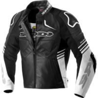 |

---

# ANNEXE : Fabricants ne publiant pas assez/aucune info sur la protection de leurs blousons

- [Belstaff](https://www.belstaff.com/eu/fr/)
- [Dafy](https://www.dafy-moto.com) :
    - All One
    - DMP
- [Difi](https://www.motoport.eu/en/Difi)
- [Fox](https://foxracing.fr/)
- [HolyFreedom](https://www.holyfreedom.com/fr/)
- [Icon](https://rideicon.com/)
- [Overlap](https://overlap-denim.com/)
- [Richa](https://www.richa.eu/en-us/)
- [VQUATTRO](https://vquattro.com/)
