Lorsque la norme EN 17092 est entrée en vigueur en 2019/2020, les journaux moto prédisaient que les blousons/pantalons au niveau AAA seraient plutôt dédiés à un usage piste.
2 ans plus tard force est de constater que les modèles se multiplient et ne sont pas spécifiquement typés circuit.

J'ai identifié une quarantaine de modèles, hommes comme femmes, les premiers prix sont autour de 250 euros.

<!--more-->

J’ai mis le lien Motoblouz/Dafy/autre et une idée des prix lorsque c’était possible _(note : Je peux toucher quelques centimes si vous passez par un de mes liens pour acheter sur le site Motoblouz)_.

# La norme EN 17092:2019/2020/2021

La norme européenne EN 17092 impose d'afficher sur les étiquettes des blousons et pantalons moto une mesure précise sur leur niveau de protection, matérialisée par une étiquette comme celle-ci :

Une explication très complète de la norme, avec le détail des différentes mesures est disponible sur le site "Demonerosso" de Dainese ici : [comment fonctionnent les certifications des vestes et pantalons moto](https://demonerosso.dainese.com/fr/comment-fonctionnent-les-certifications-des-vestes-et-pantalons-de-moto).

(paradoxalement, Dainese ne publie pas le niveau de protection de ses blousons et pantalons...)

Il faut essentiellement retenir que le corps est divisé en 3 zones, qui doivent résister à des niveaux d'abrasion différents, en raison de leur exposition :

- AAA :
    - Zone 1 : Chute à 120 km/h
    - Zone 2 : Chute à 75 km/h
    - Zone 3 : Chute à 45 km/h
- AA :
    - Zone 1 : Chute à 70 km/h
    - Zone 2 : Chute à 45 km/h
    - Zone 3 : Chute à 25 km/h
- A :
    - Zone 1 : Chute à 45 km/h
    - Zone 2 : Chute à 25 km/h
    - Zone 3 : Non testée

Les niveaux B et C sont très faibles et à éviter absolument à mon avis : On trouve maintenant du AA dans toutes les gammes de prix.

_A première vue la norme existe au moins en 3 versions, 2019, 2020 et 2021, mais il ne semble pas y avoir de différence entre elles dans les niveaux de protection._

# Note sur les fabricants et la transparence

Peu de fabricants sont transparents sur leurs sites en ce qui concerne la certification obtenue par leurs blousons, mais l'info est tout de même plus souvent présente que pour les bottes et les gants. 

Ceux chez qui j'ai trouvé ces infos :

- Avec des modèles AAA :
    - ALPINESTARS ([site officiel](https://www.alpinestars.com/)) : La certification est souvent (pas toujours) indiquée dans le texte de la page ;
    - BERING : La certification est souvent indiquée dans le texte de la page ;
    - RST ([site officiel](https://www.rst-moto.com/fr/)) : La certification est souvent indiquée dans le texte de la page ;
    - FURYGAN ([site officiel](https://www.furygan.com/)) : Le PDF "fiche technique" contient souvent le niveau de certification ;
    - IXON ([site officiel](https://www.ixon.com/fra-fr/)) : La certification est souvent présente sous forme d'image ;
    - IXS ([site officiel](https://ixs.com/)) : La certification est souvent indiquée dans le texte de la page ;
    - KLIM ([site officiel](https://www.klim.com/)) : La certification est souvent indiquée dans le texte de la page ;
    - MERLIN ([site officiel](https://www.merlinbikegear.com/)) : La certification est souvent indiquée dans le texte de la page ;
    - REV'IT ([site officiel](https://www.revitsport.com/fr/)) : La certification est **toujours** indiquée dans le texte de la page ;
    - RST ([site officiel](https://www.rst-moto.com/fr/)) : La certification est souvent indiquée dans le texte de la page ;
    - SEGURA ([site officiel](https://segura-moto.fr/)) : La certification est souvent indiquée dans le texte de la page ;
- Sans modèles AAA (mais plusieurs modèles AA) :
     - COURSE ([XLMoto](https://www.xlmoto.com/)) : La certification est souvent indiquée dans le texte de la page ;
    - DXR ([Motoblouz](https://www.motoblouz.com)) : La certification est souvent indiquée dans le texte de la page, sinon elle se trouve dans le PDF "certificat de conformité" ;
    - HIGHWAY 1/FASTWAY/REKURV/VANUCCI/DETLEV LOUIS/PROBIKER ([Louis moto](https://www.louis-moto.fr)) : La certification est souvent indiquée dans le texte de la page ;
    - HELSTONS ([site officiel](https://www.helstons.net/)) : La certification est parfois indiquée dans le texte de la page ;
    - O'NEAL ([site officiel](https://www.oneal.eu/)) : La certification est **toujours** indiquée dans le texte de la page ;
    - RUSTY STITCHES ([site officiel](https://www.rustystitches.com/)) : La certification est **toujours** indiquée dans le texte de la page ;
    - SEVENTY DEGREES ([site officiel](https://seventy-70.com/en/)) : La certification est souvent indiquée dans le texte de la page.

La liste des autres fabricants que j'ai parcourus mais dont les sites ne publient pas les niveaux de certification de leurs blousons se trouve en annexe en fin de document.  
Si l'un d'entre eux évolue ou si vous en connaissez d'autres, n'hésitez pas à me prévenir en commentaire, et je les ajouterai à la prochaine version de ce document.

# Inventaire des blousons EN 17092:20xx - AAA

## ALPINESTARS :

 | Modèle | Photos |
|---|---|
|            **[ALPINESTARS - FUSION](https://www.alpinestars.com/products/fusion-leather-jacket)**             EN-17092-20xx-AAA 712,45 € ([Dafy Moto](https://www.dafy-moto.com/recherche?string=ALPINESTARS%20FUSION))  **BLOUSON ETE**            |  |
|            **[ALPINESTARS - MISSILE IGNITION V2](https://www.alpinestars.com/products/missile-v2-ignition-leather-jacket)**             EN-17092-20xx-AAA            473,30 € ([Motoblouz](https://pkw.motoblouz.com/?P4122157BDFF171&redir=https%3A%2F%2Fwww.motoblouz.com%2Frecherche%2FALPINESTARS%2520MISSILE%2520IGNITION%2520V2.html))         | 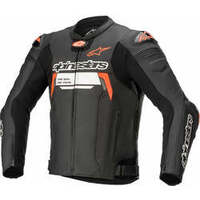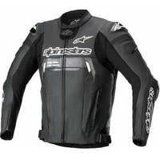 |
|            **[ALPINESTARS - MISSILE V2](https://www.alpinestars.com/products/missile-v2-leather-jacket)**             EN-17092-20xx-AAA            522,45 € ([Dafy Moto](https://www.dafy-moto.com/recherche?string=ALPINESTARS%20MISSILE%20V2))            | 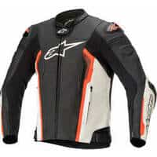 |
|            **[ALPINESTARS - MISSILE V2 AIRFLOW](https://www.alpinestars.com/products/missile-v2-airflow-leather-jacket)**             EN-17092-20xx-AAA            433,90 € ([Motoblouz](https://pkw.motoblouz.com/?P4122157BDFF171&redir=https%3A%2F%2Fwww.motoblouz.com%2Frecherche%2FALPINESTARS%2520MISSILE%2520V2%2520AIRFLOW.html))           | 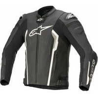 |
|            **[ALPINESTARS - STELLA KIRA](https://www.alpinestars.com/products/stella-kira-leather-jacket)**             EN-17092-20xx-AAA             | 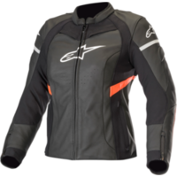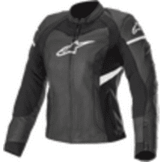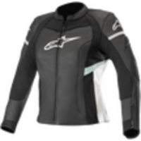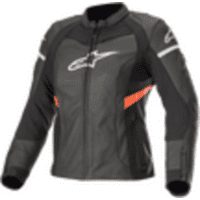 |
|            **[ALPINESTARS - STELLA KIRA V2](https://www.alpinestars.com/products/stella-kira-v2-leather-jacket)**             EN-17092-2016-AAA            378,60 € ([Motoblouz](https://pkw.motoblouz.com/?P4122157BDFF171&redir=https%3A%2F%2Fwww.motoblouz.com%2Frecherche%2FALPINESTARS%2520STELLA%2520KIRA%2520V2.html))            |  |
|            **[ALPINESTARS - STELLA MISSILE V2](https://www.alpinestars.com/products/stella-missile-v2-leather-jacket)**             EN-17092-20xx-AAA            441,80 € ([Motoblouz](https://pkw.motoblouz.com/?P4122157BDFF171&redir=https%3A%2F%2Fwww.motoblouz.com%2Frecherche%2FALPINESTARS%2520STELLA%2520MISSILE%2520V2.html))       | 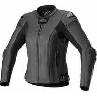 |

## BERING :

 | Modèle | Photos |
|---|---|
|            **[BERING - ATOMIC](https://bering.fr/homme/blouson/atomic.html?___store=)**             EN-17092-20xx-AAA            316,40 € ([Motoblouz](https://pkw.motoblouz.com/?P4122157BDFF171&redir=https%3A%2F%2Fwww.motoblouz.com%2Frecherche%2FBERING%2520ATOMIC.html))        | 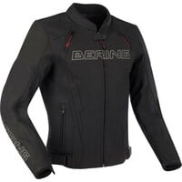 |
|            **[BERING - FIGHT-R](https://bering.fr/homme/blouson/fight-r.html?___store=)**             EN-17092-20xx-AAA            395,50 € ([Motoblouz](https://pkw.motoblouz.com/?P4122157BDFF171&redir=https%3A%2F%2Fwww.motoblouz.com%2Frecherche%2FBERING%2520FIGHT-R.html))  | 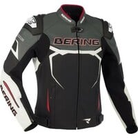 |
|            **[BERING - HOBART](https://bering.fr/homme/blouson/hobart.html?___store=)**             EN-17092-20xx-AAA            371,80 € ([Motoblouz](https://pkw.motoblouz.com/?P4122157BDFF171&redir=https%3A%2F%2Fwww.motoblouz.com%2Frecherche%2FBERING%2520HOBART.html))           |  |

## FURYGAN :

 | Modèle | Photos |
|---|---|
|            **[FURYGAN - ALBA](https://www.furygan.com/Produits.aspx?l=alba&prod=369552017&cat=19380)**             EN-17092-2020 AAA            340,10 € ([Motoblouz](https://pkw.motoblouz.com/?P4122157BDFF171&redir=https%3A%2F%2Fwww.motoblouz.com%2Frecherche%2FFURYGAN%2520ALBA.html))            | 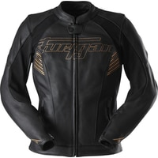 |
|            **[FURYGAN - GHOST](https://www.furygan.com/Produits.aspx?l=ghost&prod=195512890&cat=19380)**             EN-17092-2020 AAA            395,50 € ([Motoblouz](https://pkw.motoblouz.com/?P4122157BDFF171&redir=https%3A%2F%2Fwww.motoblouz.com%2Frecherche%2FFURYGAN%2520GHOST.html))            | 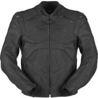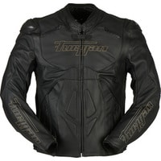 |
|            **[FURYGAN - LIVIA](https://www.furygan.com/Produits.aspx?l=livia&prod=369552018&cat=19380)**             EN-17092-2020 AAA            340,10 € ([Motoblouz](https://pkw.motoblouz.com/?P4122157BDFF171&redir=https%3A%2F%2Fwww.motoblouz.com%2Frecherche%2FFURYGAN%2520LIVIA.html))            | 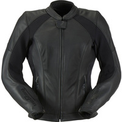 |
|            **[FURYGAN - NITROS](https://www.furygan.com/Produits.aspx?l=nitros&prod=264274666&cat=19380)**             EN-17092-2020 AAA            332,20 € ([Motoblouz](https://pkw.motoblouz.com/?P4122157BDFF171&redir=https%3A%2F%2Fwww.motoblouz.com%2Frecherche%2FFURYGAN%2520NITROS.html))            | 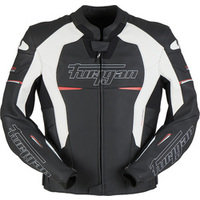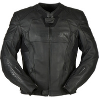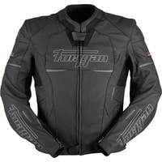 |
|            **[FURYGAN - PRO ONE](https://www.furygan.com/Produits.aspx?l=pro-one&prod=412497136&cat=19380)**             EN-17092-2020 AAA            340,10 € ([Motoblouz](https://pkw.motoblouz.com/?P4122157BDFF171&redir=https%3A%2F%2Fwww.motoblouz.com%2Frecherche%2FFURYGAN%2520PRO%2520ONE.html))            | 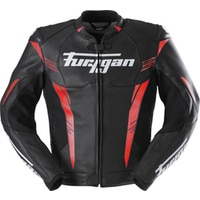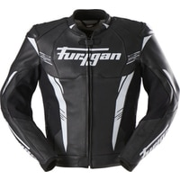 |
|            **[FURYGAN - RAPTOR EVO 2](https://www.furygan.com/Produits.aspx?l=raptor-evo-2&prod=264274667&cat=19380)**             EN-17092-2020 AAA            395,50 € ([Motoblouz](https://pkw.motoblouz.com/?P4122157BDFF171&redir=https%3A%2F%2Fwww.motoblouz.com%2Frecherche%2FFURYGAN%2520RAPTOR%2520EVO%25202.html)) | 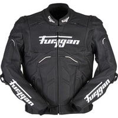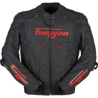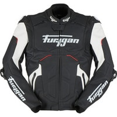 |
|            **[FURYGAN - SHERMAN EVO](https://www.furygan.com/Produits.aspx?l=sherman-evo&prod=369552015&cat=19380)**             EN-17092-2020 AAA            356,00 € ([Motoblouz](https://pkw.motoblouz.com/?P4122157BDFF171&redir=https%3A%2F%2Fwww.motoblouz.com%2Frecherche%2FFURYGAN%2520SHERMAN%2520EVO.html))            | 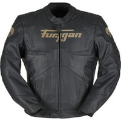 |

## IXON :

 | Modèle | Photos |
|---|---|
|            **[IXON - CEROS](https://www.ixon.com/fra-fr/ceros)**             EN-17092-2020 AAA            316,40 € ([Motoblouz](https://pkw.motoblouz.com/?P4122157BDFF171&redir=https%3A%2F%2Fwww.motoblouz.com%2Frecherche%2FIXON%2520CEROS.html))  **BLOUSON ETE**            | 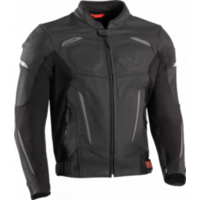 |
|            **[IXON - JACKAL JKT](https://www.ixon.com/fra-fr/jackal-jkt)**             EN-17092-2020 AAA            255,50 € ([Motoblouz](https://pkw.motoblouz.com/?P4122157BDFF171&redir=https%3A%2F%2Fwww.motoblouz.com%2Frecherche%2FIXON%2520JACKAL%2520JKT.html))            | 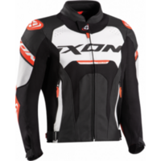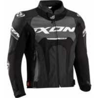 |
|            **[IXON - VENDETTA JKT EVO](https://www.ixon.com/fra-fr/vendetta-jkt-evo)**             EN-17092-2020 AAA            352,70 € ([Motoblouz](https://pkw.motoblouz.com/?P4122157BDFF171&redir=https%3A%2F%2Fwww.motoblouz.com%2Frecherche%2FIXON%2520VENDETTA%2520JKT%2520EVO.html))            | 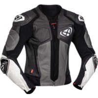 |

## IXS :

 | Modèle | Photos |
|---|---|
|            **[IXS - CLASSIC LD ANDY](https://ixs.com/en/moto/motorcycle-garment/jackets/leather-jackets/2258/classic-ld-jacket-andy-black)**             EN-17092-2020-AAA            337,20 € ([Motoblouz](https://pkw.motoblouz.com/?P4122157BDFF171&redir=https%3A%2F%2Fwww.motoblouz.com%2Frecherche%2FIXS%2520CLASSIC%2520LD%2520ANDY.html))            |  |
|            **[IXS - CLASSIC LD STRIPE](https://ixs.com/en/moto/motorcycle-garment/jackets/leather-jackets/2257/classic-ld-jacket-stripe-black)**             EN-17092-2020-AAA            263,90 € ([Motoblouz](https://pkw.motoblouz.com/?P4122157BDFF171&redir=https%3A%2F%2Fwww.motoblouz.com%2Frecherche%2FIXS%2520CLASSIC%2520LD%2520STRIPE.html))            |  |
|            **[IXS - CLASSIC LD WOMEN'S STRIPE](https://ixs.com/en/moto/motorcycle-garment/jackets/leather-jackets/2681/classic-ld-women-s-jacket-stripe-black)**             EN-17092-2020-AAA            263,90 € ([Motoblouz](https://pkw.motoblouz.com/?P4122157BDFF171&redir=https%3A%2F%2Fwww.motoblouz.com%2Frecherche%2FIXS%2520CLASSIC%2520LD%2520STRIPE.html))              | 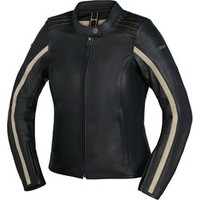 |
|            **[IXS - SPORTS LD RS-600 2.0](https://ixs.com/en/moto/motorcycle-garment/jackets/leather-jackets/2682/sports-ld-jacket-rs-600-2.0-black)**             EN-17092-2020-AAA            374,70 € ([Motoblouz](https://pkw.motoblouz.com/?P4122157BDFF171&redir=https%3A%2F%2Fwww.motoblouz.com%2Frecherche%2FIXS%2520SPORTS%2520LD%2520RS-600%25202-0%2520BLACK.html))            |  |
|            **[IXS - SPORTS LD WOMEN-S RS-600 1.0](https://ixs.com/en/moto/motorcycle-garment/jackets/leather-jackets/2256/sports-ld-women-s-jacket-rs-600-1.0-black-grey-white)**             EN-17092-2020-AAA            299,80 € ([Motoblouz](https://pkw.motoblouz.com/?P4122157BDFF171&redir=https%3A%2F%2Fwww.motoblouz.com%2Frecherche%2FIXS%2520SPORTS%2520LD%2520RS-600%25201-0-.html))            |  |

## KLIM :

 | Modèle | Photos |
|---|---|
|            **[KLIM - BADLANDS PRO A3](https://www.klim.com/Badlands-Pro-A3-Jacket-4101-000)**             EN-17092-20xx-AAA            1 640,00 € ([Motoblouz](https://pkw.motoblouz.com/?P4122157BDFF171&redir=https%3A%2F%2Fwww.motoblouz.com%2Frecherche%2FKLIM%2520BADLANDS%2520PRO%2520A3.html))| 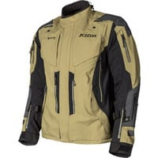 |

## MERLIN :

 | Modèle | Photos |
|---|---|
|            **[MERLIN - GABLE WATERPROOF](https://www.merlinbikegear.com/product/gable-waterproof-jacket/)**             EN-17092-20xx-AAA            549,00 € ([FC-Moto](https://www.fc-moto.de/fr/Merlin-Gable-Veste-en-cuir-de-moto))            | 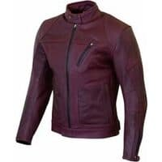 |

## REVIT :

 | Modèle | Photos |
|---|---|
|            **[REVIT - APEX](https://www.revitsport.com/en/motorcycle-jacket-apex-black-neon-red)**             EN-17092-2020-AAA            559,99 € ([Motoblouz](https://pkw.motoblouz.com/?P4122157BDFF171&redir=https%3A%2F%2Fwww.motoblouz.com%2Frecherche%2FREVIT%2520APEX.html))     | 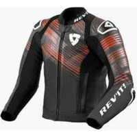 |
|            **[REVIT - QUANTUM 2 PRO AIR](https://www.revitsport.com/en/motorcycle-jacket-quantum-2-pro-air-white-blue)**             EN-17092-2020-AAA            649,99 € ([Motoblouz](https://pkw.motoblouz.com/?P4122157BDFF171&redir=https%3A%2F%2Fwww.motoblouz.com%2Frecherche%2FREVIT%2520QUANTUM%25202%2520PRO%2520AIR.html))  **BLOUSON ETE**           |  |

## RST :

 | Modèle | Photos |
|---|---|
|            **[RST - CUIR SABRE AIRBAG CE](https://www.rst-moto.com/FR/vetements-cuir/blousons-cuir-homme/sabre-airbag-leather-jacket.html)**             EN-17092-20xx-AAA            458,10 € ([Motoblouz](https://pkw.motoblouz.com/?P4122157BDFF171&redir=https%3A%2F%2Fwww.motoblouz.com%2Frecherche%2FRST%2520CUIR%2520SABRE%2520AIRBAG%2520CE.html))            | 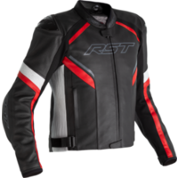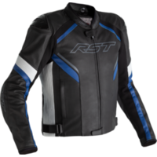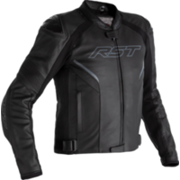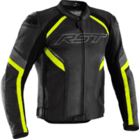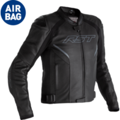 |
|            **[RST - CUIR SABRE CE](https://www.rst-moto.com/FR/vetements-cuir/blousons-cuir-homme/sabre-leather-jacket.html)**             EN-17092-20xx-AAA            308,10 € ([Motoblouz](https://pkw.motoblouz.com/?P4122157BDFF171&redir=https%3A%2F%2Fwww.motoblouz.com%2Frecherche%2FRST%2520CUIR%2520SABRE%2520CE.html))           | 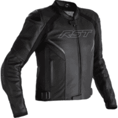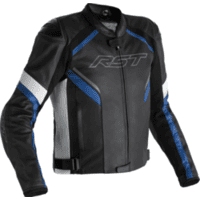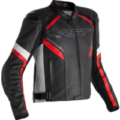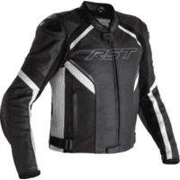 |
|            **[RST - S1 CE LADIES](https://www.rst-moto.com/FR/vetements-textile/blousons-textile-femme/s1-ce-ladies-textile-jacket.html)**             EN-17092-20xx-AAA            274,80 € ([Motoblouz](https://pkw.motoblouz.com/?P4122157BDFF171&redir=https%3A%2F%2Fwww.motoblouz.com%2Frecherche%2FRST%2520S1%2520CE%2520LADIES.html))            | 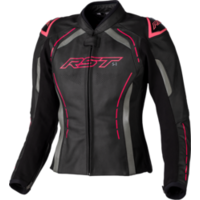 |
|            **[RST - S1 CE MENS](https://www.rst-moto.com/FR/vetements-cuir/blousons-cuir-homme/s1-ce-mens-leather-jacket.html)**             EN-17092-20xx-AAA            274,80 € ([Motoblouz](https://pkw.motoblouz.com/?P4122157BDFF171&redir=https%3A%2F%2Fwww.motoblouz.com%2Frecherche%2FRST%2520S1%2520CE%2520MENS.html))            | 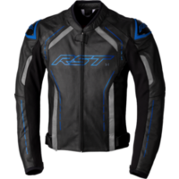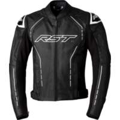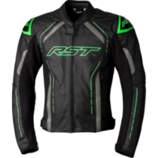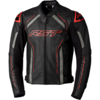 |
|            **[RST - SABRE AIRBAG CE](https://www.rst-moto.com/FR/vetements-textile/blousons-textile-homme/sabre-airbag-textile-jacket.html)**             EN-17092-20xx-AAA            458,10 € ([Motoblouz](https://pkw.motoblouz.com/?P4122157BDFF171&redir=https%3A%2F%2Fwww.motoblouz.com%2Frecherche%2FRST%2520SABRE%2520AIRBAG%2520CE.html))| 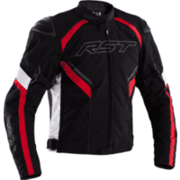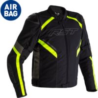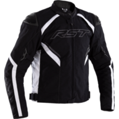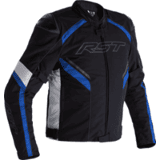 |
|            **[RST - TRACTECH EVO 4](https://www.rst-moto.com/FR/vetements-textile/blousons-textile-homme/tractech-evo-4-textile-jacket.html)**             EN-17092-20xx-AAA            333,10 € ([Motoblouz](https://pkw.motoblouz.com/?P4122157BDFF171&redir=https%3A%2F%2Fwww.motoblouz.com%2Frecherche%2FRST%2520TRACTECH%2520EVO%25204.html))|  |

## SEGURA :

 | Modèle | Photos |
|---|---|
|            **[SEGURA - COBRA](https://segura-moto.fr/homme/blouson/cobra.html)**             EN-17092-20xx-AAA            379,70 € ([Motoblouz](https://pkw.motoblouz.com/?P4122157BDFF171&redir=https%3A%2F%2Fwww.motoblouz.com%2Frecherche%2FSEGURA%2520COBRA.html))            |  |
|            **[SEGURA - DORIAN](https://segura-moto.fr/homme/blouson/dorian.html)**             EN-17092-20xx-AAA            363,90 € ([Motoblouz](https://pkw.motoblouz.com/?P4122157BDFF171&redir=https%3A%2F%2Fwww.motoblouz.com%2Frecherche%2FSEGURA%2520DORIAN.html))            |  |
|            **[SEGURA - FUNKY](https://segura-moto.fr/homme/blouson/funky.html)**             EN-17092-20xx-AAA            356,00 € ([Motoblouz](https://pkw.motoblouz.com/?P4122157BDFF171&redir=https%3A%2F%2Fwww.motoblouz.com%2Frecherche%2FSEGURA%2520FUNKY.html))           |  |
|            **[SEGURA - FUNKY SPEED](https://segura-moto.fr/homme/blouson/funky-speed.html)**             EN-17092-20xx-AAA            356,00 € ([Motoblouz](https://pkw.motoblouz.com/?P4122157BDFF171&redir=https%3A%2F%2Fwww.motoblouz.com%2Frecherche%2FSEGURA%2520FUNKY%2520SPEED.html))       |  |
|            **[SEGURA - LADY DOLLY](https://segura-moto.fr/femme/blouson/lady-dolly.html)**             EN-17092-20xx-AAA            363,90 € ([Motoblouz](https://pkw.motoblouz.com/?P4122157BDFF171&redir=https%3A%2F%2Fwww.motoblouz.com%2Frecherche%2FSEGURA%2520LADY%2520DOLLY.html))      |  |
|            **[SEGURA - LADY DORIAN](https://segura-moto.fr/femme/blouson/lady-dorian.html)**             EN-17092-20xx-AAA            356,00 € ([Motoblouz](https://pkw.motoblouz.com/?P4122157BDFF171&redir=https%3A%2F%2Fwww.motoblouz.com%2Frecherche%2FSEGURA%2520LADY%2520DORIAN.html))        |  |
|            **[SEGURA - LADY FUNKY](https://segura-moto.fr/femme/blouson/lady-funky.html)**             EN-17092-20xx-AAA            340,20 € ([Motoblouz](https://pkw.motoblouz.com/?P4122157BDFF171&redir=https%3A%2F%2Fwww.motoblouz.com%2Frecherche%2FSEGURA%2520LADY%2520FUNKY.html))408,49 € ([Dafy Moto](https://www.dafy-moto.com/recherche?string=SEGURA%20LADY%20FUNKY))            |  |
|            **[SEGURA - LADY FUNKY SPEED](https://segura-moto.fr/femme/blouson/lady-funky-speed.html)**             EN-17092-20xx-AAA            348,10 € ([Motoblouz](https://pkw.motoblouz.com/?P4122157BDFF171&redir=https%3A%2F%2Fwww.motoblouz.com%2Frecherche%2FSEGURA%2520LADY%2520FUNKY%2520SPEED.html))|  |
|            **[SEGURA - LADY LAXEY](https://segura-moto.fr/femme/blouson/lady-laxey.html)**             EN-17092-20xx-AAA            332,30 € ([Motoblouz](https://pkw.motoblouz.com/?P4122157BDFF171&redir=https%3A%2F%2Fwww.motoblouz.com%2Frecherche%2FSEGURA%2520LADY%2520LAXEY.html))            |  |
|            **[SEGURA - LADY SUBOTAI](https://segura-moto.fr/femme/blouson/lady-subotai.html)**             EN-17092-20xx-AAA            436,99 € ([Dafy Moto](https://www.dafy-moto.com/recherche?string=SEGURA%20LADY%20SUBOTAI))            |  |
|            **[SEGURA - LAXEY](https://segura-moto.fr/homme/blouson/laxey.html)**             EN-17092-20xx-AAA            340,20 € ([Motoblouz](https://pkw.motoblouz.com/?P4122157BDFF171&redir=https%3A%2F%2Fwww.motoblouz.com%2Frecherche%2FSEGURA%2520LAXEY.html))            |  |
|            **[SEGURA - OWEN](https://segura-moto.fr/homme/blouson/owen.html)**             EN-17092-20xx-AAA            371,80 € ([Motoblouz](https://pkw.motoblouz.com/?P4122157BDFF171&redir=https%3A%2F%2Fwww.motoblouz.com%2Frecherche%2FSEGURA%2520OWEN.html))     |  |
|            **[SEGURA - SUBOTAI](https://segura-moto.fr/homme/blouson/subotai.html)**             EN-17092-20xx-AAA            379,70 € ([Motoblouz](https://pkw.motoblouz.com/?P4122157BDFF171&redir=https%3A%2F%2Fwww.motoblouz.com%2Frecherche%2FSEGURA%2520SUBOTAI.html))            |  |
|            **[SEGURA - ZAREK](https://segura-moto.fr/homme/blouson/zarek.html)**             EN-17092-20xx-AAA            363,90 € ([Motoblouz](https://pkw.motoblouz.com/?P4122157BDFF171&redir=https%3A%2F%2Fwww.motoblouz.com%2Frecherche%2FSEGURA%2520ZAREK.html))           |  |

---

# ANNEXE : Fabricants ne publiant pas assez/aucune info sur la protection de leurs blousons

- [Belstaff](https://www.belstaff.com/eu/fr/)
- [BMW Motorrad](https://www.bmw-motorrad.fr)
- [Dafy](https://www.dafy-moto.com) :
    - All One
    - DMP
- [Difi](https://www.motoport.eu/en/Difi)
- [Fox](https://foxracing.fr/)
- [Helstons](https://www.helstons.net/)
- [Icon](https://rideicon.com/)
- [Overlap](https://overlap-denim.com/)
- [Richa](https://www.richa.eu/en-us/)
- [VQUATTRO](https://vquattro.com/)
