Cette page inventorie les blousons moto été/ventilés (ou décrits comme tels par le fabricant) qui atteignent le maximum de la norme EN 17092 : AAA.

J'ai mis diverses indications permettant de faire son choix : lieu de fabrication quand connu, imperméabilité, genre annoncé...

J’ai mis le lien Motoblouz/Dafy/Fcmoto lorsque le produit était disponible au moment de la rédaction de l'article _(note : Je peux toucher quelques centimes si vous passez par un de mes liens pour acheter sur Motoblouz)_.

---

# Explications sur la norme EN 17092:20xx

La norme européenne EN 17092 impose d'afficher sur les étiquettes des blousons et pantalons moto une mesure précise sur leur niveau de protection, matérialisée par une étiquette comme celle-ci :

Une explication sur le site "Demonerosso" de Dainese ici : [comment fonctionnent les certifications des vestes et pantalons moto](https://demonerosso.dainese.com/fr/comment-fonctionnent-les-certifications-des-vestes-et-pantalons-de-moto)

Une autre sur le site de VQuattro ici :[NORMES CE DES BLOUSONS MOTO](https://vquattro.com/conseils/normes-ce/normes-ce-pantalons-blousons-moto/)

Il faut essentiellement retenir que le corps est divisé en 3 zones, qui doivent résister à des tests d'abrasion, de déchirure et d'éclatement des coutures différents en fonction de leur exposition.

L'abrasion n'est pas le seul critère mais elle donne une bonne idée des différences entres niveaux A, AA, et AAA :  
L'échantillon de tissu est soumis à une chute simulée à une vitesse donnée, avec frottement jusqu'à immobilisation, il ne doit pas comporter de trou de plus de 5 mm pour être certifié.  
Les vitesses de chute par niveau :

- AAA :
    - Zone 1 : Chute à 120 km/h
    - Zone 2 : Chute à 75 km/h
    - Zone 3 : Chute à 45 km/h
- AA :
    - Zone 1 : Chute à 70 km/h
    - Zone 2 : Chute à 45 km/h
    - Zone 3 : Chute à 25 km/h
- A :
    - Zone 1 : Chute à 45 km/h
    - Zone 2 : Chute à 25 km/h
    - Zone 3 : Non testée

(_A garder en tête :_ Le revêtement sur lequel les tests sont effectués est en ciment, c'est beaucoup moins abrasif que le bitume de nos routes)

Les 2 autres niveaux, B et C, sont sans grand intérêt : Le B est un A sans coques, et le C propose une protection vraiment très faible.

> Complément :  
> 1) Cuir VS fibres de la NASA ?  
> La norme EN 17092 permet de s'assurer que le vêtement dépasse un seuil de résistance donné pour des types d'agressions précis. Rien ne permet de savoir si ce vêtement le dépasse tout juste ou très largement.  
> A niveau de certification égal, les différents comparatifs semblent toujours mettre le cuir en premier, suivi des tissus techniques multi-couches et enfin des tissus techniques mono-couche.  
> Quelques sources :  
> Discussions argumentées tournant autour des pantalons multi ou mono-couche [ici (advrider)](https://www.advrider.com/f/threads/single-layer-vs-double-layer-jeans-test-video.1550527/), [ici (advrider)](https://www.advrider.com/f/threads/single-layer-jeans-a-few-models-compared.1551669/), [ici (Hood Jeans)](https://www.hoodjeans.co.uk/single-layer-motorcycle-jeans/).  
> On y trouve une très intéressante interview vidéo de Chris Hurren, un des chercheurs derrière le site australien [Motocap](https://www.motocap.com.au/) qui effectue des tests indépendants selon des critères assez proches de l'ancienne norme EN 13595.

> 2) Quid de l'ancienne norme EN 13595 de 2002, ou la variante française de 2012 ?  
> Plusieurs commentateurs indiquent que ces 2 anciennes normes étaient plus exigeantes dès leur niveau 1, que l'EN 17092 niveau AAA. En contrepartie elles n'étaient ni obligatoires, ni (apparemment) appliquées à la lettre.
> Difficile de dire si on y a gagné ou perdu (sûrement un peu des deux), en attendant nos avons à présent l'EN 17092, autant essayer d'en tirer le maximum !

> 3) Existe-t-il d'autres types d'évaluation ?  
> L'organisme australien [Motocap](https://www.motocap.com.au/) (composé d'associations, universitaires, acteurs publics et privés) réalise ses propres tests de vêtements selon des principes différents :
> Leurs tests d'abrasion sont par exemple plus exigeants en raison des revêtements australiens et néo-zélandais qui sont plus abrasifs que l'asphalt ("chip-seal"). Ils réalisent un test de "breathability" (évacuation de l'humidité) qui a tout son sens pour les chaleurs australiennes, et sera utile à ceux qui vivent sous les tropiques ou cherchent un blouson pour les étés caniculaires.
> Malheureusement peu de blousons de cette liste y sont testés pour le moment :  
> Je n'ai trouvé que le SABRE CE de RST [ici](https://www.motocap.com.au/product/sabre-ce) (pensez à ouvrir le pdf "test report>technical report" pour le bilan détaillé).  

---

> *Note :* Cette page a été réalisée à partir des données fournies par les fabricants sur leurs sites Web.
> Sa génération est en grande partie automatisée, il peut donc y avoir quelques erreurs.
> 
> Les fabricants analysés sont les suivants :
> [ACERBIS](https://www.acerbis.com/), 
[ALPINESTARS](https://www.alpinestars.com/), 
[BERING](https://bering.fr/), 
[BMW](https://www.bmw-motorrad.fr/), 
[BULL-IT](https://www.bull-it.com/), 
[COURSE](https://www.xlmoto.com/), 
[DAINESE](https://www.dainese.com), 
[DUCATI](https://www.ducati.com/), 
[DXR](https://www.motoblouz.com/), 
[ESQUAD](https://www.esquad.fr/), 
[EUDOXIE](https://eudoxie.shop/), 
[FALCO](https://giannifalco.com/), 
[FIVE](https://five-gloves.com/), 
[FORMA](https://www.formabootsusa.com/), 
[FUEL](https://fuelmotorcycles.eu/), 
[FURYGAN](https://www.furygan.com/), 
[GOLDTOP](https://goldtop.co.uk/), 
[HALVARSSONS](https://halvarssonsmc.com/), 
[HELSTONS](https://www.helstons.net/), 
[HEVIK](https://www.hevik.co.uk/), 
[HOOD](https://www.hoodjeans.co.uk), 
[IXON](https://www.ixon.com/), 
[IXS](https://ixs.com/), 
[JOHN-DOE](https://www.ridejohndoe.com/), 
[KLIM](https://www.klim.com/), 
[KNOX](https://www.planet-knox.com), 
[LOUIS](https://www.louis.ie), 
[LS2](https://www.ls2usa.com/), 
[MERLAMOTO](https://merlamoto.com/), 
[MERLIN](https://www.merlinbikegear.shop/), 
[MOTOGIRL](https://motogirl.co.uk/), 
[OJ](https://ojworld.it/), 
[OXFORD](https://www.oxfordproducts.com/), 
[PANDO](https://pandomoto.com/), 
[PMJ](https://pmj.it/), 
[RACERED](https://racered.eu/), 
[RACER](https://www.racer1927.com/), 
[RAXID](https://raxid.co.uk), 
[RESURGENCE-GEAR](https://resurgencegear.net/), 
[REVIT](https://www.revitsport.com/), 
[ROADSKIN](https://roadskin.co.uk/), 
[ROKKER](https://www.eu.therokkercompany.com/), 
[RST](https://www.rst-moto.com/), 
[RUKKA](https://luhta.com/), 
[SEGURA](https://segura-moto.fr/), 
[SEVENTY-DEGREES](https://seventy-70.com/), 
[SIDI](https://www.sidi.com/), 
[SOUBIRAC](https://www.soubirac.fr/), 
[SPIDI](https://www.spidi.com/), 
[TCX](https://www.tcxboots.com/), 
[2MILESIX](https://www.2milesix.com/).

> 
> Les fabricants suivants ont été exclus car ils n'affichent pas le niveau de sécurité de leurs produits, ou ne sont pas commercialisés en Europe : ARLEN NESS, ARMURE, BELSTAFF, BILT, BOGOTTO, BOLID'STER, DRAGGIN, DRIRIDER, ELEVEIT, FLY MOTO, FOX, GAERNE, HARLEY DAVIDSON, HELD, HOLYFREEDOM, HONDA, ICON, INDIAN, KAWASAKI, KLIM, KTM, LEATT, MACNA, O'NEAL, OVERLAP, REAX, RICHA, RJAYS, RST, RUSTY STITCHES, SAINT, SCOTT, SEDICI, SHOT, SIDI, SOUBIRAC, SPIRIT MOTORS, STADLER, STREET & STEEL, STYLMARTIN, THOR, TRIUMPH, VENDRAMINI, WEX, XPD, YAMAHA

---

## Modèles à 192,99 € :

 | Modèle | Photos |
|---|---|
|                                                                                           **[PMJ - MIAMI](https://en.pmj.it/collections/jackets/products/miami)**                                                                                                                                                                                       EN17092-AAA                                                                                                                                                                                         Eté                                                                                                                                                                                                                                                                                   ") Respirant                                                                                                                                                                                                                                                                                   Fabriqué en Europe :   ") Italie                                                                                                                                                                                                                                                                                   Prix en ligne au moment de la rédaction :                                                                                            - [192,99 €](https://www.dafy-moto.com/recherche?string=PMJ%20MIAMI) (dafy)                                                                                            - [259,00 €](https://en.pmj.it/collections/jackets/products/miami) (Fabricant)                                                                                                                                                                                                                                                                                    Pour les rechercher en occasion (~60-130 €) :                                                                                                                                                                                        |                                                                                                                                                                                      |                                                                                           

## Modèles à 209,14 € :

 | Modèle | Photos |
|---|---|
|                                                                                           **[PMJ - LUCY](https://en.pmj.it/collections/jackets/products/lucy)**                                                                                                                                                                                       EN17092-AAA                                                                                                                                                                                        ") Modèle femme                                                                                                                                                                                        Eté                                                                                                                                                                                                                                                                                    Mono-couche/single-layer                                                                                                                                                                                       ") Respirant                                                                                                                                                                                                                                                                                   Fabriqué en Europe :   ") Italie                                                                                                                                                                                                                                                                                   Prix en ligne au moment de la rédaction :                                                                                            - [209,14 €](https://www.dafy-moto.com/recherche?string=PMJ%20LUCY) (dafy)                                                                                            - [239,00 €](https://en.pmj.it/collections/jackets/products/lucy) (Fabricant)                                                                                                                                                                                                                                                                                    Pour les rechercher en occasion (~60-150 €) :                                                                                                                                                                                        |                                                                                                                                                                                      |                                                                                           
|                                                                                           **[PMJ - WEST](https://en.pmj.it/collections/jackets/products/west)**                                                                                                                                                                                       EN17092-AAA                                                                                                                                                                                         Eté                                                                                                                                                                                                                                                                                    Mono-couche/single-layer                                                                                                                                                                                       ") Respirant                                                                                                                                                                                                                                                                                   Fabriqué en Europe :   ") Italie                                                                                                                                                                                                                                                                                   Prix en ligne au moment de la rédaction :                                                                                            - [209,14 €](https://www.dafy-moto.com/recherche?string=PMJ%20WEST) (dafy)                                                                                            - [259,00 €](https://en.pmj.it/collections/jackets/products/west) (Fabricant)                                                                                                                                                                                                                                                                                    Pour les rechercher en occasion (~60-150 €) :                                                                                                                                                                                        |                                                                                                                                                                                      |                                                                                           

## Modèles à 249,00 € :

 | Modèle | Photos |
|---|---|
|                                                                                           **[JOHN-DOE - 2 COLOR](https://www.ridejohndoe.com/en/mens-hoodie-2-color-with.html)**                                                                                                                                                                                       EN17092-AAA                                                                                                                                                                                         Eté                                                                                                                                                                                                                                                                                    Double-couche                                                                                                                                                                                       ") Respirant                                                                                                                                                                                                                                                                                   Fabriqué en Europe :   ") Portugal                                                                                                                                                                                                                                                                                   Prix en ligne au moment de la rédaction :                                                                                            - [249,00 €](https://www.ridejohndoe.com/en/mens-hoodie-2-color-with.html) (Fabricant)                                                                                                                                                                                                                                                                                    Pour les rechercher en occasion (~70-170 €) :                                                                                                                                                                                        |                                                                                                                                                                                      |                                                                                           
|                                                                                           **[JOHN-DOE - HOODIE](https://www.ridejohndoe.com/en/mens-hoodie-black-with-jhk7001.html)**                                                                                                                                                                                       EN17092-AAA                                                                                                                                                                                         Eté                                                                                                                                                                                                                                                                                    Double-couche                                                                                                                                                                                       ") Respirant                                                                                                                                                                                                                                                                                   Fabriqué en Europe :   ") Portugal                                                                                                                                                                                                                                                                                   Une bonne présentation sur Youtube :                                                                                            [Urban Rider - John Doe XTM Hoodie V2 - Now AAA Rated!](https://www.youtube.com/watch?v=OnT8y-VYzR8)                                                                                                                                                                                        Prix en ligne au moment de la rédaction :                                                                                            - [249,00 €](https://www.ridejohndoe.com/en/mens-hoodie-black-with-jhk7001.html) (Fabricant)                                                                                                                                                                                                                                                                                    Pour les rechercher en occasion (~70-170 €) :                                                                                                                                                                                        |                                                                                                                                                                                      |                                                                                           
|                                                                                           **[JOHN-DOE - V2](https://www.ridejohndoe.com/en/jhk7003-hoodie-v2.html)**                                                                                                                                                                                       EN17092-AAA                                                                                                                                                                                         Eté                                                                                                                                                                                                                                                                                    Double-couche                                                                                                                                                                                       ") Respirant                                                                                                                                                                                                                                                                                   Fabriqué en Europe :   ") Portugal                                                                                                                                                                                                                                                                                   Une bonne présentation sur Youtube :                                                                                            [Urban Rider - John Doe XTM Hoodie V2 - Now AAA Rated!](https://www.youtube.com/watch?v=OnT8y-VYzR8)                                                                                                                                                                                        Prix en ligne au moment de la rédaction :                                                                                            - [249,00 €](https://www.ridejohndoe.com/en/jhk7003-hoodie-v2.html) (Fabricant)                                                                                                                                                                                                                                                                                    Pour les rechercher en occasion (~70-170 €) :                                                                                                                                                                                        |                                                                                                                                                                                      |                                                                                           
|                                                                                           **[RESURGENCE-GEAR - PEKEV TRUCKER](https://resurgencegear.net/collections/mens-jackets/products/resurgence-gear-pekev-trucker-ce-denim-jacket)**                                                                                                                                                                                       EN17092-AAA                                                                                                                                                                                         Eté                                                                                                                                                                                                                                                                                   ") Respirant                                                                                                                                                                                                                                                                                   Lieu de fabrication inconnu.                                                                                                                                                                                                                                                                                   Prix en ligne au moment de la rédaction :                                                                                            - [249,00 £](https://resurgencegear.net/collections/mens-jackets/products/resurgence-gear-pekev-trucker-ce-denim-jacket) (Fabricant)                                                                                                                                                                                                                                                                                    Pour les rechercher en occasion (~70-170 €) :                                                                                                                                                                                        |                                                                                           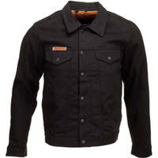                                                                                           |                                                                                           

## Modèles à 259,00 € :

 | Modèle | Photos |
|---|---|
|                                                                                           **[JOHN-DOE - MENS SOFTSHELL 2 IN 1 WITH](https://www.ridejohndoe.com/en/jsk8003-mens-softshell-jacket-2-in-1-with-xtm.html)**                                                                                                                                                                                       EN17092-AAA                                                                                                                                                                                        ") Modèle homme                                                                                                                                                                                        Eté                                                                                                                                                                                                                                                                                    Double-couche                                                                                                                                                                                       ") Respirant                                                                                                                                                                                                                                                                                   Fabriqué en Europe :   ") Portugal                                                                                                                                                                                                                                                                                   Prix en ligne au moment de la rédaction :                                                                                            - [259,00 €](https://www.ridejohndoe.com/en/jsk8003-mens-softshell-jacket-2-in-1-with-xtm.html) (Fabricant)                                                                                                                                                                                                                                                                                    Pour les rechercher en occasion (~80-180 €) :                                                                                                                                                                                        |                                                                                           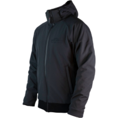                                                                                           |                                                                                           
|                                                                                           **[JOHN-DOE - MOTOSHIRT](https://www.ridejohndoe.com/en/jdl5016-motoshirt-prison.html)**                                                                                                                                                                                       EN17092-AAA                                                                                                                                                                                        ") Modèle homme                                                                                                                                                                                        Eté                                                                                                                                                                                                                                                                                    Double-couche                                                                                                                                                                                       ") Respirant                                                                                                                                                                                                                                                                                   Fabriqué en Europe :   ") Portugal                                                                                                                                                                                                                                                                                   Une bonne présentation sur Youtube :                                                                                            [Urban Rider - John Doe XTM Motoshirt review - 2019](https://www.youtube.com/watch?v=YkcauqmQQ2o)                                                                                                                                                                                        Prix en ligne au moment de la rédaction :                                                                                            - [259,00 €](https://www.ridejohndoe.com/en/jdl5016-motoshirt-prison.html) (Fabricant)                                                                                                                                                                                                                                                                                    Pour les rechercher en occasion (~80-180 €) :                                                                                                                                                                                        |                                                                                                                                                                                                                                                                                                                                                                                                                                                                                                                                                                                                                                                                                                                                                                                                                                                                                                                                              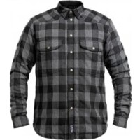                                                                                                                                                                                                                                                                                 |                                                                                           
|                                                                                           **[JOHN-DOE - MOTOSHIRT WOMEN](https://www.ridejohndoe.com/en/jdl8002-motoshirt-women-black.html)**                                                                                                                                                                                       EN17092-AAA                                                                                                                                                                                        ") Modèle femme                                                                                                                                                                                        Eté                                                                                                                                                                                                                                                                                    Double-couche                                                                                                                                                                                       ") Respirant                                                                                                                                                                                                                                                                                   Fabriqué en Europe :   ") Portugal                                                                                                                                                                                                                                                                                   Prix en ligne au moment de la rédaction :                                                                                            - [259,00 €](https://www.ridejohndoe.com/en/jdl8002-motoshirt-women-black.html) (Fabricant)                                                                                                                                                                                                                                                                                    Pour les rechercher en occasion (~80-180 €) :                                                                                                                                                                                        |                                                                                                                                                                                                                                                                                                                                                                            |                                                                                           

## Modèles à 299,00 € :

 | Modèle | Photos |
|---|---|
|                                                                                           **[JOHN-DOE - MAVERICK](https://www.ridejohndoe.com/en/j5001-maverick-xtmr-monolayer-jacket.html)**                                                                                                                                                                                       EN17092-AAA                                                                                                                                                                                        ") Modèle homme                                                                                                                                                                                        Eté                                                                                                                                                                                                                                                                                    Mono-couche/single-layer                                                                                                                                                                                       ") Respirant                                                                                                                                                                                                                                                                                   Fabriqué en Europe :   ") Portugal                                                                                                                                                                                                                                                                                   Une bonne présentation sur Youtube :                                                                                            [Urban Rider - JOHN DOE Maverick Mono Denim Jacket Review](https://www.youtube.com/watch?v=noHWkhzwoaU)                                                                                                                                                                                        Prix en ligne au moment de la rédaction :                                                                                            - [299,00 €](https://www.ridejohndoe.com/en/j5001-maverick-xtmr-monolayer-jacket.html) (Fabricant)                                                                                                                                                                                                                                                                                    Pour les rechercher en occasion (~90-210 €) :                                                                                                                                                                                        |                                                                                           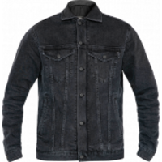                                                                                           |                                                                                           
|                                                                                           **[RESURGENCE-GEAR - ULTRA RIDING](https://resurgencegear.net/collections/riding-shirts/products/resurgence-gear-mens-ultra-ce-riding-shirt-black)**                                                                                                                                                                                       EN17092-AAA                                                                                                                                                                                        ") Modèle homme                                                                                                                                                                                        Eté                                                                                                                                                                                                                                                                                   ") Respirant                                                                                                                                                                                                                                                                                   Lieu de fabrication inconnu.                                                                                                                                                                                                                                                                                   Prix en ligne au moment de la rédaction :                                                                                            - [299,00 £](https://resurgencegear.net/collections/riding-shirts/products/resurgence-gear-mens-ultra-ce-riding-shirt-black) (Fabricant)                                                                                                                                                                                                                                                                                    Pour les rechercher en occasion (~90-210 €) :                                                                                                                                                                                        |                                                                                                                                                                                                                                                                                 |                                                                                           

## Modèles à 339,90 € :

 | Modèle | Photos |
|---|---|
|                                                                                           **[IXS - SPORTS LD WOMEN S RS 600 1 0](https://ixs.com/en/moto/motorcycle-garment/jackets/leather-jackets/2256/sports-ld-women-s-jacket-rs-600-1.0-black-grey-white)**                                                                                                                                                                                       EN17092-AAA                                                                                                                                                                                        ") Modèle femme                                                                                                                                                                                        Eté                                                                                                                                                                                                                                                                                   ") Cuir                                                                                                                                                                                       ") Respirant                                                                                                                                                                                                                                                                                   Lieu de fabrication inconnu.                                                                                                                                                                                                                                                                                   Prix en ligne au moment de la rédaction :                                                                                            - [339,90 €](https://pkw.motoblouz.com/?P4122157BDFF171&redir=https%3A%2F%2Fwww.motoblouz.com%2Frecherche%2FIXS%2520SPORTS%2520LD%2520WOMEN%2520S%2520RS%2520600%25201%25200.html) (motoblouz)                                                                                            - [399,95 €](https://ixs.com/en/moto/motorcycle-garment/jackets/leather-jackets/2256/sports-ld-women-s-jacket-rs-600-1.0-black-grey-white) (Fabricant)                                                                                                                                                                                                                                                                                    Pour les rechercher en occasion (~100-240 €) :                                                                                                                                                                                        |                                                                                                                                                                                                                                                                                 |                                                                                           
|                                                                                           **[IXON - CEROS](https://www.ixon.com/fra-fr/ceros)**                                                                                                                                                                                       EN17092-AAA                                                                                                                                                                                         Eté                                                                                                                                                                                                                                                                                   ") Cuir                                                                                                                                                                                       ") Respirant                                                                                                                                                                                                                                                                                   Fabriqué en Asie / Europe.                                                                                                                                                                                                                                                                                   Prix en ligne au moment de la rédaction :                                                                                            - [339,95 €](https://www.fc-moto.de/epages/fcm.sf/fr_FR/?ViewAction=FacetedSearchProducts&SearchString=IXON+CEROS) (fcmoto)                                                                                            - [339,14 €](https://www.dafy-moto.com/recherche?string=IXON%20CEROS) (dafy)                                                                                            - [419,99 €](https://www.ixon.com/fra-fr/ceros) (Fabricant)                                                                                                                                                                                                                                                                                    Pour les rechercher en occasion (~100-240 €) :                                                                                                                                                                                        |                                                                                                                                                                                                                                                                                                                                                                            |                                                                                           

## Modèles à 379,00 € :

 | Modèle | Photos |
|---|---|
|                                                                                           **[JOHN-DOE - EXPLORER](https://www.ridejohndoe.com/en/j3001-explorer-jacket-xtm-black.html)**                                                                                                                                                                                       EN17092-AAA                                                                                                                                                                                         Eté                                                                                                                                                                                                                                                                                    Double-couche                                                                                                                                                                                       ") Respirant                                                                                                                                                                                                                                                                                   Fabriqué en Europe :   ") Portugal                                                                                                                                                                                                                                                                                   Une bonne présentation sur Youtube :                                                                                            [Urban Rider - John Doe Explorer AAA Rated Motorcycle Jacket Review](https://www.youtube.com/watch?v=X3CKiexcZKk)                                                                                                                                                                                        Prix en ligne au moment de la rédaction :                                                                                            - [379,00 €](https://www.ridejohndoe.com/en/j3001-explorer-jacket-xtm-black.html) (Fabricant)                                                                                                                                                                                                                                                                                    Pour les rechercher en occasion (~110-270 €) :                                                                                                                                                                                        |                                                                                                                                                                                                                                                                                                                                                                            |                                                                                           
|                                                                                           **[KNOX - MEN HONISTER](https://www.planet-knox.com/product/mens-honister-jacket/)**                                                                                                                                                                                       EN17092-AAA                                                                                                                                                                                        ") Modèle homme                                                                                                                                                                                        Toutes-saisons                                                                                                                                                                                                                                                                                   ") Cuir                                                                                                                                                                                       ") Imperméable                                                                                                                                                                                       ") Respirant                                                                                                                                                                                                                                                                                   Fabriqué en Europe / Asie :   ") Chine                                                                                                                                                                                                                                                                                   Prix en ligne au moment de la rédaction :                                                                                            - [379,99 £](https://www.planet-knox.com/product/mens-honister-jacket/) (Fabricant)                                                                                                                                                                                                                                                                                    Pour les rechercher en occasion (~110-270 €) :                                                                                                                                                                                        |                                                                                                                                                                                      |                                                                                           
|                                                                                           **[KNOX - WOMEN HONISTER](https://www.planet-knox.com/product/womens-honister-jacket/)**                                                                                                                                                                                       EN17092-AAA                                                                                                                                                                                        ") Modèle femme                                                                                                                                                                                        Toutes-saisons                                                                                                                                                                                                                                                                                   ") Cuir                                                                                                                                                                                       ") Imperméable                                                                                                                                                                                       ") Respirant                                                                                                                                                                                                                                                                                   Fabriqué en Europe / Asie :   ") Chine                                                                                                                                                                                                                                                                                   Prix en ligne au moment de la rédaction :                                                                                            - [379,99 £](https://www.planet-knox.com/product/womens-honister-jacket/) (Fabricant)                                                                                                                                                                                                                                                                                    Pour les rechercher en occasion (~110-270 €) :                                                                                                                                                                                        |                                                                                                                                                                                      |                                                                                           

## Modèles à 383,95 € :

 | Modèle | Photos |
|---|---|
|                                                                                           **[ALPINESTARS - STELLA KIRA](https://www.alpinestars.com/products/stella-kira-leather-jacket)**                                                                                                                                                                                       EN17092-AAA                                                                                                                                                                                        ") Modèle femme                                                                                                                                                                                        Eté                                                                                                                                                                                                                                                                                   ") Cuir                                                                                                                                                                                       ") Respirant                                                                                                                                                                                                                                                                                   Fabriqué en Europe / Asie :   ") Roumanie  ") Chine                                                                                                                                                                                                                                                                                   Une bonne présentation sur Youtube :                                                                                            [RevZilla - Alpinestars Stella T-Kira WP Jacket Review](https://www.youtube.com/watch?v=Azoz4Wu3Yj0)                                                                                                                                                                                        Prix en ligne au moment de la rédaction :                                                                                            - [383,95 €](https://www.fc-moto.de/epages/fcm.sf/fr_FR/?ViewAction=FacetedSearchProducts&SearchString=ALPINESTARS+STELLA%20KIRA) (fcmoto)                                                                                            - [403,71 €](https://www.dafy-moto.com/recherche?string=ALPINESTARS%20STELLA%20KIRA) (dafy)                                                                                            - [429,95 $](https://www.alpinestars.com/products/stella-kira-leather-jacket) (Fabricant)                                                                                            - [455,90 €](https://pkw.motoblouz.com/?P4122157BDFF171&redir=https%3A%2F%2Fwww.motoblouz.com%2Frecherche%2FALPINESTARS%2520STELLA%2520KIRA.html) (motoblouz)                                                                                                                                                                                                                                                                                    Pour les rechercher en occasion (~110-270 €) :                                                                                                                                                                                        |                                                                                           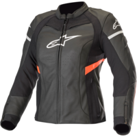                                                                                                                                                                                                                                                                                                                                                                            |                                                                                           
|                                                                                           **[ALPINESTARS - STELLA KIRA V2](https://www.alpinestars.com/products/stella-kira-v2-leather-jacket)**                                                                                                                                                                                       EN17092-AAA                                                                                                                                                                                        ") Modèle femme                                                                                                                                                                                        Eté                                                                                                                                                                                                                                                                                   ") Cuir                                                                                                                                                                                       ") Imperméable                                                                                                                                                                                       ") Respirant                                                                                                                                                                                                                                                                                   Fabriqué en Europe / Asie :   ") Chine  ") Roumanie                                                                                                                                                                                                                                                                                    Prix en ligne au moment de la rédaction :                                                                                            - [383,95 €](https://www.fc-moto.de/epages/fcm.sf/fr_FR/?ViewAction=FacetedSearchProducts&SearchString=ALPINESTARS+STELLA%20KIRA%20V2) (fcmoto)                                                                                            - [403,71 €](https://www.dafy-moto.com/recherche?string=ALPINESTARS%20STELLA%20KIRA%20V2) (dafy)                                                                                            - [455,90 €](https://pkw.motoblouz.com/?P4122157BDFF171&redir=https%3A%2F%2Fwww.motoblouz.com%2Frecherche%2FALPINESTARS%2520STELLA%2520KIRA%2520V2.html) (motoblouz)                                                                                            - [469,95 $](https://www.alpinestars.com/products/stella-kira-v2-leather-jacket) (Fabricant)                                                                                                                                                                                                                                                                                    Pour les rechercher en occasion (~110-270 €) :                                                                                                                                                                                        |                                                                                                                                                                                                                                                                                                                                                                            |                                                                                           

## Modèles à 399,00 € :

 | Modèle | Photos |
|---|---|
|                                                                                           **[PANDO - COMMANDO UH MEN S LIGHT WEIGHT](https://pandomoto.com/product/all/men/commando-uh-black-unisex-light-weight-motorcycle-jacket/)**                                                                                                                                                                                       EN17092-AAA                                                                                                                                                                                        ") Modèle homme                                                                                                                                                                                        Eté                                                                                                                                                                                                                                                                                    Mono-couche/single-layer                                                                                                                                                                                       ") Respirant                                                                                                                                                                                                                                                                                   Lieu de fabrication inconnu.                                                                                                                                                                                                                                                                                   Prix en ligne au moment de la rédaction :                                                                                            - [399,00 €](https://pandomoto.com/product/all/men/commando-uh-black-unisex-light-weight-motorcycle-jacket/) (Fabricant)                                                                                                                                                                                                                                                                                    Pour les rechercher en occasion (~120-280 €) :                                                                                                                                                                                        |                                                                                                                                                                                      |                                                                                           
|                                                                                           **[FURYGAN - RAPTOR EVO 2](https://www.furygan.com/produit/raptor-evo-2/)**                                                                                                                                                                                       EN17092-AAA                                                                                                                                                                                         Eté                                                                                                                                                                                                                                                                                   ") Cuir                                                                                                                                                                                       ") Respirant                                                                                                                                                                                                                                                                                   Fabriqué en proche Europe.                                                                                                                                                                                                                                                                                   Prix en ligne au moment de la rédaction :                                                                                            - [399,90 €](https://www.fc-moto.de/epages/fcm.sf/fr_FR/?ViewAction=FacetedSearchProducts&SearchString=FURYGAN+RAPTOR%20EVO%202) (fcmoto)                                                                                            - [403,66 €](https://www.dafy-moto.com/recherche?string=FURYGAN%20RAPTOR%20EVO%202) (dafy)                                                                                            - [469,90 €](https://pkw.motoblouz.com/?P4122157BDFF171&redir=https%3A%2F%2Fwww.motoblouz.com%2Frecherche%2FFURYGAN%2520RAPTOR%2520EVO%25202.html) (motoblouz)                                                                                            - [499,90 €](https://www.furygan.com/produit/raptor-evo-2/) (Fabricant)                                                                                                                                                                                                                                                                                    Pour les rechercher en occasion (~120-280 €) :                                                                                                                                                                                        |                                                                                                                                                                                      |                                                                                           
|                                                                                           **[FURYGAN - GHOST](https://www.furygan.com/produit/ghost/)**                                                                                                                                                                                       EN17092-AAA                                                                                                                                                                                         Eté                                                                                                                                                                                                                                                                                   ") Cuir                                                                                                                                                                                       ") Respirant                                                                                                                                                                                                                                                                                   Fabriqué en proche Europe.                                                                                                                                                                                                                                                                                   Prix en ligne au moment de la rédaction :                                                                                            - [399,90 €](https://www.fc-moto.de/epages/fcm.sf/fr_FR/?ViewAction=FacetedSearchProducts&SearchString=FURYGAN+GHOST) (fcmoto)                                                                                            - [403,66 €](https://www.dafy-moto.com/recherche?string=FURYGAN%20GHOST) (dafy)                                                                                            - [474,90 €](https://pkw.motoblouz.com/?P4122157BDFF171&redir=https%3A%2F%2Fwww.motoblouz.com%2Frecherche%2FFURYGAN%2520GHOST.html) (motoblouz)                                                                                            - [499,90 €](https://www.furygan.com/produit/ghost/) (Fabricant)                                                                                                                                                                                                                                                                                    Pour les rechercher en occasion (~80-200 €) :                                                                                                                                                                                        |                                                                                                                                                                                      |                                                                                           

## Modèles à 407,96 € :

 | Modèle | Photos |
|---|---|
|                                                                                           **[RST - SABRE AIRBAG MENS](https://www.rst-moto.com/products/sabre-airbag-ce-mens-leather-jacket)**                                                                                                                                                                                       EN17092-AAA                                                                                                                                                                                        ") Modèle homme                                                                                                                                                                                        Eté                                                                                                                                                                                                                                                                                   ") Imperméable                                                                                                                                                                                       ") Respirant                                                                                                                                                                                                                                                                                   Lieu de fabrication inconnu.                                                                                                                                                                                                                                                                                   Prix en ligne au moment de la rédaction :                                                                                            - [407,96 €](https://pkw.motoblouz.com/?P4122157BDFF171&redir=https%3A%2F%2Fwww.motoblouz.com%2Frecherche%2FRST%2520SABRE%2520AIRBAG%2520HOMME.html) (motoblouz)                                                                                            - [599,95 £](https://www.rst-moto.com/products/sabre-airbag-ce-mens-leather-jacket) (Fabricant)                                                                                                                                                                                                                                                                                    Pour les rechercher en occasion (~120-280 €) :                                                                                                                                                                                        |                                                                                           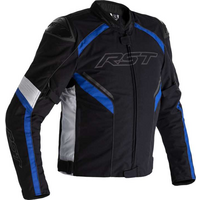                                                                                                                                                                                                                                                                                                                                                                                                                                                                       |                                                                                           

## Modèles à 424,90 € :

 | Modèle | Photos |
|---|---|
|                                                                                           **[IXS - SPORTS LD RS 600 2 0](https://ixs.com/en/moto/motorcycle-garment/jackets/leather-jackets/2682/sports-ld-jacket-rs-600-2.0-black)**                                                                                                                                                                                       EN17092-AAA                                                                                                                                                                                         Eté                                                                                                                                                                                                                                                                                   ") Cuir                                                                                                                                                                                       ") Respirant                                                                                                                                                                                                                                                                                   Lieu de fabrication inconnu.                                                                                                                                                                                                                                                                                   Prix en ligne au moment de la rédaction :                                                                                            - [424,90 €](https://pkw.motoblouz.com/?P4122157BDFF171&redir=https%3A%2F%2Fwww.motoblouz.com%2Frecherche%2FIXS%2520SPORTS%2520LD%2520RS%2520600%25202%25200.html) (motoblouz)                                                                                            - [499,95 €](https://ixs.com/en/moto/motorcycle-garment/jackets/leather-jackets/2682/sports-ld-jacket-rs-600-2.0-black) (Fabricant)                                                                                                                                                                                                                                                                                    Pour les rechercher en occasion (~130-300 €) :                                                                                                                                                                                        |                                                                                                                                                                                      |                                                                                           

## Modèles à 436,75 € :

 | Modèle | Photos |
|---|---|
|                                                                                           **[ALPINESTARS - MISSILE V2](https://www.alpinestars.com/products/missile-v2-leather-jacket)**                                                                                                                                                                                       EN17092-AAA                                                                                                                                                                                        ") Modèle femme                                                                                                                                                                                        Eté                                                                                                                                                                                                                                                                                   ") Cuir                                                                                                                                                                                       ") Respirant                                                                                                                                                                                                                                                                                   Fabriqué en Europe / Asie :   ") Chine  ") Roumanie                                                                                                                                                                                                                                                                                    Prix en ligne au moment de la rédaction :                                                                                            - [436,75 €](https://www.fc-moto.de/epages/fcm.sf/fr_FR/?ViewAction=FacetedSearchProducts&SearchString=ALPINESTARS+MISSILE%20V2) (fcmoto)                                                                                            - [452,16 €](https://www.dafy-moto.com/recherche?string=ALPINESTARS%20MISSILE%20V2) (dafy)                                                                                            - [522,40 €](https://pkw.motoblouz.com/?P4122157BDFF171&redir=https%3A%2F%2Fwww.motoblouz.com%2Frecherche%2FALPINESTARS%2520MISSILE%2520V2.html) (motoblouz)                                                                                            - [524,95 $](https://www.alpinestars.com/products/missile-v2-leather-jacket) (Fabricant)                                                                                                                                                                                                                                                                                    Pour les rechercher en occasion (~90-210 €) :                                                                                                                                                                                        |                                                                                           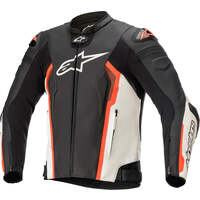                                                                                           |                                                                                           

## Modèles à 439,95 € :

 | Modèle | Photos |
|---|---|
|                                                                                           **[MERLIN - GABLE](https://www.merlinbikegear.shop/collections/leather/products/merlin-gable-waterproof-jacket)**                                                                                                                                                                                       EN17092-AAA                                                                                                                                                                                         Eté                                                                                                                                                                                                                                                                                    Mono-couche/single-layer                                                                                                                                                                                       ") Imperméable                                                                                                                                                                                       ") Respirant                                                                                                                                                                                                                                                                                   Lieu de fabrication inconnu.                                                                                                                                                                                                                                                                                   De bonnes présentations sur Youtube :                                                                                            [Urban Rider - Merlin Gable Waterproof leather Jacket review](https://www.youtube.com/watch?v=y_P7X81_VAo)                                                                                            [RevZilla - Merlin Gable WP Jacket Review](https://www.youtube.com/watch?v=nH3D8CQuZEI)                                                                                                                                                                                        Prix en ligne au moment de la rédaction :                                                                                            - [439,95 €](https://www.fc-moto.de/epages/fcm.sf/fr_FR/?ViewAction=FacetedSearchProducts&SearchString=MERLIN+GABLE) (fcmoto)                                                                                            - [499,99 £](https://www.merlinbikegear.shop/collections/leather/products/merlin-gable-waterproof-jacket) (Fabricant)                                                                                                                                                                                                                                                                                    Pour les rechercher en occasion (~130-310 €) :                                                                                                                                                                                        |                                                                                                                                                                                      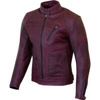                                                                                           |                                                                                           

## Modèles à 448,00 € :

 | Modèle | Photos |
|---|---|
|                                                                                           **[ALPINESTARS - STELLA MISSILE V2](https://www.alpinestars.com/products/stella-missile-v2-leather-jacket)**                                                                                                                                                                                       EN17092-AAA                                                                                                                                                                                        ") Modèle femme                                                                                                                                                                                        Eté                                                                                                                                                                                                                                                                                   ") Cuir                                                                                                                                                                                       ") Respirant                                                                                                                                                                                                                                                                                   Fabriqué en Europe / Asie :   ") Chine  ") Roumanie                                                                                                                                                                                                                                                                                    Prix en ligne au moment de la rédaction :                                                                                            - [448,00 €](https://www.fc-moto.de/epages/fcm.sf/fr_FR/?ViewAction=FacetedSearchProducts&SearchString=ALPINESTARS+STELLA%20MISSILE%20V2) (fcmoto)                                                                                            - [452,16 €](https://www.dafy-moto.com/recherche?string=ALPINESTARS%20STELLA%20MISSILE%20V2) (dafy)                                                                                            - [531,90 €](https://pkw.motoblouz.com/?P4122157BDFF171&redir=https%3A%2F%2Fwww.motoblouz.com%2Frecherche%2FALPINESTARS%2520STELLA%2520MISSILE%2520V2.html) (motoblouz)                                                                                            - [649,95 $](https://www.alpinestars.com/products/stella-missile-v2-leather-jacket) (Fabricant)                                                                                                                                                                                                                                                                                    Pour les rechercher en occasion (~130-310 €) :                                                                                                                                                                                        |                                                                                                                                                                                      |                                                                                           

## Modèles à 452,16 € :

 | Modèle | Photos |
|---|---|
|                                                                                           **[ALPINESTARS - MISSILE V2 AIRFLOW](https://www.alpinestars.com/products/missile-v2-airflow-leather-jacket)**                                                                                                                                                                                       EN17092-AAA                                                                                                                                                                                         Eté                                                                                                                                                                                                                                                                                   ") Cuir                                                                                                                                                                                       ") Respirant                                                                                                                                                                                                                                                                                   Fabriqué en Europe / Asie :   ") Chine  ") Roumanie                                                                                                                                                                                                                                                                                   Une bonne présentation sur Youtube :                                                                                             [RevZilla - Alpinestars Faster V2 Airflow Leather Jacket Review](https://www.youtube.com/watch?v=gA22_lqlLko)                                                                                                                                                                                        Prix en ligne au moment de la rédaction :                                                                                            - [452,16 €](https://www.dafy-moto.com/recherche?string=ALPINESTARS%20MISSILE%20V2%20AIRFLOW) (dafy)                                                                                            - [522,40 €](https://pkw.motoblouz.com/?P4122157BDFF171&redir=https%3A%2F%2Fwww.motoblouz.com%2Frecherche%2FALPINESTARS%2520MISSILE%2520V2%2520AIRFLOW.html) (motoblouz)                                                                                            - [524,95 $](https://www.alpinestars.com/products/missile-v2-airflow-leather-jacket) (Fabricant)                                                                                                                                                                                                                                                                                    Pour les rechercher en occasion (~120-290 €) :                                                                                                                                                                                        |                                                                                                                                                                                      |                                                                                           

## Modèles à 452,19 € :

 | Modèle | Photos |
|---|---|
|                                                                                           **[IXON - VENDETTA JKT EVO](https://www.ixon.com/fra-fr/vendetta-jkt-evo)**                                                                                                                                                                                       EN17092-AAA                                                                                                                                                                                         Eté                                                                                                                                                                                                                                                                                   ") Respirant                                                                                                                                                                                                                                                                                   Fabriqué en Asie / Europe.                                                                                                                                                                                                                                                                                   Prix en ligne au moment de la rédaction :                                                                                            - [452,19 €](https://www.dafy-moto.com/recherche?string=IXON%20VENDETTA%20JKT%20EVO) (dafy)                                                                                            - [484,90 €](https://pkw.motoblouz.com/?P4122157BDFF171&redir=https%3A%2F%2Fwww.motoblouz.com%2Frecherche%2FIXON%2520VENDETTA%2520JKT%2520EVO.html) (motoblouz)                                                                                            - [559,99 €](https://www.ixon.com/fra-fr/vendetta-jkt-evo) (Fabricant)                                                                                                                                                                                                                                                                                    Pour les rechercher en occasion (~140-320 €) :                                                                                                                                                                                        |                                                                                                                                                                                                                                                                                                                                                                                                                                                                                                                                                                                                                                                             |                                                                                           

## Modèles à 454,99 € :

 | Modèle | Photos |
|---|---|
|                                                                                           **[REVIT - QUANTUM 2 PRO AIR](https://www.revitsport.com/fr_fr/blouson-moto-quantum-2-pro-air-blanc-bleu)**                                                                                                                                                                                       EN17092-AAA                                                                                                                                                                                         Eté                                                                                                                                                                                                                                                                                   ") Imperméable                                                                                                                                                                                       ") Respirant                                                                                                                                                                                                                                                                                   Lieu de fabrication inconnu.                                                                                                                                                                                                                                                                                   Une bonne présentation sur Youtube :                                                                                            [RevZilla - REV'IT! Quantum 2 Air Jacket Review](https://www.youtube.com/watch?v=DdovozR5gjQ)                                                                                                                                                                                        Prix en ligne au moment de la rédaction :                                                                                            - [454,99 €](https://www.dafy-moto.com/recherche?string=REVIT%20QUANTUM%202%20PRO%20AIR) (dafy)                                                                                            - [649,99 €](https://www.revitsport.com/fr_fr/blouson-moto-quantum-2-pro-air-blanc-bleu) (Fabricant)                                                                                            - [649,99 €](https://www.fc-moto.de/epages/fcm.sf/fr_FR/?ViewAction=FacetedSearchProducts&SearchString=REVIT+QUANTUM%202%20PRO%20AIR) (fcmoto)                                                                                            - [649,99 €](https://pkw.motoblouz.com/?P4122157BDFF171&redir=https%3A%2F%2Fwww.motoblouz.com%2Frecherche%2FREVIT%2520QUANTUM%25202%2520PRO%2520AIR.html) (motoblouz)                                                                                                                                                                                                                                                                                    Pour les rechercher en occasion (~140-320 €) :                                                                                                                                                                                        |                                                                                                                                                                                                                                                                                 |                                                                                           

## Modèles à 467,95 € :

 | Modèle | Photos |
|---|---|
|                                                                                           **[ALPINESTARS - MISSILE IGNITION V2](https://www.alpinestars.com/products/missile-v2-ignition-leather-jacket)**                                                                                                                                                                                       EN17092-AAA                                                                                                                                                                                         Eté                                                                                                                                                                                                                                                                                   ") Cuir                                                                                                                                                                                       ") Respirant                                                                                                                                                                                                                                                                                   Fabriqué en Europe / Asie :   ") Chine  ") Roumanie                                                                                                                                                                                                                                                                                    Prix en ligne au moment de la rédaction :                                                                                            - [467,95 €](https://www.fc-moto.de/epages/fcm.sf/fr_FR/?ViewAction=FacetedSearchProducts&SearchString=ALPINESTARS+MISSILE%20IGNITION%20V2) (fcmoto)                                                                                            - [484,46 €](https://www.dafy-moto.com/recherche?string=ALPINESTARS%20MISSILE%20IGNITION%20V2) (dafy)                                                                                            - [569,90 €](https://pkw.motoblouz.com/?P4122157BDFF171&redir=https%3A%2F%2Fwww.motoblouz.com%2Frecherche%2FALPINESTARS%2520MISSILE%2520IGNITION%2520V2.html) (motoblouz)                                                                                            - [699,95 $](https://www.alpinestars.com/products/missile-v2-ignition-leather-jacket) (Fabricant)                                                                                                                                                                                                                                                                                    Pour les rechercher en occasion (~140-330 €) :                                                                                                                                                                                        |                                                                                           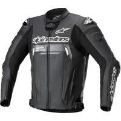                                                                                                                                                                                      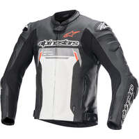                                                                                           |                                                                                           

## Modèles à 519,90 € :

 | Modèle | Photos |
|---|---|
|                                                                                           **[ALPINESTARS - FUSION](https://www.alpinestars.com/products/fusion-leather-jacket)**                                                                                                                                                                                       EN17092-AAA                                                                                                                                                                                         Eté                                                                                                                                                                                                                                                                                   ") Cuir                                                                                                                                                                                       ") Respirant                                                                                                                                                                                                                                                                                   Fabriqué en Europe / Asie :   ") Chine  ") Roumanie                                                                                                                                                                                                                                                                                   Une bonne présentation sur Youtube :                                                                                            [RevZilla - Alpinestars Fusion Leather Jacket Review](https://www.youtube.com/watch?v=TJWAPe4IMEs)                                                                                                                                                                                        Prix en ligne au moment de la rédaction :                                                                                            - [519,90 €](https://pkw.motoblouz.com/?P4122157BDFF171&redir=https%3A%2F%2Fwww.motoblouz.com%2Frecherche%2FALPINESTARS%2520FUSION.html) (motoblouz)                                                                                            - [584,95 €](https://www.fc-moto.de/epages/fcm.sf/fr_FR/?ViewAction=FacetedSearchProducts&SearchString=ALPINESTARS+FUSION) (fcmoto)                                                                                            - [605,58 €](https://www.dafy-moto.com/recherche?string=ALPINESTARS%20FUSION) (dafy)                                                                                            - [799,95 $](https://www.alpinestars.com/products/fusion-leather-jacket) (Fabricant)                                                                                                                                                                                                                                                                                    Pour les rechercher en occasion (~160-360 €) :                                                                                                                                                                                        |                                                                                                                                                                                                                                                                                 |                                                                                           

## Modèles à 520,00 € :

 | Modèle | Photos |
|---|---|
|                                                                                           **[FUEL - SAFARI](https://fuelmotorcycles.eu/collections/jackets/products/safari-jacket?variant=39886534639639)**                                                                                                                                                                                       EN17092-AAA                                                                                                                                                                                         Eté                                                                                                                                                                                                                                                                                   ") Cuir                                                                                                                                                                                        Mono-couche/single-layer                                                                                                                                                                                       ") Respirant                                                                                                                                                                                                                                                                                   Fabriqué en Europe :   ") Italie                                                                                                                                                                                                                                                                                   Une bonne présentation sur Youtube :                                                                                            [Urban Rider - Fuel Safari Jacket Review](https://www.youtube.com/watch?v=xthrNHaKpiA)                                                                                                                                                                                        Prix en ligne au moment de la rédaction :                                                                                            - [520,00 €](https://fuelmotorcycles.eu/collections/jackets/products/safari-jacket?variant=39886534639639) (Fabricant)                                                                                                                                                                                                                                                                                    Pour les rechercher en occasion (~160-360 €) :                                                                                                                                                                                        |                                                                                                                                                                                      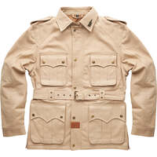                                                                                           |                                                                                           

## Modèles à 552,64 € :

 | Modèle | Photos |
|---|---|
|                                                                                           **[BMW - HOTLAP MEN 2023](https://bmw.europe-moto.com/gb/motorcycle-jackets-bmw-motorrad/34333-28106-bmw-motorcycle-jacket-hotlap-men.html#/295-colour-black/350-size-46)**                                                                                                                                                                                       EN17092-AAA                                                                                                                                                                                        ") Modèle homme                                                                                                                                                                                        Toutes-saisons                                                                                                                                                                                                                                                                                   ") Cuir                                                                                                                                                                                       ") Respirant                                                                                                                                                                                                                                                                                   Lieu de fabrication inconnu.                                                                                                                                                                                                                                                                                   Prix en ligne au moment de la rédaction :                                                                                            - [552,64 €](https://bmw.europe-moto.com/gb/motorcycle-jackets-bmw-motorrad/34333-28106-bmw-motorcycle-jacket-hotlap-men.html#/295-colour-black/350-size-46) (Fabricant)                                                                                                                                                                                                                                                                                    Pour les rechercher en occasion (~170-390 €) :                                                                                                                                                                                        |                                                                                                                                                                                      |                                                                                           

## Modèles à 559,99 € :

 | Modèle | Photos |
|---|---|
|                                                                                           **[REVIT - APEX](https://www.revitsport.com/fr_fr/blouson-moto-apex-noir-neon-rouge)**                                                                                                                                                                                       EN17092-AAA                                                                                                                                                                                         Eté                                                                                                                                                                                                                                                                                   ") Cuir                                                                                                                                                                                       ") Imperméable                                                                                                                                                                                       ") Respirant                                                                                                                                                                                                                                                                                   Lieu de fabrication inconnu.                                                                                                                                                                                                                                                                                   Prix en ligne au moment de la rédaction :                                                                                            - [559,99 €](https://www.fc-moto.de/epages/fcm.sf/fr_FR/?ViewAction=FacetedSearchProducts&SearchString=REVIT+APEX) (fcmoto)                                                                                            - [559,99 €](https://www.revitsport.com/fr_fr/blouson-moto-apex-noir-neon-rouge) (Fabricant)                                                                                                                                                                                                                                                                                    Pour les rechercher en occasion (~70-150 €) :                                                                                                                                                                                        |                                                                                           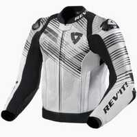                                                                                                                                                                                                                                                                                 |                                                                                           

## Modèles à 569,99 € :

 | Modèle | Photos |
|---|---|
|                                                                                           **[REVIT - HYPERSPEED 2 AIR](https://www.revitsport.com/fr_fr/blouson-moto-hyperspeed-2-air-noir-antracite)**                                                                                                                                                                                       EN17092-AAA                                                                                                                                                                                         Eté                                                                                                                                                                                                                                                                                   ") Imperméable                                                                                                                                                                                       ") Respirant                                                                                                                                                                                                                                                                                   Lieu de fabrication inconnu.                                                                                                                                                                                                                                                                                   Prix en ligne au moment de la rédaction :                                                                                            - [569,99 €](https://www.fc-moto.de/epages/fcm.sf/fr_FR/?ViewAction=FacetedSearchProducts&SearchString=REVIT+HYPERSPEED%202%20AIR) (fcmoto)                                                                                            - [569,99 €](https://www.revitsport.com/fr_fr/blouson-moto-hyperspeed-2-air-noir-antracite) (Fabricant)                                                                                            - [569,99 €](https://pkw.motoblouz.com/?P4122157BDFF171&redir=https%3A%2F%2Fwww.motoblouz.com%2Frecherche%2FREVIT%2520HYPERSPEED%25202%2520AIR.html) (motoblouz)                                                                                            - [569,99 €](https://www.dafy-moto.com/recherche?string=REVIT%20HYPERSPEED%202%20AIR) (dafy)                                                                                                                                                                                                                                                                                    Pour les rechercher en occasion (~60-140 €) :                                                                                                                                                                                        |                                                                                           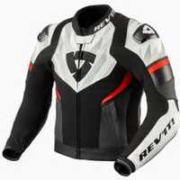                                                                                                                                                                                                                                                                                 |                                                                                           

## Modèles à 599,99 € :

 | Modèle | Photos |
|---|---|
|                                                                                           **[REVIT - HYPERSPEED 2 PRO](https://www.revitsport.com/fr_fr/blouson-moto-hyperspeed-2-pro-noir-bleu)**                                                                                                                                                                                       EN17092-AAA                                                                                                                                                                                         Eté                                                                                                                                                                                                                                                                                   ") Imperméable                                                                                                                                                                                       ") Respirant                                                                                                                                                                                                                                                                                   Lieu de fabrication inconnu.                                                                                                                                                                                                                                                                                   Prix en ligne au moment de la rédaction :                                                                                            - [599,99 €](https://www.revitsport.com/fr_fr/blouson-moto-hyperspeed-2-pro-noir-bleu) (Fabricant)                                                                                            - [599,99 €](https://www.fc-moto.de/epages/fcm.sf/fr_FR/?ViewAction=FacetedSearchProducts&SearchString=REVIT+HYPERSPEED%202%20PRO) (fcmoto)                                                                                            - [599,99 €](https://pkw.motoblouz.com/?P4122157BDFF171&redir=https%3A%2F%2Fwww.motoblouz.com%2Frecherche%2FREVIT%2520HYPERSPEED%25202%2520PRO.html) (motoblouz)                                                                                            - [599,99 €](https://www.dafy-moto.com/recherche?string=REVIT%20HYPERSPEED%202%20PRO) (dafy)                                                                                                                                                                                                                                                                                    Pour les rechercher en occasion (~180-420 €) :                                                                                                                                                                                        |                                                                                           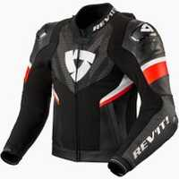                                                                                           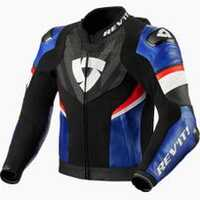                                                                                                                                                                                      |                                                                                           
|                                                                                           **[REVIT - QUANTUM 2](https://www.revitsport.com/fr_fr/blouson-moto-quantum-2-bleu-neon-rouge)**                                                                                                                                                                                       EN17092-AAA                                                                                                                                                                                         Eté                                                                                                                                                                                                                                                                                   ") Imperméable                                                                                                                                                                                       ") Respirant                                                                                                                                                                                                                                                                                   Lieu de fabrication inconnu.                                                                                                                                                                                                                                                                                   Une bonne présentation sur Youtube :                                                                                            [RevZilla - REV'IT! Quantum 2 Air Jacket Review](https://www.youtube.com/watch?v=DdovozR5gjQ)                                                                                                                                                                                        Prix en ligne au moment de la rédaction :                                                                                            - [599,99 €](https://www.fc-moto.de/epages/fcm.sf/fr_FR/?ViewAction=FacetedSearchProducts&SearchString=REVIT+QUANTUM%202) (fcmoto)                                                                                            - [599,99 €](https://www.revitsport.com/fr_fr/blouson-moto-quantum-2-bleu-neon-rouge) (Fabricant)                                                                                                                                                                                                                                                                                    Pour les rechercher en occasion (~50-130 €) :                                                                                                                                                                                        |                                                                                                                                                                                                                                                                                                                                                                            |                                                                                           

## Modèles à 607,05 € :

 | Modèle | Photos |
|---|---|
|                                                                                           **[BMW - DOWNFORCE MEN](https://bmw.europe-moto.com/gb/motorcycle-jackets-bmw-motorrad/20382-23894-bmw-motorcycle-jacket-downforce-men.html#/358-size-60)**                                                                                                                                                                                       EN17092-AAA                                                                                                                                                                                        ") Modèle homme                                                                                                                                                                                        Toutes-saisons                                                                                                                                                                                                                                                                                   ") Cuir                                                                                                                                                                                       ") Imperméable                                                                                                                                                                                       ") Respirant                                                                                                                                                                                                                                                                                   Lieu de fabrication inconnu.                                                                                                                                                                                                                                                                                   Prix en ligne au moment de la rédaction :                                                                                            - [607,05 €](https://bmw.europe-moto.com/gb/motorcycle-jackets-bmw-motorrad/20382-23894-bmw-motorcycle-jacket-downforce-men.html#/358-size-60) (Fabricant)                                                                                                                                                                                                                                                                                    Pour les rechercher en occasion (~180-420 €) :                                                                                                                                                                                        |                                                                                                                                                                                      |                                                                                           

## Modèles à 749,00 € :

 | Modèle | Photos |
|---|---|
|                                                                                           **[HALVARSSONS - RACKEN](https://halvarssonsmc.com/product/racken/)**                                                                                                                                                                                       EN17092-AAA                                                                                                                                                                                        ") Modèle homme                                                                                                                                                                                        Toutes-saisons                                                                                                                                                                                                                                                                                   ") Cuir                                                                                                                                                                                       ") Imperméable                                                                                                                                                                                       ") Respirant                                                                                                                                                                                                                                                                                   Lieu de fabrication inconnu.                                                                                                                                                                                                                                                                                   Prix en ligne au moment de la rédaction :                                                                                            - [749,00 €](https://halvarssonsmc.com/product/racken/) (Fabricant)                                                                                            - [749,00 €](https://www.fc-moto.de/epages/fcm.sf/fr_FR/?ViewAction=FacetedSearchProducts&SearchString=HALVARSSONS+RACKEN) (fcmoto)                                                                                                                                                                                                                                                                                    Pour les rechercher en occasion (~220-520 €) :                                                                                                                                                                                        |                                                                                           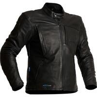                                                                                           |                                                                                           
|                                                                                           **[HALVARSSONS - VITSAND](https://halvarssonsmc.com/product/vitsand/)**                                                                                                                                                                                       EN17092-AAA                                                                                                                                                                                        ") Modèle femme                                                                                                                                                                                        Toutes-saisons                                                                                                                                                                                                                                                                                   ") Cuir                                                                                                                                                                                       ") Imperméable                                                                                                                                                                                       ") Respirant                                                                                                                                                                                                                                                                                   Lieu de fabrication inconnu.                                                                                                                                                                                                                                                                                   Prix en ligne au moment de la rédaction :                                                                                            - [749,00 €](https://halvarssonsmc.com/product/vitsand/) (Fabricant)                                                                                            - [749,00 €](https://www.fc-moto.de/epages/fcm.sf/fr_FR/?ViewAction=FacetedSearchProducts&SearchString=HALVARSSONS+VITSAND) (fcmoto)                                                                                                                                                                                                                                                                                    Pour les rechercher en occasion (~220-520 €) :                                                                                                                                                                                        |                                                                                                                                                                                      |                                                                                           

## Modèles à 980,49 € :

 | Modèle | Photos |
|---|---|
|                                                                                           **[BMW - MORENO GTX MEN 2023](https://bmw.europe-moto.com/gb/motorcycle-jackets-bmw-motorrad/34339-28140-bmw-motorcycle-jacket-moreno-gtx-men.html#/295-colour-black/350-size-46)**                                                                                                                                                                                       EN17092-AAA                                                                                                                                                                                        ") Modèle homme                                                                                                                                                                                        Toutes-saisons                                                                                                                                                                                                                                                                                   ") Imperméable                                                                                                                                                                                       ") Respirant                                                                                                                                                                                                                                                                                   Lieu de fabrication inconnu.                                                                                                                                                                                                                                                                                   Prix en ligne au moment de la rédaction :                                                                                            - [980,49 €](https://bmw.europe-moto.com/gb/motorcycle-jackets-bmw-motorrad/34339-28140-bmw-motorcycle-jacket-moreno-gtx-men.html#/295-colour-black/350-size-46) (Fabricant)                                                                                                                                                                                                                                                                                    Pour les rechercher en occasion (~290-690 €) :                                                                                                                                                                                        |                                                                                                                                                                                      |                                                                                           
|                                                                                           **[BMW - MORENO GTX WOMEN 2023](https://bmw.europe-moto.com/gb/motorcycle-jackets-bmw-motorrad/34337-28132-bmw-motorcycle-jacket-moreno-gtx-women.html#/295-colour-black/381-size-34)**                                                                                                                                                                                       EN17092-AAA                                                                                                                                                                                        ") Modèle femme                                                                                                                                                                                        Toutes-saisons                                                                                                                                                                                                                                                                                   ") Imperméable                                                                                                                                                                                       ") Respirant                                                                                                                                                                                                                                                                                   Lieu de fabrication inconnu.                                                                                                                                                                                                                                                                                   Prix en ligne au moment de la rédaction :                                                                                            - [980,49 €](https://bmw.europe-moto.com/gb/motorcycle-jackets-bmw-motorrad/34337-28132-bmw-motorcycle-jacket-moreno-gtx-women.html#/295-colour-black/381-size-34) (Fabricant)                                                                                                                                                                                                                                                                                    Pour les rechercher en occasion (~290-690 €) :                                                                                                                                                                                        |                                                                                                                                                                                      |                                                                                           

