*# Last update: 31/10/2023 #*

This page complements my [inventory of the most protective motorcycle riding boots (EN 13634: 2222) in June 2023](), it lists riding boots that have all but one level of protection at maximum, so these are EN 13634:2122, EN 13634:2212 and EN 13634:2221.

I put the Motoblouz/Dafy/Fcmoto link when the product was available at the time of writing _(note: I can get a few cents if you go through one of my links to buy from Motoblouz)_.

> _List of updates:_
> 
> _- 31/10/2023: complete revision of the layout, new links, etc._

---

> *Note:* This page is based on data supplied by manufacturers on their websites.
> Its generation is largely automated, so there may be some errors.
> 
> The manufacturers analyzed are
> [ACERBIS](https://www.acerbis.com/), 
[ALPINESTARS](https://www.alpinestars.com/), 
[BERING](https://bering.fr/), 
[BMW](https://www.bmw-motorrad.fr/), 
[BULL-IT](https://www.bull-it.com/), 
[DAINESE](https://www.dainese.com), 
[DUCATI](https://www.ducati.com/), 
[ESQUAD](https://www.esquad.fr/), 
[EUDOXIE](https://eudoxie.shop/), 
[FALCO](https://giannifalco.com/), 
[FIVE](https://five-gloves.com/), 
[FORMA](https://www.formabootsusa.com/), 
[FUEL](https://fuelmotorcycles.eu/), 
[FURYGAN](https://www.furygan.com/), 
[GERBING](https://www.gerbingfrance.fr/), 
[G-HEAT](https://www.g-heat.com/), 
[GOLDTOP](https://goldtop.co.uk/), 
[HALVARSSONS](https://halvarssonsmc.com/), 
[HELSTONS](https://www.helstons.net/), 
[HEVIK](https://www.hevik.co.uk/), 
[HOOD](https://www.hoodjeans.co.uk), 
[IXON](https://www.ixon.com/), 
[IXS](https://ixs.com/), 
[JOHN-DOE](https://www.ridejohndoe.com/), 
[KLIM](https://www.klim.com/), 
[KNOX](https://www.planet-knox.com), 
[LOUIS](https://www.louis.ie), 
[LS2](https://www.ls2usa.com/), 
[MERLAMOTO](https://merlamoto.com/), 
[MERLIN](https://www.merlinbikegear.shop/), 
[MOTOBLOUZ](https://www.motoblouz.com/), 
[MOTOGIRL](https://motogirl.co.uk/), 
[OJ](https://ojworld.it/), 
[OXFORD](https://www.oxfordproducts.com/), 
[PANDO](https://pandomoto.com/), 
[PMJ](https://pmj.it/), 
[RACERED](https://racered.eu/), 
[RACER](https://www.racer1927.com/), 
[RAXID](https://raxid.co.uk), 
[RESURGENCE-GEAR](https://resurgencegear.net/), 
[REV-IT](https://www.revitsport.com/), 
[ROADSKIN](https://roadskin.co.uk/), 
[ROKKER](https://www.eu.therokkercompany.com/), 
[RST](https://www.rst-moto.com/), 
[RUKKA](https://luhta.com/), 
[SEGURA](https://segura-moto.fr/), 
[SEVENTY-DEGREES](https://seventy-70.com/), 
[SIDI](https://www.sidi.com/), 
[SOUBIRAC](https://www.soubirac.fr/), 
[SPIDI](https://www.spidi.com/), 
[TCX](https://www.tcxboots.com/), 
[2MILESIX](https://www.2milesix.com/), 
[COURSE and RIDE AND SONS](https://www.xlmoto.com/).

> 
> The following manufacturers have been excluded because they do not display the safety level of their products, or are not marketed in Europe: ARLEN NESS, ARMURE, BELSTAFF, BILT, BOGOTTO, BOLID'STER, DRAGGIN, DRIRIDER, ELEVEIT, FLY MOTO, FOX, GAERNE, HARLEY DAVIDSON, HELD, HOLYFREEDOM, HONDA, ICON, INDIAN, KAWASAKI, KTM, LEATT, MACNA, O'NEAL, OVERLAP, REAX, RICHA, RJAYS, RUSTY STITCHES, SAINT, SCOTT, SEDICI, SHOT, SIDI, SPIRIT MOTORS, STADLER, STREET & STEEL, STYLMARTIN, THOR, TRIUMPH, VENDRAMINI, WEX, XPD, YAMAHA.

---

## Models at 68,99 € :

 | Model | Photos |
|---|---|
|                                                                                           **OXFORD - DELTA MEN**                                                                                                                                                                                        EN13634-2221                                                                                            ") Summer                                                                                                                                                                                        **Manufacturer pages:**                                                                                            - [oxford_delta_ms_boots_black/](https://www.oxfordproducts.com/motorcycle/product_type/rider_wear/oxford/boots/oxford_delta_ms_boots_black/)                                                                                            - [oxford_delta_short_ms_boots_black/](https://www.oxfordproducts.com/motorcycle/product_type/rider_wear/oxford/boots/oxford_delta_short_ms_boots_black/)                                                                                                                                                                                        **Manufacturing location:**                                                                                              unknown                                                                                                                                                                                        **Characteristics:**                                                                                            ") Leather                                                                                            ") Breathable                                                                                            ") Waterproof                                                                                                                                                                                        **Price online at time of writing:**                                                                                            - [68,99 € (motardinn)](https://www.tradeinn.com/motardinn/fr?products_search%5Bquery%5D=OXFORD+DELTA%20HOMME)                                                                                            - [91,79 € (motoblouz)](https://pkw.motoblouz.com/?P4122157BDFF171&redir=https%3A%2F%2Fwww.motoblouz.com%2Frecherche%2FOXFORD%2520DELTA%2520HOMME.html)                                                                                            - [Rechercher (fcmoto)](https://www.fc-moto.de/epages/fcm.sf/fr_FR/?ViewAction=FacetedSearchProducts&SearchString=OXFORD+DELTA+MEN)                                                                                            - [Rechercher (dafymoto)](https://www.dafy-moto.com/recherche?string=OXFORD+DELTA+MEN)                                                                                                                                                                                        **Online search assistance:**                                                                                            *Find second-hand (~20-50 €)*                                                                                            [ Leboncoin](https://www.leboncoin.fr/recherche?text=moto+OXFORD+DELTA+MEN&shippable=1&sort=price&order=asc) [ Vinted](https://www.vinted.fr/catalog?search_text=moto+OXFORD+DELTA+MEN&order=price_low_to_high) *Miscellaneous searches:*                                                                                            [ Google](https://www.google.com/search?q=moto+OXFORD+DELTA+MEN) [ Youtube](https://www.youtube.com/results?search_query=moto+OXFORD+DELTA+MEN)                                                                                            |                                                                                           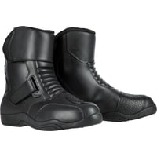                                                                                           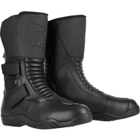                                                                                           |                                                                                           

## Models at 79,92 € :

 | Model | Photos |
|---|---|
|                                                                                           **DXR - ASGEIR**                                                                                                                                                                                        EN13634-2122                                                                                            ") Men's model                                                                                                                                                                                        **Manufacturer pages:**                                                                                            - [vente-chaussures-dxr-asgeir-157178](https://www.motoblouz.com/vente-chaussures-dxr-asgeir-157178.html)                                                                                                                                                                                        **Manufacturing location:**                                                                                              unknown                                                                                                                                                                                        **Characteristics:**                                                                                            ") Leather                                                                                             (modified image: Tabler-icons)") Waterproof (Gore-Tex)                                                                                                                                                                                        **Good présentation:**                                                                                            [ Article : Motoblouz - Essai des chaussures DXR Asgeir](https://www.motoblouz.com/enjoytheride/bottes-chaussures-moto/20083-chaussures-dxr-asgeir-essai-2020-11-27)                                                                                                                                                                                        **Price online at time of writing:**                                                                                            - [79,92 € (motoblouz)](https://pkw.motoblouz.com/?P4122157BDFF171&redir=https%3A%2F%2Fwww.motoblouz.com%2Frecherche%2FDXR%2520ASGEIR.html)                                                                                            - [Rechercher (fcmoto)](https://www.fc-moto.de/epages/fcm.sf/fr_FR/?ViewAction=FacetedSearchProducts&SearchString=DXR+ASGEIR)                                                                                            - [Rechercher (motardinn)](https://www.tradeinn.com/motardinn/fr?products_search%5Bquery%5D=DXR+ASGEIR)                                                                                            - [Rechercher (dafymoto)](https://www.dafy-moto.com/recherche?string=DXR+ASGEIR)                                                                                                                                                                                        **Online search assistance:**                                                                                            *Find second-hand (~20-60 €)*                                                                                            [ Leboncoin](https://www.leboncoin.fr/recherche?text=moto+DXR+ASGEIR&shippable=1&sort=price&order=asc) [ Vinted](https://www.vinted.fr/catalog?search_text=moto+DXR+ASGEIR&order=price_low_to_high) *Miscellaneous searches:*                                                                                            [ Google](https://www.google.com/search?q=moto+DXR+ASGEIR) [ Youtube](https://www.youtube.com/results?search_query=moto+DXR+ASGEIR)                                                                                            |                                                                                           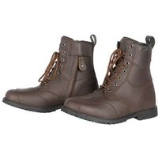                                                                                           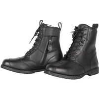                                                                                           |                                                                                           

## Models at 83,92 € :

 | Model | Photos |
|---|---|
|                                                                                           **DXR - LAGERTA**                                                                                                                                                                                        EN13634-2122                                                                                            ") Female model                                                                                                                                                                                        **Manufacturer pages:**                                                                                            - [vente-demi-bottes-dxr-lagerta-171257](https://www.motoblouz.com/vente-demi-bottes-dxr-lagerta-171257.html)                                                                                                                                                                                        **Manufacturing location:**                                                                                              unknown                                                                                                                                                                                        **Characteristics:**                                                                                            ") Leather                                                                                            ") Waterproof                                                                                                                                                                                        **Good présentation:**                                                                                            [ Article : Motoblouz - Test des demi bottes DRX Lagerta](https://www.motoblouz.com/enjoytheride/bottes-chaussures-moto/19685-demi-bottes-dxr-lagerta-essai-2020-09-30)                                                                                                                                                                                        **Price online at time of writing:**                                                                                            - [83,92 € (motoblouz)](https://pkw.motoblouz.com/?P4122157BDFF171&redir=https%3A%2F%2Fwww.motoblouz.com%2Frecherche%2FDXR%2520LAGERTA.html)                                                                                            - [Rechercher (fcmoto)](https://www.fc-moto.de/epages/fcm.sf/fr_FR/?ViewAction=FacetedSearchProducts&SearchString=DXR+LAGERTA)                                                                                            - [Rechercher (motardinn)](https://www.tradeinn.com/motardinn/fr?products_search%5Bquery%5D=DXR+LAGERTA)                                                                                            - [Rechercher (dafymoto)](https://www.dafy-moto.com/recherche?string=DXR+LAGERTA)                                                                                                                                                                                        **Online search assistance:**                                                                                            *Find second-hand (~20-60 €)*                                                                                            [ Leboncoin](https://www.leboncoin.fr/recherche?text=moto+DXR+LAGERTA&shippable=1&sort=price&order=asc) [ Vinted](https://www.vinted.fr/catalog?search_text=moto+DXR+LAGERTA&order=price_low_to_high) *Miscellaneous searches:*                                                                                            [ Google](https://www.google.com/search?q=moto+DXR+LAGERTA) [ Youtube](https://www.youtube.com/results?search_query=moto+DXR+LAGERTA)                                                                                            |                                                                                           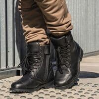                                                                                           |                                                                                           

## Models at 87,92 € :

 | Model | Photos |
|---|---|
|                                                                                           **DXR - CODE EVO SHORT**                                                                                                                                                                                        EN13634-2221 IPA                                                                                            ") Men's model                                                                                                                                                                                        **Manufacturer pages:**                                                                                            - [vente-demi-bottes-dxr-code-evo-short-197449](https://www.motoblouz.com/vente-demi-bottes-dxr-code-evo-short-197449.html)                                                                                                                                                                                        **Manufacturing location:**                                                                                              unknown                                                                                                                                                                                        **Characteristics:**                                                                                            ") Leather                                                                                             (modified image: Tabler-icons)") Waterproof (Gore-Tex)                                                                                                                                                                                        **Good présentation:**                                                                                            [ Article : Motoblouz - Essai des demi-bottes DXR Code Evo Short](https://www.motoblouz.com/enjoytheride/bottes-chaussures-moto/22129-demi-bottes-dxr-code-evo-short-essai-2022-07-05)                                                                                                                                                                                        **Price online at time of writing:**                                                                                            - [87,92 € (motoblouz)](https://pkw.motoblouz.com/?P4122157BDFF171&redir=https%3A%2F%2Fwww.motoblouz.com%2Frecherche%2FDXR%2520CODE%2520EVO%2520SHORT.html)                                                                                            - [Rechercher (fcmoto)](https://www.fc-moto.de/epages/fcm.sf/fr_FR/?ViewAction=FacetedSearchProducts&SearchString=DXR+CODE+EVO+SHORT)                                                                                            - [Rechercher (motardinn)](https://www.tradeinn.com/motardinn/fr?products_search%5Bquery%5D=DXR+CODE+EVO+SHORT)                                                                                            - [Rechercher (dafymoto)](https://www.dafy-moto.com/recherche?string=DXR+CODE+EVO+SHORT)                                                                                                                                                                                        **Online search assistance:**                                                                                            *Find second-hand (~30-60 €)*                                                                                            [ Leboncoin](https://www.leboncoin.fr/recherche?text=moto+DXR+CODE+EVO+SHORT&shippable=1&sort=price&order=asc) [ Vinted](https://www.vinted.fr/catalog?search_text=moto+DXR+CODE+EVO+SHORT&order=price_low_to_high) *Miscellaneous searches:*                                                                                            [ Google](https://www.google.com/search?q=moto+DXR+CODE+EVO+SHORT) [ Youtube](https://www.youtube.com/results?search_query=moto+DXR+CODE+EVO+SHORT)                                                                                            |                                                                                           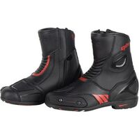                                                                                           |                                                                                           

## Models at 95,92 € :

 | Model | Photos |
|---|---|
|                                                                                           **DXR - CODE EVO**                                                                                                                                                                                        EN13634-2221 IPA                                                                                            ") Men's model                                                                                                                                                                                        **Manufacturer pages:**                                                                                            - [vente-bottes-dxr-code-evo-171216](https://www.motoblouz.com/vente-bottes-dxr-code-evo-171216.html)                                                                                                                                                                                        **Manufacturing location:**                                                                                              unknown                                                                                                                                                                                        **Characteristics:**                                                                                            ") Leather                                                                                             (modified image: Tabler-icons)") Waterproof (Gore-Tex)                                                                                                                                                                                        **Good presentations:**                                                                                                                                                                                       [ Article : Motoblouz - Essai des bottes DXR Code Evo](https://www.motoblouz.com/enjoytheride/bottes-chaussures-moto/20444-bottes-dxr-code-evo-essai-2021-03-16)                                                                                                                                                                                         **Price online at time of writing:**                                                                                            - [95,92 € (motoblouz)](https://pkw.motoblouz.com/?P4122157BDFF171&redir=https%3A%2F%2Fwww.motoblouz.com%2Frecherche%2FDXR%2520CODE%2520EVO.html)                                                                                            - [Rechercher (fcmoto)](https://www.fc-moto.de/epages/fcm.sf/fr_FR/?ViewAction=FacetedSearchProducts&SearchString=DXR+CODE+EVO)                                                                                            - [Rechercher (motardinn)](https://www.tradeinn.com/motardinn/fr?products_search%5Bquery%5D=DXR+CODE+EVO)                                                                                            - [Rechercher (dafymoto)](https://www.dafy-moto.com/recherche?string=DXR+CODE+EVO)                                                                                                                                                                                        **Online search assistance:**                                                                                            *Find second-hand (~30-70 €)*                                                                                            [ Leboncoin](https://www.leboncoin.fr/recherche?text=moto+DXR+CODE+EVO&shippable=1&sort=price&order=asc) [ Vinted](https://www.vinted.fr/catalog?search_text=moto+DXR+CODE+EVO&order=price_low_to_high) *Miscellaneous searches:*                                                                                            [ Google](https://www.google.com/search?q=moto+DXR+CODE+EVO) [ Youtube](https://www.youtube.com/results?search_query=moto+DXR+CODE+EVO)                                                                                            |                                                                                                                                                                                                                                                                                 |                                                                                           

## Models at 98,96 € :

 | Model | Photos |
|---|---|
|                                                                                           **RST - AXIOM MENS**                                                                                                                                                                                        EN13634-2122                                                                                            ") Men's model                                                                                                                                                                                        **Manufacturer pages:**                                                                                            - [axiom-ce-mens-waterproof-boot](https://www.rst-moto.com/products/axiom-ce-mens-waterproof-boot)                                                                                                                                                                                        **Manufacturing location:**                                                                                              unknown                                                                                                                                                                                        **Characteristics:**                                                                                            ") Waterproof                                                                                                                                                                                        **Price online at time of writing:**                                                                                            - [98,96 € (fcmoto)](https://www.fc-moto.de/epages/fcm.sf/fr_FR/?ViewAction=FacetedSearchProducts&SearchString=RST+AXIOM%20HOMME)                                                                                            - [110,46 € (motoblouz)](https://pkw.motoblouz.com/?P4122157BDFF171&redir=https%3A%2F%2Fwww.motoblouz.com%2Frecherche%2FRST%2520AXIOM%2520HOMME.html)                                                                                            - [Rechercher (motardinn)](https://www.tradeinn.com/motardinn/fr?products_search%5Bquery%5D=RST+AXIOM)                                                                                            - [Rechercher (dafymoto)](https://www.dafy-moto.com/recherche?string=RST+AXIOM)                                                                                                                                                                                        **Online search assistance:**                                                                                            *Find second-hand (~30-70 €)*                                                                                            [ Leboncoin](https://www.leboncoin.fr/recherche?text=moto+RST+AXIOM&shippable=1&sort=price&order=asc) [ Vinted](https://www.vinted.fr/catalog?search_text=moto+RST+AXIOM&order=price_low_to_high) *Miscellaneous searches:*                                                                                            [ Google](https://www.google.com/search?q=moto+RST+AXIOM) [ Youtube](https://www.youtube.com/results?search_query=moto+RST+AXIOM)                                                                                            |                                                                                                                                                                                      |                                                                                           

## Models at 103,92 € :

 | Model | Photos |
|---|---|
|                                                                                           **DXR - KRUGER**                                                                                                                                                                                        EN13634-2122 IPA IPS                                                                                            ") Men's model                                                                                                                                                                                        **Manufacturer pages:**                                                                                            - [vente-bottes-dxr-kruger-171196](https://www.motoblouz.com/vente-bottes-dxr-kruger-171196.html)                                                                                                                                                                                        **Manufacturing location:**                                                                                              unknown                                                                                                                                                                                        **Characteristics:**                                                                                            ") Leather                                                                                             (modified image: Tabler-icons)") Waterproof (Gore-Tex)                                                                                                                                                                                        **Price online at time of writing:**                                                                                            - [103,92 € (motoblouz)](https://pkw.motoblouz.com/?P4122157BDFF171&redir=https%3A%2F%2Fwww.motoblouz.com%2Frecherche%2FDXR%2520KRUGER.html)                                                                                            - [Rechercher (fcmoto)](https://www.fc-moto.de/epages/fcm.sf/fr_FR/?ViewAction=FacetedSearchProducts&SearchString=DXR+KRUGER)                                                                                            - [Rechercher (motardinn)](https://www.tradeinn.com/motardinn/fr?products_search%5Bquery%5D=DXR+KRUGER)                                                                                            - [Rechercher (dafymoto)](https://www.dafy-moto.com/recherche?string=DXR+KRUGER)                                                                                                                                                                                        **Online search assistance:**                                                                                            *Find second-hand (~30-70 €)*                                                                                            [ Leboncoin](https://www.leboncoin.fr/recherche?text=moto+DXR+KRUGER&shippable=1&sort=price&order=asc) [ Vinted](https://www.vinted.fr/catalog?search_text=moto+DXR+KRUGER&order=price_low_to_high) *Miscellaneous searches:*                                                                                            [ Google](https://www.google.com/search?q=moto+DXR+KRUGER) [ Youtube](https://www.youtube.com/results?search_query=moto+DXR+KRUGER)                                                                                            |                                                                                                                                                                                                                                                                                 |                                                                                           

## Models at 110,46 € :

 | Model | Photos |
|---|---|
|                                                                                           **RST - AXIOM LADIES**                                                                                                                                                                                        EN13634-2122                                                                                            ") Female model                                                                                                                                                                                        **Manufacturer pages:**                                                                                            - [axiom-ce-ladies-waterproof-boot](https://www.rst-moto.com/products/axiom-ce-ladies-waterproof-boot)                                                                                                                                                                                        **Manufacturing location:**                                                                                              unknown                                                                                                                                                                                        **Characteristics:**                                                                                            ") Waterproof                                                                                                                                                                                        **Price online at time of writing:**                                                                                            - [110,46 € (motoblouz)](https://pkw.motoblouz.com/?P4122157BDFF171&redir=https%3A%2F%2Fwww.motoblouz.com%2Frecherche%2FRST%2520AXIOM%2520FEMME.html)                                                                                            - [110,46 € (fcmoto)](https://www.fc-moto.de/epages/fcm.sf/fr_FR/?ViewAction=FacetedSearchProducts&SearchString=RST+AXIOM%20DAMES)                                                                                            - [Rechercher (motardinn)](https://www.tradeinn.com/motardinn/fr?products_search%5Bquery%5D=RST+AXIOM+LADIES)                                                                                            - [Rechercher (dafymoto)](https://www.dafy-moto.com/recherche?string=RST+AXIOM+LADIES)                                                                                                                                                                                        **Online search assistance:**                                                                                            *Find second-hand (~30-80 €)*                                                                                            [ Leboncoin](https://www.leboncoin.fr/recherche?text=moto+RST+AXIOM+LADIES&shippable=1&sort=price&order=asc) [ Vinted](https://www.vinted.fr/catalog?search_text=moto+RST+AXIOM+LADIES&order=price_low_to_high) *Miscellaneous searches:*                                                                                            [ Google](https://www.google.com/search?q=moto+RST+AXIOM+LADIES) [ Youtube](https://www.youtube.com/results?search_query=moto+RST+AXIOM+LADIES)                                                                                            |                                                                                           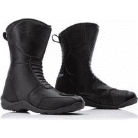                                                                                           |                                                                                           
|                                                                                           **RST - S 1 MENS**                                                                                                                                                                                        EN13634-2221                                                                                            ") Men's model                                                                                                                                                                                        **Manufacturer pages:**                                                                                            - [s-1-mens-ce-boot](https://www.rst-moto.com/products/s-1-mens-ce-boot)                                                                                            - [s-1-mens-ce-waterproof-boot](https://www.rst-moto.com/products/s-1-mens-ce-waterproof-boot)                                                                                                                                                                                        **Manufacturing location:**                                                                                              unknown                                                                                                                                                                                        **Characteristics:**                                                                                            ") Waterproof                                                                                                                                                                                         **Price online at time of writing:**                                                                                            - [110,46 € (motoblouz)](https://pkw.motoblouz.com/?P4122157BDFF171&redir=https%3A%2F%2Fwww.motoblouz.com%2Frecherche%2FRST%2520S%25201%2520HOMME.html)                                                                                            - [116,96 € (fcmoto)](https://www.fc-moto.de/epages/fcm.sf/fr_FR/?ViewAction=FacetedSearchProducts&SearchString=RST+S%201%20HOMME)                                                                                            - [Rechercher (motardinn)](https://www.tradeinn.com/motardinn/fr?products_search%5Bquery%5D=RST+S+1)                                                                                            - [Rechercher (dafymoto)](https://www.dafy-moto.com/recherche?string=RST+S+1)                                                                                                                                                                                        **Online search assistance:**                                                                                            *Find second-hand (~30-80 €)*                                                                                            [ Leboncoin](https://www.leboncoin.fr/recherche?text=moto+RST+S+1&shippable=1&sort=price&order=asc) [ Vinted](https://www.vinted.fr/catalog?search_text=moto+RST+S+1&order=price_low_to_high) *Miscellaneous searches:*                                                                                            [ Google](https://www.google.com/search?q=moto+RST+S+1) [ Youtube](https://www.youtube.com/results?search_query=moto+RST+S+1)                                                                                            |                                                                                           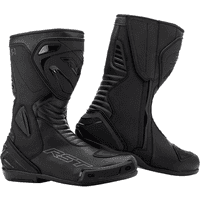                                                                                           |                                                                                           

## Models at 135,92 € :

 | Model | Photos |
|---|---|
|                                                                                           **DXR - PIVOT**                                                                                                                                                                                        EN13634-2221 IPA IPS                                                                                            ") Men's model                                                                                            ") Summer                                                                                                                                                                                        **Manufacturer pages:**                                                                                            - [vente-bottes-dxr-pivot-171042](https://www.motoblouz.com/vente-bottes-dxr-pivot-171042.html)                                                                                                                                                                                        **Manufacturing location:**                                                                                              unknown                                                                                                                                                                                        **Characteristics:**                                                                                            ") Leather                                                                                            ") Breathable                                                                                             (modified image: Tabler-icons)") Waterproof (Gore-Tex)                                                                                                                                                                                        **Price online at time of writing:**                                                                                            - [135,92 € (motoblouz)](https://pkw.motoblouz.com/?P4122157BDFF171&redir=https%3A%2F%2Fwww.motoblouz.com%2Frecherche%2FDXR%2520PIVOT.html)                                                                                            - [Rechercher (fcmoto)](https://www.fc-moto.de/epages/fcm.sf/fr_FR/?ViewAction=FacetedSearchProducts&SearchString=DXR+PIVOT)                                                                                            - [Rechercher (motardinn)](https://www.tradeinn.com/motardinn/fr?products_search%5Bquery%5D=DXR+PIVOT)                                                                                            - [Rechercher (dafymoto)](https://www.dafy-moto.com/recherche?string=DXR+PIVOT)                                                                                                                                                                                        **Online search assistance:**                                                                                            *Find second-hand (~40-90 €)*                                                                                            [ Leboncoin](https://www.leboncoin.fr/recherche?text=moto+DXR+PIVOT&shippable=1&sort=price&order=asc) [ Vinted](https://www.vinted.fr/catalog?search_text=moto+DXR+PIVOT&order=price_low_to_high) *Miscellaneous searches:*                                                                                            [ Google](https://www.google.com/search?q=moto+DXR+PIVOT) [ Youtube](https://www.youtube.com/results?search_query=moto+DXR+PIVOT)                                                                                            |                                                                                                                                                                                                                                                                                 |                                                                                           

## Models at 143,46 € :

 | Model | Photos |
|---|---|
|                                                                                           **ALPINESTARS - SMX PLUS V2 VENTED**                                                                                                                                                                                        EN13634-2221 WR IPA                                                                                            ") Summer                                                                                                                                                                                        **Manufacturer pages:**                                                                                            - [smx-plus-v2-vented-boots](https://www.alpinestars.com/products/smx-plus-v2-vented-boots)                                                                                                                                                                                        **Manufacturing location:**                                                                                            Europe / Asia :                                                                                                                                                                                        ") Romania                                                                                                                                                                                       ") China                                                                                                                                                                                                                                                                                   **Characteristics:**                                                                                            ") Breathable                                                                                                                                                                                        **Good présentation:**                                                                                            [ Youtube : RevZilla - Alpinestars-SMX-Plus-v2-Vented-Boots-Review](https://www.youtube.com/watch?v=f6SQWqdqSxk)                                                                                                                                                                                        **Price online at time of writing:**                                                                                            - [143,46 € (fcmoto)](https://www.fc-moto.de/epages/fcm.sf/fr_FR/?ViewAction=FacetedSearchProducts&SearchString=ALPINESTARS+SMX%20PLUS%20V2%20VENTED)                                                                                            - [417,95 € (dafymoto)](https://www.dafy-moto.com/recherche?string=ALPINESTARS%20SMX%20PLUS%20V2%20VENTED)                                                                                            - [425,00 € (motoblouz)](https://pkw.motoblouz.com/?P4122157BDFF171&redir=https%3A%2F%2Fwww.motoblouz.com%2Frecherche%2FALPINESTARS%2520SMX%2520PLUS%2520V2%2520VENTED.html)                                                                                            - [Rechercher (motardinn)](https://www.tradeinn.com/motardinn/fr?products_search%5Bquery%5D=ALPINESTARS+SMX+PLUS+V2+VENTED)                                                                                                                                                                                        **Online search assistance:**                                                                                            *Find second-hand (~40-100 €)*                                                                                            [ Leboncoin](https://www.leboncoin.fr/recherche?text=moto+ALPINESTARS+SMX+PLUS+V2+VENTED&shippable=1&sort=price&order=asc) [ Vinted](https://www.vinted.fr/catalog?search_text=moto+ALPINESTARS+SMX+PLUS+V2+VENTED&order=price_low_to_high) *Miscellaneous searches:*                                                                                            [ Google](https://www.google.com/search?q=moto+ALPINESTARS+SMX+PLUS+V2+VENTED) [ Youtube](https://www.youtube.com/results?search_query=moto+ALPINESTARS+SMX+PLUS+V2+VENTED)                                                                                            |                                                                                           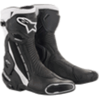                                                                                           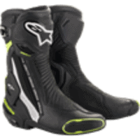                                                                                           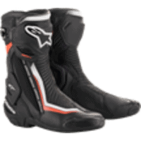                                                                                           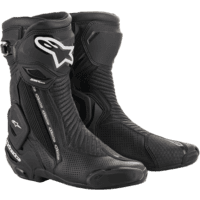                                                                                            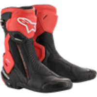                                                                                           |                                                                                           

## Models at 195,29 € :

 | Model | Photos |
|---|---|
|                                                                                           **FORMA - ROSE**                                                                                                                                                                                        EN13634-2212 WR                                                                                            ") Female model                                                                                                                                                                                        **Manufacturer pages:**                                                                                            - [rose](https://www.formabootsusa.com/collections/womens/products/rose)                                                                                                                                                                                        **Manufacturing location:**                                                                                            Europe :                                                                                                                                                                                        ") Romania                                                                                                                                                                                                                                                                                   **Characteristics:**                                                                                            ") Leather                                                                                            ") Waterproof                                                                                                                                                                                        **Price online at time of writing:**                                                                                            - [195,29 € (dafymoto)](https://www.dafy-moto.com/recherche?string=FORMA%20ROSE)                                                                                            - [Rechercher (fcmoto)](https://www.fc-moto.de/epages/fcm.sf/fr_FR/?ViewAction=FacetedSearchProducts&SearchString=FORMA+ROSE)                                                                                            - [Rechercher (motoblouz)](https://www.motoblouz.com/recherche/FORMA+ROSE.html)                                                                                            - [Rechercher (motardinn)](https://www.tradeinn.com/motardinn/fr?products_search%5Bquery%5D=FORMA+ROSE)                                                                                                                                                                                        **Online search assistance:**                                                                                            *Find second-hand (~60-140 €)*                                                                                            [ Leboncoin](https://www.leboncoin.fr/recherche?text=moto+FORMA+ROSE&shippable=1&sort=price&order=asc) [ Vinted](https://www.vinted.fr/catalog?search_text=moto+FORMA+ROSE&order=price_low_to_high) *Miscellaneous searches:*                                                                                            [ Google](https://www.google.com/search?q=moto+FORMA+ROSE) [ Youtube](https://www.youtube.com/results?search_query=moto+FORMA+ROSE)                                                                                            |                                                                                                                                                                                      |                                                                                           

## Models at 197,80 € :

 | Model | Photos |
|---|---|
|                                                                                           **REV-IT - MAGNETIC GTX**                                                                                                                                                                                        EN13634-2122 WR                                                                                            ") Summer                                                                                                                                                                                        **Manufacturer pages:**                                                                                            - [bottes-moto-magnetic-gtx-noir](https://www.revitsport.com/fr_fr/bottes-moto-magnetic-gtx-noir)                                                                                                                                                                                        **Manufacturing location:**                                                                                              unknown                                                                                                                                                                                        **Characteristics:**                                                                                            ") Leather                                                                                            ") Breathable                                                                                             (modified image: Tabler-icons)") Waterproof (Gore-Tex)                                                                                                                                                                                        **Price online at time of writing:**                                                                                            - [197,80 € (motoblouz)](https://pkw.motoblouz.com/?P4122157BDFF171&redir=https%3A%2F%2Fwww.motoblouz.com%2Frecherche%2FREVIT%2520MAGNETIC%2520GTX.html)                                                                                            - [197,99 € (motardinn)](https://www.tradeinn.com/motardinn/fr?products_search%5Bquery%5D=REVIT+MAGNETIC%20GTX)                                                                                            - [239,99 € (fcmoto)](https://www.fc-moto.de/epages/fcm.sf/fr_FR/?ViewAction=FacetedSearchProducts&SearchString=REVIT+MAGNETIC%20GTX)                                                                                            - [239,99 € (dafymoto)](https://www.dafy-moto.com/recherche?string=REVIT%20MAGNETIC%20GTX)                                                                                                                                                                                        **Online search assistance:**                                                                                            *Find second-hand (~60-140 €)*                                                                                            [ Leboncoin](https://www.leboncoin.fr/recherche?text=moto+REV+IT+MAGNETIC&shippable=1&sort=price&order=asc) [ Vinted](https://www.vinted.fr/catalog?search_text=moto+REV+IT+MAGNETIC&order=price_low_to_high) *Miscellaneous searches:*                                                                                            [ Google](https://www.google.com/search?q=moto+REV+IT+MAGNETIC) [ Youtube](https://www.youtube.com/results?search_query=moto+REV+IT+MAGNETIC)                                                                                            |                                                                                           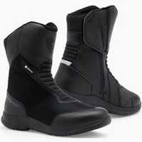                                                                                           |                                                                                           

## Models at 309,95 € :

 | Model | Photos |
|---|---|
|                                                                                           **ALPINESTARS - SMX PLUS V2**                                                                                                                                                                                        EN13634-2221 IPA                                                                                            ") Summer                                                                                                                                                                                        **Manufacturer pages:**                                                                                            - [smx-plus-boots](https://www.alpinestars.com/products/smx-plus-boots)                                                                                                                                                                                        **Manufacturing location:**                                                                                            Europe / Asia :                                                                                                                                                                                        ") Romania                                                                                                                                                                                       ") China                                                                                                                                                                                                                                                                                   **Characteristics:**                                                                                            ") Breathable                                                                                                                                                                                         **Price online at time of writing:**                                                                                            - [309,95 € (fcmoto)](https://www.fc-moto.de/epages/fcm.sf/fr_FR/?ViewAction=FacetedSearchProducts&SearchString=ALPINESTARS+SMX%20PLUS%20V2)                                                                                            - [328,99 € (motardinn)](https://www.tradeinn.com/motardinn/fr?products_search%5Bquery%5D=ALPINESTARS+SMX%20PLUS%20V2)                                                                                            - [395,90 € (motoblouz)](https://pkw.motoblouz.com/?P4122157BDFF171&redir=https%3A%2F%2Fwww.motoblouz.com%2Frecherche%2FALPINESTARS%2520SMX%2520PLUS%2520V2.html)                                                                                            - [417,95 € (dafymoto)](https://www.dafy-moto.com/recherche?string=ALPINESTARS%20SMX%20PLUS%20V2)                                                                                                                                                                                        **Online search assistance:**                                                                                            *Find second-hand (~90-220 €)*                                                                                            [ Leboncoin](https://www.leboncoin.fr/recherche?text=moto+ALPINESTARS+SMX+PLUS+V2&shippable=1&sort=price&order=asc) [ Vinted](https://www.vinted.fr/catalog?search_text=moto+ALPINESTARS+SMX+PLUS+V2&order=price_low_to_high) *Miscellaneous searches:*                                                                                            [ Google](https://www.google.com/search?q=moto+ALPINESTARS+SMX+PLUS+V2) [ Youtube](https://www.youtube.com/results?search_query=moto+ALPINESTARS+SMX+PLUS+V2)                                                                                            |                                                                                           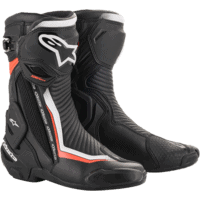                                                                                           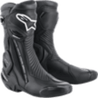                                                                                           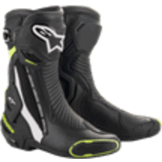                                                                                           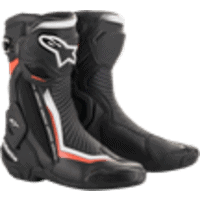                                                                                           |                                                                                           

## Models at 395,90 € :

 | Model | Photos |
|---|---|
|                                                                                           **ALPINESTARS - STELLA SMX PLUS V2**                                                                                                                                                                                        EN13634-2221 IPA                                                                                            ") Female model                                                                                            ") Summer                                                                                                                                                                                        **Manufacturer pages:**                                                                                            - [stella-smx-plus-v2-boots](https://www.alpinestars.com/products/stella-smx-plus-v2-boots)                                                                                                                                                                                        **Manufacturing location:**                                                                                            Europe / Asia :                                                                                                                                                                                        ") Romania                                                                                                                                                                                       ") China                                                                                                                                                                                                                                                                                   **Characteristics:**                                                                                            ") Breathable                                                                                                                                                                                        **Good presentations:**                                                                                            [ Youtube : RevZilla - Alpinestars-Stella-SMX-Plus-v2-Boots-Review](https://www.youtube.com/watch?v=ji2B9D7m7n8)                                                                                                                                                                                       [ Article : motostation - Test bottes Alpinestars Stella SMX Plus V2 : racing mais confortables](https://moto-station.com/moto-revue/test-equipement/test-bottes-alpinestars-stella-smx-plus-v2-racing-mais-confortables/513030)                                                                                                                                                                                                                                                                                   **Price online at time of writing:**                                                                                            - [395,90 € (motoblouz)](https://pkw.motoblouz.com/?P4122157BDFF171&redir=https%3A%2F%2Fwww.motoblouz.com%2Frecherche%2FALPINESTARS%2520STELLA%2520SMX%2520PLUS%2520V2.html)                                                                                            - [417,95 € (dafymoto)](https://www.dafy-moto.com/recherche?string=ALPINESTARS%20STELLA%20SMX%20PLUS%20V2)                                                                                            - [Rechercher (fcmoto)](https://www.fc-moto.de/epages/fcm.sf/fr_FR/?ViewAction=FacetedSearchProducts&SearchString=ALPINESTARS+STELLA+SMX+PLUS+V2)                                                                                            - [Rechercher (motardinn)](https://www.tradeinn.com/motardinn/fr?products_search%5Bquery%5D=ALPINESTARS+STELLA+SMX+PLUS+V2)                                                                                                                                                                                        **Online search assistance:**                                                                                            *Find second-hand (~120-280 €)*                                                                                            [ Leboncoin](https://www.leboncoin.fr/recherche?text=moto+ALPINESTARS+STELLA+SMX+PLUS+V2&shippable=1&sort=price&order=asc) [ Vinted](https://www.vinted.fr/catalog?search_text=moto+ALPINESTARS+STELLA+SMX+PLUS+V2&order=price_low_to_high) *Miscellaneous searches:*                                                                                            [ Google](https://www.google.com/search?q=moto+ALPINESTARS+STELLA+SMX+PLUS+V2) [ Youtube](https://www.youtube.com/results?search_query=moto+ALPINESTARS+STELLA+SMX+PLUS+V2)                                                                                            |                                                                                           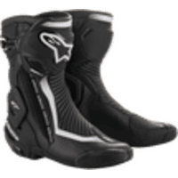                                                                                            |                                                                                           

