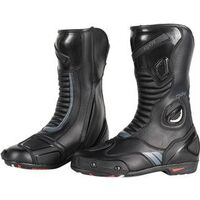
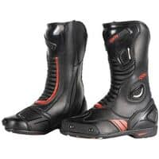
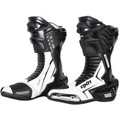
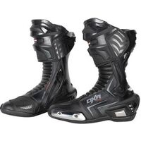
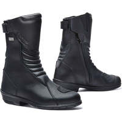
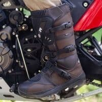
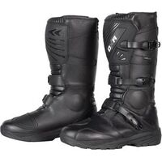
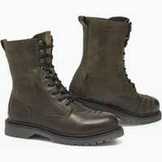
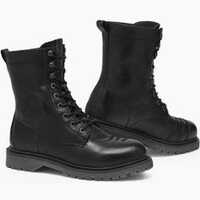
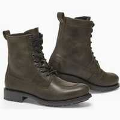

Cette page vient en complément de mon [inventaire des bottes de moto montantes les plus protectrices (EN 13634 : 2222) en juin 2023](), elle liste des bottes montantes qui ont tous les niveaux de protection au maximum sauf un, il s'agit donc des EN 13634:2122, EN 13634:2212 et EN 13634:2221.

<!--more-->

J’ai mis le lien Motoblouz/Dafy/Fcmoto lorsque le produit était disponible au moment de la rédaction de l'article _(note : Je peux toucher quelques centimes si vous passez par un de mes liens pour acheter sur Motoblouz)_.

---

> *Note :* Cette page a été réalisée à partir des données fournies par les fabricants sur leurs sites Web.
> Sa génération est en grande partie automatisée, il peut donc y avoir quelques erreurs.
> 
> Les fabricants analysés sont les suivants :
> [ACERBIS](https://www.acerbis.com/), 
[ALPINESTARS](https://www.alpinestars.com/), 
[BERING](https://bering.fr/), 
[BMW](https://www.bmw-motorrad.fr/), 
[BULL-IT](https://www.bull-it.com/), 
[COURSE](https://www.xlmoto.com/), 
[DAINESE](https://www.dainese.com), 
[DUCATI](https://www.ducati.com/), 
[DXR](https://www.motoblouz.com/), 
[ESQUAD](https://www.esquad.fr/), 
[EUDOXIE](https://eudoxie.shop/), 
[FALCO](https://giannifalco.com/), 
[FIVE](https://five-gloves.com/), 
[FORMA](https://www.formabootsusa.com/), 
[FUEL](https://fuelmotorcycles.eu/), 
[FURYGAN](https://www.furygan.com/), 
[GOLDTOP](https://goldtop.co.uk/), 
[HALVARSSONS](https://halvarssonsmc.com/), 
[HELSTONS](https://www.helstons.net/), 
[HEVIK](https://www.hevik.co.uk/), 
[HOOD](https://www.hoodjeans.co.uk), 
[IXON](https://www.ixon.com/), 
[IXS](https://ixs.com/), 
[JOHN-DOE](https://www.ridejohndoe.com/), 
[KLIM](https://www.klim.com/), 
[KNOX](https://www.planet-knox.com), 
[LOUIS](https://www.louis.ie), 
[LS2](https://www.ls2usa.com/), 
[MERLAMOTO](https://merlamoto.com/), 
[MERLIN](https://www.merlinbikegear.shop/), 
[MOTOGIRL](https://motogirl.co.uk/), 
[OJ](https://ojworld.it/), 
[OXFORD](https://www.oxfordproducts.com/), 
[PANDO](https://pandomoto.com/), 
[PMJ](https://pmj.it/), 
[RACERED](https://racered.eu/), 
[RACER](https://www.racer1927.com/), 
[RAXID](https://raxid.co.uk), 
[RESURGENCE-GEAR](https://resurgencegear.net/), 
[REVIT](https://www.revitsport.com/), 
[ROADSKIN](https://roadskin.co.uk/), 
[ROKKER](https://www.eu.therokkercompany.com/), 
[RST](https://www.rst-moto.com/), 
[RUKKA](https://luhta.com/), 
[SEGURA](https://segura-moto.fr/), 
[SEVENTY-DEGREES](https://seventy-70.com/), 
[SIDI](https://www.sidi.com/), 
[SOUBIRAC](https://www.soubirac.fr/), 
[SPIDI](https://www.spidi.com/), 
[TCX](https://www.tcxboots.com/), 
[2MILESIX](https://www.2milesix.com/).

> 
> Les fabricants suivants ont été exclus car ils n'affichent pas le niveau de sécurité de leurs produits, ou ne sont pas commercialisés en Europe : ARLEN NESS, ARMURE, BELSTAFF, BILT, BOGOTTO, BOLID'STER, DRAGGIN, DRIRIDER, ELEVEIT, FLY MOTO, FOX, GAERNE, HARLEY DAVIDSON, HELD, HOLYFREEDOM, HONDA, ICON, INDIAN, KAWASAKI, KLIM, KTM, LEATT, MACNA, O'NEAL, OVERLAP, REAX, RICHA, RJAYS, RST, RUSTY STITCHES, SAINT, SCOTT, SEDICI, SHOT, SIDI, SOUBIRAC, SPIRIT MOTORS, STADLER, STREET & STEEL, STYLMARTIN, THOR, TRIUMPH, VENDRAMINI, WEX, XPD, YAMAHA

## Modèles à 93,42 € :

 | Modèle | Photos |
|---|---|
|                                                                                           **[DXR - DEMI CODE EVO SHORT](https://www.motoblouz.com/vente-demi-bottes-dxr-code-evo-short-197449.html)**                                                                                                                                                                                       EN13634-2221 IPA                                                                                                                                                                                        ") modèle homme                                                                                                                                                                                                                                                                                   ") Cuir                                                                                                                                                                                       ") Imperméable                                                                                                                                                                                                                                                                                   Lieu de fabrication inconnu.                                                                                                                                                                                                                                                                                   Prix en ligne au moment de la rédaction :                                                                                            - [93,42 €](https://pkw.motoblouz.com/?P4122157BDFF171&redir=https%3A%2F%2Fwww.motoblouz.com%2Frecherche%2FDXR%2520DEMI%2520CODE%2520EVO%2520SHORT.html) (motoblouz)                                                                                            - [139,90 €](https://www.motoblouz.com/vente-demi-bottes-dxr-code-evo-short-197449.html) (Fabricant)                                                                                                                                                                                                                                                                                    Pour les rechercher en occasion (~30-70 €) :                                                                                                                                                                                        |                                                                                                                                                                                      |                                                                                           

## Modèles à 101,91 € :

 | Modèle | Photos |
|---|---|
|                                                                                           **[DXR - CODE EVO](https://www.motoblouz.com/vente-bottes-dxr-code-evo-171216.html)**                                                                                                                                                                                       EN13634-2221 IPA                                                                                                                                                                                        ") modèle homme                                                                                                                                                                                                                                                                                   ") Cuir                                                                                                                                                                                       ") Imperméable                                                                                                                                                                                                                                                                                   Lieu de fabrication inconnu.                                                                                                                                                                                                                                                                                   Prix en ligne au moment de la rédaction :                                                                                            - [101,91 €](https://pkw.motoblouz.com/?P4122157BDFF171&redir=https%3A%2F%2Fwww.motoblouz.com%2Frecherche%2FDXR%2520CODE%2520EVO.html) (motoblouz)                                                                                            - [149,90 €](https://www.motoblouz.com/vente-bottes-dxr-code-evo-171216.html) (Fabricant)                                                                                                                                                                                                                                                                                    Pour les rechercher en occasion (~30-70 €) :                                                                                                                                                                                        |                                                                                                                                                                                                                                                                                 |                                                                                           

## Modèles à 144,41 € :

 | Modèle | Photos |
|---|---|
|                                                                                           **[DXR - PIVOT](https://www.motoblouz.com/vente-bottes-dxr-pivot-171042.html)**                                                                                                                                                                                       EN13634-2221 IPA IPS                                                                                                                                                                                        ") modèle homme                                                                                                                                                                                        Eté                                                                                                                                                                                                                                                                                   ") Cuir                                                                                                                                                                                       ") Respirant                                                                                                                                                                                                                                                                                   Lieu de fabrication inconnu.                                                                                                                                                                                                                                                                                   Prix en ligne au moment de la rédaction :                                                                                            - [144,41 €](https://pkw.motoblouz.com/?P4122157BDFF171&redir=https%3A%2F%2Fwww.motoblouz.com%2Frecherche%2FDXR%2520PIVOT.html) (motoblouz)                                                                                            - [169,90 €](https://www.motoblouz.com/vente-bottes-dxr-pivot-171042.html) (Fabricant)                                                                                                                                                                                                                                                                                    Pour les rechercher en occasion (~40-100 €) :                                                                                                                                                                                        |                                                                                                                                                                                                                                                                                 |                                                                                           

## Modèles à 150,19 € :

 | Modèle | Photos |
|---|---|
|                                                                                           **[FORMA - ROSE](https://www.formabootsusa.com/collections/womens/products/rose)**                                                                                                                                                                                       EN13634-2212 WR                                                                                                                                                                                        ") modèle femme                                                                                                                                                                                                                                                                                   ") Cuir                                                                                                                                                                                       ") Imperméable                                                                                                                                                                                                                                                                                   Fabriqué en Europe :   ") Roumanie                                                                                                                                                                                                                                                                                   Prix en ligne au moment de la rédaction :                                                                                            - [150,19 €](https://www.dafy-moto.com/recherche?string=FORMA%20ROSE) (dafy)                                                                                            - [165,92 €](https://pkw.motoblouz.com/?P4122157BDFF171&redir=https%3A%2F%2Fwww.motoblouz.com%2Frecherche%2FFORMA%2520ROSE.html) (motoblouz)                                                                                            - [178,95 €](https://www.fc-moto.de/epages/fcm.sf/fr_FR/?ViewAction=FacetedSearchProducts&SearchString=FORMA+ROSE) (fcmoto)                                                                                            - [249,00 $](https://www.formabootsusa.com/collections/womens/products/rose) (Fabricant)                                                                                                                                                                                                                                                                                    Pour les rechercher en occasion (~40-100 €) :                                                                                                                                                                                        |                                                                                                                                                                                      |                                                                                           

## Modèles à 169,90 € :

 | Modèle | Photos |
|---|---|
|                                                                                           **[DXR - KRUGER](https://www.motoblouz.com/vente-bottes-dxr-kruger-171196.html)**                                                                                                                                                                                       EN13634-2122 IPA IPS                                                                                                                                                                                        ") modèle homme                                                                                                                                                                                                                                                                                   ") Cuir                                                                                                                                                                                       ") Imperméable                                                                                                                                                                                                                                                                                   Lieu de fabrication inconnu.                                                                                                                                                                                                                                                                                   Prix en ligne au moment de la rédaction :                                                                                            - [169,90 €](https://www.motoblouz.com/vente-bottes-dxr-kruger-171196.html) (Fabricant)                                                                                                                                                                                                                                                                                    Pour les rechercher en occasion (~50-120 €) :                                                                                                                                                                                        |                                                                                                                                                                                                                                                                                 |                                                                                           

## Modèles à 239,99 € :

 | Modèle | Photos |
|---|---|
|                                                                                           **[REVIT - MAGNETIC GTX](https://www.revitsport.com/fr_fr/bottes-moto-magnetic-gtx-noir)**                                                                                                                                                                                       EN13634-2122 WR                                                                                                                                                                                                                                                                                    ") Cuir                                                                                                                                                                                                                                                                                   Lieu de fabrication inconnu.                                                                                                                                                                                                                                                                                   Prix en ligne au moment de la rédaction :                                                                                            - [239,99 €](https://www.revitsport.com/fr_fr/bottes-moto-magnetic-gtx-noir) (Fabricant)                                                                                            - [239,99 €](https://www.fc-moto.de/epages/fcm.sf/fr_FR/?ViewAction=FacetedSearchProducts&SearchString=REVIT+MAGNETIC%20GTX) (fcmoto)                                                                                            - [239,99 €](https://pkw.motoblouz.com/?P4122157BDFF171&redir=https%3A%2F%2Fwww.motoblouz.com%2Frecherche%2FREVIT%2520MAGNETIC%2520GTX.html) (motoblouz)                                                                                                                                                                                                                                                                                    Pour les rechercher en occasion (~70-170 €) :                                                                                                                                                                                        |                                                                                                                                                                                      |                                                                                           
|                                                                                           **[REVIT - PORTLAND LADIES](https://www.revitsport.com/fr_fr/chaussures-moto-portland-ladies-noir)**                                                                                                                                                                                       EN13634-2221                                                                                                                                                                                        ") modèle femme                                                                                                                                                                                                                                                                                                                                                                               Lieu de fabrication inconnu.                                                                                                                                                                                                                                                                                   Prix en ligne au moment de la rédaction :                                                                                            - [239,99 €](https://www.revitsport.com/fr_fr/chaussures-moto-portland-ladies-noir) (Fabricant)                                                                                            - [239,99 €](https://www.fc-moto.de/epages/fcm.sf/fr_FR/?ViewAction=FacetedSearchProducts&SearchString=REVIT+PORTLAND%20DAMES) (fcmoto)                                                                                                                                                                                                                                                                                    Pour les rechercher en occasion (~70-170 €) :                                                                                                                                                                                        |                                                                                                                                                                                                                                                                                 |                                                                                           

## Modèles à 249,99 € :

 | Modèle | Photos |
|---|---|
|                                                                                           **[REVIT - MOHAWK 3](https://www.revitsport.com/fr_fr/chaussures-moto-mohawk-3-noir)**                                                                                                                                                                                       EN13634-2221                                                                                                                                                                                                                                                                                                                                                                                Lieu de fabrication inconnu.                                                                                                                                                                                                                                                                                   Une bonne présentation sur Youtube :                                                                                            [Urban Rider - REVIT Mohawk 3 Motorcycle Boot Review](https://www.youtube.com/watch?v=Lc-RmwtXcQI)                                                                                                                                                                                        Prix en ligne au moment de la rédaction :                                                                                            - [249,99 €](https://www.revitsport.com/fr_fr/chaussures-moto-mohawk-3-noir) (Fabricant)                                                                                            - [249,99 €](https://www.fc-moto.de/epages/fcm.sf/fr_FR/?ViewAction=FacetedSearchProducts&SearchString=REVIT+MOHAWK%203) (fcmoto)                                                                                                                                                                                                                                                                                    Pour les rechercher en occasion (~70-170 €) :                                                                                                                                                                                        |                                                                                                                                                                                                                                                                                                                                                                            |                                                                                           

## Modèles à 269,99 € :

 | Modèle | Photos |
|---|---|
|                                                                                           **[REVIT - PORTLAND](https://www.revitsport.com/fr_fr/chaussures-moto-portland-noir)**                                                                                                                                                                                       EN13634-2221                                                                                                                                                                                                                                                                                                                                                                                Lieu de fabrication inconnu.                                                                                                                                                                                                                                                                                   De bonnes présentations sur Youtube :                                                                                            [Urban Rider - REVIT Portland Boot Review](https://www.youtube.com/watch?v=m6BsYNTnd4k)                                                                                            [RevZilla - REV'IT! Portland Women's Shoes Review](https://www.youtube.com/watch?v=Wy4gTDyDybo)                                                                                                                                                                                        Prix en ligne au moment de la rédaction :                                                                                            - [269,99 €](https://www.revitsport.com/fr_fr/chaussures-moto-portland-noir) (Fabricant)                                                                                            - [269,99 €](https://www.fc-moto.de/epages/fcm.sf/fr_FR/?ViewAction=FacetedSearchProducts&SearchString=REVIT+PORTLAND) (fcmoto)                                                                                                                                                                                                                                                                                    Pour les rechercher en occasion (~80-190 €) :                                                                                                                                                                                        |                                                                                                                                                                                                                                                                                 |                                                                                           

