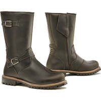
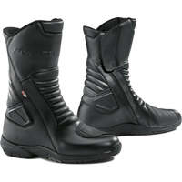
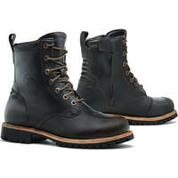
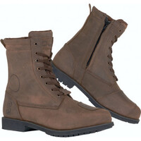
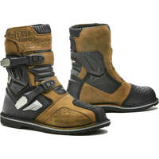
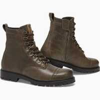
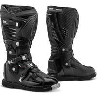

Update of my inventory of motorcycle sneakers/shoes/short boots that meet the maximum EN 13634:1222 standard.

I've changed the layout to arrange the equipment by price rather than by brand.

I've also added various indications to help you make your choice: place of manufacture when known, waterproofing, type advertised (just for info, as there's no particular cut for boots).

---

**Reminders about EN 13634:**

This standard requires motorcycle boots and shoes to display precise information on their level of protection:

- The first number indicates the height of the boot [^1] (1: low, 2: high), and is particularly interesting as a complement to the next 3, which assess the boot's level of protection for a specific hazard;
- Abrasion resistance[^2] ;
- Puncture resistance[^3] ;
- Torsion/crushing resistance[^4].

Today, only 2 levels exist for each, 1 and 2.

Common additional certifications :

- IPA: Malleolus protection
- IPS: Shin protection
- WR: Water penetration resistance
- FO: Resistance to hydrocarbons

---

> *Note:* This page is based on data supplied by manufacturers on their websites.
> Its generation is largely automated, so there may be some errors.
> 
> The manufacturers analyzed are
> [ACERBIS](https://www.acerbis.com/), 
[ALPINESTARS](https://www.alpinestars.com/), 
[BERING](https://bering.fr/), 
[BMW](https://www.bmw-motorrad.fr/), 
[BULL-IT](https://www.bull-it.com/), 
[COURSE](https://www.xlmoto.com/), 
[DAINESE](https://www.dainese.com), 
[DUCATI](https://www.ducati.com/), 
[DXR](https://www.motoblouz.com/), 
[ESQUAD](https://www.esquad.fr/), 
[EUDOXIE](https://eudoxie.shop/), 
[FALCO](https://giannifalco.com/), 
[FIVE](https://five-gloves.com/), 
[FORMA](https://www.formabootsusa.com/), 
[FUEL](https://fuelmotorcycles.eu/), 
[FURYGAN](https://www.furygan.com/), 
[GOLDTOP](https://goldtop.co.uk/), 
[HALVARSSONS](https://halvarssonsmc.com/), 
[HELSTONS](https://www.helstons.net/), 
[HEVIK](https://www.hevik.co.uk/), 
[HOOD](https://www.hoodjeans.co.uk), 
[IXON](https://www.ixon.com/), 
[IXS](https://ixs.com/), 
[JOHN-DOE](https://www.ridejohndoe.com/), 
[KLIM](https://www.klim.com/), 
[KNOX](https://www.planet-knox.com), 
[LOUIS](https://www.louis.ie), 
[LS2](https://www.ls2usa.com/), 
[MERLAMOTO](https://merlamoto.com/), 
[MERLIN](https://www.merlinbikegear.shop/), 
[MOTOGIRL](https://motogirl.co.uk/), 
[OJ](https://ojworld.it/), 
[OXFORD](https://www.oxfordproducts.com/), 
[PANDO](https://pandomoto.com/), 
[PMJ](https://pmj.it/), 
[RACERED](https://racered.eu/), 
[RACER](https://www.racer1927.com/), 
[RAXID](https://raxid.co.uk), 
[RESURGENCE-GEAR](https://resurgencegear.net/), 
[REVIT](https://www.revitsport.com/), 
[ROADSKIN](https://roadskin.co.uk/), 
[ROKKER](https://www.eu.therokkercompany.com/), 
[RST](https://www.rst-moto.com/), 
[RUKKA](https://luhta.com/), 
[SEGURA](https://segura-moto.fr/), 
[SEVENTY-DEGREES](https://seventy-70.com/), 
[SIDI](https://www.sidi.com/), 
[SOUBIRAC](https://www.soubirac.fr/), 
[SPIDI](https://www.spidi.com/), 
[TCX](https://www.tcxboots.com/), 
[2MILESIX](https://www.2milesix.com/).

> 
> The following manufacturers have been excluded because they do not display the safety level of their products, or are not marketed in Europe: ARLEN NESS, ARMURE, BELSTAFF, BILT, BOGOTTO, BOLID'STER, DRAGGIN, DRIRIDER, ELEVEIT, FLY MOTO, FOX, GAERNE, HARLEY DAVIDSON, HELD, HOLYFREEDOM, HONDA, ICON, INDIAN, KAWASAKI, KLIM, KTM, LEATT, MACNA, O'NEAL, OVERLAP, REAX, RICHA, RJAYS, RST, RUSTY STITCHES, SAINT, SCOTT, SEDICI, SHOT, SIDI, SOUBIRAC, SPIRIT MOTORS, STADLER, STREET & STEEL, STYLMARTIN, THOR, TRIUMPH, VENDRAMINI, WEX, XPD, YAMAHA

## Models at 76,41 € :

 | Modèle | Photos |
|---|---|
|                                                                                           **[DXR - SILVRETTA](https://www.motoblouz.com/vente-bottes-dxr-silvretta-200519.html)**                                                                                                                                                                                       EN13634-2222 IPA                                                                                                                                                                                        ") women's version                                                                                                                                                                                                                                                                                   ") Leather                                                                                                                                                                                       ") Waterproof                                                                                                                                                                                                                                                                                   Place of manufacture unknown.                                                                                                                                                                                                                                                                                   Price online at time of writing:                                                                                            - [76,41 €](https://pkw.motoblouz.com/?P4122157BDFF171&redir=https%3A%2F%2Fwww.motoblouz.com%2Frecherche%2FDXR%2520SILVRETTA.html) (motoblouz)                                                                                            - [119,90 €](https://www.motoblouz.com/vente-bottes-dxr-silvretta-200519.html) (manufacturer)                                                                                                                                                                                                                                                                                    To find them second-hand (~20-50 €) :                                                                                                                                                                                        |                                                                                                                                                                                                                                                                                 |                                                                                           

## Models at 129,95 € :

 | Modèle | Photos |
|---|---|
|                                                                                           **[FORMA - EAGLE](https://www.formabootsusa.com/collections/road-boots/products/eagle-black)**                                                                                                                                                                                       EN13634-2222 WR                                                                                                                                                                                        ") mixed model                                                                                                                                                                                                                                                                                   ") Leather                                                                                                                                                                                       ") Waterproof                                                                                                                                                                                                                                                                                   Fabriqué en Europe :   ") Romania                                                                                                                                                                                                                                                                                   Price online at time of writing:                                                                                             - [129,95 €](https://www.fc-moto.de/epages/fcm.sf/fr_FR/?ViewAction=FacetedSearchProducts&SearchString=FORMA+EAGLE) (fcmoto)                                                                                            - [249,00 $](https://www.formabootsusa.com/collections/road-boots/products/eagle-black) (manufacturer)                                                                                                                                                                                                                                                                                    To find them second-hand (~40-100 €) :                                                                                                                                                                                        |                                                                                                                                                                                                                                                                                 |                                                                                           

## Models at 130,39 € :

 | Modèle | Photos |
|---|---|
|                                                                                           **[FORMA - CRYSTAL](https://www.formabootsusa.com/collections/womens/products/crystal)**                                                                                                                                                                                       EN13634-2222 WR                                                                                                                                                                                        ") women's version                                                                                                                                                                                                                                                                                   ") Leather                                                                                                                                                                                       ") Waterproof                                                                                                                                                                                                                                                                                   Fabriqué en Europe :   ") Romania                                                                                                                                                                                                                                                                                   Une bonne présentation sur Youtube :                                                                                            [RevZilla - Forma Crystal Women's Boots Review](https://www.youtube.com/watch?v=DPIl5TvbG-E)                                                                                                                                                                                        Price online at time of writing:                                                                                            - [130,39 €](https://pkw.motoblouz.com/?P4122157BDFF171&redir=https%3A%2F%2Fwww.motoblouz.com%2Frecherche%2FFORMA%2520CRYSTAL.html) (motoblouz)                                                                                            - [130,42 €](https://www.dafy-moto.com/recherche?string=FORMA%20CRYSTAL) (dafy)                                                                                            - [140,95 €](https://www.fc-moto.de/epages/fcm.sf/fr_FR/?ViewAction=FacetedSearchProducts&SearchString=FORMA+CRYSTAL) (fcmoto)                                                                                            - [219,00 $](https://www.formabootsusa.com/collections/womens/products/crystal) (manufacturer)                                                                                                                                                                                                                                                                                    To find them second-hand (~40-90 €) :                                                                                                                                                                                        |                                                                                                                                                                                      |                                                                                           

## Models at 138,33 € :

 | Modèle | Photos |
|---|---|
|                                                                                           **[FORMA - RUBY](https://www.formabootsusa.com/collections/womens/products/ruby)**                                                                                                                                                                                       EN13634-2222 WR                                                                                                                                                                                        ") women's version                                                                                                                                                                                                                                                                                   ") Leather                                                                                                                                                                                       ") Waterproof                                                                                                                                                                                                                                                                                   Fabriqué en Europe :   ") Romania                                                                                                                                                                                                                                                                                   Price online at time of writing:                                                                                             - [138,33 €](https://www.dafy-moto.com/recherche?string=FORMA%20RUBY) (dafy)                                                                                            - [148,95 €](https://www.fc-moto.de/epages/fcm.sf/fr_FR/?ViewAction=FacetedSearchProducts&SearchString=FORMA+RUBY) (fcmoto)                                                                                            - [229,00 $](https://www.formabootsusa.com/collections/womens/products/ruby) (manufacturer)                                                                                                                                                                                                                                                                                    To find them second-hand (~40-80 €) :                                                                                                                                                                                        |                                                                                                                                                                                      |                                                                                           

## Models at 140,00 € :

 | Modèle | Photos |
|---|---|
|                                                                                           **[OJ - RUSH](https://ojworld.it/scarpe-e-stivali/rush.html)**                                                                                                                                                                                       EN13634-2222 WR                                                                                                                                                                                                                                                                                                                                                                                Place of manufacture unknown.                                                                                                                                                                                                                                                                                   Price online at time of writing:                                                                                            - [140,00 €](https://ojworld.it/scarpe-e-stivali/rush.html) (manufacturer)                                                                                                                                                                                                                                                                                    To find them second-hand (~40-100 €) :                                                                                                                                                                                        |                                                                                                                                                                                      |                                                                                           

## Models at 144,98 € :

 | Modèle | Photos |
|---|---|
|                                                                                           **[OJ - TURN](https://ojworld.it/scarpe-e-stivali/turn.html)**                                                                                                                                                                                       EN13634-2222 WR                                                                                                                                                                                                                                                                                                                                                                                Place of manufacture unknown.                                                                                                                                                                                                                                                                                   Price online at time of writing:                                                                                            - [144,98 €](https://ojworld.it/scarpe-e-stivali/turn.html) (manufacturer)                                                                                                                                                                                                                                                                                    To find them second-hand (~40-100 €) :                                                                                                                                                                                        |                                                                                                                                                                                      |                                                                                           

## Models at 149,99 € :

 | Modèle | Photos |
|---|---|
|                                                                                           **[OJ - MIDDLE](https://ojworld.it/scarpe-e-stivali/middle.html)**                                                                                                                                                                                       EN13634-2222 WR                                                                                                                                                                                                                                                                                                                                                                                Place of manufacture unknown.                                                                                                                                                                                                                                                                                   Price online at time of writing:                                                                                            - [149,99 €](https://ojworld.it/scarpe-e-stivali/middle.html) (manufacturer)                                                                                                                                                                                                                                                                                    To find them second-hand (~40-100 €) :                                                                                                                                                                                        |                                                                                                                                                                                      |                                                                                           

## Models at 159,99 € :

 | Modèle | Photos |
|---|---|
|                                                                                           **[OJ - MASSIVE](https://ojworld.it/scarpe-e-stivali/massive.html)**                                                                                                                                                                                       EN13634-2222 WR                                                                                                                                                                                                                                                                                                                                                                                Place of manufacture unknown.                                                                                                                                                                                                                                                                                   Price online at time of writing:                                                                                            - [159,99 €](https://ojworld.it/scarpe-e-stivali/massive.html) (manufacturer)                                                                                                                                                                                                                                                                                    To find them second-hand (~50-110 €) :                                                                                                                                                                                        |                                                                                                                                                                                      |                                                                                           

## Models at 173,83 € :

 | Modèle | Photos |
|---|---|
|                                                                                           **[FORMA - JASPER](https://www.formabootsusa.com/collections/road-boots/products/jasper)**                                                                                                                                                                                       EN13634-2222 WR                                                                                                                                                                                        ") men's version                                                                                                                                                                                                                                                                                   ") Leather                                                                                                                                                                                       ") Waterproof                                                                                                                                                                                                                                                                                   Fabriqué en Europe :   ") Romania                                                                                                                                                                                                                                                                                   Price online at time of writing:                                                                                            - [173,83 €](https://pkw.motoblouz.com/?P4122157BDFF171&redir=https%3A%2F%2Fwww.motoblouz.com%2Frecherche%2FFORMA%2520JASPER.html) (motoblouz)                                                                                            - [173,90 €](https://www.dafy-moto.com/recherche?string=FORMA%20JASPER) (dafy)                                                                                            - [187,00 €](https://www.fc-moto.de/epages/fcm.sf/fr_FR/?ViewAction=FacetedSearchProducts&SearchString=FORMA+JASPER) (fcmoto)                                                                                            - [249,00 $](https://www.formabootsusa.com/collections/road-boots/products/jasper) (manufacturer)                                                                                                                                                                                                                                                                                    To find them second-hand (~50-120 €) :                                                                                                                                                                                        |                                                                                                                                                                                      |                                                                                           
|                                                                                           **[FORMA - LEGACY](https://www.formabootsusa.com/collections/ride-urban/products/legacy)**                                                                                                                                                                                       EN13634-2222 WR                                                                                                                                                                                        ") mixed model                                                                                                                                                                                                                                                                                   ") Leather                                                                                                                                                                                       ") Waterproof                                                                                                                                                                                                                                                                                   Fabriqué en Europe :   ") Romania                                                                                                                                                                                                                                                                                   Price online at time of writing:                                                                                            - [173,83 €](https://pkw.motoblouz.com/?P4122157BDFF171&redir=https%3A%2F%2Fwww.motoblouz.com%2Frecherche%2FFORMA%2520LEGACY.html) (motoblouz)                                                                                            - [173,90 €](https://www.dafy-moto.com/recherche?string=FORMA%20LEGACY) (dafy)                                                                                            - [187,00 €](https://www.fc-moto.de/epages/fcm.sf/fr_FR/?ViewAction=FacetedSearchProducts&SearchString=FORMA+LEGACY) (fcmoto)                                                                                            - [249,00 $](https://www.formabootsusa.com/collections/ride-urban/products/legacy) (manufacturer)                                                                                                                                                                                                                                                                                    To find them second-hand (~50-120 €) :                                                                                                                                                                                        |                                                                                                                                                                                                                                                                                 |                                                                                           

## Models at 181,73 € :

 | Modèle | Photos |
|---|---|
|                                                                                           **[FORMA - ADV TOURER](https://www.formabootsusa.com/collections/dual-sport-adv-boots/products/adv-tourer-brown)**                                                                                                                                                                                       EN13634-2222 WR                                                                                                                                                                                        ") mixed model                                                                                                                                                                                                                                                                                   ") Leather                                                                                                                                                                                       ") Waterproof                                                                                                                                                                                                                                                                                   Fabriqué en Europe :   ") Romania                                                                                                                                                                                                                                                                                   De bonnes présentations sur Youtube :                                                                                            [RevZilla - Forma ADV Tourer Boots Review at RevZilla.com](https://www.youtube.com/watch?v=UW0SUETSMmE)                                                                                            [RevZilla - Forma ADV Tourer Women's Boots Review](https://www.youtube.com/watch?v=g2N76ldvZ8s)                                                                                                                                                                                        Price online at time of writing:                                                                                            - [181,73 €](https://pkw.motoblouz.com/?P4122157BDFF171&redir=https%3A%2F%2Fwww.motoblouz.com%2Frecherche%2FFORMA%2520ADV%2520TOURER.html) (motoblouz)                                                                                            - [181,81 €](https://www.dafy-moto.com/recherche?string=FORMA%20ADV%20TOURER) (dafy)                                                                                            - [195,95 €](https://www.fc-moto.de/epages/fcm.sf/fr_FR/?ViewAction=FacetedSearchProducts&SearchString=FORMA+ADV%20TOURER) (fcmoto)                                                                                            - [279,00 $](https://www.formabootsusa.com/collections/dual-sport-adv-boots/products/adv-tourer-brown) (manufacturer)                                                                                                                                                                                                                                                                                    To find them second-hand (~50-130 €) :                                                                                                                                                                                        |                                                                                                                                                                                                                                                                                 |                                                                                           
|                                                                                           **[FORMA - ADV TOURER LADY](https://www.formabootsusa.com/collections/dual-sport-adv-boots/products/adv-tourer-lady)**                                                                                                                                                                                       EN13634-2222 WR                                                                                                                                                                                        ") women's version                                                                                                                                                                                                                                                                                   ") Leather                                                                                                                                                                                       ") Waterproof                                                                                                                                                                                                                                                                                   Fabriqué en Europe :   ") Romania                                                                                                                                                                                                                                                                                   De bonnes présentations sur Youtube :                                                                                            [RevZilla - Forma ADV Tourer Women's Boots Review](https://www.youtube.com/watch?v=g2N76ldvZ8s)                                                                                            [RevZilla - Forma ADV Tourer Boots Review at RevZilla.com](https://www.youtube.com/watch?v=UW0SUETSMmE)                                                                                                                                                                                        Price online at time of writing:                                                                                            - [181,73 €](https://pkw.motoblouz.com/?P4122157BDFF171&redir=https%3A%2F%2Fwww.motoblouz.com%2Frecherche%2FFORMA%2520ADV%2520TOURER%2520FEMME.html) (motoblouz)                                                                                            - [181,81 €](https://www.dafy-moto.com/recherche?string=FORMA%20ADV%20TOURER%20FEMME) (dafy)                                                                                            - [195,95 €](https://www.fc-moto.de/epages/fcm.sf/fr_FR/?ViewAction=FacetedSearchProducts&SearchString=FORMA+ADV%20TOURER%20DAMES) (fcmoto)                                                                                            - [279,00 $](https://www.formabootsusa.com/collections/dual-sport-adv-boots/products/adv-tourer-lady) (manufacturer)                                                                                                                                                                                                                                                                                    To find them second-hand (~50-130 €) :                                                                                                                                                                                        |                                                                                                                                                                                      |                                                                                           

## Models at 181,81 € :

 | Modèle | Photos |
|---|---|
|                                                                                           **[FORMA - ADVENTURE LOW](https://www.formabootsusa.com/collections/dual-sport-adv-boots/products/adventure-low-brown)**                                                                                                                                                                                       EN13634-2222 WR                                                                                                                                                                                        ") mixed model                                                                                                                                                                                                                                                                                   ") Leather                                                                                                                                                                                       ") Waterproof                                                                                                                                                                                                                                                                                   Fabriqué en Europe :   ") Romania                                                                                                                                                                                                                                                                                   Price online at time of writing:                                                                                            - [181,81 €](https://www.dafy-moto.com/recherche?string=FORMA%20ADVENTURE%20LOW) (dafy)                                                                                            - [195,40 €](https://pkw.motoblouz.com/?P4122157BDFF171&redir=https%3A%2F%2Fwww.motoblouz.com%2Frecherche%2FFORMA%2520ADVENTURE%2520LOW.html) (motoblouz)                                                                                            - [249,00 $](https://www.formabootsusa.com/collections/dual-sport-adv-boots/products/adventure-low-brown) (manufacturer)                                                                                                                                                                                                                                                                                    To find them second-hand (~50-130 €) :                                                                                                                                                                                        |                                                                                                                                                                                                                                                                                 |                                                                                           

## Models at 185,43 € :

 | Modèle | Photos |
|---|---|
|                                                                                           **[FORMA - CAPE HORN HDRY](https://www.formabootsusa.com/collections/dual-sport-adv-boots/products/cape-horn)**                                                                                                                                                                                       EN13634-2222 WR                                                                                                                                                                                        ") mixed model                                                                                                                                                                                                                                                                                   ") Leather                                                                                                                                                                                       ") Waterproof                                                                                                                                                                                                                                                                                   Fabriqué en Europe :   ") Romania                                                                                                                                                                                                                                                                                   Une bonne présentation sur Youtube :                                                                                            [RevZilla - Forma Cape Horn Boots Review at RevZilla.com](https://www.youtube.com/watch?v=3kHfJsx44NY)                                                                                                                                                                                        Price online at time of writing:                                                                                            - [185,43 €](https://www.fc-moto.de/epages/fcm.sf/fr_FR/?ViewAction=FacetedSearchProducts&SearchString=FORMA+CAPE%20HORN%20HDRY) (fcmoto)                                                                                            - [185,40 €](https://www.dafy-moto.com/recherche?string=FORMA%20CAPE%20HORN%20HDRY) (dafy)                                                                                            - [188,90 €](https://pkw.motoblouz.com/?P4122157BDFF171&redir=https%3A%2F%2Fwww.motoblouz.com%2Frecherche%2FFORMA%2520CAPE%2520HORN%2520HDRY.html) (motoblouz)                                                                                            - [299,00 $](https://www.formabootsusa.com/collections/dual-sport-adv-boots/products/cape-horn) (manufacturer)                                                                                                                                                                                                                                                                                    To find them second-hand (~60-130 €) :                                                                                                                                                                                        |                                                                                                                                                                                      |                                                                                           

## Models at 199,99 € :

 | Modèle | Photos |
|---|---|
|                                                                                           **[OJ - EXPLORING](https://ojworld.it/scarpe-e-stivali/exploring.html)**                                                                                                                                                                                       EN13634-2222 WR                                                                                                                                                                                                                                                                                                                                                                                Place of manufacture unknown.                                                                                                                                                                                                                                                                                   Price online at time of writing:                                                                                            - [199,99 €](https://ojworld.it/scarpe-e-stivali/exploring.html) (manufacturer)                                                                                                                                                                                                                                                                                    To find them second-hand (~60-140 €) :                                                                                                                                                                                        |                                                                                                                                                                                      |                                                                                           
|                                                                                           **[OJ - GROUND](https://ojworld.it/scarpe-e-stivali/ground.html)**                                                                                                                                                                                       EN13634-2222                                                                                                                                                                                                                                                                                                                                                                                Place of manufacture unknown.                                                                                                                                                                                                                                                                                   Price online at time of writing:                                                                                            - [199,99 €](https://ojworld.it/scarpe-e-stivali/ground.html) (manufacturer)                                                                                                                                                                                                                                                                                    To find them second-hand (~60-140 €) :                                                                                                                                                                                        |                                                                                                                                                                                      |                                                                                           
|                                                                                           **[REVIT - FUSE H2O](https://www.revitsport.com/fr_fr/bottes-moto-fuse-h2o-noir)**                                                                                                                                                                                       EN13634-2222 WR                                                                                                                                                                                                                                                                                    ") Waterproof                                                                                                                                                                                                                                                                                   Place of manufacture unknown.                                                                                                                                                                                                                                                                                   Price online at time of writing:                                                                                            - [199,99 €](https://www.revitsport.com/fr_fr/bottes-moto-fuse-h2o-noir) (manufacturer)                                                                                            - [199,99 €](https://www.fc-moto.de/epages/fcm.sf/fr_FR/?ViewAction=FacetedSearchProducts&SearchString=REVIT+FUSE%20H2O) (fcmoto)                                                                                            - [199,99 €](https://pkw.motoblouz.com/?P4122157BDFF171&redir=https%3A%2F%2Fwww.motoblouz.com%2Frecherche%2FREVIT%2520FUSE%2520H2O.html) (motoblouz)                                                                                            - [199,99 €](https://www.dafy-moto.com/recherche?string=REVIT%20FUSE%20H2O) (dafy)                                                                                                                                                                                                                                                                                    To find them second-hand (~60-140 €) :                                                                                                                                                                                        |                                                                                                                                                                                      |                                                                                           

## Models at 209,47 € :

 | Modèle | Photos |
|---|---|
|                                                                                           **[FORMA - ADVENTURE](https://www.formabootsusa.com/collections/dual-sport-adv-boots/products/adventure-brown)**                                                                                                                                                                                       EN13634-2222 WR                                                                                                                                                                                        ") mixed model                                                                                                                                                                                                                                                                                   ") Leather                                                                                                                                                                                       ") Waterproof                                                                                                                                                                                                                                                                                   Fabriqué en Europe :   ") Romania                                                                                                                                                                                                                                                                                   Une bonne présentation sur Youtube :                                                                                            [RevZilla - Forma Adventure Boots Review at RevZilla.com](https://www.youtube.com/watch?v=kZ4PE89u4zM)                                                                                                                                                                                        Price online at time of writing:                                                                                            - [209,47 €](https://www.dafy-moto.com/recherche?string=FORMA%20ADVENTURE) (dafy)                                                                                            - [225,20 €](https://pkw.motoblouz.com/?P4122157BDFF171&redir=https%3A%2F%2Fwww.motoblouz.com%2Frecherche%2FFORMA%2520ADVENTURE.html) (motoblouz)                                                                                            - [299,00 $](https://www.formabootsusa.com/collections/dual-sport-adv-boots/products/adventure-brown) (manufacturer)                                                                                                                                                                                                                                                                                    To find them second-hand (~60-150 €) :                                                                                                                                                                                        |                                                                                                                                                                                                                                                                                 |                                                                                           
|                                                                                           **[FORMA - BOULDER](https://www.formabootsusa.com/collections/dual-sport-adv-boots/products/copy-of-boulder)**                                                                                                                                                                                       EN13634-2222                                                                                                                                                                                        ") mixed model                                                                                                                                                                                        Summer                                                                                                                                                                                                                                                                                   ") Leather                                                                                                                                                                                       ") Breathable                                                                                                                                                                                                                                                                                   Fabriqué en Europe :   ") Romania                                                                                                                                                                                                                                                                                   Une bonne présentation sur Youtube :                                                                                            [RevZilla - Forma Boulder Boots Review at RevZilla.com](https://www.youtube.com/watch?v=695gLEpDgfo)                                                                                                                                                                                        Price online at time of writing:                                                                                            - [209,47 €](https://www.dafy-moto.com/recherche?string=FORMA%20BOULDER) (dafy)                                                                                            - [214,90 €](https://pkw.motoblouz.com/?P4122157BDFF171&redir=https%3A%2F%2Fwww.motoblouz.com%2Frecherche%2FFORMA%2520BOULDER.html) (motoblouz)                                                                                            - [225,00 €](https://www.fc-moto.de/epages/fcm.sf/fr_FR/?ViewAction=FacetedSearchProducts&SearchString=FORMA+BOULDER) (fcmoto)                                                                                            - [299,00 $](https://www.formabootsusa.com/collections/dual-sport-adv-boots/products/copy-of-boulder) (manufacturer)                                                                                                                                                                                                                                                                                    To find them second-hand (~60-150 €) :                                                                                                                                                                                        |                                                                                                                                                                                                                                                                                                                                                                            |                                                                                           

## Models at 209,99 € :

 | Modèle | Photos |
|---|---|
|                                                                                           **[REVIT - DESCENT H2O](https://www.revitsport.com/fr_fr/chaussures-moto-descent-h2o-noir-rouge)**                                                                                                                                                                                       EN13634-2222 WR                                                                                                                                                                                         Summer                                                                                                                                                                                                                                                                                   ") Waterproof                                                                                                                                                                                       ") Breathable                                                                                                                                                                                                                                                                                   Place of manufacture unknown.                                                                                                                                                                                                                                                                                   Price online at time of writing:                                                                                            - [209,99 €](https://www.revitsport.com/fr_fr/chaussures-moto-descent-h2o-noir-rouge) (manufacturer)                                                                                            - [209,99 €](https://www.fc-moto.de/epages/fcm.sf/fr_FR/?ViewAction=FacetedSearchProducts&SearchString=REVIT+DESCENT%20H2O) (fcmoto)                                                                                                                                                                                                                                                                                    To find them second-hand (~60-150 €) :                                                                                                                                                                                        |                                                                                                                                                                                                                                                                                 |                                                                                           

## Models at 219,99 € :

 | Modèle | Photos |
|---|---|
|                                                                                           **[REVIT - FLUX H2O](https://www.revitsport.com/fr_fr/bottes-moto-flux-h2o-noir)**                                                                                                                                                                                       EN13634-2222 WR                                                                                                                                                                                                                                                                                    ") Waterproof                                                                                                                                                                                                                                                                                   Place of manufacture unknown.                                                                                                                                                                                                                                                                                   Price online at time of writing:                                                                                            - [219,99 €](https://www.revitsport.com/fr_fr/bottes-moto-flux-h2o-noir) (manufacturer)                                                                                            - [219,99 €](https://www.fc-moto.de/epages/fcm.sf/fr_FR/?ViewAction=FacetedSearchProducts&SearchString=REVIT+FLUX%20H2O) (fcmoto)                                                                                            - [219,99 €](https://pkw.motoblouz.com/?P4122157BDFF171&redir=https%3A%2F%2Fwww.motoblouz.com%2Frecherche%2FREVIT%2520FLUX%2520H2O.html) (motoblouz)                                                                                            - [219,99 €](https://www.dafy-moto.com/recherche?string=REVIT%20FLUX%20H2O) (dafy)                                                                                                                                                                                                                                                                                    To find them second-hand (~70-150 €) :                                                                                                                                                                                        |                                                                                                                                                                                      |                                                                                           

## Models at 221,33 € :

 | Modèle | Photos |
|---|---|
|                                                                                           **[FORMA - BOULDER COMP](https://www.formabootsusa.com/collections/off-road-boots/products/boulder-comp)**                                                                                                                                                                                       EN13634-2222                                                                                                                                                                                        ") mixed model                                                                                                                                                                                        Summer                                                                                                                                                                                                                                                                                   ") Leather                                                                                                                                                                                       ") Breathable                                                                                                                                                                                                                                                                                   Fabriqué en Europe :   ") Romania                                                                                                                                                                                                                                                                                   Price online at time of writing:                                                                                            - [221,33 €](https://www.dafy-moto.com/recherche?string=FORMA%20BOULDER%20COMP) (dafy)                                                                                            - [237,90 €](https://pkw.motoblouz.com/?P4122157BDFF171&redir=https%3A%2F%2Fwww.motoblouz.com%2Frecherche%2FFORMA%2520BOULDER%2520COMP.html) (motoblouz)                                                                                            - [299,00 $](https://www.formabootsusa.com/collections/off-road-boots/products/boulder-comp) (manufacturer)                                                                                                                                                                                                                                                                                    To find them second-hand (~70-150 €) :                                                                                                                                                                                        |                                                                                                                                                                                      |                                                                                           

## Models at 229,95 € :

 | Modèle | Photos |
|---|---|
|                                                                                           **[FORMA - TERRA EVO LOW](https://www.formabootsusa.com/collections/dual-sport-adv-boots/products/terra-evo-low-brown)**                                                                                                                                                                                       EN13634-2222 WR                                                                                                                                                                                        ") mixed model                                                                                                                                                                                                                                                                                   ") Leather                                                                                                                                                                                       ") Waterproof                                                                                                                                                                                                                                                                                   Fabriqué en Europe :   ") Romania                                                                                                                                                                                                                                                                                   De bonnes présentations sur Youtube :                                                                                            [RevZilla - Forma Terra EVO & EVO Low Boots Review](https://www.youtube.com/watch?v=a-1NCfGEtyk)                                                                                            [RevZilla - Forma Terra EVO Dry X-Series Boots Review](https://www.youtube.com/watch?v=O_JBWbgt5qQ)                                                                                                                                                                                        Price online at time of writing:                                                                                            - [229,95 €](https://www.fc-moto.de/epages/fcm.sf/fr_FR/?ViewAction=FacetedSearchProducts&SearchString=FORMA+TERRA%20EVO%20LOW) (fcmoto)                                                                                            - [229,40 €](https://pkw.motoblouz.com/?P4122157BDFF171&redir=https%3A%2F%2Fwww.motoblouz.com%2Frecherche%2FFORMA%2520TERRA%2520EVO%2520LOW.html) (motoblouz)                                                                                            - [260,86 €](https://www.dafy-moto.com/recherche?string=FORMA%20TERRA%20EVO%20LOW) (dafy)                                                                                            - [299,00 $](https://www.formabootsusa.com/collections/dual-sport-adv-boots/products/terra-evo-low-brown) (manufacturer)                                                                                                                                                                                                                                                                                    To find them second-hand (~70-160 €) :                                                                                                                                                                                        |                                                                                                                                                                                                                                                                                 |                                                                                           

## Models at 239,99 € :

 | Modèle | Photos |
|---|---|
|                                                                                           **[REVIT - PULSE H2O](https://www.revitsport.com/fr_fr/bottes-moto-pulse-h2o-noir)**                                                                                                                                                                                       EN13634-2222 WR                                                                                                                                                                                                                                                                                    ") Waterproof                                                                                                                                                                                                                                                                                   Place of manufacture unknown.                                                                                                                                                                                                                                                                                   Price online at time of writing:                                                                                            - [239,99 €](https://www.revitsport.com/fr_fr/bottes-moto-pulse-h2o-noir) (manufacturer)                                                                                            - [239,99 €](https://www.fc-moto.de/epages/fcm.sf/fr_FR/?ViewAction=FacetedSearchProducts&SearchString=REVIT+PULSE%20H2O) (fcmoto)                                                                                            - [239,99 €](https://pkw.motoblouz.com/?P4122157BDFF171&redir=https%3A%2F%2Fwww.motoblouz.com%2Frecherche%2FREVIT%2520PULSE%2520H2O.html) (motoblouz)                                                                                            - [239,99 €](https://www.dafy-moto.com/recherche?string=REVIT%20PULSE%20H2O) (dafy)                                                                                                                                                                                                                                                                                    To find them second-hand (~70-170 €) :                                                                                                                                                                                        |                                                                                                                                                                                      |                                                                                           

## Models at 260,86 € :

 | Modèle | Photos |
|---|---|
|                                                                                           **[FORMA - TERRA EVO DRY X SERIES](https://www.formabootsusa.com/collections/dual-sport-adv-boots/products/terra-evo-brown)**                                                                                                                                                                                       EN13634-2222 WR                                                                                                                                                                                        ") mixed model                                                                                                                                                                                                                                                                                   ") Leather                                                                                                                                                                                       ") Waterproof                                                                                                                                                                                                                                                                                   Fabriqué en Europe :   ") Romania                                                                                                                                                                                                                                                                                   Une bonne présentation sur Youtube :                                                                                            [RevZilla - Forma Terra EVO Dry X-Series Boots Review](https://www.youtube.com/watch?v=O_JBWbgt5qQ)                                                                                                                                                                                        Price online at time of writing:                                                                                            - [260,86 €](https://www.dafy-moto.com/recherche?string=FORMA%20TERRA%20EVO%20DRY%20X%20SERIES) (dafy)                                                                                            - [379,00 $](https://www.formabootsusa.com/collections/dual-sport-adv-boots/products/terra-evo-brown) (manufacturer)                                                                                                                                                                                                                                                                                    To find them second-hand (~80-180 €) :                                                                                                                                                                                        |                                                                                                                                                                                                                                                                                 |                                                                                           

## Models at 269,99 € :

 | Modèle | Photos |
|---|---|
|                                                                                           **[REVIT - LINK GTX](https://www.revitsport.com/fr_fr/bottes-moto-link-gtx-noir)**                                                                                                                                                                                       EN13634-2222 WR                                                                                                                                                                                         Summer                                                                                                                                                                                                                                                                                   ") Leather                                                                                                                                                                                       ") Waterproof                                                                                                                                                                                       ") Breathable                                                                                                                                                                                                                                                                                   Place of manufacture unknown.                                                                                                                                                                                                                                                                                   Price online at time of writing:                                                                                            - [269,99 €](https://www.revitsport.com/fr_fr/bottes-moto-link-gtx-noir) (manufacturer)                                                                                            - [269,99 €](https://www.fc-moto.de/epages/fcm.sf/fr_FR/?ViewAction=FacetedSearchProducts&SearchString=REVIT+LINK%20GTX) (fcmoto)                                                                                                                                                                                                                                                                                    To find them second-hand (~80-190 €) :                                                                                                                                                                                        |                                                                                                                                                                                      |                                                                                           

## Models at 289,99 € :

 | Modèle | Photos |
|---|---|
|                                                                                           **[REVIT - EVEREST GTX](https://www.revitsport.com/fr_fr/bottes-moto-everest-gtx-noir)**                                                                                                                                                                                       EN13634-2222 WR IPS                                                                                                                                                                                                                                                                                                                                                                                Place of manufacture unknown.                                                                                                                                                                                                                                                                                   Une bonne présentation sur Youtube :                                                                                            [RevZilla - REV'IT! Everest GTX Jacket & Pants Review at RevZilla.com](https://www.youtube.com/watch?v=Rc76mVzq9oo)                                                                                                                                                                                        Price online at time of writing:                                                                                            - [289,99 €](https://www.revitsport.com/fr_fr/bottes-moto-everest-gtx-noir) (manufacturer)                                                                                            - [289,99 €](https://www.fc-moto.de/epages/fcm.sf/fr_FR/?ViewAction=FacetedSearchProducts&SearchString=REVIT+EVEREST%20GTX) (fcmoto)                                                                                                                                                                                                                                                                                    To find them second-hand (~90-200 €) :                                                                                                                                                                                        |                                                                                                                                                                                      |                                                                                           

## Models at 299,99 € :

 | Modèle | Photos |
|---|---|
|                                                                                           **[REVIT - PATROL](https://www.revitsport.com/fr_fr/chaussures-moto-patrol-verte-olive-noir)**                                                                                                                                                                                       EN13634-2222                                                                                                                                                                                                                                                                                    ") Leather                                                                                                                                                                                                                                                                                   Place of manufacture unknown.                                                                                                                                                                                                                                                                                   Une bonne présentation sur Youtube :                                                                                            [Urban Rider - REVIT Patrol Boots Review](https://www.youtube.com/watch?v=TAvA_-I6zR4)                                                                                                                                                                                        Price online at time of writing:                                                                                            - [299,99 €](https://www.revitsport.com/fr_fr/chaussures-moto-patrol-verte-olive-noir) (manufacturer)                                                                                            - [299,99 €](https://www.fc-moto.de/epages/fcm.sf/fr_FR/?ViewAction=FacetedSearchProducts&SearchString=REVIT+PATROL) (fcmoto)                                                                                                                                                                                                                                                                                    To find them second-hand (~90-210 €) :                                                                                                                                                                                        |                                                                                                                                                                                      |                                                                                           

## Models at 351,76 € :

 | Modèle | Photos |
|---|---|
|                                                                                           **[FORMA - PREDATOR 2 0](https://www.formabootsusa.com/collections/off-road-boots/products/predator-2-0-white-blue-red)**                                                                                                                                                                                       EN13634-2222                                                                                                                                                                                        ") men's version                                                                                                                                                                                                                                                                                                                                                                               Fabriqué en Europe :   ") Romania                                                                                                                                                                                                                                                                                   Price online at time of writing:                                                                                            - [351,76 €](https://www.dafy-moto.com/recherche?string=FORMA%20PREDATOR%202%200) (dafy)                                                                                            - [378,00 €](https://www.fc-moto.de/epages/fcm.sf/fr_FR/?ViewAction=FacetedSearchProducts&SearchString=FORMA+PREDATOR%202%200) (fcmoto)                                                                                            - [378,20 €](https://pkw.motoblouz.com/?P4122157BDFF171&redir=https%3A%2F%2Fwww.motoblouz.com%2Frecherche%2FFORMA%2520PREDATOR%25202%25200.html) (motoblouz)                                                                                            - [549,00 $](https://www.formabootsusa.com/collections/off-road-boots/products/predator-2-0-white-blue-red) (manufacturer)                                                                                                                                                                                                                                                                                    To find them second-hand (~110-250 €) :                                                                                                                                                                                        |                                                                                                                                                                                                                                                                                                                                                                                                                                                                       |                                                                                           
|                                                                                           **[FORMA - PREDATOR 2 0 ENDURO](https://www.formabootsusa.com/collections/dual-sport-adv-boots/products/predator-2-enduro)**                                                                                                                                                                                       EN13634-2222                                                                                                                                                                                        ") men's version                                                                                                                                                                                                                                                                                                                                                                               Fabriqué en Europe :   ") Romania                                                                                                                                                                                                                                                                                   Price online at time of writing:                                                                                            - [351,76 €](https://www.dafy-moto.com/recherche?string=FORMA%20PREDATOR%202%200%20ENDURO) (dafy)                                                                                            - [378,00 €](https://www.fc-moto.de/epages/fcm.sf/fr_FR/?ViewAction=FacetedSearchProducts&SearchString=FORMA+PREDATOR%202%200%20ENDURO) (fcmoto)                                                                                            - [378,20 €](https://pkw.motoblouz.com/?P4122157BDFF171&redir=https%3A%2F%2Fwww.motoblouz.com%2Frecherche%2FFORMA%2520PREDATOR%25202%25200%2520ENDURO.html) (motoblouz)                                                                                            - [549,00 $](https://www.formabootsusa.com/collections/dual-sport-adv-boots/products/predator-2-enduro) (manufacturer)                                                                                                                                                                                                                                                                                    To find them second-hand (~110-250 €) :                                                                                                                                                                                        |                                                                                                                                                                                      |                                                                                           

## Models at 399,99 € :

 | Modèle | Photos |
|---|---|
|                                                                                           **[REVIT - PIONEER GTX](https://www.revitsport.com/fr_fr/bottes-moto-pioneer-gtx-noir)**                                                                                                                                                                                       EN13634-2222 WR                                                                                                                                                                                                                                                                                                                                                                                Fabriqué en Europe :   ") Italy                                                                                                                                                                                                                                                                                   Une bonne présentation sur Youtube :                                                                                            [RevZilla - REV'IT! Pioneer GTX Boots Review](https://www.youtube.com/watch?v=hGaVIYGloDE)                                                                                                                                                                                        Price online at time of writing:                                                                                            - [399,99 €](https://www.revitsport.com/fr_fr/bottes-moto-pioneer-gtx-noir) (manufacturer)                                                                                            - [399,99 €](https://www.fc-moto.de/epages/fcm.sf/fr_FR/?ViewAction=FacetedSearchProducts&SearchString=REVIT+PIONEER%20GTX) (fcmoto)                                                                                                                                                                                                                                                                                    To find them second-hand (~120-280 €) :                                                                                                                                                                                        |                                                                                                                                                                                      |                                                                                           

## Models at 469,99 € :

 | Modèle | Photos |
|---|---|
|                                                                                           **[REVIT - DISCOVERY GTX](https://www.revitsport.com/fr_fr/bottes-moto-discovery-gtx-marron)**                                                                                                                                                                                       EN13634-2222 WR IPS                                                                                                                                                                                                                                                                                    ") Waterproof                                                                                                                                                                                                                                                                                   Fabriqué en Europe :   ") Italy                                                                                                                                                                                                                                                                                   Une bonne présentation sur Youtube :                                                                                            [RevZilla - REV'IT! Discovery GTX Boots Review](https://www.youtube.com/watch?v=mUPfQ_K-PFc)                                                                                                                                                                                        Price online at time of writing:                                                                                            - [469,99 €](https://www.revitsport.com/fr_fr/bottes-moto-discovery-gtx-marron) (manufacturer)                                                                                            - [469,99 €](https://www.fc-moto.de/epages/fcm.sf/fr_FR/?ViewAction=FacetedSearchProducts&SearchString=REVIT+DISCOVERY%20GTX) (fcmoto)                                                                                                                                                                                                                                                                                    To find them second-hand (~140-330 €) :                                                                                                                                                                                        |                                                                                                                                                                                                                                                                                 |                                                                                           

## Models at 679,99 € :

 | Modèle | Photos |
|---|---|
|                                                                                           **[REVIT - EXPEDITION GTX](https://www.revitsport.com/fr_fr/bottes-moto-expedition-gtx-noir-gris)**                                                                                                                                                                                       EN13634-2222 WR IPS                                                                                                                                                                                                                                                                                    ") Leather                                                                                                                                                                                                                                                                                   Fabriqué en Europe :   ") Italy                                                                                                                                                                                                                                                                                   Price online at time of writing:                                                                                            - [679,99 €](https://www.revitsport.com/fr_fr/bottes-moto-expedition-gtx-noir-gris) (manufacturer)                                                                                            - [679,99 €](https://www.fc-moto.de/epages/fcm.sf/fr_FR/?ViewAction=FacetedSearchProducts&SearchString=REVIT+EXPEDITION%20GTX) (fcmoto)                                                                                            - [679,99 €](https://pkw.motoblouz.com/?P4122157BDFF171&redir=https%3A%2F%2Fwww.motoblouz.com%2Frecherche%2FREVIT%2520EXPEDITION%2520GTX.html) (motoblouz)                                                                                                                                                                                                                                                                                    To find them second-hand (~200-480 €) :                                                                                                                                                                                        |                                                                                                                                                                                      |                                                                                           

---

[^1]: **Shank height front/rear of calf** ( Standard _CE EN 13634-2017_) :  
    Measured from the ground :
        1. Level 1: 10.3 cm/6.4 cm below 36, up to 12.1 cm / 7.3 cm above 45.
        2. Level 2: 16.2 cm/11.3 cm below 36, up to 19.2 cm / 13.1 cm above 45.
[^2]: **Abrasion resistance** ( Standard _CE EN 13634-2017_) :  
       Number of seconds to cross upper+lining with a 60-grit abrasive belt running at 8 m/s (zone B = high risk, zone A = rest of shoe).
        1. Level 1: 1.5 s zone A, 5 s zone B
        2. Level 2: 2.5 s zone A, 12 s zone B
[^3]: **Piercing/cutting resistance** ( Standard _CE EN 13634-2017_):  
       A blade is thrown at 2.8 m/s on rod+liner and penetration is measured:
        1. Level 1: < 25 mm
        2. Level 2: < 15 mm
[^4]: **Torsion resistance** ( Standard _CE EN 13634-2017_) :  
       Measurement of the force required to deform the sole by 2 cm :
        1. Level 1: > 1 kN
        2. Level 2: > 1.5 kN
