Mise à jour de mon inventaire des bottes de moto montantes au maximum de la norme EN 13634 : 2222 :

Cette page a été réalisée à partir des données fournies par les fabricants sur leurs sites Web ou que j'ai obtenu par d'autres biais (service client, étiquette en boutique...).

J'ai agrégré diverses indications pour aider à faire son choix : lieu de fabrication quand connu, imperméabilité, genre annoncé (juste pour info, car pour les bottes pas de coupe particulière), tailles quand je les ai détectées, liens pré-construits vers Vinted, Leboncoin, les sites de vente...

Les liens vers les sites de vente mentionnent les prix au moment de la rédaction de l'article _(note : Je peux toucher quelques centimes si vous passez par un de mes liens pour acheter sur Motoblouz)_.

---

**Rappels concernant la norme EN 13634 :**

Elle impose d'afficher sur les étiquettes des chaussures/bottes moto des infos précises sur leur niveau de protection :

- Le premier chiffre indique la hauteur du chaussant[^1] (1 : basse, 2 : haute), il est surtout intéressant en complément des 3 suivants qui évaluent le niveau de protection de la chaussure pour un danger spécifique ;
- Résistance à l'abrasion[^2] ;
- Résistance à la perforation[^3] ;
- Résistance à la torsion/écrasement[^4].

Aujourd'hui seuls 2 niveaux existent pour chacun, 1 et 2.

Certifications complémentaires courantes :

- IPA : Protection de la malléole
- IPS : Protection du tibia
- WR : Résistance à la pénétration de l'eau
- FO : Résistance aux hydrocarbures

---

## Modèles à 71,92 € :

 | Modèle | Photos |
|---|---|
|                                                                                           **DXR - SILVRETTA**                                                                                                                                                                                        EN13634-2222 IPA                                                                                            ") Modèle femme                                                                                             Tailles : 36, 38, 40, 42                                                                                                                                                                                        **Pages fabricant :**                                                                                            - [vente-bottes-dxr-silvretta-200519](https://www.motoblouz.com/vente-bottes-dxr-silvretta-200519.html)                                                                                                                                                                                        **Lieu de fabrication :**                                                                                             Inconnu                                                                                                                                                                                        **Caractéristiques :**                                                                                            ") Cuir                                                                                            ") Imperméable                                                                                                                                                                                        **Prix en ligne au moment de la rédaction :**                                                                                            - [71,92 € (motoblouz)](https://pkw.motoblouz.com/?P4122157BDFF171&redir=https%3A%2F%2Fwww.motoblouz.com%2Frecherche%2FDXR%2520SILVRETTA.html)                                                                                            - 119,90 € (fabricant)                                                                                            - [Rechercher (fcmoto)](https://www.fc-moto.de/epages/fcm.sf/fr_FR/?ViewAction=FacetedSearchProducts&SearchString=DXR+SILVRETTA)                                                                                            - [Rechercher (motardinn)](https://www.tradeinn.com/motardinn/fr?products_search%5Bquery%5D=DXR+SILVRETTA)                                                                                            - [Rechercher (dafymoto)](https://www.dafy-moto.com/recherche?string=DXR+SILVRETTA)                                                                                                                                                                                        **Aide à la recherche :**                                                                                            *Rechercher en occasion (~20-50 €)*                                                                                            [ Leboncoin](https://www.leboncoin.fr/recherche?text=moto+DXR+SILVRETTA&shippable=1&sort=price&order=asc) [ Vinted](https://www.vinted.fr/catalog?search_text=moto+DXR+SILVRETTA&order=price_low_to_high) *Recherches diverses :*                                                                                            [ Google](https://www.google.com/search?q=moto+DXR+SILVRETTA) [ Youtube](https://www.youtube.com/results?search_query=moto+DXR+SILVRETTA)                                                                                            |                                                                                                                                                                                      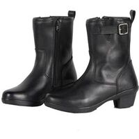                                                                                           |                                                                                           

## Modèles à 105,99 € :

 | Modèle | Photos |
|---|---|
|                                                                                           **OJ - TURN**                                                                                                                                                                                        EN13634-2222 WR                                                                                            ") Modèle mixte femme/homme                                                                                             Tailles : 38, 40, 42, 44, 46, 48                                                                                                                                                                                        **Pages fabricant :**                                                                                            - [turn-b018](https://ojworld.it/ita/calzature/stivali/turn-b018.html)                                                                                                                                                                                        **Lieu de fabrication :**                                                                                             Inconnu                                                                                                                                                                                        **Caractéristiques :**                                                                                             (image modifiée : Tabler-icons)") Imperméable (Hipora)                                                                                                                                                                                        **Prix en ligne au moment de la rédaction :**                                                                                            - [105,99 € (motardinn)](https://www.tradeinn.com/motardinn/fr?products_search%5Bquery%5D=OJ+TURN)                                                                                            - 144,98 € (fabricant)                                                                                            - [Rechercher (fcmoto)](https://www.fc-moto.de/epages/fcm.sf/fr_FR/?ViewAction=FacetedSearchProducts&SearchString=OJ+TURN)                                                                                            - [Rechercher (motoblouz)](https://www.motoblouz.com/recherche/OJ+TURN.html)                                                                                            - [Rechercher (dafymoto)](https://www.dafy-moto.com/recherche?string=OJ+TURN)                                                                                                                                                                                        **Aide à la recherche :**                                                                                            *Rechercher en occasion (~30-70 €)*                                                                                            [ Leboncoin](https://www.leboncoin.fr/recherche?text=moto+OJ+TURN&shippable=1&sort=price&order=asc) [ Vinted](https://www.vinted.fr/catalog?search_text=moto+OJ+TURN&order=price_low_to_high) *Recherches diverses :*                                                                                            [ Google](https://www.google.com/search?q=moto+OJ+TURN) [ Youtube](https://www.youtube.com/results?search_query=moto+OJ+TURN)                                                                                            |                                                                                                                                                                                      |                                                                                           

## Modèles à 121,74 € :

 | Modèle | Photos |
|---|---|
|                                                                                           **ACERBIS - ASFALT**                                                                                                                                                                                        EN13634-2222 WR                                                                                             (image modifiée : Tabler-icons)") Disponible en petites tailles (<40)                                                                                             Tailles : 37, 38, 39, 40, 41, 42, 43, 44, 45, 46, 47                                                                                                                                                                                        **Pages fabricant :**                                                                                            - [0023927](https://www.acerbis.com/eu/motorsport/dual-road/boots/0023927)                                                                                                                                                                                        **Lieu de fabrication :**                                                                                            Europe :                                                                                                                                                                                        ") Italie                                                                                                                                                                                                                                                                                   **Caractéristiques :**                                                                                            ") Imperméable                                                                                                                                                                                        **Prix en ligne au moment de la rédaction :**                                                                                            - [121,74 € (dafymoto)](https://www.dafy-moto.com/recherche?string=ACERBIS%20ASFALT)                                                                                            - 164,95 € (fabricant)                                                                                            - [Rechercher (fcmoto)](https://www.fc-moto.de/epages/fcm.sf/fr_FR/?ViewAction=FacetedSearchProducts&SearchString=ACERBIS+ASFALT)                                                                                            - [Rechercher (motoblouz)](https://www.motoblouz.com/recherche/ACERBIS+ASFALT.html)                                                                                            - [Rechercher (motardinn)](https://www.tradeinn.com/motardinn/fr?products_search%5Bquery%5D=ACERBIS+ASFALT)                                                                                                                                                                                        **Aide à la recherche :**                                                                                            *Rechercher en occasion (~40-80 €)*                                                                                            [ Leboncoin](https://www.leboncoin.fr/recherche?text=moto+ACERBIS+ASFALT&shippable=1&sort=price&order=asc) [ Vinted](https://www.vinted.fr/catalog?search_text=moto+ACERBIS+ASFALT&order=price_low_to_high) *Recherches diverses :*                                                                                            [ Google](https://www.google.com/search?q=moto+ACERBIS+ASFALT) [ Youtube](https://www.youtube.com/results?search_query=moto+ACERBIS+ASFALT)                                                                                            |                                                                                           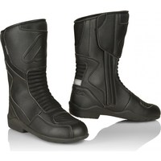                                                                                           |                                                                                           

## Modèles à 123,44 € :

 | Modèle | Photos |
|---|---|
|                                                                                           **FORMA - CRYSTAL**                                                                                                                                                                                        EN13634-2222 WR                                                                                            ") Modèle femme                                                                                             Tailles : 33, 45                                                                                                                                                                                        **Pages fabricant :**                                                                                            - [crystal](https://www.formabootsusa.com/collections/womens/products/crystal)                                                                                                                                                                                        **Lieu de fabrication :**                                                                                            Europe :                                                                                                                                                                                        ") Roumanie                                                                                                                                                                                                                                                                                   **Caractéristiques :**                                                                                            ") Cuir                                                                                            ") Imperméable                                                                                                                                                                                        **Une bonne présentation :**                                                                                            [ Youtube : RevZilla - Forma-Crystal-Women-s-Boots-Review](https://www.youtube.com/watch?v=DPIl5TvbG-E)                                                                                                                                                                                        **Prix en ligne au moment de la rédaction :**                                                                                            - [123,44 € (dafymoto)](https://www.dafy-moto.com/recherche?string=FORMA%20CRYSTAL)                                                                                            - [130,39 € (motoblouz)](https://pkw.motoblouz.com/?P4122157BDFF171&redir=https%3A%2F%2Fwww.motoblouz.com%2Frecherche%2FFORMA%2520CRYSTAL.html)                                                                                            - [142,10 € (motardinn)](https://www.tradeinn.com/motardinn/fr?products_search%5Bquery%5D=FORMA+CRYSTAL)                                                                                            - [148,95 € (fcmoto)](https://www.fc-moto.de/epages/fcm.sf/fr_FR/?ViewAction=FacetedSearchProducts&SearchString=FORMA+CRYSTAL)                                                                                            - 219,00 $ (fabricant)                                                                                                                                                                                        **Aide à la recherche :**                                                                                            *Rechercher en occasion (~40-90 €)*                                                                                            [ Leboncoin](https://www.leboncoin.fr/recherche?text=moto+FORMA+CRYSTAL&shippable=1&sort=price&order=asc) [ Vinted](https://www.vinted.fr/catalog?search_text=moto+FORMA+CRYSTAL&order=price_low_to_high) *Recherches diverses :*                                                                                            [ Google](https://www.google.com/search?q=moto+FORMA+CRYSTAL) [ Youtube](https://www.youtube.com/results?search_query=moto+FORMA+CRYSTAL)                                                                                            |                                                                                                                                                                                      |                                                                                           

## Modèles à 125,16 € :

 | Modèle | Photos |
|---|---|
|                                                                                           **FORMA - RUBY**                                                                                                                                                                                        EN13634-2222 WR                                                                                            ") Modèle femme                                                                                             Tailles : 48                                                                                                                                                                                        **Pages fabricant :**                                                                                            - [ruby](https://www.formabootsusa.com/collections/womens/products/ruby)                                                                                                                                                                                        **Lieu de fabrication :**                                                                                            Europe :                                                                                                                                                                                        ") Roumanie                                                                                                                                                                                                                                                                                   **Caractéristiques :**                                                                                            ") Cuir                                                                                            ") Imperméable                                                                                                                                                                                        **Prix en ligne au moment de la rédaction :**                                                                                            - [125,16 € (motardinn)](https://www.tradeinn.com/motardinn/fr?products_search%5Bquery%5D=FORMA+RUBY)                                                                                            - [132,74 € (dafymoto)](https://www.dafy-moto.com/recherche?string=FORMA%20RUBY)                                                                                            - 229,00 $ (fabricant)                                                                                            - [Rechercher (fcmoto)](https://www.fc-moto.de/epages/fcm.sf/fr_FR/?ViewAction=FacetedSearchProducts&SearchString=FORMA+RUBY)                                                                                            - [Rechercher (motoblouz)](https://www.motoblouz.com/recherche/FORMA+RUBY.html)                                                                                                                                                                                        **Aide à la recherche :**                                                                                            *Rechercher en occasion (~40-90 €)*                                                                                            [ Leboncoin](https://www.leboncoin.fr/recherche?text=moto+FORMA+RUBY&shippable=1&sort=price&order=asc) [ Vinted](https://www.vinted.fr/catalog?search_text=moto+FORMA+RUBY&order=price_low_to_high) *Recherches diverses :*                                                                                            [ Google](https://www.google.com/search?q=moto+FORMA+RUBY) [ Youtube](https://www.youtube.com/results?search_query=moto+FORMA+RUBY)                                                                                            |                                                                                           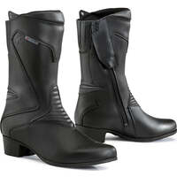                                                                                           |                                                                                           

## Modèles à 129,99 £ :

 | Modèle | Photos |
|---|---|
|                                                                                           **OXFORD - VALENTINA WOMEN**                                                                                                                                                                                        EN13634-2222                                                                                            ") Modèle femme                                                                                             Tailles : 36, 37, 38, 39, 40, 41                                                                                            ") Eté                                                                                                                                                                                        **Pages fabricant :**                                                                                            - [oxford_valentina_ws_boots_black/](https://www.oxfordproducts.com/motorcycle/product_type/rider_wear/oxford/boots/oxford_valentina_ws_boots_black/)                                                                                                                                                                                        **Lieu de fabrication :**                                                                                             Inconnu                                                                                                                                                                                        **Caractéristiques :**                                                                                            ") Cuir                                                                                            ") Respirant                                                                                            ") Imperméable                                                                                                                                                                                        **Prix en ligne au moment de la rédaction :**                                                                                            - 129,99 £ (fabricant)                                                                                            - [Rechercher (fcmoto)](https://www.fc-moto.de/epages/fcm.sf/fr_FR/?ViewAction=FacetedSearchProducts&SearchString=OXFORD+VALENTINA)                                                                                            - [Rechercher (motoblouz)](https://www.motoblouz.com/recherche/OXFORD+VALENTINA.html)                                                                                            - [Rechercher (motardinn)](https://www.tradeinn.com/motardinn/fr?products_search%5Bquery%5D=OXFORD+VALENTINA)                                                                                            - [Rechercher (dafymoto)](https://www.dafy-moto.com/recherche?string=OXFORD+VALENTINA)                                                                                                                                                                                        **Aide à la recherche :**                                                                                            *Rechercher en occasion (~40-90 €)*                                                                                            [ Leboncoin](https://www.leboncoin.fr/recherche?text=moto+OXFORD+VALENTINA&shippable=1&sort=price&order=asc) [ Vinted](https://www.vinted.fr/catalog?search_text=moto+OXFORD+VALENTINA&order=price_low_to_high) *Recherches diverses :*                                                                                            [ Google](https://www.google.com/search?q=moto+OXFORD+VALENTINA) [ Youtube](https://www.youtube.com/results?search_query=moto+OXFORD+VALENTINA)                                                                                            |                                                                                           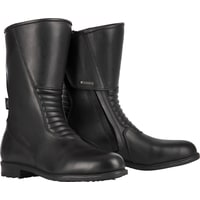                                                                                           |                                                                                           

## Modèles à 129,95 € :

 | Modèle | Photos |
|---|---|
|                                                                                           **FORMA - EAGLE**                                                                                                                                                                                        EN13634-2222 WR                                                                                            ") Modèle mixte femme/homme                                                                                             Tailles : 31, 48                                                                                                                                                                                        **Pages fabricant :**                                                                                            - [eagle-black](https://www.formabootsusa.com/collections/road-boots/products/eagle-black)                                                                                            - [eagle-brown](https://www.formabootsusa.com/collections/womens/products/eagle-brown)                                                                                                                                                                                        **Lieu de fabrication :**                                                                                            Europe :                                                                                                                                                                                        ") Roumanie                                                                                                                                                                                                                                                                                   **Caractéristiques :**                                                                                            ") Cuir                                                                                            ") Imperméable                                                                                                                                                                                        **Prix en ligne au moment de la rédaction :**                                                                                            - [129,95 € (fcmoto)](https://www.fc-moto.de/epages/fcm.sf/fr_FR/?ViewAction=FacetedSearchProducts&SearchString=FORMA+EAGLE)                                                                                            - 249,00 $ (fabricant)                                                                                            - [Rechercher (motoblouz)](https://www.motoblouz.com/recherche/FORMA+EAGLE.html)                                                                                            - [Rechercher (motardinn)](https://www.tradeinn.com/motardinn/fr?products_search%5Bquery%5D=FORMA+EAGLE)                                                                                            - [Rechercher (dafymoto)](https://www.dafy-moto.com/recherche?string=FORMA+EAGLE)                                                                                                                                                                                        **Aide à la recherche :**                                                                                            *Rechercher en occasion (~40-90 €)*                                                                                            [ Leboncoin](https://www.leboncoin.fr/recherche?text=moto+FORMA+EAGLE&shippable=1&sort=price&order=asc) [ Vinted](https://www.vinted.fr/catalog?search_text=moto+FORMA+EAGLE&order=price_low_to_high) *Recherches diverses :*                                                                                            [ Google](https://www.google.com/search?q=moto+FORMA+EAGLE) [ Youtube](https://www.youtube.com/results?search_query=moto+FORMA+EAGLE)                                                                                            |                                                                                           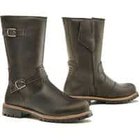                                                                                           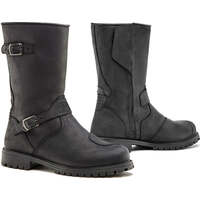                                                                                           |                                                                                           

## Modèles à 145,99 € :

 | Modèle | Photos |
|---|---|
|                                                                                           **OJ - EXPLORING**                                                                                                                                                                                        EN13634-2222 WR                                                                                            ") Modèle mixte femme/homme                                                                                             Tailles : 38, 40, 42, 44, 46, 48                                                                                                                                                                                        **Pages fabricant :**                                                                                            - [exploring-b020](https://ojworld.it/ita/calzature/stivali/exploring-b020.html)                                                                                                                                                                                        **Lieu de fabrication :**                                                                                             Inconnu                                                                                                                                                                                        **Caractéristiques :**                                                                                             (image modifiée : Tabler-icons)") Imperméable (Hipora)                                                                                                                                                                                        **Prix en ligne au moment de la rédaction :**                                                                                            - [145,99 € (motardinn)](https://www.tradeinn.com/motardinn/fr?products_search%5Bquery%5D=OJ+EXPLORING)                                                                                            - 199,99 € (fabricant)                                                                                            - [Rechercher (fcmoto)](https://www.fc-moto.de/epages/fcm.sf/fr_FR/?ViewAction=FacetedSearchProducts&SearchString=OJ+EXPLORING)                                                                                            - [Rechercher (motoblouz)](https://www.motoblouz.com/recherche/OJ+EXPLORING.html)                                                                                            - [Rechercher (dafymoto)](https://www.dafy-moto.com/recherche?string=OJ+EXPLORING)                                                                                                                                                                                        **Aide à la recherche :**                                                                                            *Rechercher en occasion (~40-100 €)*                                                                                            [ Leboncoin](https://www.leboncoin.fr/recherche?text=moto+OJ+EXPLORING&shippable=1&sort=price&order=asc) [ Vinted](https://www.vinted.fr/catalog?search_text=moto+OJ+EXPLORING&order=price_low_to_high) *Recherches diverses :*                                                                                            [ Google](https://www.google.com/search?q=moto+OJ+EXPLORING) [ Youtube](https://www.youtube.com/results?search_query=moto+OJ+EXPLORING)                                                                                            |                                                                                           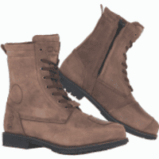                                                                                           |                                                                                           

## Modèles à 145,99 € :

 | Modèle | Photos |
|---|---|
|                                                                                           **OJ - GROUND**                                                                                                                                                                                        EN13634-2222                                                                                            ") Modèle mixte femme/homme                                                                                             Tailles : 38, 40, 42, 44, 46, 48                                                                                                                                                                                        **Pages fabricant :**                                                                                            - [ground-b021](https://ojworld.it/ita/calzature/stivali/ground-b021.html)                                                                                                                                                                                        **Lieu de fabrication :**                                                                                             Inconnu                                                                                                                                                                                        **Caractéristiques :**                                                                                             (image modifiée : Tabler-icons)") Imperméable (Hipora)                                                                                                                                                                                        **Prix en ligne au moment de la rédaction :**                                                                                            - [145,99 € (motardinn)](https://www.tradeinn.com/motardinn/fr?products_search%5Bquery%5D=OJ+GROUND)                                                                                            - 199,99 € (fabricant)                                                                                            - [Rechercher (fcmoto)](https://www.fc-moto.de/epages/fcm.sf/fr_FR/?ViewAction=FacetedSearchProducts&SearchString=OJ+GROUND)                                                                                            - [Rechercher (motoblouz)](https://www.motoblouz.com/recherche/OJ+GROUND.html)                                                                                            - [Rechercher (dafymoto)](https://www.dafy-moto.com/recherche?string=OJ+GROUND)                                                                                                                                                                                        **Aide à la recherche :**                                                                                            *Rechercher en occasion (~0-10 €)*                                                                                            [ Leboncoin](https://www.leboncoin.fr/recherche?text=moto+OJ+GROUND&shippable=1&sort=price&order=asc) [ Vinted](https://www.vinted.fr/catalog?search_text=moto+OJ+GROUND&order=price_low_to_high) *Recherches diverses :*                                                                                            [ Google](https://www.google.com/search?q=moto+OJ+GROUND) [ Youtube](https://www.youtube.com/results?search_query=moto+OJ+GROUND)                                                                                            |                                                                                                                                                                                      |                                                                                           

## Modèles à 149,99 € :

 | Modèle | Photos |
|---|---|
|                                                                                           **SEGURA - LADY CAMILLE**                                                                                                                                                                                        EN13634-2222                                                                                            ") Modèle femme                                                                                                                                                                                        **Pages fabricant :**                                                                                            - [lady-camille-sbo29-eu](https://segura-moto.com/fr_FR/products/lady-camille-sbo29-eu)                                                                                                                                                                                        **Lieu de fabrication :**                                                                                             Inconnu                                                                                                                                                                                        **Caractéristiques :**                                                                                            ") Cuir                                                                                                                                                                                        **Prix en ligne au moment de la rédaction :**                                                                                            - [149,99 € (dafymoto)](https://www.dafy-moto.com/recherche?string=SEGURA%20FEMME%2020CAMILLE)                                                                                            - [152,99 € (motoblouz)](https://pkw.motoblouz.com/?P4122157BDFF171&redir=https%3A%2F%2Fwww.motoblouz.com%2Frecherche%2FSEGURA%2520FEMME%252020CAMILLE.html)                                                                                            - [Rechercher (fcmoto)](https://www.fc-moto.de/epages/fcm.sf/fr_FR/?ViewAction=FacetedSearchProducts&SearchString=SEGURA+CAMILLE)                                                                                            - [Rechercher (motardinn)](https://www.tradeinn.com/motardinn/fr?products_search%5Bquery%5D=SEGURA+CAMILLE)                                                                                                                                                                                        **Aide à la recherche :**                                                                                            *Rechercher en occasion (~40-100 €)*                                                                                            [ Leboncoin](https://www.leboncoin.fr/recherche?text=moto+SEGURA+CAMILLE&shippable=1&sort=price&order=asc) [ Vinted](https://www.vinted.fr/catalog?search_text=moto+SEGURA+CAMILLE&order=price_low_to_high) *Recherches diverses :*                                                                                            [ Google](https://www.google.com/search?q=moto+SEGURA+CAMILLE) [ Youtube](https://www.youtube.com/results?search_query=moto+SEGURA+CAMILLE)                                                                                            |                                                                                           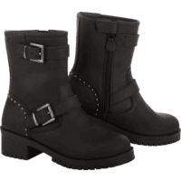                                                                                           |                                                                                           

## Modèles à 159,99 € :

 | Modèle | Photos |
|---|---|
|                                                                                           **SEGURA - LADY SALLY**                                                                                                                                                                                        EN13634-2222                                                                                            ") Modèle femme                                                                                                                                                                                        **Pages fabricant :**                                                                                            - [lady-sally-sbo34-eu](https://segura-moto.com/fr_FR/products/lady-sally-sbo34-eu)                                                                                                                                                                                        **Lieu de fabrication :**                                                                                             Inconnu                                                                                                                                                                                        **Caractéristiques :**                                                                                            ") Cuir                                                                                                                                                                                        **Prix en ligne au moment de la rédaction :**                                                                                            - [159,99 € (dafymoto)](https://www.dafy-moto.com/recherche?string=SEGURA%20FEMME%2020SALLY)                                                                                            - [161,49 € (motoblouz)](https://pkw.motoblouz.com/?P4122157BDFF171&redir=https%3A%2F%2Fwww.motoblouz.com%2Frecherche%2FSEGURA%2520FEMME%252020SALLY.html)                                                                                            - [Rechercher (fcmoto)](https://www.fc-moto.de/epages/fcm.sf/fr_FR/?ViewAction=FacetedSearchProducts&SearchString=SEGURA+SALLY)                                                                                            - [Rechercher (motardinn)](https://www.tradeinn.com/motardinn/fr?products_search%5Bquery%5D=SEGURA+SALLY)                                                                                                                                                                                        **Aide à la recherche :**                                                                                            *Rechercher en occasion (~50-110 €)*                                                                                            [ Leboncoin](https://www.leboncoin.fr/recherche?text=moto+SEGURA+SALLY&shippable=1&sort=price&order=asc) [ Vinted](https://www.vinted.fr/catalog?search_text=moto+SEGURA+SALLY&order=price_low_to_high) *Recherches diverses :*                                                                                            [ Google](https://www.google.com/search?q=moto+SEGURA+SALLY) [ Youtube](https://www.youtube.com/results?search_query=moto+SEGURA+SALLY)                                                                                            |                                                                                           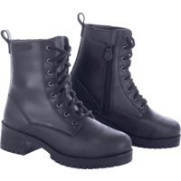                                                                                           |                                                                                           

## Modèles à 165,99 € :

 | Modèle | Photos |
|---|---|
|                                                                                           **REV-IT - FUSE H2O**                                                                                                                                                                                        EN13634-2222 WR                                                                                             (image modifiée : Tabler-icons)") Disponible en petites tailles (<40)                                                                                             Tailles : 30, 37, 38, 39, 40, 41, 42, 43, 44, 45, 46, 47, 48                                                                                                                                                                                        **Pages fabricant :**                                                                                            - [bottes-moto-fuse-h2o-noir](https://www.revitsport.com/fr_fr/bottes-moto-fuse-h2o-noir)                                                                                                                                                                                        **Lieu de fabrication :**                                                                                             Inconnu                                                                                                                                                                                        **Caractéristiques :**                                                                                            ") Imperméable                                                                                                                                                                                        **Prix en ligne au moment de la rédaction :**                                                                                            - [165,99 € (motoblouz)](https://pkw.motoblouz.com/?P4122157BDFF171&redir=https%3A%2F%2Fwww.motoblouz.com%2Frecherche%2FREV%252020IT%2520FUSE%252020H2O.html)                                                                                            - [169,99 € (dafymoto)](https://www.dafy-moto.com/recherche?string=REV%2020IT%20FUSE%2020H2O)                                                                                            - 199,99 € (fabricant)                                                                                            - [Rechercher (fcmoto)](https://www.fc-moto.de/epages/fcm.sf/fr_FR/?ViewAction=FacetedSearchProducts&SearchString=REV+IT+FUSE+H2O)                                                                                            - [Rechercher (motardinn)](https://www.tradeinn.com/motardinn/fr?products_search%5Bquery%5D=REV+IT+FUSE+H2O)                                                                                                                                                                                        **Aide à la recherche :**                                                                                            *Rechercher en occasion (~50-120 €)*                                                                                            [ Leboncoin](https://www.leboncoin.fr/recherche?text=moto+REV+IT+FUSE+H2O&shippable=1&sort=price&order=asc) [ Vinted](https://www.vinted.fr/catalog?search_text=moto+REV+IT+FUSE+H2O&order=price_low_to_high) *Recherches diverses :*                                                                                            [ Google](https://www.google.com/search?q=moto+REV+IT+FUSE+H2O) [ Youtube](https://www.youtube.com/results?search_query=moto+REV+IT+FUSE+H2O)                                                                                            |                                                                                                                                                                                      |                                                                                           

## Modèles à 166,09 € :

 | Modèle | Photos |
|---|---|
|                                                                                           **FORMA - ADVENTURE LOW**                                                                                                                                                                                        EN13634-2222 WR                                                                                            ") Modèle mixte femme/homme                                                                                             Tailles : 33, 35, 44                                                                                                                                                                                        **Pages fabricant :**                                                                                            - [adventure-low-brown](https://www.formabootsusa.com/collections/dual-sport-adv-boots/products/adventure-low-brown)                                                                                            - [adventure-low-black](https://www.formabootsusa.com/collections/dual-sport-adv-boots/products/adventure-low-black)                                                                                                                                                                                        **Lieu de fabrication :**                                                                                            Europe :                                                                                                                                                                                        ") Roumanie                                                                                                                                                                                                                                                                                   **Caractéristiques :**                                                                                            ") Cuir                                                                                            ") Imperméable                                                                                                                                                                                        **De bonnes présentations :**                                                                                            [ Youtube : RevZilla - Forma-Adventure-Boots-Review-at-RevZilla-com](https://www.youtube.com/watch?v=kZ4PE89u4zM)                                                                                            [ Article : Motoblouz - Bottes cross Forma Adventure Low, testées et validées par Paola, ...](https://www.motoblouz.com/enjoytheride/equipement-motard/22586-bottes-cross-forma-adventure-low-essai-2023-01-27)                                                                                                                                                                                        **Prix en ligne au moment de la rédaction :**                                                                                            - [166,09 € (motoblouz)](https://pkw.motoblouz.com/?P4122157BDFF171&redir=https%3A%2F%2Fwww.motoblouz.com%2Frecherche%2FFORMA%2520ADVENTURE%252020LOW.html)                                                                                            - [183,89 € (dafymoto)](https://www.dafy-moto.com/recherche?string=FORMA%20ADVENTURE%2020LOW)                                                                                            - 249,00 $ (fabricant)                                                                                            - [Rechercher (fcmoto)](https://www.fc-moto.de/epages/fcm.sf/fr_FR/?ViewAction=FacetedSearchProducts&SearchString=FORMA+ADVENTURE+LOW)                                                                                            - [Rechercher (motardinn)](https://www.tradeinn.com/motardinn/fr?products_search%5Bquery%5D=FORMA+ADVENTURE+LOW)                                                                                                                                                                                        **Aide à la recherche :**                                                                                            *Rechercher en occasion (~50-120 €)*                                                                                            [ Leboncoin](https://www.leboncoin.fr/recherche?text=moto+FORMA+ADVENTURE+LOW&shippable=1&sort=price&order=asc) [ Vinted](https://www.vinted.fr/catalog?search_text=moto+FORMA+ADVENTURE+LOW&order=price_low_to_high) *Recherches diverses :*                                                                                            [ Google](https://www.google.com/search?q=moto+FORMA+ADVENTURE+LOW) [ Youtube](https://www.youtube.com/results?search_query=moto+FORMA+ADVENTURE+LOW)                                                                                            |                                                                                           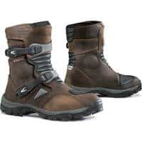                                                                                           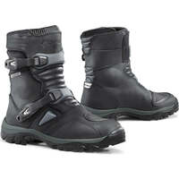                                                                                           |                                                                                           

## Modèles à 168,80 € :

 | Modèle | Photos |
|---|---|
|                                                                                           **REV-IT - MOHAWK 3**                                                                                                                                                                                        EN13634-2222                                                                                             Tailles : 30, 39, 40, 41, 42, 43, 44, 45, 46, 47                                                                                                                                                                                        **Pages fabricant :**                                                                                            - [chaussures-moto-mohawk-3-noir](https://www.revitsport.com/fr_fr/chaussures-moto-mohawk-3-noir)                                                                                            - [chaussures-moto-mohawk-3-marron-blanc](https://www.revitsport.com/fr_fr/chaussures-moto-mohawk-3-marron-blanc)                                                                                                                                                                                        **Lieu de fabrication :**                                                                                             Inconnu                                                                                                                                                                                        **Caractéristiques :**                                                                                            ") Cuir                                                                                                                                                                                        **Une bonne présentation :**                                                                                            [ Youtube : Urban-Rider - REVIT-Mohawk-3-Motorcycle-Boot-Review](https://www.youtube.com/watch?v=Lc-RmwtXcQI)                                                                                                                                                                                        **Prix en ligne au moment de la rédaction :**                                                                                            - [168,80 € (motoblouz)](https://pkw.motoblouz.com/?P4122157BDFF171&redir=https%3A%2F%2Fwww.motoblouz.com%2Frecherche%2FREV%252020IT%2520MOHAWK%2520203.html)                                                                                            - [219,99 € (dafymoto)](https://www.dafy-moto.com/recherche?string=REV%2020IT%20MOHAWK%20203)                                                                                            - 249,99 € (fabricant)                                                                                            - [Rechercher (fcmoto)](https://www.fc-moto.de/epages/fcm.sf/fr_FR/?ViewAction=FacetedSearchProducts&SearchString=REV+IT+MOHAWK+3)                                                                                            - [Rechercher (motardinn)](https://www.tradeinn.com/motardinn/fr?products_search%5Bquery%5D=REV+IT+MOHAWK+3)                                                                                                                                                                                        **Aide à la recherche :**                                                                                            *Rechercher en occasion (~50-120 €)*                                                                                            [ Leboncoin](https://www.leboncoin.fr/recherche?text=moto+REV+IT+MOHAWK+3&shippable=1&sort=price&order=asc) [ Vinted](https://www.vinted.fr/catalog?search_text=moto+REV+IT+MOHAWK+3&order=price_low_to_high) *Recherches diverses :*                                                                                            [ Google](https://www.google.com/search?q=moto+REV+IT+MOHAWK+3) [ Youtube](https://www.youtube.com/results?search_query=moto+REV+IT+MOHAWK+3)                                                                                            |                                                                                                                                                                                      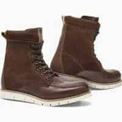                                                                                           |                                                                                           

## Modèles à 169,74 € :

 | Modèle | Photos |
|---|---|
|                                                                                           **FORMA - JASPER**                                                                                                                                                                                        EN13634-2222 WR                                                                                            ") Modèle homme                                                                                             Tailles : 43                                                                                                                                                                                        **Pages fabricant :**                                                                                            - [jasper](https://www.formabootsusa.com/collections/road-boots/products/jasper)                                                                                                                                                                                        **Lieu de fabrication :**                                                                                            Europe :                                                                                                                                                                                        ") Roumanie                                                                                                                                                                                                                                                                                   **Caractéristiques :**                                                                                            ") Cuir                                                                                            ") Imperméable                                                                                                                                                                                        **Prix en ligne au moment de la rédaction :**                                                                                            - [169,74 € (motoblouz)](https://pkw.motoblouz.com/?P4122157BDFF171&redir=https%3A%2F%2Fwww.motoblouz.com%2Frecherche%2FFORMA%2520JASPER.html)                                                                                            - [174,59 € (dafymoto)](https://www.dafy-moto.com/recherche?string=FORMA%20JASPER)                                                                                            - [197,90 € (fcmoto)](https://www.fc-moto.de/epages/fcm.sf/fr_FR/?ViewAction=FacetedSearchProducts&SearchString=FORMA+JASPER)                                                                                            - 249,00 $ (fabricant)                                                                                            - [Rechercher (motardinn)](https://www.tradeinn.com/motardinn/fr?products_search%5Bquery%5D=FORMA+JASPER)                                                                                                                                                                                        **Aide à la recherche :**                                                                                            *Rechercher en occasion (~50-120 €)*                                                                                            [ Leboncoin](https://www.leboncoin.fr/recherche?text=moto+FORMA+JASPER&shippable=1&sort=price&order=asc) [ Vinted](https://www.vinted.fr/catalog?search_text=moto+FORMA+JASPER&order=price_low_to_high) *Recherches diverses :*                                                                                            [ Google](https://www.google.com/search?q=moto+FORMA+JASPER) [ Youtube](https://www.youtube.com/results?search_query=moto+FORMA+JASPER)                                                                                            |                                                                                           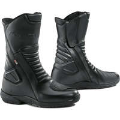                                                                                           |                                                                                           
|                                                                                           **FORMA - LEGACY**                                                                                                                                                                                        EN13634-2222 WR                                                                                            ") Modèle mixte femme/homme                                                                                             Tailles : 35, 47                                                                                                                                                                                        **Pages fabricant :**                                                                                            - [legacy](https://www.formabootsusa.com/collections/ride-urban/products/legacy)                                                                                            - [legacy-black](https://www.formabootsusa.com/collections/ride-urban/products/legacy-black)                                                                                                                                                                                        **Lieu de fabrication :**                                                                                            Europe :                                                                                                                                                                                        ") Roumanie                                                                                                                                                                                                                                                                                   **Caractéristiques :**                                                                                            ") Cuir                                                                                            ") Imperméable                                                                                                                                                                                        **Prix en ligne au moment de la rédaction :**                                                                                            - [169,74 € (motoblouz)](https://pkw.motoblouz.com/?P4122157BDFF171&redir=https%3A%2F%2Fwww.motoblouz.com%2Frecherche%2FFORMA%2520LEGACY.html)                                                                                            - [174,59 € (dafymoto)](https://www.dafy-moto.com/recherche?string=FORMA%20LEGACY)                                                                                            - [189,45 € (motardinn)](https://www.tradeinn.com/motardinn/fr?products_search%5Bquery%5D=FORMA+LEGACY)                                                                                            - [197,90 € (fcmoto)](https://www.fc-moto.de/epages/fcm.sf/fr_FR/?ViewAction=FacetedSearchProducts&SearchString=FORMA+LEGACY)                                                                                            - 249,00 $ (fabricant)                                                                                                                                                                                        **Aide à la recherche :**                                                                                            *Rechercher en occasion (~50-120 €)*                                                                                            [ Leboncoin](https://www.leboncoin.fr/recherche?text=moto+FORMA+LEGACY&shippable=1&sort=price&order=asc) [ Vinted](https://www.vinted.fr/catalog?search_text=moto+FORMA+LEGACY&order=price_low_to_high) *Recherches diverses :*                                                                                            [ Google](https://www.google.com/search?q=moto+FORMA+LEGACY) [ Youtube](https://www.youtube.com/results?search_query=moto+FORMA+LEGACY)                                                                                            |                                                                                                                                                                                      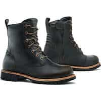                                                                                           |                                                                                           

## Modèles à 181,73 € :

 | Modèle | Photos |
|---|---|
|                                                                                           **FORMA - ADV TOURER**                                                                                                                                                                                        EN13634-2222 WR                                                                                            ") Modèle mixte femme/homme                                                                                             Tailles : 33, 35, 41                                                                                                                                                                                        **Pages fabricant :**                                                                                            - [adv-tourer-brown](https://www.formabootsusa.com/collections/dual-sport-adv-boots/products/adv-tourer-brown)                                                                                            - [adv-tourer-black](https://www.formabootsusa.com/collections/dual-sport-adv-boots/products/adv-tourer-black)                                                                                            - [adv-tourer-black](https://www.formabootsusa.com/collections/road-boots/products/adv-tourer-black)                                                                                            - [adv-tourer-brown](https://www.formabootsusa.com/collections/road-boots/products/adv-tourer-brown)                                                                                                                                                                                        **Lieu de fabrication :**                                                                                            Europe :                                                                                                                                                                                        ") Roumanie                                                                                                                                                                                                                                                                                   **Caractéristiques :**                                                                                            ") Cuir                                                                                            ") Imperméable                                                                                                                                                                                        **Une bonne présentation :**                                                                                            [ Youtube : RevZilla - Forma-ADV-Tourer-Boots-Review-at-RevZilla-com](https://www.youtube.com/watch?v=UW0SUETSMmE)                                                                                                                                                                                        **Prix en ligne au moment de la rédaction :**                                                                                            - [181,73 € (motoblouz)](https://pkw.motoblouz.com/?P4122157BDFF171&redir=https%3A%2F%2Fwww.motoblouz.com%2Frecherche%2FFORMA%2520ADV%252020TOURER.html)                                                                                            - [183,89 € (dafymoto)](https://www.dafy-moto.com/recherche?string=FORMA%20ADV%2020TOURER)                                                                                            - [206,90 € (fcmoto)](https://www.fc-moto.de/epages/fcm.sf/fr_FR/?ViewAction=FacetedSearchProducts&SearchString=FORMA+ADV+20TOURER)                                                                                            - 279,00 $ (fabricant)                                                                                            - [Rechercher (motardinn)](https://www.tradeinn.com/motardinn/fr?products_search%5Bquery%5D=FORMA+ADV+TOURER)                                                                                                                                                                                        **Aide à la recherche :**                                                                                            *Rechercher en occasion (~50-130 €)*                                                                                            [ Leboncoin](https://www.leboncoin.fr/recherche?text=moto+FORMA+ADV+TOURER&shippable=1&sort=price&order=asc) [ Vinted](https://www.vinted.fr/catalog?search_text=moto+FORMA+ADV+TOURER&order=price_low_to_high) *Recherches diverses :*                                                                                            [ Google](https://www.google.com/search?q=moto+FORMA+ADV+TOURER) [ Youtube](https://www.youtube.com/results?search_query=moto+FORMA+ADV+TOURER)                                                                                            |                                                                                                                                                                                      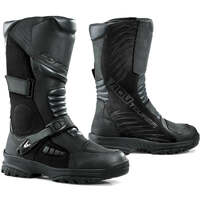                                                                                           |                                                                                           
|                                                                                           **FORMA - ADV TOURER LADY**                                                                                                                                                                                        EN13634-2222 WR                                                                                            ") Modèle femme                                                                                                                                                                                        **Pages fabricant :**                                                                                            - [adv-tourer-lady](https://www.formabootsusa.com/collections/dual-sport-adv-boots/products/adv-tourer-lady)                                                                                            - [adv-tourer-lady](https://www.formabootsusa.com/collections/womens/products/adv-tourer-lady)                                                                                                                                                                                        **Lieu de fabrication :**                                                                                            Europe :                                                                                                                                                                                        ") Roumanie                                                                                                                                                                                                                                                                                   **Caractéristiques :**                                                                                            ") Cuir                                                                                            ") Imperméable                                                                                                                                                                                        **De bonnes présentations :**                                                                                            [ Youtube : RevZilla - Forma-ADV-Tourer-Women-s-Boots-Review](https://www.youtube.com/watch?v=g2N76ldvZ8s)                                                                                            [ Article : Motoblouz - Essai des bottes Forma ADV Tourer pour femmes](https://www.motoblouz.com/enjoytheride/bottes-chaussures-moto/19912-bottes-forma-adv-tourer-essai-2020-11-03)                                                                                                                                                                                        **Prix en ligne au moment de la rédaction :**                                                                                            - [181,73 € (motoblouz)](https://pkw.motoblouz.com/?P4122157BDFF171&redir=https%3A%2F%2Fwww.motoblouz.com%2Frecherche%2FFORMA%2520ADV%252020TOURER%252020FEMME.html)                                                                                            - [183,89 € (dafymoto)](https://www.dafy-moto.com/recherche?string=FORMA%20ADV%2020TOURER%2020FEMME)                                                                                            - [206,90 € (fcmoto)](https://www.fc-moto.de/epages/fcm.sf/fr_FR/?ViewAction=FacetedSearchProducts&SearchString=FORMA+ADV+20TOURER+20DAMES)                                                                                            - 279,00 $ (fabricant)                                                                                            - [Rechercher (motardinn)](https://www.tradeinn.com/motardinn/fr?products_search%5Bquery%5D=FORMA+ADV+TOURER)                                                                                                                                                                                        **Aide à la recherche :**                                                                                            *Rechercher en occasion (~50-130 €)*                                                                                            [ Leboncoin](https://www.leboncoin.fr/recherche?text=moto+FORMA+ADV+TOURER&shippable=1&sort=price&order=asc) [ Vinted](https://www.vinted.fr/catalog?search_text=moto+FORMA+ADV+TOURER&order=price_low_to_high) *Recherches diverses :*                                                                                            [ Google](https://www.google.com/search?q=moto+FORMA+ADV+TOURER) [ Youtube](https://www.youtube.com/results?search_query=moto+FORMA+ADV+TOURER)                                                                                            |                                                                                                                                                                                      |                                                                                           

## Modèles à 182,66 € :

 | Modèle | Photos |
|---|---|
|                                                                                           **FORMA - BOULDER**                                                                                                                                                                                        EN13634-2222                                                                                            ") Modèle mixte femme/homme                                                                                             Tailles : 30, 37, 38                                                                                            ") Eté                                                                                                                                                                                        **Pages fabricant :**                                                                                            - [copy-of-boulder](https://www.formabootsusa.com/collections/dual-sport-adv-boots/products/copy-of-boulder)                                                                                            - [boulder-black](https://www.formabootsusa.com/collections/dual-sport-adv-boots/products/boulder-black)                                                                                            - [copy-of-boulder-1](https://www.formabootsusa.com/collections/dual-sport-adv-boots/products/copy-of-boulder-1)                                                                                            - [copy-of-boulder](https://www.formabootsusa.com/collections/off-road-boots/products/copy-of-boulder)                                                                                            - [boulder-black](https://www.formabootsusa.com/collections/off-road-boots/products/boulder-black)                                                                                            - [copy-of-boulder-1](https://www.formabootsusa.com/collections/off-road-boots/products/copy-of-boulder-1)                                                                                                                                                                                        **Lieu de fabrication :**                                                                                            Europe :                                                                                                                                                                                        ") Roumanie                                                                                                                                                                                                                                                                                   **Caractéristiques :**                                                                                            ") Cuir                                                                                            ") Respirant                                                                                                                                                                                        **Une bonne présentation :**                                                                                            [ Youtube : RevZilla - Forma-Boulder-Boots-Review-at-RevZilla-com](https://www.youtube.com/watch?v=695gLEpDgfo)                                                                                                                                                                                        **Prix en ligne au moment de la rédaction :**                                                                                            - [182,66 € (motoblouz)](https://pkw.motoblouz.com/?P4122157BDFF171&redir=https%3A%2F%2Fwww.motoblouz.com%2Frecherche%2FFORMA%2520BOULDER.html)                                                                                            - [215,44 € (motardinn)](https://www.tradeinn.com/motardinn/fr?products_search%5Bquery%5D=FORMA+BOULDER)                                                                                            - [216,44 € (dafymoto)](https://www.dafy-moto.com/recherche?string=FORMA%20BOULDER)                                                                                            - [238,00 € (fcmoto)](https://www.fc-moto.de/epages/fcm.sf/fr_FR/?ViewAction=FacetedSearchProducts&SearchString=FORMA+BOULDER)                                                                                            - 299,00 $ (fabricant)                                                                                                                                                                                        **Aide à la recherche :**                                                                                            *Rechercher en occasion (~50-130 €)*                                                                                            [ Leboncoin](https://www.leboncoin.fr/recherche?text=moto+FORMA+BOULDER&shippable=1&sort=price&order=asc) [ Vinted](https://www.vinted.fr/catalog?search_text=moto+FORMA+BOULDER&order=price_low_to_high) *Recherches diverses :*                                                                                            [ Google](https://www.google.com/search?q=moto+FORMA+BOULDER) [ Youtube](https://www.youtube.com/results?search_query=moto+FORMA+BOULDER)                                                                                            |                                                                                                                                                                                                                                                                                 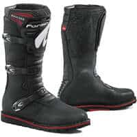                                                                                           |                                                                                           

## Modèles à 182,59 € :

 | Modèle | Photos |
|---|---|
|                                                                                           **REV-IT - FLUX H2O**                                                                                                                                                                                        EN13634-2222 WR                                                                                             (image modifiée : Tabler-icons)") Disponible en petites tailles (<40)                                                                                             Tailles : 30, 37, 38, 39, 40, 41, 42, 43, 44, 45, 46, 47, 48                                                                                                                                                                                        **Pages fabricant :**                                                                                            - [bottes-moto-flux-h2o-noir](https://www.revitsport.com/fr_fr/bottes-moto-flux-h2o-noir)                                                                                                                                                                                        **Lieu de fabrication :**                                                                                             Inconnu                                                                                                                                                                                        **Caractéristiques :**                                                                                            ") Imperméable                                                                                                                                                                                        **Une bonne présentation :**                                                                                            [ Youtube : Français-Champion-Helmets - Revit-Flux-H2O-Bottes-Revue-ChampionHelmets-com](https://www.youtube.com/watch?v=5kc7aTfCjhQ)                                                                                                                                                                                        **Prix en ligne au moment de la rédaction :**                                                                                            - [182,59 € (motoblouz)](https://pkw.motoblouz.com/?P4122157BDFF171&redir=https%3A%2F%2Fwww.motoblouz.com%2Frecherche%2FREV%252020IT%2520FLUX%252020H2O.html)                                                                                            - [189,99 € (dafymoto)](https://www.dafy-moto.com/recherche?string=REV%2020IT%20FLUX%2020H2O)                                                                                            - 219,99 € (fabricant)                                                                                            - [Rechercher (fcmoto)](https://www.fc-moto.de/epages/fcm.sf/fr_FR/?ViewAction=FacetedSearchProducts&SearchString=REV+IT+FLUX+H2O)                                                                                            - [Rechercher (motardinn)](https://www.tradeinn.com/motardinn/fr?products_search%5Bquery%5D=REV+IT+FLUX+H2O)                                                                                                                                                                                        **Aide à la recherche :**                                                                                            *Rechercher en occasion (~50-130 €)*                                                                                            [ Leboncoin](https://www.leboncoin.fr/recherche?text=moto+REV+IT+FLUX+H2O&shippable=1&sort=price&order=asc) [ Vinted](https://www.vinted.fr/catalog?search_text=moto+REV+IT+FLUX+H2O&order=price_low_to_high) *Recherches diverses :*                                                                                            [ Google](https://www.google.com/search?q=moto+REV+IT+FLUX+H2O) [ Youtube](https://www.youtube.com/results?search_query=moto+REV+IT+FLUX+H2O)                                                                                            |                                                                                           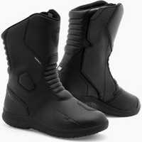                                                                                           |                                                                                           

## Modèles à 183,89 € :

 | Modèle | Photos |
|---|---|
|                                                                                           **FORMA - ADVENTURE**                                                                                                                                                                                        EN13634-2222 WR                                                                                            ") Modèle mixte femme/homme                                                                                             Tailles : 30, 34, 44, 46                                                                                                                                                                                        **Pages fabricant :**                                                                                            - [adventure-brown](https://www.formabootsusa.com/collections/dual-sport-adv-boots/products/adventure-brown)                                                                                            - [adventure-black](https://www.formabootsusa.com/collections/dual-sport-adv-boots/products/adventure-black)                                                                                                                                                                                        **Lieu de fabrication :**                                                                                            Europe :                                                                                                                                                                                        ") Roumanie                                                                                                                                                                                                                                                                                   **Caractéristiques :**                                                                                            ") Cuir                                                                                            ") Imperméable                                                                                                                                                                                        **De bonnes présentations :**                                                                                            [ Youtube : RevZilla - Forma-Adventure-Boots-Review-at-RevZilla-com](https://www.youtube.com/watch?v=kZ4PE89u4zM)                                                                                            [ Article : Motoblouz - Vidéo : Essai bottes dual sports Forma Adventure](https://www.motoblouz.com/enjoytheride/equipement-motard/9626-botte-forma-adventure-avis-video-2016-11-24)                                                                                                                                                                                                                                                                                   **Prix en ligne au moment de la rédaction :**                                                                                            - [183,89 € (dafymoto)](https://www.dafy-moto.com/recherche?string=FORMA%20ADVENTURE)                                                                                            - [186,92 € (motoblouz)](https://pkw.motoblouz.com/?P4122157BDFF171&redir=https%3A%2F%2Fwww.motoblouz.com%2Frecherche%2FFORMA%2520ADVENTURE.html)                                                                                            - [219,61 € (motardinn)](https://www.tradeinn.com/motardinn/fr?products_search%5Bquery%5D=FORMA+ADVENTURE)                                                                                            - [223,92 € (fcmoto)](https://www.fc-moto.de/epages/fcm.sf/fr_FR/?ViewAction=FacetedSearchProducts&SearchString=FORMA+ADVENTURE)                                                                                            - 299,00 $ (fabricant)                                                                                                                                                                                        **Aide à la recherche :**                                                                                            *Rechercher en occasion (~50-130 €)*                                                                                            [ Leboncoin](https://www.leboncoin.fr/recherche?text=moto+FORMA+ADVENTURE&shippable=1&sort=price&order=asc) [ Vinted](https://www.vinted.fr/catalog?search_text=moto+FORMA+ADVENTURE&order=price_low_to_high) *Recherches diverses :*                                                                                            [ Google](https://www.google.com/search?q=moto+FORMA+ADVENTURE) [ Youtube](https://www.youtube.com/results?search_query=moto+FORMA+ADVENTURE)                                                                                            |                                                                                           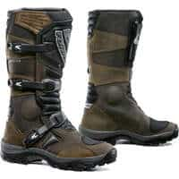                                                                                           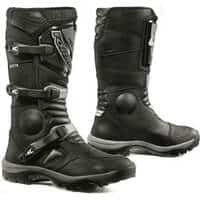                                                                                           |                                                                                           

## Modèles à 189,95 £ :

 | Modèle | Photos |
|---|---|
|                                                                                           **RST - ADVENTURE X MENS**                                                                                                                                                                                        EN13634-2222                                                                                            ") Modèle homme                                                                                            ") Eté                                                                                                                                                                                        **Pages fabricant :**                                                                                            - [adventure-x-ce-mens-waterproof-boot](https://www.rst-moto.com/products/adventure-x-ce-mens-waterproof-boot)                                                                                                                                                                                        **Lieu de fabrication :**                                                                                             Inconnu                                                                                                                                                                                        **Caractéristiques :**                                                                                            ") Respirant                                                                                            ") Imperméable                                                                                              **Prix en ligne au moment de la rédaction :**                                                                                            - 189,95 £ (fabricant)                                                                                            - [Rechercher (fcmoto)](https://www.fc-moto.de/epages/fcm.sf/fr_FR/?ViewAction=FacetedSearchProducts&SearchString=RST+ADVENTURE+X)                                                                                            - [Rechercher (motoblouz)](https://www.motoblouz.com/recherche/RST+ADVENTURE+X.html)                                                                                            - [Rechercher (motardinn)](https://www.tradeinn.com/motardinn/fr?products_search%5Bquery%5D=RST+ADVENTURE+X)                                                                                            - [Rechercher (dafymoto)](https://www.dafy-moto.com/recherche?string=RST+ADVENTURE+X)                                                                                                                                                                                        **Aide à la recherche :**                                                                                            *Rechercher en occasion (~60-130 €)*                                                                                            [ Leboncoin](https://www.leboncoin.fr/recherche?text=moto+RST+ADVENTURE+X&shippable=1&sort=price&order=asc) [ Vinted](https://www.vinted.fr/catalog?search_text=moto+RST+ADVENTURE+X&order=price_low_to_high) *Recherches diverses :*                                                                                            [ Google](https://www.google.com/search?q=moto+RST+ADVENTURE+X) [ Youtube](https://www.youtube.com/results?search_query=moto+RST+ADVENTURE+X)                                                                                            |                                                                                                                                                                                      |                                                                                           

## Modèles à 190,89 € :

 | Modèle | Photos |
|---|---|
|                                                                                           **REV-IT - PORTLAND LADIES**                                                                                                                                                                                        EN13634-2222                                                                                            ") Modèle femme                                                                                             Tailles : 30, 36, 37, 38, 39, 40, 41, 42                                                                                                                                                                                        **Pages fabricant :**                                                                                            - [chaussures-moto-portland-ladies-noir](https://www.revitsport.com/fr_fr/chaussures-moto-portland-ladies-noir)                                                                                            - [chaussures-moto-portland-ladies-verte-olive-noir](https://www.revitsport.com/fr_fr/chaussures-moto-portland-ladies-verte-olive-noir)                                                                                                                                                                                        **Lieu de fabrication :**                                                                                             Inconnu                                                                                                                                                                                        **De bonnes présentations :**                                                                                            [ Youtube : Urban-Rider - REVIT-Portland-Boot-Review](https://www.youtube.com/watch?v=m6BsYNTnd4k)                                                                                            [ Youtube : Urban-Rider - Top-5-Urban-Motorcycle-Boots-2022](https://www.youtube.com/watch?v=OzsGF3ItDMc)                                                                                            [ Youtube : RevZilla - REV-IT-Portland-Women-s-Shoes-Review](https://www.youtube.com/watch?v=Wy4gTDyDybo)                                                                                                                                                                                        **Prix en ligne au moment de la rédaction :**                                                                                            - [190,89 € (motoblouz)](https://pkw.motoblouz.com/?P4122157BDFF171&redir=https%3A%2F%2Fwww.motoblouz.com%2Frecherche%2FREV%252020IT%2520PORTLAND%252020FEMME.html)                                                                                            - [209,99 € (dafymoto)](https://www.dafy-moto.com/recherche?string=REV%2020IT%20PORTLAND%2020FEMME)                                                                                            - 239,99 € (fabricant)                                                                                            - [Rechercher (fcmoto)](https://www.fc-moto.de/epages/fcm.sf/fr_FR/?ViewAction=FacetedSearchProducts&SearchString=REV+IT+PORTLAND)                                                                                            - [Rechercher (motardinn)](https://www.tradeinn.com/motardinn/fr?products_search%5Bquery%5D=REV+IT+PORTLAND)                                                                                                                                                                                        **Aide à la recherche :**                                                                                            *Rechercher en occasion (~60-130 €)*                                                                                            [ Leboncoin](https://www.leboncoin.fr/recherche?text=moto+REV+IT+PORTLAND&shippable=1&sort=price&order=asc) [ Vinted](https://www.vinted.fr/catalog?search_text=moto+REV+IT+PORTLAND&order=price_low_to_high) *Recherches diverses :*                                                                                            [ Google](https://www.google.com/search?q=moto+REV+IT+PORTLAND) [ Youtube](https://www.youtube.com/results?search_query=moto+REV+IT+PORTLAND)                                                                                            |                                                                                                                                                                                                                                                                                 |                                                                                           

## Modèles à 209,99 € :

 | Modèle | Photos |
|---|---|
|                                                                                           **REV-IT - PULSE H2O**                                                                                                                                                                                        EN13634-2222 WR                                                                                             (image modifiée : Tabler-icons)") Disponible en petites tailles (<40)                                                                                             Tailles : 30, 37, 38, 39, 40, 41, 42, 43, 44, 45, 46, 47, 48                                                                                                                                                                                        **Pages fabricant :**                                                                                            - [bottes-moto-pulse-h2o-noir](https://www.revitsport.com/fr_fr/bottes-moto-pulse-h2o-noir)                                                                                                                                                                                        **Lieu de fabrication :**                                                                                             Inconnu                                                                                                                                                                                        **Caractéristiques :**                                                                                            ") Imperméable                                                                                                                                                                                        **Prix en ligne au moment de la rédaction :**                                                                                            - [209,99 € (dafymoto)](https://www.dafy-moto.com/recherche?string=REV%2020IT%20PULSE%2020H2O)                                                                                            - [215,95 € (fcmoto)](https://www.fc-moto.de/epages/fcm.sf/fr_FR/?ViewAction=FacetedSearchProducts&SearchString=REV+20IT+PULSE+20H2O)                                                                                            - [239,99 € (motoblouz)](https://pkw.motoblouz.com/?P4122157BDFF171&redir=https%3A%2F%2Fwww.motoblouz.com%2Frecherche%2FREV%252020IT%2520PULSE%252020H2O.html)                                                                                            - 239,99 € (fabricant)                                                                                            - [Rechercher (motardinn)](https://www.tradeinn.com/motardinn/fr?products_search%5Bquery%5D=REV+IT+PULSE+H2O)                                                                                                                                                                                        **Aide à la recherche :**                                                                                            *Rechercher en occasion (~60-150 €)*                                                                                            [ Leboncoin](https://www.leboncoin.fr/recherche?text=moto+REV+IT+PULSE+H2O&shippable=1&sort=price&order=asc) [ Vinted](https://www.vinted.fr/catalog?search_text=moto+REV+IT+PULSE+H2O&order=price_low_to_high) *Recherches diverses :*                                                                                            [ Google](https://www.google.com/search?q=moto+REV+IT+PULSE+H2O) [ Youtube](https://www.youtube.com/results?search_query=moto+REV+IT+PULSE+H2O)                                                                                            |                                                                                           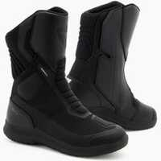                                                                                           |                                                                                           

## Modèles à 210,39 € :

 | Modèle | Photos |
|---|---|
|                                                                                           **FORMA - BOULDER COMP**                                                                                                                                                                                        EN13634-2222                                                                                            ") Modèle homme                                                                                             Tailles : 31                                                                                            ") Eté                                                                                                                                                                                        **Pages fabricant :**                                                                                            - [boulder-comp](https://www.formabootsusa.com/collections/off-road-boots/products/boulder-comp)                                                                                                                                                                                        **Lieu de fabrication :**                                                                                            Europe :                                                                                                                                                                                        ") Roumanie                                                                                                                                                                                                                                                                                   **Caractéristiques :**                                                                                            ") Cuir                                                                                            ") Respirant                                                                                                                                                                                        **Prix en ligne au moment de la rédaction :**                                                                                            - [210,39 € (dafymoto)](https://www.dafy-moto.com/recherche?string=FORMA%20BOULDER%2020COMP)                                                                                            - [214,11 € (motoblouz)](https://pkw.motoblouz.com/?P4122157BDFF171&redir=https%3A%2F%2Fwww.motoblouz.com%2Frecherche%2FFORMA%2520BOULDER%252020COMP.html)                                                                                            - 299,00 $ (fabricant)                                                                                            - [Rechercher (fcmoto)](https://www.fc-moto.de/epages/fcm.sf/fr_FR/?ViewAction=FacetedSearchProducts&SearchString=FORMA+BOULDER+COMP)                                                                                            - [Rechercher (motardinn)](https://www.tradeinn.com/motardinn/fr?products_search%5Bquery%5D=FORMA+BOULDER+COMP)                                                                                                                                                                                        **Aide à la recherche :**                                                                                            *Rechercher en occasion (~60-150 €)*                                                                                            [ Leboncoin](https://www.leboncoin.fr/recherche?text=moto+FORMA+BOULDER+COMP&shippable=1&sort=price&order=asc) [ Vinted](https://www.vinted.fr/catalog?search_text=moto+FORMA+BOULDER+COMP&order=price_low_to_high) *Recherches diverses :*                                                                                            [ Google](https://www.google.com/search?q=moto+FORMA+BOULDER+COMP) [ Youtube](https://www.youtube.com/results?search_query=moto+FORMA+BOULDER+COMP)                                                                                            |                                                                                           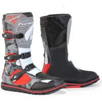                                                                                           |                                                                                           

## Modèles à 219,99 € :

 | Modèle | Photos |
|---|---|
|                                                                                           **REV-IT - LINK GTX**                                                                                                                                                                                        EN13634-2222 WR                                                                                             (image modifiée : Tabler-icons)") Disponible en petites tailles (<40)                                                                                             Tailles : 30, 37, 38, 39, 40, 41, 42, 43, 44, 45, 46, 47, 48                                                                                            ") Eté                                                                                                                                                                                        **Pages fabricant :**                                                                                            - [bottes-moto-link-gtx-noir](https://www.revitsport.com/fr_fr/bottes-moto-link-gtx-noir)                                                                                                                                                                                        **Lieu de fabrication :**                                                                                             Inconnu                                                                                                                                                                                        **Caractéristiques :**                                                                                            ") Cuir                                                                                            ") Respirant                                                                                             (image modifiée : Tabler-icons)") Imperméable (Gore-Tex)                                                                                                                                                                                        **Une bonne présentation :**                                                                                            [ Youtube : Français-Champion-Helmets - Revit-Link-GTX-Bottes-Revue-ChampionHelmets-com](https://www.youtube.com/watch?v=XcMT-NEoqB8)                                                                                                                                                                                        **Prix en ligne au moment de la rédaction :**                                                                                            - [219,99 € (dafymoto)](https://www.dafy-moto.com/recherche?string=REV%2020IT%20LINK%2020GTX)                                                                                            - [224,09 € (motoblouz)](https://pkw.motoblouz.com/?P4122157BDFF171&redir=https%3A%2F%2Fwww.motoblouz.com%2Frecherche%2FREV%252020IT%2520LINK%252020GTX.html)                                                                                            - [242,95 € (fcmoto)](https://www.fc-moto.de/epages/fcm.sf/fr_FR/?ViewAction=FacetedSearchProducts&SearchString=REV+20IT+LINK+20GTX)                                                                                            - 269,99 € (fabricant)                                                                                            - [Rechercher (motardinn)](https://www.tradeinn.com/motardinn/fr?products_search%5Bquery%5D=REV+IT+LINK)                                                                                                                                                                                        **Aide à la recherche :**                                                                                            *Rechercher en occasion (~70-150 €)*                                                                                            [ Leboncoin](https://www.leboncoin.fr/recherche?text=moto+REV+IT+LINK&shippable=1&sort=price&order=asc) [ Vinted](https://www.vinted.fr/catalog?search_text=moto+REV+IT+LINK&order=price_low_to_high) *Recherches diverses :*                                                                                            [ Google](https://www.google.com/search?q=moto+REV+IT+LINK) [ Youtube](https://www.youtube.com/results?search_query=moto+REV+IT+LINK)                                                                                            |                                                                                           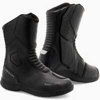                                                                                           |                                                                                           
|                                                                                           **REV-IT - PORTLAND**                                                                                                                                                                                        EN13634-2222                                                                                             Tailles : 30, 39, 40, 41, 42, 43, 44, 45, 46, 47                                                                                                                                                                                        **Pages fabricant :**                                                                                            - [chaussures-moto-portland-noir](https://www.revitsport.com/fr_fr/chaussures-moto-portland-noir)                                                                                            - [chaussures-moto-portland-verte-olive-noir](https://www.revitsport.com/fr_fr/chaussures-moto-portland-verte-olive-noir)                                                                                                                                                                                        **Lieu de fabrication :**                                                                                             Inconnu                                                                                                                                                                                        **Caractéristiques :**                                                                                            ") Cuir                                                                                                                                                                                        **De bonnes présentations :**                                                                                            [ Youtube : FortNine - Best-Retro-Motorcycle-Gear-of-2017](https://www.youtube.com/watch?v=7AtuOM7hizQ)                                                                                            [ Youtube : Urban-Rider - REVIT-Portland-Boot-Review](https://www.youtube.com/watch?v=m6BsYNTnd4k)                                                                                            [ Youtube : Urban-Rider - Top-5-Urban-Motorcycle-Boots-2022](https://www.youtube.com/watch?v=OzsGF3ItDMc)                                                                                                                                                                                        **Prix en ligne au moment de la rédaction :**                                                                                            - [219,99 € (dafymoto)](https://www.dafy-moto.com/recherche?string=REV%2020IT%20PORTLAND)                                                                                            - [224,02 € (motoblouz)](https://pkw.motoblouz.com/?P4122157BDFF171&redir=https%3A%2F%2Fwww.motoblouz.com%2Frecherche%2FREV%252020IT%2520PORTLAND.html)                                                                                            - 269,99 € (fabricant)                                                                                            - [Rechercher (fcmoto)](https://www.fc-moto.de/epages/fcm.sf/fr_FR/?ViewAction=FacetedSearchProducts&SearchString=REV+IT+PORTLAND)                                                                                            - [Rechercher (motardinn)](https://www.tradeinn.com/motardinn/fr?products_search%5Bquery%5D=REV+IT+PORTLAND)                                                                                                                                                                                        **Aide à la recherche :**                                                                                            *Rechercher en occasion (~70-150 €)*                                                                                            [ Leboncoin](https://www.leboncoin.fr/recherche?text=moto+REV+IT+PORTLAND&shippable=1&sort=price&order=asc) [ Vinted](https://www.vinted.fr/catalog?search_text=moto+REV+IT+PORTLAND&order=price_low_to_high) *Recherches diverses :*                                                                                            [ Google](https://www.google.com/search?q=moto+REV+IT+PORTLAND) [ Youtube](https://www.youtube.com/results?search_query=moto+REV+IT+PORTLAND)                                                                                            |                                                                                                                                                                                                                                                                                 |                                                                                           

## Modèles à 242,90 € :

 | Modèle | Photos |
|---|---|
|                                                                                           **FORMA - TERRA EVO LOW**                                                                                                                                                                                        EN13634-2222 WR                                                                                            ") Modèle mixte femme/homme                                                                                             Tailles : 30, 35, 38, 45, 46                                                                                                                                                                                        **Pages fabricant :**                                                                                            - [terra-evo-low-brown](https://www.formabootsusa.com/collections/dual-sport-adv-boots/products/terra-evo-low-brown)                                                                                            - [terra-evo-low-black](https://www.formabootsusa.com/collections/dual-sport-adv-boots/products/terra-evo-low-black)                                                                                            - [terra-evo-low-black](https://www.formabootsusa.com/collections/off-road-boots/products/terra-evo-low-black)                                                                                            - [terra-evo-low-brown](https://www.formabootsusa.com/collections/off-road-boots/products/terra-evo-low-brown)                                                                                                                                                                                        **Lieu de fabrication :**                                                                                            Europe :                                                                                                                                                                                        ") Roumanie                                                                                                                                                                                                                                                                                   **Caractéristiques :**                                                                                            ") Cuir                                                                                            ") Imperméable                                                                                                                                                                                        **De bonnes présentations :**                                                                                            [ Youtube : RevZilla - Forma-Terra-EVO-EVO-Low-Boots-Review](https://www.youtube.com/watch?v=a-1NCfGEtyk)                                                                                            [ Article : Motostation - Test Forma Terra Evo Low WP : demi bottes, full tout terrain](https://moto-station.com/moto-revue/test-equipement/test-forma-terra-evo-low-wp-demi-bottes-full-tout-terrain/505470)                                                                                                                                                                                        **Prix en ligne au moment de la rédaction :**                                                                                            - [242,90 € (fcmoto)](https://www.fc-moto.de/epages/fcm.sf/fr_FR/?ViewAction=FacetedSearchProducts&SearchString=FORMA+TERRA+20EVO+20LOW)                                                                                            - [256,89 € (dafymoto)](https://www.dafy-moto.com/recherche?string=FORMA%20TERRA%2020EVO%2020LOW)                                                                                            - 299,00 $ (fabricant)                                                                                            - [Rechercher (motoblouz)](https://www.motoblouz.com/recherche/FORMA+TERRA+EVO+LOW.html)                                                                                            - [Rechercher (motardinn)](https://www.tradeinn.com/motardinn/fr?products_search%5Bquery%5D=FORMA+TERRA+EVO+LOW)                                                                                                                                                                                        **Aide à la recherche :**                                                                                            *Rechercher en occasion (~70-170 €)*                                                                                            [ Leboncoin](https://www.leboncoin.fr/recherche?text=moto+FORMA+TERRA+EVO+LOW&shippable=1&sort=price&order=asc) [ Vinted](https://www.vinted.fr/catalog?search_text=moto+FORMA+TERRA+EVO+LOW&order=price_low_to_high) *Recherches diverses :*                                                                                            [ Google](https://www.google.com/search?q=moto+FORMA+TERRA+EVO+LOW) [ Youtube](https://www.youtube.com/results?search_query=moto+FORMA+TERRA+EVO+LOW)                                                                                            |                                                                                                                                                                                                                                                                                 |                                                                                           

## Modèles à 329,99 € :

 | Modèle | Photos |
|---|---|
|                                                                                           **REV-IT - PIONEER GTX**                                                                                                                                                                                        EN13634-2222 WR                                                                                             (image modifiée : Tabler-icons)") Disponible en petites tailles (<40)                                                                                             Tailles : 30, 38, 39, 40, 41, 42, 43, 44, 45, 46, 47                                                                                                                                                                                        **Pages fabricant :**                                                                                            - [bottes-moto-pioneer-gtx-noir](https://www.revitsport.com/fr_fr/bottes-moto-pioneer-gtx-noir)                                                                                                                                                                                        **Lieu de fabrication :**                                                                                             Inconnu                                                                                                                                                                                        **Caractéristiques :**                                                                                             (image modifiée : Tabler-icons)") Imperméable (Gore-Tex)                                                                                                                                                                                        **De bonnes présentations :**                                                                                            [ Youtube : RevZilla - REV-IT-Pioneer-GTX-Boots-Review](https://www.youtube.com/watch?v=hGaVIYGloDE)                                                                                            [ Youtube : Champion-Helmets - Revit-Pioneer-GTX-Boots-ChampionHelmets-com](https://www.youtube.com/watch?v=YKvUP8WrhnE)                                                                                            [ Youtube : Français-Champion-Helmets - Revit-Pioneer-GTX-Bottes-Revue-ChampionHelmets-com](https://www.youtube.com/watch?v=ReVrTf2bVIM)                                                                                            [ Article : Motostation - Test longue durée : bottines Rev’it! Pioneer GTX, les aventurières](https://moto-station.com/moto-revue/test-equipement/test-longue-duree-bottines-revit-pioneer-gtx-les-aventurieres/533854)                                                                                                                                                                                        **Prix en ligne au moment de la rédaction :**                                                                                            - [329,99 € (dafymoto)](https://www.dafy-moto.com/recherche?string=REV%2020IT%20PIONEER%2020GTX)                                                                                            - 399,99 € (fabricant)                                                                                            - [Rechercher (fcmoto)](https://www.fc-moto.de/epages/fcm.sf/fr_FR/?ViewAction=FacetedSearchProducts&SearchString=REV+IT+PIONEER)                                                                                            - [Rechercher (motoblouz)](https://www.motoblouz.com/recherche/REV+IT+PIONEER.html)                                                                                            - [Rechercher (motardinn)](https://www.tradeinn.com/motardinn/fr?products_search%5Bquery%5D=REV+IT+PIONEER)                                                                                                                                                                                        **Aide à la recherche :**                                                                                            *Rechercher en occasion (~100-230 €)*                                                                                            [ Leboncoin](https://www.leboncoin.fr/recherche?text=moto+REV+IT+PIONEER&shippable=1&sort=price&order=asc) [ Vinted](https://www.vinted.fr/catalog?search_text=moto+REV+IT+PIONEER&order=price_low_to_high) *Recherches diverses :*                                                                                            [ Google](https://www.google.com/search?q=moto+REV+IT+PIONEER) [ Youtube](https://www.youtube.com/results?search_query=moto+REV+IT+PIONEER)                                                                                            |                                                                                                                                                                                      |                                                                                           

## Modèles à 340,38 € :

 | Modèle | Photos |
|---|---|
|                                                                                           **FORMA - PREDATOR 2 0**                                                                                                                                                                                        EN13634-2222                                                                                            ") Modèle homme                                                                                             (image modifiée : Tabler-icons)") Disponible en petites tailles (<40)                                                                                             Tailles : 30, 34, 36, 37, 42, 45, 47, 48                                                                                                                                                                                        **Pages fabricant :**                                                                                            - [predator-2-0-white-blue-red](https://www.formabootsusa.com/collections/off-road-boots/products/predator-2-0-white-blue-red)                                                                                            - [predator-2-black](https://www.formabootsusa.com/collections/off-road-boots/products/predator-2-black)                                                                                            - [predator-2-white](https://www.formabootsusa.com/collections/off-road-boots/products/predator-2-white)                                                                                            - [predator-2-white-red](https://www.formabootsusa.com/collections/off-road-boots/products/predator-2-white-red)                                                                                                                                                                                        **Lieu de fabrication :**                                                                                            Europe :                                                                                                                                                                                        ") Roumanie                                                                                                                                                                                                                                                                                   **Une bonne présentation :**                                                                                            [ Article : Motoblouz - Essai bottes cross Forma Predator](https://www.motoblouz.com/enjoytheride/equipement-tout-terrain/7682-bottes-cross-forma-predator-2015-07-30)                                                                                                                                                                                        **Prix en ligne au moment de la rédaction :**                                                                                            - [340,38 € (motoblouz)](https://pkw.motoblouz.com/?P4122157BDFF171&redir=https%3A%2F%2Fwww.motoblouz.com%2Frecherche%2FFORMA%2520PREDATOR%2520202%2520200.html)                                                                                            - [343,84 € (dafymoto)](https://www.dafy-moto.com/recherche?string=FORMA%20PREDATOR%20202%20200)                                                                                            - 549,00 $ (fabricant)                                                                                            - [Rechercher (fcmoto)](https://www.fc-moto.de/epages/fcm.sf/fr_FR/?ViewAction=FacetedSearchProducts&SearchString=FORMA+PREDATOR+2+0)                                                                                            - [Rechercher (motardinn)](https://www.tradeinn.com/motardinn/fr?products_search%5Bquery%5D=FORMA+PREDATOR+2+0)                                                                                                                                                                                        **Aide à la recherche :**                                                                                            *Rechercher en occasion (~100-240 €)*                                                                                            [ Leboncoin](https://www.leboncoin.fr/recherche?text=moto+FORMA+PREDATOR+2+0&shippable=1&sort=price&order=asc) [ Vinted](https://www.vinted.fr/catalog?search_text=moto+FORMA+PREDATOR+2+0&order=price_low_to_high) *Recherches diverses :*                                                                                            [ Google](https://www.google.com/search?q=moto+FORMA+PREDATOR+2+0) [ Youtube](https://www.youtube.com/results?search_query=moto+FORMA+PREDATOR+2+0)                                                                                            |                                                                                                                                                                                      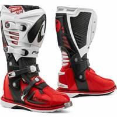                                                                                           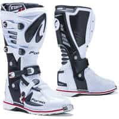                                                                                                                                                                                      |                                                                                           
|                                                                                           **FORMA - PREDATOR 2 0 ENDURO**                                                                                                                                                                                        EN13634-2222                                                                                            ") Modèle homme                                                                                                                                                                                        **Pages fabricant :**                                                                                            - [predator-2-enduro](https://www.formabootsusa.com/collections/dual-sport-adv-boots/products/predator-2-enduro)                                                                                            - [predator-2-enduro](https://www.formabootsusa.com/collections/off-road-boots/products/predator-2-enduro)                                                                                                                                                                                        **Lieu de fabrication :**                                                                                            Europe :                                                                                                                                                                                        ") Roumanie                                                                                                                                                                                                                                                                                   **Prix en ligne au moment de la rédaction :**                                                                                            - [340,38 € (motoblouz)](https://pkw.motoblouz.com/?P4122157BDFF171&redir=https%3A%2F%2Fwww.motoblouz.com%2Frecherche%2FFORMA%2520PREDATOR%2520202%2520200%252020ENDURO.html)                                                                                            - [343,84 € (dafymoto)](https://www.dafy-moto.com/recherche?string=FORMA%20PREDATOR%20202%20200%2020ENDURO)                                                                                            - [399,95 € (fcmoto)](https://www.fc-moto.de/epages/fcm.sf/fr_FR/?ViewAction=FacetedSearchProducts&SearchString=FORMA+PREDATOR+202+200+20ENDURO)                                                                                            - 549,00 $ (fabricant)                                                                                            - [Rechercher (motardinn)](https://www.tradeinn.com/motardinn/fr?products_search%5Bquery%5D=FORMA+PREDATOR+2+0+ENDURO)                                                                                                                                                                                        **Aide à la recherche :**                                                                                            *Rechercher en occasion (~100-240 €)*                                                                                            [ Leboncoin](https://www.leboncoin.fr/recherche?text=moto+FORMA+PREDATOR+2+0+ENDURO&shippable=1&sort=price&order=asc) [ Vinted](https://www.vinted.fr/catalog?search_text=moto+FORMA+PREDATOR+2+0+ENDURO&order=price_low_to_high) *Recherches diverses :*                                                                                            [ Google](https://www.google.com/search?q=moto+FORMA+PREDATOR+2+0+ENDURO) [ Youtube](https://www.youtube.com/results?search_query=moto+FORMA+PREDATOR+2+0+ENDURO)                                                                                            |                                                                                                                                                                                      |                                                                                           

## Modèles à 349,00 $ :

 | Modèle | Photos |
|---|---|
|                                                                                           **FORMA - BOULDER DRY**                                                                                                                                                                                        EN13634-2222                                                                                            ") Modèle mixte femme/homme                                                                                             Tailles : 30, 33, 41                                                                                            ") Eté                                                                                                                                                                                        **Pages fabricant :**                                                                                            - [boulder-dry-brown](https://www.formabootsusa.com/collections/dual-sport-adv-boots/products/boulder-dry-brown)                                                                                            - [boulder-dry-brown](https://www.formabootsusa.com/collections/off-road-boots/products/boulder-dry-brown)                                                                                                                                                                                        **Lieu de fabrication :**                                                                                            Europe :                                                                                                                                                                                        ") Roumanie                                                                                                                                                                                                                                                                                   **Caractéristiques :**                                                                                            ") Cuir                                                                                            ") Respirant                                                                                            ") Imperméable                                                                                                                                                                                        **Prix en ligne au moment de la rédaction :**                                                                                            - 349,00 $ (fabricant)                                                                                            - [Rechercher (fcmoto)](https://www.fc-moto.de/epages/fcm.sf/fr_FR/?ViewAction=FacetedSearchProducts&SearchString=FORMA+BOULDER+DRY)                                                                                            - [Rechercher (motoblouz)](https://www.motoblouz.com/recherche/FORMA+BOULDER+DRY.html)                                                                                            - [Rechercher (motardinn)](https://www.tradeinn.com/motardinn/fr?products_search%5Bquery%5D=FORMA+BOULDER+DRY)                                                                                            - [Rechercher (dafymoto)](https://www.dafy-moto.com/recherche?string=FORMA+BOULDER+DRY)                                                                                                                                                                                        **Aide à la recherche :**                                                                                            *Rechercher en occasion (~100-240 €)*                                                                                            [ Leboncoin](https://www.leboncoin.fr/recherche?text=moto+FORMA+BOULDER+DRY&shippable=1&sort=price&order=asc) [ Vinted](https://www.vinted.fr/catalog?search_text=moto+FORMA+BOULDER+DRY&order=price_low_to_high) *Recherches diverses :*                                                                                            [ Google](https://www.google.com/search?q=moto+FORMA+BOULDER+DRY) [ Youtube](https://www.youtube.com/results?search_query=moto+FORMA+BOULDER+DRY)                                                                                            |                                                                                           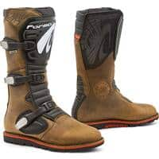                                                                                           |                                                                                           

## Modèles à 375,99 € :

 | Modèle | Photos |
|---|---|
|                                                                                           **REV-IT - DISCOVERY GTX**                                                                                                                                                                                        EN13634-2222 WR IPS                                                                                             (image modifiée : Tabler-icons)") Disponible en petites tailles (<40)                                                                                             Tailles : 30, 38, 39, 40, 41, 42, 43, 44, 45, 46, 47                                                                                                                                                                                        **Pages fabricant :**                                                                                            - [bottes-moto-discovery-gtx-marron](https://www.revitsport.com/fr_fr/bottes-moto-discovery-gtx-marron)                                                                                            - [bottes-moto-discovery-gtx-noir](https://www.revitsport.com/fr_fr/bottes-moto-discovery-gtx-noir)                                                                                                                                                                                        **Lieu de fabrication :**                                                                                             Inconnu                                                                                                                                                                                        **Caractéristiques :**                                                                                             (image modifiée : Tabler-icons)") Imperméable (Gore-Tex)                                                                                                                                                                                        **De bonnes présentations :**                                                                                            [ Youtube : RevZilla - REV-IT-Discovery-GTX-Boots-Review](https://www.youtube.com/watch?v=mUPfQ_K-PFc)                                                                                            [ Youtube : Français-Champion-Helmets - Revit-Discovery-GTX-Bottes-Revue-ChampionHelmets-com](https://www.youtube.com/watch?v=HPVKWMwTgPU)                                                                                                                                                                                        **Prix en ligne au moment de la rédaction :**                                                                                            - [375,99 € (motoblouz)](https://pkw.motoblouz.com/?P4122157BDFF171&redir=https%3A%2F%2Fwww.motoblouz.com%2Frecherche%2FREV%252020IT%2520DISCOVERY%252020GTX.html)                                                                                            - [399,99 € (dafymoto)](https://www.dafy-moto.com/recherche?string=REV%2020IT%20DISCOVERY%2020GTX)                                                                                            - [422,95 € (fcmoto)](https://www.fc-moto.de/epages/fcm.sf/fr_FR/?ViewAction=FacetedSearchProducts&SearchString=REV+20IT+DISCOVERY+20GTX)                                                                                            - 469,99 € (fabricant)                                                                                            - [Rechercher (motardinn)](https://www.tradeinn.com/motardinn/fr?products_search%5Bquery%5D=REV+IT+DISCOVERY)                                                                                                                                                                                        **Aide à la recherche :**                                                                                            *Rechercher en occasion (~110-260 €)*                                                                                            [ Leboncoin](https://www.leboncoin.fr/recherche?text=moto+REV+IT+DISCOVERY&shippable=1&sort=price&order=asc) [ Vinted](https://www.vinted.fr/catalog?search_text=moto+REV+IT+DISCOVERY&order=price_low_to_high) *Recherches diverses :*                                                                                            [ Google](https://www.google.com/search?q=moto+REV+IT+DISCOVERY) [ Youtube](https://www.youtube.com/results?search_query=moto+REV+IT+DISCOVERY)                                                                                            |                                                                                           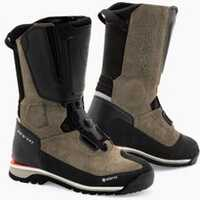                                                                                           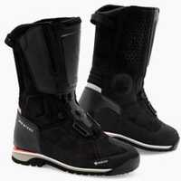                                                                                           |                                                                                           

## Modèles à 379,00 $ :

 | Modèle | Photos |
|---|---|
|                                                                                           **FORMA - TERRA EVO DRY X SERIES**                                                                                                                                                                                        EN13634-2222 WR                                                                                            ") Modèle mixte femme/homme                                                                                             Tailles : 35, 36, 37, 40, 41, 43, 44                                                                                                                                                                                        **Pages fabricant :**                                                                                            - [terra-evo-brown](https://www.formabootsusa.com/collections/dual-sport-adv-boots/products/terra-evo-brown)                                                                                            - [terra-evo-black](https://www.formabootsusa.com/collections/dual-sport-adv-boots/products/terra-evo-black)                                                                                            - [terra-evo-black](https://www.formabootsusa.com/collections/off-road-boots/products/terra-evo-black)                                                                                            - [terra-evo-brown](https://www.formabootsusa.com/collections/off-road-boots/products/terra-evo-brown)                                                                                                                                                                                        **Lieu de fabrication :**                                                                                            Europe :                                                                                                                                                                                        ") Roumanie                                                                                                                                                                                                                                                                                   **Caractéristiques :**                                                                                            ") Cuir                                                                                            ") Imperméable                                                                                                                                                                                        **Une bonne présentation :**                                                                                            [ Youtube : RevZilla - Forma-Terra-EVO-Dry-X-Series-Boots-Review](https://www.youtube.com/watch?v=O_JBWbgt5qQ)                                                                                                                                                                                        **Prix en ligne au moment de la rédaction :**                                                                                            - 379,00 $ (fabricant)                                                                                            - [Rechercher (fcmoto)](https://www.fc-moto.de/epages/fcm.sf/fr_FR/?ViewAction=FacetedSearchProducts&SearchString=FORMA+TERRA+EVO+DRY+X+SERIES)                                                                                            - [Rechercher (motoblouz)](https://www.motoblouz.com/recherche/FORMA+TERRA+EVO+DRY+X+SERIES.html)                                                                                            - [Rechercher (motardinn)](https://www.tradeinn.com/motardinn/fr?products_search%5Bquery%5D=FORMA+TERRA+EVO+DRY+X+SERIES)                                                                                            - [Rechercher (dafymoto)](https://www.dafy-moto.com/recherche?string=FORMA+TERRA+EVO+DRY+X+SERIES)                                                                                                                                                                                        **Aide à la recherche :**                                                                                            *Rechercher en occasion (~110-270 €)*                                                                                            [ Leboncoin](https://www.leboncoin.fr/recherche?text=moto+FORMA+TERRA+EVO+DRY+X+SERIES&shippable=1&sort=price&order=asc) [ Vinted](https://www.vinted.fr/catalog?search_text=moto+FORMA+TERRA+EVO+DRY+X+SERIES&order=price_low_to_high) *Recherches diverses :*                                                                                            [ Google](https://www.google.com/search?q=moto+FORMA+TERRA+EVO+DRY+X+SERIES) [ Youtube](https://www.youtube.com/results?search_query=moto+FORMA+TERRA+EVO+DRY+X+SERIES)                                                                                            |                                                                                                                                                                                                                                                                                 |                                                                                           

## Modèles à 543,99 € :

 | Modèle | Photos |
|---|---|
|                                                                                           **REV-IT - EXPEDITION GTX**                                                                                                                                                                                        EN13634-2222 WR IPS                                                                                             Tailles : 30, 39, 40, 41, 42, 43, 44, 45, 46, 47                                                                                                                                                                                        **Pages fabricant :**                                                                                            - [bottes-moto-expedition-gtx-noir-gris](https://www.revitsport.com/fr_fr/bottes-moto-expedition-gtx-noir-gris)                                                                                                                                                                                        **Lieu de fabrication :**                                                                                             Inconnu                                                                                                                                                                                        **Caractéristiques :**                                                                                            ") Cuir                                                                                             (image modifiée : Tabler-icons)") Imperméable (Gore-Tex)                                                                                                                                                                                        **Une bonne présentation :**                                                                                            [ Youtube : Français-Champion-Helmets - Revit-Expedition-GTX-Bottes-Revue-ChampionHelmets-com](https://www.youtube.com/watch?v=CpaYAnpwv7U)                                                                                                                                                                                        **Prix en ligne au moment de la rédaction :**                                                                                            - [543,99 € (motoblouz)](https://pkw.motoblouz.com/?P4122157BDFF171&redir=https%3A%2F%2Fwww.motoblouz.com%2Frecherche%2FREV%252020IT%2520EXPEDITION%252020GTX.html)                                                                                            - [579,99 € (dafymoto)](https://www.dafy-moto.com/recherche?string=REV%2020IT%20EXPEDITION%2020GTX)                                                                                            - [611,95 € (fcmoto)](https://www.fc-moto.de/epages/fcm.sf/fr_FR/?ViewAction=FacetedSearchProducts&SearchString=REV+20IT+EXPEDITION+20GTX)                                                                                            - 679,99 € (fabricant)                                                                                            - [Rechercher (motardinn)](https://www.tradeinn.com/motardinn/fr?products_search%5Bquery%5D=REV+IT+EXPEDITION)                                                                                                                                                                                        **Aide à la recherche :**                                                                                            *Rechercher en occasion (~160-380 €)*                                                                                            [ Leboncoin](https://www.leboncoin.fr/recherche?text=moto+REV+IT+EXPEDITION&shippable=1&sort=price&order=asc) [ Vinted](https://www.vinted.fr/catalog?search_text=moto+REV+IT+EXPEDITION&order=price_low_to_high) *Recherches diverses :*                                                                                            [ Google](https://www.google.com/search?q=moto+REV+IT+EXPEDITION) [ Youtube](https://www.youtube.com/results?search_query=moto+REV+IT+EXPEDITION)                                                                                            |                                                                                                                                                                                      |                                                                                           

[^1]: Norme _CE EN 13634-2017_ :  
    1. **Hauteur de la tige avant/arrière du mollet** :  
    Mesurée à partir du sol ([source : Standards CE](https://standards.iteh.ai/catalog/standards/cen/f5bbe4a8-39ee-4652-96a3-cc060d0b8236/en-13634-2017)) :  
        1. Niveau 1 : 10,3 cm/6,4 cm en dessous de 36, jusqu'à 12,1 cm / 7,3 cm au dessus de 45.  
        2. Niveau 2 : 16,2 cm/11,3 cm en dessous de 36, jusqu'à 19,2 cm / 13,1 cm au dessus de 45.  
    2. **Abrasion** :  
     Nombre de secondes pour traverser tige+doublure avec une bande abrasive de grain 60 qui tourne à 8 m/s (zone B = risque fort, zone A = reste de la chaussure) ([source : _Motoservice_](https://www.motoservices.com/dossiers-accessoire-moto-equipement-moto/equipement-moto-scooter-les-normes-en-vigueur-fev-2019.htm)) :  
        1. Niveau 1 : 5 s zone B, 1,5 s zone A  
        2. Niveau 2 : 12 s zone B, 2,5 s zone A  
    3. **Perforation/coupure** :  
       Une lame est lancée à 2,8 m/s sur tige+doublure et on mesure la pénétration ([source : _Tcxboots_](https://fr.tcxboots.com/pages/certifications)) :  
        1. Niveau 1 : < 25 mm  
        2. Niveau 2 : < 15 mm  
    4. **Rigidité** :  
       Mesure de la force nécessaire pour déformer la semelle de 2 cm ([source : _Tcxboots_](https://fr.tcxboots.com/pages/certifications)) :  
        1. Niveau 1 : > 1 kN  
        2. Niveau 2 : > 1,5 kN  
