*# NOUVELLE VERSION DE CET ARTICLE ICI : [Inventaire des bottes de moto montantes les plus protectrices (EN 13634 : 2222) en décembre 2023]() #*

Mise à jour de mon inventaire des bottes de moto montantes qui atteignent le maximum de la norme EN 13634 : 2222.

J'ai changé la présentation pour ranger les équipements par prix plutôt que par marque.

J'ai aussi ajouté diverses indications permettant de faire son choix : lieu de fabrication quand connu, imperméabilité, genre annoncé (juste pour info, car pour les bottes pas de coupe particulière).

J’ai mis le lien Motoblouz/Dafy/Fcmoto lorsque le produit était disponible au moment de la rédaction de l'article.

_(Note importante : je ne touche pas un centime sur les achats effectués sur ces sites, les liens ne sont là que pour info ! Si l'article vous a plu, vous pouvez en revanche m'offrir un café en suivant le lien en haut d'article :) )_

Quelques bottes légèrement moins protectrices sont listées ici, si le choix n'est pas suffisant : [Inventaire des bottes de moto montantes "presque" les plus protectrices (EN 13634:2122, EN 13634:2212, EN 13634:2221) en juin 2023]().

Le même exercice pour les chaussures, baskets et bottes courtes : [Inventaire des chaussures, baskets et bottes courtes moto les plus protectrices (EN 13634 : 1222) en juin 2023]().

> _Liste des mises à jour :_  
> _- 25/10/2023 : ajout des Valentina + révision de la mise en page et ajout de liens._  
> _- 16/10/2023 : ajout de liens._  
> _- 13/09/2023 : révision complète de la mise en page, nouveaux liens, etc._

---

**Rappels concernant la norme EN 13634 :**

Elle impose d'afficher sur les étiquettes des chaussures/bottes moto des infos précises sur leur niveau de protection :

- Le premier chiffre indique la hauteur du chaussant[^1] (1 : basse, 2 : haute), il est surtout intéressant en complément des 3 suivants qui évaluent le niveau de protection de la chaussure pour un danger spécifique ;
- Résistance à l'abrasion[^2] ;
- Résistance à la perforation[^3] ;
- Résistance à la torsion/écrasement[^4].

Aujourd'hui seuls 2 niveaux existent pour chacun, 1 et 2.

Certifications complémentaires courantes :

- IPA : Protection de la malléole
- IPS : Protection du tibia
- WR : Résistance à la pénétration de l'eau
- FO : Résistance aux hydrocarbures

---

> *Note :* Cette page a été réalisée à partir des données fournies par les fabricants sur leurs sites Web.
> Sa génération est en grande partie automatisée, il peut donc y avoir quelques erreurs.
> 
> Les fabricants analysés sont les suivants :
> [ACERBIS](https://www.acerbis.com/), 
[ALPINESTARS](https://www.alpinestars.com/), 
[BERING](https://bering.fr/), 
[BMW](https://www.bmw-motorrad.fr/), 
[BULL-IT](https://www.bull-it.com/), 
[DAINESE](https://www.dainese.com), 
[DUCATI](https://www.ducati.com/), 
[ESQUAD](https://www.esquad.fr/), 
[EUDOXIE](https://eudoxie.shop/), 
[FALCO](https://giannifalco.com/), 
[FIVE](https://five-gloves.com/), 
[FORMA](https://www.formabootsusa.com/), 
[FUEL](https://fuelmotorcycles.eu/), 
[FURYGAN](https://www.furygan.com/), 
[GERBING](https://www.gerbingfrance.fr/), 
[G-HEAT](https://www.g-heat.com/), 
[GOLDTOP](https://goldtop.co.uk/), 
[HALVARSSONS](https://halvarssonsmc.com/), 
[HELSTONS](https://www.helstons.net/), 
[HEVIK](https://www.hevik.co.uk/), 
[HOOD](https://www.hoodjeans.co.uk), 
[IXON](https://www.ixon.com/), 
[IXS](https://ixs.com/), 
[JOHN-DOE](https://www.ridejohndoe.com/), 
[KLIM](https://www.klim.com/), 
[KNOX](https://www.planet-knox.com), 
[LOUIS](https://www.louis.ie), 
[LS2](https://www.ls2usa.com/), 
[MERLAMOTO](https://merlamoto.com/), 
[MERLIN](https://www.merlinbikegear.shop/), 
[MOTOBLOUZ](https://www.motoblouz.com/), 
[MOTOGIRL](https://motogirl.co.uk/), 
[OJ](https://ojworld.it/), 
[OXFORD](https://www.oxfordproducts.com/), 
[PANDO](https://pandomoto.com/), 
[PMJ](https://pmj.it/), 
[RACERED](https://racered.eu/), 
[RACER](https://www.racer1927.com/), 
[RAXID](https://raxid.co.uk), 
[RESURGENCE-GEAR](https://resurgencegear.net/), 
[REV-IT](https://www.revitsport.com/), 
[ROADSKIN](https://roadskin.co.uk/), 
[ROKKER](https://www.eu.therokkercompany.com/), 
[RST](https://www.rst-moto.com/), 
[RUKKA](https://luhta.com/), 
[SEGURA](https://segura-moto.fr/), 
[SEVENTY-DEGREES](https://seventy-70.com/), 
[SIDI](https://www.sidi.com/), 
[SOUBIRAC](https://www.soubirac.fr/), 
[SPIDI](https://www.spidi.com/), 
[TCX](https://www.tcxboots.com/), 
[2MILESIX](https://www.2milesix.com/), 
[COURSE et RIDE AND SONS](https://www.xlmoto.com/).

> 
> Les fabricants suivants ont été exclus car ils n'affichent pas le niveau de sécurité de leurs produits, ou ne sont pas commercialisés en Europe : ARLEN NESS, ARMURE, BELSTAFF, BILT, BOGOTTO, BOLID'STER, DRAGGIN, DRIRIDER, ELEVEIT, FLY MOTO, FOX, GAERNE, HARLEY DAVIDSON, HELD, HOLYFREEDOM, HONDA, ICON, INDIAN, KAWASAKI, KTM, LEATT, MACNA, O'NEAL, OVERLAP, REAX, RICHA, RJAYS, RUSTY STITCHES, SAINT, SCOTT, SEDICI, SHOT, SIDI, SPIRIT MOTORS, STADLER, STREET & STEEL, STYLMARTIN, THOR, TRIUMPH, VENDRAMINI, WEX, XPD, YAMAHA.

---

## Modèles à 71,92 € :

 | Modèle | Photos |
|---|---|
|                                                                                           **DXR - SILVRETTA**                                                                                                                                                                                        EN13634-2222 IPA                                                                                            ") Modèle femme                                                                                                                                                                                        **Pages fabricant :**                                                                                            - [vente-bottes-dxr-silvretta-200519](https://www.motoblouz.com/vente-bottes-dxr-silvretta-200519.html)                                                                                                                                                                                        **Lieu de fabrication :**                                                                                             Inconnu                                                                                                                                                                                        **Caractéristiques :**                                                                                            ") Cuir                                                                                            ") Imperméable                                                                                                                                                                                        **Prix en ligne au moment de la rédaction :**                                                                                            - [71,92 € (motoblouz)](https://www.motoblouz.com/recherche.html?q=DXR+SILVRETTA)                                                                                            - [Rechercher (fcmoto)](https://www.fc-moto.de/epages/fcm.sf/fr_FR/?ViewAction=FacetedSearchProducts&SearchString=DXR+SILVRETTA)                                                                                            - [Rechercher (motardinn)](https://www.tradeinn.com/motardinn/fr?products_search%5Bquery%5D=DXR+SILVRETTA)                                                                                            - [Rechercher (dafymoto)](https://www.dafy-moto.com/recherche?string=DXR+SILVRETTA)                                                                                                                                                                                        **Aide à la recherche :**                                                                                            *Rechercher en occasion (~20-50 €)*                                                                                            [ Leboncoin](https://www.leboncoin.fr/recherche?text=moto+DXR+SILVRETTA&shippable=1&sort=price&order=asc) [ Vinted](https://www.vinted.fr/catalog?search_text=moto+DXR+SILVRETTA&order=price_low_to_high) *Recherches diverses :*                                                                                            [ Google](https://www.google.com/search?q=moto+DXR+SILVRETTA) [ Youtube](https://www.youtube.com/results?search_query=moto+DXR+SILVRETTA)                                                                                            |                                                                                           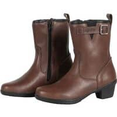                                                                                                                                                                                      |                                                                                           

## Modèles à 92,99 € :

 | Modèle | Photos |
|---|---|
|                                                                                           **OXFORD - VALENTINA WOMEN**                                                                                                                                                                                        EN13634-2222                                                                                            ") Eté                                                                                                                                                                                        **Pages fabricant :**                                                                                            - [oxford_valentina_ws_boots_black/](https://www.oxfordproducts.com/motorcycle/product_type/rider_wear/oxford/boots/oxford_valentina_ws_boots_black/)                                                                                                                                                                                        **Lieu de fabrication :**                                                                                             Inconnu                                                                                                                                                                                        **Caractéristiques :**                                                                                            ") Cuir                                                                                            ") Respirant                                                                                            ") Imperméable                                                                                                                                                                                        **Prix en ligne au moment de la rédaction :**                                                                                            - [92,99 € (motardinn)](https://www.tradeinn.com/motardinn/fr?products_search%5Bquery%5D=OXFORD+VALENTINA%20FEMME)                                                                                            - [122,39 € (motoblouz)](https://www.motoblouz.com/recherche.html?q=OXFORD+VALENTINA+FEMME)                                                                                            - [Rechercher (fcmoto)](https://www.fc-moto.de/epages/fcm.sf/fr_FR/?ViewAction=FacetedSearchProducts&SearchString=OXFORD+VALENTINA+WOMEN)                                                                                            - [Rechercher (dafymoto)](https://www.dafy-moto.com/recherche?string=OXFORD+VALENTINA+WOMEN)                                                                                                                                                                                        **Aide à la recherche :**                                                                                            *Rechercher en occasion (~30-60 €)*                                                                                            [ Leboncoin](https://www.leboncoin.fr/recherche?text=moto+OXFORD+VALENTINA+WOMEN&shippable=1&sort=price&order=asc) [ Vinted](https://www.vinted.fr/catalog?search_text=moto+OXFORD+VALENTINA+WOMEN&order=price_low_to_high) *Recherches diverses :*                                                                                            [ Google](https://www.google.com/search?q=moto+OXFORD+VALENTINA+WOMEN) [ Youtube](https://www.youtube.com/results?search_query=moto+OXFORD+VALENTINA+WOMEN)                                                                                            |                                                                                                                                                                                      |                                                                                           

## Modèles à 130,39 € :

 | Modèle | Photos |
|---|---|
|                                                                                           **FORMA - CRYSTAL**                                                                                                                                                                                        EN13634-2222 WR                                                                                            ") Modèle femme                                                                                                                                                                                        **Pages fabricant :**                                                                                            - [crystal](https://www.formabootsusa.com/collections/womens/products/crystal)                                                                                                                                                                                        **Lieu de fabrication :**                                                                                            Europe :                                                                                                                                                                                        ") Roumanie                                                                                                                                                                                                                                                                                   **Caractéristiques :**                                                                                            ") Cuir                                                                                            ") Imperméable                                                                                                                                                                                        **Une bonne présentation :**                                                                                            [ Youtube : RevZilla - Forma-Crystal-Women-s-Boots-Review](https://www.youtube.com/watch?v=DPIl5TvbG-E)                                                                                                                                                                                        **Prix en ligne au moment de la rédaction :**                                                                                            - [130,39 € (motoblouz)](https://www.motoblouz.com/recherche.html?q=FORMA+CRYSTAL)                                                                                            - [139,91 € (motardinn)](https://www.tradeinn.com/motardinn/fr?products_search%5Bquery%5D=FORMA+CRYSTAL)                                                                                            - [148,95 € (fcmoto)](https://www.fc-moto.de/epages/fcm.sf/fr_FR/?ViewAction=FacetedSearchProducts&SearchString=FORMA+CRYSTAL)                                                                                            - [153,44 € (dafymoto)](https://www.dafy-moto.com/recherche?string=FORMA%20CRYSTAL)                                                                                                                                                                                        **Aide à la recherche :**                                                                                            *Rechercher en occasion (~40-90 €)*                                                                                            [ Leboncoin](https://www.leboncoin.fr/recherche?text=moto+FORMA+CRYSTAL&shippable=1&sort=price&order=asc) [ Vinted](https://www.vinted.fr/catalog?search_text=moto+FORMA+CRYSTAL&order=price_low_to_high) *Recherches diverses :*                                                                                            [ Google](https://www.google.com/search?q=moto+FORMA+CRYSTAL) [ Youtube](https://www.youtube.com/results?search_query=moto+FORMA+CRYSTAL)                                                                                            |                                                                                           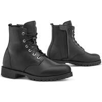                                                                                           |                                                                                           

## Modèles à 132,99 € :

 | Modèle | Photos |
|---|---|
|                                                                                           **FORMA - RUBY**                                                                                                                                                                                        EN13634-2222 WR                                                                                            ") Modèle femme                                                                                                                                                                                        **Pages fabricant :**                                                                                            - [ruby](https://www.formabootsusa.com/collections/womens/products/ruby)                                                                                                                                                                                        **Lieu de fabrication :**                                                                                            Europe :                                                                                                                                                                                        ") Roumanie                                                                                                                                                                                                                                                                                   **Caractéristiques :**                                                                                            ") Cuir                                                                                            ") Imperméable                                                                                                                                                                                        **Prix en ligne au moment de la rédaction :**                                                                                            - [132,99 € (motardinn)](https://www.tradeinn.com/motardinn/fr?products_search%5Bquery%5D=FORMA+RUBY)                                                                                            - [162,74 € (dafymoto)](https://www.dafy-moto.com/recherche?string=FORMA%20RUBY)                                                                                            - [Rechercher (fcmoto)](https://www.fc-moto.de/epages/fcm.sf/fr_FR/?ViewAction=FacetedSearchProducts&SearchString=FORMA+RUBY)                                                                                            - [Rechercher (motoblouz)](https://www.motoblouz.com/recherche/FORMA+RUBY.html)                                                                                                                                                                                        **Aide à la recherche :**                                                                                            *Rechercher en occasion (~40-90 €)*                                                                                            [ Leboncoin](https://www.leboncoin.fr/recherche?text=moto+FORMA+RUBY&shippable=1&sort=price&order=asc) [ Vinted](https://www.vinted.fr/catalog?search_text=moto+FORMA+RUBY&order=price_low_to_high) *Recherches diverses :*                                                                                            [ Google](https://www.google.com/search?q=moto+FORMA+RUBY) [ Youtube](https://www.youtube.com/results?search_query=moto+FORMA+RUBY)                                                                                            |                                                                                           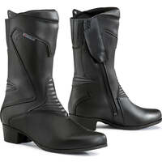                                                                                           |                                                                                           

## Modèles à 144,46 € :

 | Modèle | Photos |
|---|---|
|                                                                                           **RST - ADVENTURE X MENS**                                                                                                                                                                                        EN13634-2222                                                                                            ") Modèle homme                                                                                            ") Eté                                                                                                                                                                                        **Pages fabricant :**                                                                                            - [adventure-x-ce-mens-waterproof-boot](https://www.rst-moto.com/products/adventure-x-ce-mens-waterproof-boot)                                                                                                                                                                                        **Lieu de fabrication :**                                                                                             Inconnu                                                                                                                                                                                        **Caractéristiques :**                                                                                            ") Respirant                                                                                            ") Imperméable                                                                                                                                                                                        **Prix en ligne au moment de la rédaction :**                                                                                            - [144,46 € (motoblouz)](https://www.motoblouz.com/recherche.html?q=RST+ADVENTURE+X+HOMME)                                                                                            - [Rechercher (fcmoto)](https://www.fc-moto.de/epages/fcm.sf/fr_FR/?ViewAction=FacetedSearchProducts&SearchString=RST+ADVENTURE+X)                                                                                            - [Rechercher (motardinn)](https://www.tradeinn.com/motardinn/fr?products_search%5Bquery%5D=RST+ADVENTURE+X)                                                                                            - [Rechercher (dafymoto)](https://www.dafy-moto.com/recherche?string=RST+ADVENTURE+X)                                                                                                                                                                                        **Aide à la recherche :**                                                                                            *Rechercher en occasion (~40-100 €)*                                                                                            [ Leboncoin](https://www.leboncoin.fr/recherche?text=moto+RST+ADVENTURE+X&shippable=1&sort=price&order=asc) [ Vinted](https://www.vinted.fr/catalog?search_text=moto+RST+ADVENTURE+X&order=price_low_to_high) *Recherches diverses :*                                                                                            [ Google](https://www.google.com/search?q=moto+RST+ADVENTURE+X) [ Youtube](https://www.youtube.com/results?search_query=moto+RST+ADVENTURE+X)                                                                                            |                                                                                           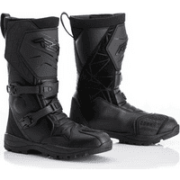                                                                                           |                                                                                           

## Modèles à 151,99 € :

 | Modèle | Photos |
|---|---|
|                                                                                           **REV-IT - FUSE H2O**                                                                                                                                                                                        EN13634-2222 WR                                                                                                                                                                                        **Pages fabricant :**                                                                                            - [bottes-moto-fuse-h2o-noir](https://www.revitsport.com/fr_fr/bottes-moto-fuse-h2o-noir)                                                                                                                                                                                        **Lieu de fabrication :**                                                                                             Inconnu                                                                                                                                                                                        **Caractéristiques :**                                                                                            ") Imperméable                                                                                                                                                                                        **Prix en ligne au moment de la rédaction :**                                                                                            - [151,99 € (motardinn)](https://www.tradeinn.com/motardinn/fr?products_search%5Bquery%5D=REVIT+FUSE%20H2O)                                                                                            - [164,81 € (motoblouz)](https://www.motoblouz.com/recherche.html?q=REVIT+FUSE+H2O)                                                                                            - [199,99 € (fcmoto)](https://www.fc-moto.de/epages/fcm.sf/fr_FR/?ViewAction=FacetedSearchProducts&SearchString=REVIT+FUSE%20H2O)                                                                                            - [199,99 € (dafymoto)](https://www.dafy-moto.com/recherche?string=REVIT%20FUSE%20H2O)                                                                                                                                                                                        **Aide à la recherche :**                                                                                            *Rechercher en occasion (~50-110 €)*                                                                                            [ Leboncoin](https://www.leboncoin.fr/recherche?text=moto+REV+IT+FUSE+H2O&shippable=1&sort=price&order=asc) [ Vinted](https://www.vinted.fr/catalog?search_text=moto+REV+IT+FUSE+H2O&order=price_low_to_high) *Recherches diverses :*                                                                                            [ Google](https://www.google.com/search?q=moto+REV+IT+FUSE+H2O) [ Youtube](https://www.youtube.com/results?search_query=moto+REV+IT+FUSE+H2O)                                                                                            |                                                                                           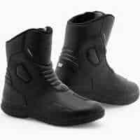                                                                                           |                                                                                           

## Modèles à 159,95 € :

 | Modèle | Photos |
|---|---|
|                                                                                           **REV-IT - MOHAWK 3**                                                                                                                                                                                        EN13634-2222                                                                                                                                                                                        **Pages fabricant :**                                                                                            - [chaussures-moto-mohawk-3-noir](https://www.revitsport.com/fr_fr/chaussures-moto-mohawk-3-noir)                                                                                            - [chaussures-moto-mohawk-3-marron-blanc](https://www.revitsport.com/fr_fr/chaussures-moto-mohawk-3-marron-blanc)                                                                                                                                                                                        **Lieu de fabrication :**                                                                                             Inconnu                                                                                                                                                                                        **Une bonne présentation :**                                                                                            [ Youtube : Urban-Rider - REVIT-Mohawk-3-Motorcycle-Boot-Review](https://www.youtube.com/watch?v=Lc-RmwtXcQI)                                                                                                                                                                                        **Prix en ligne au moment de la rédaction :**                                                                                            - [159,95 € (fcmoto)](https://www.fc-moto.de/epages/fcm.sf/fr_FR/?ViewAction=FacetedSearchProducts&SearchString=REVIT+MOHAWK%203)                                                                                            - [160,46 € (motoblouz)](https://www.motoblouz.com/recherche.html?q=REVIT+MOHAWK+3)                                                                                            - [249,99 € (dafymoto)](https://www.dafy-moto.com/recherche?string=REVIT%20MOHAWK%203)                                                                                            - [Rechercher (motardinn)](https://www.tradeinn.com/motardinn/fr?products_search%5Bquery%5D=REV+IT+MOHAWK+3)                                                                                                                                                                                        **Aide à la recherche :**                                                                                            *Rechercher en occasion (~50-110 €)*                                                                                            [ Leboncoin](https://www.leboncoin.fr/recherche?text=moto+REV+IT+MOHAWK+3&shippable=1&sort=price&order=asc) [ Vinted](https://www.vinted.fr/catalog?search_text=moto+REV+IT+MOHAWK+3&order=price_low_to_high) *Recherches diverses :*                                                                                            [ Google](https://www.google.com/search?q=moto+REV+IT+MOHAWK+3) [ Youtube](https://www.youtube.com/results?search_query=moto+REV+IT+MOHAWK+3)                                                                                            |                                                                                           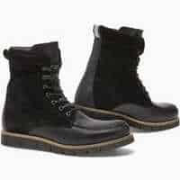                                                                                                                                                                                      |                                                                                           

## Modèles à 166,09 € :

 | Modèle | Photos |
|---|---|
|                                                                                           **FORMA - ADVENTURE LOW**                                                                                                                                                                                        EN13634-2222 WR                                                                                            ") Modèle mixte                                                                                            ") Eté                                                                                                                                                                                        **Pages fabricant :**                                                                                            - [adventure-low-brown](https://www.formabootsusa.com/collections/dual-sport-adv-boots/products/adventure-low-brown)                                                                                            - [adventure-low-black](https://www.formabootsusa.com/collections/dual-sport-adv-boots/products/adventure-low-black)                                                                                                                                                                                        **Lieu de fabrication :**                                                                                            Europe :                                                                                                                                                                                        ") Roumanie                                                                                                                                                                                                                                                                                   **Caractéristiques :**                                                                                            ") Cuir                                                                                            ") Respirant                                                                                            ") Imperméable                                                                                                                                                                                        **De bonnes présentations :**                                                                                            [ Youtube : RevZilla - Forma-Adventure-Boots-Review-at-RevZilla-com](https://www.youtube.com/watch?v=kZ4PE89u4zM)                                                                                            [ Article : Motoblouz - Bottes cross Forma Adventure Low, testées et validées par Paola, ...](https://www.motoblouz.com/enjoytheride/equipement-motard/22586-bottes-cross-forma-adventure-low-essai-2023-01-27)                                                                                                                                                                                        **Prix en ligne au moment de la rédaction :**                                                                                            - [166,09 € (motoblouz)](https://www.motoblouz.com/recherche.html?q=FORMA+ADVENTURE+LOW)                                                                                            - [187,70 € (motardinn)](https://www.tradeinn.com/motardinn/fr?products_search%5Bquery%5D=FORMA+ADVENTURE%20LOW)                                                                                            - [213,89 € (dafymoto)](https://www.dafy-moto.com/recherche?string=FORMA%20ADVENTURE%20LOW)                                                                                            - [Rechercher (fcmoto)](https://www.fc-moto.de/epages/fcm.sf/fr_FR/?ViewAction=FacetedSearchProducts&SearchString=FORMA+ADVENTURE+LOW)                                                                                                                                                                                        **Aide à la recherche :**                                                                                            *Rechercher en occasion (~50-120 €)*                                                                                            [ Leboncoin](https://www.leboncoin.fr/recherche?text=moto+FORMA+ADVENTURE+LOW&shippable=1&sort=price&order=asc) [ Vinted](https://www.vinted.fr/catalog?search_text=moto+FORMA+ADVENTURE+LOW&order=price_low_to_high) *Recherches diverses :*                                                                                            [ Google](https://www.google.com/search?q=moto+FORMA+ADVENTURE+LOW) [ Youtube](https://www.youtube.com/results?search_query=moto+FORMA+ADVENTURE+LOW)                                                                                            |                                                                                           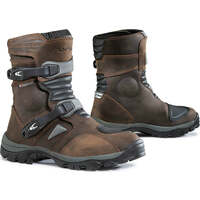                                                                                                                                                                                      |                                                                                           

## Modèles à 167,49 € :

 | Modèle | Photos |
|---|---|
|                                                                                           **REV-IT - FLUX H2O**                                                                                                                                                                                        EN13634-2222 WR                                                                                                                                                                                        **Pages fabricant :**                                                                                            - [bottes-moto-flux-h2o-noir](https://www.revitsport.com/fr_fr/bottes-moto-flux-h2o-noir)                                                                                                                                                                                        **Lieu de fabrication :**                                                                                             Inconnu                                                                                                                                                                                        **Caractéristiques :**                                                                                            ") Imperméable                                                                                                                                                                                        **Une bonne présentation :**                                                                                            [ Youtube : Français-Champion-Helmets - Revit-Flux-H2O-Bottes-Revue-ChampionHelmets-com](https://www.youtube.com/watch?v=5kc7aTfCjhQ)                                                                                                                                                                                        **Prix en ligne au moment de la rédaction :**                                                                                            - [167,49 € (motardinn)](https://www.tradeinn.com/motardinn/fr?products_search%5Bquery%5D=REVIT+FLUX%20H2O)                                                                                            - [181,31 € (motoblouz)](https://www.motoblouz.com/recherche.html?q=REVIT+FLUX+H2O)                                                                                            - [219,99 € (fcmoto)](https://www.fc-moto.de/epages/fcm.sf/fr_FR/?ViewAction=FacetedSearchProducts&SearchString=REVIT+FLUX%20H2O)                                                                                            - [219,99 € (dafymoto)](https://www.dafy-moto.com/recherche?string=REVIT%20FLUX%20H2O)                                                                                                                                                                                        **Aide à la recherche :**                                                                                            *Rechercher en occasion (~50-120 €)*                                                                                            [ Leboncoin](https://www.leboncoin.fr/recherche?text=moto+REV+IT+FLUX+H2O&shippable=1&sort=price&order=asc) [ Vinted](https://www.vinted.fr/catalog?search_text=moto+REV+IT+FLUX+H2O&order=price_low_to_high) *Recherches diverses :*                                                                                            [ Google](https://www.google.com/search?q=moto+REV+IT+FLUX+H2O) [ Youtube](https://www.youtube.com/results?search_query=moto+REV+IT+FLUX+H2O)                                                                                            |                                                                                                                                                                                      |                                                                                           

## Modèles à 172,00 € :

 | Modèle | Photos |
|---|---|
|                                                                                           **FORMA - EAGLE**                                                                                                                                                                                        EN13634-2222 WR                                                                                            ") Modèle mixte femme/homme                                                                                                                                                                                        **Pages fabricant :**                                                                                            - [eagle-black](https://www.formabootsusa.com/collections/road-boots/products/eagle-black)                                                                                            - [eagle-brown](https://www.formabootsusa.com/collections/womens/products/eagle-brown)                                                                                                                                                                                        **Lieu de fabrication :**                                                                                            Europe :                                                                                                                                                                                        ") Roumanie                                                                                                                                                                                                                                                                                   **Caractéristiques :**                                                                                            ") Cuir                                                                                            ") Imperméable                                                                                                                                                                                        **Prix en ligne au moment de la rédaction :**                                                                                            - [172,00 € (fcmoto)](https://www.fc-moto.de/epages/fcm.sf/fr_FR/?ViewAction=FacetedSearchProducts&SearchString=FORMA+EAGLE)                                                                                            - 249,00 $ (fabricant)                                                                                            - [Rechercher (motoblouz)](https://www.motoblouz.com/recherche/FORMA+EAGLE.html)                                                                                            - [Rechercher (motardinn)](https://www.tradeinn.com/motardinn/fr?products_search%5Bquery%5D=FORMA+EAGLE)                                                                                            - [Rechercher (dafymoto)](https://www.dafy-moto.com/recherche?string=FORMA+EAGLE)                                                                                                                                                                                        **Aide à la recherche :**                                                                                            *Rechercher en occasion (~50-120 €)*                                                                                            [ Leboncoin](https://www.leboncoin.fr/recherche?text=moto+FORMA+EAGLE&shippable=1&sort=price&order=asc) [ Vinted](https://www.vinted.fr/catalog?search_text=moto+FORMA+EAGLE&order=price_low_to_high) *Recherches diverses :*                                                                                            [ Google](https://www.google.com/search?q=moto+FORMA+EAGLE) [ Youtube](https://www.youtube.com/results?search_query=moto+FORMA+EAGLE)                                                                                            |                                                                                                                                                                                      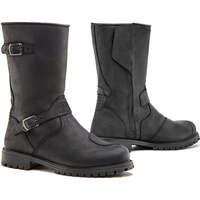                                                                                           |                                                                                           

## Modèles à 173,83 € :

 | Modèle | Photos |
|---|---|
|                                                                                           **FORMA - JASPER**                                                                                                                                                                                        EN13634-2222 WR                                                                                            ") Modèle homme                                                                                            ") Eté                                                                                                                                                                                        **Pages fabricant :**                                                                                            - [jasper](https://www.formabootsusa.com/collections/road-boots/products/jasper)                                                                                                                                                                                        **Lieu de fabrication :**                                                                                            Europe :                                                                                                                                                                                        ") Roumanie                                                                                                                                                                                                                                                                                   **Caractéristiques :**                                                                                            ") Cuir                                                                                            ") Respirant                                                                                            ") Imperméable                                                                                                                                                                                        **Prix en ligne au moment de la rédaction :**                                                                                            - [173,83 € (motoblouz)](https://www.motoblouz.com/recherche.html?q=FORMA+JASPER)                                                                                            - [187,00 € (fcmoto)](https://www.fc-moto.de/epages/fcm.sf/fr_FR/?ViewAction=FacetedSearchProducts&SearchString=FORMA+JASPER)                                                                                            - [204,59 € (dafymoto)](https://www.dafy-moto.com/recherche?string=FORMA%20JASPER)                                                                                            - [Rechercher (motardinn)](https://www.tradeinn.com/motardinn/fr?products_search%5Bquery%5D=FORMA+JASPER)                                                                                                                                                                                        **Aide à la recherche :**                                                                                            *Rechercher en occasion (~50-120 €)*                                                                                            [ Leboncoin](https://www.leboncoin.fr/recherche?text=moto+FORMA+JASPER&shippable=1&sort=price&order=asc) [ Vinted](https://www.vinted.fr/catalog?search_text=moto+FORMA+JASPER&order=price_low_to_high) *Recherches diverses :*                                                                                            [ Google](https://www.google.com/search?q=moto+FORMA+JASPER) [ Youtube](https://www.youtube.com/results?search_query=moto+FORMA+JASPER)                                                                                            |                                                                                                                                                                                      |                                                                                           
|                                                                                           **FORMA - LEGACY**                                                                                                                                                                                        EN13634-2222 WR                                                                                            ") Modèle mixte                                                                                                                                                                                        **Pages fabricant :**                                                                                            - [legacy](https://www.formabootsusa.com/collections/ride-urban/products/legacy)                                                                                            - [legacy-black](https://www.formabootsusa.com/collections/ride-urban/products/legacy-black)                                                                                                                                                                                        **Lieu de fabrication :**                                                                                            Europe :                                                                                                                                                                                        ") Roumanie                                                                                                                                                                                                                                                                                   **Caractéristiques :**                                                                                            ") Cuir                                                                                            ") Imperméable                                                                                                                                                                                        **Prix en ligne au moment de la rédaction :**                                                                                            - [173,83 € (motoblouz)](https://www.motoblouz.com/recherche.html?q=FORMA+LEGACY)                                                                                            - [185 € (motardinn)](https://www.tradeinn.com/motardinn/fr?products_search%5Bquery%5D=FORMA+LEGACY)                                                                                            - [187,00 € (fcmoto)](https://www.fc-moto.de/epages/fcm.sf/fr_FR/?ViewAction=FacetedSearchProducts&SearchString=FORMA+LEGACY)                                                                                            - [204,59 € (dafymoto)](https://www.dafy-moto.com/recherche?string=FORMA%20LEGACY)                                                                                                                                                                                        **Aide à la recherche :**                                                                                            *Rechercher en occasion (~50-120 €)*                                                                                            [ Leboncoin](https://www.leboncoin.fr/recherche?text=moto+FORMA+LEGACY&shippable=1&sort=price&order=asc) [ Vinted](https://www.vinted.fr/catalog?search_text=moto+FORMA+LEGACY&order=price_low_to_high) *Recherches diverses :*                                                                                            [ Google](https://www.google.com/search?q=moto+FORMA+LEGACY) [ Youtube](https://www.youtube.com/results?search_query=moto+FORMA+LEGACY)                                                                                            |                                                                                           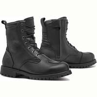                                                                                                                                                                                      |                                                                                           

## Modèles à 181,73 € :

 | Modèle | Photos |
|---|---|
|                                                                                           **FORMA - ADV TOURER**                                                                                                                                                                                        EN13634-2222 WR                                                                                            ") Modèle mixte                                                                                            ") Eté                                                                                                                                                                                        **Pages fabricant :**                                                                                            - [adv-tourer-brown](https://www.formabootsusa.com/collections/dual-sport-adv-boots/products/adv-tourer-brown)                                                                                            - [adv-tourer-black](https://www.formabootsusa.com/collections/dual-sport-adv-boots/products/adv-tourer-black)                                                                                            - [adv-tourer-black](https://www.formabootsusa.com/collections/road-boots/products/adv-tourer-black)                                                                                            - [adv-tourer-brown](https://www.formabootsusa.com/collections/road-boots/products/adv-tourer-brown)                                                                                                                                                                                        **Lieu de fabrication :**                                                                                            Europe :                                                                                                                                                                                        ") Roumanie                                                                                                                                                                                                                                                                                   **Caractéristiques :**                                                                                            ") Cuir                                                                                            ") Respirant                                                                                            ") Imperméable                                                                                                                                                                                        **De bonnes présentations :**                                                                                            [ Youtube : RevZilla - Forma-ADV-Tourer-Boots-Review-at-RevZilla-com](https://www.youtube.com/watch?v=UW0SUETSMmE)                                                                                                                                                                                         **Prix en ligne au moment de la rédaction :**                                                                                            - [181,73 € (motoblouz)](https://www.motoblouz.com/recherche.html?q=FORMA+ADV+TOURER)                                                                                            - [195,95 € (fcmoto)](https://www.fc-moto.de/epages/fcm.sf/fr_FR/?ViewAction=FacetedSearchProducts&SearchString=FORMA+ADV%20TOURER)                                                                                            - [198,71 € (motardinn)](https://www.tradeinn.com/motardinn/fr?products_search%5Bquery%5D=FORMA+ADV%20TOURER)                                                                                            - [213,89 € (dafymoto)](https://www.dafy-moto.com/recherche?string=FORMA%20ADV%20TOURER)                                                                                                                                                                                        **Aide à la recherche :**                                                                                            *Rechercher en occasion (~50-130 €)*                                                                                            [ Leboncoin](https://www.leboncoin.fr/recherche?text=moto+FORMA+ADV+TOURER&shippable=1&sort=price&order=asc) [ Vinted](https://www.vinted.fr/catalog?search_text=moto+FORMA+ADV+TOURER&order=price_low_to_high) *Recherches diverses :*                                                                                            [ Google](https://www.google.com/search?q=moto+FORMA+ADV+TOURER) [ Youtube](https://www.youtube.com/results?search_query=moto+FORMA+ADV+TOURER)                                                                                            |                                                                                           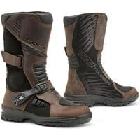                                                                                                                                                                                      |                                                                                           
|                                                                                           **FORMA - ADV TOURER LADY**                                                                                                                                                                                        EN13634-2222 WR                                                                                            ") Modèle femme                                                                                            ") Eté                                                                                                                                                                                        **Pages fabricant :**                                                                                            - [adv-tourer-lady](https://www.formabootsusa.com/collections/dual-sport-adv-boots/products/adv-tourer-lady)                                                                                            - [adv-tourer-lady](https://www.formabootsusa.com/collections/womens/products/adv-tourer-lady)                                                                                                                                                                                        **Lieu de fabrication :**                                                                                            Europe :                                                                                                                                                                                        ") Roumanie                                                                                                                                                                                                                                                                                   **Caractéristiques :**                                                                                            ") Cuir                                                                                            ") Respirant                                                                                            ") Imperméable                                                                                                                                                                                        **De bonnes présentations :**                                                                                            [ Youtube : RevZilla - Forma-ADV-Tourer-Women-s-Boots-Review](https://www.youtube.com/watch?v=g2N76ldvZ8s)                                                                                             [ Article : Motoblouz - Essai des bottes Forma ADV Tourer pour femmes](https://www.motoblouz.com/enjoytheride/bottes-chaussures-moto/19912-bottes-forma-adv-tourer-essai-2020-11-03)                                                                                                                                                                                        **Prix en ligne au moment de la rédaction :**                                                                                            - [181,73 € (motoblouz)](https://www.motoblouz.com/recherche.html?q=FORMA+ADV+TOURER+FEMME)                                                                                            - [195,95 € (fcmoto)](https://www.fc-moto.de/epages/fcm.sf/fr_FR/?ViewAction=FacetedSearchProducts&SearchString=FORMA+ADV%20TOURER%20DAMES)                                                                                            - [198,71 € (motardinn)](https://www.tradeinn.com/motardinn/fr?products_search%5Bquery%5D=FORMA+ADV%20TOURER%20FEMME)                                                                                            - [213,89 € (dafymoto)](https://www.dafy-moto.com/recherche?string=FORMA%20ADV%20TOURER%20FEMME)                                                                                                                                                                                        **Aide à la recherche :**                                                                                            *Rechercher en occasion (~50-130 €)*                                                                                            [ Leboncoin](https://www.leboncoin.fr/recherche?text=moto+FORMA+ADV+TOURER&shippable=1&sort=price&order=asc) [ Vinted](https://www.vinted.fr/catalog?search_text=moto+FORMA+ADV+TOURER&order=price_low_to_high) *Recherches diverses :*                                                                                            [ Google](https://www.google.com/search?q=moto+FORMA+ADV+TOURER) [ Youtube](https://www.youtube.com/results?search_query=moto+FORMA+ADV+TOURER)                                                                                            |                                                                                           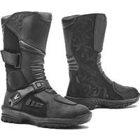                                                                                           |                                                                                           

## Modèles à 182,99 € :

 | Modèle | Photos |
|---|---|
|                                                                                           **REV-IT - PORTLAND**                                                                                                                                                                                        EN13634-2222                                                                                                                                                                                        **Pages fabricant :**                                                                                            - [chaussures-moto-portland-noir](https://www.revitsport.com/fr_fr/chaussures-moto-portland-noir)                                                                                            - [chaussures-moto-portland-verte-olive-noir](https://www.revitsport.com/fr_fr/chaussures-moto-portland-verte-olive-noir)                                                                                                                                                                                        **Lieu de fabrication :**                                                                                             Inconnu                                                                                                                                                                                        **De bonnes présentations :**                                                                                             [ Youtube : Urban-Rider - REVIT-Portland-Boot-Review](https://www.youtube.com/watch?v=m6BsYNTnd4k)                                                                                            [ Youtube : Urban-Rider - Top-5-Urban-Motorcycle-Boots-2022](https://www.youtube.com/watch?v=OzsGF3ItDMc)                                                                                                                                                                                        **Prix en ligne au moment de la rédaction :**                                                                                            - [182,99 € (motardinn)](https://www.tradeinn.com/motardinn/fr?products_search%5Bquery%5D=REVIT+PORTLAND)                                                                                            - [222,53 € (motoblouz)](https://www.motoblouz.com/recherche.html?q=REVIT+PORTLAND)                                                                                            - [269,99 € (fcmoto)](https://www.fc-moto.de/epages/fcm.sf/fr_FR/?ViewAction=FacetedSearchProducts&SearchString=REVIT+PORTLAND)                                                                                            - [269,99 € (dafymoto)](https://www.dafy-moto.com/recherche?string=REVIT%20PORTLAND)                                                                                                                                                                                        **Aide à la recherche :**                                                                                            *Rechercher en occasion (~50-130 €)*                                                                                            [ Leboncoin](https://www.leboncoin.fr/recherche?text=moto+REV+IT+PORTLAND&shippable=1&sort=price&order=asc) [ Vinted](https://www.vinted.fr/catalog?search_text=moto+REV+IT+PORTLAND&order=price_low_to_high) *Recherches diverses :*                                                                                            [ Google](https://www.google.com/search?q=moto+REV+IT+PORTLAND) [ Youtube](https://www.youtube.com/results?search_query=moto+REV+IT+PORTLAND)                                                                                            |                                                                                           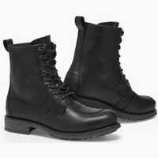                                                                                           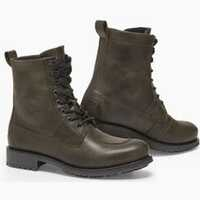                                                                                           |                                                                                           
|                                                                                           **REV-IT - PORTLAND LADIES**                                                                                                                                                                                        EN13634-2222                                                                                            ") Modèle femme                                                                                                                                                                                        **Pages fabricant :**                                                                                            - [chaussures-moto-portland-ladies-noir](https://www.revitsport.com/fr_fr/chaussures-moto-portland-ladies-noir)                                                                                            - [chaussures-moto-portland-ladies-verte-olive-noir](https://www.revitsport.com/fr_fr/chaussures-moto-portland-ladies-verte-olive-noir)                                                                                                                                                                                        **Lieu de fabrication :**                                                                                             Inconnu                                                                                                                                                                                        **De bonnes présentations :**                                                                                            [ Youtube : RevZilla - REV-IT-Portland-Women-s-Shoes-Review](https://www.youtube.com/watch?v=Wy4gTDyDybo)                                                                                                                                                                                        **Prix en ligne au moment de la rédaction :**                                                                                            - [182,99 € (motardinn)](https://www.tradeinn.com/motardinn/fr?products_search%5Bquery%5D=REVIT+PORTLAND%20FEMME)                                                                                            - [189,55 € (motoblouz)](https://www.motoblouz.com/recherche.html?q=REVIT+PORTLAND+FEMME)                                                                                            - [239,99 € (fcmoto)](https://www.fc-moto.de/epages/fcm.sf/fr_FR/?ViewAction=FacetedSearchProducts&SearchString=REVIT+PORTLAND%20DAMES)                                                                                            - [239,99 € (dafymoto)](https://www.dafy-moto.com/recherche?string=REVIT%20PORTLAND%20FEMME)                                                                                                                                                                                        **Aide à la recherche :**                                                                                            *Rechercher en occasion (~50-130 €)*                                                                                            [ Leboncoin](https://www.leboncoin.fr/recherche?text=moto+REV+IT+PORTLAND+LADIES&shippable=1&sort=price&order=asc) [ Vinted](https://www.vinted.fr/catalog?search_text=moto+REV+IT+PORTLAND+LADIES&order=price_low_to_high) *Recherches diverses :*                                                                                            [ Google](https://www.google.com/search?q=moto+REV+IT+PORTLAND+LADIES) [ Youtube](https://www.youtube.com/results?search_query=moto+REV+IT+PORTLAND+LADIES)                                                                                            |                                                                                           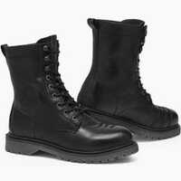                                                                                           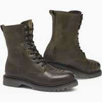                                                                                           |                                                                                           
|                                                                                           **REV-IT - PULSE H2O**                                                                                                                                                                                        EN13634-2222 WR                                                                                                                                                                                        **Pages fabricant :**                                                                                            - [bottes-moto-pulse-h2o-noir](https://www.revitsport.com/fr_fr/bottes-moto-pulse-h2o-noir)                                                                                                                                                                                        **Lieu de fabrication :**                                                                                             Inconnu                                                                                                                                                                                        **Caractéristiques :**                                                                                            ") Imperméable                                                                                                                                                                                        **Prix en ligne au moment de la rédaction :**                                                                                            - [182,99 € (motardinn)](https://www.tradeinn.com/motardinn/fr?products_search%5Bquery%5D=REVIT+PULSE%20H2O)                                                                                            - [197,80 € (motoblouz)](https://www.motoblouz.com/recherche.html?q=REVIT+PULSE+H2O)                                                                                            - [239,99 € (fcmoto)](https://www.fc-moto.de/epages/fcm.sf/fr_FR/?ViewAction=FacetedSearchProducts&SearchString=REVIT+PULSE%20H2O)                                                                                            - [239,99 € (dafymoto)](https://www.dafy-moto.com/recherche?string=REVIT%20PULSE%20H2O)                                                                                                                                                                                        **Aide à la recherche :**                                                                                            *Rechercher en occasion (~50-130 €)*                                                                                            [ Leboncoin](https://www.leboncoin.fr/recherche?text=moto+REV+IT+PULSE+H2O&shippable=1&sort=price&order=asc) [ Vinted](https://www.vinted.fr/catalog?search_text=moto+REV+IT+PULSE+H2O&order=price_low_to_high) *Recherches diverses :*                                                                                            [ Google](https://www.google.com/search?q=moto+REV+IT+PULSE+H2O) [ Youtube](https://www.youtube.com/results?search_query=moto+REV+IT+PULSE+H2O)                                                                                            |                                                                                                                                                                                      |                                                                                           

## Modèles à 182,66 € :

 | Modèle | Photos |
|---|---|
|                                                                                           **FORMA - BOULDER**                                                                                                                                                                                        EN13634-2222                                                                                            ") Modèle mixte                                                                                            ") Eté                                                                                                                                                                                        **Pages fabricant :**                                                                                            - [copy-of-boulder](https://www.formabootsusa.com/collections/dual-sport-adv-boots/products/copy-of-boulder)                                                                                            - [boulder-black](https://www.formabootsusa.com/collections/dual-sport-adv-boots/products/boulder-black)                                                                                            - [copy-of-boulder-1](https://www.formabootsusa.com/collections/dual-sport-adv-boots/products/copy-of-boulder-1)                                                                                            - [copy-of-boulder](https://www.formabootsusa.com/collections/off-road-boots/products/copy-of-boulder)                                                                                            - [boulder-black](https://www.formabootsusa.com/collections/off-road-boots/products/boulder-black)                                                                                            - [copy-of-boulder-1](https://www.formabootsusa.com/collections/off-road-boots/products/copy-of-boulder-1)                                                                                                                                                                                        **Lieu de fabrication :**                                                                                            Europe :                                                                                                                                                                                        ") Roumanie                                                                                                                                                                                                                                                                                   **Caractéristiques :**                                                                                            ") Cuir                                                                                            ") Respirant                                                                                                                                                                                        **Une bonne présentation :**                                                                                            [ Youtube : RevZilla - Forma-Boulder-Boots-Review-at-RevZilla-com](https://www.youtube.com/watch?v=695gLEpDgfo)                                                                                                                                                                                        **Prix en ligne au moment de la rédaction :**                                                                                            - [182,66 € (motoblouz)](https://www.motoblouz.com/recherche.html?q=FORMA+BOULDER)                                                                                            - [210,13 € (motardinn)](https://www.tradeinn.com/motardinn/fr?products_search%5Bquery%5D=FORMA+BOULDER)                                                                                            - [225,00 € (fcmoto)](https://www.fc-moto.de/epages/fcm.sf/fr_FR/?ViewAction=FacetedSearchProducts&SearchString=FORMA+BOULDER)                                                                                            - [246,44 € (dafymoto)](https://www.dafy-moto.com/recherche?string=FORMA%20BOULDER)                                                                                                                                                                                        **Aide à la recherche :**                                                                                            *Rechercher en occasion (~50-130 €)*                                                                                            [ Leboncoin](https://www.leboncoin.fr/recherche?text=moto+FORMA+BOULDER&shippable=1&sort=price&order=asc) [ Vinted](https://www.vinted.fr/catalog?search_text=moto+FORMA+BOULDER&order=price_low_to_high) *Recherches diverses :*                                                                                            [ Google](https://www.google.com/search?q=moto+FORMA+BOULDER) [ Youtube](https://www.youtube.com/results?search_query=moto+FORMA+BOULDER)                                                                                            |                                                                                           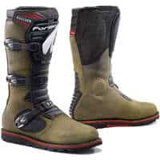                                                                                           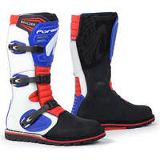                                                                                           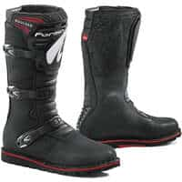                                                                                           |                                                                                           

## Modèles à 191,42 € :

 | Modèle | Photos |
|---|---|
|                                                                                           **FORMA - ADVENTURE**                                                                                                                                                                                        EN13634-2222 WR                                                                                            ") Modèle mixte                                                                                            ") Eté                                                                                                                                                                                        **Pages fabricant :**                                                                                            - [adventure-brown](https://www.formabootsusa.com/collections/dual-sport-adv-boots/products/adventure-brown)                                                                                            - [adventure-black](https://www.formabootsusa.com/collections/dual-sport-adv-boots/products/adventure-black)                                                                                                                                                                                        **Lieu de fabrication :**                                                                                            Europe :                                                                                                                                                                                        ") Roumanie                                                                                                                                                                                                                                                                                   **Caractéristiques :**                                                                                            ") Cuir                                                                                            ") Respirant                                                                                            ") Imperméable                                                                                                                                                                                        **De bonnes présentations :**                                                                                            [ Youtube : RevZilla - Forma-Adventure-Boots-Review-at-RevZilla-com](https://www.youtube.com/watch?v=kZ4PE89u4zM)                                                                                            [ Article : Motoblouz - Bottes cross Forma Adventure Low, testées et validées par Paola, ...](https://www.motoblouz.com/enjoytheride/equipement-motard/22586-bottes-cross-forma-adventure-low-essai-2023-01-27)                                                                                            [ Article : Motoblouz - Vidéo : Essai bottes dual sports Forma Adventure](https://www.motoblouz.com/enjoytheride/equipement-motard/9626-botte-forma-adventure-avis-video-2016-11-24)                                                                                                                                                                                         **Prix en ligne au moment de la rédaction :**                                                                                            - [191,42 € (motoblouz)](https://www.motoblouz.com/recherche.html?q=FORMA+ADVENTURE)                                                                                            - [212,84 € (motardinn)](https://www.tradeinn.com/motardinn/fr?products_search%5Bquery%5D=FORMA+ADVENTURE)                                                                                            - [213,89 € (dafymoto)](https://www.dafy-moto.com/recherche?string=FORMA%20ADVENTURE)                                                                                            - [223,92 € (fcmoto)](https://www.fc-moto.de/epages/fcm.sf/fr_FR/?ViewAction=FacetedSearchProducts&SearchString=FORMA+ADVENTURE)                                                                                                                                                                                        **Aide à la recherche :**                                                                                            *Rechercher en occasion (~60-130 €)*                                                                                            [ Leboncoin](https://www.leboncoin.fr/recherche?text=moto+FORMA+ADVENTURE&shippable=1&sort=price&order=asc) [ Vinted](https://www.vinted.fr/catalog?search_text=moto+FORMA+ADVENTURE&order=price_low_to_high) *Recherches diverses :*                                                                                            [ Google](https://www.google.com/search?q=moto+FORMA+ADVENTURE) [ Youtube](https://www.youtube.com/results?search_query=moto+FORMA+ADVENTURE)                                                                                            |                                                                                                                                                                                      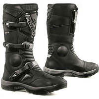                                                                                           |                                                                                           

## Modèles à 194,99 € :

 | Modèle | Photos |
|---|---|
|                                                                                           **FORMA - TERRA EVO LOW**                                                                                                                                                                                        EN13634-2222 WR                                                                                            ") Modèle mixte                                                                                                                                                                                        **Pages fabricant :**                                                                                            - [terra-evo-low-brown](https://www.formabootsusa.com/collections/dual-sport-adv-boots/products/terra-evo-low-brown)                                                                                            - [terra-evo-low-black](https://www.formabootsusa.com/collections/dual-sport-adv-boots/products/terra-evo-low-black)                                                                                            - [terra-evo-low-black](https://www.formabootsusa.com/collections/off-road-boots/products/terra-evo-low-black)                                                                                            - [terra-evo-low-brown](https://www.formabootsusa.com/collections/off-road-boots/products/terra-evo-low-brown)                                                                                                                                                                                        **Lieu de fabrication :**                                                                                            Europe :                                                                                                                                                                                        ") Roumanie                                                                                                                                                                                                                                                                                   **Caractéristiques :**                                                                                            ") Cuir                                                                                            ") Imperméable                                                                                                                                                                                        **De bonnes présentations :**                                                                                            [ Youtube : RevZilla - Forma-Terra-EVO-EVO-Low-Boots-Review](https://www.youtube.com/watch?v=a-1NCfGEtyk)                                                                                             [ Article : motostation - Test Forma Terra Evo Low WP : demi bottes, full tout terrain](https://moto-station.com/moto-revue/test-equipement/test-forma-terra-evo-low-wp-demi-bottes-full-tout-terrain/505470)                                                                                                                                                                                         **Prix en ligne au moment de la rédaction :**                                                                                            - [194,99 € (motoblouz)](https://www.motoblouz.com/recherche.html?q=FORMA+TERRA+EVO+LOW)                                                                                            - [229,95 € (fcmoto)](https://www.fc-moto.de/epages/fcm.sf/fr_FR/?ViewAction=FacetedSearchProducts&SearchString=FORMA+TERRA%20EVO%20LOW)                                                                                            - [229,72 € (motardinn)](https://www.tradeinn.com/motardinn/fr?products_search%5Bquery%5D=FORMA+TERRA%20EVO%20LOW)                                                                                            - [306,89 € (dafymoto)](https://www.dafy-moto.com/recherche?string=FORMA%20TERRA%20EVO%20LOW)                                                                                                                                                                                        **Aide à la recherche :**                                                                                            *Rechercher en occasion (~60-140 €)*                                                                                            [ Leboncoin](https://www.leboncoin.fr/recherche?text=moto+FORMA+TERRA+EVO+LOW&shippable=1&sort=price&order=asc) [ Vinted](https://www.vinted.fr/catalog?search_text=moto+FORMA+TERRA+EVO+LOW&order=price_low_to_high) *Recherches diverses :*                                                                                            [ Google](https://www.google.com/search?q=moto+FORMA+TERRA+EVO+LOW) [ Youtube](https://www.youtube.com/results?search_query=moto+FORMA+TERRA+EVO+LOW)                                                                                            |                                                                                           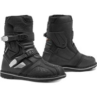                                                                                           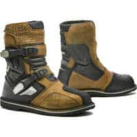                                                                                           |                                                                                           

## Modèles à 205,49 € :

 | Modèle | Photos |
|---|---|
|                                                                                           **REV-IT - LINK GTX**                                                                                                                                                                                        EN13634-2222 WR                                                                                            ") Eté                                                                                                                                                                                        **Pages fabricant :**                                                                                            - [bottes-moto-link-gtx-noir](https://www.revitsport.com/fr_fr/bottes-moto-link-gtx-noir)                                                                                                                                                                                        **Lieu de fabrication :**                                                                                             Inconnu                                                                                                                                                                                        **Caractéristiques :**                                                                                            ") Cuir                                                                                            ") Respirant                                                                                             (image modifiée : Tabler-icons)") Imperméable (Gore-Tex)                                                                                                                                                                                        **De bonnes présentations :**                                                                                             [ Youtube : Français-Champion-Helmets - Revit-Link-GTX-Bottes-Revue-ChampionHelmets-com](https://www.youtube.com/watch?v=XcMT-NEoqB8)                                                                                                                                                                                        **Prix en ligne au moment de la rédaction :**                                                                                            - [205,49 € (motardinn)](https://www.tradeinn.com/motardinn/fr?products_search%5Bquery%5D=REVIT+LINK%20GTX)                                                                                            - [222,53 € (motoblouz)](https://www.motoblouz.com/recherche.html?q=REVIT+LINK+GTX)                                                                                            - [269,99 € (fcmoto)](https://www.fc-moto.de/epages/fcm.sf/fr_FR/?ViewAction=FacetedSearchProducts&SearchString=REVIT+LINK%20GTX)                                                                                            - [269,99 € (dafymoto)](https://www.dafy-moto.com/recherche?string=REVIT%20LINK%20GTX)                                                                                                                                                                                        **Aide à la recherche :**                                                                                            *Rechercher en occasion (~60-140 €)*                                                                                            [ Leboncoin](https://www.leboncoin.fr/recherche?text=moto+REV+IT+LINK&shippable=1&sort=price&order=asc) [ Vinted](https://www.vinted.fr/catalog?search_text=moto+REV+IT+LINK&order=price_low_to_high) *Recherches diverses :*                                                                                            [ Google](https://www.google.com/search?q=moto+REV+IT+LINK) [ Youtube](https://www.youtube.com/results?search_query=moto+REV+IT+LINK)                                                                                            |                                                                                                                                                                                      |                                                                                           

## Modèles à 214,11 € :

 | Modèle | Photos |
|---|---|
|                                                                                           **FORMA - BOULDER COMP**                                                                                                                                                                                        EN13634-2222                                                                                            ") Modèle homme                                                                                            ") Eté                                                                                                                                                                                        **Pages fabricant :**                                                                                            - [boulder-comp](https://www.formabootsusa.com/collections/off-road-boots/products/boulder-comp)                                                                                                                                                                                        **Lieu de fabrication :**                                                                                            Europe :                                                                                                                                                                                        ") Roumanie                                                                                                                                                                                                                                                                                   **Caractéristiques :**                                                                                            ") Cuir                                                                                            ") Respirant                                                                                                                                                                                        **Prix en ligne au moment de la rédaction :**                                                                                            - [214,11 € (motoblouz)](https://www.motoblouz.com/recherche.html?q=FORMA+BOULDER+COMP)                                                                                            - [242,16 € (motardinn)](https://www.tradeinn.com/motardinn/fr?products_search%5Bquery%5D=FORMA+BOULDER%20COMP)                                                                                            - [260,39 € (dafymoto)](https://www.dafy-moto.com/recherche?string=FORMA%20BOULDER%20COMP)                                                                                            - [Rechercher (fcmoto)](https://www.fc-moto.de/epages/fcm.sf/fr_FR/?ViewAction=FacetedSearchProducts&SearchString=FORMA+BOULDER+COMP)                                                                                                                                                                                        **Aide à la recherche :**                                                                                            *Rechercher en occasion (~60-150 €)*                                                                                            [ Leboncoin](https://www.leboncoin.fr/recherche?text=moto+FORMA+BOULDER+COMP&shippable=1&sort=price&order=asc) [ Vinted](https://www.vinted.fr/catalog?search_text=moto+FORMA+BOULDER+COMP&order=price_low_to_high) *Recherches diverses :*                                                                                            [ Google](https://www.google.com/search?q=moto+FORMA+BOULDER+COMP) [ Youtube](https://www.youtube.com/results?search_query=moto+FORMA+BOULDER+COMP)                                                                                            |                                                                                                                                                                                      |                                                                                           

## Modèles à 289,99 € :

 | Modèle | Photos |
|---|---|
|                                                                                           **REV-IT - PIONEER GTX**                                                                                                                                                                                        EN13634-2222 WR                                                                                                                                                                                        **Pages fabricant :**                                                                                            - [bottes-moto-pioneer-gtx-noir](https://www.revitsport.com/fr_fr/bottes-moto-pioneer-gtx-noir)                                                                                                                                                                                        **Lieu de fabrication :**                                                                                             Inconnu                                                                                                                                                                                        **Caractéristiques :**                                                                                             (image modifiée : Tabler-icons)") Imperméable (Gore-Tex)                                                                                                                                                                                        **De bonnes présentations :**                                                                                            [ Youtube : RevZilla - REV-IT-Pioneer-GTX-Boots-Review](https://www.youtube.com/watch?v=hGaVIYGloDE)                                                                                            [ Youtube : Champion-Helmets - Revit-Pioneer-GTX-Boots-ChampionHelmets-com](https://www.youtube.com/watch?v=YKvUP8WrhnE)                                                                                            [ Youtube : Français-Champion-Helmets - Revit-Pioneer-GTX-Bottes-Revue-ChampionHelmets-com](https://www.youtube.com/watch?v=ReVrTf2bVIM)                                                                                                                                                                                        **Prix en ligne au moment de la rédaction :**                                                                                            - [289,99 € (motardinn)](https://www.tradeinn.com/motardinn/fr?products_search%5Bquery%5D=REVIT+PIONEER%20GTX)                                                                                            - [329,72 € (motoblouz)](https://www.motoblouz.com/recherche.html?q=REVIT+PIONEER+GTX)                                                                                            - [399,99 € (fcmoto)](https://www.fc-moto.de/epages/fcm.sf/fr_FR/?ViewAction=FacetedSearchProducts&SearchString=REVIT+PIONEER%20GTX)                                                                                            - [399,99 € (dafymoto)](https://www.dafy-moto.com/recherche?string=REVIT%20PIONEER%20GTX)                                                                                                                                                                                        **Aide à la recherche :**                                                                                            *Rechercher en occasion (~90-200 €)*                                                                                            [ Leboncoin](https://www.leboncoin.fr/recherche?text=moto+REV+IT+PIONEER&shippable=1&sort=price&order=asc) [ Vinted](https://www.vinted.fr/catalog?search_text=moto+REV+IT+PIONEER&order=price_low_to_high) *Recherches diverses :*                                                                                            [ Google](https://www.google.com/search?q=moto+REV+IT+PIONEER) [ Youtube](https://www.youtube.com/results?search_query=moto+REV+IT+PIONEER)                                                                                            |                                                                                           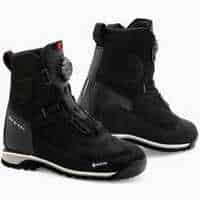                                                                                           |                                                                                           

## Modèles à 312,99 € :

 | Modèle | Photos |
|---|---|
|                                                                                           **ALPINESTARS - SP X BOA**                                                                                                                                                                                        EN13634-2222                                                                                            ") Eté                                                                                                                                                                                        **Pages fabricant :**                                                                                            - [sp-x-boa-boots](https://www.alpinestars.com/products/sp-x-boa-boots)                                                                                                                                                                                        **Lieu de fabrication :**                                                                                            Europe / Asie :                                                                                                                                                                                        ") Roumanie                                                                                                                                                                                       ") Chine                                                                                                                                                                                                                                                                                   **Caractéristiques :**                                                                                            ") Respirant                                                                                                                                                                                        **Prix en ligne au moment de la rédaction :**                                                                                            - [312,99 € (motardinn)](https://www.tradeinn.com/motardinn/fr?products_search%5Bquery%5D=ALPINESTARS+SP%20X%20BOA)                                                                                            - [341,95 € (fcmoto)](https://www.fc-moto.de/epages/fcm.sf/fr_FR/?ViewAction=FacetedSearchProducts&SearchString=ALPINESTARS+SP%20X%20BOA)                                                                                            - [341,90 € (motoblouz)](https://www.motoblouz.com/recherche.html?q=ALPINESTARS+SP+X+BOA)                                                                                            - [Rechercher (dafymoto)](https://www.dafy-moto.com/recherche?string=ALPINESTARS+SP+X+BOA)                                                                                                                                                                                        **Aide à la recherche :**                                                                                            *Rechercher en occasion (~90-220 €)*                                                                                            [ Leboncoin](https://www.leboncoin.fr/recherche?text=moto+ALPINESTARS+SP+X+BOA&shippable=1&sort=price&order=asc) [ Vinted](https://www.vinted.fr/catalog?search_text=moto+ALPINESTARS+SP+X+BOA&order=price_low_to_high) *Recherches diverses :*                                                                                            [ Google](https://www.google.com/search?q=moto+ALPINESTARS+SP+X+BOA) [ Youtube](https://www.youtube.com/results?search_query=moto+ALPINESTARS+SP+X+BOA)                                                                                            |                                                                                           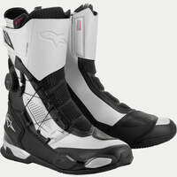                                                                                           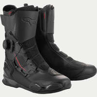                                                                                           |                                                                                           

## Modèles à 321,47 € :

 | Modèle | Photos |
|---|---|
|                                                                                           **FORMA - PREDATOR 2 0**                                                                                                                                                                                        EN13634-2222                                                                                            ") Modèle homme                                                                                                                                                                                        **Pages fabricant :**                                                                                            - [predator-2-0-white-blue-red](https://www.formabootsusa.com/collections/off-road-boots/products/predator-2-0-white-blue-red)                                                                                            - [predator-2-black](https://www.formabootsusa.com/collections/off-road-boots/products/predator-2-black)                                                                                            - [predator-2-white](https://www.formabootsusa.com/collections/off-road-boots/products/predator-2-white)                                                                                            - [predator-2-white-red](https://www.formabootsusa.com/collections/off-road-boots/products/predator-2-white-red)                                                                                                                                                                                        **Lieu de fabrication :**                                                                                            Europe :                                                                                                                                                                                        ") Roumanie                                                                                                                                                                                                                                                                                   **Une bonne présentation :**                                                                                            [ Article : Motoblouz - Essai bottes cross Forma Predator](https://www.motoblouz.com/enjoytheride/equipement-tout-terrain/7682-bottes-cross-forma-predator-2015-07-30)                                                                                                                                                                                        **Prix en ligne au moment de la rédaction :**                                                                                            - [321,47 € (motoblouz)](https://www.motoblouz.com/recherche.html?q=FORMA+PREDATOR+2+0)                                                                                            - [378,00 € (fcmoto)](https://www.fc-moto.de/epages/fcm.sf/fr_FR/?ViewAction=FacetedSearchProducts&SearchString=FORMA+PREDATOR%202%200)                                                                                            - [380,27 € (motardinn)](https://www.tradeinn.com/motardinn/fr?products_search%5Bquery%5D=FORMA+PREDATOR%202%200)                                                                                            - [413,84 € (dafymoto)](https://www.dafy-moto.com/recherche?string=FORMA%20PREDATOR%202%200)                                                                                                                                                                                        **Aide à la recherche :**                                                                                            *Rechercher en occasion (~100-220 €)*                                                                                            [ Leboncoin](https://www.leboncoin.fr/recherche?text=moto+FORMA+PREDATOR+2+0&shippable=1&sort=price&order=asc) [ Vinted](https://www.vinted.fr/catalog?search_text=moto+FORMA+PREDATOR+2+0&order=price_low_to_high) *Recherches diverses :*                                                                                            [ Google](https://www.google.com/search?q=moto+FORMA+PREDATOR+2+0) [ Youtube](https://www.youtube.com/results?search_query=moto+FORMA+PREDATOR+2+0)                                                                                            |                                                                                           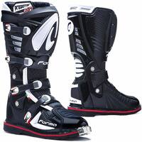                                                                                                                                                                                      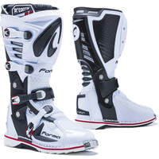                                                                                           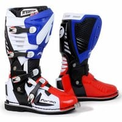                                                                                           |                                                                                           
|                                                                                           **FORMA - PREDATOR 2 0 ENDURO**                                                                                                                                                                                        EN13634-2222                                                                                            ") Modèle homme                                                                                                                                                                                        **Pages fabricant :**                                                                                            - [predator-2-enduro](https://www.formabootsusa.com/collections/dual-sport-adv-boots/products/predator-2-enduro)                                                                                            - [predator-2-enduro](https://www.formabootsusa.com/collections/off-road-boots/products/predator-2-enduro)                                                                                                                                                                                        **Lieu de fabrication :**                                                                                            Europe :                                                                                                                                                                                        ") Roumanie                                                                                                                                                                                                                                                                                   **Prix en ligne au moment de la rédaction :**                                                                                            - [321,47 € (motoblouz)](https://www.motoblouz.com/recherche.html?q=FORMA+PREDATOR+2+0+ENDURO)                                                                                            - [359,45 € (motardinn)](https://www.tradeinn.com/motardinn/fr?products_search%5Bquery%5D=FORMA+PREDATOR%202%200%20ENDURO)                                                                                            - [378,00 € (fcmoto)](https://www.fc-moto.de/epages/fcm.sf/fr_FR/?ViewAction=FacetedSearchProducts&SearchString=FORMA+PREDATOR%202%200%20ENDURO)                                                                                            - [413,84 € (dafymoto)](https://www.dafy-moto.com/recherche?string=FORMA%20PREDATOR%202%200%20ENDURO)                                                                                                                                                                                        **Aide à la recherche :**                                                                                            *Rechercher en occasion (~100-220 €)*                                                                                            [ Leboncoin](https://www.leboncoin.fr/recherche?text=moto+FORMA+PREDATOR+2+0+ENDURO&shippable=1&sort=price&order=asc) [ Vinted](https://www.vinted.fr/catalog?search_text=moto+FORMA+PREDATOR+2+0+ENDURO&order=price_low_to_high) *Recherches diverses :*                                                                                            [ Google](https://www.google.com/search?q=moto+FORMA+PREDATOR+2+0+ENDURO) [ Youtube](https://www.youtube.com/results?search_query=moto+FORMA+PREDATOR+2+0+ENDURO)                                                                                            |                                                                                           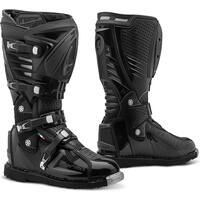                                                                                           |                                                                                           

## Modèles à 332 € :

 | Modèle | Photos |
|---|---|
|                                                                                           **REV-IT - DISCOVERY GTX**                                                                                                                                                                                        EN13634-2222 WR IPS                                                                                                                                                                                        **Pages fabricant :**                                                                                            - [bottes-moto-discovery-gtx-marron](https://www.revitsport.com/fr_fr/bottes-moto-discovery-gtx-marron)                                                                                            - [bottes-moto-discovery-gtx-noir](https://www.revitsport.com/fr_fr/bottes-moto-discovery-gtx-noir)                                                                                                                                                                                        **Lieu de fabrication :**                                                                                             Inconnu                                                                                                                                                                                        **Caractéristiques :**                                                                                             (image modifiée : Tabler-icons)") Imperméable (Gore-Tex)                                                                                                                                                                                        **De bonnes présentations :**                                                                                            [ Youtube : RevZilla - REV-IT-Discovery-GTX-Boots-Review](https://www.youtube.com/watch?v=mUPfQ_K-PFc)                                                                                             [ Youtube : Français-Champion-Helmets - Revit-Discovery-GTX-Bottes-Revue-ChampionHelmets-com](https://www.youtube.com/watch?v=HPVKWMwTgPU)                                                                                                                                                                                        **Prix en ligne au moment de la rédaction :**                                                                                            - [332 € (motardinn)](https://www.tradeinn.com/motardinn/fr?products_search%5Bquery%5D=REVIT+DISCOVERY%20GTX)                                                                                            - [378,31 € (motoblouz)](https://www.motoblouz.com/recherche.html?q=REVIT+DISCOVERY+GTX)                                                                                            - [469,99 € (fcmoto)](https://www.fc-moto.de/epages/fcm.sf/fr_FR/?ViewAction=FacetedSearchProducts&SearchString=REVIT+DISCOVERY%20GTX)                                                                                            - [469,99 € (dafymoto)](https://www.dafy-moto.com/recherche?string=REVIT%20DISCOVERY%20GTX)                                                                                                                                                                                        **Aide à la recherche :**                                                                                            *Rechercher en occasion (~100-230 €)*                                                                                            [ Leboncoin](https://www.leboncoin.fr/recherche?text=moto+REV+IT+DISCOVERY&shippable=1&sort=price&order=asc) [ Vinted](https://www.vinted.fr/catalog?search_text=moto+REV+IT+DISCOVERY&order=price_low_to_high) *Recherches diverses :*                                                                                            [ Google](https://www.google.com/search?q=moto+REV+IT+DISCOVERY) [ Youtube](https://www.youtube.com/results?search_query=moto+REV+IT+DISCOVERY)                                                                                            |                                                                                                                                                                                                                                                                                 |                                                                                           

## Modèles à 509,99 € :

 | Modèle | Photos |
|---|---|
|                                                                                           **REV-IT - EXPEDITION GTX**                                                                                                                                                                                        EN13634-2222 WR IPS                                                                                                                                                                                        **Pages fabricant :**                                                                                            - [bottes-moto-expedition-gtx-noir-gris](https://www.revitsport.com/fr_fr/bottes-moto-expedition-gtx-noir-gris)                                                                                                                                                                                        **Lieu de fabrication :**                                                                                             Inconnu                                                                                                                                                                                        **Caractéristiques :**                                                                                            ") Cuir                                                                                             (image modifiée : Tabler-icons)") Imperméable (Gore-Tex)                                                                                                                                                                                        **De bonnes présentations :**                                                                                             [ Youtube : Français-Champion-Helmets - Revit-Expedition-GTX-Bottes-Revue-ChampionHelmets-com](https://www.youtube.com/watch?v=CpaYAnpwv7U)                                                                                                                                                                                        **Prix en ligne au moment de la rédaction :**                                                                                            - [509,99 € (motardinn)](https://www.tradeinn.com/motardinn/fr?products_search%5Bquery%5D=REVIT+EXPEDITION%20GTX)                                                                                            - [547,38 € (motoblouz)](https://www.motoblouz.com/recherche.html?q=REVIT+EXPEDITION+GTX)                                                                                            - [679,99 € (fcmoto)](https://www.fc-moto.de/epages/fcm.sf/fr_FR/?ViewAction=FacetedSearchProducts&SearchString=REVIT+EXPEDITION%20GTX)                                                                                            - [679,99 € (dafymoto)](https://www.dafy-moto.com/recherche?string=REVIT%20EXPEDITION%20GTX)                                                                                                                                                                                        **Aide à la recherche :**                                                                                            *Rechercher en occasion (~150-360 €)*                                                                                            [ Leboncoin](https://www.leboncoin.fr/recherche?text=moto+REV+IT+EXPEDITION&shippable=1&sort=price&order=asc) [ Vinted](https://www.vinted.fr/catalog?search_text=moto+REV+IT+EXPEDITION&order=price_low_to_high) *Recherches diverses :*                                                                                            [ Google](https://www.google.com/search?q=moto+REV+IT+EXPEDITION) [ Youtube](https://www.youtube.com/results?search_query=moto+REV+IT+EXPEDITION)                                                                                            |                                                                                                                                                                                      |                                                                                           

---

[^1]: **Hauteur de la tige avant/arrière du mollet** ( Norme _CE EN 13634-2017_) :  
    Mesurée à partir du sol :
        1. Niveau 1 : 10,3 cm/6,4 cm en dessous de 36, jusqu'à 12,1 cm / 7,3 cm au dessus de 45.
        2. Niveau 2 : 16,2 cm/11,3 cm en dessous de 36, jusqu'à 19,2 cm / 13,1 cm au dessus de 45.
[^2]: **Résistance à l'abrasion** ( Norme _CE EN 13634-2017_) :  
       Nombre de secondes pour traverser tige+doublure avec une bande abrasive de grain 60 qui tourne à 8 m/s (zone B = risque fort, zone A = reste de la chaussure)
        1. Niveau 1 : 1,5 s zone A, 5 s zone B
        2. Niveau 2 : 2,5 s zone A, 12 s zone B
[^3]: **Résistance à la perforation/coupure** ( Norme _CE EN 13634-2017_) :  
       Une lame est lancée à 2,8 m/s sur tige+doublure et on mesure la pénétration :
        1. Niveau 1 : < 25 mm
        2. Niveau 2 : < 15 mm
[^4]: **Résistance à la torsion** ( Norme _CE EN 13634-2017_) :  
       Mesure de la force nécessaire pour déformer la semelle de 2 cm :
        1. Niveau 1 : > 1 kN
        2. Niveau 2 : > 1,5 kN  
      

    

