_(This post was automatically translated with [www.DeepL.com/Translator](http://www.DeepL.com/Translator))_

> 2023 UPDATE: [Inventory of the most protective motorcycle high boots (EN 13634 : 2222) in June 2023]()

This article lists the high motorcycle boots that I found on the manufacturers' websites, and whose level of protection is at the maximum of the current standard: 2222.

There is a wide variety of styles, most models are unisex but there are at least 2 very feminine models. The first prices are around 100 euros (2 OJ models and the only DXR model at this level which happens to be a women's high boot).

<!--more-->

I put the Motoblouz/Dafy/MotardInn link and an idea of prices when possible _(note: I can get a few cents if you go through one of my links to buy from the Motoblouz site)_.

I'll cover the most protective shoes/short boots (1222) in another article.

> _Edit of 01/10/2022: Added Vinted and Leboncoin._ links.  
> _Edit of 03/11/2022: Addition of Oxford._

# The EN 13634:2017 standard

The European standard EN 13634:2017 requires to display on the labels of motorcycle shoes/boots precise information on their level of protection:

- The first number indicates the height of the boot[^1] (1: low, 2: high), it is especially interesting in addition to the next 3 that assess the level of protection of the shoe for a specific hazard;
- Abrasion resistance[^2] ;
- Puncture resistance[^3] ;
- Resistance to torsion/crushing[^4].

Today only 2 levels exist for each, 1 and 2.

Common additional certifications :

- IPA : Malleolus protection
- IPS : Protection of the tibia
- WR : Resistance to water penetration
- FO : Resistance to hydrocarbons

---

Note on previous versions of EN 13634:  
If you come across a boot with this certification with a year lower than 2017, the shaft height was not mentioned, the 3 numbers shown are the 3 levels of protection._

---

# Note on manufacturers and transparency

Few manufacturers are transparent on their websites about the certification their boots have received. The information is often missing or partial, and even from those who provide it, it is often lost in a PDF file or an image.

The ones where I found this information are :

- [DXR (Motoblouz)](https://www.motoblouz.com): The PDF "certificate of compliance" usually contains the certification level;
- [FORMA (American site)](https://www.formabootsusa.com/): The European site doesn't give any info, but the certifications are visible on the US site - too bad because FORMA has many very protective models;
- [FURYGAN](https://www.furygan.com/): The PDF "data sheet" sometimes contains the certification level _(note: No 2222 models)_ ;
- [IXON](https://www.ixon.com/fra-fr/): Certification is present as an image _(note: No 2222 models)_ ;
- [REV'IT](https://www.revitsport.com/fr/): Certification is clearly indicated in the text of the page;
- [OJ](https://ojworld.it/): Certification is clearly indicated in the text of the page;
- [OXFORD](https://www.oxfordproducts.com): Certification is sometimes indicated in the text of the page.

The list (plethora) of other manufacturers that I have looked at but whose sites do not publish the certification levels of their boots can be found in the appendix at the end of the document.  
If one of them evolves or if you know of others, do not hesitate to tell me in comments, and I will add them to the next version of this document.

# Inventory of high boots EN 13634:2017/2222

## DXR :

 | Modèle | Photos |
|---|---|
|            **[DXR - SILVRETTA](https://www.motoblouz.com/vente-bottes-dxr-silvretta-200519.html?color=Brown)**             EN-13634-2017-2 2 2 2 IPA             Price online at time of writing:  - [99,90 €](https://pkw.motoblouz.com/?P4122157BDFF171&redir=https%3A%2F%2Fwww.motoblouz.com%2Frecherche%2FDXR%2520SILVRETTA.html) (Motoblouz)   - [Search on Dafy](https://www.dafy-moto.com/recherche?string=DXR%20SILVRETTA)    To look for them in second hand :              | 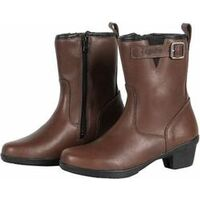 |

## FORMA :

 | Modèle | Photos |
|---|---|
|            **[FORMA - ADV TOURER](https://www.formabootsusa.com/collections/road-boots/products/adv-tourer-black)**             EN-13634-2017-2 2 2 2 WR             Price online at time of writing:  - [199,94 €](https://pkw.motoblouz.com/?P4122157BDFF171&redir=https%3A%2F%2Fwww.motoblouz.com%2Frecherche%2FFORMA%2520ADV%2520TOURER.html) (Motoblouz)   - [213,89 €](https://www.dafy-moto.com/recherche?string=FORMA%20ADV%20TOURER) (Dafy)     To look for them in second hand :              |  |
|            **[FORMA - ADV TOURER LADY](https://www.formabootsusa.com/collections/womens/products/adv-tourer-lady)**             EN-13634-2017-2 2 2 2 WR             Price online at time of writing:  - [199,94 €](https://pkw.motoblouz.com/?P4122157BDFF171&redir=https%3A%2F%2Fwww.motoblouz.com%2Frecherche%2FFORMA%2520ADV%2520TOURER%2520LADY.html) (Motoblouz)   - [213,89 €](https://www.dafy-moto.com/recherche?string=FORMA%20ADV%20TOURER%20LADY) (Dafy)     To look for them in second hand :              |  |
|            **[FORMA - ADVENTURE](https://www.formabootsusa.com/collections/dual-sport-adv-boots/products/adventure-brown)**             EN-13634-2017-2 2 2 2 WR             Price online at time of writing:  - [198,90 €](https://pkw.motoblouz.com/?P4122157BDFF171&redir=https%3A%2F%2Fwww.motoblouz.com%2Frecherche%2FFORMA%2520ADVENTURE.html) (Motoblouz)   - [213,89 €](https://www.dafy-moto.com/recherche?string=FORMA%20ADVENTURE) (Dafy)     To look for them in second hand :              | 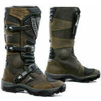 |
|            **[FORMA - ADVENTURE LOW](https://www.formabootsusa.com/collections/dual-sport-adv-boots/products/adventure-low-brown)**             EN-13634-2017-2 2 2 2 WR             Price online at time of writing:  - [198,90 €](https://pkw.motoblouz.com/?P4122157BDFF171&redir=https%3A%2F%2Fwww.motoblouz.com%2Frecherche%2FFORMA%2520ADVENTURE%2520LOW.html) (Motoblouz)   - [213,89 €](https://www.dafy-moto.com/recherche?string=FORMA%20ADVENTURE%20LOW) (Dafy)     To look for them in second hand :              |  |
|            **[FORMA - AVENUE]()**             EN-13634-2017-2 2 2 2 WR             Price online at time of writing:  - [Search on Motoblouz](https://pkw.motoblouz.com/?P4122157BDFF171&redir=https%3A%2F%2Fwww.motoblouz.com%2Frecherche%2FFORMA%2520AVENUE.html)   - [130,19 €](https://www.dafy-moto.com/recherche?string=FORMA%20AVENUE) (Dafy)     To look for them in second hand :              |  |
|            **[FORMA - BOULDER](https://www.formabootsusa.com/collections/off-road-boots/products/boulder-brown)**             EN-13634-2017-2 2 2 2             Price online at time of writing:  - [237,00 €](https://pkw.motoblouz.com/?P4122157BDFF171&redir=https%3A%2F%2Fwww.motoblouz.com%2Frecherche%2FFORMA%2520BOULDER.html) (Motoblouz)   - [246,44 €](https://www.dafy-moto.com/recherche?string=FORMA%20BOULDER) (Dafy)     To look for them in second hand :              |  |
|            **[FORMA - CAPE HORN HDry](https://www.formabootsusa.com/collections/road-boots/products/cape-horn)**             EN-13634-2017-2 2 2 2 WR             Price online at time of writing:  - [Search on Motoblouz](https://pkw.motoblouz.com/?P4122157BDFF171&redir=https%3A%2F%2Fwww.motoblouz.com%2Frecherche%2FFORMA%2520CAPE%2520HORN%2520HDry.html)   - [246,44 €](https://www.dafy-moto.com/recherche?string=FORMA%20CAPE%20HORN%20HDry) (Dafy)     To look for them in second hand :              |  |
|            **[FORMA - CRYSTAL](https://www.formabootsusa.com/collections/womens/products/crystal)**             EN-13634-2017-2 2 2 2 WR             Price online at time of writing:  - [153,40 €](https://pkw.motoblouz.com/?P4122157BDFF171&redir=https%3A%2F%2Fwww.motoblouz.com%2Frecherche%2FFORMA%2520CRYSTAL.html) (Motoblouz)   - [153,44 €](https://www.dafy-moto.com/recherche?string=FORMA%20CRYSTAL) (Dafy)     To look for them in second hand :              |  |
|            **[FORMA - EAGLE](https://www.formabootsusa.com/collections/womens/products/eagle-brown)**             EN-13634-2017-2 2 2 2 WR             Price online at time of writing:  - [199,90 €](https://pkw.motoblouz.com/?P4122157BDFF171&redir=https%3A%2F%2Fwww.motoblouz.com%2Frecherche%2FFORMA%2520EAGLE.html) (Motoblouz)   - [199,94 €](https://www.dafy-moto.com/recherche?string=FORMA%20EAGLE) (Dafy)     To look for them in second hand :              | 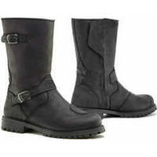 |
|            **[FORMA - JASPER](https://www.formabootsusa.com/collections/road-boots/products/jasper)**             EN-13634-2017-2 2 2 2 WR             Price online at time of writing:  - [204,50 €](https://pkw.motoblouz.com/?P4122157BDFF171&redir=https%3A%2F%2Fwww.motoblouz.com%2Frecherche%2FFORMA%2520JASPER.html) (Motoblouz)   - [176,69 €](https://www.dafy-moto.com/recherche?string=FORMA%20JASPER) (Dafy)     To look for them in second hand :              |  |
|            **[FORMA - LEGACY](https://www.formabootsusa.com/collections/ride-urban/products/legacy)**             EN-13634-2017-2 2 2 2 WR             Price online at time of writing:  - [195,29 €](https://pkw.motoblouz.com/?P4122157BDFF171&redir=https%3A%2F%2Fwww.motoblouz.com%2Frecherche%2FFORMA%2520LEGACY.html) (Motoblouz)   - [204,59 €](https://www.dafy-moto.com/recherche?string=FORMA%20LEGACY) (Dafy)     To look for them in second hand :              | 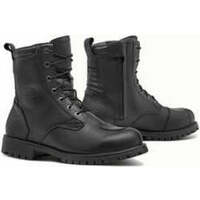 |
|            **[FORMA - PREDATOR 2-0](https://www.formabootsusa.com/collections/off-road-boots/products/predator-2-black)**             EN-13634-2017-2 2 2 2             Price online at time of writing:  - [Search on Motoblouz](https://pkw.motoblouz.com/?P4122157BDFF171&redir=https%3A%2F%2Fwww.motoblouz.com%2Frecherche%2FFORMA%2520PREDATOR%25202-0.html)   - [Search on Dafy](https://www.dafy-moto.com/recherche?string=FORMA%20PREDATOR%202-0)    To look for them in second hand :              | 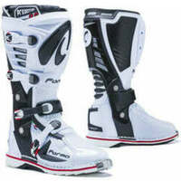 |
|            **[FORMA - PREDATOR 2-0 ENDURO](https://www.formabootsusa.com/collections/off-road-boots/products/predator-2-enduro)**             EN-13634-2017-2 2 2 2             Price online at time of writing:  - [Search on Motoblouz](https://pkw.motoblouz.com/?P4122157BDFF171&redir=https%3A%2F%2Fwww.motoblouz.com%2Frecherche%2FFORMA%2520PREDATOR%25202-0%2520ENDURO.html)   - [Search on Dafy](https://www.dafy-moto.com/recherche?string=FORMA%20PREDATOR%202-0%20ENDURO)    To look for them in second hand :              |  |
|            **[FORMA - RUBY](https://www.formabootsusa.com/collections/womens/products/ruby)**             EN-13634-2017-2 2 2 2 WR             Price online at time of writing:  - [153,44 €](https://pkw.motoblouz.com/?P4122157BDFF171&redir=https%3A%2F%2Fwww.motoblouz.com%2Frecherche%2FFORMA%2520RUBY.html) (Motoblouz)   - [162,74 €](https://www.dafy-moto.com/recherche?string=FORMA%20RUBY) (Dafy)     To look for them in second hand :              |  |
|            **[FORMA - TERRA EVO Dry -X-Series-](https://www.formabootsusa.com/collections/off-road-boots/products/terra-evo-black)**             EN-13634-2017-2 2 2 2 WR             Price online at time of writing:  - [Search on Motoblouz](https://pkw.motoblouz.com/?P4122157BDFF171&redir=https%3A%2F%2Fwww.motoblouz.com%2Frecherche%2FFORMA%2520TERRA%2520EVO%2520Dry%2520-X-Series-.html)   - [Search on Dafy](https://www.dafy-moto.com/recherche?string=FORMA%20TERRA%20EVO%20Dry%20-X-Series-)    To look for them in second hand :              | 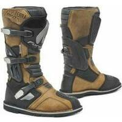 |
|            **[FORMA - TERRA EVO LOW](https://www.formabootsusa.com/collections/dual-sport-adv-boots/products/terra-evo-low-brown)**             EN-13634-2017-2 2 2 2 WR             Price online at time of writing:  - [237,14 €](https://pkw.motoblouz.com/?P4122157BDFF171&redir=https%3A%2F%2Fwww.motoblouz.com%2Frecherche%2FFORMA%2520TERRA%2520EVO%2520LOW.html) (Motoblouz)   - [251,09 €](https://www.dafy-moto.com/recherche?string=FORMA%20TERRA%20EVO%20LOW) (Dafy)     To look for them in second hand :              |  |

## OJ :

 | Modèle | Photos |
|---|---|
|            **[OJ - EXPLORING](https://ojworld.it/scarpe-e-stivali/exploring.html)**             EN-13634-2017-2 2 2 2 WR             Price online at time of writing: - [149,99 €](https://www.tradeinn.com/motardinn/fr?products_search%5Bquery%5D=OJ%20EXPLORING) (Motardinn)   - [Search on Motoblouz](https://pkw.motoblouz.com/?P4122157BDFF171&redir=https%3A%2F%2Fwww.motoblouz.com%2Frecherche%2FOJ%2520EXPLORING.html)   - [Search on Dafy](https://www.dafy-moto.com/recherche?string=OJ%20EXPLORING)    To look for them in second hand :              |  |
|            **[OJ - GROUND](https://ojworld.it/scarpe-e-stivali/ground.html)**             EN-13634-2017-2 2 2 2             Price online at time of writing: - [141.99 €](https://www.tradeinn.com/motardinn/fr?products_search%5Bquery%5D=OJ%20GROUND) (Motardinn)   - [Search on Motoblouz](https://pkw.motoblouz.com/?P4122157BDFF171&redir=https%3A%2F%2Fwww.motoblouz.com%2Frecherche%2FOJ%2520GROUND.html)   - [Search on Dafy](https://www.dafy-moto.com/recherche?string=OJ%20GROUND)    To look for them in second hand :              | 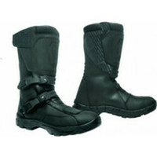 |
|            **[OJ - MASSIVE](https://ojworld.it/scarpe-e-stivali/massive.html)**             EN-13634-2017-2 2 2 2 WR             Price online at time of writing: - [113.99 €](https://www.tradeinn.com/motardinn/fr?products_search%5Bquery%5D=OJ%20MASSIVE) (Motardinn)   - [Search on Motoblouz](https://pkw.motoblouz.com/?P4122157BDFF171&redir=https%3A%2F%2Fwww.motoblouz.com%2Frecherche%2FOJ%2520MASSIVE.html)   - [Search on Dafy](https://www.dafy-moto.com/recherche?string=OJ%20MASSIVE)    To look for them in second hand :              |  |
|            **[OJ - MIDDLE](https://ojworld.it/scarpe-e-stivali/middle.html)**             EN-13634-2017-2 2 2 2 WR             Price online at time of writing: - [106,99 €](https://www.tradeinn.com/motardinn/fr?products_search%5Bquery%5D=OJ%20MIDDLE) (Motardinn)   - [Search on Motoblouz](https://pkw.motoblouz.com/?P4122157BDFF171&redir=https%3A%2F%2Fwww.motoblouz.com%2Frecherche%2FOJ%2520MIDDLE.html)   - [Search on Dafy](https://www.dafy-moto.com/recherche?string=OJ%20MIDDLE)    To look for them in second hand :              |  |
|            **[OJ - TURN](https://ojworld.it/scarpe-e-stivali/turn.html)**             EN-13634-2017-2 2 2 2 WR             Price online at time of writing: - [106.99 €](https://www.tradeinn.com/motardinn/fr?products_search%5Bquery%5D=OJ%20TURN) (Motardinn)   - [Search on Motoblouz](https://pkw.motoblouz.com/?P4122157BDFF171&redir=https%3A%2F%2Fwww.motoblouz.com%2Frecherche%2FOJ%2520TURN.html)   - [Search on Dafy](https://www.dafy-moto.com/recherche?string=OJ%20TURN)    To look for them in second hand :              | 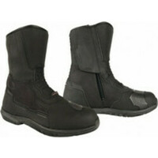 |

## OXFORD :

 | Modèle | Photos |
|---|---|
|            **[OXFORD - VALENTINA WS](https://www.oxfordproducts.com/motorcycle/product_type/rider_wear/oxford/boots/oxford_valentina_ws_boots_black/)**             EN-13634-2017-2 2 2 2             Price online at time of writing:  - Oxford : [119,00 £](https://www.oxfordproducts.com/motorcycle/product_type/rider_wear/oxford/boots/oxford_valentina_ws_boots_black/)  - [Search on Motoblouz](https://pkw.motoblouz.com/?P4122157BDFF171&redir=https%3A%2F%2Fwww.motoblouz.com%2Frecherche%2FOXFORD%2520VALENTINA%2520WS.html)   - [Search on Dafy](https://www.dafy-moto.com/recherche?string=OXFORD%20VALENTINA%20WS)    To look for them in second hand :              | 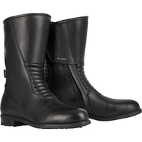 |

## REVIT :

 | Modèle | Photos |
|---|---|
|            **[REVIT - DISCOVERY GTX](https://www.revitsport.com/gb_en/motorcycle-boots-discovery-gtx-black)**             EN 13634 2017 2 2 2 2 WR IPS             Price online at time of writing:  - [469,99 €](https://pkw.motoblouz.com/?P4122157BDFF171&redir=https%3A%2F%2Fwww.motoblouz.com%2Frecherche%2FREVIT%2520DISCOVERY.html) (Motoblouz)   - [469,99 €](https://www.dafy-moto.com/recherche?string=REVIT%20DISCOVERY) (Dafy)     To look for them in second hand :              | 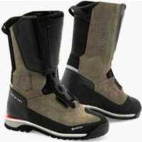 |
|            **[REVIT - EXPEDITION GTX](https://www.revitsport.com/gb_en/motorcycle-boots-expedition-gtx-black-grey)**             EN 13634 2017 2 2 2 2 WR IPS             Price online at time of writing:  - [679,99 €](https://pkw.motoblouz.com/?P4122157BDFF171&redir=https%3A%2F%2Fwww.motoblouz.com%2Frecherche%2FREVIT%2520EXPEDITION.html) (Motoblouz)   - [679,99 €](https://www.dafy-moto.com/recherche?string=REVIT%20EXPEDITION) (Dafy)     To look for them in second hand :              |  |
|            **[REVIT - FLUX H2O](https://www.revitsport.com/gb_en/motorcycle-boots-flux-h2o-black)**             EN 13634 2017 2 2 2 2 WR             Price online at time of writing:  - [219,99 €](https://pkw.motoblouz.com/?P4122157BDFF171&redir=https%3A%2F%2Fwww.motoblouz.com%2Frecherche%2FREVIT%2520FLUX%2520H2O.html) (Motoblouz)   - [219,99 €](https://www.dafy-moto.com/recherche?string=REVIT%20FLUX%20H2O) (Dafy)     To look for them in second hand :              |  |
|            **[REVIT - FUSE H2O](https://www.revitsport.com/gb_en/motorcycle-boots-fuse-h2o-black)**             EN 13634 2017 2 2 2 2 WR             Price online at time of writing:  - [199,99 €](https://pkw.motoblouz.com/?P4122157BDFF171&redir=https%3A%2F%2Fwww.motoblouz.com%2Frecherche%2FREVIT%2520FUSE%2520H2O.html) (Motoblouz)   - [199,99 €](https://www.dafy-moto.com/recherche?string=REVIT%20FUSE%20H2O) (Dafy)     To look for them in second hand :              |  |
|            **[REVIT - LINK GTX](https://www.revitsport.com/gb_en/motorcycle-boots-link-gtx-black)**             EN 13634 2017 2 2 2 2 WR             Price online at time of writing:  - [269,99 €](https://pkw.motoblouz.com/?P4122157BDFF171&redir=https%3A%2F%2Fwww.motoblouz.com%2Frecherche%2FREVIT%2520LINK.html) (Motoblouz)   - [269,99 €](https://www.dafy-moto.com/recherche?string=REVIT%20LINK) (Dafy)     To look for them in second hand :              |  |
|            **[REVIT - MOHAWK 3](https://www.revitsport.com/gb_en/motorcycle-shoes-mohawk-3-black)**             EN 13634 2017 2 2 2 2             Price online at time of writing:  - [249,99 €](https://pkw.motoblouz.com/?P4122157BDFF171&redir=https%3A%2F%2Fwww.motoblouz.com%2Frecherche%2FREVIT%2520MOHAWK%25203.html) (Motoblouz)   - [249,99 €](https://www.dafy-moto.com/recherche?string=REVIT%20MOHAWK%203) (Dafy)     To look for them in second hand :              | 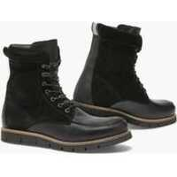 |
|            **[REVIT - PIONEER GTX](https://www.revitsport.com/gb_en/motorcycle-boots-pioneer-gtx-black)**             EN 13634 2017 2 2 2 2 WR             Price online at time of writing:  - [399,99 €](https://pkw.motoblouz.com/?P4122157BDFF171&redir=https%3A%2F%2Fwww.motoblouz.com%2Frecherche%2FREVIT%2520PIONEER.html) (Motoblouz)   - [399,99 €](https://www.dafy-moto.com/recherche?string=REVIT%20PIONEER) (Dafy)     To look for them in second hand :              |  |
|            **[REVIT - PORTLAND](https://www.revitsport.com/gb_en/motorcycle-shoes-portland-olive-green-black)**             EN 13634 2017 2 2 2 2             Price online at time of writing:  - [229,99 €](https://pkw.motoblouz.com/?P4122157BDFF171&redir=https%3A%2F%2Fwww.motoblouz.com%2Frecherche%2FREVIT%2520PORTLAND.html) (Motoblouz)   - [269,99 €](https://www.dafy-moto.com/recherche?string=REVIT%20PORTLAND) (Dafy)     To look for them in second hand :              | 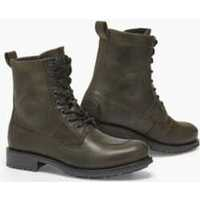 |
|            **[REVIT - PORTLAND LADIES](https://www.revitsport.com/gb_en/motorcycle-shoes-portland-ladies-black)**             EN 13634 2017 2 2 2 2             Price online at time of writing:  - [229,99 €](https://pkw.motoblouz.com/?P4122157BDFF171&redir=https%3A%2F%2Fwww.motoblouz.com%2Frecherche%2FREVIT%2520PORTLAND%2520LADIES.html) (Motoblouz)   - [239,99 €](https://www.dafy-moto.com/recherche?string=REVIT%20PORTLAND%20LADIES) (Dafy)     To look for them in second hand :              |  |
|            **[REVIT - PULSE H2O](https://www.revitsport.com/gb_en/motorcycle-boots-pulse-h2o-black)**             EN 13634 2017 2 2 2 2 WR             Price online at time of writing:  - [239,99 €](https://pkw.motoblouz.com/?P4122157BDFF171&redir=https%3A%2F%2Fwww.motoblouz.com%2Frecherche%2FREVIT%2520PULSE%2520H2O.html) (Motoblouz)   - [239,99 €](https://www.dafy-moto.com/recherche?string=REVIT%20PULSE%20H2O) (Dafy)     To look for them in second hand :              |  |

---

# APPENDIX: Manufacturers who do not publish enough/any information about the protection of their boots

- [Acerbis](https://www.acerbis.com/en)
- [Alpinestars](https://www.alpinestars.com/)
- [Belstaff](https://www.belstaff.com/eu/fr/)
- [Bering](https://bering.fr/index-fr.php/?___store=french#popup)
- [BMW Motorrad](https://www.bmw-motorrad.fr)
- [Cardy](https://www.cardy.fr/) :
    - Wex
- [Dafy](https://www.dafy-moto.com):
    - All One
    - DMP
- [Daytona](https://www.daytona.de/en/Boots/display/Overview-selection)
- [Difi](https://www.motoport.eu/en/Difi)
- [Eleveit](https://www.eleveit.it/fr/)
- [Falco](https://giannifalco.com/fr)
- [Fox](https://foxracing.fr/)
- [Furygan](https://www.furygan.com)
- [Gaerne](http://www.gaerne.com/)
- [Held](https://www.held.de/fr/home-fr/)
- [Helstons](https://www.helstons.net/)
- [IXS](https://ixs.com/en/moto/)
- [Icon](https://rideicon.com/)
- [Klim](https://www.klim.com/)
- [Kochmann](https://www.kochmann.de/home-2605.html)
- [Louis moto](https://www.louis-moto.fr) :
    - Highway 1
    - Rekurv
    - Vanucci
    - Detlev Louis
    - Madhead
    - Probiker
- [Magnum](https://magnumbootsfrance.fr/)
- [Merlin](https://www.merlinbikegear.com/)
- [Moose Racing](https://www.mooseracing.com/)
- [O'neal](https://www.oneal.eu/)
- [Overlap](https://overlap-denim.com/)
- [Richa](https://www.richa.eu/en-us/)
- [RST](https://www.rst-moto.com/FR/)
- [Rusty Stitches](https://www.rustystitches.com/)
- [Shot](https://catalog.shotracegear.com/dealersfr/)
- [Segura](https://segura-moto.fr/index-fr.php)
- [Seventy Degrees](https://seventy-70.com/en/)
- [Sidi](https://www.sidi.com/en/)
- [Soubirac](https://www.soubirac.fr/index.php)
- [Stylmartin](https://fr.stylmartin.it/)
- [TCX](https://fr.tcxboots.com/)
- [Thor](https://www.thormx.com/)
- [VQUATTRO](https://vquattro.com/)
- [XPD](https://france.xpd-boots.com)

[^1]: **Height of the front/rear calf shaft** ( Standard _CE EN 13634-2017_) :  
    Measured from the ground :
        1. Level 1: 10.3 cm/6.4 cm below 36, up to 12.1 cm/7.3 cm above 45.
        2. Level 2: 16.2 cm/11.3 cm below 36, to 19.2 cm / 13.1 cm above 45.
[^2]: **Abrasion resistance** ( Standard _CE EN 13634-2017_) :  
       Number of seconds to cross upper+lining with a 60 grit abrasive belt running at 8 m/s (zone B = high risk, zone A = rest of the shoe)
        1. Level 1: 1.5 s zone A, 5 s zone B
        2. Level 2: 2.5 s zone A, 12 s zone B
[^3]: **Piercing/cutting resistance** ( Standard _CE EN 13634-2017_) :  
       A blade is thrown at 2.8 m/s on rod+liner and penetration is measured :
        1. Level 1 : < 25 mm
        2. Level 2: < 15 mm
[^4]: **Torsion resistance** ( Standard _CE EN 13634-2017_) :  
       Measurement of the force required to deform the sole by 2 cm :
        1. Level 1: > 1 kN
        2. Level 2: > 1.5 kN  
      

    