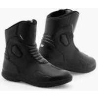
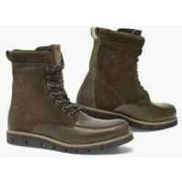

Cet article inventorie les bottes hautes de moto dont le niveau de protection annoncé sur internet est au maximum de la norme actuelle :
EN 13634:2017/2222.

<!--more-->

J’ai mis une idée du prix lorsque c’était possible (j'ai listé en priorité les 2 français qui ont le plus de références, Motoblouz et Dafy, et j'ai ajouté l'espagnol MotardInn pour les OJ qui sont peu distribuées en France).

_(Note : Je peux toucher quelques centimes si vous passez par un de mes liens pour acheter sur Motoblouz)_

Je couvre les chaussures/bottes courtes les plus protectrices (1222) dans un autre article.

# La norme EN 13634:2017

La norme européenne EN 13634:2017 impose d'afficher sur les étiquettes des chaussures/bottes moto des infos précises sur leur niveau de protection :

- Le premier chiffre indique la hauteur du chaussant[^1] (1 : basse, 2 : haute), il est surtout intéressant en complément des 3 suivants qui évaluent le niveau de protection de la chaussure pour un danger spécifique ;
- Résistance à l'abrasion[^2] ;
- Résistance à la perforation[^3] ;
- Résistance à la torsion/écrasement[^4].

Aujourd'hui seuls 2 niveaux existent pour chacun, 1 et 2.

Certifications complémentaires courantes :

- IPA : Protection de la malléole
- IPS : Protection du tibia
- WR : Résistance à la pénétration de l'eau
- FO : Résistance aux hydrocarbures

---

_Note sur les versions précédentes de la norme EN 13634 :  
Si vous tombez sur une botte portant cette certification avec une année inférieure à 2017, la hauteur de tige n'était pas mentionnée, les 3 chiffres indiqués sont les 3 niveaux de protection._

---

# Note sur les fabricants et la transparence

Peu de fabricants jouent le jeu de la transparence sur internet, l'info est souvent absente, partielle, et même chez ceux qui la fournissent elle est généralement cachée dans un fichier pdf ou une image.

Ceux pris en compte ici sont :

- Les plus transparents, la conformité est dans le texte de la page :
    - REV'IT ([site officiel](https://www.revitsport.com/fr/)) ;
    - OJ ([site officiel](https://ojworld.it/)) ;
- Image de l'étiquette facile à trouver :
    - IXON ([site officiel](https://www.ixon.com/fra-fr/)) _(note : Pas de modèles 2222)_ ;
    - FORMA ([site américain](https://www.formabootsusa.com/)) : le site européen ne donne aucune infos, mais elles sont sur le site US ;
- Certification dans un pdf joint :
    - DXR ([Motoblouz](https://www.motoblouz.com)) : Onglet "certificat de conformité" ;
    - FURYGAN ([site officiel](https://www.furygan.com/)) : Lien "fiche technique" _(note : Pas de modèles 2222)_.

La liste (pléthorique) des autres fabricants que j'ai parcourus mais dont les sites ne publient pas les niveaux de protection se trouve en annexe en fin de document.  
Si l'un d'entre eux évolue ou si vous en connaissez d'autres, n'hésitez pas à me prévenir en commentaire, et je les ajouterai à la prochaine version de ce document.

# Inventaire des bottes hautes EN 13634:2017/2222

## DXR :

 | Modèle | Photos |
|---|---|
| **[DXR - SILVRETTA](https://www.motoblouz.com/vente-bottes-dxr-silvretta-200519.html?color=Brown)** EN-13634-2017-2 2 2 2 IPA 84,90 € ([Motoblouz](https://pkw.motoblouz.com/?P4122157BDFF171&redir=https%3A%2F%2Fwww.motoblouz.com%2Frecherche%2FDXR%2520SILVRETTA.html)) |  |

## FORMA :

 | Modèle | Photos |
|---|---|
| **[FORMA - ADV TOURER](https://www.formabootsusa.com/collections/road-boots/products/adv-tourer-black)** EN-13634-2017-2 2 2 2 WR 169,90 € ([Motoblouz](https://pkw.motoblouz.com/?P4122157BDFF171&redir=https%3A%2F%2Fwww.motoblouz.com%2Frecherche%2FFORMA%2520ADV%2520TOURER.html)) |  |
| **[FORMA - ADV TOURER LADY](https://www.formabootsusa.com/collections/womens/products/adv-tourer-lady)** EN-13634-2017-2 2 2 2 WR 169,90 € ([Motoblouz](https://www.motoblouz.com/recherche/FORMA%20ADV%20TOURER%20LADY.html)) |  |
| **[FORMA - ADVENTURE](https://www.formabootsusa.com/collections/dual-sport-adv-boots/products/adventure-brown)** EN-13634-2017-2 2 2 2 WR 158,00 € ([Motoblouz](https://www.motoblouz.com/recherche/FORMA%20ADVENTURE.html)) |  |
| **[FORMA - ADVENTURE LOW](https://www.formabootsusa.com/collections/dual-sport-adv-boots/products/adventure-low-brown)** EN-13634-2017-2 2 2 2 WR 158,00 € ([Motoblouz](https://www.motoblouz.com/recherche/FORMA%20ADVENTURE%20LOW.html)) |  |
| **[FORMA - AVENUE]()** EN-13634-2017-2 2 2 2 WR 130,19 € ([Dafy Moto](https://www.dafy-moto.com/recherche?string=FORMA%20AVENUE)) |  |
| **[FORMA - BOULDER](https://www.formabootsusa.com/collections/off-road-boots/products/boulder-brown)** EN-13634-2017-2 2 2 2 180,10 € ([Motoblouz](https://www.motoblouz.com/recherche/FORMA%20BOULDER.html)) |  |
| **[FORMA - CAPE HORN HDry](https://www.formabootsusa.com/collections/road-boots/products/cape-horn)** EN-13634-2017-2 2 2 2 WR 246,40 € ([Motoblouz](https://www.motoblouz.com/recherche/FORMA%20CAPE%20HORN%20HDry.html)) |  |
| **[FORMA - CRYSTAL](https://www.formabootsusa.com/collections/womens/products/crystal)** EN-13634-2017-2 2 2 2 WR 122,40 € ([Motoblouz](https://www.motoblouz.com/recherche/FORMA%20CRYSTAL.html)) |  |
| **[FORMA - EAGLE](https://www.formabootsusa.com/collections/womens/products/eagle-brown)** EN-13634-2017-2 2 2 2 WR 169,90 € ([Motoblouz](https://www.motoblouz.com/recherche/FORMA%20EAGLE.html)) |  |
| **[FORMA - JASPER](https://www.formabootsusa.com/collections/road-boots/products/jasper)** EN-13634-2017-2 2 2 2 WR 158,00 € ([Motoblouz](https://www.motoblouz.com/recherche/FORMA%20JASPER.html)) |  |
| **[FORMA - LEGACY](https://www.formabootsusa.com/collections/ride-urban/products/legacy)** EN-13634-2017-2 2 2 2 WR 165,90 € ([Motoblouz](https://www.motoblouz.com/recherche/FORMA%20LEGACY.html)) |  |
| **[FORMA - PREDATOR 2-0](https://www.formabootsusa.com/collections/off-road-boots/products/predator-2-black)** EN-13634-2017-2 2 2 2  |  |
| **[FORMA - PREDATOR 2-0 ENDURO](https://www.formabootsusa.com/collections/off-road-boots/products/predator-2-enduro)** EN-13634-2017-2 2 2 2  |  |
| **[FORMA - RUBY](https://www.formabootsusa.com/collections/womens/products/ruby)** EN-13634-2017-2 2 2 2 WR 130,30 € ([Motoblouz](https://www.motoblouz.com/recherche/FORMA%20RUBY.html)) |  |
| **[FORMA - TERRA EVO Dry -X-Series-](https://www.formabootsusa.com/collections/off-road-boots/products/terra-evo-black)** EN-13634-2017-2 2 2 2 WR  |  |
| **[FORMA - TERRA EVO LOW](https://www.formabootsusa.com/collections/dual-sport-adv-boots/products/terra-evo-low-brown)** EN-13634-2017-2 2 2 2 WR 194,90 € ([Motoblouz](https://www.motoblouz.com/recherche/FORMA%20TERRA%20EVO%20LOW.html)) |  |

## OJ :

 | Modèle | Photos |
|---|---|
| **[OJ - EXPLORING](https://ojworld.it/scarpe-e-stivali/exploring.html)** EN-13634-2017-2 2 2 2 WR 149,99 € ([Motardinn](https://www.tradeinn.com/motardinn/fr?products_search%5Bquery%5D=OJ%20EXPLORING)) |  |
| **[OJ - GROUND](https://ojworld.it/scarpe-e-stivali/ground.html)** EN-13634-2017-2 2 2 2 |  |
| **[OJ - MASSIVE](https://ojworld.it/scarpe-e-stivali/massive.html)** EN-13634-2017-2 2 2 2 WR 113.99 € ([Motardinn](https://www.tradeinn.com/motardinn/fr?products_search%5Bquery%5D=OJ%20MASSIVE)) |  |
| **[OJ - MIDDLE](https://ojworld.it/scarpe-e-stivali/middle.html)** EN-13634-2017-2 2 2 2 WR 106,99 € ([Motardinn](https://www.tradeinn.com/motardinn/fr?products_search%5Bquery%5D=OJ%20MIDDLE)) |  |
| **[OJ - TURN](https://ojworld.it/scarpe-e-stivali/turn.html)** EN-13634-2017-2 2 2 2 WR 106.99 € ([Motardinn](https://www.tradeinn.com/motardinn/fr?products_search%5Bquery%5D=OJ%20TURN)) |  |

## REVIT :

 | Modèle | Photos |
|---|---|
| **[REVIT - BOTTES DISCOVERY GTX](https://www.revitsport.com/fr/bottes-moto-discovery-gtx-noir)** EN-13634-2017-2 2 2 2 WR IPS 419,99 € ([Motoblouz](https://www.motoblouz.com/recherche/revit%20discovery%20goretex.html)) |  |
| **[REVIT - BOTTES EXPEDITION GTX](https://www.revitsport.com/fr/bottes-moto-expedition-gtx-noir-gris)** EN-13634-2017-2 2 2 2 WR IPS 629,99 € ([Motoblouz](https://www.motoblouz.com/recherche/REVIT%20BOTTES%20EXPEDITION%20GTX.html)) |  |
| **[REVIT - BOTTES FLUX H2O](https://www.revitsport.com/fr/bottes-moto-flux-h2o-noir)** EN-13634-2017-2 2 2 2 WR 179,99 € ([Motoblouz](https://www.motoblouz.com/recherche/REVIT%20BOTTES%20FLUX%20H2O.html)) |  |
| **[REVIT - BOTTES FUSE H2O](https://www.revitsport.com/fr/bottes-moto-fuse-h2o-noir)** EN-13634-2017-2 2 2 2 WR 169,99 € ([Motoblouz](https://www.motoblouz.com/recherche/REVIT%20BOTTES%20FUSE%20H2O.html)) |  |
| **[REVIT - BOTTES LINK GTX](https://www.revitsport.com/fr/bottes-moto-link-gtx-noir)** EN-13634-2017-2 2 2 2 WR 249,99 € ([Motoblouz](https://www.motoblouz.com/recherche/revit%20link%20goretex.html)) |  |
| **[REVIT - BOTTES PIONEER GTX](https://www.revitsport.com/fr/bottes-moto-pioneer-gtx-noir)** EN-13634-2017-2 2 2 2 WR 369,99 € ([Motoblouz](https://www.motoblouz.com/recherche/revit%20pioneer%20gtx.html)) |  |
| **[REVIT - BOTTES PULSE H2O](https://www.revitsport.com/fr/bottes-moto-pulse-h2o-noir)** EN-13634-2017-2 2 2 2 WR 209,99 € ([Motoblouz](https://www.motoblouz.com/recherche/REVIT%20BOTTES%20PULSE%20H2O.html)) |  |
| **[REVIT - MOHAWK 3](https://www.revitsport.com/fr/chaussures-moto-mohawk-3-noir)** EN-13634-2017-2 2 2 2 229,99 € ([Motoblouz](https://www.motoblouz.com/recherche/REVIT%20MOHAWK%203.html)) |  |
| **[REVIT - PORTLAND](https://www.revitsport.com/fr/chaussures-moto-portland-noir)** EN-13634-2017-2 2 2 2 249,99 € ([Motoblouz](https://www.motoblouz.com/recherche/REVIT%20PORTLAND.html)) |  |
| **[REVIT - PORTLAND LADIES](https://www.revitsport.com/fr/chaussures-moto-portland-ladies-noir)** EN-13634-2017-2 2 2 2 229,99 € ([Motoblouz](https://www.motoblouz.com/recherche/REVIT%20PORTLAND%20LADIES.html)) |  |

---

# ANNEXE : Fabricants ne publiant pas assez/aucune info sur la protection de leurs bottes

- [Acerbis](https://www.acerbis.com/en)
- [Alpinestars](https://www.alpinestars.com/)
- [Belstaff](https://www.belstaff.com/eu/fr/)
- [Bering](https://bering.fr/index-fr.php/?___store=french#popup)
- [BMW Motorrad](https://www.bmw-motorrad.fr)
- [Cardy](https://www.cardy.fr/) :
    - Wex
- [Dafy](https://www.dafy-moto.com) :
    - All One
    - DMP
- [Daytona](https://www.daytona.de/en/Boots/display/Overview-selection)
- [Difi](https://www.motoport.eu/en/Difi)
- [Eleveit](https://www.eleveit.it/fr/)
- [Falco](https://giannifalco.com/fr)
- [Fox](https://foxracing.fr/)
- [Furygan](https://www.furygan.com)
- [Gaerne](http://www.gaerne.com/)
- [Held](https://www.held.de/fr/home-fr/)
- [Helstons](https://www.helstons.net/)
- [IXS](https://ixs.com/en/moto/)
- [Icon](https://rideicon.com/)
- [Klim](https://www.klim.com/)
- [Kochmann](https://www.kochmann.de/home-2605.html)
- [Louis moto](https://www.louis-moto.fr) :
    - Highway 1
    - Rekurv
    - Vanucci
    - Detlev Louis
    - Madhead
    - Probiker
- [Magnum](https://magnumbootsfrance.fr/)
- [Merlin](https://www.merlinbikegear.com/)
- [Moose Racing](https://www.mooseracing.com/)
- [O'neal](https://www.oneal.eu/)
- [Overlap](https://overlap-denim.com/)
- [Richa](https://www.richa.eu/en-us/)
- [RST](https://www.rst-moto.com/FR/)
- [Rusty Stitches](https://www.rustystitches.com/)
- [Shot](https://catalog.shotracegear.com/dealersfr/)
- [Segura](https://segura-moto.fr/index-fr.php)
- [Seventy Degrees](https://seventy-70.com/en/)
- [Sidi](https://www.sidi.com/en/)
- [Soubirac](https://www.soubirac.fr/index.php)
- [Stylmartin](https://fr.stylmartin.it/)
- [TCX](https://fr.tcxboots.com/)
- [Thor](https://www.thormx.com/)
- [VQUATTRO](https://vquattro.com/)
- [XPD](https://france.xpd-boots.com)

[^1]: **Hauteur de la tige avant/arrière du mollet** ( Norme _CE EN 13634-2017_) :  
    Mesurée à partir du sol :
        1. Niveau 1 : 10,3 cm/6,4 cm en dessous de 36, jusqu'à 12,1 cm / 7,3 cm au dessus de 45.
        2. Niveau 2 : 16,2 cm/11,3 cm en dessous de 36, jusqu'à 19,2 cm / 13,1 cm au dessus de 45.
[^2]: **Résistance à l'abrasion** ( Norme _CE EN 13634-2017_) :  
       Nombre de secondes pour traverser tige+doublure avec une bande abrasive de grain 60 qui tourne à 8 m/s (zone B = risque fort, zone A = reste de la chaussure)
        1. Niveau 1 : 1,5 s zone A, 5 s zone B
        2. Niveau 2 : 2,5 s zone A, 12 s zone B
[^3]: **Résistance à la perforation/coupure** ( Norme _CE EN 13634-2017_) :  
       Une lame est lancée à 2,8 m/s sur tige+doublure et on mesure la pénétration :
        1. Niveau 1 : < 25 mm
        2. Niveau 2 : < 15 mm
[^4]: **Résistance à la torsion** ( Norme _CE EN 13634-2017_) :  
       Mesure de la force nécessaire pour déformer la semelle de 2 cm :
        1. Niveau 1 : > 1 kN
        2. Niveau 2 : > 1,5 kN  
      

    