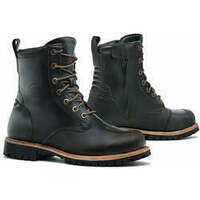
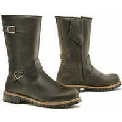
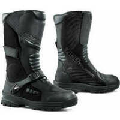
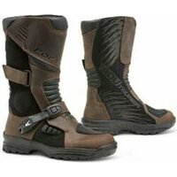
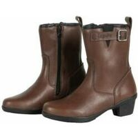
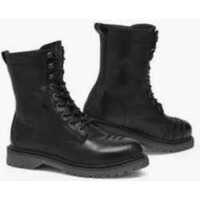
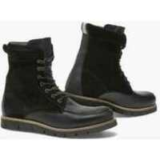

Cette page inventorie les bottes (hautes), dont les caractéristiques sont disponibles sur internet, et qui atteignent le niveau de protection le plus élevé de la norme actuelle :  
EN 13634:2017 : 2 (haute) 2 2 2 [^1].

J'ai mis une idée du prix lorsque c'était possible.

<!--more-->

Je couvre les bottes courtes (chaussures et demi-bottes) les plus protectrices (1 2 2 2) dans un autre article.

> _Note sur la norme :_
> 
> Le premier chiffre donne la hauteur de tige : 1 correspond à une basket/demi-botte, 2 à une botte.  
> Les 3 autres chiffres évaluent la protection fournie par la botte : Abrasion, perforation et torsion/écrasement.  
> 2 est le niveau maximum pour chaque valeur.

Les fabricants qui ont été pris en compte car ils publient leurs données, sont :

- DXR ([Motoblouz](https://www.motoblouz.com))
- FORMA ([site américain](https://www.formabootsusa.com/))
- IXON ([site officiel](https://www.ixon.com/fra-fr/))
- OJ ([site officiel](https://ojworld.it/))
- REV'IT ([site officiel](https://www.revitsport.com/fr/))

La liste des autres fabricants que j'ai parcourus mais dont les sites ne publient pas les niveaux de protection se trouve en fin de document.  
Si l'un d'entre eux évolue ou si vous en connaissez d'autres, n'hésitez pas à me prévenir en commentaire, et je les ajouterai à la prochaine version de ce document.

## FORMA :

 | Modèle | Photos |
|---|---|
| **FORMA - LEGACY** WR IPS 195,20 € ([Motoblouz](https://www.motoblouz.com/recherche/FORMA%20LEGACY.html)) |  |
| **FORMA - TERRA EVO Dry -X-Series-** WR IPS  |  |
| **FORMA - JASPER** WR IPS 185,90 € ([Motoblouz](https://www.motoblouz.com/recherche/FORMA%20JASPER.html)) |  |
| **FORMA - AVENUE** WR IPS  |  |
| **FORMA - ADV TOURER LADY** WR IPS 171,90 € ([Motoblouz](https://www.motoblouz.com/recherche/FORMA%20ADV%20TOURER%20LADY.html)) |  |
| **FORMA - PREDATOR 2-0** WR IPS  |  |
| **FORMA - CAPE HORN HDry** WR IPS 246,40 € ([Motoblouz](https://www.motoblouz.com/recherche/FORMA%20CAPE%20HORN%20HDry.html)) |  |
| **FORMA - BOULDER** WR IPS 197,00 € ([Motoblouz](https://www.motoblouz.com/recherche/FORMA%20BOULDER.html)) |  |
| **FORMA - ADVENTURE LOW** WR IPS 171,90 € ([Motoblouz](https://www.motoblouz.com/recherche/FORMA%20ADVENTURE%20LOW.html)) |  |
| **FORMA - CRYSTAL** WR IPS 144,10 € ([Motoblouz](https://www.motoblouz.com/recherche/FORMA%20CRYSTAL.html)) |  |
| **FORMA - EAGLE** WR IPS 199,90 € ([Motoblouz](https://www.motoblouz.com/recherche/FORMA%20EAGLE.html)) |  |
| **FORMA - TERRA EVO LOW** WR IPS 215,00 € ([Motoblouz](https://www.motoblouz.com/recherche/FORMA%20TERRA%20EVO%20LOW.html)) |  |
| **FORMA - ADVENTURE** WR IPS 195,80 € ([Motoblouz](https://www.motoblouz.com/recherche/FORMA%20ADVENTURE.html)) |  |
| **FORMA - RUBY** WR IPS 131,80 € ([Motoblouz](https://www.motoblouz.com/recherche/FORMA%20RUBY.html)) |  |
| **FORMA - ADV TOURER** WR IPS 171,90 € ([Motoblouz](https://www.motoblouz.com/recherche/FORMA%20ADV%20TOURER.html)) |  |
| **FORMA - PREDATOR 2-0 ENDURO** WR IPS  |  |

## DXR :

 | Modèle | Photos |
|---|---|
| **DXR - SILVRETTA** WR IPS 69,90 € ([Motoblouz](https://www.motoblouz.com/recherche/DXR%20SILVRETTA.html)) |  |

## OJ :

 | Modèle | Photos |
|---|---|
| **OJ - TURN** WR IPS  |  |
| **OJ - MASSIVE** WR IPS  |  |
| **OJ - GROUND** WR IPS  |  |
| **OJ - EXPLORING** WR IPS  |  |
| **OJ - MIDDLE** WR IPS  |  |

## REVIT :

 | Modèle | Photos |
|---|---|
| **REVIT - PORTLAND** WR IPS 229,99 € ([Motoblouz](https://www.motoblouz.com/recherche/REVIT%20PORTLAND.html)) |  |
| **REVIT - BOTTES FLUX H2O** WR IPS 179,99 € ([Motoblouz](https://www.motoblouz.com/recherche/REVIT%20BOTTES%20FLUX%20H2O.html)) |  |
| **REVIT - BOTTES PIONEER GTX** WR IPS 369,99 € ([Motoblouz](https://www.motoblouz.com/recherche/revit%20pioneer%20gtx.html)) |  |
| **REVIT - PORTLAND LADIES** WR IPS 229,99 € ([Motoblouz](https://www.motoblouz.com/recherche/REVIT%20PORTLAND%20LADIES.html)) |  |
| **REVIT - MOHAWK 3** WR IPS 229,99 € ([Motoblouz](https://www.motoblouz.com/recherche/REVIT%20MOHAWK%203.html)) |  |
| **REVIT - BOTTES FUSE H2O** WR IPS 169,99 € ([Motoblouz](https://www.motoblouz.com/recherche/REVIT%20BOTTES%20FUSE%20H2O.html)) |  |
| **REVIT - BOTTES DISCOVERY GTX** WR IPS  419,99 € ([Motoblouz](https://www.motoblouz.com/recherche/revit%20discovery%20goretex.html)) |  |
| **REVIT - BOTTES LINK GTX** WR IPS 249,99 € ([Motoblouz](https://www.motoblouz.com/recherche/revit%20link%20goretex.html)) |  |
| **REVIT - BOTTES PULSE H2O** WR IPS 209,99 € ([Motoblouz](https://www.motoblouz.com/recherche/REVIT%20BOTTES%20PULSE%20H2O.html)) |  |
| **REVIT - BOTTES EXPEDITION GTX** WR IPS 629,99 € ([Motoblouz](https://www.motoblouz.com/recherche/REVIT%20BOTTES%20EXPEDITION%20GTX.html)) |  |

---

Fabricants sans infos (ou infos incomplètes) :

- Acerbis (https://www.acerbis.com/en)
- Alpinestars (https://www.alpinestars.com/)
- Belstaff (https://www.belstaff.com/eu/fr/)
- Bering (https://bering.fr/index-fr.php/?___store=french#popup)
- BMW Motorrad (https://www.bmw-motorrad.fr)
- Cardy (https://www.cardy.fr/) :
    - Wex
- Dafy (https://www.dafy-moto.com) :
    - All One
    - DMP
- Daytona (https://www.daytona.de/en/Boots/display/Overview-selection)
- Difi (https://www.motoport.eu/en/Difi)
- Eleveit (https://www.eleveit.it/fr/)
- Falco (https://giannifalco.com/fr)
- Fox (https://foxracing.fr/)
- Furygan (https://www.furygan.com)
- Gaerne (http://www.gaerne.com/)
- Held (https://www.held.de/fr/home-fr/)
- Helstons (https://www.helstons.net/)
- IXS (https://ixs.com/en/moto/)
- Icon (https://rideicon.com/)
- Klim (https://www.klim.com/)
- Kochmann (https://www.kochmann.de/home-2605.html)
- Louis moto (https://www.louis-moto.fr) :
    - highway 1
    - rekurv
    - vanucci
    - detlev louis
    - madhead
    - probiker
- Magnum (https://magnumbootsfrance.fr/)
- Merlin (https://www.merlinbikegear.com/)
- Moose Racing (https://www.mooseracing.com/)
- O'neal (https://www.oneal.eu/)
- Overlap (https://overlap-denim.com/)
- Richa (https://www.richa.eu/en-us/)
- RST (https://www.rst-moto.com/FR/)
- Rusty Stitches (https://www.rustystitches.com/)
- Shot (https://catalog.shotracegear.com/dealersfr/)
- Segura (https://segura-moto.fr/index-fr.php)
- Seventy Degrees (https://seventy-70.com/en/)
- Sidi (https://www.sidi.com/en/)
- Soubirac (https://www.soubirac.fr/index.php)
- Stylmartin (https://fr.stylmartin.it/)
- TCX (https://fr.tcxboots.com/)
- Thor (https://www.thormx.com/)
- VQUATTRO (https://vquattro.com/)
- XPD (https://france.xpd-boots.com)

[^1]: Norme _CE EN 13634-2017_ :  
    1. **Hauteur de la tige avant/arrière du mollet** :  
    Mesurée à partir du sol :
        1. Niveau 1 : 10,3 cm/6,4 cm en dessous de 36, jusqu'à 12,1 cm / 7,3 cm au dessus de 45.
        2. Niveau 2 : 16,2 cm/11,3 cm en dessous de 36, jusqu'à 19,2 cm / 13,1 cm au dessus de 45.
    2. **Abrasion** :  
       Nombre de secondes pour traverser tige+doublure avec une bande abrasive de grain 60 qui tourne à 8 m/s (zone B = risque fort, zone A = reste de la chaussure)
        1. Niveau 1 : 1,5 s zone A, 5 s zone B
        2. Niveau 2 : 2,5 s zone A, 12 s zone B
    3. **Perforation/coupure** :  
       Une lame est lancée à 2,8 m/s sur tige+doublure et on mesure la pénétration :
        1. Niveau 1 : < 25 mm
        2. Niveau 2 : < 15 mm
    4. **Rigidité** :  
       Mesure de la force nécessaire pour déformer la semelle de 2 cm :
        1. Niveau 1 : > 1 kN
        2. Niveau 2 : > 1,5 kN  
      
    Certifications complémentaires courantes :  
    - IPA : Protection de la malléole  
    - IPS : Protection du tibia  
    - WR : Résistance à la pénétration de l'eau  
    - FO : Résistance aux hydrocarbures  
    