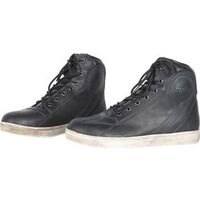
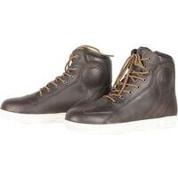
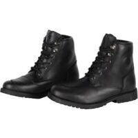
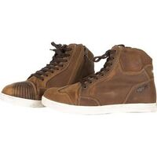
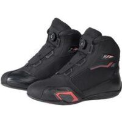
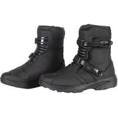
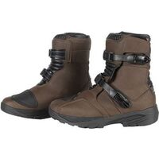
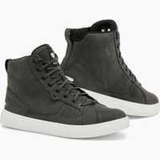
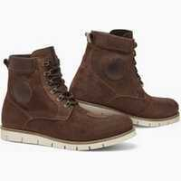
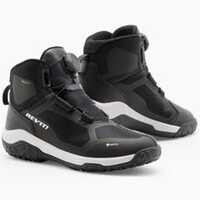

Cette page vient en complément de mon [Inventaire des chaussures, baskets et bottes courtes moto les plus protectrices (EN 13634 : 1222) en juin 2023](), elle liste des baskets/chaussures/bottes courtes qui ont tous les niveaux de protection au maximum sauf un, il s'agit donc des EN 13634:1122, EN 13634:1212 et EN 13634:1221.

J’ai mis le lien Motoblouz/Dafy/Fcmoto lorsque le produit était disponible au moment de la rédaction de l'article _(note : Je peux toucher quelques centimes si vous passez par un de mes liens pour acheter sur Motoblouz)_.

---

> *Note :* Cette page a été réalisée à partir des données fournies par les fabricants sur leurs sites Web.
> Sa génération est en grande partie automatisée, il peut donc y avoir quelques erreurs.
> 
> Les fabricants analysés sont les suivants :
> [ACERBIS](https://www.acerbis.com/), 
[ALPINESTARS](https://www.alpinestars.com/), 
[BERING](https://bering.fr/), 
[BMW](https://www.bmw-motorrad.fr/), 
[BULL-IT](https://www.bull-it.com/), 
[COURSE](https://www.xlmoto.com/), 
[DAINESE](https://www.dainese.com), 
[DUCATI](https://www.ducati.com/), 
[DXR](https://www.motoblouz.com/), 
[ESQUAD](https://www.esquad.fr/), 
[EUDOXIE](https://eudoxie.shop/), 
[FALCO](https://giannifalco.com/), 
[FIVE](https://five-gloves.com/), 
[FORMA](https://www.formabootsusa.com/), 
[FUEL](https://fuelmotorcycles.eu/), 
[FURYGAN](https://www.furygan.com/), 
[GOLDTOP](https://goldtop.co.uk/), 
[HALVARSSONS](https://halvarssonsmc.com/), 
[HELSTONS](https://www.helstons.net/), 
[HEVIK](https://www.hevik.co.uk/), 
[HOOD](https://www.hoodjeans.co.uk), 
[IXON](https://www.ixon.com/), 
[IXS](https://ixs.com/), 
[JOHN-DOE](https://www.ridejohndoe.com/), 
[KLIM](https://www.klim.com/), 
[KNOX](https://www.planet-knox.com), 
[LOUIS](https://www.louis.ie), 
[LS2](https://www.ls2usa.com/), 
[MERLAMOTO](https://merlamoto.com/), 
[MERLIN](https://www.merlinbikegear.shop/), 
[MOTOGIRL](https://motogirl.co.uk/), 
[OJ](https://ojworld.it/), 
[OXFORD](https://www.oxfordproducts.com/), 
[PANDO](https://pandomoto.com/), 
[PMJ](https://pmj.it/), 
[RACERED](https://racered.eu/), 
[RACER](https://www.racer1927.com/), 
[RAXID](https://raxid.co.uk), 
[RESURGENCE-GEAR](https://resurgencegear.net/), 
[REVIT](https://www.revitsport.com/), 
[ROADSKIN](https://roadskin.co.uk/), 
[ROKKER](https://www.eu.therokkercompany.com/), 
[RST](https://www.rst-moto.com/), 
[RUKKA](https://luhta.com/), 
[SEGURA](https://segura-moto.fr/), 
[SEVENTY-DEGREES](https://seventy-70.com/), 
[SIDI](https://www.sidi.com/), 
[SOUBIRAC](https://www.soubirac.fr/), 
[SPIDI](https://www.spidi.com/), 
[TCX](https://www.tcxboots.com/), 
[2MILESIX](https://www.2milesix.com/).

> 
> Les fabricants suivants ont été exclus car ils n'affichent pas le niveau de sécurité de leurs produits, ou ne sont pas commercialisés en Europe : ARLEN NESS, ARMURE, BELSTAFF, BILT, BOGOTTO, BOLID'STER, DRAGGIN, DRIRIDER, ELEVEIT, FLY MOTO, FOX, GAERNE, HARLEY DAVIDSON, HELD, HOLYFREEDOM, HONDA, ICON, INDIAN, KAWASAKI, KLIM, KTM, LEATT, MACNA, O'NEAL, OVERLAP, REAX, RICHA, RJAYS, RST, RUSTY STITCHES, SAINT, SCOTT, SEDICI, SHOT, SIDI, SOUBIRAC, SPIRIT MOTORS, STADLER, STREET & STEEL, STYLMARTIN, THOR, TRIUMPH, VENDRAMINI, WEX, XPD, YAMAHA

---

## Modèles à 67,92 € :

 | Modèle | Photos |
|---|---|
|                                                                                           **[DXR - BASKETS BERNIE](https://www.motoblouz.com/vente-baskets-dxr-bernie-173343.html)**                                                                                                                                                                                       EN13634-1122 IPA                                                                                                                                                                                        ") Modèle homme                                                                                                                                                                                                                                                                                   ") Imperméable                                                                                                                                                                                                                                                                                   Lieu de fabrication inconnu.                                                                                                                                                                                                                                                                                   Prix en ligne au moment de la rédaction :                                                                                            - [67,92 €](https://pkw.motoblouz.com/?P4122157BDFF171&redir=https%3A%2F%2Fwww.motoblouz.com%2Frecherche%2FDXR%2520BASKETS%2520BERNIE.html) (motoblouz)                                                                                            - [109,90 €](https://www.motoblouz.com/vente-baskets-dxr-bernie-173343.html) (Fabricant)                                                                                                                                                                                                                                                                                    Pour les rechercher en occasion (~20-50 €) :                                                                                                                                                                                        |                                                                                                                                                                                                                                                                                 |                                                                                           
|                                                                                           **[DXR - BASKETS BERNIE VINTAGE](https://www.motoblouz.com/vente-baskets-dxr-bernie-vintage-157170.html)**                                                                                                                                                                                       EN13634-1122 IPA                                                                                                                                                                                        ") Modèle homme                                                                                                                                                                                                                                                                                   ") Imperméable                                                                                                                                                                                                                                                                                   Lieu de fabrication inconnu.                                                                                                                                                                                                                                                                                   Prix en ligne au moment de la rédaction :                                                                                            - [67,92 €](https://pkw.motoblouz.com/?P4122157BDFF171&redir=https%3A%2F%2Fwww.motoblouz.com%2Frecherche%2FDXR%2520BASKETS%2520BERNIE%2520VINTAGE.html) (motoblouz)                                                                                            - [109,90 €](https://www.motoblouz.com/vente-baskets-dxr-bernie-vintage-157170.html) (Fabricant)                                                                                                                                                                                                                                                                                    Pour les rechercher en occasion (~20-50 €) :                                                                                                                                                                                        |                                                                                                                                                                                      |                                                                                           

## Modèles à 76,41 € :

 | Modèle | Photos |
|---|---|
|                                                                                           **[DXR - BELLEVILLE](https://www.motoblouz.com/vente-chaussures-dxr-belleville-188394.html)**                                                                                                                                                                                       EN13634-1122 IPA                                                                                                                                                                                        ") Modèle homme                                                                                                                                                                                                                                                                                   ") Cuir                                                                                                                                                                                       ") Imperméable                                                                                                                                                                                                                                                                                   Lieu de fabrication inconnu.                                                                                                                                                                                                                                                                                   Prix en ligne au moment de la rédaction :                                                                                            - [76,41 €](https://pkw.motoblouz.com/?P4122157BDFF171&redir=https%3A%2F%2Fwww.motoblouz.com%2Frecherche%2FDXR%2520BELLEVILLE.html) (motoblouz)                                                                                            - [119,90 €](https://www.motoblouz.com/vente-chaussures-dxr-belleville-188394.html) (Fabricant)                                                                                                                                                                                                                                                                                    Pour les rechercher en occasion (~20-50 €) :                                                                                                                                                                                        |                                                                                                                                                                                                                                                                                 |                                                                                           

## Modèles à 99,90 € :

 | Modèle | Photos |
|---|---|
|                                                                                           **[DXR - BASKETS CLAYTON](https://www.motoblouz.com/vente-baskets-dxr-clayton-200521.html)**                                                                                                                                                                                       EN13634-1122 IPA                                                                                                                                                                                        ") Modèle homme                                                                                                                                                                                        Eté                                                                                                                                                                                                                                                                                   ") Cuir                                                                                                                                                                                       ") Imperméable                                                                                                                                                                                       ") Respirant                                                                                                                                                                                                                                                                                   Lieu de fabrication inconnu.                                                                                                                                                                                                                                                                                   Prix en ligne au moment de la rédaction :                                                                                            - [99,90 €](https://pkw.motoblouz.com/?P4122157BDFF171&redir=https%3A%2F%2Fwww.motoblouz.com%2Frecherche%2FDXR%2520BASKETS%2520CLAYTON.html) (motoblouz)                                                                                            - [119,90 €](https://www.motoblouz.com/vente-baskets-dxr-clayton-200521.html) (Fabricant)                                                                                                                                                                                                                                                                                    Pour les rechercher en occasion (~30-70 €) :                                                                                                                                                                                        |                                                                                                                                                                                                                                                                                 |                                                                                           

## Modèles à 101,91 € :

 | Modèle | Photos |
|---|---|
|                                                                                           **[DXR - BASKETS FURTIV](https://www.motoblouz.com/vente-baskets-dxr-furtiv-200517.html)**                                                                                                                                                                                       EN13634-1221 IPA                                                                                                                                                                                        ") Modèle homme                                                                                                                                                                                        Eté                                                                                                                                                                                                                                                                                   ") Imperméable                                                                                                                                                                                       ") Respirant                                                                                                                                                                                                                                                                                   Lieu de fabrication inconnu.                                                                                                                                                                                                                                                                                   Prix en ligne au moment de la rédaction :                                                                                            - [101,91 €](https://pkw.motoblouz.com/?P4122157BDFF171&redir=https%3A%2F%2Fwww.motoblouz.com%2Frecherche%2FDXR%2520BASKETS%2520FURTIV.html) (motoblouz)                                                                                            - [119,90 €](https://www.motoblouz.com/vente-baskets-dxr-furtiv-200517.html) (Fabricant)                                                                                                                                                                                                                                                                                    Pour les rechercher en occasion (~30-70 €) :                                                                                                                                                                                        |                                                                                                                                                                                      |                                                                                           
|                                                                                           **[DXR - DEMI KRUGER SHORT](https://www.motoblouz.com/vente-demi-bottes-dxr-kruger-short-196450.html)**                                                                                                                                                                                       EN13634-1122 IPA                                                                                                                                                                                        ") Modèle homme                                                                                                                                                                                                                                                                                   ") Cuir                                                                                                                                                                                       ") Imperméable                                                                                                                                                                                                                                                                                   Lieu de fabrication inconnu.                                                                                                                                                                                                                                                                                   Prix en ligne au moment de la rédaction :                                                                                            - [101,91 €](https://pkw.motoblouz.com/?P4122157BDFF171&redir=https%3A%2F%2Fwww.motoblouz.com%2Frecherche%2FDXR%2520DEMI%2520KRUGER%2520SHORT.html) (motoblouz)                                                                                            - [149,90 €](https://www.motoblouz.com/vente-demi-bottes-dxr-kruger-short-196450.html) (Fabricant)                                                                                                                                                                                                                                                                                    Pour les rechercher en occasion (~30-70 €) :                                                                                                                                                                                        |                                                                                                                                                                                                                                                                                 |                                                                                           

## Modèles à 110,42 € :

 | Modèle | Photos |
|---|---|
|                                                                                           **[DXR - DEMI PIVOT SHORT](https://www.motoblouz.com/vente-demi-bottes-dxr-pivot-short-209843.html)**                                                                                                                                                                                       EN13634-1221 IPA                                                                                                                                                                                        ") Modèle homme                                                                                                                                                                                        Eté                                                                                                                                                                                                                                                                                   ") Cuir                                                                                                                                                                                       ") Imperméable                                                                                                                                                                                       ") Respirant                                                                                                                                                                                                                                                                                   Lieu de fabrication inconnu.                                                                                                                                                                                                                                                                                   Prix en ligne au moment de la rédaction :                                                                                            - [110,42 €](https://pkw.motoblouz.com/?P4122157BDFF171&redir=https%3A%2F%2Fwww.motoblouz.com%2Frecherche%2FDXR%2520DEMI%2520PIVOT%2520SHORT.html) (motoblouz)                                                                                            - [159,90 €](https://www.motoblouz.com/vente-demi-bottes-dxr-pivot-short-209843.html) (Fabricant)                                                                                                                                                                                                                                                                                    Pour les rechercher en occasion (~30-80 €) :                                                                                                                                                                                        |                                                                                                                                                                                      |                                                                                           

## Modèles à 169,99 € :

 | Modèle | Photos |
|---|---|
|                                                                                           **[REVIT - ARROW](https://www.revitsport.com/fr_fr/chaussures-moto-arrow-taupe-marron)**                                                                                                                                                                                       EN13634-1221                                                                                                                                                                                         Eté                                                                                                                                                                                                                                                                                   ") Cuir                                                                                                                                                                                       ") Respirant                                                                                                                                                                                                                                                                                   Lieu de fabrication inconnu.                                                                                                                                                                                                                                                                                   De bonnes présentations sur Youtube :                                                                                            [Urban Rider - Rev'It Arrow Motorcycle Trainer Review](https://www.youtube.com/watch?v=oyVTHm4Gu-4)                                                                                            [RevZilla - REV'IT! Arrow Women's Shoes Review](https://www.youtube.com/watch?v=b1YOm0BhNVY)                                                                                                                                                                                        Prix en ligne au moment de la rédaction :                                                                                            - [169,99 €](https://www.revitsport.com/fr_fr/chaussures-moto-arrow-taupe-marron) (Fabricant)                                                                                            - [169,99 €](https://www.fc-moto.de/epages/fcm.sf/fr_FR/?ViewAction=FacetedSearchProducts&SearchString=REVIT+ARROW) (fcmoto)                                                                                                                                                                                                                                                                                    Pour les rechercher en occasion (~50-120 €) :                                                                                                                                                                                        |                                                                                                                                                                                                                                                                                                                                                                            |                                                                                           

## Modèles à 179,99 € :

 | Modèle | Photos |
|---|---|
|                                                                                           **[REVIT - DELTA H20](https://www.revitsport.com/fr_fr/chaussures-moto-delta-h20-noir)**                                                                                                                                                                                       EN13634-1221 WR                                                                                                                                                                                                                                                                                    ") Imperméable                                                                                                                                                                                                                                                                                   Lieu de fabrication inconnu.                                                                                                                                                                                                                                                                                   Prix en ligne au moment de la rédaction :                                                                                            - [179,99 €](https://www.revitsport.com/fr_fr/chaussures-moto-delta-h20-noir) (Fabricant)                                                                                                                                                                                                                                                                                    Pour les rechercher en occasion (~50-130 €) :                                                                                                                                                                                        |                                                                                                                                                                                                                                                                                 |                                                                                           

## Modèles à 209,99 € :

 | Modèle | Photos |
|---|---|
|                                                                                           **[REVIT - KRAIT GTX](https://www.revitsport.com/fr_fr/chaussures-moto-krait-gtx-noir-gris)**                                                                                                                                                                                       EN13634-1122 WR                                                                                                                                                                                         Eté                                                                                                                                                                                                                                                                                   ") Imperméable                                                                                                                                                                                       ") Respirant                                                                                                                                                                                                                                                                                   Lieu de fabrication inconnu.                                                                                                                                                                                                                                                                                   Une bonne présentation sur Youtube :                                                                                            [Urban Rider - REVIT Krait GTX Motorcycle Trainer Review](https://www.youtube.com/watch?v=nTGLa4_In50)                                                                                                                                                                                        Prix en ligne au moment de la rédaction :                                                                                            - [209,99 €](https://www.revitsport.com/fr_fr/chaussures-moto-krait-gtx-noir-gris) (Fabricant)                                                                                            - [209,99 €](https://www.fc-moto.de/epages/fcm.sf/fr_FR/?ViewAction=FacetedSearchProducts&SearchString=REVIT+KRAIT%20GTX) (fcmoto)                                                                                                                                                                                                                                                                                    Pour les rechercher en occasion (~60-150 €) :                                                                                                                                                                                        |                                                                                                                                                                                      |                                                                                           
|                                                                                           **[REVIT - KRAIT GTX LADIES](https://www.revitsport.com/fr_fr/chaussures-moto-krait-gtx-ladies-noir-gris)**                                                                                                                                                                                       EN13634-1122 WR                                                                                                                                                                                        ") Modèle femme                                                                                                                                                                                        Eté                                                                                                                                                                                                                                                                                   ") Imperméable                                                                                                                                                                                       ") Respirant                                                                                                                                                                                                                                                                                   Lieu de fabrication inconnu.                                                                                                                                                                                                                                                                                   Une bonne présentation sur Youtube :                                                                                            [Urban Rider - REVIT Krait GTX Motorcycle Trainer Review](https://www.youtube.com/watch?v=nTGLa4_In50)                                                                                                                                                                                        Prix en ligne au moment de la rédaction :                                                                                            - [209,99 €](https://www.revitsport.com/fr_fr/chaussures-moto-krait-gtx-ladies-noir-gris) (Fabricant)                                                                                            - [209,99 €](https://www.fc-moto.de/epages/fcm.sf/fr_FR/?ViewAction=FacetedSearchProducts&SearchString=REVIT+KRAIT%20GTX%20DAMES) (fcmoto)                                                                                            - [209,99 €](https://pkw.motoblouz.com/?P4122157BDFF171&redir=https%3A%2F%2Fwww.motoblouz.com%2Frecherche%2FREVIT%2520KRAIT%2520GTX%2520FEMME.html) (motoblouz)                                                                                                                                                                                                                                                                                    Pour les rechercher en occasion (~60-150 €) :                                                                                                                                                                                        |                                                                                                                                                                                      |                                                                                           

## Modèles à 229,99 € :

 | Modèle | Photos |
|---|---|
|                                                                                           **[REVIT - GINZA 3](https://www.revitsport.com/fr_fr/chaussures-moto-ginza-3-marron-blanc)**                                                                                                                                                                                       EN13634-1221                                                                                                                                                                                                                                                                                    ") Cuir                                                                                                                                                                                                                                                                                   Lieu de fabrication inconnu.                                                                                                                                                                                                                                                                                   De bonnes présentations sur Youtube :                                                                                            [Urban Rider - REVIT Ginza 3 Motorcycle Boot Review](https://www.youtube.com/watch?v=aNmKfvJ77u4)                                                                                            [RevZilla - REV'IT! Ginza 3 Shoes Review](https://www.youtube.com/watch?v=c68wWHnhbFg)                                                                                                                                                                                        Prix en ligne au moment de la rédaction :                                                                                            - [229,99 €](https://www.revitsport.com/fr_fr/chaussures-moto-ginza-3-marron-blanc) (Fabricant)                                                                                            - [229,99 €](https://www.fc-moto.de/epages/fcm.sf/fr_FR/?ViewAction=FacetedSearchProducts&SearchString=REVIT+GINZA%203) (fcmoto)                                                                                                                                                                                                                                                                                    Pour les rechercher en occasion (~70-160 €) :                                                                                                                                                                                        |                                                                                                                                                                                                                                                                                 |                                                                                           

## Modèles à 269,99 € :

 | Modèle | Photos |
|---|---|
|                                                                                           **[REVIT - BRECCIA GTX](https://www.revitsport.com/fr_fr/chaussures-moto-breccia-gtx-noir)**                                                                                                                                                                                       EN13634-1122 WR                                                                                                                                                                                         Eté                                                                                                                                                                                                                                                                                   ") Cuir                                                                                                                                                                                       ") Respirant                                                                                                                                                                                                                                                                                   Lieu de fabrication inconnu.                                                                                                                                                                                                                                                                                   Prix en ligne au moment de la rédaction :                                                                                            - [269,99 €](https://www.revitsport.com/fr_fr/chaussures-moto-breccia-gtx-noir) (Fabricant)                                                                                            - [269,99 €](https://www.fc-moto.de/epages/fcm.sf/fr_FR/?ViewAction=FacetedSearchProducts&SearchString=REVIT+BRECCIA%20GTX) (fcmoto)                                                                                            - [269,99 €](https://pkw.motoblouz.com/?P4122157BDFF171&redir=https%3A%2F%2Fwww.motoblouz.com%2Frecherche%2FREVIT%2520BRECCIA%2520GTX.html) (motoblouz)                                                                                                                                                                                                                                                                                    Pour les rechercher en occasion (~80-190 €) :                                                                                                                                                                                        |                                                                                                                                                                                      |                                                                                           

