*# Dernière mise à jour : 12/11/2023 #*

Cette page vient en complément de mon [Inventaire des chaussures, baskets et bottes courtes moto les plus protectrices (EN 13634 : 1222) en juin 2023](), elle liste des baskets/chaussures/bottes courtes qui ont tous les niveaux de protection au maximum sauf un, il s'agit donc des EN 13634:1122, EN 13634:1212 et EN 13634:1221.

J’ai mis le lien Motoblouz/Dafy/Fcmoto lorsque le produit était disponible au moment de la rédaction de l'article _(note : Je peux toucher quelques centimes si vous passez par un de mes liens pour acheter sur Motoblouz)_.

> _Liste des mises à jour :_  
> _- 12/11/2023 : révision complète de la mise en page, nouveaux liens, etc._  
> _- 14/09/2023 : révision complète de la mise en page, nouveaux liens, etc._

---

> *Note :* Cette page a été réalisée à partir des données fournies par les fabricants sur leurs sites Web.
> Sa génération est en grande partie automatisée, il peut donc y avoir quelques erreurs.
> 
> Les fabricants analysés sont les suivants :
> [ACERBIS](https://www.acerbis.com/), 
[ALPINESTARS](https://www.alpinestars.com/), 
[BERING](https://bering.fr/), 
[BMW](https://www.bmw-motorrad.fr/), 
[BULL-IT](https://www.bull-it.com/), 
[DAINESE](https://www.dainese.com), 
[DUCATI](https://www.ducati.com/), 
[ESQUAD](https://www.esquad.fr/), 
[EUDOXIE](https://eudoxie.shop/), 
[FALCO](https://giannifalco.com/), 
[FIVE](https://five-gloves.com/), 
[FORMA](https://www.formabootsusa.com/), 
[FUEL](https://fuelmotorcycles.eu/), 
[FURYGAN](https://www.furygan.com/), 
[GERBING](https://www.gerbingfrance.fr/), 
[G-HEAT](https://www.g-heat.com/), 
[GOLDTOP](https://goldtop.co.uk/), 
[HALVARSSONS](https://halvarssonsmc.com/), 
[HELSTONS](https://www.helstons.net/), 
[HEVIK](https://www.hevik.co.uk/), 
[HOOD](https://www.hoodjeans.co.uk), 
[IXON](https://www.ixon.com/), 
[IXS](https://ixs.com/), 
[JOHN-DOE](https://www.ridejohndoe.com/), 
[KLIM](https://www.klim.com/), 
[KNOX](https://www.planet-knox.com), 
[LOUIS](https://www.louis.ie), 
[LS2](https://www.ls2usa.com/), 
[MERLAMOTO](https://merlamoto.com/), 
[MERLIN](https://www.merlinbikegear.shop/), 
[MOTOBLOUZ](https://www.motoblouz.com/), 
[MOTOGIRL](https://motogirl.co.uk/), 
[OJ](https://ojworld.it/), 
[OXFORD](https://www.oxfordproducts.com/), 
[PANDO](https://pandomoto.com/), 
[PMJ](https://pmj.it/), 
[RACERED](https://racered.eu/), 
[RACER](https://www.racer1927.com/), 
[RAXID](https://raxid.co.uk), 
[RESURGENCE-GEAR](https://resurgencegear.net/), 
[REV-IT](https://www.revitsport.com/), 
[ROADSKIN](https://roadskin.co.uk/), 
[ROKKER](https://www.eu.therokkercompany.com/), 
[RST](https://www.rst-moto.com/), 
[RUKKA](https://luhta.com/), 
[SEGURA](https://segura-moto.fr/), 
[SEVENTY-DEGREES](https://seventy-70.com/), 
[SIDI](https://www.sidi.com/), 
[SOUBIRAC](https://www.soubirac.fr/), 
[SPIDI](https://www.spidi.com/), 
[TCX](https://www.tcxboots.com/), 
[2MILESIX](https://www.2milesix.com/), 
[COURSE et RIDE AND SONS](https://www.xlmoto.com/).

> 
> Les fabricants suivants ont été exclus car ils n'affichent pas le niveau de sécurité de leurs produits, ou ne sont pas commercialisés en Europe : ARLEN NESS, ARMURE, BELSTAFF, BILT, BOGOTTO, BOLID'STER, DRAGGIN, DRIRIDER, ELEVEIT, FLY MOTO, FOX, GAERNE, HARLEY DAVIDSON, HELD, HOLYFREEDOM, HONDA, ICON, INDIAN, KAWASAKI, KTM, LEATT, MACNA, O'NEAL, OVERLAP, REAX, RICHA, RJAYS, RUSTY STITCHES, SAINT, SCOTT, SEDICI, SHOT, SIDI, SPIRIT MOTORS, STADLER, STREET & STEEL, STYLMARTIN, THOR, TRIUMPH, VENDRAMINI, WEX, XPD, YAMAHA.

---

## Modèles à 66,56 € :

 | Modèle | Photos |
|---|---|
|                                                                                           **DXR - BERNIE**                                                                                                                                                                                        EN13634-1122 IPA                                                                                            ") Modèle mixte femme/homme                                                                                                                                                                                        **Pages fabricant :**                                                                                            - [vente-baskets-dxr-bernie-brown-173344](https://www.motoblouz.com/vente-baskets-dxr-bernie-brown-173344.html)                                                                                            - [vente-baskets-dxr-bernie-173343](https://www.motoblouz.com/vente-baskets-dxr-bernie-173343.html)                                                                                                                                                                                        **Lieu de fabrication :**                                                                                             Inconnu                                                                                                                                                                                        **Caractéristiques :**                                                                                            ") Cuir                                                                                             (image modifiée : Tabler-icons)") Imperméable (Gore-Tex)                                                                                                                                                                                        **Prix en ligne au moment de la rédaction :**                                                                                            - [66,56 € (motoblouz)](https://pkw.motoblouz.com/?P4122157BDFF171&redir=https%3A%2F%2Fwww.motoblouz.com%2Frecherche%2FDXR%2520BERNIE.html)                                                                                            - 109,90 € (fabricant)                                                                                            - [Rechercher (fcmoto)](https://www.fc-moto.de/epages/fcm.sf/fr_FR/?ViewAction=FacetedSearchProducts&SearchString=DXR+BERNIE)                                                                                            - [Rechercher (motardinn)](https://www.tradeinn.com/motardinn/fr?products_search%5Bquery%5D=DXR+BERNIE)                                                                                            - [Rechercher (dafymoto)](https://www.dafy-moto.com/recherche?string=DXR+BERNIE)                                                                                                                                                                                        **Aide à la recherche :**                                                                                            *Rechercher en occasion (~20-50 €)*                                                                                            [ Leboncoin](https://www.leboncoin.fr/recherche?text=moto+DXR+BERNIE&shippable=1&sort=price&order=asc) [ Vinted](https://www.vinted.fr/catalog?search_text=moto+DXR+BERNIE&order=price_low_to_high) *Recherches diverses :*                                                                                            [ Google](https://www.google.com/search?q=moto+DXR+BERNIE) [ Youtube](https://www.youtube.com/results?search_query=moto+DXR+BERNIE)                                                                                            |                                                                                           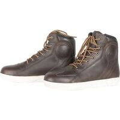                                                                                           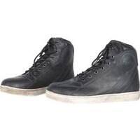                                                                                           |                                                                                           
|                                                                                           **DXR - BERNIE VINTAGE**                                                                                                                                                                                        EN13634-1122 IPA                                                                                            ") Modèle mixte femme/homme                                                                                                                                                                                        **Pages fabricant :**                                                                                            - [vente-baskets-dxr-bernie-vintage-157170](https://www.motoblouz.com/vente-baskets-dxr-bernie-vintage-157170.html)                                                                                                                                                                                        **Lieu de fabrication :**                                                                                             Inconnu                                                                                                                                                                                        **Caractéristiques :**                                                                                            ") Cuir                                                                                             (image modifiée : Tabler-icons)") Imperméable (Gore-Tex)                                                                                                                                                                                        **Prix en ligne au moment de la rédaction :**                                                                                            - [66,56 € (motoblouz)](https://pkw.motoblouz.com/?P4122157BDFF171&redir=https%3A%2F%2Fwww.motoblouz.com%2Frecherche%2FDXR%2520BERNIE%252020VINTAGE.html)                                                                                            - 109,90 € (fabricant)                                                                                            - [Rechercher (fcmoto)](https://www.fc-moto.de/epages/fcm.sf/fr_FR/?ViewAction=FacetedSearchProducts&SearchString=DXR+BERNIE+VINTAGE)                                                                                            - [Rechercher (motardinn)](https://www.tradeinn.com/motardinn/fr?products_search%5Bquery%5D=DXR+BERNIE+VINTAGE)                                                                                            - [Rechercher (dafymoto)](https://www.dafy-moto.com/recherche?string=DXR+BERNIE+VINTAGE)                                                                                                                                                                                        **Aide à la recherche :**                                                                                            *Rechercher en occasion (~20-50 €)*                                                                                            [ Leboncoin](https://www.leboncoin.fr/recherche?text=moto+DXR+BERNIE+VINTAGE&shippable=1&sort=price&order=asc) [ Vinted](https://www.vinted.fr/catalog?search_text=moto+DXR+BERNIE+VINTAGE&order=price_low_to_high) *Recherches diverses :*                                                                                            [ Google](https://www.google.com/search?q=moto+DXR+BERNIE+VINTAGE) [ Youtube](https://www.youtube.com/results?search_query=moto+DXR+BERNIE+VINTAGE)                                                                                            |                                                                                           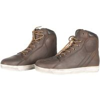                                                                                           |                                                                                           

## Modèles à 74,89 € :

 | Modèle | Photos |
|---|---|
|                                                                                           **DXR - BELLEVILLE**                                                                                                                                                                                        EN13634-1122 IPA                                                                                            ") Modèle mixte femme/homme                                                                                                                                                                                        **Pages fabricant :**                                                                                            - [vente-chaussures-dxr-belleville-188394](https://www.motoblouz.com/vente-chaussures-dxr-belleville-188394.html)                                                                                                                                                                                        **Lieu de fabrication :**                                                                                             Inconnu                                                                                                                                                                                        **Caractéristiques :**                                                                                            ") Cuir                                                                                             (image modifiée : Tabler-icons)") Imperméable (Gore-Tex)                                                                                                                                                                                        **Prix en ligne au moment de la rédaction :**                                                                                            - [74,89 € (motoblouz)](https://pkw.motoblouz.com/?P4122157BDFF171&redir=https%3A%2F%2Fwww.motoblouz.com%2Frecherche%2FDXR%2520BELLEVILLE.html)                                                                                            - 119,90 € (fabricant)                                                                                            - [Rechercher (fcmoto)](https://www.fc-moto.de/epages/fcm.sf/fr_FR/?ViewAction=FacetedSearchProducts&SearchString=DXR+BELLEVILLE)                                                                                            - [Rechercher (motardinn)](https://www.tradeinn.com/motardinn/fr?products_search%5Bquery%5D=DXR+BELLEVILLE)                                                                                            - [Rechercher (dafymoto)](https://www.dafy-moto.com/recherche?string=DXR+BELLEVILLE)                                                                                                                                                                                        **Aide à la recherche :**                                                                                            *Rechercher en occasion (~20-50 €)*                                                                                            [ Leboncoin](https://www.leboncoin.fr/recherche?text=moto+DXR+BELLEVILLE&shippable=1&sort=price&order=asc) [ Vinted](https://www.vinted.fr/catalog?search_text=moto+DXR+BELLEVILLE&order=price_low_to_high) *Recherches diverses :*                                                                                            [ Google](https://www.google.com/search?q=moto+DXR+BELLEVILLE) [ Youtube](https://www.youtube.com/results?search_query=moto+DXR+BELLEVILLE)                                                                                            |                                                                                                                                                                                                                                                                                 |                                                                                           

## Modèles à 83,22 € :

 | Modèle | Photos |
|---|---|
|                                                                                           **DXR - CLAYTON**                                                                                                                                                                                        EN13634-1122 IPA                                                                                            ") Modèle mixte femme/homme                                                                                            ") Eté                                                                                                                                                                                        **Pages fabricant :**                                                                                            - [vente-baskets-dxr-clayton-200521](https://www.motoblouz.com/vente-baskets-dxr-clayton-200521.html)                                                                                                                                                                                        **Lieu de fabrication :**                                                                                             Inconnu                                                                                                                                                                                        **Caractéristiques :**                                                                                            ") Cuir                                                                                            ") Respirant                                                                                             (image modifiée : Tabler-icons)") Imperméable (Gore-Tex)                                                                                                                                                                                        **Prix en ligne au moment de la rédaction :**                                                                                            - [83,22 € (motoblouz)](https://pkw.motoblouz.com/?P4122157BDFF171&redir=https%3A%2F%2Fwww.motoblouz.com%2Frecherche%2FDXR%2520CLAYTON.html)                                                                                            - 119,90 € (fabricant)                                                                                            - [Rechercher (fcmoto)](https://www.fc-moto.de/epages/fcm.sf/fr_FR/?ViewAction=FacetedSearchProducts&SearchString=DXR+CLAYTON)                                                                                            - [Rechercher (motardinn)](https://www.tradeinn.com/motardinn/fr?products_search%5Bquery%5D=DXR+CLAYTON)                                                                                            - [Rechercher (dafymoto)](https://www.dafy-moto.com/recherche?string=DXR+CLAYTON)                                                                                                                                                                                        **Aide à la recherche :**                                                                                            *Rechercher en occasion (~20-60 €)*                                                                                            [ Leboncoin](https://www.leboncoin.fr/recherche?text=moto+DXR+CLAYTON&shippable=1&sort=price&order=asc) [ Vinted](https://www.vinted.fr/catalog?search_text=moto+DXR+CLAYTON&order=price_low_to_high) *Recherches diverses :*                                                                                            [ Google](https://www.google.com/search?q=moto+DXR+CLAYTON) [ Youtube](https://www.youtube.com/results?search_query=moto+DXR+CLAYTON)                                                                                            |                                                                                           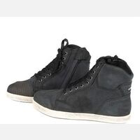                                                                                           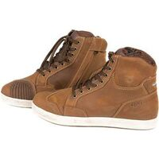                                                                                           |                                                                                           

## Modèles à 83,26 € :

 | Modèle | Photos |
|---|---|
|                                                                                           **RST - FRONTIER LADIES**                                                                                                                                                                                        EN13634-1122                                                                                            ") Modèle femme                                                                                            ") Eté                                                                                                                                                                                        **Pages fabricant :**                                                                                            - [frontier-ce-ladies-boot](https://www.rst-moto.com/products/frontier-ce-ladies-boot)                                                                                                                                                                                        **Lieu de fabrication :**                                                                                             Inconnu                                                                                                                                                                                        **Caractéristiques :**                                                                                            ") Respirant                                                                                                                                                                                        **Prix en ligne au moment de la rédaction :**                                                                                            - [83,26 € (motoblouz)](https://pkw.motoblouz.com/?P4122157BDFF171&redir=https%3A%2F%2Fwww.motoblouz.com%2Frecherche%2FRST%2520FRONTIER%252020FEMME.html)                                                                                            - [93,46 € (fcmoto)](https://www.fc-moto.de/epages/fcm.sf/fr_FR/?ViewAction=FacetedSearchProducts&SearchString=RST+FRONTIER+20DAMES)                                                                                            - 109,95 £ (fabricant)                                                                                            - [Rechercher (motardinn)](https://www.tradeinn.com/motardinn/fr?products_search%5Bquery%5D=RST+FRONTIER)                                                                                            - [Rechercher (dafymoto)](https://www.dafy-moto.com/recherche?string=RST+FRONTIER)                                                                                                                                                                                        **Aide à la recherche :**                                                                                            *Rechercher en occasion (~20-60 €)*                                                                                            [ Leboncoin](https://www.leboncoin.fr/recherche?text=moto+RST+FRONTIER&shippable=1&sort=price&order=asc) [ Vinted](https://www.vinted.fr/catalog?search_text=moto+RST+FRONTIER&order=price_low_to_high) *Recherches diverses :*                                                                                            [ Google](https://www.google.com/search?q=moto+RST+FRONTIER) [ Youtube](https://www.youtube.com/results?search_query=moto+RST+FRONTIER)                                                                                            |                                                                                                                                                                                      |                                                                                           
|                                                                                           **RST - FRONTIER MENS**                                                                                                                                                                                        EN13634-1122                                                                                            ") Modèle mixte femme/homme                                                                                            ") Eté                                                                                                                                                                                        **Pages fabricant :**                                                                                            - [frontier-ce-mens-boot](https://www.rst-moto.com/products/frontier-ce-mens-boot)                                                                                                                                                                                        **Lieu de fabrication :**                                                                                             Inconnu                                                                                                                                                                                        **Caractéristiques :**                                                                                            ") Respirant                                                                                                                                                                                        **Prix en ligne au moment de la rédaction :**                                                                                            - [83,26 € (motoblouz)](https://pkw.motoblouz.com/?P4122157BDFF171&redir=https%3A%2F%2Fwww.motoblouz.com%2Frecherche%2FRST%2520FRONTIER%252020HOMME.html)                                                                                            - [93,46 € (fcmoto)](https://www.fc-moto.de/epages/fcm.sf/fr_FR/?ViewAction=FacetedSearchProducts&SearchString=RST+FRONTIER+20HOMME)                                                                                            - 109,95 £ (fabricant)                                                                                            - [Rechercher (motardinn)](https://www.tradeinn.com/motardinn/fr?products_search%5Bquery%5D=RST+FRONTIER)                                                                                            - [Rechercher (dafymoto)](https://www.dafy-moto.com/recherche?string=RST+FRONTIER)                                                                                                                                                                                        **Aide à la recherche :**                                                                                            *Rechercher en occasion (~20-60 €)*                                                                                            [ Leboncoin](https://www.leboncoin.fr/recherche?text=moto+RST+FRONTIER&shippable=1&sort=price&order=asc) [ Vinted](https://www.vinted.fr/catalog?search_text=moto+RST+FRONTIER&order=price_low_to_high) *Recherches diverses :*                                                                                            [ Google](https://www.google.com/search?q=moto+RST+FRONTIER) [ Youtube](https://www.youtube.com/results?search_query=moto+RST+FRONTIER)                                                                                            |                                                                                           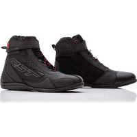                                                                                           |                                                                                           

## Modèles à 91,59 € :

 | Modèle | Photos |
|---|---|
|                                                                                           **RST - STUNT X LADIES**                                                                                                                                                                                        EN13634-1221                                                                                            ") Modèle femme                                                                                            ") Eté                                                                                                                                                                                        **Pages fabricant :**                                                                                            - [stunt-x-ce-ladies-waterproof-boot](https://www.rst-moto.com/products/stunt-x-ce-ladies-waterproof-boot)                                                                                                                                                                                        **Lieu de fabrication :**                                                                                             Inconnu                                                                                                                                                                                        **Caractéristiques :**                                                                                            ") Respirant                                                                                            ") Imperméable                                                                                                                                                                                        **Prix en ligne au moment de la rédaction :**                                                                                            - [91,59 € (motoblouz)](https://pkw.motoblouz.com/?P4122157BDFF171&redir=https%3A%2F%2Fwww.motoblouz.com%2Frecherche%2FRST%2520STUNT%252020X%252020FEMME.html)                                                                                            - [101,96 € (fcmoto)](https://www.fc-moto.de/epages/fcm.sf/fr_FR/?ViewAction=FacetedSearchProducts&SearchString=RST+STUNT+20X+20DAMES)                                                                                            - 119,95 £ (fabricant)                                                                                            - [Rechercher (motardinn)](https://www.tradeinn.com/motardinn/fr?products_search%5Bquery%5D=RST+STUNT+X)                                                                                            - [Rechercher (dafymoto)](https://www.dafy-moto.com/recherche?string=RST+STUNT+X)                                                                                                                                                                                        **Aide à la recherche :**                                                                                            *Rechercher en occasion (~30-60 €)*                                                                                            [ Leboncoin](https://www.leboncoin.fr/recherche?text=moto+RST+STUNT+X&shippable=1&sort=price&order=asc) [ Vinted](https://www.vinted.fr/catalog?search_text=moto+RST+STUNT+X&order=price_low_to_high) *Recherches diverses :*                                                                                            [ Google](https://www.google.com/search?q=moto+RST+STUNT+X) [ Youtube](https://www.youtube.com/results?search_query=moto+RST+STUNT+X)                                                                                            |                                                                                                                                                                                      |                                                                                           
|                                                                                           **RST - STUNT X MENS**                                                                                                                                                                                        EN13634-1221                                                                                            ") Modèle mixte femme/homme                                                                                            ") Eté                                                                                                                                                                                        **Pages fabricant :**                                                                                            - [stunt-x-ce-mens-waterproof-boot](https://www.rst-moto.com/products/stunt-x-ce-mens-waterproof-boot)                                                                                                                                                                                        **Lieu de fabrication :**                                                                                             Inconnu                                                                                                                                                                                        **Caractéristiques :**                                                                                            ") Respirant                                                                                            ") Imperméable                                                                                                                                                                                        **Prix en ligne au moment de la rédaction :**                                                                                            - [91,59 € (motoblouz)](https://pkw.motoblouz.com/?P4122157BDFF171&redir=https%3A%2F%2Fwww.motoblouz.com%2Frecherche%2FRST%2520STUNT%252020X%252020HOMME.html)                                                                                            - 119,95 £ (fabricant)                                                                                            - [Rechercher (fcmoto)](https://www.fc-moto.de/epages/fcm.sf/fr_FR/?ViewAction=FacetedSearchProducts&SearchString=RST+STUNT+X)                                                                                            - [Rechercher (motardinn)](https://www.tradeinn.com/motardinn/fr?products_search%5Bquery%5D=RST+STUNT+X)                                                                                            - [Rechercher (dafymoto)](https://www.dafy-moto.com/recherche?string=RST+STUNT+X)                                                                                                                                                                                        **Aide à la recherche :**                                                                                            *Rechercher en occasion (~30-60 €)*                                                                                            [ Leboncoin](https://www.leboncoin.fr/recherche?text=moto+RST+STUNT+X&shippable=1&sort=price&order=asc) [ Vinted](https://www.vinted.fr/catalog?search_text=moto+RST+STUNT+X&order=price_low_to_high) *Recherches diverses :*                                                                                            [ Google](https://www.google.com/search?q=moto+RST+STUNT+X) [ Youtube](https://www.youtube.com/results?search_query=moto+RST+STUNT+X)                                                                                            |                                                                                           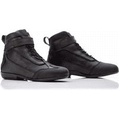                                                                                           |                                                                                           

## Modèles à 99,88 € :

 | Modèle | Photos |
|---|---|
|                                                                                           **DXR - KRUGER SHORT**                                                                                                                                                                                        EN13634-1122 IPA                                                                                            ") Modèle mixte femme/homme                                                                                                                                                                                        **Pages fabricant :**                                                                                            - [vente-demi-bottes-dxr-kruger-short-196450](https://www.motoblouz.com/vente-demi-bottes-dxr-kruger-short-196450.html)                                                                                                                                                                                        **Lieu de fabrication :**                                                                                             Inconnu                                                                                                                                                                                        **Caractéristiques :**                                                                                            ") Cuir                                                                                             (image modifiée : Tabler-icons)") Imperméable (Gore-Tex)                                                                                                                                                                                        **Prix en ligne au moment de la rédaction :**                                                                                            - [99,88 € (motoblouz)](https://pkw.motoblouz.com/?P4122157BDFF171&redir=https%3A%2F%2Fwww.motoblouz.com%2Frecherche%2FDXR%2520KRUGER%252020SHORT.html)                                                                                            - 149,90 € (fabricant)                                                                                            - [Rechercher (fcmoto)](https://www.fc-moto.de/epages/fcm.sf/fr_FR/?ViewAction=FacetedSearchProducts&SearchString=DXR+KRUGER+SHORT)                                                                                            - [Rechercher (motardinn)](https://www.tradeinn.com/motardinn/fr?products_search%5Bquery%5D=DXR+KRUGER+SHORT)                                                                                            - [Rechercher (dafymoto)](https://www.dafy-moto.com/recherche?string=DXR+KRUGER+SHORT)                                                                                                                                                                                        **Aide à la recherche :**                                                                                            *Rechercher en occasion (~30-70 €)*                                                                                            [ Leboncoin](https://www.leboncoin.fr/recherche?text=moto+DXR+KRUGER+SHORT&shippable=1&sort=price&order=asc) [ Vinted](https://www.vinted.fr/catalog?search_text=moto+DXR+KRUGER+SHORT&order=price_low_to_high) *Recherches diverses :*                                                                                            [ Google](https://www.google.com/search?q=moto+DXR+KRUGER+SHORT) [ Youtube](https://www.youtube.com/results?search_query=moto+DXR+KRUGER+SHORT)                                                                                            |                                                                                           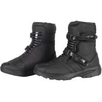                                                                                           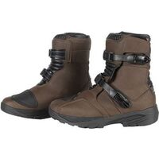                                                                                           |                                                                                           

## Modèles à 108,21 € :

 | Modèle | Photos |
|---|---|
|                                                                                           **DXR - PIVOT SHORT**                                                                                                                                                                                        EN13634-1221 IPA                                                                                            ") Modèle mixte femme/homme                                                                                            ") Eté                                                                                                                                                                                        **Pages fabricant :**                                                                                            - [vente-demi-bottes-dxr-pivot-short-209843](https://www.motoblouz.com/vente-demi-bottes-dxr-pivot-short-209843.html)                                                                                                                                                                                        **Lieu de fabrication :**                                                                                             Inconnu                                                                                                                                                                                        **Caractéristiques :**                                                                                            ") Cuir                                                                                            ") Respirant                                                                                             (image modifiée : Tabler-icons)") Imperméable (Gore-Tex)                                                                                                                                                                                        **Prix en ligne au moment de la rédaction :**                                                                                            - [108,21 € (motoblouz)](https://pkw.motoblouz.com/?P4122157BDFF171&redir=https%3A%2F%2Fwww.motoblouz.com%2Frecherche%2FDXR%2520PIVOT%252020SHORT.html)                                                                                            - 159,90 € (fabricant)                                                                                            - [Rechercher (fcmoto)](https://www.fc-moto.de/epages/fcm.sf/fr_FR/?ViewAction=FacetedSearchProducts&SearchString=DXR+PIVOT+SHORT)                                                                                            - [Rechercher (motardinn)](https://www.tradeinn.com/motardinn/fr?products_search%5Bquery%5D=DXR+PIVOT+SHORT)                                                                                            - [Rechercher (dafymoto)](https://www.dafy-moto.com/recherche?string=DXR+PIVOT+SHORT)                                                                                                                                                                                        **Aide à la recherche :**                                                                                            *Rechercher en occasion (~30-80 €)*                                                                                            [ Leboncoin](https://www.leboncoin.fr/recherche?text=moto+DXR+PIVOT+SHORT&shippable=1&sort=price&order=asc) [ Vinted](https://www.vinted.fr/catalog?search_text=moto+DXR+PIVOT+SHORT&order=price_low_to_high) *Recherches diverses :*                                                                                            [ Google](https://www.google.com/search?q=moto+DXR+PIVOT+SHORT) [ Youtube](https://www.youtube.com/results?search_query=moto+DXR+PIVOT+SHORT)                                                                                            |                                                                                           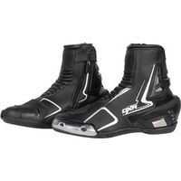                                                                                           |                                                                                           

## Modèles à 137,28 € :

 | Modèle | Photos |
|---|---|
|                                                                                           **REV-IT - ARROW**                                                                                                                                                                                        EN13634-1221                                                                                            ") Modèle mixte femme/homme                                                                                            ") Eté                                                                                                                                                                                        **Pages fabricant :**                                                                                            - [chaussures-moto-arrow-taupe-marron](https://www.revitsport.com/fr_fr/chaussures-moto-arrow-taupe-marron)                                                                                            - [chaussures-moto-arrow-gris-blanc](https://www.revitsport.com/fr_fr/chaussures-moto-arrow-gris-blanc)                                                                                            - [chaussures-moto-arrow-noir](https://www.revitsport.com/fr_fr/chaussures-moto-arrow-noir)                                                                                                                                                                                        **Lieu de fabrication :**                                                                                             Inconnu                                                                                                                                                                                        **Caractéristiques :**                                                                                            ") Cuir                                                                                            ") Respirant                                                                                                                                                                                        **De bonnes présentations :**                                                                                            [ Youtube : RevZilla - REV-IT-Arrow-Women-s-Shoes-Review](https://www.youtube.com/watch?v=b1YOm0BhNVY)                                                                                            [ Youtube : Urban-Rider - Rev-It-Arrow-Motorcycle-Trainer-Review](https://www.youtube.com/watch?v=oyVTHm4Gu-4)                                                                                            [ Youtube : Urban-Rider - TOP-5-Riding-Trainers-2023](https://www.youtube.com/watch?v=YCWO1Hk3UDg)                                                                                            [ Youtube : Champion-Helmets - Revit-Arrow-Riding-Sneaker-Review-ChampionHelmets-com](https://www.youtube.com/watch?v=Ncj7WQzWRNg)                                                                                            [ Youtube : Champion-Helmets - Revit-Arrow-Black-Shoe-ChampionHelmets-com](https://www.youtube.com/watch?v=O5Asomjf_SI)                                                                                                                                                                                        **Prix en ligne au moment de la rédaction :**                                                                                            - [137,28 € (motoblouz)](https://pkw.motoblouz.com/?P4122157BDFF171&redir=https%3A%2F%2Fwww.motoblouz.com%2Frecherche%2FREV%252020IT%2520ARROW.html)                                                                                            - [141,65 € (dafymoto)](https://www.dafy-moto.com/recherche?string=REV%2020IT%20ARROW)                                                                                            - 169,99 € (fabricant)                                                                                            - [Rechercher (fcmoto)](https://www.fc-moto.de/epages/fcm.sf/fr_FR/?ViewAction=FacetedSearchProducts&SearchString=REV+IT+ARROW)                                                                                            - [Rechercher (motardinn)](https://www.tradeinn.com/motardinn/fr?products_search%5Bquery%5D=REV+IT+ARROW)                                                                                                                                                                                        **Aide à la recherche :**                                                                                            *Rechercher en occasion (~40-100 €)*                                                                                            [ Leboncoin](https://www.leboncoin.fr/recherche?text=moto+REV+IT+ARROW&shippable=1&sort=price&order=asc) [ Vinted](https://www.vinted.fr/catalog?search_text=moto+REV+IT+ARROW&order=price_low_to_high) *Recherches diverses :*                                                                                            [ Google](https://www.google.com/search?q=moto+REV+IT+ARROW) [ Youtube](https://www.youtube.com/results?search_query=moto+REV+IT+ARROW)                                                                                            |                                                                                           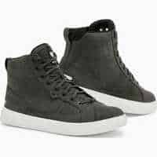                                                                                           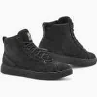                                                                                           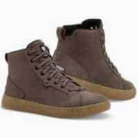                                                                                           |                                                                                           

## Modèles à 145,36 € :

 | Modèle | Photos |
|---|---|
|                                                                                           **REV-IT - CAYMAN**                                                                                                                                                                                        EN13634-1122 IPS                                                                                            ") Modèle mixte femme/homme                                                                                            ") Eté                                                                                                                                                                                        **Pages fabricant :**                                                                                            - [chaussures-moto-cayman-noir](https://www.revitsport.com/fr_fr/chaussures-moto-cayman-noir)                                                                                                                                                                                        **Lieu de fabrication :**                                                                                             Inconnu                                                                                                                                                                                        **Caractéristiques :**                                                                                            ") Cuir                                                                                            ") Respirant                                                                                                                                                                                        **Prix en ligne au moment de la rédaction :**                                                                                            - [145,36 € (motoblouz)](https://pkw.motoblouz.com/?P4122157BDFF171&redir=https%3A%2F%2Fwww.motoblouz.com%2Frecherche%2FREV%252020IT%2520CAYMAN.html)                                                                                            - [149,99 € (dafymoto)](https://www.dafy-moto.com/recherche?string=REV%2020IT%20CAYMAN)                                                                                            - 179,99 € (fabricant)                                                                                            - [Rechercher (fcmoto)](https://www.fc-moto.de/epages/fcm.sf/fr_FR/?ViewAction=FacetedSearchProducts&SearchString=REV+IT+CAYMAN)                                                                                            - [Rechercher (motardinn)](https://www.tradeinn.com/motardinn/fr?products_search%5Bquery%5D=REV+IT+CAYMAN)                                                                                                                                                                                        **Aide à la recherche :**                                                                                            *Rechercher en occasion (~40-100 €)*                                                                                            [ Leboncoin](https://www.leboncoin.fr/recherche?text=moto+REV+IT+CAYMAN&shippable=1&sort=price&order=asc) [ Vinted](https://www.vinted.fr/catalog?search_text=moto+REV+IT+CAYMAN&order=price_low_to_high) *Recherches diverses :*                                                                                            [ Google](https://www.google.com/search?q=moto+REV+IT+CAYMAN) [ Youtube](https://www.youtube.com/results?search_query=moto+REV+IT+CAYMAN)                                                                                            |                                                                                           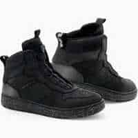                                                                                           |                                                                                           
|                                                                                           **REV-IT - DELTA H20**                                                                                                                                                                                        EN13634-1221 WR                                                                                            ") Modèle mixte femme/homme                                                                                                                                                                                        **Pages fabricant :**                                                                                            - [chaussures-moto-delta-h20-noir](https://www.revitsport.com/fr_fr/chaussures-moto-delta-h20-noir)                                                                                            - [chaussures-moto-delta-h20-bleu-fonc-c3-a9-noir](https://www.revitsport.com/fr_fr/chaussures-moto-delta-h20-bleu-fonc-c3-a9-noir)                                                                                                                                                                                        **Lieu de fabrication :**                                                                                             Inconnu                                                                                                                                                                                        **Caractéristiques :**                                                                                            ") Imperméable                                                                                                                                                                                        **Une bonne présentation :**                                                                                            [ Youtube : Urban-Rider - Rev-It-Delta-Motorcycle-Trainer-Review](https://www.youtube.com/watch?v=yJVbdyUYuic)                                                                                                                                                                                        **Prix en ligne au moment de la rédaction :**                                                                                            - [145,36 € (motoblouz)](https://pkw.motoblouz.com/?P4122157BDFF171&redir=https%3A%2F%2Fwww.motoblouz.com%2Frecherche%2FREV%252020IT%2520DELTA%252020H20.html)                                                                                            - [149,99 € (dafymoto)](https://www.dafy-moto.com/recherche?string=REV%2020IT%20DELTA%2020H20)                                                                                            - 179,99 € (fabricant)                                                                                            - [Rechercher (fcmoto)](https://www.fc-moto.de/epages/fcm.sf/fr_FR/?ViewAction=FacetedSearchProducts&SearchString=REV+IT+DELTA+H20)                                                                                            - [Rechercher (motardinn)](https://www.tradeinn.com/motardinn/fr?products_search%5Bquery%5D=REV+IT+DELTA+H20)                                                                                                                                                                                        **Aide à la recherche :**                                                                                            *Rechercher en occasion (~40-100 €)*                                                                                            [ Leboncoin](https://www.leboncoin.fr/recherche?text=moto+REV+IT+DELTA+H20&shippable=1&sort=price&order=asc) [ Vinted](https://www.vinted.fr/catalog?search_text=moto+REV+IT+DELTA+H20&order=price_low_to_high) *Recherches diverses :*                                                                                            [ Google](https://www.google.com/search?q=moto+REV+IT+DELTA+H20) [ Youtube](https://www.youtube.com/results?search_query=moto+REV+IT+DELTA+H20)                                                                                            |                                                                                           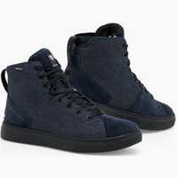                                                                                                                                                                                      |                                                                                           
|                                                                                           **REV-IT - DELTA H2O LADIES**                                                                                                                                                                                        EN13634-1221 WR                                                                                            ") Modèle femme                                                                                                                                                                                        **Pages fabricant :**                                                                                            - [chaussures-moto-delta-h2o-ladies-bleu-fonc-c3-a9-noir](https://www.revitsport.com/fr_fr/chaussures-moto-delta-h2o-ladies-bleu-fonc-c3-a9-noir)                                                                                            - [chaussures-moto-delta-h2o-ladies-noir](https://www.revitsport.com/fr_fr/chaussures-moto-delta-h2o-ladies-noir)                                                                                                                                                                                        **Lieu de fabrication :**                                                                                             Inconnu                                                                                                                                                                                        **Caractéristiques :**                                                                                            ") Imperméable                                                                                                                                                                                        **Une bonne présentation :**                                                                                            [ Youtube : Urban-Rider - Rev-It-Delta-Motorcycle-Trainer-Review](https://www.youtube.com/watch?v=yJVbdyUYuic)                                                                                                                                                                                        **Prix en ligne au moment de la rédaction :**                                                                                            - [145,36 € (motoblouz)](https://pkw.motoblouz.com/?P4122157BDFF171&redir=https%3A%2F%2Fwww.motoblouz.com%2Frecherche%2FREV%252020IT%2520DELTA%252020H2O%252020FEMME.html)                                                                                            - [149,99 € (dafymoto)](https://www.dafy-moto.com/recherche?string=REV%2020IT%20DELTA%2020H2O%2020FEMME)                                                                                            - 179,99 € (fabricant)                                                                                            - [Rechercher (fcmoto)](https://www.fc-moto.de/epages/fcm.sf/fr_FR/?ViewAction=FacetedSearchProducts&SearchString=REV+IT+DELTA+H2O)                                                                                            - [Rechercher (motardinn)](https://www.tradeinn.com/motardinn/fr?products_search%5Bquery%5D=REV+IT+DELTA+H2O)                                                                                                                                                                                        **Aide à la recherche :**                                                                                            *Rechercher en occasion (~40-100 €)*                                                                                            [ Leboncoin](https://www.leboncoin.fr/recherche?text=moto+REV+IT+DELTA+H2O&shippable=1&sort=price&order=asc) [ Vinted](https://www.vinted.fr/catalog?search_text=moto+REV+IT+DELTA+H2O&order=price_low_to_high) *Recherches diverses :*                                                                                            [ Google](https://www.google.com/search?q=moto+REV+IT+DELTA+H2O) [ Youtube](https://www.youtube.com/results?search_query=moto+REV+IT+DELTA+H2O)                                                                                            |                                                                                           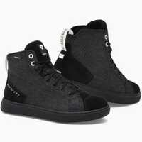                                                                                           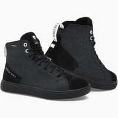                                                                                           |                                                                                           

## Modèles à 149,95 € :

 | Modèle | Photos |
|---|---|
|                                                                                           **REV-IT - DESCENT H2O**                                                                                                                                                                                        EN13634-1122 WR                                                                                            ") Modèle mixte femme/homme                                                                                            ") Eté                                                                                                                                                                                        **Pages fabricant :**                                                                                            - [chaussures-moto-descent-h2o-noir-rouge](https://www.revitsport.com/fr_fr/chaussures-moto-descent-h2o-noir-rouge)                                                                                            - [chaussures-moto-descent-h2o-noir](https://www.revitsport.com/fr_fr/chaussures-moto-descent-h2o-noir)                                                                                                                                                                                        **Lieu de fabrication :**                                                                                             Inconnu                                                                                                                                                                                        **Caractéristiques :**                                                                                            ") Respirant                                                                                            ") Imperméable                                                                                                                                                                                        **Prix en ligne au moment de la rédaction :**                                                                                            - [149,95 € (fcmoto)](https://www.fc-moto.de/epages/fcm.sf/fr_FR/?ViewAction=FacetedSearchProducts&SearchString=REV+20IT+DESCENT+20H2O)                                                                                            - [169,60 € (motoblouz)](https://pkw.motoblouz.com/?P4122157BDFF171&redir=https%3A%2F%2Fwww.motoblouz.com%2Frecherche%2FREV%252020IT%2520DESCENT%252020H2O.html)                                                                                            - [174,98 € (dafymoto)](https://www.dafy-moto.com/recherche?string=REV%2020IT%20DESCENT%2020H2O)                                                                                            - 209,99 € (fabricant)                                                                                            - [Rechercher (motardinn)](https://www.tradeinn.com/motardinn/fr?products_search%5Bquery%5D=REV+IT+DESCENT+H2O)                                                                                                                                                                                        **Aide à la recherche :**                                                                                            *Rechercher en occasion (~40-100 €)*                                                                                            [ Leboncoin](https://www.leboncoin.fr/recherche?text=moto+REV+IT+DESCENT+H2O&shippable=1&sort=price&order=asc) [ Vinted](https://www.vinted.fr/catalog?search_text=moto+REV+IT+DESCENT+H2O&order=price_low_to_high) *Recherches diverses :*                                                                                            [ Google](https://www.google.com/search?q=moto+REV+IT+DESCENT+H2O) [ Youtube](https://www.youtube.com/results?search_query=moto+REV+IT+DESCENT+H2O)                                                                                            |                                                                                           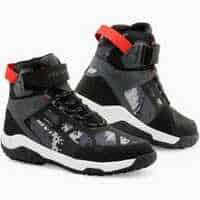                                                                                           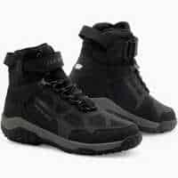                                                                                           |                                                                                           

## Modèles à 169,60 € :

 | Modèle | Photos |
|---|---|
|                                                                                           **REV-IT - FILTER**                                                                                                                                                                                        EN13634-1221                                                                                            ") Modèle mixte femme/homme                                                                                            ") Eté                                                                                                                                                                                        **Pages fabricant :**                                                                                            - [chaussures-moto-filter-gris-neon-jaune](https://www.revitsport.com/fr_fr/chaussures-moto-filter-gris-neon-jaune)                                                                                            - [chaussures-moto-filter-noir-neon-rouge](https://www.revitsport.com/fr_fr/chaussures-moto-filter-noir-neon-rouge)                                                                                                                                                                                        **Lieu de fabrication :**                                                                                             Inconnu                                                                                                                                                                                        **Caractéristiques :**                                                                                            ") Cuir                                                                                            ") Respirant                                                                                                                                                                                        **De bonnes présentations :**                                                                                            [ Youtube : RevZilla - REV-IT-Filter-Shoes-Review](https://www.youtube.com/watch?v=3T8oYRazVUg)                                                                                            [ Youtube : Champion-Helmets - Revit-Filter-Riding-Shoe-Video-Review-ChampionHelmets-com](https://www.youtube.com/watch?v=xoC395IjkMY)                                                                                                                                                                                        **Prix en ligne au moment de la rédaction :**                                                                                            - [169,60 € (motoblouz)](https://pkw.motoblouz.com/?P4122157BDFF171&redir=https%3A%2F%2Fwww.motoblouz.com%2Frecherche%2FREV%252020IT%2520FILTER.html)                                                                                            - [174,98 € (dafymoto)](https://www.dafy-moto.com/recherche?string=REV%2020IT%20FILTER)                                                                                            - 209,99 € (fabricant)                                                                                            - [Rechercher (fcmoto)](https://www.fc-moto.de/epages/fcm.sf/fr_FR/?ViewAction=FacetedSearchProducts&SearchString=REV+IT+FILTER)                                                                                            - [Rechercher (motardinn)](https://www.tradeinn.com/motardinn/fr?products_search%5Bquery%5D=REV+IT+FILTER)                                                                                                                                                                                        **Aide à la recherche :**                                                                                            *Rechercher en occasion (~50-120 €)*                                                                                            [ Leboncoin](https://www.leboncoin.fr/recherche?text=moto+REV+IT+FILTER&shippable=1&sort=price&order=asc) [ Vinted](https://www.vinted.fr/catalog?search_text=moto+REV+IT+FILTER&order=price_low_to_high) *Recherches diverses :*                                                                                            [ Google](https://www.google.com/search?q=moto+REV+IT+FILTER) [ Youtube](https://www.youtube.com/results?search_query=moto+REV+IT+FILTER)                                                                                            |                                                                                           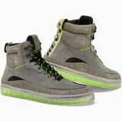                                                                                           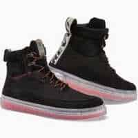                                                                                           |                                                                                           
|                                                                                           **REV-IT - KRAIT GTX**                                                                                                                                                                                        EN13634-1122 WR                                                                                            ") Modèle mixte femme/homme                                                                                            ") Eté                                                                                                                                                                                        **Pages fabricant :**                                                                                            - [chaussures-moto-krait-gtx-noir-gris](https://www.revitsport.com/fr_fr/chaussures-moto-krait-gtx-noir-gris)                                                                                                                                                                                        **Lieu de fabrication :**                                                                                             Inconnu                                                                                                                                                                                        **Caractéristiques :**                                                                                            ") Respirant                                                                                             (image modifiée : Tabler-icons)") Imperméable (Gore-Tex)                                                                                                                                                                                        **De bonnes présentations :**                                                                                            [ Youtube : Urban-Rider - REVIT-Krait-GTX-Motorcycle-Trainer-Review](https://www.youtube.com/watch?v=nTGLa4_In50)                                                                                            [ Youtube : RevZilla - REV-IT-Krait-GTX-Women-s-Shoes-Review](https://www.youtube.com/watch?v=20wOM-Xf1rk)                                                                                            [ Youtube : RevZilla - REV-IT-Krait-GTX-Shoes-Overview](https://www.youtube.com/watch?v=9ugr-0MSqAQ)                                                                                                                                                                                        **Prix en ligne au moment de la rédaction :**                                                                                            - [169,60 € (motoblouz)](https://pkw.motoblouz.com/?P4122157BDFF171&redir=https%3A%2F%2Fwww.motoblouz.com%2Frecherche%2FREV%252020IT%2520KRAIT%252020GTX.html)                                                                                            - [174,98 € (dafymoto)](https://www.dafy-moto.com/recherche?string=REV%2020IT%20KRAIT%2020GTX)                                                                                            - [209,99 € (fcmoto)](https://www.fc-moto.de/epages/fcm.sf/fr_FR/?ViewAction=FacetedSearchProducts&SearchString=REV+20IT+KRAIT+20GTX)                                                                                            - 209,99 € (fabricant)                                                                                            - [Rechercher (motardinn)](https://www.tradeinn.com/motardinn/fr?products_search%5Bquery%5D=REV+IT+KRAIT)                                                                                                                                                                                        **Aide à la recherche :**                                                                                            *Rechercher en occasion (~50-120 €)*                                                                                            [ Leboncoin](https://www.leboncoin.fr/recherche?text=moto+REV+IT+KRAIT&shippable=1&sort=price&order=asc) [ Vinted](https://www.vinted.fr/catalog?search_text=moto+REV+IT+KRAIT&order=price_low_to_high) *Recherches diverses :*                                                                                            [ Google](https://www.google.com/search?q=moto+REV+IT+KRAIT) [ Youtube](https://www.youtube.com/results?search_query=moto+REV+IT+KRAIT)                                                                                            |                                                                                           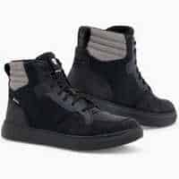                                                                                           |                                                                                           
|                                                                                           **REV-IT - KRAIT GTX LADIES**                                                                                                                                                                                        EN13634-1122 WR                                                                                            ") Modèle femme                                                                                            ") Eté                                                                                                                                                                                        **Pages fabricant :**                                                                                            - [chaussures-moto-krait-gtx-ladies-noir-gris](https://www.revitsport.com/fr_fr/chaussures-moto-krait-gtx-ladies-noir-gris)                                                                                                                                                                                        **Lieu de fabrication :**                                                                                             Inconnu                                                                                                                                                                                        **Caractéristiques :**                                                                                            ") Respirant                                                                                             (image modifiée : Tabler-icons)") Imperméable (Gore-Tex)                                                                                                                                                                                        **De bonnes présentations :**                                                                                            [ Youtube : Urban-Rider - REVIT-Krait-GTX-Motorcycle-Trainer-Review](https://www.youtube.com/watch?v=nTGLa4_In50)                                                                                            [ Youtube : RevZilla - REV-IT-Krait-GTX-Women-s-Shoes-Review](https://www.youtube.com/watch?v=20wOM-Xf1rk)                                                                                            [ Youtube : RevZilla - REV-IT-Krait-GTX-Shoes-Overview](https://www.youtube.com/watch?v=9ugr-0MSqAQ)                                                                                                                                                                                        **Prix en ligne au moment de la rédaction :**                                                                                            - [169,60 € (motoblouz)](https://pkw.motoblouz.com/?P4122157BDFF171&redir=https%3A%2F%2Fwww.motoblouz.com%2Frecherche%2FREV%252020IT%2520KRAIT%252020GTX%252020FEMME.html)                                                                                            - [174,98 € (dafymoto)](https://www.dafy-moto.com/recherche?string=REV%2020IT%20KRAIT%2020GTX%2020FEMME)                                                                                            - [209,99 € (fcmoto)](https://www.fc-moto.de/epages/fcm.sf/fr_FR/?ViewAction=FacetedSearchProducts&SearchString=REV+20IT+KRAIT+20GTX+20DAMES)                                                                                            - 209,99 € (fabricant)                                                                                            - [Rechercher (motardinn)](https://www.tradeinn.com/motardinn/fr?products_search%5Bquery%5D=REV+IT+KRAIT)                                                                                                                                                                                        **Aide à la recherche :**                                                                                            *Rechercher en occasion (~50-120 €)*                                                                                            [ Leboncoin](https://www.leboncoin.fr/recherche?text=moto+REV+IT+KRAIT&shippable=1&sort=price&order=asc) [ Vinted](https://www.vinted.fr/catalog?search_text=moto+REV+IT+KRAIT&order=price_low_to_high) *Recherches diverses :*                                                                                            [ Google](https://www.google.com/search?q=moto+REV+IT+KRAIT) [ Youtube](https://www.youtube.com/results?search_query=moto+REV+IT+KRAIT)                                                                                            |                                                                                           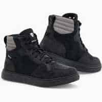                                                                                           |                                                                                           

## Modèles à 218,08 € :

 | Modèle | Photos |
|---|---|
|                                                                                           **REV-IT - BRECCIA GTX**                                                                                                                                                                                        EN13634-1122 WR                                                                                            ") Modèle mixte femme/homme                                                                                            ") Eté                                                                                                                                                                                        **Pages fabricant :**                                                                                            - [chaussures-moto-breccia-gtx-noir](https://www.revitsport.com/fr_fr/chaussures-moto-breccia-gtx-noir)                                                                                                                                                                                        **Lieu de fabrication :**                                                                                             Inconnu                                                                                                                                                                                        **Caractéristiques :**                                                                                            ") Cuir                                                                                            ") Respirant                                                                                             (image modifiée : Tabler-icons)") Imperméable (Gore-Tex)                                                                                                                                                                                        **Prix en ligne au moment de la rédaction :**                                                                                            - [218,08 € (motoblouz)](https://pkw.motoblouz.com/?P4122157BDFF171&redir=https%3A%2F%2Fwww.motoblouz.com%2Frecherche%2FREV%252020IT%2520BRECCIA%252020GTX.html)                                                                                            - [224,98 € (dafymoto)](https://www.dafy-moto.com/recherche?string=REV%2020IT%20BRECCIA%2020GTX)                                                                                            - [269,99 € (fcmoto)](https://www.fc-moto.de/epages/fcm.sf/fr_FR/?ViewAction=FacetedSearchProducts&SearchString=REV+20IT+BRECCIA+20GTX)                                                                                            - 269,99 € (fabricant)                                                                                            - [Rechercher (motardinn)](https://www.tradeinn.com/motardinn/fr?products_search%5Bquery%5D=REV+IT+BRECCIA)                                                                                                                                                                                        **Aide à la recherche :**                                                                                            *Rechercher en occasion (~70-150 €)*                                                                                            [ Leboncoin](https://www.leboncoin.fr/recherche?text=moto+REV+IT+BRECCIA&shippable=1&sort=price&order=asc) [ Vinted](https://www.vinted.fr/catalog?search_text=moto+REV+IT+BRECCIA&order=price_low_to_high) *Recherches diverses :*                                                                                            [ Google](https://www.google.com/search?q=moto+REV+IT+BRECCIA) [ Youtube](https://www.youtube.com/results?search_query=moto+REV+IT+BRECCIA)                                                                                            |                                                                                           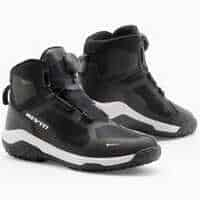                                                                                           |                                                                                           

