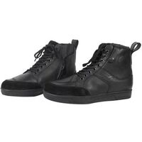
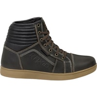
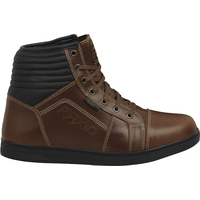
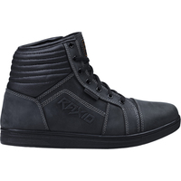
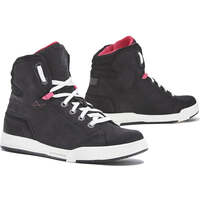
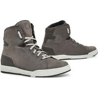
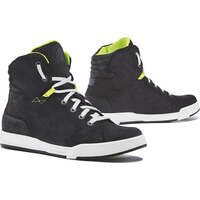
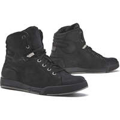
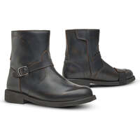
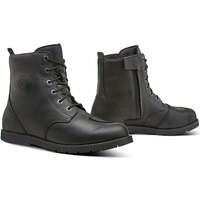

Update of my inventory of motorcycle sneakers/shoes/short boots that meet the maximum EN 13634 : 1222 standard.

I've changed the layout to arrange the equipment by price rather than by brand.

I've also added various indications to help you make your choice: place of manufacture when known, waterproofness, type advertised (just for info, as there's no particular cut for boots).

I put the Motoblouz/Dafy/Fcmoto link when the product was available at the time of writing _(note: I can get a few cents if you go through one of my links to buy on Motoblouz)_.

Some slightly less protective models are listed here, if the choice available isn't to your liking: [Inventory of the "almost" most protective motorcycle shoes, sneakers and short boots (EN 13634:1122, EN 13634:1212, EN 13634:1221) in June 2023]().

The same exercise for high boots: [Inventory of the most protective motorcycle high boots (EN 13634 : 2222) in June 2023]().

---

**Reminders about EN 13634:**

This standard requires motorcycle boots and shoes to display precise information on their level of protection:

- The first number indicates the height of the boot [^1] (1: low, 2: high), and is particularly interesting as a complement to the next 3, which assess the boot's level of protection for a specific hazard;
- Abrasion resistance[^2] ;
- Puncture resistance[^3] ;
- Torsion/crushing resistance[^4].

Today, only 2 levels exist for each, 1 and 2.

Common additional certifications :

- IPA: Malleolus protection
- IPS: Shin protection
- WR: Water penetration resistance
- FO: Resistance to hydrocarbons

---

> *Note:* This page is based on data supplied by manufacturers on their websites.
> Its generation is largely automated, so there may be some errors.
> 
> The manufacturers analyzed are
> [ACERBIS](https://www.acerbis.com/), 
[ALPINESTARS](https://www.alpinestars.com/), 
[BERING](https://bering.fr/), 
[BMW](https://www.bmw-motorrad.fr/), 
[BULL-IT](https://www.bull-it.com/), 
[COURSE](https://www.xlmoto.com/), 
[DAINESE](https://www.dainese.com), 
[DUCATI](https://www.ducati.com/), 
[DXR](https://www.motoblouz.com/), 
[ESQUAD](https://www.esquad.fr/), 
[EUDOXIE](https://eudoxie.shop/), 
[FALCO](https://giannifalco.com/), 
[FIVE](https://five-gloves.com/), 
[FORMA](https://www.formabootsusa.com/), 
[FUEL](https://fuelmotorcycles.eu/), 
[FURYGAN](https://www.furygan.com/), 
[GOLDTOP](https://goldtop.co.uk/), 
[HALVARSSONS](https://halvarssonsmc.com/), 
[HELSTONS](https://www.helstons.net/), 
[HEVIK](https://www.hevik.co.uk/), 
[HOOD](https://www.hoodjeans.co.uk), 
[IXON](https://www.ixon.com/), 
[IXS](https://ixs.com/), 
[JOHN-DOE](https://www.ridejohndoe.com/), 
[KLIM](https://www.klim.com/), 
[KNOX](https://www.planet-knox.com), 
[LOUIS](https://www.louis.ie), 
[LS2](https://www.ls2usa.com/), 
[MERLAMOTO](https://merlamoto.com/), 
[MERLIN](https://www.merlinbikegear.shop/), 
[MOTOGIRL](https://motogirl.co.uk/), 
[OJ](https://ojworld.it/), 
[OXFORD](https://www.oxfordproducts.com/), 
[PANDO](https://pandomoto.com/), 
[PMJ](https://pmj.it/), 
[RACERED](https://racered.eu/), 
[RACER](https://www.racer1927.com/), 
[RAXID](https://raxid.co.uk), 
[RESURGENCE-GEAR](https://resurgencegear.net/), 
[REVIT](https://www.revitsport.com/), 
[ROADSKIN](https://roadskin.co.uk/), 
[ROKKER](https://www.eu.therokkercompany.com/), 
[RST](https://www.rst-moto.com/), 
[RUKKA](https://luhta.com/), 
[SEGURA](https://segura-moto.fr/), 
[SEVENTY-DEGREES](https://seventy-70.com/), 
[SIDI](https://www.sidi.com/), 
[SOUBIRAC](https://www.soubirac.fr/), 
[SPIDI](https://www.spidi.com/), 
[TCX](https://www.tcxboots.com/), 
[2MILESIX](https://www.2milesix.com/).

> 
> The following manufacturers have been excluded because they do not display the safety level of their products, or are not marketed in Europe: ARLEN NESS, ARMURE, BELSTAFF, BILT, BOGOTTO, BOLID'STER, DRAGGIN, DRIRIDER, ELEVEIT, FLY MOTO, FOX, GAERNE, HARLEY DAVIDSON, HELD, HOLYFREEDOM, HONDA, ICON, INDIAN, KAWASAKI, KLIM, KTM, LEATT, MACNA, O'NEAL, OVERLAP, REAX, RICHA, RJAYS, RST, RUSTY STITCHES, SAINT, SCOTT, SEDICI, SHOT, SIDI, SOUBIRAC, SPIRIT MOTORS, STADLER, STREET & STEEL, STYLMARTIN, THOR, TRIUMPH, VENDRAMINI, WEX, XPD, YAMAHA

---

## Models at 67,92 € :

 | Modèle | Photos |
|---|---|
|                                                                                           **[DXR - BASKETS OLLIE](https://www.motoblouz.com/vente-baskets-dxr-ollie-197451.html)**                                                                                                                                                                                       EN13634-1222 IPA                                                                                                                                                                                        ") men's version                                                                                                                                                                                                                                                                                   ") Leather                                                                                                                                                                                       ") Waterproof                                                                                                                                                                                                                                                                                   Place of manufacture unknown.                                                                                                                                                                                                                                                                                   Price online at time of writing:                                                                                            - [67,92 €](https://pkw.motoblouz.com/?P4122157BDFF171&redir=https%3A%2F%2Fwww.motoblouz.com%2Frecherche%2FDXR%2520BASKETS%2520OLLIE.html) (motoblouz)                                                                                            - [119,90 €](https://www.motoblouz.com/vente-baskets-dxr-ollie-197451.html) (manufacturer)                                                                                                                                                                                                                                                                                    To find them second-hand (~20-50 €) :                                                                                                                                                                                        |                                                                                                                                                                                      |                                                                                           

## Models at 69,95 £ :

 | Modèle | Photos |
|---|---|
|                                                                                           **[RAXID - SYDNEY](https://raxid.co.uk/product/sydney-motorcycle-boots-2/)**                                                                                                                                                                                       EN13634-1222 WR                                                                                                                                                                                                                                                                                    ") Leather                                                                                                                                                                                                                                                                                   Place of manufacture unknown.                                                                                                                                                                                                                                                                                   Price online at time of writing:                                                                                            - [69,95 £](https://raxid.co.uk/product/sydney-motorcycle-boots-2/) (manufacturer)                                                                                                                                                                                                                                                                                    To find them second-hand (~20-50 €) :                                                                                                                                                                                        |                                                                                                                                                                                                                                                                                                                                                                            |                                                                                           

## Models at 76,41 € :

 | Modèle | Photos |
|---|---|
|                                                                                           **[DXR - BASKETS BEBOP](https://www.motoblouz.com/vente-baskets-dxr-bebop-200515.html)**                                                                                                                                                                                       EN13634-1222 IPA                                                                                                                                                                                        ") men's version                                                                                                                                                                                        Summer                                                                                                                                                                                                                                                                                   ") Leather                                                                                                                                                                                       ") Waterproof                                                                                                                                                                                       ") Breathable                                                                                                                                                                                                                                                                                   Place of manufacture unknown.                                                                                                                                                                                                                                                                                   Price online at time of writing:                                                                                            - [76,41 €](https://pkw.motoblouz.com/?P4122157BDFF171&redir=https%3A%2F%2Fwww.motoblouz.com%2Frecherche%2FDXR%2520BASKETS%2520BEBOP.html) (motoblouz)                                                                                            - [119,90 €](https://www.motoblouz.com/vente-baskets-dxr-bebop-200515.html) (manufacturer)                                                                                                                                                                                                                                                                                    To find them second-hand (~20-50 €) :                                                                                                                                                                                        |                                                                                                                                                                                      |                                                                                           
|                                                                                           **[DXR - BASKETS CRUNCK](https://www.motoblouz.com/vente-baskets-dxr-crunck-200516.html)**                                                                                                                                                                                       EN13634-1222 IPA                                                                                                                                                                                        ") men's version                                                                                                                                                                                        Summer                                                                                                                                                                                                                                                                                   ") Waterproof                                                                                                                                                                                       ") Breathable                                                                                                                                                                                                                                                                                   Place of manufacture unknown.                                                                                                                                                                                                                                                                                   Price online at time of writing:                                                                                            - [76,41 €](https://pkw.motoblouz.com/?P4122157BDFF171&redir=https%3A%2F%2Fwww.motoblouz.com%2Frecherche%2FDXR%2520BASKETS%2520CRUNCK.html) (motoblouz)                                                                                            - [119,90 €](https://www.motoblouz.com/vente-baskets-dxr-crunck-200516.html) (manufacturer)                                                                                                                                                                                                                                                                                    To find them second-hand (~20-50 €) :                                                                                                                                                                                        |                                                                                                                                                                                      |                                                                                           
|                                                                                           **[DXR - BASKETS SANTA CRUZ WATERPROOF](https://www.motoblouz.com/vente-baskets-dxr-santa-cruz-denim-waterproof-114669.html)**                                                                                                                                                                                       EN13634-1222 IPA                                                                                                                                                                                        ") men's version                                                                                                                                                                                        Summer                                                                                                                                                                                                                                                                                   ") Waterproof                                                                                                                                                                                       ") Breathable                                                                                                                                                                                                                                                                                   Place of manufacture unknown.                                                                                                                                                                                                                                                                                   Price online at time of writing:                                                                                            - [76,41 €](https://pkw.motoblouz.com/?P4122157BDFF171&redir=https%3A%2F%2Fwww.motoblouz.com%2Frecherche%2FDXR%2520BASKETS%2520SANTA%2520CRUZ%2520WATERPROOF.html) (motoblouz)                                                                                            - [119,90 €](https://www.motoblouz.com/vente-baskets-dxr-santa-cruz-denim-waterproof-114669.html) (manufacturer)                                                                                                                                                                                                                                                                                    To find them second-hand (~20-50 €) :                                                                                                                                                                                        |                                                                                                                                                                                                                                                                                                                                                                            |                                                                                           

## Models at 126,47 € :

 | Modèle | Photos |
|---|---|
|                                                                                           **[FORMA - SWIFT DRY LADY](https://www.formabootsusa.com/collections/womens/products/swift-dry-lady-black-white)**                                                                                                                                                                                       EN13634-1222 WR                                                                                                                                                                                        ") women's version                                                                                                                                                                                                                                                                                   ") Leather                                                                                                                                                                                       ") Waterproof                                                                                                                                                                                                                                                                                   Fabriqué en Europe :   ") Romania                                                                                                                                                                                                                                                                                   Price online at time of writing:                                                                                            - [126,47 €](https://www.dafy-moto.com/recherche?string=FORMA%20SWIFT%20DRY%20FEMME) (dafy)                                                                                            - [136,95 €](https://www.fc-moto.de/epages/fcm.sf/fr_FR/?ViewAction=FacetedSearchProducts&SearchString=FORMA+SWIFT%20DRY%20DAMES) (fcmoto)                                                                                            - [181,73 €](https://pkw.motoblouz.com/?P4122157BDFF171&redir=https%3A%2F%2Fwww.motoblouz.com%2Frecherche%2FFORMA%2520SWIFT%2520DRY%2520FEMME.html) (motoblouz)                                                                                            - [199,00 $](https://www.formabootsusa.com/collections/womens/products/swift-dry-lady-black-white) (manufacturer)                                                                                                                                                                                                                                                                                    To find them second-hand (~40-90 €) :                                                                                                                                                                                        |                                                                                                                                                                                      |                                                                                           

## Models at 126,39 € :

 | Modèle | Photos |
|---|---|
|                                                                                           **[FORMA - SWIFT DRY](https://www.formabootsusa.com/collections/ride-urban/products/swift-dry-black)**                                                                                                                                                                                       EN13634-1222 WR                                                                                                                                                                                        ") mixed model                                                                                                                                                                                                                                                                                   ") Leather                                                                                                                                                                                       ") Waterproof                                                                                                                                                                                                                                                                                   Fabriqué en Europe :   ") Romania                                                                                                                                                                                                                                                                                   Une bonne présentation sur Youtube :                                                                                            [RevZilla - Forma Swift Dry & Flow Shoes Review](https://www.youtube.com/watch?v=F9kqYSXoKec)                                                                                                                                                                                        Price online at time of writing:                                                                                            - [126,39 €](https://pkw.motoblouz.com/?P4122157BDFF171&redir=https%3A%2F%2Fwww.motoblouz.com%2Frecherche%2FFORMA%2520SWIFT%2520DRY.html) (motoblouz)                                                                                            - [126,47 €](https://www.dafy-moto.com/recherche?string=FORMA%20SWIFT%20DRY) (dafy)                                                                                            - [136,95 €](https://www.fc-moto.de/epages/fcm.sf/fr_FR/?ViewAction=FacetedSearchProducts&SearchString=FORMA+SWIFT%20DRY) (fcmoto)                                                                                            - [199,00 $](https://www.formabootsusa.com/collections/ride-urban/products/swift-dry-black) (manufacturer)                                                                                                                                                                                                                                                                                    To find them second-hand (~40-90 €) :                                                                                                                                                                                        |                                                                                                                                                                                                                                                                                                                                                                            |                                                                                           
|                                                                                           **[FORMA - SWIFT FLOW](https://www.formabootsusa.com/collections/ride-urban/products/swift-flow-black-white)**                                                                                                                                                                                       EN13634-1222                                                                                                                                                                                        ") mixed model                                                                                                                                                                                        Summer                                                                                                                                                                                                                                                                                   ") Leather                                                                                                                                                                                       ") Breathable                                                                                                                                                                                                                                                                                   Fabriqué en Europe :   ") Romania                                                                                                                                                                                                                                                                                   Une bonne présentation sur Youtube :                                                                                            [RevZilla - Forma Swift Dry & Flow Shoes Review](https://www.youtube.com/watch?v=F9kqYSXoKec)                                                                                                                                                                                        Price online at time of writing:                                                                                            - [126,39 €](https://pkw.motoblouz.com/?P4122157BDFF171&redir=https%3A%2F%2Fwww.motoblouz.com%2Frecherche%2FFORMA%2520SWIFT%2520FLOW.html) (motoblouz)                                                                                            - [126,47 €](https://www.dafy-moto.com/recherche?string=FORMA%20SWIFT%20FLOW) (dafy)                                                                                            - [136,95 €](https://www.fc-moto.de/epages/fcm.sf/fr_FR/?ViewAction=FacetedSearchProducts&SearchString=FORMA+SWIFT%20FLOW) (fcmoto)                                                                                            - [199,00 $](https://www.formabootsusa.com/collections/ride-urban/products/swift-flow-black-white) (manufacturer)                                                                                                                                                                                                                                                                                    To find them second-hand (~40-90 €) :                                                                                                                                                                                        |                                                                                                                                                                                      |                                                                                           

## Models at 152,95 € :

 | Modèle | Photos |
|---|---|
|                                                                                           **[FORMA - ELITE](https://www.formabootsusa.com/collections/womens/products/elite-black)**                                                                                                                                                                                       EN13634-1222 WR                                                                                                                                                                                        ") mixed model                                                                                                                                                                                                                                                                                   ") Leather                                                                                                                                                                                       ") Waterproof                                                                                                                                                                                                                                                                                   Fabriqué en Europe :   ") Romania                                                                                                                                                                                                                                                                                   Une bonne présentation sur Youtube :                                                                                            [RevZilla - Forma Elite Boots Review at RevZilla.com](https://www.youtube.com/watch?v=fiVNE13nLqs)                                                                                                                                                                                        Price online at time of writing:                                                                                            - [152,95 €](https://www.fc-moto.de/epages/fcm.sf/fr_FR/?ViewAction=FacetedSearchProducts&SearchString=FORMA+ELITE) (fcmoto)                                                                                            - [219,00 $](https://www.formabootsusa.com/collections/womens/products/elite-black) (manufacturer)                                                                                                                                                                                                                                                                                   To find them second-hand (~50-110 €) :                                                                                                                                                                                        |                                                                                                                                                                                                                                                                                 |                                                                                           

## Models at 159,99 € :

 | Modèle | Photos |
|---|---|
|                                                                                           **[OJ - TRIGGER](https://ojworld.it/scarpe-e-stivali/trigger.html)**                                                                                                                                                                                       EN13634-1222                                                                                                                                                                                                                                                                                                                                                                                Place of manufacture unknown.                                                                                                                                                                                                                                                                                   Price online at time of writing:                                                                                            - [159,99 €](https://ojworld.it/scarpe-e-stivali/trigger.html) (manufacturer)                                                                                                                                                                                                                                                                                    To find them second-hand (~50-110 €) :                                                                                                                                                                                        |                                                                                                                                                                                      |                                                                                           

## Models at 161,95 € :

 | Modèle | Photos |
|---|---|
|                                                                                           **[FORMA - BOLT](https://www.formabootsusa.com/collections/ride-urban/products/bolt)**                                                                                                                                                                                       EN13634-1222                                                                                                                                                                                        ") mixed model                                                                                                                                                                                                                                                                                   ") Leather                                                                                                                                                                                       ") Waterproof                                                                                                                                                                                                                                                                                   Fabriqué en Europe :   ") Romania                                                                                                                                                                                                                                                                                   Price online at time of writing:                                                                                            - [161,95 €](https://www.fc-moto.de/epages/fcm.sf/fr_FR/?ViewAction=FacetedSearchProducts&SearchString=FORMA+BOLT) (fcmoto)                                                                                            - [229,00 $](https://www.formabootsusa.com/collections/ride-urban/products/bolt) (manufacturer)                                                                                                                                                                                         To find them second-hand (~40-100 €) :                                                                                                                                                                                        |                                                                                                                                                                                      |                                                                                           

## Models at 169,99 € :

 | Modèle | Photos |
|---|---|
|                                                                                           **[OJ - MISSION](https://ojworld.it/scarpe-e-stivali/mission.html)**                                                                                                                                                                                       EN13634-1222                                                                                                                                                                                                                                                                                                                                                                                Place of manufacture unknown.                                                                                                                                                                                                                                                                                   Price online at time of writing:                                                                                            - [169,99 €](https://ojworld.it/scarpe-e-stivali/mission.html) (manufacturer)                                                                                                                                                                                                                                                                                    To find them second-hand (~50-120 €) :                                                                                                                                                                                        |                                                                                                                                                                                      |                                                                                           

## Models at 229,00 $ :

 | Modèle | Photos |
|---|---|
|                                                                                           **[FORMA - CREED](https://www.formabootsusa.com/collections/ride-urban/products/creed)**                                                                                                                                                                                       EN13634-1222 WR                                                                                                                                                                                        ") mixed model                                                                                                                                                                                                                                                                                   ") Leather                                                                                                                                                                                       ") Waterproof                                                                                                                                                                                                                                                                                   Fabriqué en Europe :   ") Romania                                                                                                                                                                                                                                                                                   Price online at time of writing:                                                                                            - [229,00 $](https://www.formabootsusa.com/collections/ride-urban/products/creed) (manufacturer)                                                                                                                                                                                                                                                                                    To find them second-hand (~40-100 €) :                                                                                                                                                                                        |                                                                                                                                                                                      |                                                                                           

---

[^1]: **Hauteur de la tige avant/arrière du mollet** ( Norme _CE EN 13634-2017_) :  
    Mesurée à partir du sol :
        1. Niveau 1 : 10,3 cm/6,4 cm en dessous de 36, jusqu'à 12,1 cm / 7,3 cm au dessus de 45.
        2. Niveau 2 : 16,2 cm/11,3 cm en dessous de 36, jusqu'à 19,2 cm / 13,1 cm au dessus de 45.
[^2]: **Résistance à l'abrasion** ( Norme _CE EN 13634-2017_) :  
       Nombre de secondes pour traverser tige+doublure avec une bande abrasive de grain 60 qui tourne à 8 m/s (zone B = risque fort, zone A = reste de la chaussure)
        1. Niveau 1 : 1,5 s zone A, 5 s zone B
        2. Niveau 2 : 2,5 s zone A, 12 s zone B
[^3]: **Résistance à la perforation/coupure** ( Norme _CE EN 13634-2017_) :  
       Une lame est lancée à 2,8 m/s sur tige+doublure et on mesure la pénétration :
        1. Niveau 1 : < 25 mm
        2. Niveau 2 : < 15 mm
[^4]: **Résistance à la torsion** ( Norme _CE EN 13634-2017_) :  
       Mesure de la force nécessaire pour déformer la semelle de 2 cm :
        1. Niveau 1 : > 1 kN
        2. Niveau 2 : > 1,5 kN  
      

    

