*# Dernière mise à jour : 12/11/2023 #*

Mise à jour de mon inventaire des baskets/chaussures/bottes courtes de moto qui atteignent le maximum de la norme EN 13634 : 1222.

J'ai changé la présentation pour ranger les équipements par prix plutôt que par marque.

J'ai aussi ajouté diverses indications permettant de faire son choix : lieu de fabrication quand connu, imperméabilité, genre annoncé (juste pour info, car pour les bottes pas de coupe particulière).

J’ai mis le lien Motoblouz/Dafy/Fcmoto lorsque le produit était disponible au moment de la rédaction de l'article.

_(Note importante : je ne touche pas un centime sur les achats effectués sur ces sites, les liens ne sont là que pour info ! Si l'article vous a plu, vous pouvez en revanche m'offrir un café en suivant le lien en haut d'article :) )_

Quelques bottes légèrement moins protectrices sont listées ici, si le choix n'est pas suffisant : [Inventaire des chaussures, baskets et bottes courtes de moto "presque" les plus protectrices (EN 13634:1122, EN 13634:1212, EN 13634:1221) en juin 2023]().

Le même exercice pour les bottes montantes : [Inventaire des bottes de moto montantes les plus protectrices (EN 13634 : 2222) en juin 2023]().

> _Liste des mises à jour :_  
> _- 12/11/2023 : révision complète de la mise en page, nouveaux liens, etc._  
> _- 13/09/2023 : révision complète de la mise en page, nouveaux liens, etc._

---

**Rappels concernant la norme EN 13634 :**

Elle impose d'afficher sur les étiquettes des chaussures/bottes moto des infos précises sur leur niveau de protection :

- Le premier chiffre indique la hauteur du chaussant[^1] (1 : basse, 2 : haute), il est surtout intéressant en complément des 3 suivants qui évaluent le niveau de protection de la chaussure pour un danger spécifique ;
- Résistance à l'abrasion[^2] ;
- Résistance à la perforation[^3] ;
- Résistance à la torsion/écrasement[^4].

Aujourd'hui seuls 2 niveaux existent pour chacun, 1 et 2.

Certifications complémentaires courantes :

- IPA : Protection de la malléole
- IPS : Protection du tibia
- WR : Résistance à la pénétration de l'eau
- FO : Résistance aux hydrocarbures

---

> *Note :* Cette page a été réalisée à partir des données fournies par les fabricants sur leurs sites Web.
> Sa génération est en grande partie automatisée, il peut donc y avoir quelques erreurs.
> 
> Les fabricants analysés sont les suivants :
> [ACERBIS](https://www.acerbis.com/), 
[ALPINESTARS](https://www.alpinestars.com/), 
[BERING](https://bering.fr/), 
[BMW](https://www.bmw-motorrad.fr/), 
[BULL-IT](https://www.bull-it.com/), 
[COURSE](https://www.xlmoto.com/), 
[DAINESE](https://www.dainese.com), 
[DUCATI](https://www.ducati.com/), 
[DXR](https://www.motoblouz.com/), 
[ESQUAD](https://www.esquad.fr/), 
[EUDOXIE](https://eudoxie.shop/), 
[FALCO](https://giannifalco.com/), 
[FIVE](https://five-gloves.com/), 
[FORMA](https://www.formabootsusa.com/), 
[FUEL](https://fuelmotorcycles.eu/), 
[FURYGAN](https://www.furygan.com/), 
[GOLDTOP](https://goldtop.co.uk/), 
[HALVARSSONS](https://halvarssonsmc.com/), 
[HELSTONS](https://www.helstons.net/), 
[HEVIK](https://www.hevik.co.uk/), 
[HOOD](https://www.hoodjeans.co.uk), 
[IXON](https://www.ixon.com/), 
[IXS](https://ixs.com/), 
[JOHN-DOE](https://www.ridejohndoe.com/), 
[KLIM](https://www.klim.com/), 
[KNOX](https://www.planet-knox.com), 
[LOUIS](https://www.louis.ie), 
[LS2](https://www.ls2usa.com/), 
[MERLAMOTO](https://merlamoto.com/), 
[MERLIN](https://www.merlinbikegear.shop/), 
[MOTOGIRL](https://motogirl.co.uk/), 
[OJ](https://ojworld.it/), 
[OXFORD](https://www.oxfordproducts.com/), 
[PANDO](https://pandomoto.com/), 
[PMJ](https://pmj.it/), 
[RACERED](https://racered.eu/), 
[RACER](https://www.racer1927.com/), 
[RAXID](https://raxid.co.uk), 
[RESURGENCE-GEAR](https://resurgencegear.net/), 
[REVIT](https://www.revitsport.com/), 
[ROADSKIN](https://roadskin.co.uk/), 
[ROKKER](https://www.eu.therokkercompany.com/), 
[RST](https://www.rst-moto.com/), 
[RUKKA](https://luhta.com/), 
[SEGURA](https://segura-moto.fr/), 
[SEVENTY-DEGREES](https://seventy-70.com/), 
[SIDI](https://www.sidi.com/), 
[SOUBIRAC](https://www.soubirac.fr/), 
[SPIDI](https://www.spidi.com/), 
[TCX](https://www.tcxboots.com/), 
[2MILESIX](https://www.2milesix.com/).

> 
> Les fabricants suivants ont été exclus car ils n'affichent pas le niveau de sécurité de leurs produits, ou ne sont pas commercialisés en Europe : ARLEN NESS, ARMURE, BELSTAFF, BILT, BOGOTTO, BOLID'STER, DRAGGIN, DRIRIDER, ELEVEIT, FLY MOTO, FOX, GAERNE, HARLEY DAVIDSON, HELD, HOLYFREEDOM, HONDA, ICON, INDIAN, KAWASAKI, KLIM, KTM, LEATT, MACNA, O'NEAL, OVERLAP, REAX, RICHA, RJAYS, RST, RUSTY STITCHES, SAINT, SCOTT, SEDICI, SHOT, SIDI, SOUBIRAC, SPIRIT MOTORS, STADLER, STREET & STEEL, STYLMARTIN, THOR, TRIUMPH, VENDRAMINI, WEX, XPD, YAMAHA

## Modèles à 66,56 € :

 | Modèle | Photos |
|---|---|
|                                                                                           **DXR - OLLIE**                                                                                                                                                                                        EN13634-1222 IPA                                                                                            ") Modèle mixte femme/homme                                                                                                                                                                                        **Pages fabricant :**                                                                                            - [vente-baskets-dxr-ollie-197451](https://www.motoblouz.com/vente-baskets-dxr-ollie-197451.html)                                                                                                                                                                                        **Lieu de fabrication :**                                                                                             Inconnu                                                                                                                                                                                        **Caractéristiques :**                                                                                            ") Cuir                                                                                             (image modifiée : Tabler-icons)") Imperméable (Gore-Tex)                                                                                                                                                                                        **Prix en ligne au moment de la rédaction :**                                                                                            - [66,56 € (motoblouz)](https://www.motoblouz.com/recherche.html?q=DXR+OLLIE)                                                                                            - 119,90 € (fabricant)                                                                                            - [Rechercher (fcmoto)](https://www.fc-moto.de/epages/fcm.sf/fr_FR/?ViewAction=FacetedSearchProducts&SearchString=DXR+OLLIE)                                                                                            - [Rechercher (motardinn)](https://www.tradeinn.com/motardinn/fr?products_search%5Bquery%5D=DXR+OLLIE)                                                                                            - [Rechercher (dafymoto)](https://www.dafy-moto.com/recherche?string=DXR+OLLIE)                                                                                                                                                                                        **Aide à la recherche :**                                                                                            *Rechercher en occasion (~20-50 €)*                                                                                            [ Leboncoin](https://www.leboncoin.fr/recherche?text=moto+DXR+OLLIE&shippable=1&sort=price&order=asc) [ Vinted](https://www.vinted.fr/catalog?search_text=moto+DXR+OLLIE&order=price_low_to_high) *Recherches diverses :*                                                                                            [ Google](https://www.google.com/search?q=moto+DXR+OLLIE) [ Youtube](https://www.youtube.com/results?search_query=moto+DXR+OLLIE)                                                                                            |                                                                                           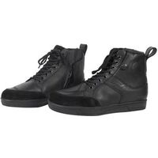                                                                                           |                                                                                           

## Modèles à 69,95 £ :

 | Modèle | Photos |
|---|---|
|                                                                                           **RAXID - SYDNEY**                                                                                                                                                                                        EN13634-1222 WR                                                                                            ") Modèle mixte femme/homme                                                                                                                                                                                        **Pages fabricant :**                                                                                            - [sydney-motorcycle-boots-2/](https://raxid.co.uk/product/sydney-motorcycle-boots-2/)                                                                                            - [sydney-motorcycle-boots-3/](https://raxid.co.uk/product/sydney-motorcycle-boots-3/)                                                                                            - [sydney-motorcycle-boots/](https://raxid.co.uk/product/sydney-motorcycle-boots/)                                                                                                                                                                                        **Lieu de fabrication :**                                                                                             Inconnu                                                                                                                                                                                        **Caractéristiques :**                                                                                            ") Cuir                                                                                             (image modifiée : Tabler-icons)") Imperméable (Hipora)                                                                                                                                                                                        **Prix en ligne au moment de la rédaction :**                                                                                            - 69,95 £ (fabricant)                                                                                            - [Rechercher (fcmoto)](https://www.fc-moto.de/epages/fcm.sf/fr_FR/?ViewAction=FacetedSearchProducts&SearchString=RAXID+SYDNEY)                                                                                            - [Rechercher (motoblouz)](https://www.motoblouz.com/recherche.html?q=RAXID+SYDNEY)                                                                                            - [Rechercher (motardinn)](https://www.tradeinn.com/motardinn/fr?products_search%5Bquery%5D=RAXID+SYDNEY)                                                                                            - [Rechercher (dafymoto)](https://www.dafy-moto.com/recherche?string=RAXID+SYDNEY)                                                                                                                                                                                        **Aide à la recherche :**                                                                                            *Rechercher en occasion (~20-50 €)*                                                                                            [ Leboncoin](https://www.leboncoin.fr/recherche?text=moto+RAXID+SYDNEY&shippable=1&sort=price&order=asc) [ Vinted](https://www.vinted.fr/catalog?search_text=moto+RAXID+SYDNEY&order=price_low_to_high) *Recherches diverses :*                                                                                            [ Google](https://www.google.com/search?q=moto+RAXID+SYDNEY) [ Youtube](https://www.youtube.com/results?search_query=moto+RAXID+SYDNEY)                                                                                            |                                                                                                                                                                                                                                                                                                                                                                            |                                                                                           

## Modèles à 74,89 € :

 | Modèle | Photos |
|---|---|
|                                                                                           **DXR - BEBOP**                                                                                                                                                                                        EN13634-1222 IPA                                                                                            ") Modèle mixte femme/homme                                                                                            ") Eté                                                                                                                                                                                        **Pages fabricant :**                                                                                            - [vente-baskets-dxr-bebop-200515](https://www.motoblouz.com/vente-baskets-dxr-bebop-200515.html)                                                                                                                                                                                        **Lieu de fabrication :**                                                                                             Inconnu                                                                                                                                                                                        **Caractéristiques :**                                                                                            ") Cuir                                                                                            ") Respirant                                                                                             (image modifiée : Tabler-icons)") Imperméable (Gore-Tex)                                                                                                                                                                                        **Prix en ligne au moment de la rédaction :**                                                                                            - [74,89 € (motoblouz)](https://www.motoblouz.com/recherche.html?q=DXR+BEBOP)                                                                                            - 119,90 € (fabricant)                                                                                            - [Rechercher (fcmoto)](https://www.fc-moto.de/epages/fcm.sf/fr_FR/?ViewAction=FacetedSearchProducts&SearchString=DXR+BEBOP)                                                                                            - [Rechercher (motardinn)](https://www.tradeinn.com/motardinn/fr?products_search%5Bquery%5D=DXR+BEBOP)                                                                                            - [Rechercher (dafymoto)](https://www.dafy-moto.com/recherche?string=DXR+BEBOP)                                                                                                                                                                                        **Aide à la recherche :**                                                                                            *Rechercher en occasion (~20-50 €)*                                                                                            [ Leboncoin](https://www.leboncoin.fr/recherche?text=moto+DXR+BEBOP&shippable=1&sort=price&order=asc) [ Vinted](https://www.vinted.fr/catalog?search_text=moto+DXR+BEBOP&order=price_low_to_high) *Recherches diverses :*                                                                                            [ Google](https://www.google.com/search?q=moto+DXR+BEBOP) [ Youtube](https://www.youtube.com/results?search_query=moto+DXR+BEBOP)                                                                                            |                                                                                           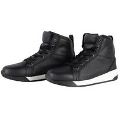                                                                                           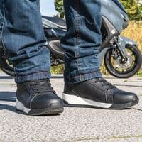                                                                                           |                                                                                           
|                                                                                           **DXR - CRUNCK**                                                                                                                                                                                        EN13634-1222 IPA                                                                                            ") Modèle mixte femme/homme                                                                                            ") Eté                                                                                                                                                                                        **Pages fabricant :**                                                                                            - [vente-baskets-dxr-crunck-200516](https://www.motoblouz.com/vente-baskets-dxr-crunck-200516.html)                                                                                                                                                                                        **Lieu de fabrication :**                                                                                             Inconnu                                                                                                                                                                                        **Caractéristiques :**                                                                                            ") Respirant                                                                                             (image modifiée : Tabler-icons)") Imperméable (Gore-Tex)                                                                                                                                                                                        **Prix en ligne au moment de la rédaction :**                                                                                            - [74,89 € (motoblouz)](https://www.motoblouz.com/recherche.html?q=DXR+CRUNCK)                                                                                            - 119,90 € (fabricant)                                                                                            - [Rechercher (fcmoto)](https://www.fc-moto.de/epages/fcm.sf/fr_FR/?ViewAction=FacetedSearchProducts&SearchString=DXR+CRUNCK)                                                                                            - [Rechercher (motardinn)](https://www.tradeinn.com/motardinn/fr?products_search%5Bquery%5D=DXR+CRUNCK)                                                                                            - [Rechercher (dafymoto)](https://www.dafy-moto.com/recherche?string=DXR+CRUNCK)                                                                                                                                                                                        **Aide à la recherche :**                                                                                            *Rechercher en occasion (~20-50 €)*                                                                                            [ Leboncoin](https://www.leboncoin.fr/recherche?text=moto+DXR+CRUNCK&shippable=1&sort=price&order=asc) [ Vinted](https://www.vinted.fr/catalog?search_text=moto+DXR+CRUNCK&order=price_low_to_high) *Recherches diverses :*                                                                                            [ Google](https://www.google.com/search?q=moto+DXR+CRUNCK) [ Youtube](https://www.youtube.com/results?search_query=moto+DXR+CRUNCK)                                                                                            |                                                                                           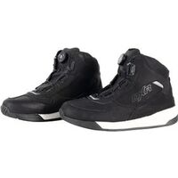                                                                                           |                                                                                           

## Modèles à 99,91 € :

 | Modèle | Photos |
|---|---|
|                                                                                           **RST - HITOP LADIES**                                                                                                                                                                                        EN13634-1222                                                                                            ") Modèle femme                                                                                            ") Eté                                                                                                                                                                                        **Pages fabricant :**                                                                                            - [hitop-moto-sneaker-ladies-ce-boot](https://www.rst-moto.com/products/hitop-moto-sneaker-ladies-ce-boot)                                                                                            - [hitop-moto-sneaker-ladies-ce-waterproof-boot](https://www.rst-moto.com/products/hitop-moto-sneaker-ladies-ce-waterproof-boot)                                                                                                                                                                                        **Lieu de fabrication :**                                                                                             Inconnu                                                                                                                                                                                        **Caractéristiques :**                                                                                            ") Imperméable                                                                                                                                                                                        **Prix en ligne au moment de la rédaction :**                                                                                            - [99,91 € (motoblouz)](https://www.motoblouz.com/recherche.html?q=RST+HITOP+20FEMME)                                                                                            - [107,96 € (fcmoto)](https://www.fc-moto.de/epages/fcm.sf/fr_FR/?ViewAction=FacetedSearchProducts&SearchString=RST+HITOP+20DAMES)                                                                                            - 119,00 £ (fabricant)                                                                                            - [Rechercher (motardinn)](https://www.tradeinn.com/motardinn/fr?products_search%5Bquery%5D=RST+HITOP)                                                                                            - [Rechercher (dafymoto)](https://www.dafy-moto.com/recherche?string=RST+HITOP)                                                                                                                                                                                        **Aide à la recherche :**                                                                                            *Rechercher en occasion (~30-70 €)*                                                                                            [ Leboncoin](https://www.leboncoin.fr/recherche?text=moto+RST+HITOP&shippable=1&sort=price&order=asc) [ Vinted](https://www.vinted.fr/catalog?search_text=moto+RST+HITOP&order=price_low_to_high) *Recherches diverses :*                                                                                            [ Google](https://www.google.com/search?q=moto+RST+HITOP) [ Youtube](https://www.youtube.com/results?search_query=moto+RST+HITOP)                                                                                            |                                                                                           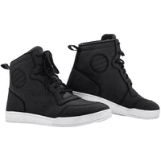                                                                                           |                                                                                           
|                                                                                           **RST - HITOP MENS**                                                                                                                                                                                        EN13634-1222                                                                                            ") Modèle mixte femme/homme                                                                                            ") Eté                                                                                                                                                                                        **Pages fabricant :**                                                                                            - [hitop-moto-sneaker-mens-ce-boot](https://www.rst-moto.com/products/hitop-moto-sneaker-mens-ce-boot)                                                                                            - [hitop-moto-sneaker-mens-ce-waterproof-boot](https://www.rst-moto.com/products/hitop-moto-sneaker-mens-ce-waterproof-boot)                                                                                                                                                                                        **Lieu de fabrication :**                                                                                             Inconnu                                                                                                                                                                                        **Caractéristiques :**                                                                                            ") Imperméable                                                                                                                                                                                        **Prix en ligne au moment de la rédaction :**                                                                                            - [99,91 € (motoblouz)](https://www.motoblouz.com/recherche.html?q=RST+HITOP+20HOMME)                                                                                            - [107,96 € (fcmoto)](https://www.fc-moto.de/epages/fcm.sf/fr_FR/?ViewAction=FacetedSearchProducts&SearchString=RST+HITOP+20HOMME)                                                                                            - 119,95 £ (fabricant)                                                                                            - [Rechercher (motardinn)](https://www.tradeinn.com/motardinn/fr?products_search%5Bquery%5D=RST+HITOP)                                                                                            - [Rechercher (dafymoto)](https://www.dafy-moto.com/recherche?string=RST+HITOP)                                                                                                                                                                                        **Aide à la recherche :**                                                                                            *Rechercher en occasion (~30-70 €)*                                                                                            [ Leboncoin](https://www.leboncoin.fr/recherche?text=moto+RST+HITOP&shippable=1&sort=price&order=asc) [ Vinted](https://www.vinted.fr/catalog?search_text=moto+RST+HITOP&order=price_low_to_high) *Recherches diverses :*                                                                                            [ Google](https://www.google.com/search?q=moto+RST+HITOP) [ Youtube](https://www.youtube.com/results?search_query=moto+RST+HITOP)                                                                                            |                                                                                           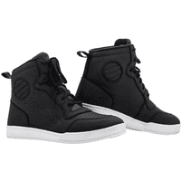                                                                                           |                                                                                           

## Modèles à 99,95 € :

 | Modèle | Photos |
|---|---|
|                                                                                           **OXFORD - SOFIA WOMEN**                                                                                                                                                                                        EN13634-1222                                                                                            ") Modèle femme                                                                                            ") Eté                                                                                                                                                                                        **Pages fabricant :**                                                                                            - [oxford_sofia_ws_boots_black/](https://www.oxfordproducts.com/motorcycle/product_type/rider_wear/oxford/boots/oxford_sofia_ws_boots_black/)                                                                                            - [oxford_sofia_ws_boots_charcoal/](https://www.oxfordproducts.com/motorcycle/product_type/rider_wear/oxford/boots/oxford_sofia_ws_boots_charcoal/)                                                                                                                                                                                        **Lieu de fabrication :**                                                                                             Inconnu                                                                                                                                                                                        **Caractéristiques :**                                                                                            ") Cuir                                                                                            ") Respirant                                                                                            ") Imperméable                                                                                                                                                                                        **Prix en ligne au moment de la rédaction :**                                                                                            - [99,95 € (motoblouz)](https://www.motoblouz.com/recherche.html?q=OXFORD+SOFIA+20FEMME)                                                                                            - 119,99 £ (fabricant)                                                                                            - [Rechercher (fcmoto)](https://www.fc-moto.de/epages/fcm.sf/fr_FR/?ViewAction=FacetedSearchProducts&SearchString=OXFORD+SOFIA)                                                                                            - [Rechercher (motardinn)](https://www.tradeinn.com/motardinn/fr?products_search%5Bquery%5D=OXFORD+SOFIA)                                                                                            - [Rechercher (dafymoto)](https://www.dafy-moto.com/recherche?string=OXFORD+SOFIA)                                                                                                                                                                                        **Aide à la recherche :**                                                                                            *Rechercher en occasion (~30-70 €)*                                                                                            [ Leboncoin](https://www.leboncoin.fr/recherche?text=moto+OXFORD+SOFIA&shippable=1&sort=price&order=asc) [ Vinted](https://www.vinted.fr/catalog?search_text=moto+OXFORD+SOFIA&order=price_low_to_high) *Recherches diverses :*                                                                                            [ Google](https://www.google.com/search?q=moto+OXFORD+SOFIA) [ Youtube](https://www.youtube.com/results?search_query=moto+OXFORD+SOFIA)                                                                                            |                                                                                           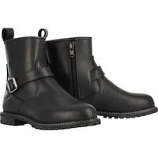                                                                                                                                                                                      |                                                                                           

## Modèles à 119,90 € :

 | Modèle | Photos |
|---|---|
|                                                                                           **DXR - SANTA CRUZ**                                                                                                                                                                                        EN13634-1222 IPA                                                                                            ") Modèle mixte femme/homme                                                                                            ") Eté                                                                                                                                                                                        **Pages fabricant :**                                                                                            - [vente-baskets-dxr-santa-cruz-denim-waterproof-114669](https://www.motoblouz.com/vente-baskets-dxr-santa-cruz-denim-waterproof-114669.html)                                                                                                                                                                                        **Lieu de fabrication :**                                                                                             Inconnu                                                                                                                                                                                        **Caractéristiques :**                                                                                            ") Cuir                                                                                            ") Respirant                                                                                             (image modifiée : Tabler-icons)") Imperméable (Gore-Tex)                                                                                                                                                                                        **De bonnes présentations :**                                                                                            [ Article : Motoblouz - Essai chaussures DXR Santa Cruz](https://www.motoblouz.com/enjoytheride/bottes-chaussures-moto/15884-essai-chaussures-dxr-santa-cruz-2018-12-27)                                                                                            [ Article : Motoblouz - Essai des baskets DXR Jordan](https://www.motoblouz.com/enjoytheride/bottes-chaussures-moto/19719-baskets-dxr-jordan-essai-2020-10-06)                                                                                                                                                                                        **Prix en ligne au moment de la rédaction :**                                                                                            - 119,90 € (fabricant)                                                                                            - [Rechercher (fcmoto)](https://www.fc-moto.de/epages/fcm.sf/fr_FR/?ViewAction=FacetedSearchProducts&SearchString=DXR+SANTA+CRUZ)                                                                                            - [Rechercher (motoblouz)](https://www.motoblouz.com/recherche.html?q=DXR+SANTA+CRUZ)                                                                                            - [Rechercher (motardinn)](https://www.tradeinn.com/motardinn/fr?products_search%5Bquery%5D=DXR+SANTA+CRUZ)                                                                                            - [Rechercher (dafymoto)](https://www.dafy-moto.com/recherche?string=DXR+SANTA+CRUZ)                                                                                                                                                                                        **Aide à la recherche :**                                                                                            *Rechercher en occasion (~40-80 €)*                                                                                            [ Leboncoin](https://www.leboncoin.fr/recherche?text=moto+DXR+SANTA+CRUZ&shippable=1&sort=price&order=asc) [ Vinted](https://www.vinted.fr/catalog?search_text=moto+DXR+SANTA+CRUZ&order=price_low_to_high) *Recherches diverses :*                                                                                            [ Google](https://www.google.com/search?q=moto+DXR+SANTA+CRUZ) [ Youtube](https://www.youtube.com/results?search_query=moto+DXR+SANTA+CRUZ)                                                                                            |                                                                                           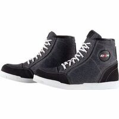                                                                                           |                                                                                           

## Modèles à 123,99 € :

 | Modèle | Photos |
|---|---|
|                                                                                           **FORMA - SWIFT DRY**                                                                                                                                                                                        EN13634-1222 WR                                                                                            ") Modèle mixte femme/homme                                                                                                                                                                                        **Pages fabricant :**                                                                                            - [swift-dry-black](https://www.formabootsusa.com/collections/ride-urban/products/swift-dry-black)                                                                                            - [swift-dry-gray](https://www.formabootsusa.com/collections/ride-urban/products/swift-dry-gray)                                                                                            - [swift-dry-black-white](https://www.formabootsusa.com/collections/ride-urban/products/swift-dry-black-white)                                                                                                                                                                                        **Lieu de fabrication :**                                                                                            Europe :                                                                                                                                                                                        ") Roumanie                                                                                                                                                                                                                                                                                   **Caractéristiques :**                                                                                            ") Cuir                                                                                            ") Imperméable                                                                                                                                                                                        **Une bonne présentation :**                                                                                            [ Youtube : RevZilla - Forma-Swift-Dry-Flow-Shoes-Review](https://www.youtube.com/watch?v=F9kqYSXoKec)                                                                                                                                                                                        **Prix en ligne au moment de la rédaction :**                                                                                            - [123,99 € (dafymoto)](https://www.dafy-moto.com/recherche?string=FORMA%20SWIFT%2020DRY)                                                                                            - [123,87 € (motoblouz)](https://www.motoblouz.com/recherche.html?q=FORMA+SWIFT+20DRY)                                                                                            - [144,95 € (fcmoto)](https://www.fc-moto.de/epages/fcm.sf/fr_FR/?ViewAction=FacetedSearchProducts&SearchString=FORMA+SWIFT+20DRY)                                                                                            - 199,00 $ (fabricant)                                                                                            - [Rechercher (motardinn)](https://www.tradeinn.com/motardinn/fr?products_search%5Bquery%5D=FORMA+SWIFT+DRY)                                                                                                                                                                                        **Aide à la recherche :**                                                                                            *Rechercher en occasion (~40-90 €)*                                                                                            [ Leboncoin](https://www.leboncoin.fr/recherche?text=moto+FORMA+SWIFT+DRY&shippable=1&sort=price&order=asc) [ Vinted](https://www.vinted.fr/catalog?search_text=moto+FORMA+SWIFT+DRY&order=price_low_to_high) *Recherches diverses :*                                                                                            [ Google](https://www.google.com/search?q=moto+FORMA+SWIFT+DRY) [ Youtube](https://www.youtube.com/results?search_query=moto+FORMA+SWIFT+DRY)                                                                                            |                                                                                                                                                                                                                                                                                                                                                                            |                                                                                           

## Modèles à 123,87 € :

 | Modèle | Photos |
|---|---|
|                                                                                           **FORMA - SWIFT DRY LADY**                                                                                                                                                                                        EN13634-1222 WR                                                                                            ") Modèle femme                                                                                                                                                                                        **Pages fabricant :**                                                                                            - [swift-dry-lady-black-white](https://www.formabootsusa.com/collections/womens/products/swift-dry-lady-black-white)                                                                                                                                                                                        **Lieu de fabrication :**                                                                                            Europe :                                                                                                                                                                                        ") Roumanie                                                                                                                                                                                                                                                                                   **Caractéristiques :**                                                                                            ") Cuir                                                                                            ") Imperméable                                                                                                                                                                                        **Une bonne présentation :**                                                                                            [ Youtube : RevZilla - Forma-Swift-Dry-Flow-Shoes-Review](https://www.youtube.com/watch?v=F9kqYSXoKec)                                                                                                                                                                                        **Prix en ligne au moment de la rédaction :**                                                                                            - [123,87 € (motoblouz)](https://www.motoblouz.com/recherche.html?q=FORMA+SWIFT+20DRY+20FEMME)                                                                                            - [123,99 € (dafymoto)](https://www.dafy-moto.com/recherche?string=FORMA%20SWIFT%2020DRY%2020FEMME)                                                                                            - [136,00 € (fcmoto)](https://www.fc-moto.de/epages/fcm.sf/fr_FR/?ViewAction=FacetedSearchProducts&SearchString=FORMA+SWIFT+20DRY+20DAMES)                                                                                            - 199,00 $ (fabricant)                                                                                            - [Rechercher (motardinn)](https://www.tradeinn.com/motardinn/fr?products_search%5Bquery%5D=FORMA+SWIFT+DRY)                                                                                                                                                                                        **Aide à la recherche :**                                                                                            *Rechercher en occasion (~40-90 €)*                                                                                            [ Leboncoin](https://www.leboncoin.fr/recherche?text=moto+FORMA+SWIFT+DRY&shippable=1&sort=price&order=asc) [ Vinted](https://www.vinted.fr/catalog?search_text=moto+FORMA+SWIFT+DRY&order=price_low_to_high) *Recherches diverses :*                                                                                            [ Google](https://www.google.com/search?q=moto+FORMA+SWIFT+DRY) [ Youtube](https://www.youtube.com/results?search_query=moto+FORMA+SWIFT+DRY)                                                                                            |                                                                                                                                                                                      |                                                                                           
|                                                                                           **FORMA - SWIFT FLOW**                                                                                                                                                                                        EN13634-1222                                                                                            ") Modèle mixte femme/homme                                                                                            ") Eté                                                                                                                                                                                        **Pages fabricant :**                                                                                            - [swift-flow-black-white](https://www.formabootsusa.com/collections/ride-urban/products/swift-flow-black-white)                                                                                                                                                                                        **Lieu de fabrication :**                                                                                            Europe :                                                                                                                                                                                        ") Roumanie                                                                                                                                                                                                                                                                                   **Caractéristiques :**                                                                                            ") Cuir                                                                                            ") Respirant                                                                                                                                                                                        **Une bonne présentation :**                                                                                            [ Youtube : RevZilla - Forma-Swift-Dry-Flow-Shoes-Review](https://www.youtube.com/watch?v=F9kqYSXoKec)                                                                                                                                                                                        **Prix en ligne au moment de la rédaction :**                                                                                            - [123,87 € (motoblouz)](https://www.motoblouz.com/recherche.html?q=FORMA+SWIFT+20FLOW)                                                                                            - [123,99 € (dafymoto)](https://www.dafy-moto.com/recherche?string=FORMA%20SWIFT%2020FLOW)                                                                                            - [144,95 € (fcmoto)](https://www.fc-moto.de/epages/fcm.sf/fr_FR/?ViewAction=FacetedSearchProducts&SearchString=FORMA+SWIFT+20FLOW)                                                                                            - 199,00 $ (fabricant)                                                                                            - [Rechercher (motardinn)](https://www.tradeinn.com/motardinn/fr?products_search%5Bquery%5D=FORMA+SWIFT+FLOW)                                                                                                                                                                                        **Aide à la recherche :**                                                                                            *Rechercher en occasion (~40-90 €)*                                                                                            [ Leboncoin](https://www.leboncoin.fr/recherche?text=moto+FORMA+SWIFT+FLOW&shippable=1&sort=price&order=asc) [ Vinted](https://www.vinted.fr/catalog?search_text=moto+FORMA+SWIFT+FLOW&order=price_low_to_high) *Recherches diverses :*                                                                                            [ Google](https://www.google.com/search?q=moto+FORMA+SWIFT+FLOW) [ Youtube](https://www.youtube.com/results?search_query=moto+FORMA+SWIFT+FLOW)                                                                                            |                                                                                                                                                                                      |                                                                                           

## Modèles à 133,24 € :

 | Modèle | Photos |
|---|---|
|                                                                                           **RST - ROADSTER MENS**                                                                                                                                                                                        EN13634-1222                                                                                            ") Modèle mixte femme/homme                                                                                                                                                                                        **Pages fabricant :**                                                                                            - [roadster-ce-waterproof-mens-boot](https://www.rst-moto.com/products/roadster-ce-waterproof-mens-boot)                                                                                                                                                                                        **Lieu de fabrication :**                                                                                             Inconnu                                                                                                                                                                                        **Caractéristiques :**                                                                                            ") Cuir                                                                                            ") Imperméable                                                                                                                                                                                        **Prix en ligne au moment de la rédaction :**                                                                                            - [133,24 € (motoblouz)](https://www.motoblouz.com/recherche.html?q=RST+ROADSTER+20HOMME)                                                                                            - 159,00 £ (fabricant)                                                                                            - [Rechercher (fcmoto)](https://www.fc-moto.de/epages/fcm.sf/fr_FR/?ViewAction=FacetedSearchProducts&SearchString=RST+ROADSTER)                                                                                            - [Rechercher (motardinn)](https://www.tradeinn.com/motardinn/fr?products_search%5Bquery%5D=RST+ROADSTER)                                                                                            - [Rechercher (dafymoto)](https://www.dafy-moto.com/recherche?string=RST+ROADSTER)                                                                                                                                                                                        **Aide à la recherche :**                                                                                            *Rechercher en occasion (~40-90 €)*                                                                                            [ Leboncoin](https://www.leboncoin.fr/recherche?text=moto+RST+ROADSTER&shippable=1&sort=price&order=asc) [ Vinted](https://www.vinted.fr/catalog?search_text=moto+RST+ROADSTER&order=price_low_to_high) *Recherches diverses :*                                                                                            [ Google](https://www.google.com/search?q=moto+RST+ROADSTER) [ Youtube](https://www.youtube.com/results?search_query=moto+RST+ROADSTER)                                                                                            |                                                                                           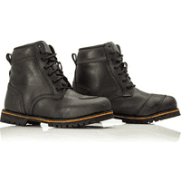                                                                                           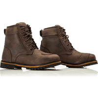                                                                                                                                                                                      |                                                                                           

## Modèles à 134,96 € :

 | Modèle | Photos |
|---|---|
|                                                                                           **RST - ATLAS MENS**                                                                                                                                                                                        EN13634-1222                                                                                            ") Modèle mixte femme/homme                                                                                            ") Eté                                                                                                                                                                                        **Pages fabricant :**                                                                                            - [atlas-ce-waterproof-mens-boot](https://www.rst-moto.com/products/atlas-ce-waterproof-mens-boot)                                                                                                                                                                                        **Lieu de fabrication :**                                                                                             Inconnu                                                                                                                                                                                        **Caractéristiques :**                                                                                            ") Cuir                                                                                            ") Respirant                                                                                             (image modifiée : Tabler-icons)") Imperméable (Hipora)                                                                                                                                                                                        **Prix en ligne au moment de la rédaction :**                                                                                            - [134,96 € (fcmoto)](https://www.fc-moto.de/epages/fcm.sf/fr_FR/?ViewAction=FacetedSearchProducts&SearchString=RST+ATLAS+20HOMME)                                                                                            - [141,56 € (motoblouz)](https://www.motoblouz.com/recherche.html?q=RST+ATLAS+20HOMME)                                                                                            - 169,00 £ (fabricant)                                                                                            - [Rechercher (motardinn)](https://www.tradeinn.com/motardinn/fr?products_search%5Bquery%5D=RST+ATLAS)                                                                                            - [Rechercher (dafymoto)](https://www.dafy-moto.com/recherche?string=RST+ATLAS)                                                                                                                                                                                        **Aide à la recherche :**                                                                                            *Rechercher en occasion (~40-90 €)*                                                                                            [ Leboncoin](https://www.leboncoin.fr/recherche?text=moto+RST+ATLAS&shippable=1&sort=price&order=asc) [ Vinted](https://www.vinted.fr/catalog?search_text=moto+RST+ATLAS&order=price_low_to_high) *Recherches diverses :*                                                                                            [ Google](https://www.google.com/search?q=moto+RST+ATLAS) [ Youtube](https://www.youtube.com/results?search_query=moto+RST+ATLAS)                                                                                            |                                                                                           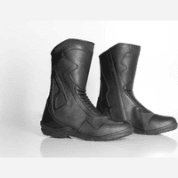                                                                                           |                                                                                           

## Modèles à 153,00 € :

 | Modèle | Photos |
|---|---|
|                                                                                           **FORMA - BOLT**                                                                                                                                                                                        EN13634-1222 WR                                                                                            ") Modèle mixte femme/homme                                                                                                                                                                                        **Pages fabricant :**                                                                                            - [bolt](https://www.formabootsusa.com/collections/ride-urban/products/bolt)                                                                                                                                                                                        **Lieu de fabrication :**                                                                                            Europe :                                                                                                                                                                                        ") Roumanie                                                                                                                                                                                                                                                                                   **Caractéristiques :**                                                                                            ") Cuir                                                                                            ") Imperméable                                                                                                                                                                                        **Prix en ligne au moment de la rédaction :**                                                                                            - [153,00 € (fcmoto)](https://www.fc-moto.de/epages/fcm.sf/fr_FR/?ViewAction=FacetedSearchProducts&SearchString=FORMA+BOLT)                                                                                            - 229,00 $ (fabricant)                                                                                            - [Rechercher (motoblouz)](https://www.motoblouz.com/recherche.html?q=FORMA+BOLT)                                                                                            - [Rechercher (motardinn)](https://www.tradeinn.com/motardinn/fr?products_search%5Bquery%5D=FORMA+BOLT)                                                                                            - [Rechercher (dafymoto)](https://www.dafy-moto.com/recherche?string=FORMA+BOLT)                                                                                                                                                                                        **Aide à la recherche :**                                                                                            *Rechercher en occasion (~50-110 €)*                                                                                            [ Leboncoin](https://www.leboncoin.fr/recherche?text=moto+FORMA+BOLT&shippable=1&sort=price&order=asc) [ Vinted](https://www.vinted.fr/catalog?search_text=moto+FORMA+BOLT&order=price_low_to_high) *Recherches diverses :*                                                                                            [ Google](https://www.google.com/search?q=moto+FORMA+BOLT) [ Youtube](https://www.youtube.com/results?search_query=moto+FORMA+BOLT)                                                                                            |                                                                                           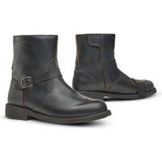                                                                                           |                                                                                           

## Modèles à 179,99 € :

 | Modèle | Photos |
|---|---|
|                                                                                           **REV-IT - GINZA 3**                                                                                                                                                                                        EN13634-1222                                                                                            ") Modèle mixte femme/homme                                                                                                                                                                                        **Pages fabricant :**                                                                                            - [chaussures-moto-ginza-3-marron-blanc](https://www.revitsport.com/fr_fr/chaussures-moto-ginza-3-marron-blanc)                                                                                            - [chaussures-moto-ginza-3-noir](https://www.revitsport.com/fr_fr/chaussures-moto-ginza-3-noir)                                                                                                                                                                                        **Lieu de fabrication :**                                                                                             Inconnu                                                                                                                                                                                        **Caractéristiques :**                                                                                            ") Cuir                                                                                                                                                                                        **De bonnes présentations :**                                                                                            [ Youtube : Urban-Rider - REVIT-Ginza-3-Motorcycle-Boot-Review](https://www.youtube.com/watch?v=aNmKfvJ77u4)                                                                                            [ Youtube : RevZilla - REV-IT-Ginza-3-Shoes-Review](https://www.youtube.com/watch?v=c68wWHnhbFg)                                                                                                                                                                                        **Prix en ligne au moment de la rédaction :**                                                                                            - [179,99 € (dafymoto)](https://www.dafy-moto.com/recherche?string=REV%2020IT%20GINZA%20203)                                                                                            - [185,76 € (motoblouz)](https://www.motoblouz.com/recherche.html?q=REV+20IT+GINZA+203)                                                                                            - 229,99 € (fabricant)                                                                                            - [Rechercher (fcmoto)](https://www.fc-moto.de/epages/fcm.sf/fr_FR/?ViewAction=FacetedSearchProducts&SearchString=REV+IT+GINZA+3)                                                                                            - [Rechercher (motardinn)](https://www.tradeinn.com/motardinn/fr?products_search%5Bquery%5D=REV+IT+GINZA+3)                                                                                                                                                                                        **Aide à la recherche :**                                                                                            *Rechercher en occasion (~50-130 €)*                                                                                            [ Leboncoin](https://www.leboncoin.fr/recherche?text=moto+REV+IT+GINZA+3&shippable=1&sort=price&order=asc) [ Vinted](https://www.vinted.fr/catalog?search_text=moto+REV+IT+GINZA+3&order=price_low_to_high) *Recherches diverses :*                                                                                            [ Google](https://www.google.com/search?q=moto+REV+IT+GINZA+3) [ Youtube](https://www.youtube.com/results?search_query=moto+REV+IT+GINZA+3)                                                                                            |                                                                                           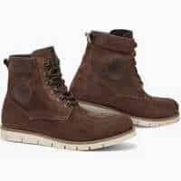                                                                                           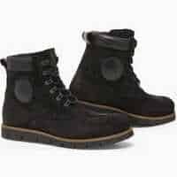                                                                                           |                                                                                           

## Modèles à 226,06 € :

 | Modèle | Photos |
|---|---|
|                                                                                           **ALPINESTARS - CR 8 GORE TEX**                                                                                                                                                                                        EN13634-1222                                                                                            ") Modèle mixte femme/homme                                                                                            ") Eté                                                                                                                                                                                        **Pages fabricant :**                                                                                            - [cr-8-gore-tex-shoes](https://www.alpinestars.com/products/cr-8-gore-tex-shoes)                                                                                                                                                                                        **Lieu de fabrication :**                                                                                            Asie / Europe :                                                                                                                                                                                        ") Chine                                                                                                                                                                                       ") Roumanie                                                                                                                                                                                                                                                                                   **Caractéristiques :**                                                                                            ") Respirant                                                                                             (image modifiée : Tabler-icons)") Imperméable (Gore-Tex)                                                                                                                                                                                        **Prix en ligne au moment de la rédaction :**                                                                                            - [226,06 € (dafymoto)](https://www.dafy-moto.com/recherche?string=ALPINESTARS%20CR%20208%2020GORE%2020TEX)                                                                                            - 289,95 $ (fabricant)                                                                                            - [Rechercher (fcmoto)](https://www.fc-moto.de/epages/fcm.sf/fr_FR/?ViewAction=FacetedSearchProducts&SearchString=ALPINESTARS+CR+8)                                                                                            - [Rechercher (motoblouz)](https://www.motoblouz.com/recherche.html?q=ALPINESTARS+CR+8)                                                                                            - [Rechercher (motardinn)](https://www.tradeinn.com/motardinn/fr?products_search%5Bquery%5D=ALPINESTARS+CR+8)                                                                                                                                                                                        **Aide à la recherche :**                                                                                            *Rechercher en occasion (~70-160 €)*                                                                                            [ Leboncoin](https://www.leboncoin.fr/recherche?text=moto+ALPINESTARS+CR+8&shippable=1&sort=price&order=asc) [ Vinted](https://www.vinted.fr/catalog?search_text=moto+ALPINESTARS+CR+8&order=price_low_to_high) *Recherches diverses :*                                                                                            [ Google](https://www.google.com/search?q=moto+ALPINESTARS+CR+8) [ Youtube](https://www.youtube.com/results?search_query=moto+ALPINESTARS+CR+8)                                                                                            |                                                                                           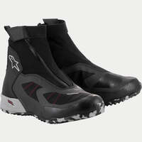                                                                                           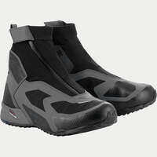                                                                                           |                                                                                           

## Modèles à 229,00 $ :

 | Modèle | Photos |
|---|---|
|                                                                                           **FORMA - CREED**                                                                                                                                                                                        EN13634-1222 WR                                                                                            ") Modèle mixte femme/homme                                                                                                                                                                                        **Pages fabricant :**                                                                                            - [creed](https://www.formabootsusa.com/collections/ride-urban/products/creed)                                                                                                                                                                                        **Lieu de fabrication :**                                                                                            Europe :                                                                                                                                                                                        ") Roumanie                                                                                                                                                                                                                                                                                   **Caractéristiques :**                                                                                            ") Cuir                                                                                            ") Imperméable                                                                                                                                                                                        **Prix en ligne au moment de la rédaction :**                                                                                            - 229,00 $ (fabricant)                                                                                            - [Rechercher (fcmoto)](https://www.fc-moto.de/epages/fcm.sf/fr_FR/?ViewAction=FacetedSearchProducts&SearchString=FORMA+CREED)                                                                                            - [Rechercher (motoblouz)](https://www.motoblouz.com/recherche.html?q=FORMA+CREED)                                                                                            - [Rechercher (motardinn)](https://www.tradeinn.com/motardinn/fr?products_search%5Bquery%5D=FORMA+CREED)                                                                                            - [Rechercher (dafymoto)](https://www.dafy-moto.com/recherche?string=FORMA+CREED)                                                                                                                                                                                        **Aide à la recherche :**                                                                                            *Rechercher en occasion (~70-160 €)*                                                                                            [ Leboncoin](https://www.leboncoin.fr/recherche?text=moto+FORMA+CREED&shippable=1&sort=price&order=asc) [ Vinted](https://www.vinted.fr/catalog?search_text=moto+FORMA+CREED&order=price_low_to_high) *Recherches diverses :*                                                                                            [ Google](https://www.google.com/search?q=moto+FORMA+CREED) [ Youtube](https://www.youtube.com/results?search_query=moto+FORMA+CREED)                                                                                            |                                                                                                                                                                                      |                                                                                           

## Modèles à 242,32 € :

 | Modèle | Photos |
|---|---|
|                                                                                           **REV-IT - PATROL**                                                                                                                                                                                        EN13634-1222                                                                                            ") Modèle mixte femme/homme                                                                                                                                                                                        **Pages fabricant :**                                                                                            - [chaussures-moto-patrol-verte-olive-noir](https://www.revitsport.com/fr_fr/chaussures-moto-patrol-verte-olive-noir)                                                                                                                                                                                        **Lieu de fabrication :**                                                                                             Inconnu                                                                                                                                                                                        **Caractéristiques :**                                                                                            ") Cuir                                                                                                                                                                                        **Une bonne présentation :**                                                                                            [ Youtube : Urban-Rider - REVIT-Patrol-Boots-Review](https://www.youtube.com/watch?v=TAvA_-I6zR4)                                                                                                                                                                                        **Prix en ligne au moment de la rédaction :**                                                                                            - [242,32 € (motoblouz)](https://www.motoblouz.com/recherche.html?q=REV+20IT+PATROL)                                                                                            - [249,98 € (dafymoto)](https://www.dafy-moto.com/recherche?string=REV%2020IT%20PATROL)                                                                                            - 299,99 € (fabricant)                                                                                            - [Rechercher (fcmoto)](https://www.fc-moto.de/epages/fcm.sf/fr_FR/?ViewAction=FacetedSearchProducts&SearchString=REV+IT+PATROL)                                                                                            - [Rechercher (motardinn)](https://www.tradeinn.com/motardinn/fr?products_search%5Bquery%5D=REV+IT+PATROL)                                                                                                                                                                                        **Aide à la recherche :**                                                                                            *Rechercher en occasion (~70-170 €)*                                                                                            [ Leboncoin](https://www.leboncoin.fr/recherche?text=moto+REV+IT+PATROL&shippable=1&sort=price&order=asc) [ Vinted](https://www.vinted.fr/catalog?search_text=moto+REV+IT+PATROL&order=price_low_to_high) *Recherches diverses :*                                                                                            [ Google](https://www.google.com/search?q=moto+REV+IT+PATROL) [ Youtube](https://www.youtube.com/results?search_query=moto+REV+IT+PATROL)                                                                                            |                                                                                                                                                                                      |                                                                                           

---

[^1]: **Hauteur de la tige avant/arrière du mollet** ( Norme _CE EN 13634-2017_) :  
    Mesurée à partir du sol :
        1. Niveau 1 : 10,3 cm/6,4 cm en dessous de 36, jusqu'à 12,1 cm / 7,3 cm au dessus de 45.
        2. Niveau 2 : 16,2 cm/11,3 cm en dessous de 36, jusqu'à 19,2 cm / 13,1 cm au dessus de 45.
[^2]: **Résistance à l'abrasion** ( Norme _CE EN 13634-2017_) :  
       Nombre de secondes pour traverser tige+doublure avec une bande abrasive de grain 60 qui tourne à 8 m/s (zone B = risque fort, zone A = reste de la chaussure)
        1. Niveau 1 : 1,5 s zone A, 5 s zone B
        2. Niveau 2 : 2,5 s zone A, 12 s zone B
[^3]: **Résistance à la perforation/coupure** ( Norme _CE EN 13634-2017_) :  
       Une lame est lancée à 2,8 m/s sur tige+doublure et on mesure la pénétration :
        1. Niveau 1 : < 25 mm
        2. Niveau 2 : < 15 mm
[^4]: **Résistance à la torsion** ( Norme _CE EN 13634-2017_) :  
       Mesure de la force nécessaire pour déformer la semelle de 2 cm :
        1. Niveau 1 : > 1 kN
        2. Niveau 2 : > 1,5 kN  
      

    

