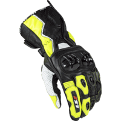
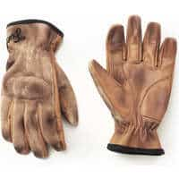
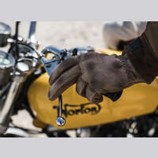
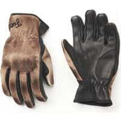
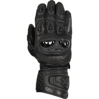
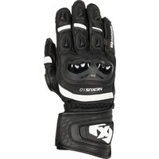
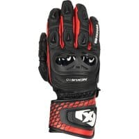
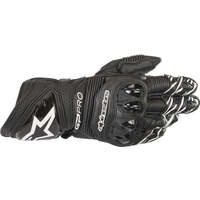
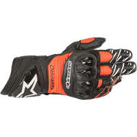
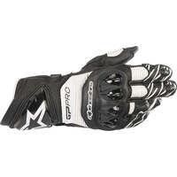

*# Dernière mise à jour : 14/09/2023 #*

Mise à jour de mon inventaire des gants moto qui atteignent le maximum de la norme EN 13594 : 2 KP.

J'ai changé la présentation pour ranger les équipements par prix plutôt que par marque.

J'ai aussi ajouté diverses indications permettant de faire son choix : lieu de fabrication quand connu, imperméabilité.

J’ai mis le lien Motoblouz/Dafy/Fcmoto lorsque le produit était disponible au moment de la rédaction de l'article _(note : Je peux toucher quelques centimes si vous passez par un de mes liens pour acheter sur Motoblouz)_.

> _Liste des mises à jour :_
> 
> _- 14/09/2023 : révision complète de la mise en page, nouveaux liens, etc._

---

**Rappels concernant la norme EN 13594 :**

Elle impose d'afficher sur les étiquettes des gants moto leur niveau de protection, parmi 3 possibles :

- Niveau 1 :
    - Manchette de plus de 1,5 cm ;
    - Résistance à l’abrasion : 4 secondes minimum ;
    - Résistance au déchirement : Paume > 25 N, dos > 18 N ;
    - Résistance des coutures à une pression interne > 6 N/mm ;
    - Résistance à l'arrachement > 25 N ;
    - Résistance à la coupure : Paume > 1,2 N, dos non testé.
- Niveau 1 KP : Comme le niveau 1, avec en plus :
    - Force transmise par les coques < 9 kN ;
- Niveau 2 KP : 
    - Manchette de plus de 5 cm ;
    - Résistance à l’abrasion : 8 secondes minimum ;
    - Force transmise par les coques < 5 kN ;
    - Résistance au déchirement : Paume > 35 N, dos > 30 N ;
    - Résistance des coutures à une pression interne > 10 N/mm ;
    - Résistance à l'arrachement > 50 N ;
    - Résistance à la coupure : Paume > 1,8 N, dos > 1,2 N.

(Même sans connaître les détails des tests, les critères quasiment 2 fois plus élevés du 2 KP par rapport au 1 KP montrent clairement l'intérêt qu'il y a à rechercher ce type de gants)

---

> *Note :* Cette page a été réalisée à partir des données fournies par les fabricants sur leurs sites Web.
> Sa génération est en grande partie automatisée, il peut donc y avoir quelques erreurs.
> 
> Les fabricants analysés sont les suivants :
> [ACERBIS](https://www.acerbis.com/), 
[ALPINESTARS](https://www.alpinestars.com/), 
[BERING](https://bering.fr/), 
[BMW](https://www.bmw-motorrad.fr/), 
[BULL-IT](https://www.bull-it.com/), 
[COURSE](https://www.xlmoto.com/), 
[DAINESE](https://www.dainese.com), 
[DUCATI](https://www.ducati.com/), 
[DXR](https://www.motoblouz.com/), 
[ESQUAD](https://www.esquad.fr/), 
[EUDOXIE](https://eudoxie.shop/), 
[FALCO](https://giannifalco.com/), 
[FIVE](https://five-gloves.com/), 
[FORMA](https://www.formabootsusa.com/), 
[FUEL](https://fuelmotorcycles.eu/), 
[FURYGAN](https://www.furygan.com/), 
[GOLDTOP](https://goldtop.co.uk/), 
[HALVARSSONS](https://halvarssonsmc.com/), 
[HELSTONS](https://www.helstons.net/), 
[HEVIK](https://www.hevik.co.uk/), 
[HOOD](https://www.hoodjeans.co.uk), 
[IXON](https://www.ixon.com/), 
[IXS](https://ixs.com/), 
[JOHN-DOE](https://www.ridejohndoe.com/), 
[KLIM](https://www.klim.com/), 
[KNOX](https://www.planet-knox.com), 
[LOUIS](https://www.louis.ie), 
[LS2](https://www.ls2usa.com/), 
[MERLAMOTO](https://merlamoto.com/), 
[MERLIN](https://www.merlinbikegear.shop/), 
[MOTOGIRL](https://motogirl.co.uk/), 
[OJ](https://ojworld.it/), 
[OXFORD](https://www.oxfordproducts.com/), 
[PANDO](https://pandomoto.com/), 
[PMJ](https://pmj.it/), 
[RACERED](https://racered.eu/), 
[RACER](https://www.racer1927.com/), 
[RAXID](https://raxid.co.uk), 
[RESURGENCE-GEAR](https://resurgencegear.net/), 
[REVIT](https://www.revitsport.com/), 
[ROADSKIN](https://roadskin.co.uk/), 
[ROKKER](https://www.eu.therokkercompany.com/), 
[RST](https://www.rst-moto.com/), 
[RUKKA](https://luhta.com/), 
[SEGURA](https://segura-moto.fr/), 
[SEVENTY-DEGREES](https://seventy-70.com/), 
[SIDI](https://www.sidi.com/), 
[SOUBIRAC](https://www.soubirac.fr/), 
[SPIDI](https://www.spidi.com/), 
[TCX](https://www.tcxboots.com/), 
[2MILESIX](https://www.2milesix.com/).

> 
> Les fabricants suivants ont été exclus car ils n'affichent pas le niveau de sécurité de leurs produits, ou ne sont pas commercialisés en Europe : ARLEN NESS, ARMURE, BELSTAFF, BILT, BOGOTTO, BOLID'STER, DRAGGIN, DRIRIDER, ELEVEIT, FLY MOTO, FOX, GAERNE, HARLEY DAVIDSON, HELD, HOLYFREEDOM, HONDA, ICON, INDIAN, KAWASAKI, KLIM, KTM, LEATT, MACNA, O'NEAL, OVERLAP, REAX, RICHA, RJAYS, RST, RUSTY STITCHES, SAINT, SCOTT, SEDICI, SHOT, SIDI, SOUBIRAC, SPIRIT MOTORS, STADLER, STREET & STEEL, STYLMARTIN, THOR, TRIUMPH, VENDRAMINI, WEX, XPD, YAMAHA

---

## Modèles à 63,99 € :

 | Modèle | Photos |
|---|---|
|                                                                                           **LS2 - SWIFT**                                                                                                                                                                                        EN13594-2KP                                                                                            ") Modèle homme                                                                                             Mi-saison                                                                                                                                                                                        **Pages fabricant :**                                                                                            - [swiftgloves](https://www.ls2usa.com/swiftgloves)                                                                                                                                                                                        **Caractéristiques :**                                                                                             Cuir de chèvre                                                                                            ") Slider de paume                                                                                                                                                                                        **Lieu de fabrication :**                                                                                            Asie :                                                                                                                                                                                        ") Chine                                                                                                                                                                                                                                                                                   **Prix en ligne au moment de la rédaction :**                                                                                            - [63,99 €](https://www.tradeinn.com/motardinn/fr?products_search%5Bquery%5D=LS2+SWIFT) (motardinn)                                                                                                                                                                                     **Aide à la recherche :**                                                                                            *Rechercher en occasion :*                                                                                            [ Leboncoin](https://www.leboncoin.fr/recherche?text=moto+LS2+SWIFT&shippable=1&sort=price&order=asc) [ Vinted](https://www.vinted.fr/catalog?search_text=moto+LS2+SWIFT&order=price_low_to_high) *Recherches sur les sites de vente :*                                                                                            [ FCMoto](https://www.fc-moto.de/epages/fcm.sf/fr_FR/?ViewAction=FacetedSearchProducts&SearchString=LS2+SWIFT) [ Motoblouz](https://www.motoblouz.com/recherche/LS2+SWIFT.html) [ DafyMoto](https://www.dafy-moto.com/recherche?string=LS2+SWIFT) [ Motardinn](https://www.tradeinn.com/motardinn/fr?products_search%5Bquery%5D=LS2+SWIFT) *Recherches diverses :*                                                                                            [ Google](https://www.google.com/search?q=moto+LS2+SWIFT) [ Youtube](https://www.youtube.com/results?search_query=moto+LS2+SWIFT)                                                                                            |                                                                                                                                                                                                                                                                                                                                                                            |                                                                                           

## Modèles à 90,00 € :

 | Modèle | Photos |
|---|---|
|                                                                                           **FUEL - FLAT**                                                                                                                                                                                        EN13594-2KP                                                                                             Mi-saison                                                                                                                                                                                        **Pages fabricant :**                                                                                            - [flat-glove](https://fuelmotorcycles.eu/collections/gloves/products/flat-glove)                                                                                                                                                                                        **Caractéristiques :**                                                                                             Cuir de buffle                                                                                                                                                                                        **Lieu de fabrication :**                                                                                             Inconnu                                                                                                                                                                                                                                                                                    **Une bonne présentation :**                                                                                            [ Youtube : Urban-Rider - Fuel-Flat-Track-Leather-Gloves-Review](https://www.youtube.com/watch?v=9gN_T7DhwVQ)                                                                                                                                                                                         **Prix en ligne au moment de la rédaction :**                                                                                            - 90,00 € (Fabricant)                                                                                                                                                                                        **Aide à la recherche :**                                                                                            *Rechercher en occasion (~30-60 €)*                                                                                            [ Leboncoin](https://www.leboncoin.fr/recherche?text=moto+FUEL+FLAT&shippable=1&sort=price&order=asc) [ Vinted](https://www.vinted.fr/catalog?search_text=moto+FUEL+FLAT&order=price_low_to_high) *Recherches sur les sites de vente :*                                                                                            [ FCMoto](https://www.fc-moto.de/epages/fcm.sf/fr_FR/?ViewAction=FacetedSearchProducts&SearchString=FUEL+FLAT) [ Motoblouz](https://www.motoblouz.com/recherche/FUEL+FLAT.html) [ DafyMoto](https://www.dafy-moto.com/recherche?string=FUEL+FLAT) [ Motardinn](https://www.tradeinn.com/motardinn/fr?products_search%5Bquery%5D=FUEL+FLAT) *Recherches diverses :*                                                                                            [ Google](https://www.google.com/search?q=moto+FUEL+FLAT) [ Youtube](https://www.youtube.com/results?search_query=moto+FUEL+FLAT)                                                                                            |                                                                                                                                                                                                                                                                                                                                                                            |                                                                                           

## Modèles à 95,00 € :

 | Modèle | Photos |
|---|---|
|                                                                                           **FUEL - TRACK**                                                                                                                                                                                        EN13594-2KP                                                                                             Mi-saison                                                                                                                                                                                        **Pages fabricant :**                                                                                            - [track-glove](https://fuelmotorcycles.eu/collections/gloves/products/track-glove)                                                                                                                                                                                        **Caractéristiques :**                                                                                             Cuir de buffle                                                                                                                                                                                        **Lieu de fabrication :**                                                                                             Inconnu                                                                                                                                                                                                                                                                                    **Une bonne présentation :**                                                                                            [ Youtube : Urban-Rider - Fuel-Flat-Track-Leather-Gloves-Review](https://www.youtube.com/watch?v=9gN_T7DhwVQ)                                                                                                                                                                                         **Prix en ligne au moment de la rédaction :**                                                                                            - 95,00 € (Fabricant)                                                                                                                                                                                        **Aide à la recherche :**                                                                                            *Rechercher en occasion (~30-70 €)*                                                                                            [ Leboncoin](https://www.leboncoin.fr/recherche?text=moto+FUEL+TRACK&shippable=1&sort=price&order=asc) [ Vinted](https://www.vinted.fr/catalog?search_text=moto+FUEL+TRACK&order=price_low_to_high) *Recherches sur les sites de vente :*                                                                                            [ FCMoto](https://www.fc-moto.de/epages/fcm.sf/fr_FR/?ViewAction=FacetedSearchProducts&SearchString=FUEL+TRACK) [ Motoblouz](https://www.motoblouz.com/recherche/FUEL+TRACK.html) [ DafyMoto](https://www.dafy-moto.com/recherche?string=FUEL+TRACK) [ Motardinn](https://www.tradeinn.com/motardinn/fr?products_search%5Bquery%5D=FUEL+TRACK) *Recherches diverses :*                                                                                            [ Google](https://www.google.com/search?q=moto+FUEL+TRACK) [ Youtube](https://www.youtube.com/results?search_query=moto+FUEL+TRACK)                                                                                            |                                                                                                                                                                                                                                                                                                                                                                            |                                                                                           

## Modèles à 99,99 £ :

 | Modèle | Photos |
|---|---|
|                                                                                           **OXFORD - NEXUS MEN**                                                                                                                                                                                        EN13594-2KP                                                                                             Eté                                                                                                                                                                                        **Pages fabricant :**                                                                                            - [oxford_nexus_ms_glove_blackwhite/](https://www.oxfordproducts.com/motorcycle/product_type/rider_wear/oxford/gloves/oxford_nexus_ms_glove_blackwhite/)                                                                                            - [oxford_nexus_ms_glove_blackwhitered/](https://www.oxfordproducts.com/motorcycle/product_type/rider_wear/oxford/gloves/oxford_nexus_ms_glove_blackwhitered/)                                                                                            - [oxford_nexus_ms_glove_stealth_black/](https://www.oxfordproducts.com/motorcycle/product_type/rider_wear/oxford/gloves/oxford_nexus_ms_glove_stealth_black/)                                                                                                                                                                                        **Caractéristiques :**                                                                                            ") Cuir                                                                                                                                                                                        **Lieu de fabrication :**                                                                                             Inconnu                                                                                                                                                                                        **Prix en ligne au moment de la rédaction :**                                                                                            - 99,99 £ (Fabricant)                                                                                                                                                                                        **Aide à la recherche :**                                                                                            *Rechercher en occasion (~30-70 €)*                                                                                            [ Leboncoin](https://www.leboncoin.fr/recherche?text=moto+OXFORD+NEXUS+MEN&shippable=1&sort=price&order=asc) [ Vinted](https://www.vinted.fr/catalog?search_text=moto+OXFORD+NEXUS+MEN&order=price_low_to_high) *Recherches sur les sites de vente :*                                                                                            [ FCMoto](https://www.fc-moto.de/epages/fcm.sf/fr_FR/?ViewAction=FacetedSearchProducts&SearchString=OXFORD+NEXUS+MEN) [ Motoblouz](https://www.motoblouz.com/recherche/OXFORD+NEXUS+MEN.html) [ DafyMoto](https://www.dafy-moto.com/recherche?string=OXFORD+NEXUS+MEN) [ Motardinn](https://www.tradeinn.com/motardinn/fr?products_search%5Bquery%5D=OXFORD+NEXUS+MEN) *Recherches diverses :*                                                                                            [ Google](https://www.google.com/search?q=moto+OXFORD+NEXUS+MEN) [ Youtube](https://www.youtube.com/results?search_query=moto+OXFORD+NEXUS+MEN)                                                                                            |                                                                                                                                                                                                                                                                                                                                                                            |                                                                                           

## Modèles à 108,21 € :

 | Modèle | Photos |
|---|---|
|                                                                                           **FIVE - RFX WP**                                                                                                                                                                                        EN13594-2KP                                                                                                                                                                                        **Pages fabricant :**                                                                                            - [rfx-wp/](https://five-gloves.com/glove/rfx-wp/)                                                                                            - [rfx-wp-2/](https://five-gloves.com/glove/rfx-wp-2/)                                                                                                                                                                                        **Caractéristiques :**                                                                                            ") Cuir                                                                                            ") Imperméable                                                                                            ") Slider de paume                                                                                            ") Tactile                                                                                                                                                                                        **Lieu de fabrication :**                                                                                            Asie :                                                                                                                                                                                        ") Chine                                                                                                                                                                                                                                                                                   **Prix en ligne au moment de la rédaction :**                                                                                            - [108,21 €](https://pkw.motoblouz.com/?P4122157BDFF171&redir=https%3A%2F%2Fwww.motoblouz.com%2Frecherche%2FFIVE%2520RFX%2520WP.html) (motoblouz)                                                                                            - [374,98 €](https://www.dafy-moto.com/recherche?string=FIVE%20RFX%20WP) (dafy)                                                                                                                                                                                        **Aide à la recherche :**                                                                                            *Rechercher en occasion (~10-20 €)*                                                                                            [ Leboncoin](https://www.leboncoin.fr/recherche?text=moto+FIVE+RFX+WP&shippable=1&sort=price&order=asc) [ Vinted](https://www.vinted.fr/catalog?search_text=moto+FIVE+RFX+WP&order=price_low_to_high) *Recherches sur les sites de vente :*                                                                                            [ FCMoto](https://www.fc-moto.de/epages/fcm.sf/fr_FR/?ViewAction=FacetedSearchProducts&SearchString=FIVE+RFX+WP) [ Motoblouz](https://www.motoblouz.com/recherche/FIVE+RFX+WP.html) [ DafyMoto](https://www.dafy-moto.com/recherche?string=FIVE+RFX+WP) [ Motardinn](https://www.tradeinn.com/motardinn/fr?products_search%5Bquery%5D=FIVE+RFX+WP) *Recherches diverses :*                                                                                            [ Google](https://www.google.com/search?q=moto+FIVE+RFX+WP) [ Youtube](https://www.youtube.com/results?search_query=moto+FIVE+RFX+WP)                                                                                            |                                                                                                                                                                                                                                                                                 |                                                                                           

## Modèles à 134,45 € :

 | Modèle | Photos |
|---|---|
|                                                                                           **FIVE - RFX2 AIRFLOW**                                                                                                                                                                                        EN13594-2KP                                                                                            ") Modèle mixte                                                                                             Eté                                                                                                                                                                                        **Pages fabricant :**                                                                                            - [rfx2-airflow/](https://five-gloves.com/glove/rfx2-airflow/)                                                                                            - [rfx2-airflow-2/](https://five-gloves.com/glove/rfx2-airflow-2/)                                                                                            - [rfx2-airflow-3/](https://five-gloves.com/glove/rfx2-airflow-3/)                                                                                                                                                                                        **Caractéristiques :**                                                                                            ") Cuir                                                                                            ") Slider de paume                                                                                                                                                                                        **Lieu de fabrication :**                                                                                            Asie :                                                                                                                                                                                        ") Chine                                                                                                                                                                                                                                                                                   **Prix en ligne au moment de la rédaction :**                                                                                            - [134,45 €](https://pkw.motoblouz.com/?P4122157BDFF171&redir=https%3A%2F%2Fwww.motoblouz.com%2Frecherche%2FFIVE%2520RFX2%2520AIRFLOW.html) (motoblouz)                                                                                            - [141,58 €](https://www.dafy-moto.com/recherche?string=FIVE%20RFX2%20AIRFLOW) (dafy)                                                                                                                                                                                        **Aide à la recherche :**                                                                                            *Rechercher en occasion (~40-90 €)*                                                                                            [ Leboncoin](https://www.leboncoin.fr/recherche?text=moto+FIVE+RFX2+AIRFLOW&shippable=1&sort=price&order=asc) [ Vinted](https://www.vinted.fr/catalog?search_text=moto+FIVE+RFX2+AIRFLOW&order=price_low_to_high) *Recherches sur les sites de vente :*                                                                                            [ FCMoto](https://www.fc-moto.de/epages/fcm.sf/fr_FR/?ViewAction=FacetedSearchProducts&SearchString=FIVE+RFX2+AIRFLOW) [ Motoblouz](https://www.motoblouz.com/recherche/FIVE+RFX2+AIRFLOW.html) [ DafyMoto](https://www.dafy-moto.com/recherche?string=FIVE+RFX2+AIRFLOW) [ Motardinn](https://www.tradeinn.com/motardinn/fr?products_search%5Bquery%5D=FIVE+RFX2+AIRFLOW) *Recherches diverses :*                                                                                            [ Google](https://www.google.com/search?q=moto+FIVE+RFX2+AIRFLOW) [ Youtube](https://www.youtube.com/results?search_query=moto+FIVE+RFX2+AIRFLOW)                                                                                            |                                                                                                                                                                                                                                                                                                                                                                            |                                                                                           

## Modèles à 142,36 € :

 | Modèle | Photos |
|---|---|
|                                                                                           **ALPINESTARS - AMT 10 AIR HDRY**                                                                                                                                                                                        EN13594-2KP                                                                                             Eté                                                                                                                                                                                        **Pages fabricant :**                                                                                            - [amt-10-air-hdry-glove](https://www.alpinestars.com/products/amt-10-air-hdry-glove)                                                                                                                                                                                        **Caractéristiques :**                                                                                             Cuir de chèvre                                                                                            ") Imperméable                                                                                                                                                                                        **Lieu de fabrication :**                                                                                            Asie / Europe :                                                                                                                                                                                        ") Roumanie                                                                                                                                                                                       ") Chine                                                                                                                                                                                                                                                                                   **Prix en ligne au moment de la rédaction :**                                                                                            - [142,36 €](https://pkw.motoblouz.com/?P4122157BDFF171&redir=https%3A%2F%2Fwww.motoblouz.com%2Frecherche%2FALPINESTARS%2520AMT%252010%2520AIR%2520HDRY.html) (motoblouz)                                                                                            - [166,20 €](https://www.dafy-moto.com/recherche?string=ALPINESTARS%20AMT%2010%20AIR%20HDRY) (dafy)                                                                                            - [188,95 €](https://www.fc-moto.de/epages/fcm.sf/fr_FR/?ViewAction=FacetedSearchProducts&SearchString=ALPINESTARS+AMT%2010%20AIR%20HDRY) (fcmoto)                                                                                            - 199,95 $ (Fabricant)                                                                                                                                                                                        **Aide à la recherche :**                                                                                            *Rechercher en occasion (~40-100 €)*                                                                                            [ Leboncoin](https://www.leboncoin.fr/recherche?text=moto+ALPINESTARS+AMT+10+AIR+HDRY&shippable=1&sort=price&order=asc) [ Vinted](https://www.vinted.fr/catalog?search_text=moto+ALPINESTARS+AMT+10+AIR+HDRY&order=price_low_to_high) *Recherches sur les sites de vente :*                                                                                            [ FCMoto](https://www.fc-moto.de/epages/fcm.sf/fr_FR/?ViewAction=FacetedSearchProducts&SearchString=ALPINESTARS+AMT+10+AIR+HDRY) [ Motoblouz](https://www.motoblouz.com/recherche/ALPINESTARS+AMT+10+AIR+HDRY.html) [ DafyMoto](https://www.dafy-moto.com/recherche?string=ALPINESTARS+AMT+10+AIR+HDRY) [ Motardinn](https://www.tradeinn.com/motardinn/fr?products_search%5Bquery%5D=ALPINESTARS+AMT+10+AIR+HDRY) *Recherches diverses :*                                                                                            [ Google](https://www.google.com/search?q=moto+ALPINESTARS+AMT+10+AIR+HDRY) [ Youtube](https://www.youtube.com/results?search_query=moto+ALPINESTARS+AMT+10+AIR+HDRY)                                                                                            |                                                                                                                                                                                      |                                                                                           

## Modèles à 150,27 € :

 | Modèle | Photos |
|---|---|
|                                                                                           **FIVE - SF1**                                                                                                                                                                                        EN13594-2KP                                                                                                                                                                                        **Pages fabricant :**                                                                                            - [sf1-5/](https://five-gloves.com/glove/sf1-5/)                                                                                            - [sf1/](https://five-gloves.com/glove/sf1/)                                                                                                                                                                                        **Caractéristiques :**                                                                                            ") Cuir                                                                                            ") Slider de paume                                                                                                                                                                                        **Lieu de fabrication :**                                                                                            Asie :                                                                                                                                                                                        ") Chine                                                                                                                                                                                                                                                                                   **Prix en ligne au moment de la rédaction :**                                                                                            - [150,27 €](https://pkw.motoblouz.com/?P4122157BDFF171&redir=https%3A%2F%2Fwww.motoblouz.com%2Frecherche%2FFIVE%2520SF1.html) (motoblouz)                                                                                            - [158,24 €](https://www.dafy-moto.com/recherche?string=FIVE%20SF1) (dafy)                                                                                                                                                                                        **Aide à la recherche :**                                                                                            *Rechercher en occasion (~40-100 €)*                                                                                            [ Leboncoin](https://www.leboncoin.fr/recherche?text=moto+FIVE+SF1&shippable=1&sort=price&order=asc) [ Vinted](https://www.vinted.fr/catalog?search_text=moto+FIVE+SF1&order=price_low_to_high) *Recherches sur les sites de vente :*                                                                                            [ FCMoto](https://www.fc-moto.de/epages/fcm.sf/fr_FR/?ViewAction=FacetedSearchProducts&SearchString=FIVE+SF1) [ Motoblouz](https://www.motoblouz.com/recherche/FIVE+SF1.html) [ DafyMoto](https://www.dafy-moto.com/recherche?string=FIVE+SF1) [ Motardinn](https://www.tradeinn.com/motardinn/fr?products_search%5Bquery%5D=FIVE+SF1) *Recherches diverses :*                                                                                            [ Google](https://www.google.com/search?q=moto+FIVE+SF1) [ Youtube](https://www.youtube.com/results?search_query=moto+FIVE+SF1)                                                                                            |                                                                                                                                                                                                                                                                                 |                                                                                           

## Modèles à 166,58 € :

 | Modèle | Photos |
|---|---|
|                                                                                           **FIVE - RFX2**                                                                                                                                                                                        EN13594-2KP                                                                                                                                                                                        **Pages fabricant :**                                                                                            - [rfx2-3/](https://five-gloves.com/glove/rfx2-3/)                                                                                            - [rfx2-4/](https://five-gloves.com/glove/rfx2-4/)                                                                                            - [rfx2/](https://five-gloves.com/glove/rfx2/)                                                                                            - [rfx2-2/](https://five-gloves.com/glove/rfx2-2/)                                                                                                                                                                                        **Caractéristiques :**                                                                                            ") Cuir                                                                                            ") Slider de paume                                                                                                                                                                                        **Lieu de fabrication :**                                                                                            Asie :                                                                                                                                                                                        ") Chine                                                                                                                                                                                                                                                                                   **Prix en ligne au moment de la rédaction :**                                                                                            - [166,58 €](https://www.dafy-moto.com/recherche?string=FIVE%20RFX2) (dafy)                                                                                            - [181,93 €](https://pkw.motoblouz.com/?P4122157BDFF171&redir=https%3A%2F%2Fwww.motoblouz.com%2Frecherche%2FFIVE%2520RFX2.html) (motoblouz)                                                                                                                                                                                        **Aide à la recherche :**                                                                                            *Rechercher en occasion (~50-120 €)*                                                                                            [ Leboncoin](https://www.leboncoin.fr/recherche?text=moto+FIVE+RFX2&shippable=1&sort=price&order=asc) [ Vinted](https://www.vinted.fr/catalog?search_text=moto+FIVE+RFX2&order=price_low_to_high) *Recherches sur les sites de vente :*                                                                                            [ FCMoto](https://www.fc-moto.de/epages/fcm.sf/fr_FR/?ViewAction=FacetedSearchProducts&SearchString=FIVE+RFX2) [ Motoblouz](https://www.motoblouz.com/recherche/FIVE+RFX2.html) [ DafyMoto](https://www.dafy-moto.com/recherche?string=FIVE+RFX2) [ Motardinn](https://www.tradeinn.com/motardinn/fr?products_search%5Bquery%5D=FIVE+RFX2) *Recherches diverses :*                                                                                            [ Google](https://www.google.com/search?q=moto+FIVE+RFX2) [ Youtube](https://www.youtube.com/results?search_query=moto+FIVE+RFX2)                                                                                            |                                                                                                                                                                                                                                                                                                                                                                                                                                                                       |                                                                                           

## Modèles à 174,01 € :

 | Modèle | Photos |
|---|---|
|                                                                                           **FIVE - TFX1 GTX**                                                                                                                                                                                        EN13594-2KP                                                                                                                                                                                        **Pages fabricant :**                                                                                            - [tfx1-gtx/](https://five-gloves.com/glove/tfx1-gtx/)                                                                                            - [tfx1-gtx-2/](https://five-gloves.com/glove/tfx1-gtx-2/)                                                                                            - [tfx1-gtx-3/](https://five-gloves.com/glove/tfx1-gtx-3/)                                                                                                                                                                                        **Caractéristiques :**                                                                                            ") Cuir                                                                                            ") Imperméable                                                                                            ") Tactile                                                                                                                                                                                        **Lieu de fabrication :**                                                                                            Asie :                                                                                                                                                                                        ") Chine                                                                                                                                                                                                                                                                                                                                                                               **Une bonne présentation :**                                                                                            [ Youtube : CORVER - Guantes-de-moto-Five-TFX1-GTX](https://www.youtube.com/watch?v=vu_pvW3c7do)                                                                                                                                                                                         **Prix en ligne au moment de la rédaction :**                                                                                            - [174,01 €](https://pkw.motoblouz.com/?P4122157BDFF171&redir=https%3A%2F%2Fwww.motoblouz.com%2Frecherche%2FFIVE%2520TFX1%2520GTX.html) (motoblouz)                                                                                            - [183,24 €](https://www.dafy-moto.com/recherche?string=FIVE%20TFX1%20GTX) (dafy)                                                                                            - [195,95 €](https://www.fc-moto.de/epages/fcm.sf/fr_FR/?ViewAction=FacetedSearchProducts&SearchString=FIVE+TFX1%20GTX) (fcmoto)                                                                                                                                                                                        **Aide à la recherche :**                                                                                            *Rechercher en occasion (~50-120 €)*                                                                                            [ Leboncoin](https://www.leboncoin.fr/recherche?text=moto+FIVE+TFX1&shippable=1&sort=price&order=asc) [ Vinted](https://www.vinted.fr/catalog?search_text=moto+FIVE+TFX1&order=price_low_to_high) *Recherches sur les sites de vente :*                                                                                            [ FCMoto](https://www.fc-moto.de/epages/fcm.sf/fr_FR/?ViewAction=FacetedSearchProducts&SearchString=FIVE+TFX1) [ Motoblouz](https://www.motoblouz.com/recherche/FIVE+TFX1.html) [ DafyMoto](https://www.dafy-moto.com/recherche?string=FIVE+TFX1) [ Motardinn](https://www.tradeinn.com/motardinn/fr?products_search%5Bquery%5D=FIVE+TFX1) *Recherches diverses :*                                                                                            [ Google](https://www.google.com/search?q=moto+FIVE+TFX1) [ Youtube](https://www.youtube.com/results?search_query=moto+FIVE+TFX1)                                                                                            |                                                                                                                                                                                                                                                                                                                                                                            |                                                                                           

## Modèles à 181,93 € :

 | Modèle | Photos |
|---|---|
|                                                                                           **FIVE - RFX1**                                                                                                                                                                                        EN13594-2KP                                                                                                                                                                                        **Pages fabricant :**                                                                                            - [rfx1-9/](https://five-gloves.com/glove/rfx1-9/)                                                                                            - [rfx1-8/](https://five-gloves.com/glove/rfx1-8/)                                                                                            - [rfx1-12/](https://five-gloves.com/glove/rfx1-12/)                                                                                                                                                                                        **Caractéristiques :**                                                                                            ") Cuir                                                                                            ") Slider de paume                                                                                                                                                                                        **Lieu de fabrication :**                                                                                            Asie :                                                                                                                                                                                        ") Chine                                                                                                                                                                                                                                                                                                                                                                               **De bonnes présentations :**                                                                                            [ Youtube : CORVER - Guantes-de-moto-Five-RFX1-Replica](https://www.youtube.com/watch?v=hOAKmHbLgDg)                                                                                             [ Youtube : CORVER - Guante-FIVE-RFX1-Sub-ES](https://www.youtube.com/watch?v=wG43MaXgI4k)                                                                                                                                                                                         **Prix en ligne au moment de la rédaction :**                                                                                            - [181,93 €](https://pkw.motoblouz.com/?P4122157BDFF171&redir=https%3A%2F%2Fwww.motoblouz.com%2Frecherche%2FFIVE%2520RFX1.html) (motoblouz)                                                                                            - [191,58 €](https://www.dafy-moto.com/recherche?string=FIVE%20RFX1) (dafy)                                                                                            - [208,00 €](https://www.fc-moto.de/epages/fcm.sf/fr_FR/?ViewAction=FacetedSearchProducts&SearchString=FIVE+RFX1) (fcmoto)                                                                                                                                                                                        **Aide à la recherche :**                                                                                            *Rechercher en occasion (~50-130 €)*                                                                                            [ Leboncoin](https://www.leboncoin.fr/recherche?text=moto+FIVE+RFX1&shippable=1&sort=price&order=asc) [ Vinted](https://www.vinted.fr/catalog?search_text=moto+FIVE+RFX1&order=price_low_to_high) *Recherches sur les sites de vente :*                                                                                            [ FCMoto](https://www.fc-moto.de/epages/fcm.sf/fr_FR/?ViewAction=FacetedSearchProducts&SearchString=FIVE+RFX1) [ Motoblouz](https://www.motoblouz.com/recherche/FIVE+RFX1.html) [ DafyMoto](https://www.dafy-moto.com/recherche?string=FIVE+RFX1) [ Motardinn](https://www.tradeinn.com/motardinn/fr?products_search%5Bquery%5D=FIVE+RFX1) *Recherches diverses :*                                                                                            [ Google](https://www.google.com/search?q=moto+FIVE+RFX1) [ Youtube](https://www.youtube.com/results?search_query=moto+FIVE+RFX1)                                                                                            |                                                                                                                                                                                                                                                                                                                                                                            |                                                                                           
|                                                                                           **FIVE - RFX1 REPLICA**                                                                                                                                                                                        EN13594-2KP                                                                                                                                                                                        **Pages fabricant :**                                                                                            - [rfx1-replica/](https://five-gloves.com/glove/rfx1-replica/)                                                                                            - [rfx1-replica-2/](https://five-gloves.com/glove/rfx1-replica-2/)                                                                                            - [rfx1-replica-3/](https://five-gloves.com/glove/rfx1-replica-3/)                                                                                                                                                                                        **Caractéristiques :**                                                                                            ") Cuir                                                                                            ") Slider de paume                                                                                                                                                                                        **Lieu de fabrication :**                                                                                            Asie :                                                                                                                                                                                        ") Chine                                                                                                                                                                                                                                                                                                                                                                               **Une bonne présentation :**                                                                                            [ Youtube : CORVER - Guantes-de-moto-Five-RFX1-Replica](https://www.youtube.com/watch?v=hOAKmHbLgDg)                                                                                                                                                                                         **Prix en ligne au moment de la rédaction :**                                                                                            - [181,93 €](https://pkw.motoblouz.com/?P4122157BDFF171&redir=https%3A%2F%2Fwww.motoblouz.com%2Frecherche%2FFIVE%2520RFX1%2520REPLICA.html) (motoblouz)                                                                                            - [183,96 €](https://www.fc-moto.de/epages/fcm.sf/fr_FR/?ViewAction=FacetedSearchProducts&SearchString=FIVE+RFX1%20REPLICA) (fcmoto)                                                                                            - [191,58 €](https://www.dafy-moto.com/recherche?string=FIVE%20RFX1%20REPLICA) (dafy)                                                                                                                                                                                        **Aide à la recherche :**                                                                                            *Rechercher en occasion (~50-130 €)*                                                                                            [ Leboncoin](https://www.leboncoin.fr/recherche?text=moto+FIVE+RFX1+REPLICA&shippable=1&sort=price&order=asc) [ Vinted](https://www.vinted.fr/catalog?search_text=moto+FIVE+RFX1+REPLICA&order=price_low_to_high) *Recherches sur les sites de vente :*                                                                                            [ FCMoto](https://www.fc-moto.de/epages/fcm.sf/fr_FR/?ViewAction=FacetedSearchProducts&SearchString=FIVE+RFX1+REPLICA) [ Motoblouz](https://www.motoblouz.com/recherche/FIVE+RFX1+REPLICA.html) [ DafyMoto](https://www.dafy-moto.com/recherche?string=FIVE+RFX1+REPLICA) [ Motardinn](https://www.tradeinn.com/motardinn/fr?products_search%5Bquery%5D=FIVE+RFX1+REPLICA) *Recherches diverses :*                                                                                            [ Google](https://www.google.com/search?q=moto+FIVE+RFX1+REPLICA) [ Youtube](https://www.youtube.com/results?search_query=moto+FIVE+RFX1+REPLICA)                                                                                            |                                                                                                                                                                                                                                                                                                                                                                            |                                                                                           
|                                                                                           **FIVE - RFX1 WOMAN**                                                                                                                                                                                        EN13594-2KP                                                                                            ") Modèle femme                                                                                                                                                                                        **Pages fabricant :**                                                                                            - [rfx1-woman/](https://five-gloves.com/glove/rfx1-woman/)                                                                                                                                                                                        **Caractéristiques :**                                                                                            ") Cuir                                                                                            ") Slider de paume                                                                                                                                                                                        **Lieu de fabrication :**                                                                                            Asie :                                                                                                                                                                                        ") Chine                                                                                                                                                                                                                                                                                   **Prix en ligne au moment de la rédaction :**                                                                                            - [181,93 €](https://pkw.motoblouz.com/?P4122157BDFF171&redir=https%3A%2F%2Fwww.motoblouz.com%2Frecherche%2FFIVE%2520RFX1%2520FEMME.html) (motoblouz)                                                                                            - [191,58 €](https://www.dafy-moto.com/recherche?string=FIVE%20RFX1%20FEMME) (dafy)                                                                                                                                                                                        **Aide à la recherche :**                                                                                            *Rechercher en occasion (~50-130 €)*                                                                                            [ Leboncoin](https://www.leboncoin.fr/recherche?text=moto+FIVE+RFX1+WOMAN&shippable=1&sort=price&order=asc) [ Vinted](https://www.vinted.fr/catalog?search_text=moto+FIVE+RFX1+WOMAN&order=price_low_to_high) *Recherches sur les sites de vente :*                                                                                            [ FCMoto](https://www.fc-moto.de/epages/fcm.sf/fr_FR/?ViewAction=FacetedSearchProducts&SearchString=FIVE+RFX1+WOMAN) [ Motoblouz](https://www.motoblouz.com/recherche/FIVE+RFX1+WOMAN.html) [ DafyMoto](https://www.dafy-moto.com/recherche?string=FIVE+RFX1+WOMAN) [ Motardinn](https://www.tradeinn.com/motardinn/fr?products_search%5Bquery%5D=FIVE+RFX1+WOMAN) *Recherches diverses :*                                                                                            [ Google](https://www.google.com/search?q=moto+FIVE+RFX1+WOMAN) [ Youtube](https://www.youtube.com/results?search_query=moto+FIVE+RFX1+WOMAN)                                                                                            |                                                                                                                                                                                      |                                                                                           

## Modèles à 221,49 € :

 | Modèle | Photos |
|---|---|
|                                                                                           **ALPINESTARS - GP PRO R3**                                                                                                                                                                                        EN13594-2KP                                                                                             Eté                                                                                                                                                                                        **Pages fabricant :**                                                                                            - [gp-pro-r3-gloves](https://www.alpinestars.com/products/gp-pro-r3-gloves)                                                                                                                                                                                        **Caractéristiques :**                                                                                             Cuir de kangourou                                                                                             Cuir de chèvre                                                                                            ") Slider de paume                                                                                                                                                                                        **Lieu de fabrication :**                                                                                            Asie / Europe :                                                                                                                                                                                        ") Roumanie                                                                                                                                                                                       ") Chine                                                                                                                                                                                                                                                                                                                                                                               **Une bonne présentation :**                                                                                            [ Youtube : RevZilla - Alpinestars-GP-Pro-R3-Gloves-Review](https://www.youtube.com/watch?v=cmgU-Um9y7I)                                                                                                                                                                                         **Prix en ligne au moment de la rédaction :**                                                                                            - [221,49 €](https://pkw.motoblouz.com/?P4122157BDFF171&redir=https%3A%2F%2Fwww.motoblouz.com%2Frecherche%2FALPINESTARS%2520GP%2520PRO%2520R3.html) (motoblouz)                                                                                            - [229,53 €](https://www.dafy-moto.com/recherche?string=ALPINESTARS%20GP%20PRO%20R3) (dafy)                                                                                            - [260,95 €](https://www.fc-moto.de/epages/fcm.sf/fr_FR/?ViewAction=FacetedSearchProducts&SearchString=ALPINESTARS+GP%20PRO%20R3) (fcmoto)                                                                                            - 289,95 $ (Fabricant)                                                                                                                                                                                        **Aide à la recherche :**                                                                                            *Rechercher en occasion (~70-150 €)*                                                                                            [ Leboncoin](https://www.leboncoin.fr/recherche?text=moto+ALPINESTARS+GP+PRO+R3&shippable=1&sort=price&order=asc) [ Vinted](https://www.vinted.fr/catalog?search_text=moto+ALPINESTARS+GP+PRO+R3&order=price_low_to_high) *Recherches sur les sites de vente :*                                                                                            [ FCMoto](https://www.fc-moto.de/epages/fcm.sf/fr_FR/?ViewAction=FacetedSearchProducts&SearchString=ALPINESTARS+GP+PRO+R3) [ Motoblouz](https://www.motoblouz.com/recherche/ALPINESTARS+GP+PRO+R3.html) [ DafyMoto](https://www.dafy-moto.com/recherche?string=ALPINESTARS+GP+PRO+R3) [ Motardinn](https://www.tradeinn.com/motardinn/fr?products_search%5Bquery%5D=ALPINESTARS+GP+PRO+R3) *Recherches diverses :*                                                                                            [ Google](https://www.google.com/search?q=moto+ALPINESTARS+GP+PRO+R3) [ Youtube](https://www.youtube.com/results?search_query=moto+ALPINESTARS+GP+PRO+R3)                                                                                            |                                                                                                                                                                                                                                                                                                                                                                                                                                                                                                                                                                                                                                                             |                                                                                           
|                                                                                           **ALPINESTARS - GP PRO RS3**                                                                                                                                                                                        EN13594-2KP                                                                                             Eté                                                                                                                                                                                        **Pages fabricant :**                                                                                            - [gp-pro-rs3-gloves](https://www.alpinestars.com/products/gp-pro-rs3-gloves)                                                                                                                                                                                        **Caractéristiques :**                                                                                             Cuir de chèvre                                                                                            ") Slider de paume                                                                                                                                                                                        **Lieu de fabrication :**                                                                                            Asie / Europe :                                                                                                                                                                                        ") Roumanie                                                                                                                                                                                       ") Chine                                                                                                                                                                                                                                                                                                                                                                               **Une bonne présentation :**                                                                                            [ Youtube : RevZilla - Alpinestars-GP-Pro-R3-Gloves-Review](https://www.youtube.com/watch?v=cmgU-Um9y7I)                                                                                                                                                                                         **Prix en ligne au moment de la rédaction :**                                                                                            - [221,49 €](https://pkw.motoblouz.com/?P4122157BDFF171&redir=https%3A%2F%2Fwww.motoblouz.com%2Frecherche%2FALPINESTARS%2520GP%2520PRO%2520RS3.html) (motoblouz)                                                                                            - [229,53 €](https://www.dafy-moto.com/recherche?string=ALPINESTARS%20GP%20PRO%20RS3) (dafy)                                                                                            - 269,95 $ (Fabricant)                                                                                                                                                                                        **Aide à la recherche :**                                                                                            *Rechercher en occasion (~70-150 €)*                                                                                            [ Leboncoin](https://www.leboncoin.fr/recherche?text=moto+ALPINESTARS+GP+PRO+RS3&shippable=1&sort=price&order=asc) [ Vinted](https://www.vinted.fr/catalog?search_text=moto+ALPINESTARS+GP+PRO+RS3&order=price_low_to_high) *Recherches sur les sites de vente :*                                                                                            [ FCMoto](https://www.fc-moto.de/epages/fcm.sf/fr_FR/?ViewAction=FacetedSearchProducts&SearchString=ALPINESTARS+GP+PRO+RS3) [ Motoblouz](https://www.motoblouz.com/recherche/ALPINESTARS+GP+PRO+RS3.html) [ DafyMoto](https://www.dafy-moto.com/recherche?string=ALPINESTARS+GP+PRO+RS3) [ Motardinn](https://www.tradeinn.com/motardinn/fr?products_search%5Bquery%5D=ALPINESTARS+GP+PRO+RS3) *Recherches diverses :*                                                                                            [ Google](https://www.google.com/search?q=moto+ALPINESTARS+GP+PRO+RS3) [ Youtube](https://www.youtube.com/results?search_query=moto+ALPINESTARS+GP+PRO+RS3)                                                                                            |                                                                                                                                                                                                                                                                                                                                                                            |                                                                                           
|                                                                                           **ALPINESTARS - HONDA GP PRO R3**                                                                                                                                                                                        EN13594-2KP                                                                                             Eté                                                                                                                                                                                        **Pages fabricant :**                                                                                            - [honda-gp-pro-r3-gloves](https://www.alpinestars.com/products/honda-gp-pro-r3-gloves)                                                                                                                                                                                        **Caractéristiques :**                                                                                             Cuir de kangourou                                                                                             Cuir de chèvre                                                                                            ") Slider de paume                                                                                                                                                                                        **Lieu de fabrication :**                                                                                            Asie / Europe :                                                                                                                                                                                        ") Roumanie                                                                                                                                                                                       ") Chine                                                                                                                                                                                                                                                                                                                                                                               **Une bonne présentation :**                                                                                            [ Youtube : RevZilla - Alpinestars-GP-Pro-R3-Gloves-Review](https://www.youtube.com/watch?v=cmgU-Um9y7I)                                                                                                                                                                                         **Prix en ligne au moment de la rédaction :**                                                                                            - [221,49 €](https://pkw.motoblouz.com/?P4122157BDFF171&redir=https%3A%2F%2Fwww.motoblouz.com%2Frecherche%2FALPINESTARS%2520HONDA%2520GP%2520PRO%2520R3.html) (motoblouz)                                                                                            - [237,45 €](https://www.dafy-moto.com/recherche?string=ALPINESTARS%20HONDA%20GP%20PRO%20R3) (dafy)                                                                                            - [260,95 €](https://www.fc-moto.de/epages/fcm.sf/fr_FR/?ViewAction=FacetedSearchProducts&SearchString=ALPINESTARS+HONDA%20GP%20PRO%20R3) (fcmoto)                                                                                            - 299,95 $ (Fabricant)                                                                                                                                                                                        **Aide à la recherche :**                                                                                            *Rechercher en occasion (~70-150 €)*                                                                                            [ Leboncoin](https://www.leboncoin.fr/recherche?text=moto+ALPINESTARS+HONDA+GP+PRO+R3&shippable=1&sort=price&order=asc) [ Vinted](https://www.vinted.fr/catalog?search_text=moto+ALPINESTARS+HONDA+GP+PRO+R3&order=price_low_to_high) *Recherches sur les sites de vente :*                                                                                            [ FCMoto](https://www.fc-moto.de/epages/fcm.sf/fr_FR/?ViewAction=FacetedSearchProducts&SearchString=ALPINESTARS+HONDA+GP+PRO+R3) [ Motoblouz](https://www.motoblouz.com/recherche/ALPINESTARS+HONDA+GP+PRO+R3.html) [ DafyMoto](https://www.dafy-moto.com/recherche?string=ALPINESTARS+HONDA+GP+PRO+R3) [ Motardinn](https://www.tradeinn.com/motardinn/fr?products_search%5Bquery%5D=ALPINESTARS+HONDA+GP+PRO+R3) *Recherches diverses :*                                                                                            [ Google](https://www.google.com/search?q=moto+ALPINESTARS+HONDA+GP+PRO+R3) [ Youtube](https://www.youtube.com/results?search_query=moto+ALPINESTARS+HONDA+GP+PRO+R3)                                                                                            |                                                                                                                                                                                      |                                                                                           

## Modèles à 258,32 € :

 | Modèle | Photos |
|---|---|
|                                                                                           **ALPINESTARS - GP TECH V2**                                                                                                                                                                                        EN13594-2KP                                                                                                                                                                                        **Pages fabricant :**                                                                                            - [gp-tech-v2-gloves](https://www.alpinestars.com/products/gp-tech-v2-gloves)                                                                                                                                                                                        **Caractéristiques :**                                                                                             Cuir de kangourou                                                                                            ") Slider de paume                                                                                                                                                                                        **Lieu de fabrication :**                                                                                            Asie / Europe :                                                                                                                                                                                        ") Roumanie                                                                                                                                                                                       ") Chine                                                                                                                                                                                                                                                                                   **Prix en ligne au moment de la rédaction :**                                                                                            - [258,32 €](https://pkw.motoblouz.com/?P4122157BDFF171&redir=https%3A%2F%2Fwww.motoblouz.com%2Frecherche%2FALPINESTARS%2520GP%2520TECH%2520V2.html) (motoblouz)                                                                                            - [284,95 €](https://www.dafy-moto.com/recherche?string=ALPINESTARS%20GP%20TECH%20V2) (dafy)                                                                                            - [323,95 €](https://www.fc-moto.de/epages/fcm.sf/fr_FR/?ViewAction=FacetedSearchProducts&SearchString=ALPINESTARS+GP%20TECH%20V2) (fcmoto)                                                                                            - 379,95 $ (Fabricant)                                                                                                                                                                                        **Aide à la recherche :**                                                                                            *Rechercher en occasion (~80-180 €)*                                                                                            [ Leboncoin](https://www.leboncoin.fr/recherche?text=moto+ALPINESTARS+GP+TECH+V2&shippable=1&sort=price&order=asc) [ Vinted](https://www.vinted.fr/catalog?search_text=moto+ALPINESTARS+GP+TECH+V2&order=price_low_to_high) *Recherches sur les sites de vente :*                                                                                            [ FCMoto](https://www.fc-moto.de/epages/fcm.sf/fr_FR/?ViewAction=FacetedSearchProducts&SearchString=ALPINESTARS+GP+TECH+V2) [ Motoblouz](https://www.motoblouz.com/recherche/ALPINESTARS+GP+TECH+V2.html) [ DafyMoto](https://www.dafy-moto.com/recherche?string=ALPINESTARS+GP+TECH+V2) [ Motardinn](https://www.tradeinn.com/motardinn/fr?products_search%5Bquery%5D=ALPINESTARS+GP+TECH+V2) *Recherches diverses :*                                                                                            [ Google](https://www.google.com/search?q=moto+ALPINESTARS+GP+TECH+V2) [ Youtube](https://www.youtube.com/results?search_query=moto+ALPINESTARS+GP+TECH+V2)                                                                                            |                                                                                                                                                                                                                                                                                                                                                                            |                                                                                           
|                                                                                           **ALPINESTARS - GP TECH V2 S**                                                                                                                                                                                        EN13594-2KP                                                                                                                                                                                        **Pages fabricant :**                                                                                            - [gp-tech-v2-s-gloves](https://www.alpinestars.com/products/gp-tech-v2-s-gloves)                                                                                                                                                                                        **Caractéristiques :**                                                                                             Cuir de chèvre                                                                                            ") Slider de paume                                                                                                                                                                                        **Lieu de fabrication :**                                                                                            Asie / Europe :                                                                                                                                                                                        ") Roumanie                                                                                                                                                                                       ") Chine                                                                                                                                                                                                                                                                                                                                                                               **Une bonne présentation :**                                                                                            [ Youtube : RevZilla - Alpinestars-GP-Tech-Gloves-Review-at-RevZilla-com](https://www.youtube.com/watch?v=qo7r9yV2Qvw)                                                                                                                                                                                         **Prix en ligne au moment de la rédaction :**                                                                                            - [258,32 €](https://pkw.motoblouz.com/?P4122157BDFF171&redir=https%3A%2F%2Fwww.motoblouz.com%2Frecherche%2FALPINESTARS%2520GP%2520TECH%2520V2%2520S.html) (motoblouz)                                                                                            - [284,95 €](https://www.dafy-moto.com/recherche?string=ALPINESTARS%20GP%20TECH%20V2%20S) (dafy)                                                                                            - [323,95 €](https://www.fc-moto.de/epages/fcm.sf/fr_FR/?ViewAction=FacetedSearchProducts&SearchString=ALPINESTARS+GP%20TECH%20V2%20S) (fcmoto)                                                                                            - 349,95 $ (Fabricant)                                                                                                                                                                                        **Aide à la recherche :**                                                                                            *Rechercher en occasion (~80-180 €)*                                                                                            [ Leboncoin](https://www.leboncoin.fr/recherche?text=moto+ALPINESTARS+GP+TECH+V2+S&shippable=1&sort=price&order=asc) [ Vinted](https://www.vinted.fr/catalog?search_text=moto+ALPINESTARS+GP+TECH+V2+S&order=price_low_to_high) *Recherches sur les sites de vente :*                                                                                            [ FCMoto](https://www.fc-moto.de/epages/fcm.sf/fr_FR/?ViewAction=FacetedSearchProducts&SearchString=ALPINESTARS+GP+TECH+V2+S) [ Motoblouz](https://www.motoblouz.com/recherche/ALPINESTARS+GP+TECH+V2+S.html) [ DafyMoto](https://www.dafy-moto.com/recherche?string=ALPINESTARS+GP+TECH+V2+S) [ Motardinn](https://www.tradeinn.com/motardinn/fr?products_search%5Bquery%5D=ALPINESTARS+GP+TECH+V2+S) *Recherches diverses :*                                                                                            [ Google](https://www.google.com/search?q=moto+ALPINESTARS+GP+TECH+V2+S) [ Youtube](https://www.youtube.com/results?search_query=moto+ALPINESTARS+GP+TECH+V2+S)                                                                                            |                                                                                                                                                                                                                                                                                                                                                                            |                                                                                           

## Modèles à 342,00 € :

 | Modèle | Photos |
|---|---|
|                                                                                           **FIVE - RFX RACE**                                                                                                                                                                                        EN13594-2KP                                                                                                                                                                                        **Pages fabricant :**                                                                                            - [rfx-race-3-2/](https://five-gloves.com/glove/rfx-race-3-2/)                                                                                            - [rfx-race-3/](https://five-gloves.com/glove/rfx-race-3/)                                                                                            - [rfx-race-3-3/](https://five-gloves.com/glove/rfx-race-3-3/)                                                                                            - [rfx-race/](https://five-gloves.com/glove/rfx-race/)                                                                                            - [rfx-race-2/](https://five-gloves.com/glove/rfx-race-2/)                                                                                                                                                                                        **Caractéristiques :**                                                                                            ") Cuir                                                                                            ") Slider de paume                                                                                                                                                                                        **Lieu de fabrication :**                                                                                            Asie :                                                                                                                                                                                        ") Chine                                                                                                                                                                                                                                                                                                                                                                               **Une bonne présentation :**                                                                                            [ Youtube : CORVER - Guantes-Racing-Five-RFX4-RFX3-RFX1-RFX-Race](https://www.youtube.com/watch?v=I9hnmXuipm4)                                                                                                                                                                                         **Prix en ligne au moment de la rédaction :**                                                                                            - [342,00 €](https://pkw.motoblouz.com/?P4122157BDFF171&redir=https%3A%2F%2Fwww.motoblouz.com%2Frecherche%2FFIVE%2520RFX%2520RACE.html) (motoblouz)                                                                                            - [374,98 €](https://www.dafy-moto.com/recherche?string=FIVE%20RFX%20RACE) (dafy)                                                                                            - [408,00 €](https://www.fc-moto.de/epages/fcm.sf/fr_FR/?ViewAction=FacetedSearchProducts&SearchString=FIVE+RFX%20RACE) (fcmoto)                                                                                                                                                                                        **Aide à la recherche :**                                                                                            *Rechercher en occasion (~100-240 €)*                                                                                            [ Leboncoin](https://www.leboncoin.fr/recherche?text=moto+FIVE+RFX+RACE&shippable=1&sort=price&order=asc) [ Vinted](https://www.vinted.fr/catalog?search_text=moto+FIVE+RFX+RACE&order=price_low_to_high) *Recherches sur les sites de vente :*                                                                                            [ FCMoto](https://www.fc-moto.de/epages/fcm.sf/fr_FR/?ViewAction=FacetedSearchProducts&SearchString=FIVE+RFX+RACE) [ Motoblouz](https://www.motoblouz.com/recherche/FIVE+RFX+RACE.html) [ DafyMoto](https://www.dafy-moto.com/recherche?string=FIVE+RFX+RACE) [ Motardinn](https://www.tradeinn.com/motardinn/fr?products_search%5Bquery%5D=FIVE+RFX+RACE) *Recherches diverses :*                                                                                            [ Google](https://www.google.com/search?q=moto+FIVE+RFX+RACE) [ Youtube](https://www.youtube.com/results?search_query=moto+FIVE+RFX+RACE)                                                                                            |                                                                                                                                                                                                                                                                                                                                                                                                                                                                                                                                                                  |                                                                                           

