Mise à jour de mon inventaire des gants moto qui atteignent le maximum de la norme EN 13594 : 2 KP.

J'ai changé la présentation pour ranger les équipements par prix plutôt que par marque.

J'ai aussi ajouté diverses indications permettant de faire son choix : lieu de fabrication quand connu, imperméabilité.

<!--more-->

J’ai mis le lien Motoblouz/Dafy/Fcmoto lorsque le produit était disponible au moment de la rédaction de l'article _(note : Je peux toucher quelques centimes si vous passez par un de mes liens pour acheter sur Motoblouz)_.

---

**Rappels concernant la norme EN 13594 :**

Elle impose d'afficher sur les étiquettes des gants moto leur niveau de protection, parmi 3 possibles :

- Niveau 1 :
    - Manchette de plus de 1,5 cm ;
    - Résistance à l’abrasion : 4 secondes minimum ;
    - Résistance au déchirement : Paume > 25 N, dos > 18 N ;
    - Résistance des coutures à une pression interne > 6 N/mm ;
    - Résistance à l'arrachement > 25 N ;
    - Résistance à la coupure : Paume > 1,2 N, dos non testé.
- Niveau 1 KP : Comme le niveau 1, avec en plus :
    - Force transmise par les coques < 9 kN ;
- Niveau 2 KP : 
    - Manchette de plus de 5 cm ;
    - Résistance à l’abrasion : 8 secondes minimum ;
    - Force transmise par les coques < 5 kN ;
    - Résistance au déchirement : Paume > 35 N, dos > 30 N ;
    - Résistance des coutures à une pression interne > 10 N/mm ;
    - Résistance à l'arrachement > 50 N ;
    - Résistance à la coupure : Paume > 1,8 N, dos > 1,2 N.

(Même sans connaître les détails des tests, les critères quasiment 2 fois plus élevés du 2 KP par rapport au 1 KP montrent clairement l'intérêt qu'il y a à rechercher ce type de gants)

---

> *Note :* Cette page a été réalisée à partir des données fournies par les fabricants sur leurs sites Web.
> Sa génération est en grande partie automatisée, il peut donc y avoir quelques erreurs.
> 
> Les fabricants analysés sont les suivants :
> [ACERBIS](https://www.acerbis.com/), 
[ALPINESTARS](https://www.alpinestars.com/), 
[BERING](https://bering.fr/), 
[BMW](https://www.bmw-motorrad.fr/), 
[BULL-IT](https://www.bull-it.com/), 
[COURSE](https://www.xlmoto.com/), 
[DAINESE](https://www.dainese.com), 
[DUCATI](https://www.ducati.com/), 
[DXR](https://www.motoblouz.com/), 
[ESQUAD](https://www.esquad.fr/), 
[EUDOXIE](https://eudoxie.shop/), 
[FALCO](https://giannifalco.com/), 
[FIVE](https://five-gloves.com/), 
[FORMA](https://www.formabootsusa.com/), 
[FUEL](https://fuelmotorcycles.eu/), 
[FURYGAN](https://www.furygan.com/), 
[GOLDTOP](https://goldtop.co.uk/), 
[HALVARSSONS](https://halvarssonsmc.com/), 
[HELSTONS](https://www.helstons.net/), 
[HEVIK](https://www.hevik.co.uk/), 
[HOOD](https://www.hoodjeans.co.uk), 
[IXON](https://www.ixon.com/), 
[IXS](https://ixs.com/), 
[JOHN-DOE](https://www.ridejohndoe.com/), 
[KLIM](https://www.klim.com/), 
[KNOX](https://www.planet-knox.com), 
[LOUIS](https://www.louis.ie), 
[LS2](https://www.ls2usa.com/), 
[MERLAMOTO](https://merlamoto.com/), 
[MERLIN](https://www.merlinbikegear.shop/), 
[MOTOGIRL](https://motogirl.co.uk/), 
[OJ](https://ojworld.it/), 
[OXFORD](https://www.oxfordproducts.com/), 
[PANDO](https://pandomoto.com/), 
[PMJ](https://pmj.it/), 
[RACERED](https://racered.eu/), 
[RACER](https://www.racer1927.com/), 
[RAXID](https://raxid.co.uk), 
[RESURGENCE-GEAR](https://resurgencegear.net/), 
[REVIT](https://www.revitsport.com/), 
[ROADSKIN](https://roadskin.co.uk/), 
[ROKKER](https://www.eu.therokkercompany.com/), 
[RST](https://www.rst-moto.com/), 
[RUKKA](https://luhta.com/), 
[SEGURA](https://segura-moto.fr/), 
[SEVENTY-DEGREES](https://seventy-70.com/), 
[SIDI](https://www.sidi.com/), 
[SOUBIRAC](https://www.soubirac.fr/), 
[SPIDI](https://www.spidi.com/), 
[TCX](https://www.tcxboots.com/), 
[2MILESIX](https://www.2milesix.com/).

> 
> Les fabricants suivants ont été exclus car ils n'affichent pas le niveau de sécurité de leurs produits, ou ne sont pas commercialisés en Europe : ARLEN NESS, ARMURE, BELSTAFF, BILT, BOGOTTO, BOLID'STER, DRAGGIN, DRIRIDER, ELEVEIT, FLY MOTO, FOX, GAERNE, HARLEY DAVIDSON, HELD, HOLYFREEDOM, HONDA, ICON, INDIAN, KAWASAKI, KLIM, KTM, LEATT, MACNA, O'NEAL, OVERLAP, REAX, RICHA, RJAYS, RST, RUSTY STITCHES, SAINT, SCOTT, SEDICI, SHOT, SIDI, SOUBIRAC, SPIRIT MOTORS, STADLER, STREET & STEEL, STYLMARTIN, THOR, TRIUMPH, VENDRAMINI, WEX, XPD, YAMAHA

---

## Modèles à 60,99 € :

 | Modèle | Photos |
|---|---|
|                                                                                           **[LS2 - SWIFT](https://www.ls2usa.com/swiftgloves)**                                                                                                                                                                                       EN13594-2KP                                                                                                                                                                                        ") Modèle homme                                                                                                                                                                                        Eté                                                                                                                                                                                                                                                                                                                                                                               Fabriqué en Asie :   ") Chine                                                                                                                                                                                                                                                                                   Prix en ligne au moment de la rédaction :                                                                                            - [60,99 €](https://www.tradeinn.com/motardinn/fr/p?products_search[query]=ls2%20swift) (motardinn)                                                                                                                                                                                                                                                                                   Pour les rechercher en occasion :                                                                                                                                                                                        |                                                                                           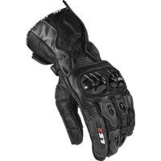                                                                                           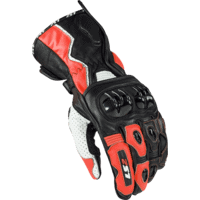                                                                                           |                                                                                           

## Modèles à 90,00 € :

 | Modèle | Photos |
|---|---|
|                                                                                           **[FUEL - FLAT](https://fuelmotorcycles.eu/collections/gloves/products/flat-glove)**                                                                                                                                                                                       EN13594-2KP                                                                                                                                                                                         Mi-saison                                                                                                                                                                                                                                                                                   ") Cuir                                                                                                                                                                                       ") Respirant                                                                                                                                                                                                                                                                                   Lieu de fabrication inconnu.                                                                                                                                                                                                                                                                                   Une bonne présentation sur Youtube :                                                                                            [Urban Rider - Fuel Flat & Track Leather Gloves Review](https://www.youtube.com/watch?v=9gN_T7DhwVQ)                                                                                                                                                                                        Prix en ligne au moment de la rédaction :                                                                                            - [90,00 €](https://fuelmotorcycles.eu/collections/gloves/products/flat-glove) (Fabricant)                                                                                                                                                                                                                                                                                    Pour les rechercher en occasion (~30-60 €) :                                                                                                                                                                                        |                                                                                           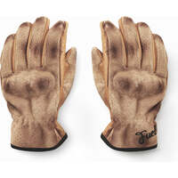                                                                                           |                                                                                           

## Modèles à 95,00 € :

 | Modèle | Photos |
|---|---|
|                                                                                           **[FUEL - TRACK](https://fuelmotorcycles.eu/collections/gloves/products/track-glove)**                                                                                                                                                                                       EN13594-2KP                                                                                                                                                                                         Mi-saison                                                                                                                                                                                                                                                                                   ") Cuir                                                                                                                                                                                                                                                                                   Lieu de fabrication inconnu.                                                                                                                                                                                                                                                                                   De bonnes présentations sur Youtube :                                                                                            [Urban Rider - Fuel Flat & Track Leather Gloves Review](https://www.youtube.com/watch?v=9gN_T7DhwVQ)                                                                                            [Urban Rider - Fuel & Helstons Dirt Tracker Leather Jacket review](https://www.youtube.com/watch?v=V_2ntK64fNI)                                                                                                                                                                                        Prix en ligne au moment de la rédaction :                                                                                            - [95,00 €](https://fuelmotorcycles.eu/collections/gloves/products/track-glove) (Fabricant)                                                                                                                                                                                                                                                                                    Pour les rechercher en occasion (~30-70 €) :                                                                                                                                                                                        |                                                                                                                                                                                      |                                                                                           

## Modèles à 109,15 € :

 | Modèle | Photos |
|---|---|
|                                                                                           **[ALPINESTARS - MORPH SPORT](https://www.alpinestars.com/products/morph-sport-gloves)**                                                                                                                                                                                       EN13594-2KP                                                                                                                                                                                                                                                                                                                                                                                Fabriqué en Asie / Europe :   ") Roumanie  ") Chine                                                                                                                                                                                                                                                                                   Une bonne présentation sur Youtube :                                                                                            [RevZilla - Alpinestars Morph Sport Gloves Review](https://www.youtube.com/watch?v=v3NUbWerxv0)                                                                                                                                                                                        Prix en ligne au moment de la rédaction :                                                                                            - [109,15 €](https://www.fc-moto.de/epages/fcm.sf/fr_FR/?ViewAction=FacetedSearchProducts&SearchString=ALPINESTARS+MORPH%20SPORT) (fcmoto)                                                                                            - [112,97 €](https://pkw.motoblouz.com/?P4122157BDFF171&redir=https%3A%2F%2Fwww.motoblouz.com%2Frecherche%2FALPINESTARS%2520MORPH%2520SPORT.html) (motoblouz)                                                                                            - [113,01 €](https://www.dafy-moto.com/recherche?string=ALPINESTARS%20MORPH%20SPORT) (dafy)                                                                                            - [154,95 $](https://www.alpinestars.com/products/morph-sport-gloves) (Fabricant)                                                                                                                                                                                                                                                                                    Pour les rechercher en occasion (~30-80 €) :                                                                                                                                                                                        |                                                                                                                                                                                                                                                                                                                                                                                                                                                                       |                                                                                           

## Modèles à 121,04 € :

 | Modèle | Photos |
|---|---|
|                                                                                           **[FIVE - RFX WP](https://five-gloves.com/glove/rfx-wp/)**                                                                                                                                                                                       EN13594-2KP                                                                                                                                                                                                                                                                                    ") Cuir                                                                                                                                                                                       ") Imperméable                                                                                                                                                                                                                                                                                   Fabriqué en Asie :   ") Chine                                                                                                                                                                                                                                                                                   Prix en ligne au moment de la rédaction :                                                                                            - [121,04 €](https://pkw.motoblouz.com/?P4122157BDFF171&redir=https%3A%2F%2Fwww.motoblouz.com%2Frecherche%2FFIVE%2520RFX%2520WP.html) (motoblouz)                                                                                            - [127,41 €](https://www.dafy-moto.com/recherche?string=FIVE%20RFX%20WP) (dafy)                                                                                                                                                                                                                                                                                    Pour les rechercher en occasion (~20-40 €) :                                                                                                                                                                                        |                                                                                           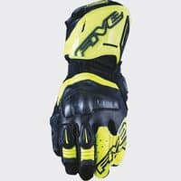                                                                                           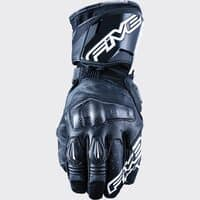                                                                                           |                                                                                           

## Modèles à 137,19 € :

 | Modèle | Photos |
|---|---|
|                                                                                           **[FIVE - RFX2 AIRFLOW](https://five-gloves.com/glove/rfx2-airflow/)**                                                                                                                                                                                       EN13594-2KP                                                                                                                                                                                          Eté                                                                                                                                                                                                                                                                                   ") Cuir                                                                                                                                                                                       ") Respirant                                                                                                                                                                                                                                                                                   Fabriqué en Asie :   ") Chine                                                                                                                                                                                                                                                                                   Prix en ligne au moment de la rédaction :                                                                                            - [137,19 €](https://pkw.motoblouz.com/?P4122157BDFF171&redir=https%3A%2F%2Fwww.motoblouz.com%2Frecherche%2FFIVE%2520RFX2%2520AIRFLOW.html) (motoblouz)                                                                                            - [144,41 €](https://www.dafy-moto.com/recherche?string=FIVE%20RFX2%20AIRFLOW) (dafy)                                                                                                                                                                                                                                                                                    Pour les rechercher en occasion (~40-100 €) :                                                                                                                                                                                        |                                                                                           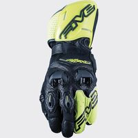                                                                                           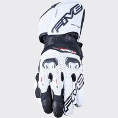                                                                                           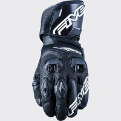                                                                                           |                                                                                           

## Modèles à 145,27 € :

 | Modèle | Photos |
|---|---|
|                                                                                           **[ALPINESTARS - AMT 10 AIR HDRY](https://www.alpinestars.com/products/amt-10-air-hdry-glove)**                                                                                                                                                                                       EN13594-2KP                                                                                                                                                                                         Eté                                                                                                                                                                                                                                                                                   ") Cuir                                                                                                                                                                                       ") Imperméable                                                                                                                                                                                       ") Respirant                                                                                                                                                                                                                                                                                   Fabriqué en Asie / Europe :   ") Chine  ") Roumanie                                                                                                                                                                                                                                                                                   Prix en ligne au moment de la rédaction :                                                                                            - [145,27 €](https://pkw.motoblouz.com/?P4122157BDFF171&redir=https%3A%2F%2Fwww.motoblouz.com%2Frecherche%2FALPINESTARS%2520AMT%252010%2520AIR%2520HDRY.html) (motoblouz)                                                                                            - [155,95 €](https://www.fc-moto.de/epages/fcm.sf/fr_FR/?ViewAction=FacetedSearchProducts&SearchString=ALPINESTARS+AMT%2010%20AIR%20HDRY) (fcmoto)                                                                                            - [161,46 €](https://www.dafy-moto.com/recherche?string=ALPINESTARS%20AMT%2010%20AIR%20HDRY) (dafy)                                                                                            - [199,95 $](https://www.alpinestars.com/products/amt-10-air-hdry-glove) (Fabricant)                                                                                                                                                                                                                                                                                    Pour les rechercher en occasion (~40-100 €) :                                                                                                                                                                                        |                                                                                           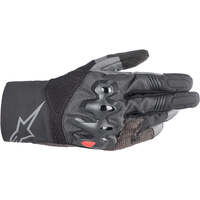                                                                                           |                                                                                           

## Modèles à 153,34 € :

 | Modèle | Photos |
|---|---|
|                                                                                           **[FIVE - SF1](https://five-gloves.com/glove/sf1-5/)**                                                                                                                                                                                       EN13594-2KP                                                                                                                                                                                                                                                                                    ") Cuir                                                                                                                                                                                                                                                                                   Fabriqué en Asie :   ") Chine                                                                                                                                                                                                                                                                                   Prix en ligne au moment de la rédaction :                                                                                             - [153,34 €](https://pkw.motoblouz.com/?P4122157BDFF171&redir=https%3A%2F%2Fwww.motoblouz.com%2Frecherche%2FFIVE%2520SF1.html) (motoblouz)                                                                                            - [161,41 €](https://www.dafy-moto.com/recherche?string=FIVE%20SF1) (dafy)                                                                                                                                                                                                                                                                                    Pour les rechercher en occasion (~10-30 €) :                                                                                                                                                                                        |                                                                                           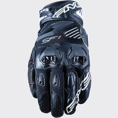                                                                                                                                                                                      |                                                                                           

## Modèles à 169,91 € :

 | Modèle | Photos |
|---|---|
|                                                                                           **[FIVE - RFX2](https://five-gloves.com/glove/rfx2/)**                                                                                                                                                                                       EN13594-2KP                                                                                                                                                                                                                                                                                    ") Cuir                                                                                                                                                                                                                                                                                   Fabriqué en Asie :   ") Chine                                                                                                                                                                                                                                                                                   Prix en ligne au moment de la rédaction :                                                                                            - [169,91 €](https://www.dafy-moto.com/recherche?string=FIVE%20RFX2) (dafy)                                                                                            - [185,64 €](https://pkw.motoblouz.com/?P4122157BDFF171&redir=https%3A%2F%2Fwww.motoblouz.com%2Frecherche%2FFIVE%2520RFX2.html) (motoblouz)                                                                                                                                                                                                                                                                                    Pour les rechercher en occasion (~50-120 €) :                                                                                                                                                                                        |                                                                                           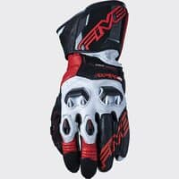                                                                                           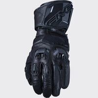                                                                                           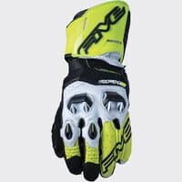                                                                                           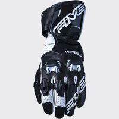                                                                                           |                                                                                           

## Modèles à 177,56 € :

 | Modèle | Photos |
|---|---|
|                                                                                           **[FIVE - TFX1 GTX](https://five-gloves.com/glove/tfx1-gtx/)**                                                                                                                                                                                       EN13594-2KP                                                                                                                                                                                                                                                                                    ") Cuir                                                                                                                                                                                       ") Imperméable                                                                                                                                                                                                                                                                                   Fabriqué en Asie :   ") Chine                                                                                                                                                                                                                                                                                   Une bonne présentation sur Youtube :                                                                                            [CORVER - Guantes de moto Five TFX1 GTX](https://www.youtube.com/watch?v=vu_pvW3c7do)                                                                                                                                                                                        Prix en ligne au moment de la rédaction :                                                                                            - [177,56 €](https://pkw.motoblouz.com/?P4122157BDFF171&redir=https%3A%2F%2Fwww.motoblouz.com%2Frecherche%2FFIVE%2520TFX1%2520GTX.html) (motoblouz)                                                                                            - [183,96 €](https://www.fc-moto.de/epages/fcm.sf/fr_FR/?ViewAction=FacetedSearchProducts&SearchString=FIVE+TFX1%20GTX) (fcmoto)                                                                                            - [186,91 €](https://www.dafy-moto.com/recherche?string=FIVE%20TFX1%20GTX) (dafy)                                                                                                                                                                                                                                                                                    Pour les rechercher en occasion (~50-120 €) :                                                                                                                                                                                        |                                                                                           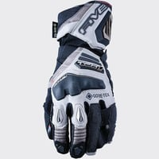                                                                                           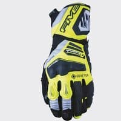                                                                                           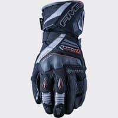                                                                                           |                                                                                           

## Modèles à 185,64 € :

 | Modèle | Photos |
|---|---|
|                                                                                           **[FIVE - RFX1](https://five-gloves.com/glove/rfx1-8/)**                                                                                                                                                                                       EN13594-2KP                                                                                                                                                                                                                                                                                    ") Cuir                                                                                                                                                                                                                                                                                   Fabriqué en Asie :   ") Chine                                                                                                                                                                                                                                                                                   De bonnes présentations sur Youtube :                                                                                            [CORVER - Guantes de moto Five RFX1 Replica](https://www.youtube.com/watch?v=hOAKmHbLgDg)                                                                                            [CORVER - Guantes Racing Five RFX4 RFX3 RFX1 RFX Race](https://www.youtube.com/watch?v=I9hnmXuipm4)                                                                                                                                                                                        Prix en ligne au moment de la rédaction :                                                                                            - [185,64 €](https://pkw.motoblouz.com/?P4122157BDFF171&redir=https%3A%2F%2Fwww.motoblouz.com%2Frecherche%2FFIVE%2520RFX1.html) (motoblouz)                                                                                            - [195,96 €](https://www.fc-moto.de/epages/fcm.sf/fr_FR/?ViewAction=FacetedSearchProducts&SearchString=FIVE+RFX1) (fcmoto)                                                                                            - [195,41 €](https://www.dafy-moto.com/recherche?string=FIVE%20RFX1) (dafy)                                                                                                                                                                                                                                                                                    Pour les rechercher en occasion (~60-130 €) :                                                                                                                                                                                        |                                                                                           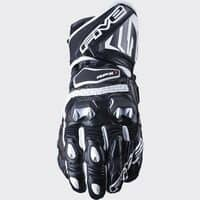                                                                                           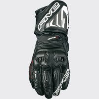                                                                                           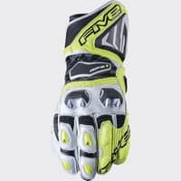                                                                                           |                                                                                           
|                                                                                           **[FIVE - RFX1 REPLICA](https://five-gloves.com/glove/rfx1-replica/)**                                                                                                                                                                                       EN13594-2KP                                                                                                                                                                                                                                                                                    ") Cuir                                                                                                                                                                                                                                                                                   Fabriqué en Asie :   ") Chine                                                                                                                                                                                                                                                                                   Une bonne présentation sur Youtube :                                                                                            [CORVER - Guantes de moto Five RFX1 Replica](https://www.youtube.com/watch?v=hOAKmHbLgDg)                                                                                                                                                                                        Prix en ligne au moment de la rédaction :                                                                                            - [185,64 €](https://pkw.motoblouz.com/?P4122157BDFF171&redir=https%3A%2F%2Fwww.motoblouz.com%2Frecherche%2FFIVE%2520RFX1%2520REPLICA.html) (motoblouz)                                                                                            - [195,41 €](https://www.dafy-moto.com/recherche?string=FIVE%20RFX1%20REPLICA) (dafy)                                                                                                                                                                                                                                                                                    Pour les rechercher en occasion (~60-130 €) :                                                                                                                                                                                        |                                                                                           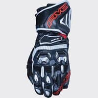                                                                                           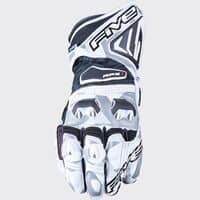                                                                                           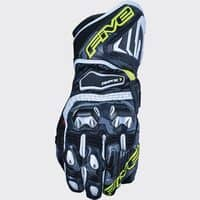                                                                                           |                                                                                           

## Modèles à 195,41 € :

 | Modèle | Photos |
|---|---|
|                                                                                           **[FIVE - RFX1 WOMAN](https://five-gloves.com/glove/rfx1-woman/)**                                                                                                                                                                                       EN13594-2KP                                                                                                                                                                                        ") Modèle femme                                                                                                                                                                                                                                                                                   ") Cuir                                                                                                                                                                                                                                                                                   Fabriqué en Asie :   ") Chine                                                                                                                                                                                                                                                                                   Prix en ligne au moment de la rédaction :                                                                                             - [195,41 €](https://www.dafy-moto.com/recherche?string=FIVE%20RFX1%20FEMME) (dafy)                                                                                                                                                                                                                                                                                    Pour les rechercher en occasion (~10-30 €) :                                                                                                                                                                                        |                                                                                           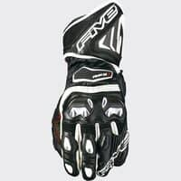                                                                                           |                                                                                           

## Modèles à 218,35 € :

 | Modèle | Photos |
|---|---|
|                                                                                           **[ALPINESTARS - GP PRO R3](https://www.alpinestars.com/products/gp-pro-r3-gloves)**                                                                                                                                                                                       EN13594-2KP                                                                                                                                                                                         Eté                                                                                                                                                                                                                                                                                   ") Cuir                                                                                                                                                                                       ") Respirant                                                                                                                                                                                                                                                                                   Fabriqué en Europe / Asie :   ") Roumanie  ") Chine                                                                                                                                                                                                                                                                                   Une bonne présentation sur Youtube :                                                                                            [RevZilla - Alpinestars GP Pro R3 Gloves Review](https://www.youtube.com/watch?v=cmgU-Um9y7I)                                                                                                                                                                                        Prix en ligne au moment de la rédaction :                                                                                            - [218,35 €](https://www.fc-moto.de/epages/fcm.sf/fr_FR/?ViewAction=FacetedSearchProducts&SearchString=ALPINESTARS+GP%20PRO%20R3) (fcmoto)                                                                                            - [226,01 €](https://pkw.motoblouz.com/?P4122157BDFF171&redir=https%3A%2F%2Fwww.motoblouz.com%2Frecherche%2FALPINESTARS%2520GP%2520PRO%2520R3.html) (motoblouz)                                                                                            - [226,06 €](https://www.dafy-moto.com/recherche?string=ALPINESTARS%20GP%20PRO%20R3) (dafy)                                                                                            - [289,95 $](https://www.alpinestars.com/products/gp-pro-r3-gloves) (Fabricant)                                                                                                                                                                                                                                                                                    Pour les rechercher en occasion (~50-120 €) :                                                                                                                                                                                        |                                                                                           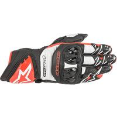                                                                                           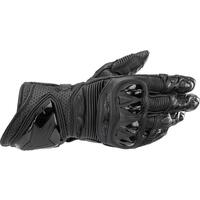                                                                                           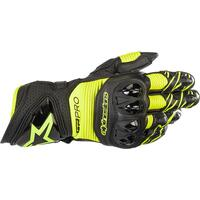                                                                                           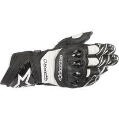                                                                                           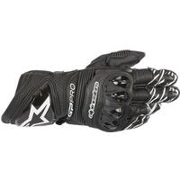                                                                                                                                                                                     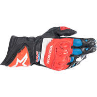                                                                                           |                                                                                           

## Modèles à 272,95 € :

 | Modèle | Photos |
|---|---|
|                                                                                           **[ALPINESTARS - GP TECH V2](https://www.alpinestars.com/products/gp-tech-v2-gloves)**                                                                                                                                                                                       EN13594-2KP                                                                                                                                                                                                                                                                                    ") Cuir                                                                                                                                                                                                                                                                                   Fabriqué en Asie / Europe :   ") Roumanie  ") Chine                                                                                                                                                                                                                                                                                   Une bonne présentation sur Youtube :                                                                                             [RevZilla - Alpinestars GP Tech Gloves Review at RevZilla.com](https://www.youtube.com/watch?v=qo7r9yV2Qvw)                                                                                                                                                                                        Prix en ligne au moment de la rédaction :                                                                                            - [272,95 €](https://www.fc-moto.de/epages/fcm.sf/fr_FR/?ViewAction=FacetedSearchProducts&SearchString=ALPINESTARS+GP%20TECH%20V2) (fcmoto)                                                                                            - [274,47 €](https://pkw.motoblouz.com/?P4122157BDFF171&redir=https%3A%2F%2Fwww.motoblouz.com%2Frecherche%2FALPINESTARS%2520GP%2520TECH%2520V2.html) (motoblouz)                                                                                            - [282,58 €](https://www.dafy-moto.com/recherche?string=ALPINESTARS%20GP%20TECH%20V2) (dafy)                                                                                            - [379,95 $](https://www.alpinestars.com/products/gp-tech-v2-gloves) (Fabricant)                                                                                                                                                                                                                                                                                    Pour les rechercher en occasion (~80-190 €) :                                                                                                                                                                                        |                                                                                                                                                                                      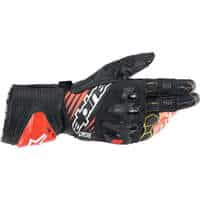                                                                                           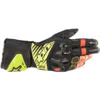                                                                                           |                                                                                           
|                                                                                           **[ALPINESTARS - GP TECH V2 S](https://www.alpinestars.com/products/gp-tech-v2-s-gloves)**                                                                                                                                                                                       EN13594-2KP                                                                                                                                                                                                                                                                                    ") Cuir                                                                                                                                                                                                                                                                                   Fabriqué en Asie / Europe :   ") Roumanie  ") Chine                                                                                                                                                                                                                                                                                  Une bonne présentation sur Youtube :                                                                                             [RevZilla - Alpinestars GP Tech Gloves Review at RevZilla.com](https://www.youtube.com/watch?v=qo7r9yV2Qvw)                                                                                                                                                                                        Prix en ligne au moment de la rédaction :                                                                                            - [272,95 €](https://www.fc-moto.de/epages/fcm.sf/fr_FR/?ViewAction=FacetedSearchProducts&SearchString=ALPINESTARS+GP%20TECH%20V2%20S) (fcmoto)                                                                                            - [274,47 €](https://pkw.motoblouz.com/?P4122157BDFF171&redir=https%3A%2F%2Fwww.motoblouz.com%2Frecherche%2FALPINESTARS%2520GP%2520TECH%2520V2%2520S.html) (motoblouz)                                                                                            - [282,58 €](https://www.dafy-moto.com/recherche?string=ALPINESTARS%20GP%20TECH%20V2%20S) (dafy)                                                                                            - [349,95 $](https://www.alpinestars.com/products/gp-tech-v2-s-gloves) (Fabricant)                                                                                                                                                                                                                                                                                    Pour les rechercher en occasion (~80-190 €) :                                                                                                                                                                                        |                                                                                           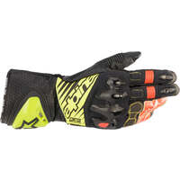                                                                                           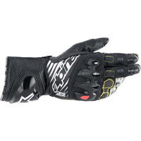                                                                                           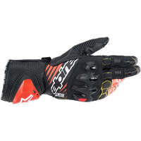                                                                                           |                                                                                           

## Modèles à 342,00 € :

 | Modèle | Photos |
|---|---|
|                                                                                           **[FIVE - RFX RACE](https://five-gloves.com/glove/rfx-race-3/)**                                                                                                                                                                                       EN13594-2KP                                                                                                                                                                                                                                                                                    ") Cuir                                                                                                                                                                                                                                                                                   Fabriqué en Asie :   ") Chine                                                                                                                                                                                                                                                                                   Une bonne présentation sur Youtube :                                                                                            [CORVER - Guantes Racing Five RFX4 RFX3 RFX1 RFX Race](https://www.youtube.com/watch?v=I9hnmXuipm4)                                                                                                                                                                                        Prix en ligne au moment de la rédaction :                                                                                            - [342,00 €](https://pkw.motoblouz.com/?P4122157BDFF171&redir=https%3A%2F%2Fwww.motoblouz.com%2Frecherche%2FFIVE%2520RFX%2520RACE.html) (motoblouz)                                                                                            - [382,50 €](https://www.dafy-moto.com/recherche?string=FIVE%20RFX%20RACE) (dafy)                                                                                            - [431,96 €](https://www.fc-moto.de/epages/fcm.sf/fr_FR/?ViewAction=FacetedSearchProducts&SearchString=FIVE+RFX%20RACE) (fcmoto)                                                                                                                                                                                                                                                                                    Pour les rechercher en occasion (~100-240 €) :                                                                                                                                                                                        |                                                                                           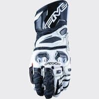                                                                                           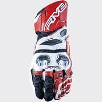                                                                                           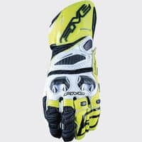                                                                                           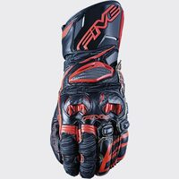                                                                                           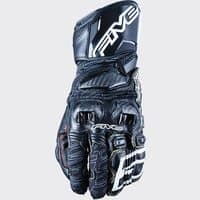                                                                                           |                                                                                           

