Lorsque la norme EN 13594 est entrée en vigueur en 2015/2016, les journaux moto prédisaient que les gants au niveau 2 KP seraient sûrement rares et limités à de l'équipement pour circuit.
6 ans plus tard force est de constater que les modèles se multiplient et ne sont pas nécessairement réservés à cet usage :  
J'ai identifié une quinzaine de modèles, de formes et styles différents, et pas nécessairement hors de prix (le premier prix est autour de 170 euros).

<!--more-->

J’ai mis le lien Motoblouz/Dafy et une idée des prix lorsque c’était possible _(note : Je peux toucher quelques centimes si vous passez par un de mes liens pour acheter sur le site)_.

> _Edit du 01/10/2022 : Ajout des liens Vinted et Leboncoin._

# La norme EN 13594:20xx

La norme européenne EN 13594 impose d'afficher sur les étiquettes des gants moto des infos précises sur leur niveau de protection.
A première vue elle existe au moins en 2 versions, 2015 et 2016, mais il ne semble pas y avoir de différence dans les niveaux de protection entre elles.

Le niveau de protection est matérialisé par une étiquette comme celle-ci :

3 niveaux sont possibles :

- Niveau 1 :
    - Manchette de plus de 1,5 cm ;
    - Résistance à l’abrasion : 4 secondes minimum ;
    - Résistance au déchirement : Paume > 25 N, dos > 18 N ;
    - Résistance des coutures à une pression interne > 6 N/mm ;
    - Résistance à l'arrachement > 25 N ;
    - Résistance à la coupure : Paume > 1,2 N, dos non testé.
- Niveau 1 KP : Comme le niveau 1, avec en plus :
    - Force transmise par les coques < 9 kN ;
- Niveau 2 KP : 
    - Manchette de plus de 5 cm ;
    - Résistance à l’abrasion : 8 secondes minimum ;
    - Force transmise par les coques < 5 kN ;
    - Résistance au déchirement : Paume > 35 N, dos > 30 N ;
    - Résistance des coutures à une pression interne > 10 N/mm ;
    - Résistance à l'arrachement > 50 N ;
    - Résistance à la coupure : Paume > 1,8 N, dos > 1,2 N.

Même sans connaître les détails des tests, les critères quasiment 2 fois plus élevés du 2 KP par rapport au 1 KP montrent clairement l'intérêt qu'il y a à rechercher ce type de gants.

# Note sur les fabricants et la transparence

Peu de fabricants sont transparents sur leurs sites en ce qui concerne la certification obtenue par leurs gants. L'information est souvent absente ou partielle, et même chez ceux qui la fournissent elle est souvent perdue dans un fichier PDF ou une image.

Ceux chez qui j'ai trouvé ces infos :

- Avec des modèles 2 KP :
    - ALPINESTARS ([site officiel](https://www.alpinestars.com/)) : La certification est souvent (pas toujours) indiquée dans le texte de la page ;
    - FIVE ([site officiel](https://www.five-gloves.com/)) : La certification est particulièrement difficile à trouver, il faut aller la chercher [dans le catalogue de la collection 2022](https://www.five-gloves.com/catalogue-collection/). C'est dommage car Five est de loin le fabricant qui propose le plus de modèles ;
- Sans modèles 2 KP :
    - ACERBIS ([site officiel](https://www.acerbis.com/en)) : La certification est **toujours** indiquée dans le texte de la page ;
    - ALL ONE ([Dafy-Moto](https://www.dafy-moto.com)) : La certification est **toujours** indiquée dans le texte de la page (mais tous sont indiqués comme niveau 1) ;
    - DXR ([Motoblouz](https://www.motoblouz.com)) : Le PDF "certificat de conformité" contient en général le niveau de certification ;
    - FURYGAN ([site officiel](https://www.furygan.com/)) : Le PDF "fiche technique" contient parfois le niveau de certification ;
    - IXON ([site officiel](https://www.ixon.com/fra-fr/)) : La certification est **toujours** présente sous forme d'image ;
    - REV'IT ([site officiel](https://www.revitsport.com/fr/)) : La certification est **toujours** indiquée dans le texte de la page ;
    - RST ([site officiel](https://www.rst-moto.com/fr/)) : La certification est souvent indiquée dans le texte de la page ;
    - COURSE ([XLMoto](https://www.xlmoto.com/)) : La certification est souvent indiquée dans le texte de la page ;
    - KLIM ([site officiel](https://www.klim.com/)) : La certification est souvent indiquée dans le texte de la page.

La liste (pléthorique) des autres fabricants de gants que j'ai parcourus mais dont les sites ne publient pas les niveaux de certification de leurs gants se trouve en annexe en fin de document.  
Si l'un d'entre eux évolue ou si vous en connaissez d'autres, n'hésitez pas à me prévenir en commentaire, et je les ajouterai à la prochaine version de ce document.

# Inventaire des gants EN 13594:20xx - 2 KP

## ALPINESTARS :

 | Modèle | Photos |
|---|---|
|            **[ALPINESTARS - AMT-10 AIR HDRY](https://www.alpinestars.com/products/amt-10-air-hdry-glove)**             EN-13594-20xx-2 KP             Sites de vente :  - [Rechercher sur Motoblouz](https://pkw.motoblouz.com/?P4122157BDFF171&redir=https%3A%2F%2Fwww.motoblouz.com%2Frecherche%2FALPINESTARS%2520AMT-10%2520AIR%2520HDRY.html)   - Dafy : [180,45 €](https://www.dafy-moto.com/recherche?string=ALPINESTARS%20AMT-10%20AIR%20HDRY)    Occasion :   - [Rechercher sur Leboncoin](https://www.leboncoin.fr/recherche?text=ALPINESTARS+AMT-10+AIR+HDRY&shippable=1&sort=price&order=asc)   - [Rechercher sur Vinted](https://www.vinted.fr/catalog?search_text=ALPINESTARS+AMT-10+AIR+HDRY)            |  |
|            **[ALPINESTARS - GP PRO R3](https://www.alpinestars.com/products/gp-pro-r3-gloves)**             EN-13594-2015-2 KP             Sites de vente :  - Motoblouz : [256,40 €](https://pkw.motoblouz.com/?P4122157BDFF171&redir=https%3A%2F%2Fwww.motoblouz.com%2Frecherche%2FALPINESTARS%2520GP%2520PRO%2520R3.html)   - Dafy : [256,45 €](https://www.dafy-moto.com/recherche?string=ALPINESTARS%20GP%20PRO%20R3)    Occasion :   - [Rechercher sur Leboncoin](https://www.leboncoin.fr/recherche?text=ALPINESTARS+GP+PRO+R3&shippable=1&sort=price&order=asc)   - [Rechercher sur Vinted](https://www.vinted.fr/catalog?search_text=ALPINESTARS+GP+PRO+R3)            | 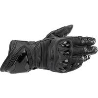 |
|            **[ALPINESTARS - GP PRO RS3](https://www.alpinestars.com/products/gp-pro-rs3-gloves)**             EN-13594-2015-2 KP             Sites de vente :  - [Rechercher sur Motoblouz](https://pkw.motoblouz.com/?P4122157BDFF171&redir=https%3A%2F%2Fwww.motoblouz.com%2Frecherche%2FALPINESTARS%2520GP%2520PRO%2520RS3.html)   - [Rechercher sur Dafy](https://www.dafy-moto.com/recherche?string=ALPINESTARS%20GP%20PRO%20RS3)    Occasion :   - [Rechercher sur Leboncoin](https://www.leboncoin.fr/recherche?text=ALPINESTARS+GP+PRO+RS3&shippable=1&sort=price&order=asc)   - [Rechercher sur Vinted](https://www.vinted.fr/catalog?search_text=ALPINESTARS+GP+PRO+RS3)            | 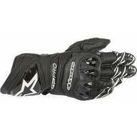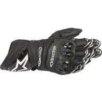 |
|            **[ALPINESTARS - GP TECH V2](https://www.alpinestars.com/products/gp-tech-v2-gloves)**             EN-13594-20xx-2 KP             Sites de vente :  - Motoblouz : [322,90 €](https://pkw.motoblouz.com/?P4122157BDFF171&redir=https%3A%2F%2Fwww.motoblouz.com%2Frecherche%2FALPINESTARS%2520GP%2520TECH%2520V2.html)   - Dafy : [322,95 €](https://www.dafy-moto.com/recherche?string=ALPINESTARS%20GP%20TECH%20V2)    Occasion :   - [Rechercher sur Leboncoin](https://www.leboncoin.fr/recherche?text=ALPINESTARS+GP+TECH+V2&shippable=1&sort=price&order=asc)   - [Rechercher sur Vinted](https://www.vinted.fr/catalog?search_text=ALPINESTARS+GP+TECH+V2)            | 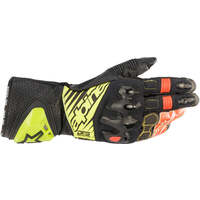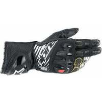 |
|            **[ALPINESTARS - GP TECH V2 S](https://www.alpinestars.com/products/gp-tech-v2-s-gloves)**             EN-13594-20xx-2 KP             Sites de vente :  - [Rechercher sur Motoblouz](https://pkw.motoblouz.com/?P4122157BDFF171&redir=https%3A%2F%2Fwww.motoblouz.com%2Frecherche%2FALPINESTARS%2520GP%2520TECH%2520V2%2520S.html)   - [Rechercher sur Dafy](https://www.dafy-moto.com/recherche?string=ALPINESTARS%20GP%20TECH%20V2%20S)    Occasion :   - [Rechercher sur Leboncoin](https://www.leboncoin.fr/recherche?text=ALPINESTARS+GP+TECH+V2+S&shippable=1&sort=price&order=asc)   - [Rechercher sur Vinted](https://www.vinted.fr/catalog?search_text=ALPINESTARS+GP+TECH+V2+S)            | 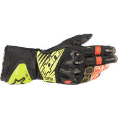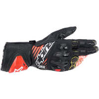 |

## FIVE :

 | Modèle | Photos |
|---|---|
|            **[FIVE - RFX RACE](https://www.five-gloves.com/glove/rfx-race-3-2/)**             EN-13594-2015-2 KP             Sites de vente :  - Motoblouz : [450,00 €](https://pkw.motoblouz.com/?P4122157BDFF171&redir=https%3A%2F%2Fwww.motoblouz.com%2Frecherche%2FFIVE%2520RFX%2520RACE.html)   - Dafy : [450,00 €](https://www.dafy-moto.com/recherche?string=FIVE%20RFX%20RACE)    Occasion :   - [Rechercher sur Leboncoin](https://www.leboncoin.fr/recherche?text=FIVE+RFX+RACE&shippable=1&sort=price&order=asc)   - [Rechercher sur Vinted](https://www.vinted.fr/catalog?search_text=FIVE+RFX+RACE)            | 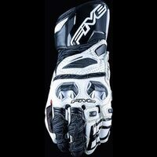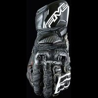 |
|            **[FIVE - RFX WP](https://www.five-gloves.com/glove/rfx-wp/)**             EN-13594-2015-2 KP             Sites de vente :  - [Rechercher sur Motoblouz](https://pkw.motoblouz.com/?P4122157BDFF171&redir=https%3A%2F%2Fwww.motoblouz.com%2Frecherche%2FFIVE%2520RFX%2520WP.html)   - [Rechercher sur Dafy](https://www.dafy-moto.com/recherche?string=FIVE%20RFX%20WP)    Occasion :   - [Rechercher sur Leboncoin](https://www.leboncoin.fr/recherche?text=FIVE+RFX+WP&shippable=1&sort=price&order=asc)   - [Rechercher sur Vinted](https://www.vinted.fr/catalog?search_text=FIVE+RFX+WP)            | 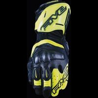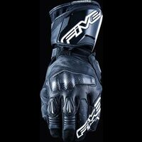 |
|            **[FIVE - RFX1](https://www.five-gloves.com/glove/rfx1-9/)**             EN-13594-2015-2 KP             Sites de vente :  - Motoblouz : [199,90 €](https://pkw.motoblouz.com/?P4122157BDFF171&redir=https%3A%2F%2Fwww.motoblouz.com%2Frecherche%2FFIVE%2520RFX1.html)   - Dafy : [199,90 €](https://www.dafy-moto.com/recherche?string=FIVE%20RFX1)    Occasion :   - [Rechercher sur Leboncoin](https://www.leboncoin.fr/recherche?text=FIVE+RFX1&shippable=1&sort=price&order=asc)   - [Rechercher sur Vinted](https://www.vinted.fr/catalog?search_text=FIVE+RFX1)            | 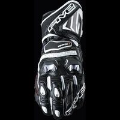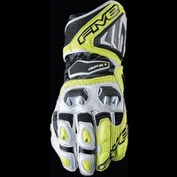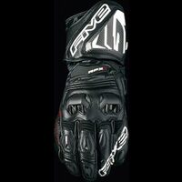 |
|            **[FIVE - RFX1 REPLICA](https://www.five-gloves.com/glove/rfx1-replica-2/)**             EN-13594-2015-2 KP             Sites de vente :  - Motoblouz : [229,90 €](https://pkw.motoblouz.com/?P4122157BDFF171&redir=https%3A%2F%2Fwww.motoblouz.com%2Frecherche%2FFIVE%2520RFX1%2520REPLICA.html)   - Dafy : [229,90 €](https://www.dafy-moto.com/recherche?string=FIVE%20RFX1%20REPLICA)    Occasion :   - [Rechercher sur Leboncoin](https://www.leboncoin.fr/recherche?text=FIVE+RFX1+REPLICA&shippable=1&sort=price&order=asc)   - [Rechercher sur Vinted](https://www.vinted.fr/catalog?search_text=FIVE+RFX1+REPLICA)            | 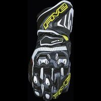 |
|            **[FIVE - RFX1 WOMAN](https://www.five-gloves.com/glove/rfx1-woman/)**             EN-13594-2015-2 KP             Sites de vente :  - [Rechercher sur Motoblouz](https://pkw.motoblouz.com/?P4122157BDFF171&redir=https%3A%2F%2Fwww.motoblouz.com%2Frecherche%2FFIVE%2520RFX1%2520WOMAN.html)   - Dafy : [229,90 €](https://www.dafy-moto.com/recherche?string=FIVE%20RFX1%20WOMAN)    Occasion :   - [Rechercher sur Leboncoin](https://www.leboncoin.fr/recherche?text=FIVE+RFX1+WOMAN&shippable=1&sort=price&order=asc)   - [Rechercher sur Vinted](https://www.vinted.fr/catalog?search_text=FIVE+RFX1+WOMAN)            | 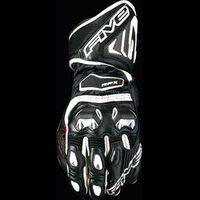 |
|            **[FIVE - RFX2](https://www.five-gloves.com/glove/rfx2-3/)**             EN-13594-2015-2 KP             Sites de vente :  - [Rechercher sur Motoblouz](https://pkw.motoblouz.com/?P4122157BDFF171&redir=https%3A%2F%2Fwww.motoblouz.com%2Frecherche%2FFIVE%2520RFX2.html)   - Dafy : [159,00 €](https://www.dafy-moto.com/recherche?string=FIVE%20RFX2)    Occasion :   - [Rechercher sur Leboncoin](https://www.leboncoin.fr/recherche?text=FIVE+RFX2&shippable=1&sort=price&order=asc)   - [Rechercher sur Vinted](https://www.vinted.fr/catalog?search_text=FIVE+RFX2)            | 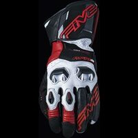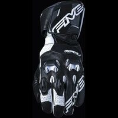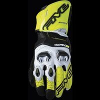 |
|            **[FIVE - RFX2 AIRFLOW](https://www.five-gloves.com/glove/rfx2-airflow/)**             EN-13594-2015-2 KP             Sites de vente :  - Motoblouz : [169,90 €](https://pkw.motoblouz.com/?P4122157BDFF171&redir=https%3A%2F%2Fwww.motoblouz.com%2Frecherche%2FFIVE%2520RFX2%2520AIRFLOW.html)   - Dafy : [149,00 €](https://www.dafy-moto.com/recherche?string=FIVE%20RFX2%20AIRFLOW)    Occasion :   - [Rechercher sur Leboncoin](https://www.leboncoin.fr/recherche?text=FIVE+RFX2+AIRFLOW&shippable=1&sort=price&order=asc)   - [Rechercher sur Vinted](https://www.vinted.fr/catalog?search_text=FIVE+RFX2+AIRFLOW)            |  |
|            **[FIVE - SF1](https://www.five-gloves.com/glove/sf1-5/)**             EN-13594-2015-2 KP             Sites de vente :  - Motoblouz : [189,90 €](https://pkw.motoblouz.com/?P4122157BDFF171&redir=https%3A%2F%2Fwww.motoblouz.com%2Frecherche%2FFIVE%2520SF1.html)   - Dafy : [189,90 €](https://www.dafy-moto.com/recherche?string=FIVE%20SF1)    Occasion :   - [Rechercher sur Leboncoin](https://www.leboncoin.fr/recherche?text=FIVE+SF1&shippable=1&sort=price&order=asc)   - [Rechercher sur Vinted](https://www.vinted.fr/catalog?search_text=FIVE+SF1)            | 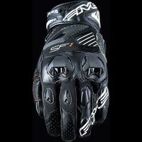 |
|            **[FIVE - TFX1 GTX](https://www.five-gloves.com/glove/tfx1-gtx/)**             EN-13594-2015-2 KP             Sites de vente :  - Motoblouz : [219,90 €](https://pkw.motoblouz.com/?P4122157BDFF171&redir=https%3A%2F%2Fwww.motoblouz.com%2Frecherche%2FFIVE%2520TFX1%2520GTX.html)   - Dafy : [219,90 €](https://www.dafy-moto.com/recherche?string=FIVE%20TFX1%20GTX)    Occasion :   - [Rechercher sur Leboncoin](https://www.leboncoin.fr/recherche?text=FIVE+TFX1&shippable=1&sort=price&order=asc)   - [Rechercher sur Vinted](https://www.vinted.fr/catalog?search_text=FIVE+TFX1)            | 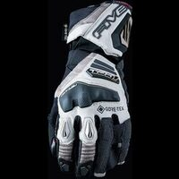 |

---

# ANNEXE : Fabricants ne publiant pas assez/aucune info sur la protection de leurs gants

Infos absentes :
- [Bering](https://bering.fr/index-fr.php/?___store=french#popup)
- [BMW Motorrad](https://www.bmw-motorrad.fr)
- [Difi](https://www.motoport.eu/en/Difi)
- [Helstons](https://www.helstons.net/)
- [IXS](https://ixs.com/en/moto/)
- [Icon](https://rideicon.com/)
- [Louis moto](https://www.louis-moto.fr) :
    - Highway 1
    - Rekurv
    - Vanucci
    - Detlev Louis
    - Madhead
    - Probiker
- [Merlin](https://www.merlinbikegear.com/)
- [O'neal](https://www.oneal.eu/)
- [Overlap](https://overlap-denim.com/)
- [Richa](https://www.richa.eu/en-us/)
- [Rusty Stitches](https://www.rustystitches.com/)
- [Shot](https://catalog.shotracegear.com/dealersfr/)
- [Segura](https://segura-moto.fr/index-fr.php)
- [Seventy Degrees](https://seventy-70.com/en/)
- [Sidi](https://www.sidi.com/en/)
- [Thor](https://www.thormx.com/)
- [Vquattro](https://vquattro.com/)

[^1]: **Abrasion** ( Norme _CE EN 13594_) :  
       Nombre de secondes pour traverser le gant avec une bande abrasive de grain 60 qui tourne à 8 m/s
[^2]: **Eclatement** ( Norme _CE EN 13594_) :  
        Le gant est mis sous pression de l'intérieur jusqu'à éclatement.
[^3]: **Résistance à la perforation/coupure** ( Norme _CE EN 13634-2017_) :  
       Une lame est lancée à 2,8 m/s sur tige+doublure et on mesure la pénétration :
        1. Niveau 1 : < 25 mm
        2. Niveau 2 : < 15 mm
[^4]: **Résistance à la torsion** ( Norme _CE EN 13634-2017_) :  
       Mesure de la force nécessaire pour déformer la semelle de 2 cm :
        1. Niveau 1 : > 1 kN
        2. Niveau 2 : > 1,5 kN  
