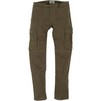
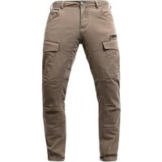
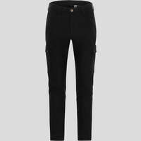

Cette page inventorie les pantalons moto de type "cargo"qui atteignent les 2 niveaux supérieurs de la norme EN 17092 : AAA et AA.

J'ai mis diverses indications permettant de faire son choix : lieu de fabrication quand connu, imperméabilité, genre annoncé...

J’ai mis le lien Motoblouz/Dafy/Fcmoto lorsque le produit était disponible au moment de la rédaction de l'article _(note : Je peux toucher quelques centimes si vous passez par un de mes liens pour acheter sur Motoblouz)_.

---

# Explications sur la norme EN 17092:20xx

La norme européenne EN 17092 impose d'afficher sur les étiquettes des blousons et pantalons moto une mesure précise sur leur niveau de protection, matérialisée par une étiquette comme celle-ci :

Une explication sur le site "Demonerosso" de Dainese ici : [comment fonctionnent les certifications des vestes et pantalons moto](https://demonerosso.dainese.com/fr/comment-fonctionnent-les-certifications-des-vestes-et-pantalons-de-moto)

Une autre sur le site de VQuattro ici :[NORMES CE DES BLOUSONS MOTO](https://vquattro.com/conseils/normes-ce/normes-ce-pantalons-blousons-moto/)

Il faut essentiellement retenir que le corps est divisé en 3 zones, qui doivent résister à des tests d'abrasion, de déchirure et d'éclatement des coutures différents en fonction de leur exposition.

L'abrasion n'est pas le seul critère mais elle donne une bonne idée des différences entres niveaux A, AA, et AAA :  
L'échantillon de tissu est soumis à une chute simulée à une vitesse donnée, avec frottement jusqu'à immobilisation, il ne doit pas comporter de trou de plus de 5 mm pour être certifié.  
Les vitesses de chute par niveau :

- AAA :
    - Zone 1 : Chute à 120 km/h
    - Zone 2 : Chute à 75 km/h
    - Zone 3 : Chute à 45 km/h
- AA :
    - Zone 1 : Chute à 70 km/h
    - Zone 2 : Chute à 45 km/h
    - Zone 3 : Chute à 25 km/h
- A :
    - Zone 1 : Chute à 45 km/h
    - Zone 2 : Chute à 25 km/h
    - Zone 3 : Non testée

(_A garder en tête :_ Le revêtement sur lequel les tests sont effectués est en ciment, c'est beaucoup moins abrasif que le bitume de nos routes)

Les 2 autres niveaux, B et C, sont sans grand intérêt : Le B est un A sans coques, et le C propose une protection vraiment très faible.

---

> *Note :* Cette page a été réalisée à partir des données fournies par les fabricants sur leurs sites Web.
> Sa génération est en grande partie automatisée, il peut donc y avoir quelques erreurs.
> 
> Les fabricants analysés sont les suivants :
> [ACERBIS](https://www.acerbis.com/), 
[ALPINESTARS](https://www.alpinestars.com/), 
[BERING](https://bering.fr/), 
[BMW](https://www.bmw-motorrad.fr/), 
[BULL-IT](https://www.bull-it.com/), 
[COURSE](https://www.xlmoto.com/), 
[DAINESE](https://www.dainese.com), 
[DUCATI](https://www.ducati.com/), 
[DXR](https://www.motoblouz.com/), 
[ESQUAD](https://www.esquad.fr/), 
[EUDOXIE](https://eudoxie.shop/), 
[FALCO](https://giannifalco.com/), 
[FIVE](https://five-gloves.com/), 
[FORMA](https://www.formabootsusa.com/), 
[FUEL](https://fuelmotorcycles.eu/), 
[FURYGAN](https://www.furygan.com/), 
[GOLDTOP](https://goldtop.co.uk/), 
[HALVARSSONS](https://halvarssonsmc.com/), 
[HELSTONS](https://www.helstons.net/), 
[HEVIK](https://www.hevik.co.uk/), 
[HOOD](https://www.hoodjeans.co.uk), 
[IXON](https://www.ixon.com/), 
[IXS](https://ixs.com/), 
[JOHN-DOE](https://www.ridejohndoe.com/), 
[KLIM](https://www.klim.com/), 
[KNOX](https://www.planet-knox.com), 
[LOUIS](https://www.louis.ie), 
[LS2](https://www.ls2usa.com/), 
[MERLAMOTO](https://merlamoto.com/), 
[MERLIN](https://www.merlinbikegear.shop/), 
[MOTOGIRL](https://motogirl.co.uk/), 
[OJ](https://ojworld.it/), 
[OXFORD](https://www.oxfordproducts.com/), 
[PANDO](https://pandomoto.com/), 
[PMJ](https://pmj.it/), 
[RACERED](https://racered.eu/), 
[RACER](https://www.racer1927.com/), 
[RAXID](https://raxid.co.uk), 
[RESURGENCE-GEAR](https://resurgencegear.net/), 
[REVIT](https://www.revitsport.com/), 
[ROADSKIN](https://roadskin.co.uk/), 
[ROKKER](https://www.eu.therokkercompany.com/), 
[RST](https://www.rst-moto.com/), 
[RUKKA](https://luhta.com/), 
[SEGURA](https://segura-moto.fr/), 
[SEVENTY-DEGREES](https://seventy-70.com/), 
[SIDI](https://www.sidi.com/), 
[SOUBIRAC](https://www.soubirac.fr/), 
[SPIDI](https://www.spidi.com/), 
[TCX](https://www.tcxboots.com/), 
[2MILESIX](https://www.2milesix.com/).

> 
> Les fabricants suivants ont été exclus car ils n'affichent pas le niveau de sécurité de leurs produits, ou ne sont pas commercialisés en Europe : ARLEN NESS, ARMURE, BELSTAFF, BILT, BOGOTTO, BOLID'STER, DRAGGIN, DRIRIDER, ELEVEIT, FLY MOTO, FOX, GAERNE, HARLEY DAVIDSON, HELD, HOLYFREEDOM, HONDA, ICON, INDIAN, KAWASAKI, KLIM, KTM, LEATT, MACNA, O'NEAL, OVERLAP, REAX, RICHA, RJAYS, RST, RUSTY STITCHES, SAINT, SCOTT, SEDICI, SHOT, SIDI, SOUBIRAC, SPIRIT MOTORS, STADLER, STREET & STEEL, STYLMARTIN, THOR, TRIUMPH, VENDRAMINI, WEX, XPD, YAMAHA

---

## Modèles à 149,99 £ :

 | Modèle | Photos |
|---|---|
|                                                                                           **[BULL-IT - TACTICAL RANGER](https://www.bull-it.com/collections/mens/products/ranger-black-easy)**                                                                                                                                                                                       EN17092-AA                                                                                                                                                                                        ") Modèle homme                                                                                                                                                                                        Eté                                                                                                                                                                                                                                                                                    Mono-couche/single-layer                                                                                                                                                                                       ") Respirant                                                                                                                                                                                                                                                                                   Lieu de fabrication inconnu.                                                                                                                                                                                                                                                                                   Prix en ligne au moment de la rédaction :                                                                                            - [149,99 £](https://www.bull-it.com/collections/mens/products/ranger-black-easy) (Fabricant)                                                                                                                                                                                                                                                                                    Pour les rechercher en occasion (~40-100 €) :                                                                                                                                                                                        |                                                                                                                                                                                      |                                                                                           

## Modèles à 159,99 £ :

 | Modèle | Photos |
|---|---|
|                                                                                           **[MERLIN - REMY CARGO](https://www.merlinbikegear.shop/collections/protective-denim/products/remy-cargo-jeans)**                                                                                                                                                                                       EN17092-AA                                                                                                                                                                                                                                                                                                                                                                                Lieu de fabrication inconnu.                                                                                                                                                                                                                                                                                   Prix en ligne au moment de la rédaction :                                                                                            - [159,99 £](https://www.merlinbikegear.shop/collections/protective-denim/products/remy-cargo-jeans) (Fabricant)                                                                                                                                                                                                                                                                                    Pour les rechercher en occasion (~50-110 €) :                                                                                                                                                                                        |                                                                                                                                                                                                                                                                                 |                                                                                           

## Modèles à 169,95 € :

 | Modèle | Photos |
|---|---|
|                                                                                           **[MERLIN - HARLOW](https://www.merlinbikegear.shop/collections/protective-denim/products/harlow-merlin-jean)**                                                                                                                                                                                       EN17092-AA                                                                                                                                                                                        ") Modèle homme                                                                                                                                                                                                                                                                                                                                                                               Lieu de fabrication inconnu.                                                                                                                                                                                                                                                                                   Prix en ligne au moment de la rédaction :                                                                                            - [169,95 €](https://www.fc-moto.de/epages/fcm.sf/fr_FR/?ViewAction=FacetedSearchProducts&SearchString=MERLIN+HARLOW) (fcmoto)                                                                                            - [199,99 £](https://www.merlinbikegear.shop/collections/protective-denim/products/harlow-merlin-jean) (Fabricant)                                                                                                                                                                                                                                                                                    Pour les rechercher en occasion (~50-120 €) :                                                                                                                                                                                        |                                                                                                                                                                                      |                                                                                           

## Modèles à 206,90 € :

 | Modèle | Photos |
|---|---|
|                                                                                           **[IXS - CLASSIC AR CARGO](https://ixs.com/en/moto/motorcycle-garment/pants/jeans/2664/classic-ar-pants-cargo-black)**                                                                                                                                                                                       EN17092-AA                                                                                                                                                                                                                                                                                                                                                                                Lieu de fabrication inconnu.                                                                                                                                                                                                                                                                                   Prix en ligne au moment de la rédaction :                                                                                            - [206,90 €](https://pkw.motoblouz.com/?P4122157BDFF171&redir=https%3A%2F%2Fwww.motoblouz.com%2Frecherche%2FIXS%2520CLASSIC%2520AR%2520CARGO.html) (motoblouz)                                                                                            - [229,95 €](https://ixs.com/en/moto/motorcycle-garment/pants/jeans/2664/classic-ar-pants-cargo-black) (Fabricant)                                                                                                                                                                                                                                                                                    Pour les rechercher en occasion (~60-140 €) :                                                                                                                                                                                        |                                                                                                                                                                                      |                                                                                           

## Modèles à 229,99 £ :

 | Modèle | Photos |
|---|---|
|                                                                                           **[MERLIN - WARREN SINGLE LAYER D3O CARGO](https://www.merlinbikegear.shop/collections/protective-denim/products/warren-single-layer-d3o%C2%AE-cargo-jean)**                                                                                                                                                                                       EN17092-AA                                                                                                                                                                                         Eté                                                                                                                                                                                                                                                                                    Mono-couche/single-layer                                                                                                                                                                                       ") Respirant                                                                                                                                                                                                                                                                                   Lieu de fabrication inconnu.                                                                                                                                                                                                                                                                                   Prix en ligne au moment de la rédaction :                                                                                            - [229,99 £](https://www.merlinbikegear.shop/collections/protective-denim/products/warren-single-layer-d3o%C2%AE-cargo-jean) (Fabricant)                                                                                                                                                                                                                                                                                    Pour les rechercher en occasion (~70-160 €) :                                                                                                                                                                                        |                                                                                                                                                                                                                                                                                                                                                                                                                                                                       |                                                                                           

## Modèles à 235,00 £ :

 | Modèle | Photos |
|---|---|
|                                                                                           **[RESURGENCE-GEAR - CARGO PEKEV](https://resurgencegear.net/collections/mens-trousers/products/resurgence-gear-r-2020-cargo-mens-pekev-motorcycle-trousers-military-green)**                                                                                                                                                                                       EN17092-AAA                                                                                                                                                                                                                                                                                                                                                                                Lieu de fabrication inconnu.                                                                                                                                                                                                                                                                                   Prix en ligne au moment de la rédaction :                                                                                            - [235,00 £](https://resurgencegear.net/collections/mens-trousers/products/resurgence-gear-r-2020-cargo-mens-pekev-motorcycle-trousers-military-green) (Fabricant)                                                                                                                                                                                                                                                                                    Pour les rechercher en occasion (~70-160 €) :                                                                                                                                                                                        |                                                                                                                                                                                                                                                                                 |                                                                                           

## Modèles à 251,10 € :

 | Modèle | Photos |
|---|---|
|                                                                                           **[PANDO - MARK KEV 01](https://pandomoto.com/product/all/men/cargo-motorcycle-pants/)**                                                                                                                                                                                       EN17092-AA                                                                                                                                                                                        ") Modèle homme                                                                                                                                                                                        Eté                                                                                                                                                                                                                                                                                   ") Respirant                                                                                                                                                                                                                                                                                   Lieu de fabrication inconnu.                                                                                                                                                                                                                                                                                   Une bonne présentation sur Youtube :                                                                                            [Urban Rider - PANDO MOTO MARK KEV 02 Cargo Trousers Review](https://www.youtube.com/watch?v=Q2dKcROYBQ8)                                                                                                                                                                                        Prix en ligne au moment de la rédaction :                                                                                            - [251,10 €](https://www.fc-moto.de/epages/fcm.sf/fr_FR/?ViewAction=FacetedSearchProducts&SearchString=PANDO+MARK%20KEV%2001) (fcmoto)                                                                                            - [279,00 €](https://pandomoto.com/product/all/men/cargo-motorcycle-pants/) (Fabricant)                                                                                            - [279,00 €](https://pkw.motoblouz.com/?P4122157BDFF171&redir=https%3A%2F%2Fwww.motoblouz.com%2Frecherche%2FPANDO%2520MARK%2520KEV%252001.html) (motoblouz)                                                                                                                                                                                                                                                                                    Pour les rechercher en occasion (~80-180 €) :                                                                                                                                                                                        |                                                                                                                                                                                      |                                                                                           

## Modèles à 259,00 € :

 | Modèle | Photos |
|---|---|
|                                                                                           **[JOHN-DOE - CARGO STROKER](https://www.ridejohndoe.com/en/cargo-men-stroker-olive-xtm.html)**                                                                                                                                                                                       EN17092-AAA                                                                                                                                                                                         Eté                                                                                                                                                                                                                                                                                    Double-couche                                                                                                                                                                                       ") Respirant                                                                                                                                                                                                                                                                                   Fabriqué en Europe :   ") Portugal                                                                                                                                                                                                                                                                                   Prix en ligne au moment de la rédaction :                                                                                            - [259,00 €](https://www.ridejohndoe.com/en/cargo-men-stroker-olive-xtm.html) (Fabricant)                                                                                                                                                                                                                                                                                    Pour les rechercher en occasion (~80-180 €) :                                                                                                                                                                                        |                                                                                                                                                                                                                                                                                                                                                                                                                                                                       |                                                                                           
|                                                                                           **[JOHN-DOE - DEFENDER](https://www.ridejohndoe.com/en/mjdc5003-defender-mono-olive.html)**                                                                                                                                                                                       EN17092-AAA                                                                                                                                                                                         Eté                                                                                                                                                                                                                                                                                    Mono-couche/single-layer                                                                                                                                                                                       ") Respirant                                                                                                                                                                                                                                                                                   Fabriqué en Europe :   ") Portugal                                                                                                                                                                                                                                                                                   Prix en ligne au moment de la rédaction :                                                                                            - [259,00 €](https://www.ridejohndoe.com/en/mjdc5003-defender-mono-olive.html) (Fabricant)                                                                                                                                                                                                                                                                                    Pour les rechercher en occasion (~80-180 €) :                                                                                                                                                                                        |                                                                                                                                                                                                                                                                                                                                                                            |                                                                                           

## Modèles à 268,00 € :

 | Modèle | Photos |
|---|---|
|                                                                                           **[RACERED - FALCON 2](https://racered.eu/products/copia-de-falcon)**                                                                                                                                                                                       EN17092-AA                                                                                                                                                                                                                                                                                                                                                                                Lieu de fabrication inconnu.                                                                                                                                                                                                                                                                                   Prix en ligne au moment de la rédaction :                                                                                            - [268,00 €](https://racered.eu/products/copia-de-falcon) (Fabricant)                                                                                                                                                                                                                                                                                    Pour les rechercher en occasion (~80-190 €) :                                                                                                                                                                                        |                                                                                                                                                                                      |                                                                                           
|                                                                                           **[RACERED - LADY FALCON 2](https://racered.eu/products/copia-de-lady-falcon)**                                                                                                                                                                                       EN17092-AA                                                                                                                                                                                        ") Modèle femme                                                                                                                                                                                                                                                                                                                                                                               Lieu de fabrication inconnu.                                                                                                                                                                                                                                                                                   Prix en ligne au moment de la rédaction :                                                                                            - [268,00 €](https://racered.eu/products/copia-de-lady-falcon) (Fabricant)                                                                                                                                                                                                                                                                                    Pour les rechercher en occasion (~80-190 €) :                                                                                                                                                                                        |                                                                                                                                                                                      |                                                                                           

## Modèles à 279,00 € :

 | Modèle | Photos |
|---|---|
|                                                                                           **[PANDO - DESERT CARGO](https://pandomoto.com/product/all/men/desert-cargo-beige-motorcycle-jeans-for-men-with-chino-style-cordura/)**                                                                                                                                                                                       EN17092-AA                                                                                                                                                                                        ") Modèle homme                                                                                                                                                                                                                                                                                                                                                                               Lieu de fabrication inconnu.                                                                                                                                                                                                                                                                                   Une bonne présentation sur Youtube :                                                                                            [Urban Rider - PANDO MOTO Desert Cargo Trousers Review](https://www.youtube.com/watch?v=WXBIC_cinrA)                                                                                                                                                                                        Prix en ligne au moment de la rédaction :                                                                                            - [279,00 €](https://pandomoto.com/product/all/men/desert-cargo-beige-motorcycle-jeans-for-men-with-chino-style-cordura/) (Fabricant)                                                                                            - [279,00 €](https://pkw.motoblouz.com/?P4122157BDFF171&redir=https%3A%2F%2Fwww.motoblouz.com%2Frecherche%2FPANDO%2520DESERT%2520CARGO.html) (motoblouz)                                                                                                                                                                                                                                                                                    Pour les rechercher en occasion (~80-200 €) :                                                                                                                                                                                        |                                                                                                                                                                                      |                                                                                           
|                                                                                           **[PANDO - MARK KEV 02](https://pandomoto.com/product/all/men/motorcycle-cargo-pants-markkev02/)**                                                                                                                                                                                       EN17092-AA                                                                                                                                                                                        ") Modèle homme                                                                                                                                                                                        Eté                                                                                                                                                                                                                                                                                   ") Respirant                                                                                                                                                                                                                                                                                   Lieu de fabrication inconnu.                                                                                                                                                                                                                                                                                   Une bonne présentation sur Youtube :                                                                                            [Urban Rider - PANDO MOTO MARK KEV 02 Cargo Trousers Review](https://www.youtube.com/watch?v=Q2dKcROYBQ8)                                                                                                                                                                                        Prix en ligne au moment de la rédaction :                                                                                            - [279,00 €](https://pandomoto.com/product/all/men/motorcycle-cargo-pants-markkev02/) (Fabricant)                                                                                            - [279,00 €](https://pkw.motoblouz.com/?P4122157BDFF171&redir=https%3A%2F%2Fwww.motoblouz.com%2Frecherche%2FPANDO%2520MARK%2520KEV%252002.html) (motoblouz)                                                                                                                                                                                                                                                                                    Pour les rechercher en occasion (~80-200 €) :                                                                                                                                                                                        |                                                                                                                                                                                      |                                                                                           
|                                                                                           **[PANDO - MILA CARGO](https://pandomoto.com/product/all/women/mila-cargo-beige-motorcycle-jeans-for-women-with-chino-style-cordura/)**                                                                                                                                                                                       EN17092-AA                                                                                                                                                                                        ") Modèle femme                                                                                                                                                                                        Eté                                                                                                                                                                                                                                                                                    Mono-couche/single-layer                                                                                                                                                                                       ") Respirant                                                                                                                                                                                                                                                                                   Lieu de fabrication inconnu.                                                                                                                                                                                                                                                                                   Prix en ligne au moment de la rédaction :                                                                                            - [279,00 €](https://pandomoto.com/product/all/women/mila-cargo-beige-motorcycle-jeans-for-women-with-chino-style-cordura/) (Fabricant)                                                                                                                                                                                                                                                                                    Pour les rechercher en occasion (~80-200 €) :                                                                                                                                                                                        |                                                                                                                                                                                      |                                                                                           

## Modèles à 319,00 € :

 | Modèle | Photos |
|---|---|
|                                                                                           **[ROKKER - JACK](https://www.therokkercompany.com/products/black-jack)**                                                                                                                                                                                       EN17092-AA                                                                                                                                                                                         Eté                                                                                                                                                                                                                                                                                   ") Respirant                                                                                                                                                                                                                                                                                   Fabriqué en Europe :   ") Portugal                                                                                                                                                                                                                                                                                   De bonnes présentations sur Youtube :                                                                                            [RevZilla - Rokker Black Jack Cargo Pants Review at RevZilla.com](https://www.youtube.com/watch?v=YlegnEddAMw)                                                                                            [RevZilla - Rokker Black Jack Slim Cargo Pants Review](https://www.youtube.com/watch?v=QfeiNigGKIQ)                                                                                                                                                                                        Prix en ligne au moment de la rédaction :                                                                                            - [319,00 €](https://www.fc-moto.de/epages/fcm.sf/fr_FR/?ViewAction=FacetedSearchProducts&SearchString=ROKKER+JACK) (fcmoto)                                                                                            - [499 CHF](https://www.therokkercompany.com/products/black-jack) (Fabricant)                                                                                                                                                                                                                                                                                    Pour les rechercher en occasion (~100-220 €) :                                                                                                                                                                                        |                                                                                                                                                                                      |                                                                                           

## Modèles à 349,00 € :

 | Modèle | Photos |
|---|---|
|                                                                                           **[ROKKER - CARGO SLIM](https://www.therokkercompany.com/products/cargo-slim-olive)**                                                                                                                                                                                       EN17092-AA                                                                                                                                                                                         Eté                                                                                                                                                                                                                                                                                   ") Respirant                                                                                                                                                                                                                                                                                   Fabriqué en Europe :   ") Portugal                                                                                                                                                                                                                                                                                   Une bonne présentation sur Youtube :                                                                                            [RevZilla - Rokker Black Jack Slim Cargo Pants Review](https://www.youtube.com/watch?v=QfeiNigGKIQ)                                                                                                                                                                                        Prix en ligne au moment de la rédaction :                                                                                            - [349,00 €](https://www.fc-moto.de/epages/fcm.sf/fr_FR/?ViewAction=FacetedSearchProducts&SearchString=ROKKER+CARGO%20SLIM) (fcmoto)                                                                                            - [399 CHF](https://www.therokkercompany.com/products/cargo-slim-olive) (Fabricant)                                                                                                                                                                                                                                                                                    Pour les rechercher en occasion (~100-240 €) :                                                                                                                                                                                        |                                                                                                                                                                                      |                                                                                           

## Modèles à 369,95 € :

 | Modèle | Photos |
|---|---|
|                                                                                           **[DAINESE - COMBAT TEX](https://www.dainese.com/fr/en/motorbike/pants/textile/combat-tex-pants-201755142.html?dwvar_201755142_color=OLIVE)**                                                                                                                                                                                       EN17092-AAA                                                                                                                                                                                        ") Modèle mixte                                                                                                                                                                                        Eté                                                                                                                                                                                                                                                                                    Mono-couche/single-layer                                                                                                                                                                                       ") Respirant                                                                                                                                                                                                                                                                                   Fabriqué en proche Europe :   ") Ukraine                                                                                                                                                                                                                                                                                   Une bonne présentation sur Youtube :                                                                                            [RevZilla - Dainese Combat Tex Pants Review](https://www.youtube.com/watch?v=WWXHTY8Edpk)                                                                                                                                                                                        Prix en ligne au moment de la rédaction :                                                                                            - [369,95 €](https://www.dainese.com/fr/en/motorbike/pants/textile/combat-tex-pants-201755142.html?dwvar_201755142_color=OLIVE) (Fabricant)                                                                                                                                                                                                                                                                                    Pour les rechercher en occasion (~110-260 €) :                                                                                                                                                                                        |                                                                                                                                                                                                                                                                                 |                                                                                           

## Modèles à 369,00 € :

 | Modèle | Photos |
|---|---|
|                                                                                           **[ROKKER - JACK SLIM](https://www.therokkercompany.com/products/black-jack-slim)**                                                                                                                                                                                       EN17092-AA                                                                                                                                                                                                                                                                                                                                                                                Fabriqué en Europe :   ") Portugal                                                                                                                                                                                                                                                                                   Une bonne présentation sur Youtube :                                                                                            [RevZilla - Rokker Black Jack Slim Cargo Pants Review](https://www.youtube.com/watch?v=QfeiNigGKIQ)                                                                                                                                                                                        Prix en ligne au moment de la rédaction :                                                                                            - [369,00 €](https://www.fc-moto.de/epages/fcm.sf/fr_FR/?ViewAction=FacetedSearchProducts&SearchString=ROKKER+JACK%20SLIM) (fcmoto)                                                                                            - [439 CHF](https://www.therokkercompany.com/products/black-jack-slim) (Fabricant)                                                                                                                                                                                                                                                                                    Pour les rechercher en occasion (~110-260 €) :                                                                                                                                                                                        |                                                                                                                                                                                      |                                                                                           

## Modèles à 399,00 € :

 | Modèle | Photos |
|---|---|
|                                                                                           **[ROKKER - CARGO](https://www.therokkercompany.com/products/cargo-olive)**                                                                                                                                                                                       EN17092-AA                                                                                                                                                                                         Eté                                                                                                                                                                                                                                                                                   ") Respirant                                                                                                                                                                                                                                                                                   Fabriqué en Europe :   ") Portugal                                                                                                                                                                                                                                                                                   De bonnes présentations sur Youtube :                                                                                            [RevZilla - Rokker Black Jack Cargo Pants Review at RevZilla.com](https://www.youtube.com/watch?v=YlegnEddAMw)                                                                                            [RevZilla - Rokker Black Jack Slim Cargo Pants Review](https://www.youtube.com/watch?v=QfeiNigGKIQ)                                                                                                                                                                                        Prix en ligne au moment de la rédaction :                                                                                            - [399,00 €](https://www.fc-moto.de/epages/fcm.sf/fr_FR/?ViewAction=FacetedSearchProducts&SearchString=ROKKER+CARGO) (fcmoto)                                                                                            - [439 CHF](https://www.therokkercompany.com/products/cargo-olive) (Fabricant)                                                                                                                                                                                                                                                                                    Pour les rechercher en occasion (~120-280 €) :                                                                                                                                                                                        |                                                                                                                                                                                      |                                                                                           

