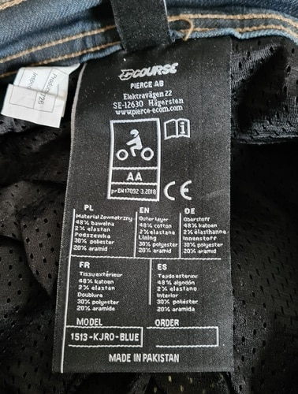
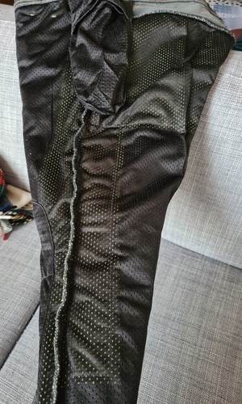
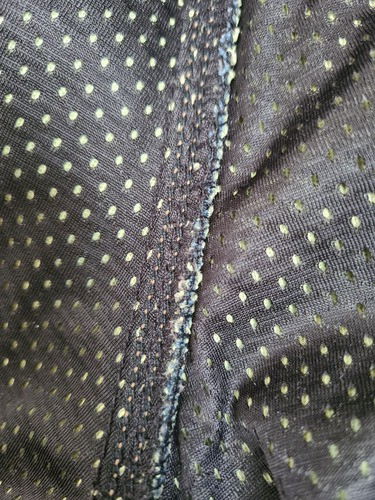
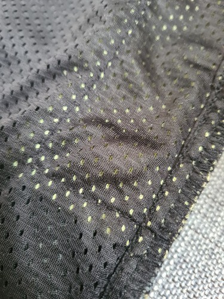
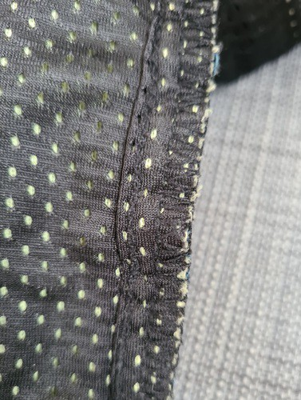
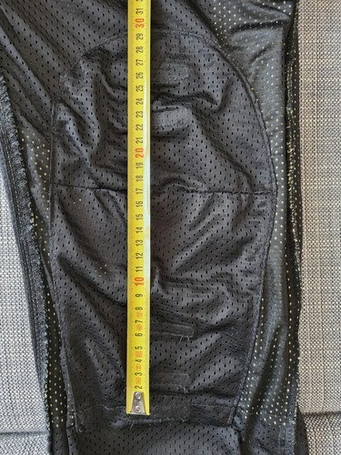
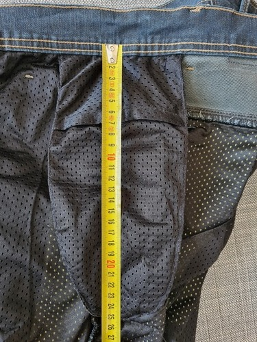

Cette fiche décrit mon essai des jeans renforcés en Aramide/Kevlar _Course Rocker_ vendus par le site _XLMoto_ à des tarifs assez bas (60 à 80€).

<!--more-->

> _NB :_ En jeans "normaux", je porte essentiellement des _Grim Tim_ de _Nudie Jeans_ et des _Levi's 511_ en taille 36, longueur 32.

> _NB2 :_ J'ai eu le _DXR Howell City CE_ de _Motoblouz_ (environ 90€) qui présente moyennement bien et dont la protection n'est pas énorme : Niveau urbain selon l'ancienne norme EN 13595. Dans la norme actuelle EN 17092 cela doit correspondre au niveau A, qui est le plus bas (Pour ceux que ça intéresse, j'avais fait un peu de couture à l'époque pour pouvoir y intégrer les protections de genoux très couvrantes SC-1/06EVO de Sas-Tec [description et photos ici]())

La grille du site indique que les pantalons taillent petit, mais c'est plutôt le contraire :  
J'ai essayé un 36 (photos) et un 38, le 38 était beaucoup trop grand, le 36 est ample.

_(Note : J'ai essayé plus tard un 34 et c'est la bonne taille pour moi, donc une taille en dessous de ma taille habituelle)_

**Infos générales :**

- **Protection niveau AA** (bien) ;
- Fabriqué au Pakistan (bof) ;
- La toile du jean est très épaisse, elle inspire confiance ;
- Il est fourni avec des coques de genou de niveau 1 imposantes et des coques de hanche niveau 2, imposantes aussi ;
- Le positionnement des coques de genoux se fait par des velcros nombreux et régulièrement espacés ;
- La couverture aramide est conforme aux photos sur le site (siège + genoux + une bande de 10 cm de large le long de chaque jambe ;
- Il est très passe-partout, on devine à peine les coques malgré leur épaisseur  (voir photos plus bas) ;
- Il taille un peu large, mais pas au point que cela soit choquant. _Note : j'ai depuis testé le 34 et c'est la taille qu'il me fallait._

Dimensions des poches pour protections :

- Genoux : 29 cm (couture haute jusqu'au velcro le plus bas) x 18 cm (bord à bord) ;
- Hanches : 25 cm x 13 cm.

**Mon avis :**

J'en suis très content.

J'ai retiré les coques de hanche que je trouve trop encombrantes.
Je l'ai porté au bureau plusieurs fois en gardant les coques de genoux d'origine, sans ressentir de gêne. 
Par la suite j'ai remplacé ces coques par des [_SAS-TEC SC-1/KB2_](https://www.sas-tec.de/en/products/sc-1-kb2-new/), fines (1 cm) et beaucoup plus protectrices (niveau 2 , <18 kN).

Je porte les coques dans la position la plus haute (3e velcro en partant du bas).

J'ai désactivé les velcros de genou inutilisés, car ils avaient tendance à se refermer en journée et à bloquer les coques dans une mauvaise position : J'ai simplement découpé des morceaux de velcro côté poilu que j'ai fixé dessus.

Seul bémol : Il y a quelques coutures mal finies dans la doublure. Je croise les doigts pour que les coutures extérieures tiennent mieux. _(Note : De nombreux ports plus tard, rien à signaler)_

_(Note : J'ai depuis acheté le même jean en taille 34, il est plus conforme à ma morphologie et présente mieux, mais il tient plus chaud. L'été la taille au dessus est plus agréable)_

---
#### Photos diverses :

Etiquette :

Les zones couvertes par l'aramide :

Gros plan sur les coutures :

Fond de culotte :

Assemblage de l'aramide à l'extérieur de la jambe :

Couture de la jambe côté intérieur :

Les coques d'origine (pas sensas) :

Les poches pour les coques :

Genoux :

Hanche :

---

Avis rapide sur le _Course Caféman_ (essayé en 36 et retourné) :
------------------------------------------------

- Protection niveau A (bof) ;
- Fabriqué au Pakistan (bof) ;
- La toile est épaisse et légèrement velouteuse ;
- Il est fourni avec des coques de genou de niveau 1 ;
- Le positionnement des coques de genoux se fait par des velcros nombreux et régulièrement espacés ;
- La couverture aramide est conforme aux photos sur le site (siège + genoux + une bande de 10 cm de large le long de chaque jambe) ;
- Il taille très large, il aurait fallu que je le commande en 34.

Entre l'aspect de la toile, le niveau A et le problème de taille, je n'ai pas été convaincu.

---

### Mises à jour

- *10/05/2021 :* Ajout des photos et dimensions des poches.
- *06/02/2022 :* Réorganisation de l'article.