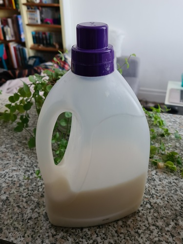

_(This post was automatically translated with [www.DeepL.com/Translator](http://www.DeepL.com/Translator))_

I've been using organic detergents for a long time (Nature&Progrès etc.) and then I found this homemade detergent recipe that ticks all the boxes:

It washes very well, produces very little waste (the powder packaging, and the bottle of vinegar is all) and its cost is negligible.

All the ingredients can be purchased in an organic version.

<!--more-->

**Ingredients for about 3L of detergent:**

- Soap : About 80 g of white Marseille soap, bought in blocks without packaging in an organic store, I make big chips with a potato peeler (it works very well and it goes fast) ; 
- Bicarbonate : 2 tablespoons ;
- Soda crystals: 2 tablespoons;
- Vinegar: 2 tablespoons;
- Sweet Orange Essential Oil: about 1 teaspoon;
- Mandarin Essential Oil: 1/2 teaspoon approximately;
- Water: 1 to 1,5L to make melt the chips, then one supplements with cold water in the cans.

**Preparation:**

I put the chips + 1 to 1.5L of water in a large saucepan over low heat.

When the chips are well melted, I add the rest of the water while stirring with a whisk (be careful with vinegar + bicarbonate, it reacts, you have to add in small doses).

Once everything is well mixed, I divide into 2 cans of 1.5L each, I complete the cans with cold water, I shake to homogenize, and I let cool.

**Note on the soap:**

Q: Why white soap (mostly various oils) and not green (mostly olive oil)? 

A: I have tested both and my impression is that green soaps are great for the skin but not so good for washing clothes. This observation is found in several reviews on the internet.

And you can buy white soap with oils that are less problematic than palm oil, you just have to look a little.
