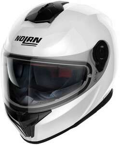

Je recherche un nouveau casque moto à moins de 400e, à la norme UE la plus récente qui est la ECE 22.06.

J'ai constitué la liste des modèles disponibles à partir des 2 sites de vente qui permettent de filtrer sur la norme "ECE 22.06" : Motoblouz, iCasque.
Le prix indiqué est celui de la déco la moins chère, hors-soldes.

Pour les curieux, au sujet des normes d'homologations des casques :

- La vidéo très documentée de Ryan F9, qui compare les différentes homologations possibles en 2021 :
[Youtube - What's Inside the Best Motorcycle Helmets of 2021?](https://www.youtube.com/watch?v=9d8MALEJCHg)
- L'article de Motoblouz sur la norme ECE 22.06 : [ECE 22.06 : La norme des casques moto évolue !](https://www.motoblouz.com/enjoytheride/actualites/19243-ece-22-06-casques-moto-2020-06-19)

---

# Les casques ECE 22.06 disponibles pour moins de 400e, début 2022

---

## Scorpion Exo 491 *(139,99 €)*

Caractéristiques :

- Poids : 1600 g
- Ecran solaire : Oui
- Pinlock fourni : Non
- Insonorisation : Acceptable d'après [Moto Station](https://moto-station.com/moto-revue/test-equipement/test-casque-scorpion-exo-520-air-abordable-et-resistant/513273)
- Aération : Bonne d'après [Moto Station](https://moto-station.com/moto-revue/test-equipement/test-casque-scorpion-exo-520-air-abordable-et-resistant/513273)
- Système d'extraction en cas d'accident : Non

Dispo sur : iCasque, ChampionHelmets

---

## NOLAN N60-6 *(169,99 €)*

Caractéristiques :

- Poids :  1450 g
- Ecran solaire : Oui
- Pinlock fourni : Non
- Insonorisation : ?
- Aération : ?
- Système d'extraction en cas d'accident : Non

Dispo sur : Motoblouz, ChampionHelmets

---

## NOLAN N80-8 *(249,99 €)*

Caractéristiques :

- Poids :  1530 g
- Ecran solaire : Oui
- Pinlock fourni : Oui
- Insonorisation : ?
- Aération : ?
- Système d'extraction en cas d'accident : Oui (Nolan Emergency Release System)

Dispo sur : Motoblouz, ChampionHelmets

Infos complémentaires :

> Les modèles N87 et N87 PLUS qu'il remplace ont été testés par [ChampionHelmets (Youtube)](https://www.youtube.com/watch?v=NLx_NERjmS0) :

> - Insonorisation : "dans la moyenne des casques intégraux" avec 102 db entre 105 et 130 km/h
> - Aération : "plutôt satisfaisante"

Dispo sur : Motoblouz, ChampionHelmets

---

## SHARK SPARTAN RS *(319 €)*

Caractéristiques :

- Poids :  1450 g
- Ecran solaire : Oui
- Pinlock fourni : Oui
- Insonorisation : Excellente dans le test [ChampionHelmets](https://www.championhelmets.com/fr/magazine/post/shark-spartan-rs-carbon-skin-review-et-essai-routier) : 99 db entre 105 et 130 km/h (aucun casque testé par leurs soins ne fait mieux)
- Aération : Excellente d'après [ChampionHelmets](https://www.championhelmets.com/fr/magazine/post/shark-spartan-rs-carbon-skin-review-et-essai-routier)
- Système d'extraction en cas d'accident : Non

Dispo sur : iCasque, Motoblouz, ChampionHelmets

