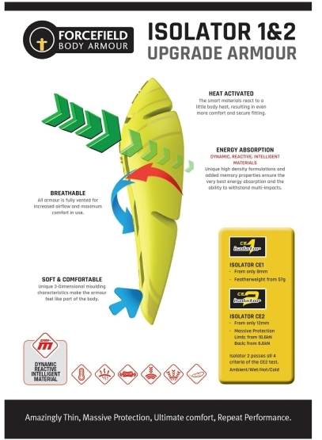
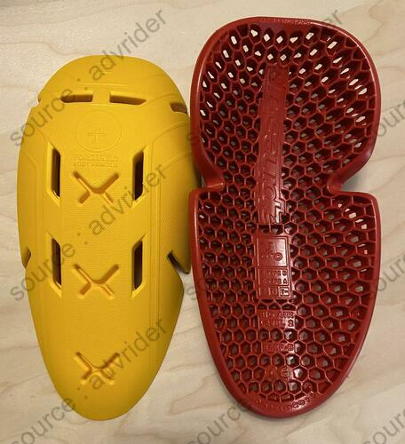
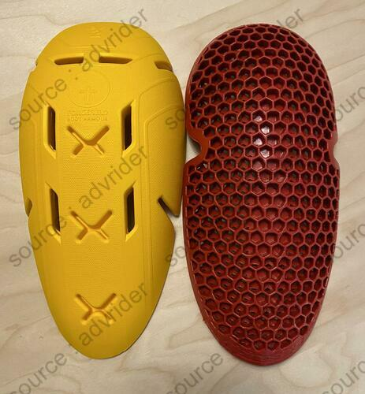
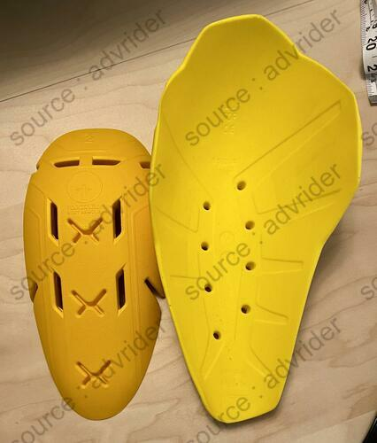
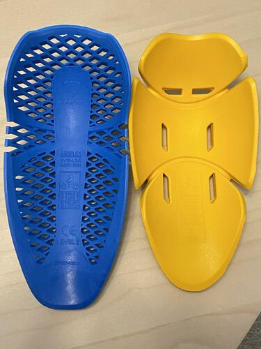
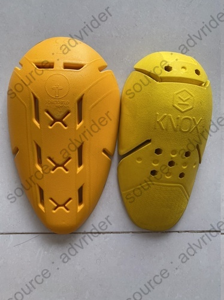
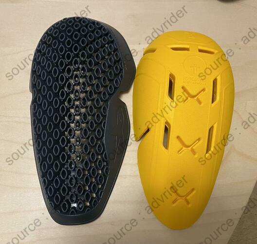

This sheet summarizes the information I've gleaned on the net about _Forcefield Isolator 2_ Level 2 protective shells.

<!--more-->

_Synthesis:_ Very good protection (25% above standard), decent ventilation, high price.

Marketing :
-------------------

4 models are available for sale (approx. 30e per pair):

- Knee B
    - Dimensions: 24 cm x 16.5 cm
    - Weight : 114 g
- Hip B
    - Dimensions: 23 cm x 11.5 cm
    - Weight: 80 g
- B elbow/B knee
    - Dimensions: 24.5 cm x 16 cm
    - Weight: 114 g
- Shoulder B
    - Dimensions: 20.5 cm x 15 cm
    - weight: 96 g

Available all over the web.

Characteristics of the shells:
-----------------------------

- Certification: Level 2 T+ T- [^1]
- Actual protection: The manufacturer claims a minimum of 10.6kN on its label (see below), but we can imagine an average at +5kN, around 15-16 kN (standard: 20 kN on average, maximum 30 kN).
- Manufacture: UK
- Life expectancy: 2 to 3 years
- Material type: Soft viscoelastic (> D3O), adjusts with body heat
- Ventilation: Good

Comfort and comparison with other brands : 
------------------------------------------------

Stiff in cold weather.

Better ventilation than Knox Microlock, but Knox wins on all other counts: Coverage, fit and flexibility in cold weather.

Better fit, flexibility and protection than D3O.

### Feedback: Cold weather

> "pads do go very stiff in cold temperatures and take a while to soften"
> — <cite>advrider cblais19</cite>

### Feedback: Comparison with Knox Micro-lock L2, SAS-Tec and D3O :
> The softest high protection (CE2) armor I've found is the Knox MicroLock. It's more pliable then Forcefield, SasTec, or D3O; and has a softer feel when joint pressure is applied. 
> — <cite>[advrider cblais19](https://advrider.com/f/threads/comfortable-knee-armor.1371777/#post-37833963)</cite>

### Feedback: Comparison with D3O :

> "Compared to D3O’s [T5 EVO Pro X armor](https://www.mcgearhub.com/motorcycle-armor/d3o-knee-elbow-armor-review-t5-evo-pro-x/) (which is also CE-certified as Level 2), the Forcefield Isolator 2 armor is signicantly more contouring, wrapping and compliant."
> — <cite>[mcgearhub.com](https://www.mcgearhub.com/motorcycle-armor/forcefield-isolator-2-armor-review-all-pads/)</cite>

> "And Brian Van also said: "Forcefield is better [than D30] for sure. D3O is a nice low profile armor that helps to reduce bulk and increase comfort. You will find the Forcefield to be thicker as compared to the D3O which I feel is necessary to provide a higher level of protection."
> — <cite>[advrider Valentino](https://advrider.com/f/threads/ce2-replacement-armor-database-comparison.1466522/page-4#post-40897652)</cite>

### Feedback: Comparison with Knox Micro-lock L2 :

> ++ for Microlock. I've tried all the molecular/soft armors and the Knox is by far the most compliant at all temps. Forcefield Isolator is also good, but has a stiffer matrix at all times. I've got a bunch of Isolator CE2 pads that I'm actually replacing with Microlock due to the comfort difference.
> — <cite>[advrider cblais19](https://advrider.com/f/threads/comfortable-knee-armor.1371777/#post-37211909)</cite>

> Knox Microlock has much larger coverage for the elbow/knee armors (wash on the shoulders) - and a compound that is softer to the touch. Forcefield has larger vent holes [...]. I also find that Forcefield takes longer to warm up in cool temps, and is extremely stiff until the - both are rated as temp stable however.
> — <cite>[advrider cblais19](https://advrider.com/f/threads/would-like-recommendations-for-cool-armored-gear.1389835/#post-37841358)</cite>

Photos :
--------

Note : La plupart des photos viennent de la conversation [advrider.com : CE2 Replacement Armor Database / Comparison](https://advrider.com/f/threads/ce2-replacement-armor-database-comparison.1466522/) ou de [mcgearhub.com : FORCEFIELD ISOLATOR 2 ARMOR REVIEW (ALL PADS)](https://www.mcgearhub.com/motorcycle-armor/forcefield-isolator-2-armor-review-all-pads/).

### Fiches constructeur :

### Photos générales :

Face, dos et notations (source : [advrider]((https://advrider.com/f/threads/ce2-replacement-armor-database-comparison.1466522/))) :

### Comparisons:

#### Alpinestar Bio Armor Air:

#### BMW NP2:

#### Rev'It Seeflex:

#### Knox Micro-lock:

#### Alpinesars Nucleon Flex Pro:

Readings :
----------

- [mcgearhub.com : FORCEFIELD ISOLATOR 2 ARMOR REVIEW (ALL PADS)](https://www.mcgearhub.com/motorcycle-armor/forcefield-isolator-2-armor-review-all-pads/)
- [advrider.com : CE2 Replacement Armor Database / Comparison](https://advrider.com/f/threads/ce2-replacement-armor-database-comparison.1466522/)

[^1]: CE EN 1621-1 standard (shoulder, hip and limb protection) : A 5 kg weight is dropped with a force of 50 joules on the part, 9 times. 
Level 1 : Average <35 kN. No shock exceeds 50 kN. 
Level 2 : Average <20 kN. No shock exceeds 30 kN. 
T+ : The protection remains the same up to 40°C. 
T-: Protection remains the same down to -10°C.