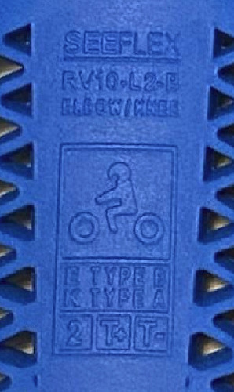
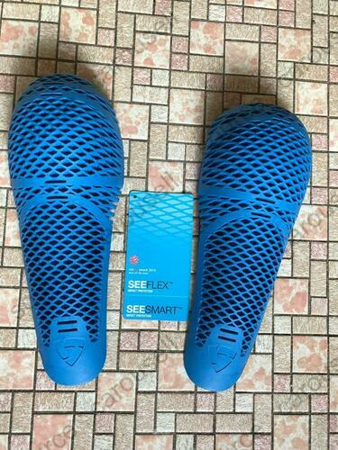

Cette fiche récapitule les informations que j'ai pu glaner sur le net sur les coques de protection _Rev'It Seeflex_ de niveau 2.

_Synthèse :_ Grande couverture, excellente aération, tarif élevé, protection tout juste à la norme.

Commercialisation :
-------------------

7 modèles sont disponibles à la vente (30 à 50€ par paire), tous sont niveau 2 :

- RV10 (Coude B/genou B)
    - Dimensions : 25,3 cm x 11,3 cm x 7,5 cm
    - Poids : ? g
- RV11 (Epaule B - grand format) :
    - Dimensions :  22,4 cm x 16,8 cm x 10 cm
    - Poids : ? g
- RV12 (Genou B/jambe B)
    - Dimensions : **34,7 cm** x 13 cm x 9 cm
    - Poids : ? g
- RV13 (Epaule B - format standard)
    - Dimensions : 19,6 cm x 12,8 cm x 5,5 cm
    - Poids : ? g
- RV14 (Genou B)
    - Dimensions : 26 cm x 12,5 cm x 6,9 cm
    - Poids : ? g
- RV15 (Coude A)
    - Dimensions : 22,8 cm x 12,5 cm x 6,9 cm
    - Poids : ? g
- RV16 (Epaule A)
    - Dimensions : 16,7 cm x 11,3 cm x 5,6 cm
    - Poids : ? g

Trouvables un peu partout sur le net.

Caractéristiques des coques :
-----------------------------

- Certification : Niveau 2 T+ T- [^1]
- Protection réelle : Le fabricant ne donne pas de chiffre. MotoCAP aurait (source : [advrider](https://advrider.com/f/threads/ce2-replacement-armor-database-comparison.1466522/)) mesuré une moyenne de 18,9 kN pour le coude (norme : 20 kN en moyenne, maximum 30 kN)
- Fabrication : ?
- Longévité annoncée : ?
- Type de matériaux : Matériaux vulcanisé rigide, ne s'ajuste pas avec la chaleur corporelle
- Aération : Très bonne

Confort et comparaison avec les autres marques : 
------------------------------------------------

Mon avis :
Leur principal intérêt est la combinaison d'une grande couverture et d'une grande aération. A part ça  la protection est un peu basse, et les avis ci-dessous les disent peu confortables.

Pour des protections moins aérées mais plus protectrices (<12 kN), encore plus couvrantes et moitié moins chères, il est intéressant de regarder du côté de SAS-TEC :

- Genoux/coudes très grand format : [Mon article sur les SAS-TEC SC1/06EVO]()
- Epaules, genoux, coudes grand format : [Mon article sur les SAS-TEC SC1/EVO1, EVO2 et EVO3]()

Et pour des protections épaule et coude tout aussi aérées, plus protectrices (< 16 kN), un peu moins couvrantes et moitié moins chères aussi, il y a les Alpinestar Bio Air : 

- Epaules et coudes : [Mon article sur les Alpinestar Bio Air]()

### Retours d'expérience : Rigidité et angles désagréables :

> Seeflex is relatively stiff so if you're used to d3O stuff (what Rukka uses), the Seeflex may feel like a brick although d3O isn't exactly the least stiffest of all armor.
> — <cite>[advrider ThrillSeeka](https://advrider.com/f/threads/armor-upgrade-for-rukka.1464303/#post-40753844)

### Retours d'expérience : 

> Rev'it's choice of thin square edges for the molds can cause discomfort if pressed against tissue for prolonged periods - frequently cited in Revzilla reviews for the knee in particular
> — <cite>[advrider cblais19](https://advrider.com/f/threads/ce2-replacement-armor-database-comparison.1466522/page-4#post-40913774)</cite>

### Retours d'expérience : Comparaison avec les Alpinestars Nucleon Air et les Forcefield Isolator 2 :

> Material is a hard rubbery compound similar to A* Nucleon Air, but has a slight bit more give to it when pressed hard. The shape is slightly larger then the coverage offered by the Forcefield protector, but that's mainly due to a longer and very thin end piece. 
> — <cite>[advrider cblais19](https://advrider.com/f/threads/ce2-replacement-armor-database-comparison.1466522/page-4#post-40913774)</cite>
> 
### Retours d'expérience : Forme particulière des protections d'épaules :

> Shoulder protectors from this line are among the most asymmetrical out there with wide scapula coverage, and are unlikely to fit most standard pockets.
> — <cite>[advrider cblais19](https://advrider.com/f/threads/ce2-replacement-armor-database-comparison.1466522/page-4#post-40913774)</cite>
> 
### Retours d'expérience : Compatibilité avec les vêtements Dainese :

> An inmate reports that the elbow protectors are a perfect replacement for the Dainese hardshell/foam CE1 protectors.
> — <cite>[advrider cblais19](https://advrider.com/f/threads/ce2-replacement-armor-database-comparison.1466522/page-4#post-40913774)</cite>

Photos :
--------

Note : La plupart des photos viennent de la conversation [advrider.com : CE2 Replacement Armor Database / Comparison](https://advrider.com/f/threads/ce2-replacement-armor-database-comparison.1466522/).

### Fiches constructeur :

### Photos générales :

Marquage des coude/genou (RV10) (source : advrider) :

Genou/jambe (RV12) :

Epaules B (RV13) et coudes/genou B (RV10) :

### Comparaisons :

#### Forcefield Isolator 2 :

#### Alpinestars Bio Air & Alpinestars Nucleon Flex Pro & D3O :

Lectures :
----------

- [RWN sur Youtube - Revit Seeflex Protektoren](https://www.youtube.com/watch?v=mAOMe18tnsU)
- [advrider.com : CE2 Replacement Armor Database / Comparison](https://advrider.com/f/threads/ce2-replacement-armor-database-comparison.1466522/)

[^1]: Norme CE EN 1621-1 (protections épaules, hanches, membres) : Un poids de 5 kg est lâché avec une force de 50 joules sur la pièce, 9 fois. 
Niveau 1 : Moyenne <35 kN. Aucun choc ne dépasse 50 kN. 
Niveau 2 : Moyenne <20 kN. Aucun choc ne dépasse 30 kN. 
T+ : La protection reste la même jusqu'à 40°C. 
T- : La protection reste la même jusqu'à -10°C.
