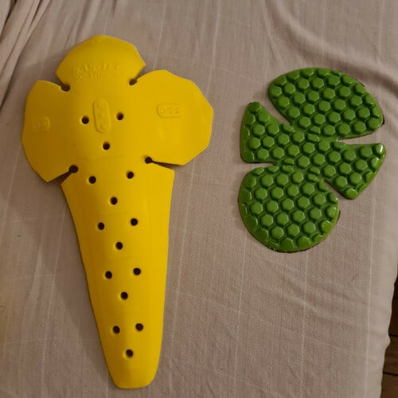
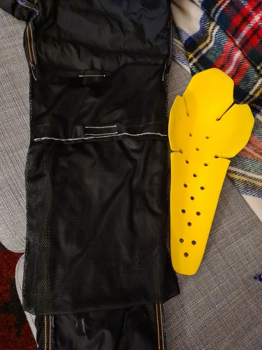
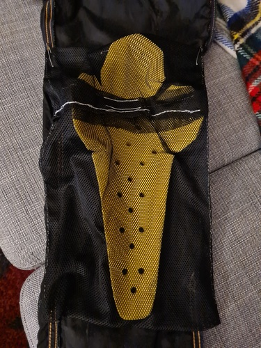

_(This post was automatically translated with [www.DeepL.com/Translator](http://www.DeepL.com/Translator))_

This article describes the _SAS-TEC SC1/06EVO_ level 2 protectors, which are probably the most covering and protective on the market.

At the end of the article I show how I integrated them to a generic motorcycle jeans as knee protections, and to my winter jacket as elbow protections.

The photos in the article are mine.

<!--more-->

_Synthesis:_ Excellent protection (40% above standard) and huge joint coverage (see dimensions and photos below), low weight, decent ventilation, and reasonable price.

Marketing:
-------------------

1 model, sold around 18€ :

- SC-1/06EVO (Elbow B/Knee B)
    - Dimensions : **41,5 cm** x 26 cm** x 1,6 cm
    - Weight : 145 g

Available on [fc-moto.de](https://www.fc-moto.de/fr/SAS-Tec-SC-1/06evo-Protecteurs-DEllbow/Knee).

Characteristics of the shells :
-----------------------------

- Certification: Level 2 (not certified T+/T-) [^1]
- Actual protection: The manufacturer announces a majority < 12 kN (standard: 20 kN on average, maximum 30 kN) + a resistance to heating of its materials up to 100°C.
- Manufacture: Hungary, Latvia and Indonesia ([source](https://www.sas-tec.de/en/2013/02/01/tourenfahrer-2-2013/))
- Lifespan announced: 10 years
- Type of material : Visco-elastic, adjusts with the body heat
- Ventilation : Good

Manufacturer's data sheet :

- SAS-TEC SC-1/06EVO](https://www.sas-tec.de/en/products/sc-1-06evo-new/)

Source for longevity and temperature:

- [SAS-TEC about-us material](https://www.sas-tec.de/en/about-us/material/)

My experience with comfort, alternatives and integration into motorcycle clothing:
------------------------------------------------------------------------------------------

The material is comfortable and soft, adjusts quickly to body temperature, and does not get hot.
My experience is that the flexibility, texture and fit are superior to the D3O.

These pads completely envelop the joints and yet they cause very little discomfort, which is quite impressive.

**Alternatives:**

My research did not find many comparable protections: 

- There are those from BMW: Quite a few pictures in the excellent article [Protecting your bones and joints](https://afmb.fr/proteger-ses-os-et-ses-articulations/) from the AFMB association -> !!! WARNING - the article has photos of injuries!!!;
- Rukka makes an impressive knee brace in D3O ([My recap on Rukka D3O Air XTR protections]()) but it is much more expensive and the D3O is less comfortable ;
- Rev'It makes a SeeFlex RV12 of 34,7 x 13 cm ([My review on Rev'It SeeFlex protections]()): 6 cm shorter and a priori less covering laterally. Reviews also say it is not very comfortable (hard and sharp edges);
- Held sells a green Quatrotempi model, which seems to be a white label of the old SAS-TEC SC1/06 model.

**My jeans/blouson integrations:**

**Genoux :**

At the time I bought these shells, I was looking for a slightly reassuring pair of jeans for my occasional trips on the fast lane.

So I took a _DXR Howell City CE_ from Motoblouz [^2], whose general cut suited me, I looked for the most covering shells available, and I sewed new pockets.

Comparison with the original shells of the jeans (_ESquad Hilon_ level 1) :

Mesh pocket creation ([50g polyester](https://www.extremtextil.de/en/netting-polyester-elastic-50g-sqm.html) + [strips](https://www.extremtextil.de/en/hooktape-for-sewing-016mm.html) [velcro](https://www.extremtextil.de/en/looptape-for-sewing-016mm.html) bought for a few euros at _extremtextil.de_) :

(The pockets seem very loose, but as the protections are enveloping they are naturally positioned in place)

After wearing them several times, including 2 days in a row, I can say that the shells are noticeable but their presence is still bearable.

The only discomfort I felt was when putting on my boots: The protection goes down so low that it prevents you from lifting the bottom of your pants to close the boots.

**Elbows :**

In addition to the pants, I integrated these shells as elbow protection in a jacket: In width they fit in the pocket without forcing, I reduced the length a little so that they stop a few cm before my wrist.

Cutting :

**Edited on 06/15/2021:** Added pictures of the SC-1/06EVO shells compared to the SC-1/EVO1 and SC-1/EVO2.

Comparison of SC-1/EVO1 (shoulder B, elbow/knee A) and SC-1/06EVO (shoulder/knee B) :

Comparison of SC-1/EVO1 (shoulder B, elbow/knee A), SC-1/EVO2 (elbow B, shoulder/knee A) and SC-1/06EVO (shoulder/knee B) :

Lectures :
----------

- [Motorcycle Gear Hub - SAS-TEC Armor Review: SC-1/06 Motorcycle Protectors](https://www.mcgearhub.com/motorcycle-armor/sas-tec-armor-review-sc-1-06-protectors/)

[^1]: CE EN 1621-1 standard (shoulder, hip and limb protection) : A 5 kg weight is dropped with a force of 50 joules on the part, 9 times. 
Level 1 : Average <35 kN. No shock exceeds 50 kN. 
Level 2 : Average <20 kN. No shock exceeds 30 kN. 
T+ : The protection remains the same up to 40°C. 
T-: Protection remains the same down to -10°C.

[^2]: The protection "urban level" of this jean is low, since I tested a jean at xlmoto that suits me too and is AA approved: [My feedback on the Course Rocker]().
