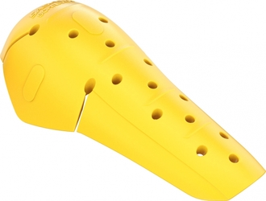

Cette fiche récapitule les informations que j'ai pu glaner sur le net sur les coques de protection _SAS-TEC SC1/EVO_ 1, 2 et 3 de niveau 2.

<!--more-->

_Synthèse :_ Protection excellente (50% au dessus de la norme), grande couverture des articulations, poids faible, aération correcte, et tarif raisonnable.

Commercialisation :
-------------------

3 modèles sont disponibles à la vente (14-18€ par paire) :

- SC-1/EVO1 (Epaule B/Coude A/Genou A)
    - Dimensions : 23 cm x 21,5 cm x 1,6 cm
    - Poids : 95 g
- SC-1/EVO2 (Epaule A/Coude B/Genou A)
    - Dimensions : 27,5 cm x 19,5 cm x 1,6 cm
    - Poids : 95 g
- SC-1/EVO3 (Coude B/Genou B)
    - Dimensions : 33 cm x 23 cm x 1,6 cm
    - Poids : 112 g

Un peu difficiles à trouver, elles sont en vente sur [ebay](https://www.ebay.fr/sch/i.html?_from=R40&_nkw=sas+tec+evo&_sacat=0&LH_PrefLoc=3&_sop=15), chez [motoinn.de](https://www.motoin.de/search.php?keywords=evo&manuid%5B%5D=79).

---

Edit du 15/05/2021 : Dispos chez le revendeur français_Anaïs Discount_ : [16e les EVO1](https://www.anais-discount.com/protection-sastec-sc1-evo-xml-1158_1182-62281.html), [16e les EVO2](https://www.anais-discount.com/protection-sastec-sc1-evo-xml-1158_1182-62274.html) et [17e les EVO3](https://www.anais-discount.com/protection-sastec-sc1-evo-xml-1158_1182-62273.html).

---

Caractéristiques des coques :
-----------------------------

- Certification : Niveau 2 (non certifiées T+/T-) [^1]
- Protection réelle : Le fabricant annonce une majorité < 10 kN (norme : 20 kN en moyenne, maximum 30 kN) + une résistance à l'échauffement de son matériaux allant jusqu'à 100°C.
- Fabrication : Hongrie, Lettonie et Indonésie ([source](https://www.sas-tec.de/en/2013/02/01/tourenfahrer-2-2013/))
- Longévité annoncée : 10 ans
- Type de matériaux : Visco-élastique souple, s'ajuste avec la chaleur corporelle
- Aération : Bonne

Fiches constructeur :

- [SAS-TEC SC-1/EVO1](https://www.sas-tec.de/en/products/sc-1-evo1/)
- [SAS-TEC SC-1/EVO2](https://www.sas-tec.de/en/products/sc-1-evo2/)
- [SAS-TEC SC-1/EVO3](https://www.sas-tec.de/en/products/sc-1-evo3/)

Source pour la longévité et la température :

- [SAS-TEC about-us material](https://www.sas-tec.de/en/about-us/material/)

Confort et comparaison avec les autres marques : 
------------------------------------------------

Mon expérience personnelle avec différentes coques SAS-TEC (SC1/06 EVO, SC2/07) indique que leur visco-élastique est très souple, s'ajuste rapidement à la température corporelle, et ne tient pas chaud.

La souplesse, la texture et l'ajustement sont supérieurs au D3O selon moi.

[cblais19 sur advrider](https://advrider.com/f/threads/comfortable-knee-armor.1371777/#post-37833963) indique qu'il trouve les Knox Micro-lock plus confortables.

[SAS-TEC](https://www.sas-tec.de/en/about-us/material/) indique que la plupart des coques concurrentes ne supportent pas plus de 60°C tandis que les siennes tiennent jusqu'à 100°C.

[Motorcycle Gear Hub](https://www.mcgearhub.com/motorcycle-armor/sas-tec-level-2-armor-review-sc-1-evo-protectors-knees-elbows-shoulders/) indique qu'elles semblent aussi bien supporter le froid et le chaud que les protections Forcefield.

### Retours d'expérience : Comparaison avec les Knox Micro-lock L2 :

> The softest high protection (CE2) armor I've found is the Knox MicroLock. It's more pliable then Forcefield, SasTec, or D3O; and has a softer feel when joint pressure is applied. 
> — <cite>[advrider cblais19](https://advrider.com/f/threads/comfortable-knee-armor.1371777/#post-37833963)</cite>

Photos :
--------

SC1/EVO1, EVO 2 et EVO 3 :

**Edit du 15/06/2021 :** Ajout des photos des coques SC-1/06EVO comparées aux SC-1/EVO1 et SC-1/EVO2.

Comparaison des SC-1/EVO1 (épaule B, coude/genou A) et SC-1/06EVO (épaule/genou B) :

Comparaison des SC-1/EVO1 (épaule B, coude/genou A), SC-1/EVO2 (coude B, épaule/genou A) et SC-1/06EVO (épaule/genou B) :

Lectures :
----------

- [Motorcycle Gear Hub - sas-tec level 2 armor review](https://www.mcgearhub.com/motorcycle-armor/sas-tec-level-2-armor-review-sc-1-evo-protectors-knees-elbows-shoulders/)

[^1]: Norme CE EN 1621-1 (protections épaules, hanches, membres) : Un poids de 5 kg est lâché avec une force de 50 joules sur la pièce, 9 fois. 
Niveau 1 : Moyenne <35 kN. Aucun choc ne dépasse 50 kN. 
Niveau 2 : Moyenne <20 kN. Aucun choc ne dépasse 30 kN. 
T+ : La protection reste la même jusqu'à 40°C. 
T- : La protection reste la même jusqu'à -10°C.
