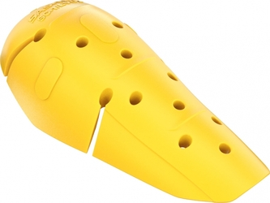

+++
title = "Protections moto SAS-TEC SC-1/EVO1, SC-1/EVO2, SC-1/EVO3"
date = "2021-04-26"
categories = ["protections moto"]
tags = ["SAS-TEC SC-1/EVO", "protection moto genoux", "protection moto coudes", "protection moto épaules"]
+++

Synthèse :
----------

3 modèles :

- SC-1/EVO1 : Epaule B + Coude A + genou A (S B/E A/K A) : 23 cm x 21,5 cm x 1,6 cm - 95 g
- SC-1/EVO2 : Epaule A + coude B + genou A (S A/E B/K A) : 27,5 cm x 19,5 cm x 1,6 cm - 95 g
- SC-1/EVO3 : Coude B + genou B (K B/E B) : 33 cm x 23 cm x 1,6 cm - 112 g

Caractéristiques :

- Certification : Niveau 2 [^1]
- Protection réelle : Le fabricant annonce une majorité < 10 kN (norme : 20 kN en moyenne, maximum 30 kN) SAS-TEC indique aussi une résistance à l'échauffement allant jusqu'à 100°C.
- Fabrication : ?
- Longévité annoncée : 10 ans
- Type de matériaux : Visco-élastique souple (>> D3O, > Forcefield), s'ajuste avec la chaleur corporelle
- Aération : Bonne
- Prix : 14-18e par paire (difficiles à trouver : dispos sur [ebay](https://www.ebay.fr/sch/i.html?_from=R40&_nkw=sas+tec+evo&_sacat=0&LH_PrefLoc=3&_sop=15) et [motoinn.de](https://www.motoin.de/search.php?keywords=evo&manuid%5B%5D=79))

Fiches constructeur :

- [SAS-TEC SC-1/EVO1 NEW](https://www.sas-tec.de/en/products/sc-1-evo1/)
- [SAS-TEC SC-1/EVO2 NEW](https://www.sas-tec.de/en/products/sc-1-evo2/)
- [SAS-TEC SC-1/EVO3 NEW](https://www.sas-tec.de/en/products/sc-1-evo3/)

Confort et comparaison avec les autres marques : 
------------------------------------------------

Avis personnel : Mon expérience avec les SC1-06 EVO (très bonnes protections genou + jambe) est que le visco-élastique SAS-TEC est très souple, s'ajuste rapidement à la température corporelle, et ne tient pas chaud.

Photos :
--------

### Photos générales :

Lectures :
----------

- [SAS-TEC SC-1/EVO1 NEW](https://www.sas-tec.de/en/products/sc-1-evo1/)
- [SAS-TEC SC-1/EVO2 NEW](https://www.sas-tec.de/en/products/sc-1-evo2/)
- [SAS-TEC SC-1/EVO3 NEW](https://www.sas-tec.de/en/products/sc-1-evo3/)

[^1]: Norme CE EN 1621-1 (protections épaules, hanches, membres) : Un poids de 5 kg est lâché avec une force de 50 joules sur la pièce, 9 fois. 
Niveau 1 : Moyenne <35 kN. Aucun choc ne dépasse 50 kN. 
Niveau 2 : Moyenne <20 kN. Aucun choc ne dépasse 30 kN. 
T+ : La protection reste la même jusqu'à 40°C. 
T- : La protection reste la même jusqu'à -10°C.
