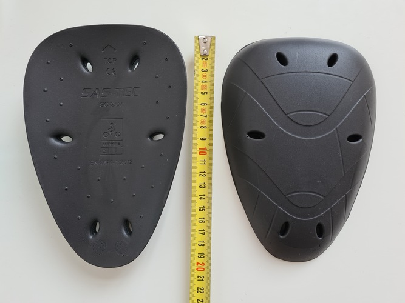

+++
title = "Protections moto de hanches SAS-TEC SC-2/07"
date = "2021-05-03"
categories = ["protections moto", "protection moto hanches"]
tags = ["SAS-TEC", "SAS-TEC SC-2/07" ]
+++

> Note préalable : Je possède ce modèle, les photos sont de moi.

Synthèse :
----------

1 modèle :

- Hanche B (H B) : 21 cm x 15 cm x 1,6 cm - 65 g

Caractéristiques :

- Certification : Niveau 2 [^1]
- Protection réelle : Le fabricant annonce une force résiduelle (sans doute moyenne) < 11 kN (norme : 20 kN en moyenne, maximum 30 kN). SAS-TEC indique aussi une résistance à l'échauffement allant jusqu'à 100°C.
- Fabrication : ?
- Longévité annoncée : 10 ans
- Type de matériaux : Visco-élastique souple, s'ajuste avec la chaleur corporelle
- Aération : Bonne
- Prix : ~16e (dispos sur [fc-moto.de](https://www.fc-moto.de/epages/fcm.sf/de_DE/?ObjectID=502396174&ViewAction=ViewProduct))

Fiche constructeur :
- [SAS-TEC SC-2/07](https://www.sas-tec.de/en/products/sc-2-07/)

Confort et comparaison avec les autres marques : 
------------------------------------------------

Avis personnel : Le matériaux est confortable et souple, similaire à celui des SAS-TEC EVO.
Les protections se déforment suffisamment pour rentrer dans des poches de pantalon plus petites qu'il n'y paraît.
Reste à assumer la surépaisseur !
En contrepartie, elles inspirent énormément confiance.

Photos :
--------

Lectures :
----------

- [SAS-TEC SC-2/07](https://www.sas-tec.de/en/products/sc-2-07/)

[^1]: Norme CE EN 1621-1 (protections épaules, hanches, membres) : Un poids de 5 kg est lâché avec une force de 50 joules sur la pièce, 9 fois. 
Niveau 1 : Moyenne <35 kN. Aucun choc ne dépasse 50 kN. 
Niveau 2 : Moyenne <20 kN. Aucun choc ne dépasse 30 kN. 
T+ : La protection reste la même jusqu'à 40°C. 
T- : La protection reste la même jusqu'à -10°C.
