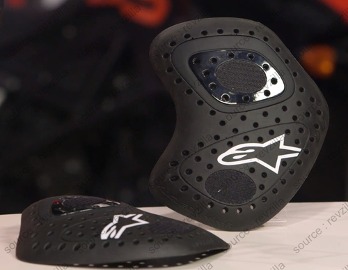

_(This post was automatically translated with [www.DeepL.com/Translator](http://www.DeepL.com/Translator))_

This sheet summarizes the information I've gleaned from the net on _Alpinestars Nucleon Racing KR-HR and Nucleon KR-H_ Level 1 and 2 hip protectors.

<!--more-->

_Synthesis:_ Great coverage, decent ventilation, high price.

Marketing:
-------------------

4 models at around 30e for level 1, 40e for level 2:

- Nucleon Racing HR-KR (level 2)
    - Hip B
        - Dimensions: 22 cm x 16 cm
        - Weight: ? g
    - Hip A
        - Dimensions: ? cm x ? cm
        - Weight: ? g
- Nucleon HR-K (level 1) 
    - Hip B
        - Dimensions: 22 cm x 16 cm
        - Weight: ? g
    - Hip A
        - Dimensions: ? cm x ? cm
        - Weight : ? g

Available all over the web.

Characteristics of the shells:
-----------------------------

- Certification: 
    - Nucleon Racing KR-HR: Level 2 (not certified T+/T-) [^1]
    - Nucleon KR-H: Level 1 (not certified T+/T-) [^1]
- Actual protection: ?
- Manufacturing: ?
- Claimed durability: ?
- Material type: Soft viscoelastic, adjusts with body heat
- Ventilation: Good

Note on pant integration (source below):

- C-shaped hip protectors of standard shape and size, they will fit into the pockets provided for (source: [Motorcycle Gear Hub](https://www.mcgearhub.com/motorcycle-armor/alpinestars-nucleon-racing-kr-hr-hip-protectors-review/));
- Protectors supplied with fabric pockets that can be integrated into pants;
- Protectors and pockets equipped with velcro (but it's better to sew the pockets to the pants);

**Idea: Use as a chest protector :**.

Motorcycle Gear Hub indicates that the size and shape allow them to be used as chest protectors, example here: [AGV Sport Willow leather jacket - mcgearhub.com](https://www.mcgearhub.com/motorcycle-jackets/agv-sport-willow-leather-jacket-review-problems-solutions-improvements/)

Comfort and comparison with other brands : 
------------------------------------------------

#### Feedback: Compatibility with existing pockets:

> The dimensions of the Large-sized pads are [...] on point with the universal dimension of the biggest hip pads around (for motorcyclists) and that are also commercialized by the likes of [Rev’It](https://www.mcgearhub.com/motorcycle-pants/revit-tornado-2-pants-review/), [D3O](https://www.mcgearhub.com/tag/d3o-armor/) and Oxford. 
> Furthermore, you will find many motorcycle jeans using Level-1 CE-rated generic hip armor that meets these same dimensions
> — <cite>[Motorcycle Gear Hub](https://www.mcgearhub.com/motorcycle-armor/alpinestars-nucleon-racing-kr-hr-hip-protectors-review/)

### Feedback: Sewing pockets into pants :

> We still recommend that you stitch the pockets (with two rows of threading) into the
inside liner of your pant or jacket for further peace of mind.
> — <cite>[Motorcycle Gear Hub](https://www.mcgearhub.com/motorcycle-armor/alpinestars-nucleon-racing-kr-hr-hip-protectors-review/)

### Feedback: Use as chest protection :

> Incidentally, the KR-HR protectors can also be used as chest armor as I’ve done with an [AGV Sport Willow leather jacket](https://www.mcgearhub.com/motorcycle-jackets/agv-sport-willow-leather-jacket-review-problems-solutions-improvements/)
> — <cite>[Motorcycle Gear Hub](https://www.mcgearhub.com/motorcycle-armor/alpinestars-nucleon-racing-kr-hr-hip-protectors-review/)

Photos :
--------

### Manufacturer data sheets :

### General photos :

HR-KR model (sources [_revzilla_](https://www.youtube.com/watch?v=MM0XZrtIrVU), [_mcgearhub_](https://www.mcgearhub.com/motorcycle-armor/alpinestars-nucleon-racing-kr-hr-hip-protectors-review/)):

Readings :
----------

- Revzilla video : [Alpinestars Nucleon KR Hip Protectors Review at RevZilla.com (2017)](https://www.youtube.com/watch?v=MM0XZrtIrVU)
- McGearHub video : [Alpinestars KR-HR Hip Protectors Armor Review (Nucleon Level 2) (2017) ](https://www.youtube.com/watch?v=0-ig7TnyuNE)
- Article : [Alpinestars Nucleon KR-HR Hip Protectors Review - Motorcycle Gear Hub](https://www.mcgearhub.com/motorcycle-armor/alpinestars-nucleon-racing-kr-hr-hip-protectors-review/)

[^1]: CE EN 1621-1 standard (shoulder, hip and limb protection) : A 5 kg weight is dropped with a force of 50 joules on the part, 9 times. 
Level 1 : Average <35 kN. No shock exceeds 50 kN. 
Level 2 : Average <20 kN. No shock exceeds 30 kN. 
T+ : The protection remains the same up to 40°C. 
T-: Protection remains the same down to -10°C.
