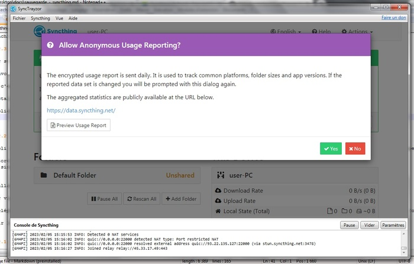
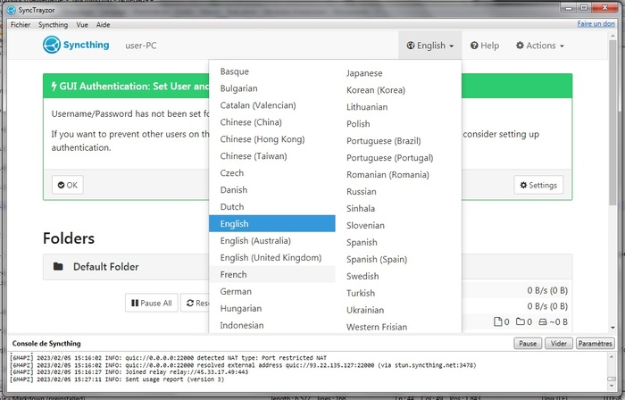
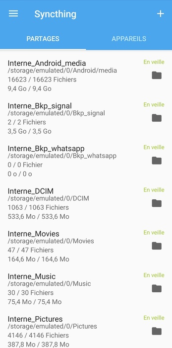

_(This post was automatically translated with [www.DeepL.com/Translator](http://www.DeepL.com/Translator))_

The tutorial below is an introduction to the use of the free software Syncthing :
We're going to sync our Android phone's photo directory with a Windows PC, so that we'll always have a recent copy in case the phone stops working, is broken, stolen, etc.

<!--more-->

> **IMPORTANT:** This is a synchronization and not a simple copy. If a file is deleted on one side it also disappears on the other.
> To archive photos elsewhere without removing them from the phone, you will have to copy them, not move them.

*What is [Syncthing](https://syncthing.net/)?*  

> It is a synchronization software, which allows to synchronize files between 2 devices, each time these 2 devices manage to see each other (for example when they are on the same wifi at home).
> 
> (It's particularly useful for phone backups because they take time, need a usb cable, files are spread in several folders... basically you never do them)
> 
> The principle is similar to that of Dropbox or Google Drive, with the difference that the files are not stored elsewhere than on your devices.
> 
> It is also an open source software, which means that its source code can be audited and consulted by everyone, this is a guarantee that it will never do anything problematic with your data. More information on [Wikipedia: Free software](https://en.wikipedia.org/wiki/Free_software).

*To go further :*  
> Syncthing can be used for many other tasks than what this tutorial proposes:
> 
> - Backup all important files from your phone to your computer (photos, etc.) every time the 2 are in proximity;
> - Keep a copy of important documents on 2 computers:
> - Souvenir photos ;
> - Pay slips;
> - Payroll; 
> - etc.

# 1. installation of Syncthing on the PC under Windows

Go to the official website of Syncthing: [https://syncthing.net/] 

1. Menu **"Download"** at the top
2. Click on **"Synctrayzor"** (this is the Windows version of Syncthing)
3. The link will send you to a page on the Github site, that of the latest version of Synctrayzor:  
   Download the file **"SyncTrayzorSetup-x64.exe"** at the bottom of the page (x86 for a very old PC).

Run the _.exe_ - Windows will ask for several permissions: Allow all.

The application will launch:

Pop-up : **Allow anonymous usage reporting?  
You can click on **"Yes"** it's safe and it helps them to debug:

Click on **"English"** and choose **"Français"** to have the interface in French:

Green box asking : **Do you want to create a login/password ?  
This is an advanced feature, you can put **"No"**.

*Optional:*  
Go to **"Action"** > **"Configuration"** and give a nicer name to the computer (default : user-PC), example : **PC_DE_JOJO"**

Everything is ready, let's go to the phone.

# 2. installation on an Android phone

The official application is available on the [Google Play Store](https://play.google.com/store/apps/details?id=com.nutomic.syncthingandroid) or on the open-source store [F-Droid](https://f-droid.org/packages/com.nutomic.syncthingandroid/).

The F-Droid store guarantees that it is free software and allows to keep a little bit of privacy from Google.  
But otherwise it's the same software that is installed (personally I use F-Droid whenever I can).

## 2.1 Installing the F-DROID store

Go via a browser on [the F-DROID website : f-droid.org/](f-droid.org/).

Choose **"download F-DROID"**, it will install the store on the phone:  
The phone will ask the authorization to install a non secured package, do **"settings"** > **"authorize"** (the authorization is only valid for this time, it will be asked again for other installations).

## 2.2 Installing the Syncthing software from F-DROID

Open the F-DROID application, search for Syncthing, click on **"Install"**, the phone will ask for authorization again.

## 2.3. Configuration

Once Syncthing is installed, launch the application:

**"Storage Permission"** :  
Click on **"give permission"** on everything.

**Geolocation permission"** :   
Advanced function, no need to activate it.

Pop-up **"Syncthing is disabled - do you want to change the operating conditions"** :  
Click on **"modify"** to enter the configuration.  

Several configurations are possible, the most common is to tell syncthing to run only when your phone is on a wifi network, to save data:

- **Run on Wifi**: yes
- **Run on mobile data (3G...)** : no 

You can also ask that the execution is only done when the phone is charging, to save battery:

- **Run only when the device is powered by:"** 
    - **Mains"** : allows the application to run only when charging;
    - **Mains and battery"** : The application launches when it wants.

_Special case :_  
If you are used to connect your computer to the internet using the _"Wifi access point"_ mode of the phone, you can use the following configuration, it works:

- **Run in Wifi** : no
- **Run on mobile data (3G...)** : yes 

*Optional:*  
Go to the top left menu **"---"** > **"Settings"** > **"Syncthing Options"** and give the phone a nicer name, e.g. **"TEL_DE_JOJO"**

Everything is ready, you just have to introduce them to each other.

# 3. Authorize the 2 devices to exchange with each other

In a Syncthing synchronization, each device must authorize the other to speak to it, so that they can then propose file sharing:

- On the PC, open **"Actions"** > **"show my ID"**: A QR Code appears;
- On the phone, go to the top right, on the "+", it opens the menu "Add a device":
    - Check **"initiator"** ;
    - Click on **"My ID"** and scan the QR Code of the PC;
    - click on **"V"** (check mark) at the top right.
- On the PC, close the QR Code window, a pop-up appears saying **"New device: XXX requests to connect"** -> check **"Add a device"**.

At this point on each side you should see the other device "connected" in the section **"Other devices"** (Windows) or **"Devices"** (Android).

# 2. Setting up automatic photo backup

> **WARNING :** 
> As mentioned above, this is a synchronization procedure and not archiving, any file deleted on one side will disappear on the other side at the next synchronization.
>
> If you want to save your photos somewhere else, in a well-organized directory, there are 2 options:
>
> If you want to make room on your phone, you just have to move them to another folder on your PC: they will disappear from the synchronized folder on your PC, and therefore also from your phone;
> If you want to keep them on the phone:** just **copy** them into another directory on the PC: they will remain available in the synchronized directory of the PC, and thus on the phone.

Syncthing for Android pre-configures the sharing of the main photo directory:  
On the phone, you should see in the tab **"Sharing"** a line pre-configured under the name **"Camera"**, it points to the directory _DCIM/Camera_ of the internal memory of the phone.

We will propose this sharing to the PC:

- Click on it to complete the configuration:
    - **"Share type"**: You have 3 choices:
        - **"Send and receive"**: Default behavior - if a file is deleted on the computer or phone it will be deleted on the other side;
        - **"Send only"** : A file deleted on the phone disappears from the PC, but a file deleted on the PC does not disappear from the phone;
        - **"Receive only"** : A file deleted on the phone does not disappear from the PC, but a file deleted from the PC disappears from the phone.  
          > Personally I always choose **"Send and receive"** because the principles are clear:  
          > It works like DROPBOX or GOOGLE DRIVE, each directory is a carbon copy of the other, so you don't have to worry about what is where.  
          > 
          > And if you need to save/archive something properly, you copy or move it somewhere else.  
    - The connected devices are listed with a little checkbox next to them:  
Check the name of the PC (**"PC_DE_JOJO"** in my example)
    - Go back with the arrow on the top left.

On the PC, a pop-up appears at the top, saying **"TEL_... invites you to the "Camera" share, add this share?"** :

- Click on **"Add"**.
- Change **"root path of the share"** to put the copy in the directory that suits you, example:  
  *ocuments\fichiers_synchronises\TEL_DE_JOJO\Camera*

Now that everything is in place, you will see the files of the phone appear progressively in the directory of the PC.

The 2 applications will not necessarily remain active permanently.  
Think of opening the 2 at regular intervals so as to force them to update themselves.

# And then? Synchronize other directories

In the phone's **"SHARES"** screen, simply click on **"+"** at the top right to indicate another phone directory to share with the outside world.

Example:

- Choose a **"Local share name"** (e.g. *"Facebook"*) ;
- Click on **"Directory"** :  
  (The first time you do this, you may need to click on the **"..."** button on the top right and then **"show internal memory"** to see the phone's memory)
    - Click on the **"---"** button at the top left:
    Normally there are 2 choices, internal memory and SD card;
    - Find the directory, accept the sharing, validate.

On the PC side, the 2nd directory will produce a pop-up like the 1st one.  
All that remains is to indicate the local directory in which to synchronize it (example: *Documents_files_synchronized_TEL_DE_JOJO\Facebook*).

> The most common photo directories :
> 
> - Phone photos saved on SD card : SD card > DCIM_
> - Whatsapp/Facebook/etc. pictures : _Internal memory > Pictures_
> - Downloaded files: _Internal memory > Download_

Example of a highly synchronized phone:

