Il existe plusieurs options pour se protéger le dos :

1. Dorsale intégrée au blouson : Souvent moins couvrantes. On en trouve cependant qui s'étendent sur les lombaires et/ou qui descendent plus bas que le blouson ;
2. Dorsale autonomes à bretelles : elles ont la possibilité de couvrir davantage qu'une dorsale intégrée, mais ce n'est pas systématiquement le cas ;
3. Gilet de protection : Combinera les avantages de la dorsale autonome avec une protection thorax en une ou deux parties, et couvre généralement aussi des zones comme les malléole.

<!--more-->

Tous ces équipements sont soumis à la même norme EN 1621-2:2014 pour la partie dorsale. Cette norme comporte 2 niveaux mais le niveau 1 n'a pas beaucoup de sens : 

- Le niveau 2 absorbe nettement plus les chocs (énergie résiduelle <9 kN vs < 18 kN) ;
- L'augmentation en épaisseur ou la baisse de confort sont négligeables ;
- Le choix en matière de dorsales niveau 2 est pléthorique.

Dans ces conditions il ne me semble pas intéressant de s'attarder sur les niveau 1, je ne le ferai donc pas.

Avant de rentrer dans les détails, quelques observations générales suite à mes différentes lectures (normalement tout est ci-dessous) :

- On a tendance à se focaliser sur la protection de la colonne vertébrale, alors que :
    - Les chocs au dos sont dévastateurs lorsqu'ils touchent les reins et les omoplates ;
    - Les blessures à la colonne sont plus souvent provoquées par une torsion du dos, au niveau du crâne ou du bassin, que par un choc direct ;
- Les très hauts niveaux d'absorption affichés par certains fabricants sont souvent concentrés au niveau de la colonne vertébrale ;
- Certaines dorsales vieillissent très mal niveau accessoires (velcros, bretelles...) mais aussi niveau protection ! Les mousses peuvent perdre leurs propriétés en vieillissant. Certains fabricants préconiseraient même d'en changer tous les 2 ans ;
- Il ne semble pas y avoir eu de grande révolution dans le domaine de la protection dorsale depuis les années 2010, les chiffres de plus grande absorption restent relativement les mêmes (autour de 5 kN même pour les meilleurs modèles) et les modèles en tête de classement n'ont pas beaucoup bougé depuis 10 ans.

J'en déduis qu'il faut apporter une attention particulière à la zone couverte par la dorsale, en plus de ses  pures capacités d'absorption.
Une dorsale très couvrante protégera aussi les reins et les omoplates, et j'imagine qu'elle pourrait aussi empêcher certaines torsion de la colonne en limitant le mouvement du haut du dos ou du bassin.

Sur l'aspect vieillissement, en occasion, outre l'état des velcros, des sangles... je pense qu'il faut faire attention à ne pas acheter de dorsales dont la date d'achat est trop ancienne :
Le changement tous les deux ans semble excessif, mais comme pour les casques, il vaut sans doute mieux éviter de dépasser les 10 ans (des fabricants comme SAS-TEC garantissent leurs mousses 10 ans par exemple, d'autres sont plutôt à 5-6 ans).
Prudence : Beaucoup de modèles sont identiques depuis 10 à 15 ans et peuvent avoir dormi dans un placard, il faut poser la question.

Un paramètre supplémentaire : il n'y a pas que des modèles différents, il y a aussi différentes tailles et formes pour les mêmes modèles.
Les Tryonic ont des formes qui varient énormément et ne couvrent pas de la même manière d'une taille à l'autre.
Les Zandona aussi.

Enfin seule la marque Zandona semble faire des modèles adaptés aux petite taille (<1m60), si vous êtes concerné(e)s cela vaut la peine d'aller les voir (en plus il y en a pas mal sur Vinted).

Et sur ce, passons aux sources.

# Lectures de référence sur la protection du dos :

* [AFMB - protéger son dos et son thorax](https://afmb.fr/proteger-son-dos-et-son-thorax/) - article de 2015 écrit par un "médecin anesthésiste réanimateur dans un service d'orthopédie-traumatologie et de pathologie rachidienne" ;
* [moto-securite.fr - Pourquoi se protéger le dos](https://moto-securite.fr/protection-dos/) - article de 2015 écrit par le Dr Lucien Castagnera, unité de Pathologie Rachidienne, CHU de Bordeaux.  
SI on veut éviter la dorsale autonome, il y propose une solution simple : coudre (ou faire coudre) une poche adaptée dans son blouson, pour y intégrer une dorsale plus couvrante comme l'ancien modèle BMW (la nouvelle est en photo plus bas) ;
* [moto-securite.fr - les protections dorsales](https://moto-securite.fr/protection-dorsale/) - article de 2007, mis à jour en 2020, écrit par le moniteur d'auto-école Fabien Lecoutre (dit Flatfab.)

# Différentes sources disponibles sur le net

## Le comparatif de FortNine sur Youtube en 2017

Lien : [FortNine sur Youtube - Best Motorcycle Body Armour of 2017](https://m.youtube.com/watch?v=hA3ww6Sr5-M)

En résumé :

* Dorsales intégrées :
    * Forcefield Pro Lite K : 
        * Conseillée pour la protection (5 kN + couverture)
        * Lourde (420 g) et épaisse (22 mm)
    * D3O VIPER 2 : 
        * Conseillée pour la souplesse
        * Couverture plus faible
        * Protection proche du maximum autorisé de 9 kN
        * Ne supporte pas bien le froid
    * Alpinestars Nucleon KR :
        * 2i : 7 kN, la plus légère (280 g), la plus aérée, mais couverture très faible ;
        * 1i : la même avec une coque rigide au milieu. il trouve qu'elle devient trop rigide pour un seul kN de protection en plus ;
    * Sas-Tec SC-1/15 : 
        * Il la déconseille pour sa rigidité et son aération.
        * Elle est pourtant proche de 5 kN et a une bonne couverture
* Dorsales autonomes :
    * Forcefield Pro L2K EVO : 
        * Protection : 4,8 kN, comme une Pro Lite K mais étendue sur le cou, les lombaires et le coccyx. 
    * Forcefield Pro Sub 4 : 3,4 kN et plus légère mais 2x plus épaisse et plus chère.
    * Forcefield EX-K Harness Flite Plus : Similaire à la Forcefield Pro L2K EVO avec les épaules en plus, mais même prix et protection légèrement en dessous.

A noter : Pour lui les autonomes sont toutes plus rigides que les intégrées.

Deux commentaires intéressants :

> i can also confirm the sastec is damn hot! and that forcefield l2k is really comfy for even an all day ride!

> love my forcefield pro l2k. don't even notice it once it's on and the kidney belt is fantastic for your lower back on long rides. 

## Le comparatif de Motoplus.ca en 2011

Lien : [motoplus.ca - comparatif de 7 modèles à bretelles](http://motoplus.ca/archives/evaluation/Comparo_dorsales/comparo-dorsales-2011.html)

Classement :

1. Forcefield Pro Sub 4 : 3,9 kN
2. Forcefield Pro L2 : 5,6 kN
3. Tryonic Feel 3.7 : 5,7 kN
4. Dainese N-Frame : 6,5 kN
5. Knox Aegis : 6,8 kN
6. Alpinestars Bionic Race Shield : 7,4 kN
7. Knox Contour : 7,7 kN

## Un excellent tableau qui synthétise un grand nombre de tests indépendants de dorsales autonomes par "GamerFou" - le dernier comparatif pris en compte est de 2013

Lien : [Tableau Google Docs](https://docs.google.com/spreadsheets/u/0/d/17R5OAsWSEWQPGwpGcoef1tc4ZnYez66lT_8gl1OQIwQ/htmlview?hl=en_US#gid=0)

(Note : j'ai trouvé ce lien dans le thread 
["[TOPIKUNIK] Débuter la moto - 40 000 pages, toujours Moant" sur hardware.fr](https://forum.hardware.fr/hfr/Discussions/Auto-Moto/topikunik-debuter-pages-sujet_12072_1.htm), il contient pas mal d'avis généraux, mais les dernières MAJ intéressantes datent des années 201x)

Les modèles analysés, et la force transmise moyenne de tous les tests indépendants + affirmations du fabricant :

- Alpinestars Bionic : 
    - Fabricant : 11,7 kN
- Axo Batty : 
    - Fabricant : 7 kN
    - Tests indépendants : 7 kN
- Axo Massive : 
    - Fabricant : 7,9 kN
    - Tests indépendants : 8,84 kN
- Axo Race Shell Protector : 
    - Fabricant : 17,4 kN
- BMW Ruckenprotektor (Protection Dorsale) 2 : 
    - Fabricant : 6,8 kN
- Clover Back-pro 5 : 
    - Tests indépendants : 5,5 kN
- Dainese N-Frame : 
    - Fabricant : 6,81 kN
    - Tests indépendants : 6,5 kN
- Dainese Wave : 
    - Fabricant : 14,08 kN
- Dainese Wave Air : 
    - Fabricant : 7,52 kN
- Dainese Manis : 
    - Fabricant : 8,09 kN
- Forcefield Pro L2 : 
    - Fabricant : 7,17 kN (note : ici contradiction avec FortNine qui parle de 4.8 kN, et Motoplus qui parle de 5,6 kN)
- Forcefield Pro Sub4 : 
    - Fabricant : 4,26 kN (note : ici contradiction avec FortNine qui parle de 3.4 kN, et Motoplus qui parle de 3,9 kN)
    - Tests indépendants : 3,38 kN
- Hein Gericke hiprotec backpack  : 
    - Fabricant : 11,95 kN
- Hein Gericke protector vest : 
    - Fabricant : 10,4 kN
- Knox Aegis : 
    - Fabricant : 10,39 kN
- Knox Contour : 
    - Fabricant : 10,9 kN
- Knox Meta-Sys : 
    - Fabricant : 5,61 kN
    - Tests indépendants : 3 kN
- Komperdell cross : 
    - Fabricant : 4,97 kN
    - Tests indépendants : 5,13 kN
- Komperdell airshock : 
    - Fabricant : 8,4 kN
    - Tests indépendants : 8,4 kN
- Komperdell aircross+ : 
    - Fabricant : 6,35 kN
    - Tests indépendants : 6,35 kN
- Prexport H+ : 
    - Fabricant : 6,5 kN
    - Tests indépendants : 6,5 kN
- Racer Viper d3o : 
    - Fabricant : 6,06 kN
- Soul Race Bender : 
    - Fabricant : 6,54 kN
    - Tests indépendants : 5,5 kN
- Spidi Back Warrior Evo : 
    - Fabricant : 8,1 kN
- Tryonic feel 3.7 (Rev'It) : 
    - Fabricant : 5,57 kN
- Tryonic See+ (Rev'It) : 
    - Fabricant : 7,70 kN
    - Tests indépendants : 7,7 kN
- Tryonic Seesoft (Rev'It) : 
    - Fabricant : 5,60 kN
    - Tests indépendants : 5,6 kN
- Vidal Sport Evolution : 
    - Fabricant : 8,04 kN
- Wedze SBS (Decathlon) : 
    - Fabricant : 14,7 kN
- Zandona shark : 
    - Fabricant : 6,6 kN
    - Tests indépendants : 6,5 kN
- Zandona shield : 
    - Tests indépendants : 33,7 kN
- Zandona spine : 
    - Fabricant : 6,8 kN
    - Tests indépendants : 6,8 kN
- Zandona Esatech : 
    - Fabricant : 5,54 kN
    - Tests indépendants : 4,6 kN

Il y a quelques surprises sur les tests indépendants, la plupart sont dans des fourchettes proches de ce qu'annonce le fabricant, certains modèles se révèlent beaucoup moins bons (Zandona Shield)... tandis d'autres se révèlent bien meilleurs (Forcefield Pro Sub4, Zandona Esatech notamment).

# Quelques photos de dorsales avec une protection < 8 kN

## Intégrables intéressantes :

La dorsale BMW standard :

## Dorsales à bretelles :

**BMW Ruckenprotektor 2 (6,8 kN) :** Semble bien couvrir omoplates, reins et coccyx.

(source image : [Kradblatt.de - BMW Rückenprotektor 2](https://kradblatt.de/bmw-rueckenprotektor-2/))

**Clover Back-pro 5 (5,5 kN) :** Semble bien couvrir omoplates et coccyx, moins les reins.

(source image : [Amotomio - Clover Back-Pro 5 – Test](https://www.amotomio.it/le-nostre-prove/1763-clover-back-pro-5-test-amotomioit.html))

**Dainese N-Frame (6,81 kN/6,5 kN) :** Semble bien couvrir omoplates, reins et un peu le coccyx.

**Dainese Wave Air (7,52 kN) :** Très faible couverture au delà de la colonne vertébrale.

**Forcefield Pro LK2 Evo (7,17 kN) :** Semble bien couvrir omoplates, reins et coccyx.

 
**Forcefield Pro Sub4K (4,26 kN) :** Semble bien couvrir omoplates, reins et coccyx.

(source image : [Espaldera de moto Forcefield PRO SUB 4K Back protector](https://www.corver.es/productos/espaldera-de-moto-forcefield-pro-sub-4k-back-protector))

**Komperdell cross (4,97 kN/5,13 kN):** Semble bien couvrir les omoplates et le coccyx, moins les reins.
Dorsale difficile à trouver sous sa marque d'origine, Komperdell semble surtout valoriser ses gilets d'équitation et ne plus vendre de matériel moto.
En revanche, on trouve facilement les modèles distribués en marque blanche par beaucoup de marques : Vanucci vest chez Louis Moto, Held Recia/Salvo, IXS Carapax...

- Version Vanucci :

- Held Recia (version masculine : Salvo) :

(source des images : [Caradisiac - Une dorsale spéciale fille : la Held Recia](https://www.caradisiac.com/une-dorsale-speciale-fille-la-held-recia-133097.htm) [NdA : ce titre......])

- IXS Carapax :

(source images : [Acidmoto - Dorsale iXS Carapax, le gilet de protection de niveau 2](https://acidmoto.ch/cms/content/news/2012/05/08/dorsale-ixs-carapax-gilet-protection-niveau-2))

**Racer Viper d3o (6,06 kN) :** Semble très couvrante, sauf peut-être au coccyx.

**Spidi back warrior evo (8,1 kN) :** 
Couvre les omoplates et le coccyx, mas pas trop les reins.

(source image : [Bikereview.com.au - Gear Review: Spidi Back Warrior EVO Back Protector](https://bikereview.com.au/gear-review-spidi-back-warrior-evo-back-protector/))

**Tryonic feel 3.7 (5,57 kN) :**
Aussi vendue sous le nom Vanucci Back 1.1.
Suivant la taille la forme change énormément et ce qu'elle couvre aussi, globalement les omoplates semblent découverts en haut, et les reins semblent peu protégés.

- Taille L :

(source image : [Revzilla Youtube - Tryonic Feel 3.7 Back Protector Review at RevZilla.com](https://www.youtube.com/watch?app=desktop&v=rQjQtEQyB9g))

- Taille S :

(source image : [Motoblouz - Essai dorsale Tryonic Feel 3.7](https://www.motoblouz.com/enjoytheride/accessoires-motard/9886-essai-dorsale-tryonic-feel-3-7-2017-01-16))

- Modèle Vanucci :

**Zandona shark (6,6 kN/6,5 kN) :**
Cas particulier :
Zandona produit ses modèles en beaucoup de tailles (X6, X7, X8, X9...) et la largeur semble rester identique avec la taille, du coup les petits modèles semblent plus couvrants pour les omoplates et les reins, tandis que les grands modèles paraissent étroits.

Il y des tailles pour adulte à partir d'1m57 ainsi que des modèles enfant.

- Probablement une taille > X7 (1m68-1m77) :

(source image : [Amotomio.it - Zandonà Shark Armour GT - test](https://www.amotomio.it/le-nostre-prove/2693-2017-zandona-shark-armour-gt.html))

- En taille X6 (1m58-1m67) elle paraît beaucoup plus couvrante en largeur :

**Zandona spine (6,8 kN) :**
(Mêmes remarques que pour la Zandona Shark)

(source image : [XLMoto - Zandonà Spine EVC x8 Back Protector Black (178-187 cm)](https://www.xlmoto.eu/product/zandona-spine-evc-x8-back-protector-black-178-187-cm_pid-PM-3904732))

**Zandona Esatech (5,54 kN/4,6 kN):**
Semble mieux couvrir les omoplates que ses consoeurs chez Zandona, mais les reins sont un peu laissés de côté.

(source image : [aMotoMio.it - ESATECH BACK PRO - Test](https://www.amotomio.it/le-nostre-prove/2175-esatech-back-pro-test-amotomio-it.html))

---

# Quelques prix en ligne :

## Modèles à 39,00 € :

 | Modèle | Photos |
|---|---|
|                                                                                           **IXON - WARDEN COMP**                                                                                                                                                                                                                                                                                   **Lieu de fabrication :**                                                                                             Inconnu                                                                                                                                                                                        **Prix en ligne au moment de la rédaction :**                                                                                            - [39,00 € (motoblouz)](https://www.motoblouz.com/recherche.html?q=IXON+WARDEN+20COMP)                                                                                            - [61,24 € (dafymoto)](https://www.dafy-moto.com/recherche?string=IXON%20WARDEN%2020COMP)                                                                                            - [71,00 € (fcmoto)](https://www.fc-moto.de/epages/fcm.sf/fr_FR/?ViewAction=FacetedSearchProducts&SearchString=IXON+WARDEN+20COMP)                                                                                            - [Rechercher (motardinn)](https://www.tradeinn.com/motardinn/fr?products_search%5Bquery%5D=IXON+WARDEN+COMP)                                                                                                                                                                                        **Aide à la recherche :**                                                                                            *Rechercher en occasion (~10-30 €)*                                                                                            [ Leboncoin](https://www.leboncoin.fr/recherche?text=moto+IXON+WARDEN+COMP&shippable=1&sort=price&order=asc) [ Vinted](https://www.vinted.fr/catalog?search_text=moto+IXON+WARDEN+COMP&order=price_low_to_high) *Recherches diverses :*                                                                                            [ Google](https://www.google.com/search?q=moto+IXON+WARDEN+COMP) [ Youtube](https://www.youtube.com/results?search_query=moto+IXON+WARDEN+COMP)                                                                                            |                                                                                           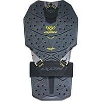                                                                                           |                                                                                           

## Modèles à 44,95 € :

 | Modèle | Photos |
|---|---|
|                                                                                           **ACERBIS - BLAZAR**                                                                                                                                                                                                                                                                                                                                                                               **Lieu de fabrication :**                                                                                             Inconnu                                                                                              **Prix en ligne au moment de la rédaction :**                                                                                            - [44,95 € (fcmoto)](https://www.fc-moto.de/epages/fcm.sf/fr_FR/?ViewAction=FacetedSearchProducts&SearchString=ACERBIS+BLAZAR)                                                                                            - [49,96 € (dafymoto)](https://www.dafy-moto.com/recherche?string=ACERBIS%20BLAZAR)                                                                                            - [Rechercher (motoblouz)](https://www.motoblouz.com/recherche.html?q=ACERBIS+BLAZAR)                                                                                            - [Rechercher (motardinn)](https://www.tradeinn.com/motardinn/fr?products_search%5Bquery%5D=ACERBIS+BLAZAR)                                                                                                                                                                                        **Aide à la recherche :**                                                                                            *Rechercher en occasion (~10-30 €)*                                                                                            [ Leboncoin](https://www.leboncoin.fr/recherche?text=moto+ACERBIS+BLAZAR&shippable=1&sort=price&order=asc) [ Vinted](https://www.vinted.fr/catalog?search_text=moto+ACERBIS+BLAZAR&order=price_low_to_high) *Recherches diverses :*                                                                                            [ Google](https://www.google.com/search?q=moto+ACERBIS+BLAZAR) [ Youtube](https://www.youtube.com/results?search_query=moto+ACERBIS+BLAZAR)                                                                                            |                                                                                           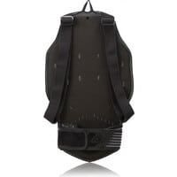                                                                                                                                                                                      |                                                                                           

## Modèles à 49,90 € :

 | Modèle | Photos |
|---|---|
|                                                                                           **ZANDONA - ESATECH PRO KID**                                                                                                                                                                                       ") Modèle enfant                                                                                                                                                                                        **Lieu de fabrication :**                                                                                            Europe :                                                                                                                                                                                        ") Italie                                                                                                                                                                                                                                                                                   **Prix en ligne au moment de la rédaction :**                                                                                            - [49,90 € (dafymoto)](https://www.dafy-moto.com/recherche?string=ZANDONA%20ESATECH%2020PRO%2020KID)                                                                                            - [80,91 € (motoblouz)](https://www.motoblouz.com/recherche.html?q=ZANDONA+ESATECH+20PRO+20KID)                                                                                            - [Rechercher (fcmoto)](https://www.fc-moto.de/epages/fcm.sf/fr_FR/?ViewAction=FacetedSearchProducts&SearchString=ZANDONA+ESATECH+PRO+KID)                                                                                            - [Rechercher (motardinn)](https://www.tradeinn.com/motardinn/fr?products_search%5Bquery%5D=ZANDONA+ESATECH+PRO+KID)                                                                                                                                                                                        **Aide à la recherche :**                                                                                            *Rechercher en occasion (~10-30 €)*                                                                                            [ Leboncoin](https://www.leboncoin.fr/recherche?text=moto+ZANDONA+ESATECH+PRO+KID&shippable=1&sort=price&order=asc) [ Vinted](https://www.vinted.fr/catalog?search_text=moto+ZANDONA+ESATECH+PRO+KID&order=price_low_to_high) *Recherches diverses :*                                                                                            [ Google](https://www.google.com/search?q=moto+ZANDONA+ESATECH+PRO+KID) [ Youtube](https://www.youtube.com/results?search_query=moto+ZANDONA+ESATECH+PRO+KID)                                                                                            |                                                                                           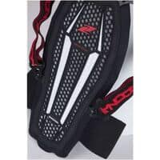                                                                                           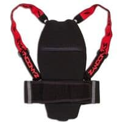                                                                                           |                                                                                           

## Modèles à 53,99 € :

 | Modèle | Photos |
|---|---|
|                                                                                           **SHOT - ATTACK**                                                                                                                                                                                                                                                                                                                                                                               **Lieu de fabrication :**                                                                                             Inconnu                                                                                                                                                                                        **Prix en ligne au moment de la rédaction :**                                                                                            - [53,99 € (motardinn)](https://www.tradeinn.com/motardinn/fr?products_search%5Bquery%5D=SHOT+ATTACK)                                                                                            - [54,12 € (dafymoto)](https://www.dafy-moto.com/recherche?string=SHOT%20ATTACK)                                                                                            - [58,52 € (motoblouz)](https://www.motoblouz.com/recherche.html?q=SHOT+ATTACK)                                                                                            - [Rechercher (fcmoto)](https://www.fc-moto.de/epages/fcm.sf/fr_FR/?ViewAction=FacetedSearchProducts&SearchString=SHOT+ATTACK)                                                                                                                                                                                        **Aide à la recherche :**                                                                                            *Rechercher en occasion (~20-40 €)*                                                                                            [ Leboncoin](https://www.leboncoin.fr/recherche?text=moto+SHOT+ATTACK&shippable=1&sort=price&order=asc) [ Vinted](https://www.vinted.fr/catalog?search_text=moto+SHOT+ATTACK&order=price_low_to_high) *Recherches diverses :*                                                                                            [ Google](https://www.google.com/search?q=moto+SHOT+ATTACK) [ Youtube](https://www.youtube.com/results?search_query=moto+SHOT+ATTACK)                                                                                            |                                                                                           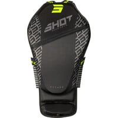                                                                                           |                                                                                           

## Modèles à 63,15 € :

 | Modèle | Photos |
|---|---|
|                                                                                           **ACERBIS - COMFORT 2 0**                                                                                                                                                                                                                                                                                                                                                                               **Lieu de fabrication :**                                                                                             Inconnu                                                                                                                                                                                                                                                                                  **Une bonne présentation :**                                                                                            [ Youtube : RevZilla - Acerbis-X-Seat-Review](https://www.youtube.com/watch?v=LdmwE4kXO7g)                                                                                                                                                                                        **Prix en ligne au moment de la rédaction :**                                                                                            - [63,15 € (dafymoto)](https://www.dafy-moto.com/recherche?string=ACERBIS%20COMFORT%20202%20200)                                                                                            - [Rechercher (fcmoto)](https://www.fc-moto.de/epages/fcm.sf/fr_FR/?ViewAction=FacetedSearchProducts&SearchString=ACERBIS+COMFORT+2+0)                                                                                            - [Rechercher (motardinn)](https://www.tradeinn.com/motardinn/fr?products_search%5Bquery%5D=ACERBIS+COMFORT+2+0)  - [Rechercher (motoblouz)](https://www.motoblouz.com/recherche.html?q=ACERBIS+COMFORT+202+200)                                                                                                                                                                                                                                                                                  **Aide à la recherche :**                                                                                            *Rechercher en occasion (~10-20 €)*                                                                                            [ Leboncoin](https://www.leboncoin.fr/recherche?text=moto+ACERBIS+COMFORT+2+0&shippable=1&sort=price&order=asc) [ Vinted](https://www.vinted.fr/catalog?search_text=moto+ACERBIS+COMFORT+2+0&order=price_low_to_high) *Recherches diverses :*                                                                                            [ Google](https://www.google.com/search?q=moto+ACERBIS+COMFORT+2+0) [ Youtube](https://www.youtube.com/results?search_query=moto+ACERBIS+COMFORT+2+0)                                                                                            |                                                                                           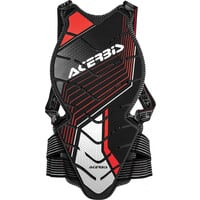                                                                                           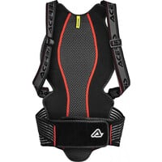                                                                                           |                                                                                           

## Modèles à 68,99 € :

 | Modèle | Photos |
|---|---|
|                                                                                           **REV IT - SLINGSHOT**                                                                                                                                                                                                                                                                                                                                                                               **Lieu de fabrication :**                                                                                             Inconnu                                                                                                                                                                                        **Prix en ligne au moment de la rédaction :**                                                                                            - [68,99 € (motardinn)](https://www.tradeinn.com/motardinn/fr?products_search%5Bquery%5D=REV+IT+SLINGSHOT)                                                                                            - [74,99 € (dafymoto)](https://www.dafy-moto.com/recherche?string=REV%20IT%20SLINGSHOT)                                                                                            - [80,99 € (motoblouz)](https://www.motoblouz.com/recherche.html?q=REV+IT+SLINGSHOT)                                                                                            - [Rechercher (fcmoto)](https://www.fc-moto.de/epages/fcm.sf/fr_FR/?ViewAction=FacetedSearchProducts&SearchString=REV+IT+SLINGSHOT)                                                                                                                                                                                        **Aide à la recherche :**                                                                                            *Rechercher en occasion (~20-50 €)*                                                                                            [ Leboncoin](https://www.leboncoin.fr/recherche?text=moto+REV+IT+SLINGSHOT&shippable=1&sort=price&order=asc) [ Vinted](https://www.vinted.fr/catalog?search_text=moto+REV+IT+SLINGSHOT&order=price_low_to_high) *Recherches diverses :*                                                                                            [ Google](https://www.google.com/search?q=moto+REV+IT+SLINGSHOT) [ Youtube](https://www.youtube.com/results?search_query=moto+REV+IT+SLINGSHOT)                                                                                            |                                                                                           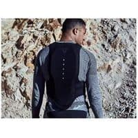                                                                                           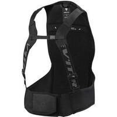                                                                                           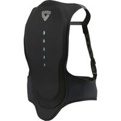                                                                                           |                                                                                           

## Modèles à 70,95 € :

 | Modèle | Photos |
|---|---|
|                                                                                           **DAINESE - PRO ARMOR 2 0**                                                                                                                                                                                                                                                                                                                                                                               **Lieu de fabrication :**                                                                                             Inconnu                                                                                                                                                                                        **Prix en ligne au moment de la rédaction :**                                                                                            - [70,95 € (dafymoto)](https://www.dafy-moto.com/recherche?string=DAINESE%20PRO%2020ARMOR%20202%20200)                                                                                            - [83,30 € (motoblouz)](https://www.motoblouz.com/recherche.html?q=DAINESE+PRO+20ARMOR+202+200)                                                                                            - [Rechercher (fcmoto)](https://www.fc-moto.de/epages/fcm.sf/fr_FR/?ViewAction=FacetedSearchProducts&SearchString=DAINESE+PRO+ARMOR+2+0)                                                                                            - [Rechercher (motardinn)](https://www.tradeinn.com/motardinn/fr?products_search%5Bquery%5D=DAINESE+PRO+ARMOR+2+0)                                                                                                                                                                                        **Aide à la recherche :**                                                                                            *Rechercher en occasion (~20-50 €)*                                                                                            [ Leboncoin](https://www.leboncoin.fr/recherche?text=moto+DAINESE+PRO+ARMOR+2+0&shippable=1&sort=price&order=asc) [ Vinted](https://www.vinted.fr/catalog?search_text=moto+DAINESE+PRO+ARMOR+2+0&order=price_low_to_high) *Recherches diverses :*                                                                                            [ Google](https://www.google.com/search?q=moto+DAINESE+PRO+ARMOR+2+0) [ Youtube](https://www.youtube.com/results?search_query=moto+DAINESE+PRO+ARMOR+2+0)                                                                                            |                                                                                           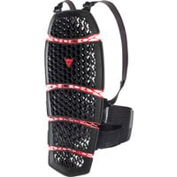                                                                                           |                                                                                           

## Modèles à 84,90 € :

 | Modèle | Photos |
|---|---|
|                                                                                           **ZANDONA - ENFANT NETCUBE PRO KID**                                                                                                                                                                                        ") Modèle enfant                                                                                                                                                                                                                                                                                   **Lieu de fabrication :**                                                                                             Inconnu                                                                                                                                                                                        **Prix en ligne au moment de la rédaction :**                                                                                            - [84,90 € (dafymoto)](https://www.dafy-moto.com/recherche?string=ZANDONA%20ENFANT%2020NETCUBE%2020PRO%2020KID)                                                                                            - [Rechercher (fcmoto)](https://www.fc-moto.de/epages/fcm.sf/fr_FR/?ViewAction=FacetedSearchProducts&SearchString=ZANDONA+ENFANT+NETCUBE+PRO+KID)                                                                                            - [Rechercher (motoblouz)](https://www.motoblouz.com/recherche.html?q=ZANDONA+ENFANT+NETCUBE+PRO+KID)                                                                                            - [Rechercher (motardinn)](https://www.tradeinn.com/motardinn/fr?products_search%5Bquery%5D=ZANDONA+ENFANT+NETCUBE+PRO+KID)                                                                                                                                                                                        **Aide à la recherche :**                                                                                            *Rechercher en occasion (~30-60 €)*                                                                                            [ Leboncoin](https://www.leboncoin.fr/recherche?text=moto+ZANDONA+ENFANT+NETCUBE+PRO+KID&shippable=1&sort=price&order=asc) [ Vinted](https://www.vinted.fr/catalog?search_text=moto+ZANDONA+ENFANT+NETCUBE+PRO+KID&order=price_low_to_high) *Recherches diverses :*                                                                                            [ Google](https://www.google.com/search?q=moto+ZANDONA+ENFANT+NETCUBE+PRO+KID) [ Youtube](https://www.youtube.com/results?search_query=moto+ZANDONA+ENFANT+NETCUBE+PRO+KID)                                                                                            |                                                                                           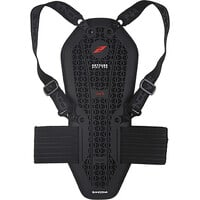                                                                                           |                                                                                           

## Modèles à 84,99 € :

 | Modèle | Photos |
|---|---|
|                                                                                           **CHAFT - D3O BACKSHIELD**                                                                                                                                                                                                                                                                                                                                                                               **Lieu de fabrication :**                                                                                             Inconnu                                                                                                                                                                                                                                                                                  **Prix en ligne au moment de la rédaction :**                                                                                            - [84,99 € (dafymoto)](https://www.dafy-moto.com/recherche?string=CHAFT%20D3O%2020BACKSHIELD)                                                                                            - [Rechercher (fcmoto)](https://www.fc-moto.de/epages/fcm.sf/fr_FR/?ViewAction=FacetedSearchProducts&SearchString=CHAFT+BACKSHIELD)                                                                                            - [Rechercher (motoblouz)](https://www.motoblouz.com/recherche.html?q=CHAFT+BACKSHIELD)                                                                                            - [Rechercher (motardinn)](https://www.tradeinn.com/motardinn/fr?products_search%5Bquery%5D=CHAFT+BACKSHIELD)                                                                                                                                                                                        **Aide à la recherche :**                                                                                            *Rechercher en occasion (~30-60 €)*                                                                                            [ Leboncoin](https://www.leboncoin.fr/recherche?text=moto+CHAFT+BACKSHIELD&shippable=1&sort=price&order=asc) [ Vinted](https://www.vinted.fr/catalog?search_text=moto+CHAFT+BACKSHIELD&order=price_low_to_high) *Recherches diverses :*                                                                                            [ Google](https://www.google.com/search?q=moto+CHAFT+BACKSHIELD) [ Youtube](https://www.youtube.com/results?search_query=moto+CHAFT+BACKSHIELD)                                                                                            |                                                                                           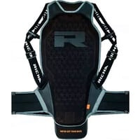                                                                                           |                                                                                           

## Modèles à 85,40 € :

 | Modèle | Photos |
|---|---|
|                                                                                           **RICHA - D3O BACKSHIELD**                                                                                                                                                                                                                                                                                   **Lieu de fabrication :**                                                                                             Inconnu                                                                                                                                                                                        **Prix en ligne au moment de la rédaction :**                                                                                            - [85,40 € (motoblouz)](https://www.motoblouz.com/recherche.html?q=RICHA+D3O+20BACKSHIELD)                                                                                            - [Rechercher (fcmoto)](https://www.fc-moto.de/epages/fcm.sf/fr_FR/?ViewAction=FacetedSearchProducts&SearchString=RICHA+BACKSHIELD)                                                                                            - [Rechercher (motardinn)](https://www.tradeinn.com/motardinn/fr?products_search%5Bquery%5D=RICHA+BACKSHIELD)                                                                                            - [Rechercher (dafymoto)](https://www.dafy-moto.com/recherche?string=RICHA+BACKSHIELD)                                                                                                                                                                                        **Aide à la recherche :**                                                                                            *Rechercher en occasion (~30-60 €)*                                                                                            [ Leboncoin](https://www.leboncoin.fr/recherche?text=moto+RICHA+BACKSHIELD&shippable=1&sort=price&order=asc) [ Vinted](https://www.vinted.fr/catalog?search_text=moto+RICHA+BACKSHIELD&order=price_low_to_high) *Recherches diverses :*                                                                                            [ Google](https://www.google.com/search?q=moto+RICHA+BACKSHIELD) [ Youtube](https://www.youtube.com/results?search_query=moto+RICHA+BACKSHIELD)                                                                                            |                                                                                           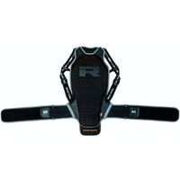                                                                                           |                                                                                           

## Modèles à 89,45 € :

 | Modèle | Photos |
|---|---|
|                                                                                           **ALPINESTARS - ENFANT NUCLEON KR Y**                                                                                                                                                                                       ") Modèle enfant                                                                                                                                                                                                                                                                                   **Lieu de fabrication :**                                                                                             Inconnu                                                                                                                                                                                                                                                                                  **Prix en ligne au moment de la rédaction :**                                                                                            - [89,45 € (dafymoto)](https://www.dafy-moto.com/recherche?string=ALPINESTARS%20ENFANT%2020NUCLEON%2020KR%2020Y)                                                                                            - [Rechercher (fcmoto)](https://www.fc-moto.de/epages/fcm.sf/fr_FR/?ViewAction=FacetedSearchProducts&SearchString=ALPINESTARS+ENFANT+NUCLEON+KR+Y)                                                                                            - [Rechercher (motoblouz)](https://www.motoblouz.com/recherche.html?q=ALPINESTARS+ENFANT+NUCLEON+KR+Y)                                                                                            - [Rechercher (motardinn)](https://www.tradeinn.com/motardinn/fr?products_search%5Bquery%5D=ALPINESTARS+ENFANT+NUCLEON+KR+Y)                                                                                                                                                                                        **Aide à la recherche :**                                                                                            *Rechercher en occasion (~30-60 €)*                                                                                            [ Leboncoin](https://www.leboncoin.fr/recherche?text=moto+ALPINESTARS+ENFANT+NUCLEON+KR+Y&shippable=1&sort=price&order=asc) [ Vinted](https://www.vinted.fr/catalog?search_text=moto+ALPINESTARS+ENFANT+NUCLEON+KR+Y&order=price_low_to_high) *Recherches diverses :*                                                                                            [ Google](https://www.google.com/search?q=moto+ALPINESTARS+ENFANT+NUCLEON+KR+Y) [ Youtube](https://www.youtube.com/results?search_query=moto+ALPINESTARS+ENFANT+NUCLEON+KR+Y)                                                                                            |                                                                                           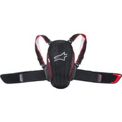                                                                                           |                                                                                           

## Modèles à 89,90 € :

 | Modèle | Photos |
|---|---|
|                                                                                           **ZANDONA - NETCUBE PRO**                                                                                                                                                                                                                                                                                                                                                                               **Lieu de fabrication :**                                                                                             Inconnu                                                                                                                                                                                        **Prix en ligne au moment de la rédaction :**                                                                                                                                                                                      - [89,90 € (fcmoto)](https://www.fc-moto.de/epages/fcm.sf/fr_FR/?ViewAction=FacetedSearchProducts&SearchString=ZANDONA+NETCUBE+20PRO)                                                                                            - [94,90 € (dafymoto)](https://www.dafy-moto.com/recherche?string=ZANDONA%20NETCUBE%2020PRO)                                                                                            - [Rechercher (motardinn)](https://www.tradeinn.com/motardinn/fr?products_search%5Bquery%5D=ZANDONA+NETCUBE+PRO)                                                                                            - [Rechercher (motoblouz)](https://www.motoblouz.com/recherche.html?q=ZANDONA+NETCUBE+20PRO)                                                                                              **Aide à la recherche :**                                                                                            *Rechercher en occasion (~20-40 €)*                                                                                            [ Leboncoin](https://www.leboncoin.fr/recherche?text=moto+ZANDONA+NETCUBE+PRO&shippable=1&sort=price&order=asc) [ Vinted](https://www.vinted.fr/catalog?search_text=moto+ZANDONA+NETCUBE+PRO&order=price_low_to_high) *Recherches diverses :*                                                                                            [ Google](https://www.google.com/search?q=moto+ZANDONA+NETCUBE+PRO) [ Youtube](https://www.youtube.com/results?search_query=moto+ZANDONA+NETCUBE+PRO)                                                                                            |                                                                                           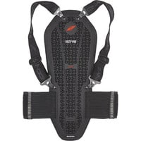                                                                                           |                                                                                           

## Modèles à 91,71 € :

 | Modèle | Photos |
|---|---|
|                                                                                           **ZANDONA - SHARK EVC**                                                                                                                                                                                       **Lieu de fabrication :**                                                                                            Europe :                                                                                                                                                                                        ") Italie                                                                                                                                                                                                                                                                                   **Prix en ligne au moment de la rédaction :**  - [91,71 € (motoblouz)](https://www.motoblouz.com/recherche.html?q=ZANDONA+SHARK+EVC)                                                                                                                                                                                      - [113,91 € (fcmoto)](https://www.fc-moto.de/epages/fcm.sf/fr_FR/?ViewAction=FacetedSearchProducts&SearchString=ZANDONA+SHARK+20EVC)                                                                                            - [Rechercher (motardinn)](https://www.tradeinn.com/motardinn/fr?products_search%5Bquery%5D=ZANDONA+SHARK+EVC)                                                                                            - [Rechercher (dafymoto)](https://www.dafy-moto.com/recherche?string=ZANDONA+SHARK+EVC)                                                                                                                                                                                        **Aide à la recherche :**                                                                                            *Rechercher en occasion (~30-70 €)*                                                                                            [ Leboncoin](https://www.leboncoin.fr/recherche?text=moto+ZANDONA+SHARK+EVC&shippable=1&sort=price&order=asc) [ Vinted](https://www.vinted.fr/catalog?search_text=moto+ZANDONA+SHARK+EVC&order=price_low_to_high) *Recherches diverses :*                                                                                            [ Google](https://www.google.com/search?q=moto+ZANDONA+SHARK+EVC) [ Youtube](https://www.youtube.com/results?search_query=moto+ZANDONA+SHARK+EVC)                                                                                            |                                                                                           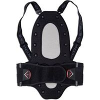                                                                                           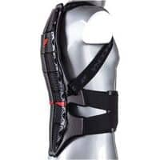                                                                                           |                                                                                           

## Modèles à 99,95 € :

 | Modèle | Photos |
|---|---|
|                                                                                           **MACNA - VAULT BACKPROTECTOR**                                                                                                                                                                                                                                                                                   **Lieu de fabrication :**                                                                                             Inconnu                                                                                                                                                                                        **Prix en ligne au moment de la rédaction :**                                                                                            - [99,95 € (motoblouz)](https://www.motoblouz.com/recherche.html?q=MACNA+VAULT+20BACKPROTECTOR)                                                                                            - [Rechercher (fcmoto)](https://www.fc-moto.de/epages/fcm.sf/fr_FR/?ViewAction=FacetedSearchProducts&SearchString=MACNA+VAULT+BACKPROTECTOR)                                                                                            - [Rechercher (motardinn)](https://www.tradeinn.com/motardinn/fr?products_search%5Bquery%5D=MACNA+VAULT+BACKPROTECTOR)                                                                                            - [Rechercher (dafymoto)](https://www.dafy-moto.com/recherche?string=MACNA+VAULT+BACKPROTECTOR)                                                                                                                                                                                        **Aide à la recherche :**                                                                                            *Rechercher en occasion (~30-70 €)*                                                                                            [ Leboncoin](https://www.leboncoin.fr/recherche?text=moto+MACNA+VAULT+BACKPROTECTOR&shippable=1&sort=price&order=asc) [ Vinted](https://www.vinted.fr/catalog?search_text=moto+MACNA+VAULT+BACKPROTECTOR&order=price_low_to_high) *Recherches diverses :*                                                                                            [ Google](https://www.google.com/search?q=moto+MACNA+VAULT+BACKPROTECTOR) [ Youtube](https://www.youtube.com/results?search_query=moto+MACNA+VAULT+BACKPROTECTOR)                                                                                            |                                                                                           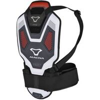                                                                                           |                                                                                           

## Modèles à 101,91 € :

 | Modèle | Photos |
|---|---|
|                                                                                           **BERING - DORSALE BRETELLE**                                                                                                                                                                                                                                                                                   **Lieu de fabrication :**                                                                                             Inconnu                                                                                                                                                                                        **Une bonne présentation :**                                                                                            [ Article : Motoblouz - Essai dorsale à bretelles Bering](https://www.motoblouz.com/enjoytheride/tests-equipements-moto/10391-dorsale-a-bretelles-bering-2017-04-18)                                                                                                                                                                                        **Prix en ligne au moment de la rédaction :**                                                                                            - [101,91 € (motoblouz)](https://www.motoblouz.com/recherche.html?q=BERING+DORSALE+BRETELLE)                                                                                            - [Rechercher (dafymoto)](https://www.dafy-moto.com/recherche?string=BERING%20DORSALE%2020BRETELLE)                                                                                            - [Rechercher (fcmoto)](https://www.fc-moto.de/epages/fcm.sf/fr_FR/?ViewAction=FacetedSearchProducts&SearchString=BERING+DORSALE+BRETELLE)                                                                                            - [Rechercher (motardinn)](https://www.tradeinn.com/motardinn/fr?products_search%5Bquery%5D=BERING+DORSALE+BRETELLE)                                                                                                                                                                                        **Aide à la recherche :**                                                                                            *Rechercher en occasion (~20-40 €)*                                                                                            [ Leboncoin](https://www.leboncoin.fr/recherche?text=moto+BERING+DORSALE+BRETELLE&shippable=1&sort=price&order=asc) [ Vinted](https://www.vinted.fr/catalog?search_text=moto+BERING+DORSALE+BRETELLE&order=price_low_to_high) *Recherches diverses :*                                                                                            [ Google](https://www.google.com/search?q=moto+BERING+DORSALE+BRETELLE) [ Youtube](https://www.youtube.com/results?search_query=moto+BERING+DORSALE+BRETELLE)                                                                                            |                                                                                           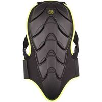                                                                                           |                                                                                           

## Modèles à 105,21 € :

 | Modèle | Photos |
|---|---|
|                                                                                           **ZANDONA - SPINE EVC**                                                                                                                                                                                                                                                                                                                                                                               **Lieu de fabrication :**                                                                                            Europe :                                                                                                                                                                                        ") Italie                                                                                                                                                                                                                                                                                   **Prix en ligne au moment de la rédaction :**                                                                                            - [105,21 € (motoblouz)](https://www.motoblouz.com/recherche.html?q=ZANDONA+SPINE+20EVC)                                                                                            - [110,42 € (fcmoto)](https://www.fc-moto.de/epages/fcm.sf/fr_FR/?ViewAction=FacetedSearchProducts&SearchString=ZANDONA+SPINE+20EVC)                                                                                            - [114,90 € (dafymoto)](https://www.dafy-moto.com/recherche?string=ZANDONA%20SPINE%2020EVC)                           - [Rechercher (motardinn)](https://www.tradeinn.com/motardinn/fr?products_search%5Bquery%5D=ZANDONA+SPINE+EVC)                                                                                                                                                                                        **Aide à la recherche :**                                                                                            *Rechercher en occasion (~30-70 €)*                                                                                            [ Leboncoin](https://www.leboncoin.fr/recherche?text=moto+ZANDONA+SPINE+EVC&shippable=1&sort=price&order=asc) [ Vinted](https://www.vinted.fr/catalog?search_text=moto+ZANDONA+SPINE+EVC&order=price_low_to_high) *Recherches diverses :*                                                                                            [ Google](https://www.google.com/search?q=moto+ZANDONA+SPINE+EVC) [ Youtube](https://www.youtube.com/results?search_query=moto+ZANDONA+SPINE+EVC)                                                                                            |                                                                                           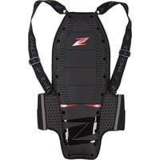                                                                                           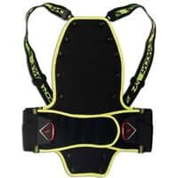                                                                                           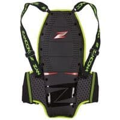                                                                                           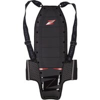                                                                                           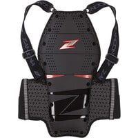                                                                                           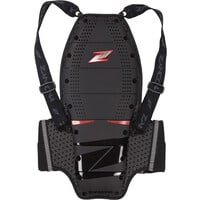                                                                                           |                                                                                           

## Modèles à 114,99 € :

 | Modèle | Photos |
|---|---|
|                                                                                           **REV IT - TRYONIC SEE**                                                                                                                                                                                                                                                                                                                                                                               **Une bonne présentation :**                                                                                            [ Youtube : RevZilla - Tryonic-See-Back-Protector-Review-at-RevZilla-com](https://www.youtube.com/watch?v=9_EebXefOHM)                                                                                                                                                                                                                                                                                 **Lieu de fabrication :**                                                                                             Inconnu                                                                                              **Prix en ligne au moment de la rédaction :**                                                                                            - [114,99 € (dafymoto)](https://www.dafy-moto.com/recherche?string=REV%20IT%20TRYONIC%2020SEE)                                                                                            - [Rechercher (fcmoto)](https://www.fc-moto.de/epages/fcm.sf/fr_FR/?ViewAction=FacetedSearchProducts&SearchString=REV+IT+TRYONIC+SEE)                                                                                            - [Rechercher (motoblouz)](https://www.motoblouz.com/recherche.html?q=REV+IT+TRYONIC+SEE)                                                                                            - [Rechercher (motardinn)](https://www.tradeinn.com/motardinn/fr?products_search%5Bquery%5D=REV+IT+TRYONIC+SEE)                                                                                                                                                                                        **Aide à la recherche :**                                                                                            *Rechercher en occasion (~30-80 €)*                                                                                            [ Leboncoin](https://www.leboncoin.fr/recherche?text=moto+REV+IT+TRYONIC+SEE&shippable=1&sort=price&order=asc) [ Vinted](https://www.vinted.fr/catalog?search_text=moto+REV+IT+TRYONIC+SEE&order=price_low_to_high) *Recherches diverses :*                                                                                            [ Google](https://www.google.com/search?q=moto+REV+IT+TRYONIC+SEE) [ Youtube](https://www.youtube.com/results?search_query=moto+REV+IT+TRYONIC+SEE)                                                                                            |                                                                                           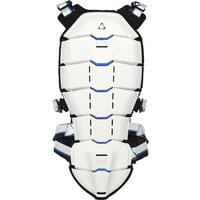                                                                                           |                                                                                           

## Modèles à 119,61 € :

 | Modèle | Photos |
|---|---|
|                                                                                           **FURYGAN - RACING D3O**                                                                                                                                                                                                                                                                                                                                                                               **Lieu de fabrication :**                                                                                             Inconnu                                                                                                                                                                                                                                                                                  **Prix en ligne au moment de la rédaction :**                                                                                            - [119,61 € (motoblouz)](https://www.motoblouz.com/recherche.html?q=FURYGAN+RACING+20D3O)                                                                                            - [Rechercher (fcmoto)](https://www.fc-moto.de/epages/fcm.sf/fr_FR/?ViewAction=FacetedSearchProducts&SearchString=FURYGAN+RACING)                                                                                            - [Rechercher (motardinn)](https://www.tradeinn.com/motardinn/fr?products_search%5Bquery%5D=FURYGAN+RACING)                                                                                            - [Rechercher (dafymoto)](https://www.dafy-moto.com/recherche?string=FURYGAN+RACING)                                                                                                                                                                                        **Aide à la recherche :**                                                                                            *Rechercher en occasion (~40-80 €)*                                                                                            [ Leboncoin](https://www.leboncoin.fr/recherche?text=moto+FURYGAN+RACING&shippable=1&sort=price&order=asc) [ Vinted](https://www.vinted.fr/catalog?search_text=moto+FURYGAN+RACING&order=price_low_to_high) *Recherches diverses :*                                                                                            [ Google](https://www.google.com/search?q=moto+FURYGAN+RACING) [ Youtube](https://www.youtube.com/results?search_query=moto+FURYGAN+RACING)                                                                                            |                                                                                           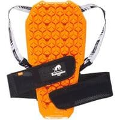                                                                                           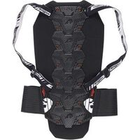                                                                                           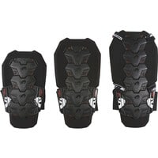                                                                                           |                                                                                           

## Modèles à 127,40 € :

 | Modèle | Photos |
|---|---|
|                                                                                           **SCOTT - AIRFLEX PRO**                                                                                                                                                                                                                                                                                                                                                                               **Lieu de fabrication :**                                                                                             Inconnu                                                                                                                                                                                        **Prix en ligne au moment de la rédaction :**                                                                                            - [127,40 € (dafymoto)](https://www.dafy-moto.com/recherche?string=SCOTT%20AIRFLEX%2020PRO)                                                                                            - [152,91 € (motoblouz)](https://www.motoblouz.com/recherche.html?q=SCOTT+AIRFLEX+20PRO)                                                                                            - [Rechercher (fcmoto)](https://www.fc-moto.de/epages/fcm.sf/fr_FR/?ViewAction=FacetedSearchProducts&SearchString=SCOTT+AIRFLEX+PRO)                                                                                            - [Rechercher (motardinn)](https://www.tradeinn.com/motardinn/fr?products_search%5Bquery%5D=SCOTT+AIRFLEX+PRO)                                                                                                                                                                                        **Aide à la recherche :**                                                                                            *Rechercher en occasion (~40-90 €)*                                                                                            [ Leboncoin](https://www.leboncoin.fr/recherche?text=moto+SCOTT+AIRFLEX+PRO&shippable=1&sort=price&order=asc) [ Vinted](https://www.vinted.fr/catalog?search_text=moto+SCOTT+AIRFLEX+PRO&order=price_low_to_high) *Recherches diverses :*                                                                                            [ Google](https://www.google.com/search?q=moto+SCOTT+AIRFLEX+PRO) [ Youtube](https://www.youtube.com/results?search_query=moto+SCOTT+AIRFLEX+PRO)                                                                                            |                                                                                           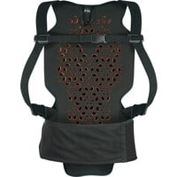                                                                                           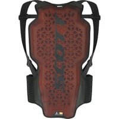                                                                                           |                                                                                           

## Modèles à 129,90 € :

 | Modèle | Photos |
|---|---|
|                                                                                           **ZANDONA - HYBRID PRO**                                                                                                                                                                                                                                                                                                                                                                               **Lieu de fabrication :**                                                                                             Inconnu                                                                                                                                                                                        **Prix en ligne au moment de la rédaction :**                                                                                                                                                                                      - [129,90 € (dafymoto)](https://www.dafy-moto.com/recherche?string=ZANDONA%20HYBRID%2020PRO)                                                                                            - [136,00 € (fcmoto)](https://www.fc-moto.de/epages/fcm.sf/fr_FR/?ViewAction=FacetedSearchProducts&SearchString=ZANDONA+HYBRID+20PRO)                                                                                            - [Rechercher (motardinn)](https://www.tradeinn.com/motardinn/fr?products_search%5Bquery%5D=ZANDONA+HYBRID+PRO)  - [Rechercher (motoblouz)](https://www.motoblouz.com/recherche.html?q=ZANDONA+HYBRID+20PRO)                                                                                                                                                                                        **Aide à la recherche :**                                                                                            *Rechercher en occasion (~20-60 €)*                                                                                            [ Leboncoin](https://www.leboncoin.fr/recherche?text=moto+ZANDONA+HYBRID+PRO&shippable=1&sort=price&order=asc) [ Vinted](https://www.vinted.fr/catalog?search_text=moto+ZANDONA+HYBRID+PRO&order=price_low_to_high) *Recherches diverses :*                                                                                            [ Google](https://www.google.com/search?q=moto+ZANDONA+HYBRID+PRO) [ Youtube](https://www.youtube.com/results?search_query=moto+ZANDONA+HYBRID+PRO)                                                                                            |                                                                                           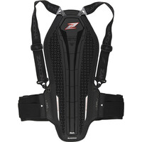                                                                                           |                                                                                           

## Modèles à 140,95 € :

 | Modèle | Photos |
|---|---|                                                                                          
|                                                                                           **ALPINESTARS - NUCLEON KR 1 CELL**                                                                                                                                                                                                                                                                                                                                                                               **Lieu de fabrication :**                                                                                             Inconnu                                                                                                                                                                                        **De bonnes présentations :**                                                                                            [ Youtube : RevZilla - Alpinestars-Nucleon-KR-1-Road-Back-Protector-Review-at-RevZilla-com](https://www.youtube.com/watch?v=HLjEAeLX4T4)                                                                                                                                                                                         **Prix en ligne au moment de la rédaction :**                                                                                            - [140,95 € (dafymoto)](https://www.dafy-moto.com/recherche?string=ALPINESTARS%20NUCLEON%2020KR%20201%2020CELL)                                                                                            - [166,45 € (fcmoto)](https://www.fc-moto.de/epages/fcm.sf/fr_FR/?ViewAction=FacetedSearchProducts&SearchString=ALPINESTARS+NUCLEON+20KR+201+20CELL)                                                                                            - [Rechercher (motardinn)](https://www.tradeinn.com/motardinn/fr?products_search%5Bquery%5D=ALPINESTARS+NUCLEON+KR+1+CELL)                                                                                            - [Rechercher (motoblouz)](https://www.motoblouz.com/recherche.html?q=ALPINESTARS+NUCLEON+20KR+201+20CELL)                                                                                                                                                                                        **Aide à la recherche :**                                                                                            *Rechercher en occasion (~30-60 €)*                                                                                            [ Leboncoin](https://www.leboncoin.fr/recherche?text=moto+ALPINESTARS+NUCLEON+KR+1+CELL&shippable=1&sort=price&order=asc) [ Vinted](https://www.vinted.fr/catalog?search_text=moto+ALPINESTARS+NUCLEON+KR+1+CELL&order=price_low_to_high) *Recherches diverses :*                                                                                            [ Google](https://www.google.com/search?q=moto+ALPINESTARS+NUCLEON+KR+1+CELL) [ Youtube](https://www.youtube.com/results?search_query=moto+ALPINESTARS+NUCLEON+KR+1+CELL)                                                                                            |                                                                                           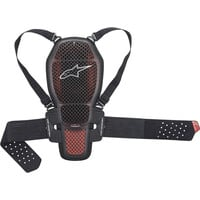                                                                                           |                                                                                           
|                                                                                           **DAINESE - MANIS D1**                                                                                                                                                                                                                                                                                                                                                                               **Lieu de fabrication :**                                                                                             Inconnu                                                                                                                                                                                        **Une bonne présentation :**                                                                                            [ Article : Motoblouz - Essai dorsale Dainese Manis D1](https://www.motoblouz.com/enjoytheride/accessoires-motard/7690-dorsale-dainese-manis-d1-2015-08-04)                                                                                                                                                                                        **Prix en ligne au moment de la rédaction :**                                                                                            - [140,95 € (dafymoto)](https://www.dafy-moto.com/recherche?string=DAINESE%20MANIS%2020D1)                                                                                            - [Rechercher (fcmoto)](https://www.fc-moto.de/epages/fcm.sf/fr_FR/?ViewAction=FacetedSearchProducts&SearchString=DAINESE+MANIS+D1)                                                                                            - [Rechercher (motardinn)](https://www.tradeinn.com/motardinn/fr?products_search%5Bquery%5D=DAINESE+MANIS+D1)                                                                                            - [Rechercher (motoblouz)](https://www.motoblouz.com/recherche.html?q=DAINESE+MANIS+20D1)                                                                                                                                                                                        **Aide à la recherche :**                                                                                            *Rechercher en occasion (~20-40 €)*                                                                                            [ Leboncoin](https://www.leboncoin.fr/recherche?text=moto+DAINESE+MANIS+D1&shippable=1&sort=price&order=asc) [ Vinted](https://www.vinted.fr/catalog?search_text=moto+DAINESE+MANIS+D1&order=price_low_to_high) *Recherches diverses :*                                                                                            [ Google](https://www.google.com/search?q=moto+DAINESE+MANIS+D1) [ Youtube](https://www.youtube.com/results?search_query=moto+DAINESE+MANIS+D1)                                                                                            |                                                                                           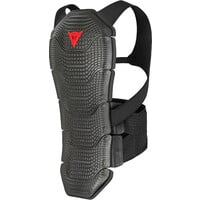                                                                                           |                                                                                           

## Modèles à 159,99 £ :

 | Modèle | Photos |
|---|---|
|                                                                                           **FORCEFIELD - PRO L2K DYNAMIC**                                                                                                                                                                                                                                                                                    **Lieu de fabrication :**                                                                                             Inconnu                                                                                                                                                                                        **Prix en ligne au moment de la rédaction :**                                                                                            - 159,99 £ (fabricant)                                                                                            - [Rechercher (fcmoto)](https://www.fc-moto.de/epages/fcm.sf/fr_FR/?ViewAction=FacetedSearchProducts&SearchString=FORCEFIELD+PRO+L2K+DYNAMIC)                                                                                            - [Rechercher (motoblouz)](https://www.motoblouz.com/recherche.html?q=FORCEFIELD+PRO+L2K+DYNAMIC)                                                                                            - [Rechercher (motardinn)](https://www.tradeinn.com/motardinn/fr?products_search%5Bquery%5D=FORCEFIELD+PRO+L2K+DYNAMIC)                                                                                            - [Rechercher (dafymoto)](https://www.dafy-moto.com/recherche?string=FORCEFIELD+PRO+L2K+DYNAMIC)                                                                                                                                                                                        **Aide à la recherche :**                                                                                            *Rechercher en occasion (~50-110 €)*                                                                                            [ Leboncoin](https://www.leboncoin.fr/recherche?text=moto+FORCEFIELD+PRO+L2K+DYNAMIC&shippable=1&sort=price&order=asc) [ Vinted](https://www.vinted.fr/catalog?search_text=moto+FORCEFIELD+PRO+L2K+DYNAMIC&order=price_low_to_high) *Recherches diverses :*                                                                                            [ Google](https://www.google.com/search?q=moto+FORCEFIELD+PRO+L2K+DYNAMIC) [ Youtube](https://www.youtube.com/results?search_query=moto+FORCEFIELD+PRO+L2K+DYNAMIC)                                                                                            |                                                                                           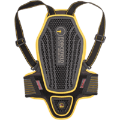                                                                                           |                                                                                           

## Modèles à 159,95 € :

 | Modèle | Photos |
|---|---|
|                                                                                           **DAINESE - WAVE 1S D1 AIR**                                                                                                                                                                                       ") Modèle femme                                                                                            ") Eté                                                                                                                                                                                        **Lieu de fabrication :**                                                                                             Inconnu                                                                                                                                                                                                                                                                                  **Prix en ligne au moment de la rédaction :**                                                                                            - [159,95 € (dafymoto)](https://www.dafy-moto.com/recherche?string=DAINESE%20WAVE%20201S%2020D1%2020AIR)                                                                                            - [179,95 € (fcmoto)](https://www.fc-moto.de/epages/fcm.sf/fr_FR/?ViewAction=FacetedSearchProducts&SearchString=DAINESE+WAVE+201S+20D1+20AIR)                                                                                            - [193,90 € (motoblouz)](https://www.motoblouz.com/recherche.html?q=DAINESE+WAVE+201S+20D1+20AIR)                                                                                            - [Rechercher (motardinn)](https://www.tradeinn.com/motardinn/fr?products_search%5Bquery%5D=DAINESE+WAVE+1S+D1+AIR)                                                                                                                                                                                        **Aide à la recherche :**                                                                                            *Rechercher en occasion (~50-110 €)*                                                                                            [ Leboncoin](https://www.leboncoin.fr/recherche?text=moto+DAINESE+WAVE+1S+D1+AIR&shippable=1&sort=price&order=asc) [ Vinted](https://www.vinted.fr/catalog?search_text=moto+DAINESE+WAVE+1S+D1+AIR&order=price_low_to_high) *Recherches diverses :*                                                                                            [ Google](https://www.google.com/search?q=moto+DAINESE+WAVE+1S+D1+AIR) [ Youtube](https://www.youtube.com/results?search_query=moto+DAINESE+WAVE+1S+D1+AIR)                                                                                            |                                                                                           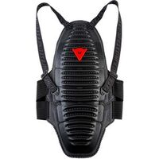                                                                                           |                                                                                           

## Modèles à 161 € :

 | Modèle | Photos |
|---|---|
|                                                                                           **BMW - PROTECTION DOS**                                                                                                                                                                                                                                                                                    **Lieu de fabrication :**                                                                                             Inconnu                                                                                                                                                                                        **Prix en ligne au moment de la rédaction :**                                                                                            - 161 € (fabricant)                                                                                            - [Rechercher (fcmoto)](https://www.fc-moto.de/epages/fcm.sf/fr_FR/?ViewAction=FacetedSearchProducts&SearchString=BMW+PROTECTION+DOS)                                                                                            - [Rechercher (motoblouz)](https://www.motoblouz.com/recherche.html?q=BMW+PROTECTION+DOS)                                                                                            - [Rechercher (motardinn)](https://www.tradeinn.com/motardinn/fr?products_search%5Bquery%5D=BMW+PROTECTION+DOS)                                                                                            - [Rechercher (dafymoto)](https://www.dafy-moto.com/recherche?string=BMW+PROTECTION+DOS)                                                                                                                                                                                        **Aide à la recherche :**                                                                                            *Rechercher en occasion (~50-110 €)*                                                                                            [ Leboncoin](https://www.leboncoin.fr/recherche?text=moto+BMW+PROTECTION+DOS&shippable=1&sort=price&order=asc) [ Vinted](https://www.vinted.fr/catalog?search_text=moto+BMW+PROTECTION+DOS&order=price_low_to_high) *Recherches diverses :*                                                                                            [ Google](https://www.google.com/search?q=moto+BMW+PROTECTION+DOS) [ Youtube](https://www.youtube.com/results?search_query=moto+BMW+PROTECTION+DOS)                                                                                            |                                                                                           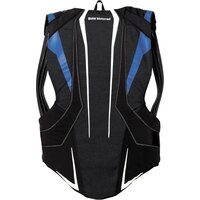                                                                                           |                                                                                           

## Modèles à 169,99 € :

 | Modèle | Photos |
|---|---|
|                                                                                           **TRYONIC - FEEL 3 7**                                                                                                                                                                                       **Lieu de fabrication :**                                                                                             Inconnu                                                                                                                                                                                        **De bonnes présentations :**                                                                                            [ Youtube : RevZilla - Tryonic-Feel-3-7-Back-Protector-Review-at-RevZilla-com](https://www.youtube.com/watch?v=rQjQtEQyB9g)  [ Article : Motoblouz - Essai dorsale Tryonic Feel 3.7](https://www.motoblouz.com/enjoytheride/accessoires-motard/9886-essai-dorsale-tryonic-feel-3-7-2017-01-16)                                                                                                                                                                                        **Prix en ligne au moment de la rédaction :**                                                                                            - 169,99 € (fabricant)                                                                                            - [Rechercher (fcmoto)](https://www.fc-moto.de/epages/fcm.sf/fr_FR/?ViewAction=FacetedSearchProducts&SearchString=TRYONIC+FEEL+3+7)                                                                                            - [Rechercher (motoblouz)](https://www.motoblouz.com/recherche.html?q=TRYONIC+FEEL+3+7)                                                                                            - [Rechercher (motardinn)](https://www.tradeinn.com/motardinn/fr?products_search%5Bquery%5D=TRYONIC+FEEL+3+7)                                                                                            - [Rechercher (dafymoto)](https://www.dafy-moto.com/recherche?string=TRYONIC+FEEL+3+7)                                                                                                                                                                                        **Aide à la recherche :**                                                                                            *Rechercher en occasion (~50-120 €)*                                                                                            [ Leboncoin](https://www.leboncoin.fr/recherche?text=moto+TRYONIC+FEEL+3+7&shippable=1&sort=price&order=asc) [ Vinted](https://www.vinted.fr/catalog?search_text=moto+TRYONIC+FEEL+3+7&order=price_low_to_high) *Recherches diverses :*                                                                                            [ Google](https://www.google.com/search?q=moto+TRYONIC+FEEL+3+7) [ Youtube](https://www.youtube.com/results?search_query=moto+TRYONIC+FEEL+3+7)                                                                                            |                                                                                           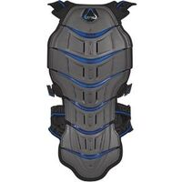                                                                                           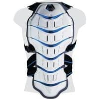                                                                                           |                                                                                           

## Modèles à 176,97 € :

 | Modèle | Photos |
|---|---|
|                                                                                           **BMW - GILET DE PROTECTION**                                                                                                                                                                                                                                                                                    **Lieu de fabrication :**                                                                                             Inconnu                                                                                                                                                                                        **Prix en ligne au moment de la rédaction :**                                                                                            - 176,97 € (fabricant)                                                                                            - [Rechercher (fcmoto)](https://www.fc-moto.de/epages/fcm.sf/fr_FR/?ViewAction=FacetedSearchProducts&SearchString=BMW+GILET+PROTECTION)                                                                                            - [Rechercher (motoblouz)](https://www.motoblouz.com/recherche.html?q=BMW+GILET+PROTECTION)                                                                                            - [Rechercher (motardinn)](https://www.tradeinn.com/motardinn/fr?products_search%5Bquery%5D=BMW+GILET+PROTECTION)                                                                                            - [Rechercher (dafymoto)](https://www.dafy-moto.com/recherche?string=BMW+GILET+PROTECTION)                                                                                                                                                                                        **Aide à la recherche :**                                                                                            *Rechercher en occasion (~50-120 €)*                                                                                            [ Leboncoin](https://www.leboncoin.fr/recherche?text=moto+BMW+GILET+PROTECTION&shippable=1&sort=price&order=asc) [ Vinted](https://www.vinted.fr/catalog?search_text=moto+BMW+GILET+PROTECTION&order=price_low_to_high) *Recherches diverses :*                                                                                            [ Google](https://www.google.com/search?q=moto+BMW+GILET+PROTECTION) [ Youtube](https://www.youtube.com/results?search_query=moto+BMW+GILET+PROTECTION)                                                                                            |                                                                                           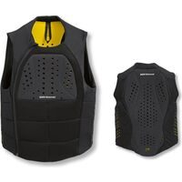                                                                                           |                                                                                           

## Modèles à 179,90 € :

 | Modèle | Photos |
|---|---|
|                                                                                          **ZANDONA - HYBRID PRO RS**                                                                                                                                                                                                                                                                                                                                                                               **Lieu de fabrication :**                                                                                             Inconnu                                                                                                                                                                                        **Prix en ligne au moment de la rédaction :**                                                                                                                                                                                      - [179,90 € (dafymoto)](https://www.dafy-moto.com/recherche?string=ZANDONA%20HYBRID%2020PRO%2020RS)                                                                                            - [Rechercher (fcmoto)](https://www.fc-moto.de/epages/fcm.sf/fr_FR/?ViewAction=FacetedSearchProducts&SearchString=ZANDONA+HYBRID+PRO+RS)                                                                                            - [Rechercher (motardinn)](https://www.tradeinn.com/motardinn/fr?products_search%5Bquery%5D=ZANDONA+HYBRID+PRO+RS)  - [Rechercher (motoblouz)](https://www.motoblouz.com/recherche.html?q=ZANDONA+HYBRID+20PRO+20RS)                                                                                                                                                                                        **Aide à la recherche :**                                                                                            *Rechercher en occasion (~20-60 €)*                                                                                            [ Leboncoin](https://www.leboncoin.fr/recherche?text=moto+ZANDONA+HYBRID+PRO+RS&shippable=1&sort=price&order=asc) [ Vinted](https://www.vinted.fr/catalog?search_text=moto+ZANDONA+HYBRID+PRO+RS&order=price_low_to_high) *Recherches diverses :*                                                                                            [ Google](https://www.google.com/search?q=moto+ZANDONA+HYBRID+PRO+RS) [ Youtube](https://www.youtube.com/results?search_query=moto+ZANDONA+HYBRID+PRO+RS)                                                                                            |                                                                                           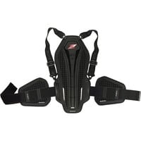                                                                                           |                                                                                           

## Modèles à 188,45 € :

 | Modèle | Photos |
|---|---|
|                                                                                           **ALPINESTARS - NUCLEON KR 2**                                                                                                                                                                                                                                                                                                                                                                               **Lieu de fabrication :**                                                                                             Inconnu                                                                                                                                                                                        **De bonnes présentations :**                                                                                            [ Youtube : RevZilla - Alpinestars-Nucleon-KR-2-Adventure-Touring-Back-Protector-Review-at-RevZilla-com](https://www.youtube.com/watch?v=nEVParfN2nk)                                                                                                                                                                                        **Prix en ligne au moment de la rédaction :**                                                                                            - [188,45 € (dafymoto)](https://www.dafy-moto.com/recherche?string=ALPINESTARS%20NUCLEON%2020KR%20202)                                                                                            - [Rechercher (fcmoto)](https://www.fc-moto.de/epages/fcm.sf/fr_FR/?ViewAction=FacetedSearchProducts&SearchString=ALPINESTARS+NUCLEON+KR+2)                                                                                            - [Rechercher (motardinn)](https://www.tradeinn.com/motardinn/fr?products_search%5Bquery%5D=ALPINESTARS+NUCLEON+KR+2)                                                                                            - [Rechercher (motoblouz)](https://www.motoblouz.com/recherche.html?q=ALPINESTARS+NUCLEON+20KR+202)                                                                                                                                                                                        **Aide à la recherche :**                                                                                            *Rechercher en occasion (~20-40 €)*                                                                                            [ Leboncoin](https://www.leboncoin.fr/recherche?text=moto+ALPINESTARS+NUCLEON+KR+2&shippable=1&sort=price&order=asc) [ Vinted](https://www.vinted.fr/catalog?search_text=moto+ALPINESTARS+NUCLEON+KR+2&order=price_low_to_high) *Recherches diverses :*                                                                                            [ Google](https://www.google.com/search?q=moto+ALPINESTARS+NUCLEON+KR+2) [ Youtube](https://www.youtube.com/results?search_query=moto+ALPINESTARS+NUCLEON+KR+2)                                                                                            |                                                                                           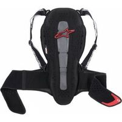                                                                                           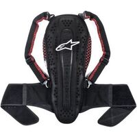                                                                                           |                                                                                           
|                                                                                           **ALPINESTARS - NUCLEON KR 3**                                                                                                                                                                                                                                                                                                                                                                               **Lieu de fabrication :**                                                                                             Inconnu                                                                                                                                                                                                                                                                                   **De bonnes présentations :**                                                                                            [ Youtube : RevZilla - Alpinestars-Nucleon-KR-3-Back-Protector-Review-at-RevZilla-com](https://www.youtube.com/watch?v=tvDWoB4O6Cw)                                                                                              **Prix en ligne au moment de la rédaction :**                                                                                            - [188,45 € (dafymoto)](https://www.dafy-moto.com/recherche?string=ALPINESTARS%20NUCLEON%2020KR%20203)                                                                                                                                                                                      - [Rechercher (fcmoto)](https://www.fc-moto.de/epages/fcm.sf/fr_FR/?ViewAction=FacetedSearchProducts&SearchString=ALPINESTARS+NUCLEON+KR+3)                                                                                            - [Rechercher (motardinn)](https://www.tradeinn.com/motardinn/fr?products_search%5Bquery%5D=ALPINESTARS+NUCLEON+KR+3)                                                                                            - [Rechercher (motoblouz)](https://www.motoblouz.com/recherche.html?q=ALPINESTARS+NUCLEON+20KR+203)                                                                                                                                                                                        **Aide à la recherche :**                                                                                            *Rechercher en occasion (~20-40 €)*                                                                                            [ Leboncoin](https://www.leboncoin.fr/recherche?text=moto+ALPINESTARS+NUCLEON+KR+3&shippable=1&sort=price&order=asc) [ Vinted](https://www.vinted.fr/catalog?search_text=moto+ALPINESTARS+NUCLEON+KR+3&order=price_low_to_high) *Recherches diverses :*                                                                                            [ Google](https://www.google.com/search?q=moto+ALPINESTARS+NUCLEON+KR+3) [ Youtube](https://www.youtube.com/results?search_query=moto+ALPINESTARS+NUCLEON+KR+3)                                                                                            |                                                                                           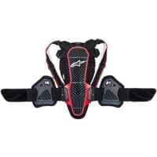                                                                                           |                                                                                           

## Modèles plus en vente :

 | Modèle | Photos |
|---|---|
|                                                                                           **FORCEFIELD - PRO SUB 4K**                                                                                                                                                                                                                                                                                    **Lieu de fabrication :**                                                                                             Inconnu                                                                                                                                                                                        **Aide à la recherche :**                                                                                            *Rechercher en occasion :*                                                                                            [ Leboncoin](https://www.leboncoin.fr/recherche?text=moto+FORCEFIELD+PRO+SUB+4K&shippable=1&sort=price&order=asc) [ Vinted](https://www.vinted.fr/catalog?search_text=moto+FORCEFIELD+PRO+SUB+4K&order=price_low_to_high) *Recherches diverses :*                                                                                            [ Google](https://www.google.com/search?q=moto+FORCEFIELD+PRO+SUB+4K) [ Youtube](https://www.youtube.com/results?search_query=moto+FORCEFIELD+PRO+SUB+4K)                                                                                            |                                                                                           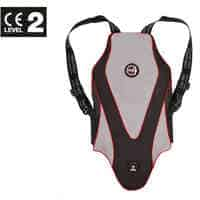                                                                                           |                                                                                           

