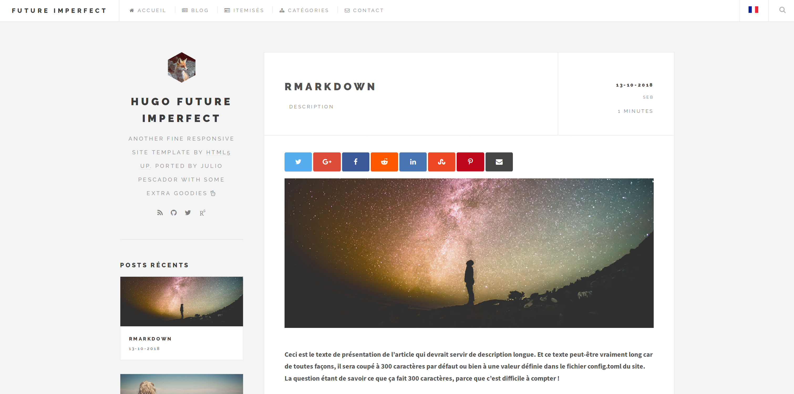
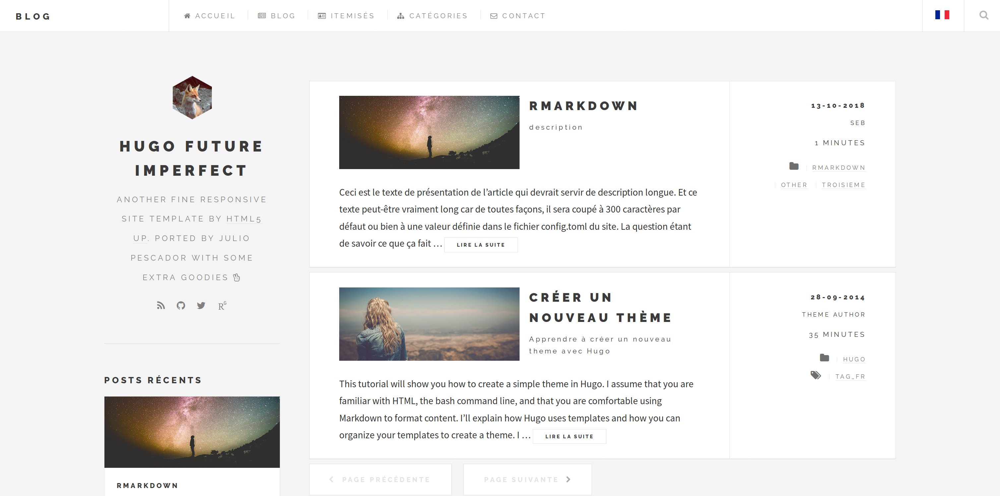
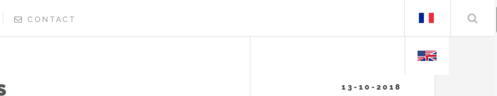
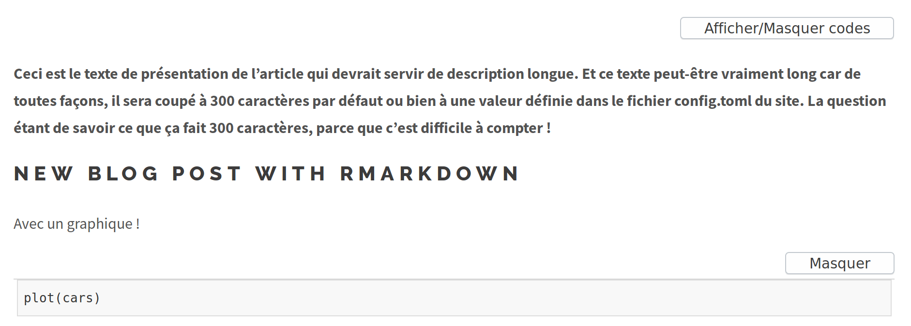
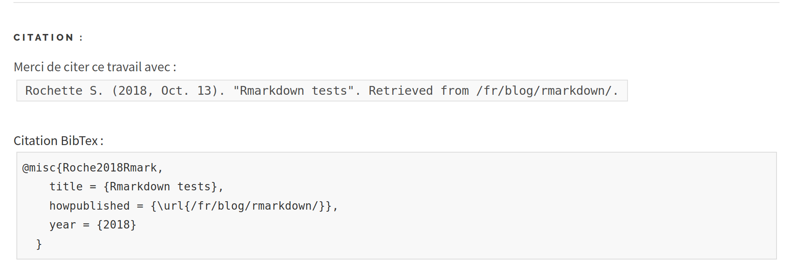
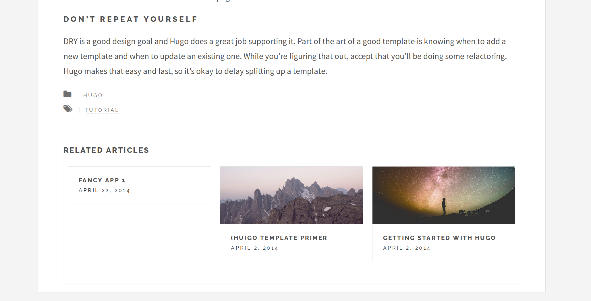

```{r setup, include=FALSE}
knitr::opts_chunk$set(echo = TRUE)
```

# Hugo Future Imperfect

Future Imperfect is a responsive theme tailored for blogging. The name is of no
coincidence, because it is a port of [HTML5 UP's theme](http://html5up.net/future-imperfect)
by the same name. In addition to the original features, there are more features
that have been added for you to utilize by [jpescador](https://github.com/jpescador), [pacollins](https://github.com/pacollins), [statnmap](https://github.com/statnmap) and [other project contributors](https://github.com/statnmap/hugo-future-imperfect/graphs/contributors)

Noteworthy features of this Hugo theme are the integration of a comment-system powered by **Disqus**, **multilingual** support and **language switch**, **syntax highlighting** and **code folding** for source code, **how-to-cite card** and **related articles** sections on bottom of articles, **contact form**.


   

Check out this [website](https://marionlouveaux.fr) if you are interested in seeing a live example with all features added by [statnmap](https://github.com/statnmap).


## Table of Contents

<!-- TOC depthFrom:2 depthTo:6 withLinks:1 updateOnSave:1 orderedList:0 -->

- [Table of Contents](#table-of-contents)
- [Getting Started](#getting-started)
	- [exampleSite](#examplesite)
	- [config.toml](#configtoml)
	- [Hugo's Built-In Server](#hugos-built-in-server)
- [Shortcodes](#shortcodes)
	- [fancybox](#fancybox)
	- [img-post](#img-post)
	- [img-fit](#img-fit)
	- [url-link](#url-link)
- [Syntax highlighting](#syntax-highlighting)
- [Multilanguage](#multilingual)
- [Code Folding](#code-folding)
- [Citation](#citation)
- [Related articles](#related-articles)
- [Contact form](#contact-form)
- [Website SEO](#website-seo)
- [About the Author](#about-the-author)
- [License](#license)

<!-- /TOC -->

## Getting Started

Run the following commands in your Hugo site directory:

```
mkdir themes
cd themes
git clone https://github.com/statnmap/hugo-future-imperfect.git
```

You will then have access to the theme at _themes/hugo-future-imperfect_ from within
your project folder.

### exampleSite

Within the hugo-future-imperfect folder, there will be a folder in this theme called
_exampleSite_. The structure of the folder will look like this:

```
exampleSite
├── config.toml
├── staticman.yml
├── content
|   ├── about
|   |   └── _index.md
|   ├── blog
|   │   ├── creating-a-new-theme.md
|   │   ├── goisforlovers.md
|   │   ├── hugoisforlovers.md
|   │   └── migrate-from-jekyll.md
|   ├── contact
|   │   └── _index.md
|   └── itemized
|       ├── item1.md
|       ├── item2.md
|       ├── item3.md
|       └── item4.md
├── data
│   └── comments
│       └── .gitkeep
└── static
    ├── css
    │   └── add-on.css
    ├── img
    |   ├── 2014
    |   |   ├── 04
    |   |   |   ├── pic02.jpg
    |   |   |   └── pic03.jpg
    |   |   └── 09
    |   |       └── pic01.jpg
    |   └── main
    |       └── logo.jpg
    └── js
        └── add-on.js
```

Copy _config.toml_ from _exampleSite_ to the root directory of your Hugo site.
If you want static comments hosted by [Staticman](https://staticman.net/), also
copy the _staticman.yml_.

### config.toml

This file is the main sorce of customization within the theme. Each parameter has
a comment included to explain its functionality. Typical usage of _true_ means to
turn a function on, while _false_ means to turn a function off.

This file consists of six main sections. The first section contains the site wide
parameters innate to Hugo. The second section, _[params]_, contains site wide
parameter that are custom to the _hugo-future-imperfect_ theme. The third section,
_[params.staticman]_ controls how staticman comments interact with your repository.
The fourth section, _[params.intro]_ and _[params.postAmount]_, control aspects
of the sidebar. The fifth section, _[[menu.main]]_, sets the navigation menu items.
Lastly, the sixth section, _[social]_, allows you to easily link to, and include,
various social platforms.

### Hugo's Built-In Server

Run the following command to start a local server and to view a live version of
the website:

```
hugo server
```

You will then be able to view your live website at [localhost:1313](http://localhost:1313).

## Shortcodes
In addition to the native [Hugo shortcodes](https://gohugo.io/extras/shortcodes/),
the theme also includes the following codes that I hope you find useful:
fancybox, img-post, img-fit, and url-link.

### fancybox
[Fancybox](http://fancyapps.com/fancybox/3/) is a jQuery lightbox script for displaying images, videos and more. It is touch
enabled, responsive and fully customizable. The commands are shown below:

**Named**
```

```

**Positional**
```

```

Please refer to _layouts/shortcodes/fancybox.html_ for more details on the function.

Credit: [pacollins]

---

### img-post
Add an image which can be aligned center, left, or right. The commands are shown
below:

**Named**
```

```

**Positional**
```

```

Please refer to _layouts/shortcodes/img-post.html_ for more details on the function.

Credit: [jpescador]

---

### img-fit
Insert multiple images with the ability to create a gallery if needed. The command
is shown below:

**Positional Only**
```
    
```

Please refer to _layouts/shortcodes/img-fit.html_ for more details on the function.

Credit: [jpescador]

---

### url-link
Create a hyperlink and set a target value for the link. The default value is
`_blank`. The command is shown below:

**Positional Only**
```

```

Please refer to _layouts/shortcodes/url-link.html_ for more details on the function.

Credit: [jpescador]

## Syntax highlighting

Syntax highlighting for code is allowed with `highlight.js`. This can be disabled in the `config.toml`. Version, additional languages, CDN and theme can also be modified.

```
    disable_highlight = false
    highlightjsVersion = "9.11.0"
    highlightjsCDN = "//cdn.bootcss.com"
    highlightjsLang = ["r", "yaml"]
    highlightjsTheme = "github"
```

Credit: [yihui], [statnmap]

## Multilingual

You don't blog in English and you want to translate the theme into different language? No problem. Take a look in the `i18n` folder and you'll find a file `en.toml` that we've copied at the beginning. It contains all strings related to the theme. Copy this file, change the name so that it reflects the translation language (like `fr.toml`) and modify the strings needed.

A language switcher is also available with multilingual website activated. You can add png images of flags named 'lang.png' in 'static/flags' folder, for new languages other than English and French.

The `config.toml` file in `exampleSite` proposes menus for a second language (French). However, as no posts, itemized or contacts are saved with `.fr.md` extension in this exampleSite, menu items may redirect to the `404 not found` page.

If you only have one language for your website, you can remove every `Languages`, `Languages.en` and `Languages.fr` occurences. Simple `[menu.main]` have to be used instead.




Credit: [statnmap]

## Code folding

Code folding is enabled by default with `disable_codefolding = false` in parameters of the `config` file. It uses some javascript libraries of [bootstrap](https://getbootstrap.com/docs/3.3/javascript/). Code folding (multilingual) buttons only appear when there is code in the document rendered from `Rmd` in blogdown. `disable_codefolding` can also be used in each article config header. Similarly, you can define if code blocks are shown or hidden by default using `codefolding_show = "hide"` in the config file or in each article config.  
The list of `<pre>` blocks on which to apply code folding is defined in the `config` file: 
`codeblocks = ["pre.sourceCode", "pre.r", "pre.python"]`
 

 
Credit: [statnmap]

## Citation

As for [Radix](https://rstudio.github.io/radix/), a citation field can be added to blog posts. Citation is enabled by default with `disable_citation = false` in parameters of the `config` file. It can also be enabled or disabled in each blog post with `disable_citation` in the post YAML / TOML. By default author comes from blog `author` field in the article header but `citation_author` overrides this field if another writing is needed. `citation_author` can be specified globally in `config` file but also for each blog post.    
Code is adapted from: Yihan Wu. (2018-12-21). "Blogdown - shortcode for radix-like Bibtex". Retrieved from https://www.yihanwu.ca/post/blogdown-shortcode-generation-for-bibtex/.



Credit: [statnmap]

## Related articles

You can define parameters for related articles at the bottom of blog posts.

```
[related]
  # Only include matches with rank >= threshold. This is a normalized rank between 0 and 100.
  threshold = 50
  # To get stable "See also" sections we, by default, exclude newer related pages.
  includeNewer = true
  # Will lower case keywords in both queries and in the indexes.
  toLower = true
[[related.indices]]
name = "keywords"
weight = 150
[[related.indices]]
name  = "author"
toLower = true
weight = 30
[[related.indices]]
name  = "tags"
weight = 100
[[related.indices]]
name  = "date"
weight = 10
pattern = "2006"
```

See <https://gohugo.io/content-management/related/> for more informations.



Credit: [statnmap]

## Contact form

Since this page will be static, you can use formspree.io as proxy to send the actual email. Each month, visitors can send you up to one thousand emails without incurring extra charges. Begin the setup by following the steps below:

1. Enter your email address under ‘emailservice’ in contact/index.md file
2. Upload the generated site to your server
3. Send a dummy email yourself to confirm your account
4. Click the confirm link in the email from formspree.io
5. You’re done. Happy mailing!

Credit: [statnmap]

## Website SEO

This theme support SEO elements for your website.
It was adapted and integrated thanks to the following guide:  
[https://keithpblog.org/post/hugo-website-seo/](https://keithpblog.org/post/hugo-website-seo/)

Credit: [statnmap]

## About the Authors

Hugo Future Imperfect was ported by [Julio Pescador](https://jpescador.com). Extra
features implemented by the [project contributors](https://github.com/statnmap/hugo-future-imperfect/graphs/contributors).

Send Julio Pescador a tweet [@julio_pescador](https://twitter.com/julio_pescador), if you like the theme and are using it for your own personal use.  
Send StatnMap a tweet [@statnmap](https://twitter.com/statnmap), if you like the modifications of the theme and are using it for your own personal use.

## License

This theme is released under the MIT license. Please read the [license](https://github.com/jpescador/hugo-future-imperfect/blob/master/LICENSE.md) for more information.

[jpescador]: https://github.com/jpescador
[pacollins]: https://github.com/pacollins
[statnmap]: https://github.com/statnmap
[yihui]: https://github.com/yihui
